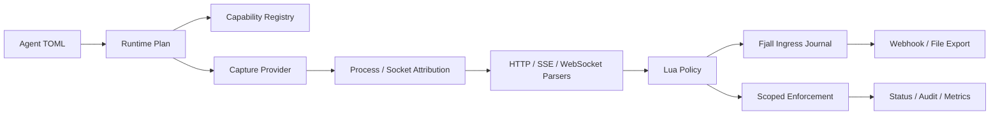

# Probe

[简体中文](README_ZH.md)

Probe is a Linux process-level traffic probe for security telemetry, protocol
visibility, and controlled enforcement.

It observes traffic on the host, ties it back to processes and sockets, parses
protocol semantics, evaluates policy, persists evidence, and exports structured
events. It is built for servers where packet mirrors, special hardware,
sidecars, or application SDKs are not the right deployment model.

Probe is developer-ready for controlled Linux environments. It is not a
one-command production appliance yet: privileged live capture, transparent
interception, and MITM deployments still need deliberate host setup and
operator-owned trust decisions.

## Why Probe

Most network security systems begin with packets. Probe begins with the
process.

That changes the model:

- traffic is useful only when it can be attributed to a process, socket,
  direction, and runtime capability;
- TLS visibility is not one feature, because uprobe plaintext, key log/session
  material, plaintext feeds, and explicit MITM have different trust boundaries;
- enforcement must be scoped, so the host can be observed broadly while deeper
  interception or blocking applies only to selected applications;
- policy and export need typed evidence, not opaque packet dumps that hide loss
  and fallback.

Probe exposes capability gaps and degraded evidence instead of pretending that
best-effort capture is complete.

## What Works Today

- Capture:
  replay, plaintext JSONL feed, typed capture-event feed, libpcap live capture,
  and eBPF-capability path selection when object paths and host prerequisites
  are present.
- Attribution:
  best-effort procfs process/socket attribution with explicit degraded states
  for races, permissions, PID reuse, and namespace gaps.
- TLS visibility:
  TLS 1.3 key log/session-secret material, libssl uprobe plaintext sidecar,
  plaintext bridge feeds, and explicit MITM proxy TLS termination.
- Protocols:
  HTTP/1.x request/response/body events, SSE events, WebSocket upgrade handoff,
  frame metadata, and bounded message metadata.
- Policy:
  Lua policy bundles, typed verdicts, local and remote policy sources, runtime
  error audit, and admin-triggered reloads.
- Enforcement:
  audit-only, dry-run, scoped TCP connection destroy, transparent interception
  lifecycle, and proxy-side policy hook delegation.
- MITM proxy:
  selector-scoped inbound TPROXY and outbound transparent MITM with first-party
  product proxy HTTP/1.1 TLS relay, host routes, opt-in DNS discovery,
  WebSocket tunnel coverage, plaintext feed, and delegated deny responses.
- Storage:
  Fjall-backed ingress journal, export queue, per-sink cursors, retention
  controls, and recovery with documented parser-state limits.
- Export:
  webhook and file transports with selectable `none`, `zstd`, `gzip`, or
  `deflate` compression.
- Operations:
  capability reports, runtime plan validation, JSON status snapshots, health,
  metrics, admin socket, and E2E profiles.

## How It Fits Together



The central event contract is `EventEnvelope`. It carries origin, provenance,
flow/process context, degradation state, enforcement evidence, and typed event
payloads. The same contract is used by policy, durable storage, export,
runtime status, and tests.

## Safety Model

Probe does not silently promote weak evidence into strong guarantees:

- payload gaps, provider loss, fallback, and unsupported runtime capabilities
  are represented as degraded events, capability states, metrics, and status;
- destructive enforcement is disabled by default;
- real connection enforcement requires explicit configuration, selector match,
  an allowed protective action, live-host evidence, and backend capability;
- Linux socket destroy runs only after capability checks and a live socket
  self-test, revalidates the current procfs socket owner, and then invokes the
  trusted system `ss -K` path for existing TCP sockets;
- transparent interception and MITM are explicit strategies with separate
  readiness, self-bypass, client-trust, material, lifecycle, and audit
  contracts.

## Choose A Run Mode

- Replay:
  re-process captured JSONL input through parser, policy, spool, and export
  paths. It needs no live-capture privilege and uses `agent replay ...`.
- Plaintext feed:
  use deterministic plaintext input for development, tests, SDKs, or bridges.
  Configure `capture.selection = "plaintext_feed"`.
- Capture-event feed:
  accept typed `CaptureEvent` JSONL from MITM bridges or external collectors.
  Configure `capture.selection = "capture_event_feed"`.
- Libpcap live:
  capture host traffic when eBPF is unavailable or not configured. It needs
  root or CAP_NET_RAW and uses `capture.selection = "libpcap"` or auto fallback.
- eBPF process observation:
  use kernel-assisted process-aware capture. It needs root/bpffs, a built eBPF
  object, and `capture.ebpf.object_path`.
- TLS plaintext sidecar:
  attach best-effort libssl plaintext instrumentation. It needs root/bpffs,
  a built eBPF object, and `tls.plaintext.instrumentation`.
- Transparent interception:
  steer scoped inbound/outbound connections. It needs root/net-admin and
  `enforcement.interception`.
- L7 MITM product proxy:
  terminate scoped TLS, relay upstream traffic, emit plaintext bridge events,
  and delegate proxy-side policy decisions. It needs root/net-admin,
  operator-managed client trust, and `enforcement.interception.mitm`.

## Build

Requirements:

- Linux with procfs;
- Rust stable with edition 2024 support;
- `libpcap` development package for libpcap live capture;
- root or matching Linux capabilities for privileged live capture,
  eBPF, socket destroy, transparent interception, or MITM tests;
- nightly Rust with `rust-src` and `bpf-linker` when building eBPF objects.

Build the main binaries:

```bash
cargo build -p agent -p xtask --locked
```

Build the first-party MITM proxy and test fixture when running MITM E2E cases:

```bash
cargo build -p agent -p e2e-fixture -p mitm-proxy -p xtask --locked
```

Build eBPF artifacts:

```bash
rustup toolchain install nightly --component rust-src
cargo install bpf-linker
cargo run -p xtask --locked -- ebpf-build
```

After building eBPF artifacts, point the agent configuration at the generated
object path, for example `capture.ebpf.object_path` for process observation or
`tls.plaintext.instrumentation.libssl_uprobe_object_path` for libssl plaintext
instrumentation.

## First Run

Inspect host capabilities:

```bash
cargo run -p agent --locked -- capabilities
```

Validate the safe example configuration:

```bash
cargo run -p agent --locked -- check --config examples/agent.toml
```

Inspect the runtime status that the example would produce:

```bash
cargo run -p agent --locked -- status --config examples/agent.toml
```

The example is intentionally conservative. It uses `capture.selection = "auto"`,
audit-only enforcement, no MITM, no destructive backend, and no exporter sink.
Status may report unavailable live capture or missing spool directories until
host permissions and paths are configured.

Run a non-privileged plaintext pipeline E2E:

```bash
cargo run -p xtask --locked -- e2e-plaintext-feed
```

Run WebSocket parser coverage through plaintext input:

```bash
cargo run -p xtask --locked -- e2e-websocket-plaintext-feed
```

Run a privileged libpcap loopback E2E:

```bash
sudo target/debug/xtask e2e-libpcap-loopback
```

## Configuration Guide

Start from [examples/agent.toml](examples/agent.toml). It is commented and safe
by default.

### Capture

Automatic selection tries configured fallback backends in order:

```toml
[capture]
selection = "auto"
fallback_backends = ["ebpf", "libpcap"]

[capture.ebpf]
object_path = "target/ebpf/bpfel-unknown-none/release/ebpf-program"

[capture.libpcap]
interface = "any"
bpf_filter = "tcp"
snaplen = 65535
promisc = false
immediate_mode = true
read_timeout_ms = 1000
```

For controlled plaintext input:

```toml
[capture]
selection = "capture_event_feed"

[capture.capture_event_feed]
path = "/var/lib/probe/capture-events.jsonl"
follow = true
```

### Storage

The spool is required for live runs and export queueing:

```toml
[storage]
path = "/var/lib/traffic-probe/spool"

[storage.retention.ingress]
sweep_interval_ms = 1000
prune_batch_limit = 1024

[storage.retention.export]
sweep_interval_ms = 1000
prune_batch_limit = 1024
```

Ingress recovery replays persisted capture events before opening a new capture
provider. Active parser state is not serialized, so recovery is conservative
and reported as degraded in the capability model.

### Export

Enable the export worker and configure one or more sinks:

```toml
[export.worker]
enabled = true

[export.worker.schedule]
mode = "fixed_interval_bounded"
interval_ms = 1000
batches_per_sink_per_tick = 1
sink_timeout_ms = 10000

[[exporters]]
id = "local-file"
transport = "file"
path = "/var/lib/probe/export.jsonl"
codec = "zstd"

[[exporters]]
id = "primary-webhook"
transport = "webhook"
endpoint = "https://collector.example/probe/batches"
codec = "zstd"
headers = { x_probe_node = "probe-local" }
```

Supported codecs are `none`, `zstd`, `gzip`, and `deflate`; `zstd` is the
default. Webhook sinks can reference TLS trust anchors and client identities
from `[[tls.materials]]`.

### Policy

Policy bundles are normal runtime inputs:

```toml
[[policies]]
id = "app-policy"
enabled = true

[policies.source]
kind = "local_directory"
path = "/etc/probe/policies/app"
```

Enforcement manifests can be local, directory-backed, or remote:

```toml
[enforcement.policy.source]
kind = "remote"
endpoint = "http://127.0.0.1:9000/enforcement.toml"
max_body_bytes = 16777216
```

Manual reloads are available through the admin surface when enabled. Local
manifest watching is opt-in.

### TLS Materials

TLS material references are shared by exporters, TLS decrypt hints, and MITM:

```toml
[[tls.materials]]
id = "collector-ca"
kind = "trust_anchor"
path = "/etc/probe/certs/collector-ca.pem"

[[tls.materials]]
id = "browser-keylog"
kind = "key_log_file"
path = "/var/lib/probe/tls/browser.keys"

[[tls.materials]]
id = "mitm-ca"
kind = "mitm_ca_certificate"
path = "/etc/probe/certs/mitm-ca.pem"

[[tls.materials]]
id = "mitm-ca-key"
kind = "mitm_ca_private_key"
path = "/etc/probe/certs/mitm-ca.key"

[[tls.materials]]
id = "upstream-ca"
kind = "mitm_upstream_trust_anchor"
path = "/etc/probe/certs/upstream-ca.pem"
```

Best-effort libssl plaintext instrumentation is explicit. Configure a selector
to avoid broad attachment; omitting the selector lets the provider consider
every attachable libssl process:

```toml
[tls.plaintext.instrumentation]
enabled = true
libssl_uprobe_object_path = "/opt/probe/ebpf-tls-plaintext"
reconcile_interval_ms = 1000

[tls.plaintext.instrumentation.selector]
op = "match"

[tls.plaintext.instrumentation.selector.term.process]
pids = []
names = []
exe_path_globs = ["/usr/bin/curl"]
cmdline_regexes = []
systemd_services = []
container_ids = []

[tls.plaintext.instrumentation.selector.term.traffic]
local_ports = []
remote_ports = [443]
directions = []
remote_addresses = []
```

### Enforcement And MITM

Enforcement starts in audit-only mode:

```toml
[enforcement]
mode = "audit_only"
backend = "none"
```

Dry-run can exercise planner decisions without a destructive backend. Connection
enforcement should configure a selector to avoid broad matches; if no selector
is configured, policy triggers can match broadly. Enforce mode applies only when
a policy allows the protective action and the configured backend supports it.
Transparent interception setup additionally requires an explicit local selector.
Linux socket destroy closes existing TCP sockets only; it is not pre-connect
deny or UDP blocking.

Selectors combine process and traffic dimensions:

```toml
[enforcement.interception.selector]
op = "match"

[enforcement.interception.selector.term.process]
pids = []
names = []
exe_path_globs = ["/usr/bin/curl"]
cmdline_regexes = []
systemd_services = []
container_ids = []

[enforcement.interception.selector.term.traffic]
local_ports = []
remote_ports = [443]
directions = []
remote_addresses = []
```

Transparent MITM is a separate, explicit strategy. It requires root/net-admin,
operator-managed client trust, certificate material refs, proxy listener
settings, backend readiness, plaintext bridge configuration, and a scoped
selector. The fragment below shows an inbound product-proxy shape:

```toml
[enforcement]
mode = "enforce"

[enforcement.interception]
strategy = "inbound_tproxy_mitm"

[enforcement.interception.proxy]
mode = "external"
self_bypass = "none"
listen_port = 15001

[enforcement.interception.mitm]
ca_certificate_ref = "mitm-ca"
ca_private_key_ref = "mitm-ca-key"
upstream_trust_anchor_refs = ["upstream-ca"]

[enforcement.interception.mitm.client_trust]
mode = "operator_managed"

[enforcement.interception.mitm.backend]
mode = "product_proxy"

[enforcement.interception.mitm.backend.process]
program = "/usr/local/bin/traffic-probe-mitm-proxy"

[[enforcement.interception.mitm.backend.process.upstream_routes]]
host = "service.example.com"
target = "127.0.0.1:18443"

[enforcement.interception.mitm.backend.readiness_probe]
target = "127.0.0.1:15001"

[enforcement.interception.mitm.plaintext_bridge]
mode = "capture_event_feed"
path = "/var/lib/probe/mitm-feed.jsonl"
follow = true

[enforcement.interception.mitm.policy_hook]
mode = "http_json"
endpoint = "http://127.0.0.1:15002/mitm-policy-hook"
```

The first-party product proxy supports exact and suffix-wildcard upstream
routes. Opt-in DNS discovery can be used as a fallback and rejects IANA
special-purpose/special-use addresses by default unless explicitly allowed.
CA-backed dynamic certificate mode requires downstream clients to send DNS SNI.
When upstream TLS is enabled, the agent-managed product proxy uses the
reconciled SNI as the upstream TLS server name. A fixed upstream target cannot
be combined with route tables or DNS discovery. Host/SNI mismatches fail closed;
route misses can fall through explicit DNS discovery before falling back to the
recovered target.

## Operations

The `agent` binary exposes five operational commands:

```bash
agent capabilities
agent check --config ./agent.toml
agent status --config ./agent.toml
agent run --config ./agent.toml
agent replay \
  --input ./traffic.jsonl \
  --spool ./spool \
  --direction outbound \
  --policy ./policy.bundle
```

`capabilities`, `check`, and `status` return JSON designed for automation.
`run` starts the configured live agent. `replay` runs captured input through the
same parser, policy, spool, and export path without live capture privileges.

## Verification

The E2E registry is organized around capability claims:

- `baseline` covers replay, plaintext feed, loss/gap events, HTTP/SSE/WebSocket,
  webhook/file export, and remote policy inputs.
- `live-core`, `process-ebpf`, and `tls-plaintext` cover privileged libpcap,
  admin reload, socket destroy, TLS material auto-binding, eBPF process
  observation, and libssl plaintext lifecycle.
- `transparent-interception` covers inbound TPROXY, outbound transparent proxy,
  MITM plaintext bridge, proxy-side policy hook, product proxy routed/DNS
  HTTPS, and WebSocket tunnel paths.
- `linux-artifacts` and `product` provide Linux artifact acceptance and the
  combined product capability profile.

List E2E cases and profiles:

```bash
cargo run -p xtask --locked -- e2e-suite --list
cargo run -p xtask --locked -- e2e-suite --list-profiles
```

Run the non-privileged baseline:

```bash
cargo run -p xtask --locked -- e2e-suite --profile baseline
```

Run privileged profiles in an isolated development environment:

```bash
sudo target/debug/xtask e2e-suite --profile live-core
sudo target/debug/xtask e2e-suite --profile process-ebpf
sudo target/debug/xtask e2e-suite --profile tls-plaintext
sudo target/debug/xtask e2e-suite --profile transparent-interception
```

Privileged cases may manipulate network namespaces, bpffs, nftables, policy
routing, or live sockets.

## Boundaries

Probe intentionally does not claim the following:

- no default whole-host transparent MITM;
- no automatic client trust store mutation;
- no HTTP/2, HTTP/3, or QUIC parser yet;
- no strong original attribution for every MITM path;
- no non-HTTP transparent allow-path matrix beyond covered WebSocket tunnel
  behavior;
- no pre-connect deny, UDP blocking, or payload-level blocking through Linux
  socket destroy;
- no hidden long-term raw traffic retention;
- no claim that best-effort live capture is complete when the runtime reports
  degraded evidence.

The detailed design source, capability facts, and verification matrix are in
[docs/design.md](docs/design.md).

## Repository Layout

- `crates/core`:
  shared event contracts, selectors, process/flow identity, verdicts, and
  capability model.
- `crates/config`:
  TOML configuration model and validation.
- `crates/runtime`:
  runtime plan model and capability validation.
- `crates/capture`:
  capture providers, eBPF/libpcap paths, TLS plaintext bridge, and capture
  evidence.
- `crates/parsers`:
  parser traits and HTTP/SSE/WebSocket implementations.
- `crates/policy`:
  Lua policy runtime and event views.
- `crates/enforcement`:
  scoped enforcement planner and backend/hook contracts.
- `crates/pipeline`:
  capture-to-parser-to-policy-to-spool execution pipeline.
- `crates/agent`:
  runtime composition, config loading, status/admin surfaces, and live agent.
- `crates/storage`:
  Fjall durable spool and cursor-backed queues.
- `crates/exporter`:
  export batch, codecs, webhook transport, and file transport.
- `crates/mitm-proxy`:
  first-party L7 MITM product proxy.
- `crates/transparent-linux`:
  Linux transparent interception artifact planning.
- `crates/xtask`:
  end-to-end validation harness.
- `examples/agent.toml`:
  commented safe-default agent configuration.
- `docs/design.md`:
  Chinese design source and verification matrix.

## Contributing

High-value contributions improve one of these properties:

- stronger process or socket attribution;
- clearer capability and degradation reporting;
- safer enforcement boundaries;
- protocol coverage through the existing parser traits;
- durable export transports;
- high-signal E2E coverage.

Before opening a change:

```bash
cargo fmt --all -- --check
cargo clippy --workspace --locked --all-targets -- -D warnings
cargo test --workspace --locked
```

## License

Licensed under either of:

- Apache License, Version 2.0 ([LICENSE-APACHE](LICENSE-APACHE))
- MIT License ([LICENSE-MIT](LICENSE-MIT))

at your option.
