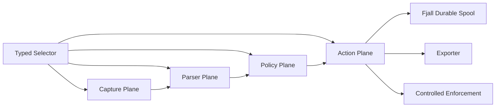

# Probe

[简体中文](README_ZH.md)

Probe is a Linux process-level traffic probe for security telemetry and
controlled enforcement.
It observes application traffic on the host, attributes it to processes and
sockets, parses protocol semantics, evaluates policy, and exports durable
evidence for detection, audit, and controlled enforcement.

It is designed for environments where dedicated hardware, packet mirroring,
sidecars, or application SDKs are not a good fit. The agent runs on the host,
discovers what the kernel and runtime can support, and reports every downgrade
instead of pretending that best-effort capture is complete.

## Why Probe Exists

Most network security tools start with packets. Probe starts with the process.

That difference matters when the goal is to protect real applications:

- A payload is useful only when it can be tied back to the process, socket,
  direction, and runtime capability that produced it.
- TLS visibility is not a single feature. uprobe plaintext, key log/session
  secret material, plaintext feeds, and explicit MITM backends have different
  trust, coverage, and failure boundaries.
- Enforcement must be scoped. The system should be able to observe the host
  while applying deeper parsing or blocking only to selected applications.
- Policy engines need structured evidence, not raw packet dumps with hidden
  loss.

Probe treats these as first-class design constraints.

## Architecture

Probe separates capture, parsing, policy, and action into independent planes.
They share typed selectors and event contracts, but each plane has its own
responsibility and failure boundary.



The central event contract is `EventEnvelope`. It carries origin, provenance,
flow/process context, degradation state, enforcement evidence, and typed event
payloads. This makes loss, fallback, and capability gaps visible to policy,
exporters, status APIs, and tests.

## Capabilities

| Area | What Probe Provides |
| --- | --- |
| Capture | eBPF-first live capture, libpcap fallback, external plaintext feed, capture-event feed, and replay. |
| Attribution | procfs process and socket attribution with explicit best-effort boundaries. |
| TLS plaintext | libssl uprobe plaintext, TLS 1.3 key log/session secret material, auto-binding, plaintext bridge paths, and explicit MITM proxy TLS termination. |
| Protocols | HTTP/1.x request/response/body events, SSE events, WebSocket upgrade handoff, frame metadata, and 16 MiB bounded message metadata. |
| Policy | Lua policy hooks, typed verdicts, policy bundle loading, remote policy bundle support, and manual admin reload. |
| Enforcement | audit-only, dry-run, scoped connection enforcement, Linux socket destroy backend, transparent interception lifecycle, and proxy-side policy hook. |
| Storage | Fjall-backed ingress journal and export queue. |
| Export | Spool-backed webhook/file exporters with selectable compression. |
| Operations | Capability matrix, runtime plan validation, status snapshots, health, metrics, and admin surfaces. |

## Safety Model

Probe does not silently upgrade weak evidence into strong guarantees.

- Payload gaps, provider loss, fallback, and unsupported runtime capabilities
  are represented as degraded events, capability states, metrics, and status.
- Destructive enforcement is not enabled by default.
- Real connection enforcement requires explicit configuration, selector match,
  allowed protective action, live-host evidence, and backend capability.
- Linux socket destroy verifies the current procfs socket owner before invoking
  a trusted system `ss -K` path.
- Transparent interception and L7 MITM are explicit strategies with separate
  readiness, self-bypass, client-trust, material, lifecycle, and audit
  contracts.

## L7 MITM And Proxy Integration

Probe reserves MITM for explicit, scoped deployments. It supports inbound
TPROXY and outbound transparent proxy lifecycle planning, external or
agent-managed backend contracts, capture-event plaintext bridge provenance,
explicit operator-managed client trust, product proxy downstream TLS
termination with static leaf material or CA-backed dynamic SNI certificates,
upstream TLS relay with native roots or imported trust anchors, strategy-specific
target recovery, outbound upstream socket-mark bypass, and a loopback HTTP JSON
policy hook for proxy-side enforcement delegation.
The first-party product proxy also has a transparent inbound HTTPS E2E path:
TPROXY routes the client connection to the proxy, the proxy terminates
downstream TLS with CA-backed dynamic SNI certificates, delegates a protective
decision to the HTTP JSON hook, routes explicit allow-path hosts to configured
upstream targets, emits plaintext bridge events, returns proxy-side responses,
and records durable delegated decisions.
CA-backed dynamic certificate mode requires downstream TLS clients to send DNS
SNI. When upstream TLS is enabled, the product proxy uses that SNI as the
upstream TLS server name unless an explicit upstream server name is pinned; it
can also use the reconciled SNI or HTTP Host to select an explicit
host-to-upstream route. Host/SNI mismatches fail closed, and route misses fall
back to the configured or recovered target.
The first-party `product_proxy` backend derives its proxy CLI from typed MITM
readiness, bridge, policy hook, CA or leaf TLS material refs, upstream trust
material refs, and host route tables.

This keeps MITM out of the default capture path while still allowing operators
to build controlled proxy/MITM deployments with auditable boundaries.

## Current Boundaries

Probe is Linux-only. The main target is a modern server distribution with
procfs, libpcap, eBPF support, and standard networking tools.

The following are intentional boundaries of the current implementation:

- No default whole-host transparent MITM.
- No automatic mutation of client trust stores; MITM client trust is an explicit
  operator-managed contract.
- Transparent inbound HTTPS MITM is covered for product proxy routed allow and
  deny paths. ALPN-aware routing, wildcard or DNS-discovered upstream route
  selection, strong original attribution, automatic trust-store mutation, and
  non-HTTP transparent allow-path matrices remain explicit capability
  boundaries.
- No hidden long-term raw traffic retention.
- No HTTP/2, HTTP/3, or QUIC parser yet.
- WebSocket support emits handoff, frame metadata, and 16 MiB bounded
  text/binary message metadata. Oversized messages keep frame metadata and
  omit `websocket_message`; full message storage and extension decompression
  are out of scope.
- Linux socket destroy closes existing TCP sockets only. It is not pre-connect
  deny, UDP blocking, or payload-level blocking.
- Some live capture paths remain best-effort by nature and expose that through
  event evidence and capability reporting.

This README is the default English project entry point. The full design source
is currently maintained in Chinese at [docs/design.md](docs/design.md), with
detailed capability facts, boundaries, and the verification matrix.

## Quick Start

Requirements:

- Linux
- Rust stable with edition 2024 support
- `libpcap` development package for libpcap live capture
- root or the relevant Linux capabilities for privileged live/eBPF/interception
  tests
- eBPF object builds additionally require the nightly Rust toolchain with
  `rust-src` and the latest stable `bpf-linker`

Build the workspace:

```bash
cargo build --workspace --locked
```

Inspect runtime capabilities from the default configuration:

```bash
cargo run -p agent --locked -- capabilities
```

Run a non-privileged end-to-end plaintext pipeline test:

```bash
cargo run -p xtask --locked -- e2e-plaintext-feed
```

Run a WebSocket plaintext pipeline test:

```bash
cargo run -p xtask --locked -- e2e-websocket-plaintext-feed
```

Run a privileged libpcap loopback test:

```bash
cargo build -p agent -p e2e-fixture -p xtask --locked
sudo target/debug/xtask e2e-libpcap-loopback
```

Build eBPF artifacts before running eBPF process observation or libssl uprobe
plaintext profiles. The live agent still requires the relevant object path to
be configured explicitly, for example `capture.ebpf.object_path` for process
observation:

```bash
rustup toolchain install nightly --component rust-src
cargo install bpf-linker
cargo run -p xtask --locked -- ebpf-build
```

Run the full default E2E suite:

```bash
cargo run -p xtask --locked -- e2e-suite
```

Privileged profiles require root/CAP_NET_RAW, root/bpffs, or root/net-admin
depending on the selected case.

## CLI Shape

The agent binary exposes the main operational surfaces:

```bash
cargo run -p agent --locked -- capabilities
```

`check` and `status` require a config path. The repository includes a safe,
commented example configuration:

```bash
cargo run -p agent --locked -- check --config examples/agent.toml
cargo run -p agent --locked -- status --config examples/agent.toml
```

Default status may report unavailable live capture or spool resources until the
host permissions and storage paths are configured.

Adapt the example for the host's storage, capture, policy, and exporter
settings before starting a live agent:

```bash
cargo run -p agent --locked -- run --config examples/agent.toml
```

Replay mode can parse captured input into the same policy, spool, and export
pipeline:

```bash
cargo run -p agent --locked -- replay \
  --input ./traffic.jsonl \
  --spool ./spool \
  --direction outbound \
  --policy ./policy.bundle
```

## Repository Layout

| Path | Purpose |
| --- | --- |
| `crates/core` | Shared event contracts, selectors, process/flow identity, verdicts, and capability model. |
| `crates/config` | TOML configuration model and validation. |
| `crates/runtime` | RuntimePlan model and plan validation. |
| `crates/capture` | Capture providers, eBPF/libpcap paths, TLS plaintext bridges, and capture evidence. |
| `crates/parsers` | Protocol parser abstractions and HTTP/SSE/WebSocket implementations. |
| `crates/policy` | Lua policy runtime and event views. |
| `crates/enforcement` | Scoped enforcement planner and backend/hook contracts. |
| `crates/pipeline` | Capture-to-parser-to-policy-to-spool execution pipeline and runtime metrics. |
| `crates/agent` | Runtime composition, config loading, status/admin surfaces, live agent, and integrations. |
| `crates/storage` | Fjall durable spool and cursor-backed queues. |
| `crates/exporter` | Export batch, codec, webhook, and file transports. |
| `crates/transparent-linux` | Linux transparent interception artifact planning. |
| `crates/xtask` | End-to-end validation harness. |
| `examples/agent.toml` | Commented safe-default agent configuration. |
| `docs/design.md` | Chinese design source, capability facts, boundaries, and verification matrix. |

## Verification

The project favors executable evidence over aspirational claims. The E2E
registry covers replay/plaintext feed, libpcap loopback, eBPF process
observation, TLS plaintext hooks, TLS material auto-binding,
HTTP/SSE/WebSocket parsing, webhook/file export, policy reload, enforcement
reload, transparent interception, MITM plaintext bridge, and proxy-side policy
hook paths.

Use the `xtask` registry to run individual cases or profiles. Privileged cases
should be run in an isolated development environment because they manipulate
network namespaces, bpffs, nftables, policy routing, or live sockets.

```bash
cargo run -p xtask --locked -- e2e-suite --list
cargo run -p xtask --locked -- e2e-suite --list-profiles
cargo run -p xtask --locked -- e2e-suite --profile live-core
```

## Contributing

The project values maintainable systems work over narrow feature patches.
Useful contributions usually improve one of these properties:

- stronger process or socket attribution;
- clearer capability and degradation reporting;
- safer enforcement boundaries;
- protocol parser coverage through the existing parser traits;
- durable export transports;
- high-signal E2E coverage.

Before opening a change, run:

```bash
cargo fmt --all -- --check
cargo clippy --workspace --locked --all-targets -- -D warnings
cargo test --workspace --locked
```

## License

Licensed under either of:

- Apache License, Version 2.0 ([LICENSE-APACHE](LICENSE-APACHE))
- MIT License ([LICENSE-MIT](LICENSE-MIT))

at your option.
