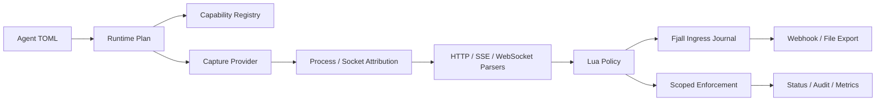

# Probe

[English](README.md)

Probe 是一个 Linux 进程级网络流量探针，用于安全遥测、协议可见性和受控防护。

它在主机上观测流量，将流量关联到进程和 socket，解析协议语义，执行策略判断，
持久化证据，并导出结构化事件。它适合无法依赖旁路镜像、专用硬件、sidecar
或业务 SDK 的服务器环境。

Probe 已经可以在受控 Linux 环境中用于开发和验证，但还不是一键式生产 appliance。
privileged live capture、transparent interception 和 MITM 部署仍需要明确的主机配置
和 operator 管理的信任决策。

## 为什么需要 Probe

很多网络安全系统从 packet 开始建模。Probe 从 process 开始建模。

这会改变系统边界：

- 流量只有能归因到进程、socket、方向和运行时能力时才真正有价值；
- TLS 可见性不是单一功能，uprobe 明文、key log/session material、plaintext feed
  和显式 MITM 拥有不同的信任边界；
- 防护必须有作用域，可以广泛观测主机，但只对选中的应用启用深度拦截或阻断；
- policy 和 export 需要 typed evidence，而不是隐藏丢失和 fallback 的原始包转储。

Probe 会暴露 capability gap 和 degraded evidence，不把 best-effort 采集伪装成完整观测。

## 当前可用能力

- Capture：
  replay、plaintext JSONL feed、typed capture-event feed、libpcap live capture，
  以及在 object path 和主机前置条件满足时的 eBPF capability path selection。
- Attribution：
  best-effort procfs process/socket attribution，并对 race、权限、PID reuse、
  namespace gap 给出 degraded state。
- TLS visibility：
  TLS 1.3 key log/session-secret material、libssl uprobe plaintext sidecar、
  plaintext bridge feed 和显式 MITM proxy TLS termination。
- Protocol：
  HTTP/1.x request/response/body event、SSE event、WebSocket upgrade handoff、
  frame metadata 和有界 message metadata。
- Policy：
  Lua policy bundle、typed verdict、本地和远程 policy source、runtime error audit
  和 admin-triggered reload。
- Enforcement：
  audit-only、dry-run、scoped TCP connection destroy、transparent interception
  lifecycle 和 proxy-side policy hook delegation。
- MITM proxy：
  selector-scoped inbound TPROXY 与 outbound transparent MITM；first-party
  product proxy 支持 HTTP/1.1 TLS relay、host route、opt-in DNS discovery、
  WebSocket tunnel、plaintext feed 和 delegated deny response。
- Storage：
  Fjall-backed ingress journal、export queue、per-sink cursor、retention controls，
  以及带明确 parser-state 边界的 recovery。
- Export：
  webhook 和 file transport，并支持 `none`、`zstd`、`gzip`、`deflate` 压缩选择。
- Operations：
  capability report、RuntimePlan validation、JSON status snapshot、health、metrics、
  admin socket 和 E2E profile。

## 系统结构



核心事件契约是 `EventEnvelope`。它携带 origin、provenance、flow/process context、
degradation state、enforcement evidence 和 typed event payload。policy、durable storage、
export、runtime status 和测试都使用同一契约。

## 安全模型

Probe 不会把弱证据静默提升为强保证：

- payload gap、provider loss、fallback 和 unsupported runtime capability 都会表现为
  degraded event、capability state、metric 和 status；
- destructive enforcement 默认关闭；
- 真实 connection enforcement 需要显式配置、selector match、允许的 protective action、
  live-host evidence 和 backend capability；
- Linux socket destroy 只有在 capability check 和 live socket self-test 通过后才会执行，
  并会重新复核当前 procfs socket owner，再通过受信系统路径 `ss -K` 关闭已存在 TCP
  socket；
- transparent interception 和 MITM 是显式 strategy，并拥有独立的 readiness、self-bypass、
  client-trust、material、lifecycle 和 audit contract。

## 选择运行模式

- Replay：
  将已捕获 JSONL 输入重新经过 parser、policy、spool 和 export。不需要 live-capture
  权限，使用 `agent replay ...`。
- Plaintext feed：
  用确定性 plaintext input 做开发、测试、SDK 或 bridge integration。配置
  `capture.selection = "plaintext_feed"`。
- Capture-event feed：
  接收 MITM bridge 或外部采集器输出的 typed `CaptureEvent` JSONL。配置
  `capture.selection = "capture_event_feed"`。
- Libpcap live：
  在 eBPF 不可用或未配置时采集主机流量。需要 root 或 CAP_NET_RAW，使用
  `capture.selection = "libpcap"` 或 auto fallback。
- eBPF process observation：
  使用内核辅助的 process-aware capture。需要 root/bpffs、built eBPF object 和
  `capture.ebpf.object_path`。
- TLS plaintext sidecar：
  attach best-effort libssl plaintext instrumentation。需要 root/bpffs、built eBPF object
  和 `tls.plaintext.instrumentation`。
- Transparent interception：
  对 scoped inbound/outbound connection 做 steering。需要 root/net-admin 和
  `enforcement.interception`。
- L7 MITM product proxy：
  对 scoped TLS 做 termination、upstream relay、plaintext bridge event 输出和
  proxy-side policy delegation。需要 root/net-admin、operator-managed client trust 和
  `enforcement.interception.mitm`。

## 构建

前置条件：

- Linux 和 procfs；
- 支持 edition 2024 的 Rust stable；
- libpcap live capture 需要 `libpcap` development package；
- privileged live capture、eBPF、socket destroy、transparent interception 或 MITM 测试需要
  root 或对应 Linux capability；
- 构建 eBPF object 需要带 `rust-src` 的 nightly Rust 和 `bpf-linker`。

构建主 binary：

```bash
cargo build -p agent -p xtask --locked
```

运行 MITM E2E 时构建 first-party MITM proxy 和 fixture：

```bash
cargo build -p agent -p e2e-fixture -p mitm-proxy -p xtask --locked
```

构建 eBPF artifact：

```bash
rustup toolchain install nightly --component rust-src
cargo install bpf-linker
cargo run -p xtask --locked -- ebpf-build
```

构建完成后，在 agent 配置中显式填写 object path，例如 process observation 使用
`capture.ebpf.object_path`，libssl plaintext instrumentation 使用
`tls.plaintext.instrumentation.libssl_uprobe_object_path`。

## 第一次运行

查看主机能力：

```bash
cargo run -p agent --locked -- capabilities
```

校验安全默认示例配置：

```bash
cargo run -p agent --locked -- check --config examples/agent.toml
```

查看示例配置会生成的 runtime status：

```bash
cargo run -p agent --locked -- status --config examples/agent.toml
```

示例配置刻意保守：`capture.selection = "auto"`、audit-only enforcement、禁用 MITM、
不配置 destructive backend，也不配置 exporter sink。在主机权限和路径未配置前，
status 可能会如实报告 live capture 或 spool directory unavailable。

运行非特权 plaintext pipeline E2E：

```bash
cargo run -p xtask --locked -- e2e-plaintext-feed
```

通过 plaintext input 验证 WebSocket parser：

```bash
cargo run -p xtask --locked -- e2e-websocket-plaintext-feed
```

运行 privileged libpcap loopback E2E：

```bash
sudo target/debug/xtask e2e-libpcap-loopback
```

## 配置指南

从 [examples/agent.toml](examples/agent.toml) 开始。该文件带注释，并且默认安全。

### Capture

自动选择会按顺序尝试配置的 fallback backend：

```toml
[capture]
selection = "auto"
fallback_backends = ["ebpf", "libpcap"]

[capture.ebpf]
object_path = "target/ebpf/bpfel-unknown-none/release/ebpf-program"

[capture.libpcap]
interface = "any"
bpf_filter = "tcp"
snaplen = 65535
promisc = false
immediate_mode = true
read_timeout_ms = 1000
```

受控 plaintext 输入可以使用 capture-event feed：

```toml
[capture]
selection = "capture_event_feed"

[capture.capture_event_feed]
path = "/var/lib/probe/capture-events.jsonl"
follow = true
```

### Storage

live run 和 export queue 需要 spool：

```toml
[storage]
path = "/var/lib/traffic-probe/spool"

[storage.retention.ingress]
sweep_interval_ms = 1000
prune_batch_limit = 1024

[storage.retention.export]
sweep_interval_ms = 1000
prune_batch_limit = 1024
```

ingress recovery 会在打开新 capture provider 前 replay 已持久化的 capture event。
active parser state 不会序列化，因此 recovery 是保守能力，并在 capability model 中报告为 degraded。

### Export

启用 export worker 并配置一个或多个 sink：

```toml
[export.worker]
enabled = true

[export.worker.schedule]
mode = "fixed_interval_bounded"
interval_ms = 1000
batches_per_sink_per_tick = 1
sink_timeout_ms = 10000

[[exporters]]
id = "local-file"
transport = "file"
path = "/var/lib/probe/export.jsonl"
codec = "zstd"

[[exporters]]
id = "primary-webhook"
transport = "webhook"
endpoint = "https://collector.example/probe/batches"
codec = "zstd"
headers = { x_probe_node = "probe-local" }
```

支持的 codec 是 `none`、`zstd`、`gzip` 和 `deflate`；默认是 `zstd`。
webhook sink 可以引用 `[[tls.materials]]` 中的 trust anchor 和 client identity。

### Policy

Policy bundle 是普通 runtime input：

```toml
[[policies]]
id = "app-policy"
enabled = true

[policies.source]
kind = "local_directory"
path = "/etc/probe/policies/app"
```

Enforcement manifest 可以来自本地文件、目录或远程 endpoint：

```toml
[enforcement.policy.source]
kind = "remote"
endpoint = "http://127.0.0.1:9000/enforcement.toml"
max_body_bytes = 16777216
```

启用 admin surface 后可以手动 reload。local manifest watcher 需要显式开启。

### TLS Materials

TLS material reference 会被 exporter、TLS decrypt hint 和 MITM 共享：

```toml
[[tls.materials]]
id = "collector-ca"
kind = "trust_anchor"
path = "/etc/probe/certs/collector-ca.pem"

[[tls.materials]]
id = "browser-keylog"
kind = "key_log_file"
path = "/var/lib/probe/tls/browser.keys"

[[tls.materials]]
id = "mitm-ca"
kind = "mitm_ca_certificate"
path = "/etc/probe/certs/mitm-ca.pem"

[[tls.materials]]
id = "mitm-ca-key"
kind = "mitm_ca_private_key"
path = "/etc/probe/certs/mitm-ca.key"

[[tls.materials]]
id = "upstream-ca"
kind = "mitm_upstream_trust_anchor"
path = "/etc/probe/certs/upstream-ca.pem"
```

best-effort libssl plaintext instrumentation 必须显式开启。应配置 selector 来避免过宽
attachment；省略 selector 时，provider 会考虑所有可 attach 的 libssl process：

```toml
[tls.plaintext.instrumentation]
enabled = true
libssl_uprobe_object_path = "/opt/probe/ebpf-tls-plaintext"
reconcile_interval_ms = 1000

[tls.plaintext.instrumentation.selector]
op = "match"

[tls.plaintext.instrumentation.selector.term.process]
pids = []
names = []
exe_path_globs = ["/usr/bin/curl"]
cmdline_regexes = []
systemd_services = []
container_ids = []

[tls.plaintext.instrumentation.selector.term.traffic]
local_ports = []
remote_ports = [443]
directions = []
remote_addresses = []
```

### Enforcement 与 MITM

Enforcement 默认从 audit-only 开始：

```toml
[enforcement]
mode = "audit_only"
backend = "none"
```

dry-run 可以在没有 destructive backend 的情况下验证 planner decision。Connection enforcement
应配置 selector，避免过宽匹配；如果没有配置 selector，policy trigger 可能会宽范围命中。
enforce mode 只有在 policy 允许 protective action 且已配置 backend 支持该动作时才会应用。
transparent interception setup 额外要求显式 local selector。Linux socket destroy 只关闭已存在
的 TCP socket；它不是 pre-connect deny，也不是 UDP blocking。

Selector 由 process 和 traffic 维度组合：

```toml
[enforcement.interception.selector]
op = "match"

[enforcement.interception.selector.term.process]
pids = []
names = []
exe_path_globs = ["/usr/bin/curl"]
cmdline_regexes = []
systemd_services = []
container_ids = []

[enforcement.interception.selector.term.traffic]
local_ports = []
remote_ports = [443]
directions = []
remote_addresses = []
```

Transparent MITM 是独立显式 strategy。它需要 root/net-admin、operator-managed client trust、
certificate material refs、proxy listener 设置、backend readiness、plaintext bridge 配置和
scoped selector。下面的片段展示 inbound product-proxy 形态：

```toml
[enforcement]
mode = "enforce"

[enforcement.interception]
strategy = "inbound_tproxy_mitm"

[enforcement.interception.proxy]
mode = "external"
self_bypass = "none"
listen_port = 15001

[enforcement.interception.mitm]
ca_certificate_ref = "mitm-ca"
ca_private_key_ref = "mitm-ca-key"
upstream_trust_anchor_refs = ["upstream-ca"]

[enforcement.interception.mitm.client_trust]
mode = "operator_managed"

[enforcement.interception.mitm.backend]
mode = "product_proxy"

[enforcement.interception.mitm.backend.process]
program = "/usr/local/bin/traffic-probe-mitm-proxy"

[[enforcement.interception.mitm.backend.process.upstream_routes]]
host = "service.example.com"
target = "127.0.0.1:18443"

[enforcement.interception.mitm.backend.readiness_probe]
target = "127.0.0.1:15001"

[enforcement.interception.mitm.plaintext_bridge]
mode = "capture_event_feed"
path = "/var/lib/probe/mitm-feed.jsonl"
follow = true

[enforcement.interception.mitm.policy_hook]
mode = "http_json"
endpoint = "http://127.0.0.1:15002/mitm-policy-hook"
```

first-party product proxy 支持 exact 和 suffix-wildcard upstream route。
opt-in DNS discovery 可以作为 fallback；默认拒绝 IANA special-purpose/special-use address，
除非 operator 显式允许。
CA-backed dynamic certificate mode 要求下游 client 发送 DNS SNI。启用 upstream TLS 时，
agent-managed product proxy 会使用 reconcile 后的 SNI 作为 upstream TLS server name。固定
upstream target 不能和 route table 或 DNS discovery 组合。Host/SNI mismatch 会 fail
closed；route 未命中时，可以先经过显式 DNS discovery，再回退 recovered target。

## 运维入口

`agent` binary 暴露五个运维命令：

```bash
agent capabilities
agent check --config ./agent.toml
agent status --config ./agent.toml
agent run --config ./agent.toml
agent replay \
  --input ./traffic.jsonl \
  --spool ./spool \
  --direction outbound \
  --policy ./policy.bundle
```

`capabilities`、`check` 和 `status` 返回适合自动化消费的 JSON。`run` 启动 live agent。
`replay` 不需要 live capture 权限，会把输入接入同一 parser、policy、spool 和 export 路径。

## 验证

E2E registry 按能力声明组织：

- `baseline` 覆盖 plaintext feed、loss/gap event、HTTP/SSE/WebSocket、
  webhook/file export 和 remote policy input。
- `live-core`、`process-ebpf` 和 `tls-plaintext` 覆盖 privileged libpcap、admin reload、
  socket destroy、TLS material auto-binding、eBPF process observation 和 libssl plaintext
  lifecycle。
- `transparent-interception` 覆盖 inbound TPROXY、outbound transparent proxy、
  MITM plaintext bridge、proxy-side policy hook、product proxy routed/DNS HTTPS 和
  WebSocket tunnel path。
- `linux-artifacts` 和 `product` 提供 Linux artifact acceptance 以及组合 product
  capability profile。

列出 E2E case 和 profile：

```bash
cargo run -p xtask --locked -- e2e-suite --list
cargo run -p xtask --locked -- e2e-suite --list-profiles
```

运行非特权 baseline：

```bash
cargo run -p xtask --locked -- e2e-suite --profile baseline
```

在隔离开发环境中运行 privileged profile：

```bash
sudo target/debug/xtask e2e-suite --profile live-core
sudo target/debug/xtask e2e-suite --profile process-ebpf
sudo target/debug/xtask e2e-suite --profile tls-plaintext
sudo target/debug/xtask e2e-suite --profile transparent-interception
```

privileged case 可能会操作 network namespace、bpffs、nftables、policy routing 或 live socket。

## 边界

Probe 不声明以下能力：

- 默认全机 transparent MITM；
- 自动修改 client trust store；
- HTTP/2、HTTP/3 或 QUIC parser；
- 所有 MITM path 的强原始归因；
- 除已覆盖 WebSocket tunnel 行为以外的 non-HTTP transparent allow-path matrix；
- 通过 Linux socket destroy 实现 pre-connect deny、UDP blocking 或 payload-level blocking；
- 隐藏式长期原始流量保存；
- 在 runtime 已报告 degraded evidence 时仍宣称 best-effort live capture 完整。

详细设计源、能力事实和验证矩阵见 [docs/design.md](docs/design.md)。

## 仓库结构

- `crates/core`：
  共享事件契约、selector、process/flow identity、verdict 和 capability model。
- `crates/config`：
  TOML 配置模型和校验。
- `crates/runtime`：
  Runtime plan model 和 capability validation。
- `crates/capture`：
  Capture provider、eBPF/libpcap 路径、TLS plaintext bridge 和 capture evidence。
- `crates/parsers`：
  Parser trait，以及 HTTP/SSE/WebSocket 实现。
- `crates/policy`：
  Lua policy runtime 和 event view。
- `crates/enforcement`：
  Scoped enforcement planner 和 backend/hook contract。
- `crates/pipeline`：
  capture/parser/policy/spool 执行 pipeline。
- `crates/agent`：
  Runtime composition、config loading、status/admin surface 和 live agent。
- `crates/storage`：
  Fjall durable spool 和 cursor-backed queue。
- `crates/exporter`：
  Export batch、codec、webhook transport 和 file transport。
- `crates/mitm-proxy`：
  First-party L7 MITM product proxy。
- `crates/transparent-linux`：
  Linux transparent interception artifact planning。
- `crates/xtask`：
  端到端验证 harness。
- `examples/agent.toml`：
  带注释的安全默认 agent 配置。
- `docs/design.md`：
  中文设计源和验证矩阵。

## 贡献

高价值贡献通常会增强这些方面：

- 更强的 process/socket attribution；
- 更清晰的 capability 和 degradation reporting；
- 更安全的 enforcement boundary；
- 通过现有 parser trait 扩展协议覆盖；
- durable export transport；
- 高信号 E2E 覆盖。

提交修改前运行：

```bash
cargo fmt --all -- --check
cargo clippy --workspace --locked --all-targets -- -D warnings
cargo test --workspace --locked
```

## License

本项目采用双协议授权，你可以任选其一：

- Apache License, Version 2.0 ([LICENSE-APACHE](LICENSE-APACHE))
- MIT License ([LICENSE-MIT](LICENSE-MIT))
