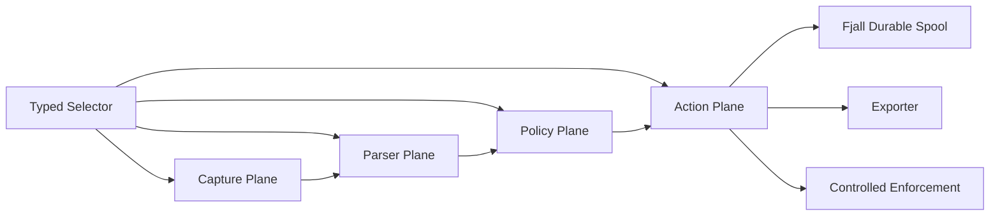

# Probe

[English](README.md)

Probe 是一个面向安全遥测与受控防护的 Linux 进程级网络流量探针。它在主机上观测应用流量，
将流量归因到进程和 socket，解析协议语义，执行策略判断，并把可审计证据持久化后用于检测、
审计和受控防护。

它适合无法依赖旁路镜像、专用硬件、sidecar 或业务 SDK 的环境。Agent 运行在主机上，
根据内核和运行时能力选择可用路径，并把所有降级显式暴露出来，而不是把 best-effort
采集伪装成完整观测。

## 为什么需要 Probe

很多网络安全工具从 packet 开始建模。Probe 从 process 开始建模。

这个差异在保护真实应用时非常关键：

- payload 只有能关联到进程、socket、方向和运行时能力时才真正有用。
- TLS 可见性不是一个单一功能。uprobe 明文、key log/session secret material、
  plaintext feed 和显式 MITM backend 有不同的信任、覆盖和失败边界。
- 防护必须有作用域。系统可以观测全机，但只对选中的应用启用深度解析或阻断。
- 策略引擎需要结构化证据，而不是隐藏丢失和降级的原始包转储。

Probe 把这些约束作为一等设计目标。

## 架构

Probe 将 capture、parser、policy 和 action 拆成四个独立平面。它们共享 typed selector
和事件契约，但各自有清晰职责和失败边界。



核心事件契约是 `EventEnvelope`。它携带 origin、provenance、flow/process context、
degraded 状态、enforcement evidence 和 typed event payload。这样 loss、fallback
和 capability gap 都能被 policy、exporter、status API 和测试看见。

## 能力

| 领域 | Probe 提供的能力 |
| --- | --- |
| Capture | eBPF 优先 live capture、libpcap fallback、external plaintext feed、capture-event feed 和 replay。 |
| Attribution | procfs process/socket attribution，并显式表达 best-effort 边界。 |
| TLS plaintext | libssl uprobe 明文、TLS 1.3 key log/session secret material、auto-binding、plaintext bridge 和显式 MITM proxy TLS termination。 |
| Protocol | HTTP/1.x request/response/body event、SSE event、WebSocket upgrade handoff 和 WebSocket frame metadata。 |
| Policy | Lua policy hook、typed verdict、policy bundle loading、remote policy bundle 和 admin 手动 reload。 |
| Enforcement | audit-only、dry-run、scoped connection enforcement、Linux socket destroy backend、transparent interception lifecycle 和 proxy-side policy hook。 |
| Storage | Fjall-backed ingress journal 和 export queue。 |
| Export | spool-backed webhook/file exporter，并支持可选压缩。 |
| Operations | Capability matrix、RuntimePlan validation、status snapshot、health、metrics 和 admin surface。 |

## 安全模型

Probe 不会把弱证据静默升级成强保证。

- payload gap、provider loss、fallback 和 unsupported runtime capability 都会进入 degraded event、
  capability state、metrics 和 status。
- destructive enforcement 默认不启用。
- 真实 connection enforcement 需要显式配置、selector 命中、protective action 被允许、
  live-host evidence 和 backend capability。
- Linux socket destroy 在调用受信系统路径 `ss -K` 前，会重新复核当前 procfs socket owner。
- transparent interception 和 L7 MITM 是显式 strategy，拥有独立 readiness、self-bypass、
  client-trust、material、lifecycle 和 audit contract。

## L7 MITM 与 Proxy 集成

Probe 将 MITM 作为显式、受作用域约束的部署能力。系统支持 inbound TPROXY 和 outbound
transparent proxy lifecycle planning、external 或 agent-managed backend contract、
capture-event plaintext bridge provenance、显式 operator-managed client trust、
product proxy 下游 TLS termination，以及 loopback HTTP JSON policy hook，用于
proxy-side enforcement delegation。
first-party `product_proxy` backend 会从 typed MITM readiness、bridge、policy hook
和 leaf certificate material refs 生成 proxy CLI。

这让 MITM 不会进入默认采集路径，同时仍允许 operator 构建边界清晰、可审计的
proxy/MITM 部署。

## 当前边界

Probe 只承诺 Linux。主要目标环境是具备 procfs、libpcap、eBPF 支持和标准网络工具的现代
服务器发行版。

当前实现的明确边界：

- 默认不做全机透明 MITM。
- 不自动修改客户端 trust store；MITM client trust 是显式 operator-managed contract。
- 下游 TLS termination 不等于完整透明 HTTPS MITM；upstream TLS relay 和 transparent HTTPS
  end-to-end validation 仍是明确能力边界。
- 不隐藏长期保存原始流量。
- 暂不支持 HTTP/2、HTTP/3 或 QUIC parser。
- WebSocket 支持 handoff 和 frame metadata，不聚合完整 message，也不解压 extension payload。
- Linux socket destroy 只关闭已经存在的 TCP socket；它不是 pre-connect deny、UDP blocking
  或 payload-level blocking。
- 一些 live capture 路径天然是 best-effort，并通过 event evidence 和 capability reporting
  暴露这一点。

默认项目入口是英文 README。完整中文设计源、能力事实、边界和验证矩阵见
[docs/design.md](docs/design.md)。

## 快速开始

前置条件：

- Linux
- 支持 edition 2024 的 Rust stable
- libpcap live capture 需要 `libpcap` development package
- privileged live/eBPF/interception 测试需要 root 或对应 Linux capabilities
- eBPF object 构建额外需要带 `rust-src` 的 nightly Rust toolchain 和最新稳定版 `bpf-linker`

构建 workspace：

```bash
cargo build --workspace --locked
```

查看默认配置下的运行时能力：

```bash
cargo run -p agent --locked -- capabilities
```

运行非特权 plaintext pipeline 端到端测试：

```bash
cargo run -p xtask --locked -- e2e-plaintext-feed
```

运行 WebSocket plaintext pipeline 测试：

```bash
cargo run -p xtask --locked -- e2e-websocket-plaintext-feed
```

运行 privileged libpcap loopback 测试：

```bash
cargo build -p agent -p e2e-fixture -p xtask --locked
sudo target/debug/xtask e2e-libpcap-loopback
```

运行 eBPF process observation 或 libssl uprobe plaintext profile 前，需要先构建 eBPF artifact。
live agent 仍需要显式配置对应 object path，例如 process observation 使用
`capture.ebpf.object_path`：

```bash
rustup toolchain install nightly --component rust-src
cargo install bpf-linker
cargo run -p xtask --locked -- ebpf-build
```

运行默认 E2E suite：

```bash
cargo run -p xtask --locked -- e2e-suite
```

privileged profile 会根据 case 需要 root/CAP_NET_RAW、root/bpffs 或 root/net-admin。

## CLI 形态

Agent binary 暴露主要运维入口：

```bash
cargo run -p agent --locked -- capabilities
```

`check` 和 `status` 需要 config path。仓库提供了一个带注释的安全默认示例配置：

```bash
cargo run -p agent --locked -- check --config examples/agent.toml
cargo run -p agent --locked -- status --config examples/agent.toml
```

在配置主机权限和 storage path 前，默认 status 可能会如实报告 live capture 或 spool
resource unavailable。

启动 live agent 前，应先按主机的 storage、capture、policy 和 exporter 设置调整示例配置：

```bash
cargo run -p agent --locked -- run --config examples/agent.toml
```

Replay mode 可以把输入接入同一 policy、spool 和 export pipeline：

```bash
cargo run -p agent --locked -- replay \
  --input ./traffic.jsonl \
  --spool ./spool \
  --direction outbound \
  --policy ./policy.bundle
```

## 仓库结构

| 路径 | 作用 |
| --- | --- |
| `crates/core` | 共享事件契约、selector、process/flow identity、verdict 和 capability model。 |
| `crates/config` | TOML 配置模型和校验。 |
| `crates/runtime` | RuntimePlan model 和 plan validation。 |
| `crates/capture` | Capture provider、eBPF/libpcap 路径、TLS plaintext bridge 和 capture evidence。 |
| `crates/parsers` | Protocol parser 抽象，以及 HTTP/SSE/WebSocket 实现。 |
| `crates/policy` | Lua policy runtime 和 event view。 |
| `crates/enforcement` | Scoped enforcement planner 和 backend/hook contract。 |
| `crates/pipeline` | capture/parser/policy/spool 执行 pipeline 和 runtime metrics。 |
| `crates/agent` | Runtime composition、config loading、status/admin surface、live agent 和集成层。 |
| `crates/storage` | Fjall durable spool 和 cursor-backed queue。 |
| `crates/exporter` | Export batch、codec、webhook 和 file transport。 |
| `crates/transparent-linux` | Linux transparent interception artifact planning。 |
| `crates/xtask` | 端到端验证 harness。 |
| `examples/agent.toml` | 带注释的安全默认 agent 配置。 |
| `docs/design.md` | 中文设计源、能力事实、边界和验证矩阵。 |

## 验证

项目优先用可执行证据支撑能力声明。E2E registry 覆盖 replay/plaintext feed、libpcap loopback、
eBPF process observation、TLS plaintext hook、TLS material auto-binding、HTTP/SSE/WebSocket
parser、webhook/file export、policy reload、enforcement reload、transparent interception、
MITM plaintext bridge 和 proxy-side policy hook 路径。

可以通过 `xtask` registry 运行单个 case 或 profile。privileged case 会操作 network namespace、
bpffs、nftables、policy routing 或 live socket，建议在隔离开发环境中运行。

```bash
cargo run -p xtask --locked -- e2e-suite --list
cargo run -p xtask --locked -- e2e-suite --list-profiles
cargo run -p xtask --locked -- e2e-suite --profile live-core
```

## 贡献

项目更看重可维护的系统能力，而不是孤立 feature patch。高价值贡献通常会增强以下方面：

- 更强的 process/socket attribution；
- 更清晰的 capability 和 degradation reporting；
- 更安全的 enforcement boundary；
- 通过现有 parser trait 扩展协议覆盖；
- durable export transport；
- 高信号 E2E 覆盖。

提交修改前建议运行：

```bash
cargo fmt --all -- --check
cargo clippy --workspace --locked --all-targets -- -D warnings
cargo test --workspace --locked
```

## License

本项目采用双协议授权，你可以任选其一：

- Apache License, Version 2.0 ([LICENSE-APACHE](LICENSE-APACHE))
- MIT License ([LICENSE-MIT](LICENSE-MIT))
