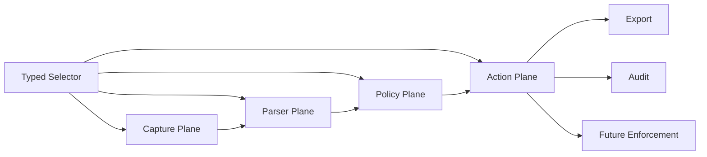
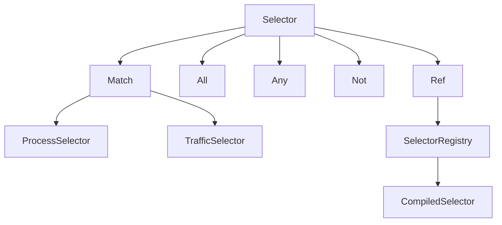
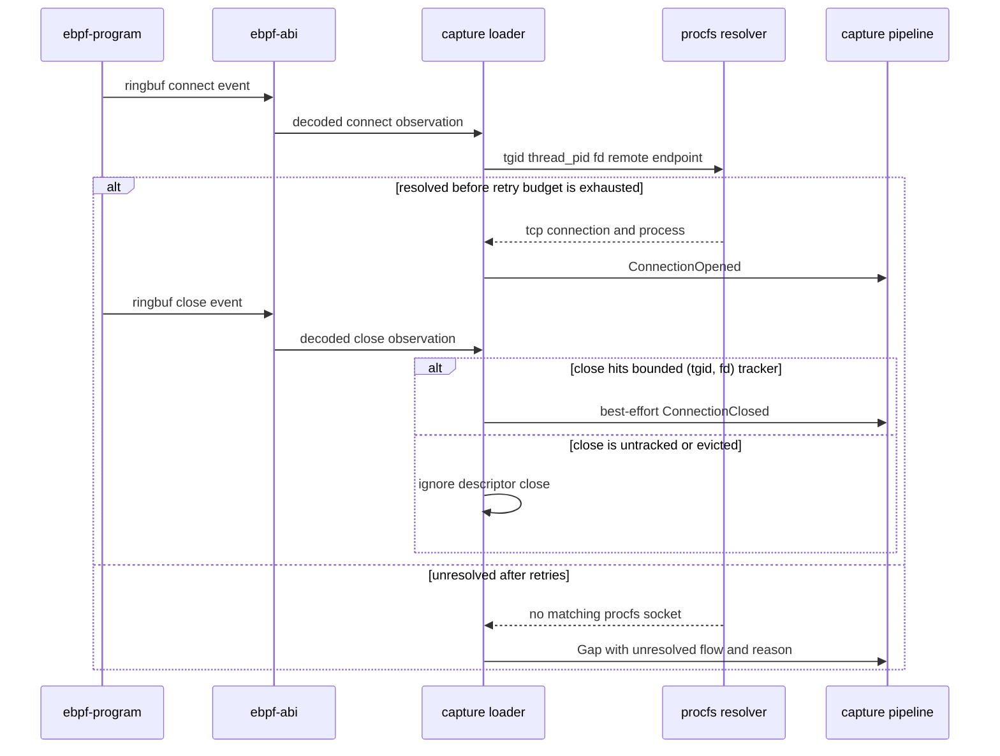
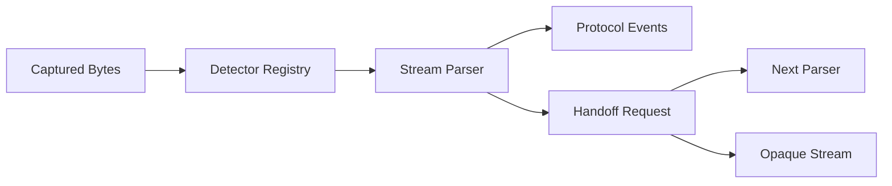
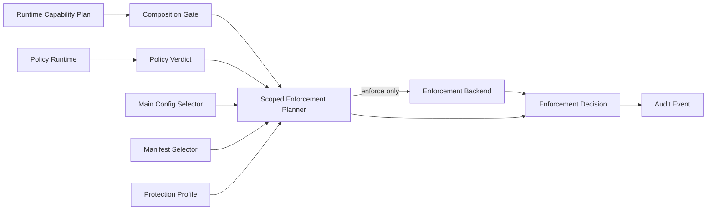
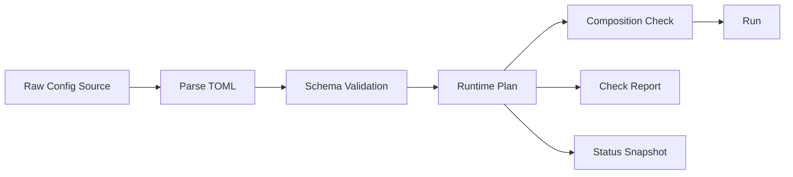
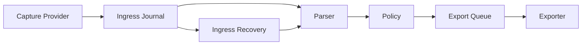

# sssa-probe 进程级流量探针设计文档

## 1. 背景与目标

`sssa-probe` 的目标不是做一个传统抓包工具，而是做一个面向 Linux 主机的进程级流量探针。它需要在支持 eBPF 的机器上优先使用 eBPF 获取强进程归因和高性能采集能力；在 eBPF 不可用或能力不足时，自动降级到 libpcap/procfs 等 fallback 路径，并明确标注能力降级。

本系统的长期方向包括四类能力：

- 进程级流量观测：识别进程、服务、容器、连接和协议语义。
- 加密流量 best effort 明文探测：优先通过非 MITM 路线获取 TLS 明文或会话材料。
- 可扩展协议解析：首要支持 HTTP/1.x 和 SSE，后续自然扩展 WebSocket、HTTP/2、HTTP/3 等协议。
- 策略驱动的检测与防护：首个可用闭环先支持观测、告警和 dry-run verdict，后续接入真实拦截执行。

本文档是架构事实源，同时记录当前实现状态。当前仓库已经进入早期实现阶段：已建立 Rust workspace，完成 replay 驱动的 HTTP/1.x + SSE parser、LuaJIT policy runtime、Fjall ingress journal/export queue、protobuf batch envelope、可选压缩 codec 和 HTTP webhook exporter。`run` 已可按配置启动连续后台 exporter worker 并在退出前做尾部 drain，`replay` 可通过 CLI drain 到独立 webhook sink，`status` 可输出 runtime/admin/metrics 快照。已定义 capture provider、procfs process attribution、runtime config、runtime planning、dry-run enforcement、外部 enforcement policy manifest 和 `EnforcementBackend` 执行边界，并开始接入真实 libpcap fallback、外部明文 feed provider、eBPF build/preflight/contract 边界、libssl uprobe plaintext sample ABI/bridge、显式 Linux socket destroy connection enforcement backend 和 exporter retention deadline。libpcap 已具备 bounded best-effort TCP stream assembly；尚未实现完整 eBPF live provider、TLS uprobe provider loader、keylog/session 解密 provider、eBPF/内核级阻断 backend、完整 TCP 栈级重组/恢复和强进程归因。

## 2. 核心 thesis

这个项目不应该被设计成“抓包工具 + 若干 parser”。更干净的终局模型是四个平面分离：

| 平面 | 负责 | 不负责 |
| --- | --- | --- |
| 采集平面 | 连接、进程、socket、payload chunk、能力来源、gap/degraded 标记。 | 协议语义、业务检测、导出协议、最终阻断策略。 |
| 语义解析平面 | 协议识别、流重组后的解析、协议事件、handoff。 | 采集方式、脚本策略、外发重试、连接阻断。 |
| 策略平面 | selector 命中后的检测、转换、告警、typed verdict。 | 热路径目标选择、系统调用拦截、sink cursor 管理。 |
| 动作平面 | export、dry-run audit、未来 enforce/block/reset/quarantine。 | payload 解析、策略脚本执行、流量归因。 |



这四个平面必须解耦。采集可以默认全机，但深度内容解析、完整 payload、TLS 明文和未来拦截只能对 selector 命中的目标启用。这样可以同时满足：

- 全机可见性。
- 对受管进程/应用的深度观测。
- 对未来“只拦截某些应用”的能力预留。
- 对性能、隐私、资源预算和故障半径的控制。

一个必须避免的坏味道是把“采集过滤”“深度解析目标”“防护目标”做成三套互相漂移的规则语言。它们应该共享一套 typed selector 语义，再由策略或配置声明 observe、detect、enforce 等不同意图。

## 3. 不可妥协原则

- 不静默伪造完整性：任何 payload 缺口、能力缺失、缓冲溢出或 fallback 都必须以 `degraded`、`gap`、`capability` 等字段显式表达。
- 不把 PID 当稳定身份：进程归因必须使用复合身份，避免 PID 复用和长时间运行环境中的误归因。
- 不把证书误称为通用解密能力：现代 TLS 下证书/私钥通常不能解密 ECDHE/TLS 1.3 流量，必须区分 trust material 和 decrypt material。
- 不让策略语言承担热路径预过滤：selector 必须可编译、可索引、可解释；Lua 用于语义检测和 verdict，不用于替代 selector。
- 不为跨平台抽象牺牲 Linux 主线：当前目标只承诺 Linux，充分利用 procfs、cgroup、systemd、eBPF、capabilities。
- 不为了追求“灵活”暴露内部生命周期：Lua 策略可信，但只能访问受控领域 API，不暴露任意 Rust 内部对象、系统动态库或 FFI。
- 不承诺现实中无法同时满足的三元组：有限资源下不能同时保证无限流量不丢、不截断、不影响业务。当前目标采用有界无损与显式降级。

## 4. 当前目标范围

当前硬目标是完成观测闭环：

1. Host Agent 在 Linux 上运行。
2. 通过 selector 命中目标进程或服务。
3. eBPF/socket-first 路径采集连接和明文 HTTP/1.x 字节流。
4. HTTP/1.x parser 输出 request、response、body chunk、SSE 语义事件。
5. Lua 策略消费标准化事件，产生 alert 或 dry-run typed verdict。
6. 事件进入 Fjall-backed durable spool。
7. HTTP(S) webhook batch exporter 将事件发送到测试 receiver。
8. agent 暴露 capability matrix、metrics、health、degraded/gap counters。

额外证明点：

- 单 libssl TLS demo：对一个 OpenSSL/libssl 测试进程，通过 `SSL_set_fd` 建立 `SSL* -> fd` 关联，用 `SSL_clear`/`SSL_free` 维护状态生命周期，并通过 `SSL_read`、`SSL_write`、`SSL_read_ex`、`SSL_write_ex` uprobe 获取明文后接入同一 HTTP parser。
- libpcap fallback demo：eBPF 禁用或不可用时，使用 libpcap 捕获本机明文 HTTP/1.x，procfs best effort 归因，并标记 degraded capability。
- enforcement demo：Lua 策略返回 `deny`、`reset`、`quarantine` 等 typed verdict；默认 `audit_only`/`dry_run` 只记录 requested action、effective action、planner outcome 和 audit event，显式 `enforcement.backend = "linux_socket_destroy"` 可在 root 下对 selector 命中的现有 TCP socket 做 procfs owner 复核后，通过固定系统路径 `ss -K` 执行销毁。

当前明确不做：

- 不默认 MITM。
- 不默认启用真实连接阻断；必须显式选择 enforcement backend。
- 不承诺 Go `crypto/tls`、rustls、Java TLS 的明文覆盖。
- 不聚合完整 WebSocket message，不解压 WebSocket extension payload。
- 不支持 HTTP/2、HTTP/3/QUIC 的完整解析。
- 不实现动态远程控制面、长连接下发或热更新；远程 enforcement manifest 只作为启动/检查阶段的一次性配置 source。
- 不长期保存全量原始流量。

当前实现状态：

- 已实现 replay CLI，用单向输入文件驱动 capture provider、ingress journal、parser、policy、export queue 和可选 webhook exporter。
- 已实现 `probe-core` 的 `TcpEndpoint`/`TcpConnection` 共享模型，供 capture provider、procfs attribution 和后续 eBPF/socket attribution 复用，避免各层用字符串 endpoint 重复建模。
- 已实现 `capture` crate 的 `CaptureProvider` 抽象、`ReplayProvider`、带 typed source provenance 的 `PlaintextEvent`/`PlaintextEventProvider` 和基础 `LibpcapProvider`。`PlaintextEvent` 可表达已解密明文 bytes/gap/connection lifecycle event，并由 `PlaintextSource` 显式区分 `external_plaintext_feed` 与 `libssl_uprobe` 等来源；agent 的 JSON-lines feed 只是 external plaintext adapter，不再把所有明文来源硬编码成 feed。该路径用于让 libssl uprobe、keylog/session decrypt、SDK feed 或 future MITM 等后续 provider 接入同一 pipeline；它本身不执行 TLS 解密。libpcap provider 可打开设备、安装 BPF filter、解析 Ethernet、Linux cooked v1/v2、`RAW`、direct `IPV4`/`IPV6` 和 `NULL`/`LOOP` loopback 上的 IPv4 TCP 与无扩展头 IPv6 TCP segment，接收可插拔 process resolver，并输出 degraded `CapturedBytes`。libpcap stream handling 提供 bounded best-effort 的 per-flow/per-direction 单调 `stream_offset`、有限乱序缓存、重传/overlap 处理、SYN/TCP Fast Open sequence 归一化、显式 `Gap` 和 connection lifecycle event；缓存与 flow 表都有上界，超出能力边界时不会伪装成完整 TCP 重组。事件仍必须标记 degraded：这里不是完整 TCP 栈，不承诺 window/SACK 级恢复、内核 lost-event 反馈、IPv6 extension/fragment 解析、snaplen 截断修复或强归因。
- 已实现 `attribution` crate 的 `ProcfsAttributor` 和 `ProcfsSocketResolver`；前者可从 `/proc/<pid>` 读取进程身份、cmdline hash、starttime、uid/gid、cgroup、systemd service 与 container hint，后者可通过 `/proc/net/tcp`、可读取且可解析时的 `/proc/net/tcp6`、socket inode 和 `/proc/<pid>/fd` best-effort 反查 TCP 连接所属进程。`ProcfsSocketResolver` 还提供 TGID+thread PID+fd 到 `TcpConnection` 的反向解析入口：先读取 `/proc/<thread_pid>/fd/<fd>` 的 socket inode，连接线程已经消失时回退到 `/proc/<tgid>/fd/<fd>`，再用同一份 tcp/tcp6 snapshot 的 inode -> connection 索引匹配连接，并可用 eBPF connect observation 里带出的 remote endpoint 过滤歧义；进程身份仍按 TGID 读取。tcp6 中的 IPv4-mapped endpoint 会归一化为 IPv4，以匹配 libpcap 看到的 IPv4 packet 和 eBPF 归一化后的 remote endpoint；tcp6 缺失、不可读或 malformed 不会拖垮 IPv4 socket attribution 基线。agent 注入的 procfs resolver 使用短 TTL socket snapshot，避免同一批新连接重复全量扫描 `/proc/<pid>/fd`；libpcap provider 在 TCP 生命周期信号、idle eviction、capacity eviction 和端口复用关闭旧 flow 后会使 snapshot 失效，降低拿到旧进程身份的风险。resolver 错误会进入 capture degradation reason，不再静默伪装成未匹配；但单个 PID 的 fd race 或权限拒绝属于 best-effort skip，不让整批 socket snapshot 失败。replay flow 默认使用 synthetic replay identity、保留 PID/TGID `0` 和 0 confidence，避免把文件输入误归因到 agent 进程。
- 已实现 `probe-config` crate 的 TOML runtime config schema，覆盖 capture selection、live capture fallback order、provider-specific nested config、storage、export runtime worker、exporter、TLS material registry、TLS plaintext provider plan 配置、policy、enforcement mode、enforcement policy source 和 admin Unix socket 的第一版结构；配置解析拒绝未知字段，基础字段校验会拒绝 ambiguous external plaintext feed 配置：当前 external plaintext feed 的 source path 归 `capture.plaintext_feed.path` 所有，不能塞进 TLS material/provider 配置。TLS material 路径不能为空；可被 exporter 或 TLS plaintext plan 引用的 material 需要唯一 id，exporter TLS refs 和 `tls.plaintext.key_log_refs` / `tls.plaintext.session_secret_refs` 必须存在并且类型匹配，client certificate refs 与 private key ref 必须在单个 exporter 上成对配置；`libssl_uprobe` plaintext provider 不接受 keylog/session secret refs，因为它依赖运行时 uprobe 事件而不是离线材料。enforcement policy source 支持未配置、文件、目录 manifest 和 remote endpoint。remote endpoint 必须使用 HTTPS，只有 loopback HTTP 可用于本地测试，且 endpoint 中禁止携带 credentials；文件存在性和远程 source 可达性属于 status/check/run 观察面。
- 已实现 `runtime` crate 的 provider descriptor `ProviderRegistry` 与 `RuntimePlan`，由 registry 生成 capability matrix，并基于配置解析 capture backend selection、TLS plaintext plan、export worker effective plan 与 enforcement capability/source plan；`auto` 使用有序 live fallback 列表，显式 backend 表示 required backend，不自动回退；runtime validation 对未实现的安全敏感能力 fail closed；`plaintext_feed` 是独立 plan mode，不伪装成 replay 或 live capture；TLS plaintext plan 现在保留 provider、selector 是否配置、capability requirement、keylog/session secret material refs 的 typed 解析结果，但不打开文件、不 attach uprobe；runtime 不打开或探测 provider，provider probe/open 留在 `agent` composition root。
- 已实现 crate-local `TlsMaterialFileStore` 边界和 filesystem backend；exporter mTLS material 读取、TLS plaintext material `check` 和 status metadata source check 都通过同一路 path-based file store abstraction，而不是各自直接访问文件系统。当前 backend 只支持有界 regular file。
- 已实现 `check` 的 TLS plaintext material 内容核验：对显式引用的 `key_log_file` 通过 `TlsMaterialFileStore` 读取有界 regular file，并按 NSS/SSLKEYLOGFILE 三字段语法解析 label、context 和 secret hex；解析结果和 check report 只输出 entries 与 label counts，不保留 secret bytes，也不在错误中泄漏 secret 字段值。`session_secret_file` 当前只做同一 bounded source read，并以 reserved bytes 摘要出现在 check report 中，等待后续 session secret schema 定义。
- 已实现 `pipeline` crate 的 `CapturePipeline`，负责 capture event -> ingress journal -> per-flow parser -> policy -> enforcement audit -> export queue 的 replay/shared processing；ingress journal 现在写入完整 `CaptureEvent` JSON payload，而不是只写入 bytes payload，因此 bytes、gap、connection opened/closed 都能按 sequence 恢复；`ConnectionClosed` 会先进入 parser 以 flush close-delimited HTTP/1 body，再释放 per-flow parser state；pipeline 支持可选 `max_events` 运行边界，便于对真实 live provider 做有界 smoke；`PipelineRuntimeMetrics` 是 pipeline 运行态计数的 owner，当前覆盖 capture read、ingress journal/recovery/processed、export event writes、policy evaluation/selector miss/alert/verdict 和 enforcement decision outcome counters。`recover_ingress_journal_until_idle` 可从 durable ingress journal 按 sequence 顺序重放 `CaptureEventJson` payload，重新进入 parser/policy/export queue，并且只在 active parser state 已被移除时推进 parser cursor；`agent run` 会在打开 capture provider 之前先执行该恢复，避免 provider 构造失败时 stranded 已落盘输入。该恢复是 best-effort、at-least-once：如果进程在 export 写入之后崩溃，恢复可能重复产出相同语义事件；由于当前 event id 包含新进程内生成的 monotonic timestamp，重复事件不能依赖 event id 自动去重。恢复按当前配置和当前 policy 重新解释旧 ingress event，但不挂载 enforcement planner，避免历史 ingress 触发真实或 dry-run enforcement decision；当前 parser cursor 还不是完整 durable parser checkpoint，processing provenance 也还不完整，因此 capability 必须继续标记 degraded。`agent` binary 负责 CLI wiring、配置读取、provider 探测/构造、spool/policy/parser/enforcement planner/pipeline 组合、连续 exporter worker、replay exporter 命令和状态/metrics 快照输出。
- 已实现 HTTP/1 parser 的 message-role 识别：`Direction` 表示相对归因进程的 inbound/outbound，而 request/response 由 header 语法决定。这样本机服务端收到的 inbound request 会产生 `HttpRequestHeaders`，本机服务端发出的 outbound response 会产生 `HttpResponseHeaders`，不会把进程方向误当 HTTP 角色。parser 已识别 WebSocket HTTP Upgrade，输出 `WebSocketHandoff` 后切换到 WebSocket frame parser；后续字节会输出 `WebSocketFrame` metadata，包括方向、HTTP stream sequence、frame sequence、FIN/RSV/opcode/masked/payload length 和 payload fingerprint。frame payload 以增量 BLAKE3 hash 计算 fingerprint，不为了 metadata 缓存完整 payload。当前不聚合完整 WebSocket message，不解压 extension payload。
- 已实现 configured policy loader 的第一版 bundle 入口：`policies[].path` 指向目录时按 `manifest.toml` + `main.lua` 加载，manifest 目前支持 `id`、`version` 和 typed `hooks`，并要求 manifest id 与配置中的 policy id 一致；`status` 只做 bundle metadata/manifest 校验，不执行 Lua；`check` 和 `run` 会显式加载并执行初始化。裸 Lua 文件仍保留为 legacy source，使用配置 id、配置版本和全量 hook 列表，主要用于平滑迁移与本地调试，不代表长期 policy bundle 格式。
- 已实现 capability matrix，当前状态按下表维护；具体实现细节和验证路径分散在后续对应章节，避免一条段落同时承担所有能力声明。

| Capability | Runtime status | 当前已实现 | 仍缺失 / 降级理由 |
| --- | --- | --- | --- |
| `replay_capture` | Available | replay CLI 和 `ReplayProvider` 可驱动 parser、policy、ingress journal、export queue 和可选 webhook drain。 | 不代表 live capture 能力。 |
| `libpcap` | Probed available/unavailable | agent composition root 按当前 libpcap 配置实际打开设备并安装 filter 后才注入 available descriptor；capture crate 已有 bounded best-effort TCP stream assembler，支持单调 offset、SYN payload sequence 归一化、重传去重、overlap trimming、有限乱序缓存、read-timeout flush、方向关闭边界裁剪、显式 gap 和全局乱序预算约束。 | 仍是 degraded：没有完整 TCP window/SACK 恢复、IPv6 extension/fragment 解析、内核 lost-event 反馈或强归因。 |
| `external_plaintext_feed` | Available | agent JSON-lines feed adapter 可消费外部已解密明文 bytes/gap/connection lifecycle event，转换为 `PlaintextEvent(source = external_plaintext_feed)` 后进入统一 pipeline。 | 它本身不执行 TLS 解密。 |
| `ebpf` | Degraded when explicit and procfs socket attribution is usable / unavailable on failed host, object, contract, or procfs preflight | host probe、`aya-obj` object preflight、strict process artifact contract、shared ABI、kernel connect/close tracepoint observation、userspace `aya` loader、ringbuf decoder、TGID+thread PID+fd lookup 到 `ConnectionOpened` bridge、best-effort descriptor close 到 `ConnectionClosed` lifecycle event、unresolved connect 到 degraded `Gap` 的 provider wiring 已存在。 | 还没有 payload/lost-event conversion 和完整 kernel-side traffic capture program；descriptor close 不是强 socket lifetime，dup/fork/fd passing、process exit 或 lost event 仍可能导致生命周期降级；`auto` 会跳过 degraded eBPF observation provider，显式 `capture.selection = "ebpf"` 可用于 connect/descriptor-close observation smoke。 |
| `procfs_attribution` | Probed degraded/unavailable | 可从 `/proc/<pid>` 读取进程身份、cmdline hash、starttime、uid/gid、cgroup、systemd service 与 container hint。 | hidepid、权限、PID race、namespace 边界会导致 best-effort 降级。 |
| `procfs_socket_attribution` | Probed degraded/unavailable | 可通过 `/proc/net/tcp`、best-effort `/proc/net/tcp6`、socket inode、`/proc/<pid>/fd` 和 TGID+thread PID+fd lookup 做 TCP 连接归因；fd lookup 读取 thread pid 的 fd symlink，按 TGID 读取进程身份；tcp6 IPv4-mapped endpoint 会归一化。 | snapshot 与 fd symlink 读取不是同一内核时间点，权限/race/namespace 仍会导致漏归因；错误进入 degradation reason，不静默伪装成匹配。 |
| `libssl_uprobe` | Unavailable | 已实现 attach candidate discovery 和 attach plan：解析 `/proc/<pid>/maps`、校验 mapped file identity、识别 `SSL_set_fd`、`SSL_clear`、`SSL_free` 与 supported `SSL_read/write` family symbols，生成 PID/library/symbol/program/entry-or-return/role 的 attach intent，并输出 typed degraded reasons；shared ABI 已定义 bounded libssl plaintext sample record、公共 event header decoder、TLS map spec 表、TLS state layout、libssl uprobe spec 表和 ABI revision fail-fast；独立 `ebpf-tls-plaintext` artifact 已包含 `SSL_set_fd`、`SSL_clear`、`SSL_free`、`SSL_read/write`、`SSL_read_ex/write_ex` uprobes/uretprobes、`SSL* -> fd` map、stream offset map、per-CPU event scratch map 和共享 ringbuf producer，`xtask check-ebpf` 会 strict 验证 process/TLS 两个 artifact contract；capture 层已有内部 TLS plaintext sample adapter，可把归一化后的 TLS plaintext sample 经可插拔 flow resolver 转成 `PlaintextEvent(source = libssl_uprobe)` bytes/gap。 | 尚未实现 userspace Aya uprobe loader、动态 attach lifecycle、ringbuf reader 到 internal plaintext provider 的 agent runtime wiring；producer 在缺少 process-generation/lifecycle owner 前不会设置 `FD_VALID`，因此能力仍不可用。 |
| keylog/session decrypt hints | Planned config with explicit check validation | TLS plaintext config/runtime/status plan 可表达 provider、selector、capability requirement、keylog/session secret material refs；`check` 可对显式 `key_log_file` refs 做 SSLKEYLOGFILE 语法核验并输出 secret-free 摘要，`session_secret_file` 暂作 reserved bounded read。 | 尚未实现 keylog/session 解密 provider；check validation 不等同于解密能力；证书/私钥不会被误称为通用解密材料。 |
| `http1` / `sse` / `websocket_handoff` / `websocket_frame` | Available | HTTP/1 parser 已处理 request/response role、body、SSE 和 WebSocket Upgrade handoff；handoff 后切换到 WebSocket frame parser，输出 frame metadata 与 payload fingerprint。 | 不聚合完整 WebSocket message，不解压 extension payload；不支持 HTTP/2、HTTP/3/QUIC。 |
| `lua_jit` | Degraded | LuaJIT policy runtime 已接入 replay/live pipeline，支持 typed alert/verdict。 | hot reload 和多个 active bundle 未实现。 |
| `durable_spool` / `ingress_journal` | Degraded | Fjall ingress journal/export queue 可持久化并恢复 bytes、gap、connection opened/closed capture events。 | 恢复是 at-least-once，按当前 config/policy 重新解释旧 ingress；durable parser checkpoint 与 processing provenance 还不完整。 |
| `export_queue` | Available | export lane、per-sink cursor、schema-aware payload、protobuf batch envelope、record-level `stored_at_unix_ns`，以及按 planned sinks cursor 下界执行的 acked-prefix cleanup 和按 retention deadline 退休过期连续前缀已存在。 | retention 只处理 export queue；ingress journal retention、容量型 retention 和 parser checkpoint 仍未完成。 |
| `webhook_exporter` | Available | `run` 可连续 drain planned sinks，支持固定间隔、全局/每 sink batch 预算、single sink timeout、per-sink exponential backoff、cursor-safe export queue cleanup、retention deadline、trust anchors、client identity refs、在线 admin status 中的 per-sink backoff runtime snapshot，以及 metrics 中的 backing-off sink aggregate count。 | gRPC/Kafka/OTLP 仍是保留 transport。 |
| `dry_run_enforcement` | Available | dry-run enforcement 会记录策略保护意图、requested/effective action 和 audit event。 | 不执行真实连接阻断。 |
| `connection_enforcement` | Available only when explicitly configured and probed | `EnforcementBackend` trait、planner delegation boundary、`RuntimePlan.enforcement.capability`、显式 `enforcement.backend = "linux_socket_destroy"`、固定系统路径 `ss -K` TCP socket destroy backend、执行前 procfs socket owner 复核和 status/backend reporting 已存在。 | 默认 `backend = "none"` 仍 unavailable；Linux socket destroy probe 只确认 Linux、受信系统路径中的 `ss -K` 入口、root 执行上下文和 procfs socket attribution 入口，实际每条 flow 仍可能因事件不是 live host observation、当前 socket owner 无法复核或已不匹配、内核/namespace/匹配窗口返回 `unsupported`；它只支持销毁已存在的 TCP IPv4/IPv6 socket，不提供 pre-connect deny、payload 级阻断、非 TCP 阻断或强规则生命周期。 |

- 已实现 selector AST 的基础形态：`match`、`all`、`any`、`not`、`ref`，命名 selector 通过 registry 编译解析。
- 当前 `FjallSpool` 存储的是带 v2 record envelope 的 `SpoolPayload`；record envelope 包含 `stored_at_unix_ns`、typed schema 和 payload bytes，spool marker 显式写 `sssa-probe-spool-v2`，旧 marker 会 fail fast。代码内使用 `SpoolPayloadSchema` enum，落盘和 protobuf `payload_schema` 字段仍写稳定 wire string。`CaptureEvent` 和 `EventEnvelope.kind` 都是 serde tagged payload enum；`EventType` enum 显式镜像稳定 discriminant，用于 event id、`EventKind::name()` 和 policy hook 映射，并用测试锁住它与 serde `type` tag 的一致性。ingress lane 当前写入 JSON framed `CaptureEvent`，export lane 当前写入 JSON framed `EventEnvelope`。reader 只返回已越过 lane durable high-water sequence 的条目，避免并发 exporter 读到已 commit 但尚未 `SyncAll` 持久化完成的事件；`status` 使用同一 durable high-water 生成 spool/export lag 快照。protobuf batch envelope 通过显式 payload schema 标记该格式。这是过渡契约，不等同于最终 protobuf event envelope。当前 replay 不把文件输入归因到 agent 自身，而使用 synthetic replay identity、保留 PID/TGID `0` 和 0 confidence。

## 5. 部署与平台

部署模型为 Linux Host Agent。agent 默认面向真实主机运行，而不是应用内嵌 SDK，也不是第一阶段的 Kubernetes DaemonSet 专用实现。

平台范围：

- 当前目标只承诺 Linux。
- 主支持面为 RHEL8+/Ubuntu20+ 级别环境。
- RHEL7/CentOS7 这类旧环境允许自动降级到 libpcap/procfs，不把 eBPF 主路径作为硬承诺。
- CPU 架构支持 `x86_64` 和 `aarch64`。

权限模型：

- 现实部署通常会以 root 运行。
- 设计上仍要做 capability discovery，并把长期目标设为最小 capabilities。
- 可能涉及的能力包括 `CAP_BPF`、`CAP_PERFMON`、`CAP_NET_ADMIN`、`CAP_NET_RAW` 等，具体按 runtime capability matrix 判定。
- 不应因为 root 运行就让内部代码随意访问系统能力；高风险能力必须集中在少数边界模块。

## 6. 能力矩阵与降级

启动时 agent 必须生成 capability matrix。它应覆盖：

- 采集能力：eBPF syscall/tracepoint、libpcap fallback、procfs attribution。
- TLS 明文能力：libssl uprobe、keylog/session secret、future MITM provider。
- 协议能力：HTTP/1.x、SSE、WebSocket upgrade detection、WebSocket frame metadata、opaque stream。
- 策略能力：LuaJIT、JIT 状态、policy state API、hot reload。
- 动作能力：dry-run verdict、connection-level enforcement capability boundary、未来 eBPF backend。
- 外发能力：spool-backed exporter、best-effort sink、codec 支持、mTLS。

配置和策略可以声明：

- `required_capabilities`：缺失时策略不启用，或 agent 按配置 fail fast。
- `preferred_capabilities`：缺失时策略降级运行，并产生 degraded 状态。

不允许静默降级。任何能力缺失必须出现在 capability matrix、metrics、admin API 和相关事件 envelope 中；active health 只聚合当前 capture/spool/exporter/policy 执行面的健康度，避免把路线图缺口伪装成运行故障。

## 7. Selector 模型

采集默认全机，但深度观测、完整 payload、TLS 明文 provider 和未来拦截只对 selector 命中的目标启用。

selector 使用 typed DSL，不使用 Lua 直接判断热路径目标。原因：

- selector 需要可索引、可预编译，避免每个事件都进入脚本运行时。
- selector 是能力启用边界，不只是业务策略判断。
- selector 需要可审计、可解释、可在配置检查阶段验证。

selector 应支持的维度：

| 维度 | 示例 | 作用 |
| --- | --- | --- |
| 进程身份 | PID/TGID、进程名、可执行路径 glob、cmdline regex/hash。 | 绑定受管进程和短生命周期任务。 |
| 服务身份 | systemd service、cgroup、container id、namespace。 | 把应用/服务作为稳定防护边界。 |
| 流量身份 | 监听端口、本地端口、远端地址、方向、协议族。 | 限定需要深度解析或防护的连接范围。 |
| 复用与组合 | 命名 selector、`any`、`all`、`not`、`ref`。 | 避免配置复制，允许全局边界和下发边界合成。 |

当前实现采用 AST 形态，而不是把 public model 固化成扁平 AND：

- `match`：叶子 selector，包含 process selector 和 traffic selector。
- `all`：所有子 selector 命中。
- `any`：任一子 selector 命中。
- `not`：对子 selector 取反。
- `ref`：引用 registry 中的命名 selector，编译阶段检测未知引用和循环引用。



selector 热更新语义：

- 新连接按新 selector。
- 已有 flow 在下一个事件阶段重新评估 capability。
- 不回溯补采历史 payload。
- 事件必须携带 `config_version`。

## 8. 进程、连接与时间身份

### ProcessIdentity

进程身份使用复合模型，不以 PID 单独作为稳定主键。

建议字段：

- `pid`、`tgid`。
- `start_time`。
- `boot_id`。
- `exe_path`。
- `cmdline_hash`。
- `uid`、`gid`。
- `cgroup`。
- `systemd_service`。
- `container_id`、`runtime_hint`、`namespace`。

这样可以避免 PID 复用、短生命周期进程和服务级归因混乱。

### FlowIdentity

flow id 也不能只用五元组。

建议使用 composite stable id：

- `boot_id`。
- `process_identity` 摘要。
- socket cookie 或 socket inode。
- 5-tuple。
- start monotonic timestamp。
- agent 内 monotonic sequence。

eBPF 下优先使用 socket cookie；fallback 拿不到时降级为可用字段组合，并标注 confidence。

### 时间模型

事件使用 dual timestamp：

- `monotonic_ns`：用于内部排序、时延、流内顺序。
- `wall_time`：用于外部查询、日志关联、审计展示。

batch/envelope 还应携带 agent `boot_id` 和 clock source 信息。

## 9. eBPF 采集路径

eBPF 技术栈选择 Aya。理由：

- Rust 项目内 eBPF 程序、用户态 agent、共享事件类型可以放在同一个 workspace。
- 更容易保持 Rust 侧类型和构建体验一致。
- 避免当前目标同时维护 C eBPF、clang/bpftool、Rust FFI 的双语言复杂度。
- 内部类型不使用版本后缀这类兼容命名；当前 `EBPF_ABI_REVISION` 只用于 kernel object 与 userspace reader 的 fail-fast 同构校验，不代表已经承诺长期兼容。

主采集策略为 socket/syscall-first，而不是 packet-first 或 proxy-first。

原因：

- 目标是进程级探针，进程、FD、socket、flow 关系必须是一等信息。
- packet-first 更容易拿到网络包，但进程归因和 TLS 明文都更弱。
- proxy-first 可以强化 L7 和拦截，但侵入性高，并且与非 MITM 默认路线冲突。

首批 eBPF attach 点：

- connect/accept/close。
- send/recv/read/write 相关 syscall 或 tracepoint。
- FD、socket、process、flow 关联。
- 暂不把 TC/XDP 作为当前数据面主线。

BTF 或 eBPF 主程序不可用时：

- capability matrix 标记 eBPF unavailable。
- 自动进入 libpcap/procfs fallback。
- required/preferred capability 规则决定策略启用或降级。

当前实现状态按责任边界维护：

| 边界 | 当前已实现 | 仍缺失 |
| --- | --- | --- |
| host probe | agent 检查 Linux、`/sys/kernel/btf/vmlinux`、`/sys/fs/bpf` bpffs、`/proc/sys/kernel/unprivileged_bpf_disabled`。 | 更细的 kernel feature probing、capability 最小化运行策略。 |
| object preflight | `ebpf-object` 使用 `aya-obj` 解析 object，校验 required `SSSA_EVENTS` ringbuf map、`sssa_sys_enter_connect` 与 `sssa_sys_enter_close` tracepoint program、TLS plaintext uprobe/uretprobe programs、TLS state maps、section、map shape、pinning 和同一次 hardened read bytes；通用 contract 默认允许额外 map/program，process observation runtime、agent provider descriptor 和 `xtask check-ebpf` 对具体 artifact 使用 strict inventory policy，防止 process artifact 夹带 TLS maps/programs。 | 真实 payload program contract 和 userspace TLS uprobe loader contract。 |
| shared ABI | `ebpf-abi` 定义 ringbuf event envelope、公共 event header decoder、ABI revision、connect/close observation decoder、bounded libssl plaintext sample record，以及 TLS BPF state map contract layout；TLS record 带 `ssl_pointer`、可选 fd、direction、stream offset、original length、fixed-size payload 和 truncated/read-failed flags。超出样本上限的字节必须由 userspace bridge 表达为 gap；read-failed record 不能携带 plaintext bytes。 | kernel-side payload/lost-event ABI、更多 syscall/socket event record、userspace TLS uprobe loader contract。 |
| kernel object | `ebpf-program` 使用 `aya-ebpf` 生成独立 process observation artifact 和 TLS plaintext artifact：process artifact 只包含 connect/close tracepoint observation；TLS artifact 包含 libssl plaintext uprobe producer，维护 pending call、`SSL* -> fd`、stream offset 和 per-CPU event scratch maps。 | send/recv/read/write/accept、socket cookie、payload chunk、lost event，以及 userspace libssl uprobe loader。 |
| userspace loader/provider | `capture::EbpfProcessObservationProbe` 可从 preflighted bytes load、attach connect/close tracepoint、打开 ringbuf、解码 typed process observation；`EbpfProcessObservationProvider` 可轮询 ringbuf，把 connect observation 经 TGID+thread PID+fd resolver 转成 `ConnectionOpened`，重试耗尽仍无法解析 connect 时输出 degraded `Gap`；provider 会用 bounded `(tgid, fd)` 表跟踪已解析 flow，并在后续 descriptor close 命中时输出 best-effort `ConnectionClosed`。capture 内部 TLS plaintext adapter 可消费归一化后的 TLS plaintext sample source，把 sample 经 flow resolver 转成 `PlaintextEvent` bytes/gap；flow 未解析时只输出 gap，不把明文字节塞进未知 flow。 | payload/lost-event provider wiring、libssl uprobe loader、强 socket lifetime close、完整 eBPF traffic capture 生命周期、provider metrics。 |
| attribution bridge | `capture` 提供 connect observation + TGID+thread PID+fd lookup 到单个 `ConnectionOpened` `CaptureEvent` 的纯转换；agent 侧 procfs resolver 已支持读取 `/proc/<thread_pid>/fd/<fd>`，线程 fd 消失时回退到 `/proc/<tgid>/fd/<fd>`，并按 TGID 读取进程身份。close observation 不做 post-close procfs fd lookup，只关闭 provider 已跟踪的 `(tgid, fd)` flow；`close(fd)` 不是强 socket lifetime，dup/fork/fd passing、process exit 或 lost event 仍可能导致 lifecycle 降级。 | payload event 与 existing flow state merge、accept/socket-cookie/exit/error/lost-event conversion。 |
| build gate | `xtask check-ebpf` 执行 eBPF fmt、BPF target clippy、locked release build 和 object contract preflight；`xtask ebpf-build` 执行 locked build 与 preflight。 | CI 环境矩阵和 privileged eBPF e2e。 |



payload event conversion、lost-event feedback 和完整 kernel-side traffic capture program 还没有完成，因此 `ebpf` provider descriptor 在 host、object、contract 和 procfs socket attribution preflight 都通过后仍是 degraded 而不是 available；descriptor 显式声明 `allow_explicit_degraded` selection policy，所以 `auto` 不会选择 degraded eBPF observation provider，只有显式 `capture.selection = "ebpf"` 会选择该 provider，用于验证真实 connect 与 descriptor-close lifecycle observation 链路。host probe、object 解析、contract preflight 或 procfs socket attribution 不可用时仍 fail closed。agent composition root 只探测一次 procfs socket attribution，并把同一份 `CapabilityState` 同时用于 eBPF descriptor 和 capability matrix，避免二者分叉。

## 10. libpcap fallback

fallback 使用 Rust `pcap` crate + 系统 libpcap。

理由：

- 企业 Linux 环境容易理解和排查。
- 不需要在当前目标中自研 AF_PACKET/TPACKET 捕获栈。
- 不引入 vendored libpcap 的构建、授权和 CVE 更新成本。

fallback 能力边界：

- 支持明文 HTTP/1.x 捕获和解析。
- 进程归因通过 procfs/netlink 快照 best effort。
- TLS 明文不承诺 uprobe 等同能力；只依赖可用的 keylog/session material 或其它 PlaintextProvider。
- 所有事件必须标记 degraded/capability source。

当前实现状态：

- `capture::LibpcapProvider` 使用 `pcap` crate 2.4 和系统 libpcap。
- 支持配置 interface、BPF filter、snaplen、promisc、immediate mode、read timeout 和 buffer size。
- 已支持 Ethernet、Linux cooked v1/v2、`RAW`、direct `IPV4`/`IPV6` 和 `NULL`/`LOOP` loopback 上的基础 IPv4/TCP 与无扩展头 IPv6/TCP segment 解析；IPv4 分片、IPv6 extension header/fragment 和 snaplen 截断包会被跳过，避免把不完整字节伪装成正常 HTTP payload。
- libpcap stream handling 按 flow/direction 维护单调 `stream_offset`，处理 SYN/TCP Fast Open payload sequence 归一化、in-order payload、重传去重、overlap trimming 和有限乱序缓存；当乱序缓存超出有界预算、pcap read timeout 到期、连接生命周期表明后续 payload 不应再等待，或必须跳到后续 sequence 才能继续前进时，会先输出 `Gap` 再输出后续 bytes。事件仍必须标记 degraded：这里不是完整 TCP 栈，不处理 window/SACK 级恢复、内核 lost-event 反馈、IPv6 extension/fragment 或 snaplen 截断修复。libpcap flow table 只承担方向/归因/生命周期缓存，不把 fallback 捕获伪装成强可靠 stream；端口复用、RST、双向 FIN、idle timeout 或容量淘汰会释放 flow cache，并通过 connection lifecycle event 让 pipeline 释放 parser state。
- `agent` composition root 只在 libpcap provider 能按当前配置打开并安装 filter 时注入 available `Libpcap` descriptor；否则注入 unavailable descriptor 并输出原因，`runtime` 只消费 descriptor 做 plan。live `LibpcapProvider` 由 `agent` 注入 procfs TCP process resolver；resolver 通过共享 `TcpConnection`、`/proc/net/tcp`、可读取且可解析时的 `/proc/net/tcp6` 和 fd socket inode best-effort 归因，短 TTL 复用 socket snapshot，成功时提高 attribution confidence，失败时回退到 synthetic unknown identity。同一个 procfs resolver 也实现 eBPF connect flow bridge 所需的 TGID+thread PID+fd 反向解析：先从 `/proc/<thread_pid>/fd/<fd>` 读取 socket inode，再用 connect observation 的 remote endpoint 过滤 tcp/tcp6 snapshot 中的候选连接，最后按 TGID 读取进程身份。eBPF provider 会把已解析 connect flow 按 bounded `(tgid, fd)` 表跟踪，并在后续 descriptor close 命中时输出 best-effort `ConnectionClosed`；容量淘汰的 tracked flow 后续 close 会被忽略，不会伪造 lifecycle。它不会读取已关闭 fd，也不等同于强 socket lifetime，dup/fork/fd passing、process exit 和 lost-event 语义仍需要后续 socket cookie/refcount、FIN/RST 或进程生命周期信号补强。`procfs_socket_attribution` 仍是 degraded capability：hidepid、权限、PID/fd race 和 net namespace 边界会导致 lookup 失败；lookup 错误进入 capture degradation reason，eBPF connect observation 重试耗尽仍未匹配时输出 degraded `Gap`，flow attribution confidence 为 `0`，reason 携带 TGID、thread PID 和 fd。

## 11. TLS 与明文来源

### PlaintextProvider

TLS/应用层明文来源抽象为 `PlaintextProvider`，而不是 `TLSDecryptor`。

原因：

- 目标不是只做 TLS 解密，而是获取 parser 可以消费的 bidirectional byte chunks。
- 来源可能是 uprobe、keylog/session decrypt、future MITM proxy、SDK feed。
- provider 应输出带 `source`、`confidence`、`capability` 的有序字节 chunk。

当前实现状态：

- 已实现通用 `PlaintextEvent`：`bytes`、`gap`、`connection_opened`、`connection_closed`。事件带 `PlaintextSource`，当前代码路径支持 `external_plaintext_feed` 和 `libssl_uprobe` provenance；转换为 `CaptureEvent` 时保留对应 `source`，`provider = plaintext`。
- 已实现内存型 `PlaintextEventProvider`，用于把同一来源的一组 typed plaintext event 接入 `CaptureProvider` trait；provider 会验证事件来源与实例声明的单一 source 一致，并拒绝混源输入，避免一个 provider 同时报多个 capability/source。
- 已实现 agent 文件型 `JsonLinesPlaintextFeedProvider`，它是 external plaintext feed 的 adapter，会把 JSON-lines record 转为 `PlaintextEvent(source = external_plaintext_feed)`，随后进入 ingress journal、HTTP parser、policy/enforcement 和 export queue。
- `agent run` 当前只支持文件型 JSON-lines external feed。文件 provider 是 streaming reader：在 `CaptureProvider::next()` 中逐行解析，`--max-events` 可以限制读取事件数，单行有固定大小上限，未知 JSON 字段 fail closed。合法配置必须显式选择：

```toml
[capture]
selection = "plaintext_feed"

[capture.plaintext_feed]
path = "/var/lib/sssa-probe/plaintext-feed.jsonl"
```

- 这是非特权、可回放的明文入口边界，用来先验证 TLS 明文字节进入解析/策略/外发闭环；它不代表已经实现 libssl uprobe 或 keylog/session 解密。
- 文件型 JSON feed 使用 agent 层 DTO，不直接暴露内部 `FlowContext`。外部 record 提供 `connection_id`、endpoints、protocol、process hint、confidence、direction、timestamp 和 bytes；agent adapter 在边界上 hydrate 成内部 `FlowContext`。缺失 process hint 时 agent 使用 synthetic unknown process，并强制 attribution confidence 为 `0`；非零 confidence 需要完整 process hint，且 `attribution_confidence > 100` 会被拒绝。`timestamp.wall_time_unix_ns` 在 JSON 中按 signed 64-bit integer 读取，进入内部 `Timestamp` 后再扩为 `i128`，避免把 `serde_json` 对 `i128` 的限制泄漏给 core 事件模型。
- 当前没有 provider multiplex：`plaintext_feed` 是显式 capture backend，不能和 `auto` live fallback 同时运行。后续要把 libpcap/eBPF metadata feed 与 plaintext feed 做 flow-level merge 时，应在 pipeline 前增加 capture multiplexer，而不是让某个 provider 内部偷偷调用另一个 provider。

### TLS 覆盖

当前优先支持 libssl/OpenSSL/BoringSSL/LibreSSL 风格路径：

| Symbol | Probe plan | 语义 |
| --- | --- | --- |
| `SSL_set_fd` | entry + return | 成功 return 后建立 best-effort `SSL* -> fd` 关联并重置该 `SSL*` 的双向 stream offset；失败 return 不修改已有状态。 |
| `SSL_clear` | entry + return | 成功 return 后重置该 `SSL*` 的双向 stream offset，避免会话复用时把旧偏移带入新 plaintext stream。 |
| `SSL_free` | entry | 清理该 `SSL*` 的 fd 关联和双向 stream offset，降低 `SSL*` 地址复用导致错归因的风险。 |
| `SSL_read` | entry + return | inbound plaintext，return value 给出实际字节数。 |
| `SSL_write` | entry + return | outbound plaintext，return value 给出实际字节数。 |
| `SSL_read_ex` | entry + return | inbound plaintext，success return 后读取 `readbytes` 指针获得实际字节数。 |
| `SSL_write_ex` | entry + return | outbound plaintext，success return 后读取 `writtenbytes` 指针获得实际字节数。 |

挂载方式为 process-scoped dynamic attach：

- 根据 selector 命中的进程读取 `/proc/<pid>/maps`。
- 发现 libssl/boringssl 路径和符号。
- 对命中进程动态挂载/卸载 uprobe。
- 降低全机无关开销。

Go `crypto/tls`、rustls、Java TLS 不进入当前正式覆盖，只作为后续 provider。

当前实现状态：已实现 libssl uprobe attach candidate discovery、attach plan、plaintext sample 事件契约，以及可编译的 eBPF libssl uprobe producer；尚未接入 userspace Aya uprobe loader、动态 attach lifecycle、ringbuf reader 到 internal plaintext provider 的 runtime wiring。`capture::LibsslUprobeTargetDiscovery` 可按 PID 读取 `/proc/<pid>/maps`，跳过非 executable 和非文件映射，识别 libssl/boringssl shared object，保留 mapped path、`/proc/<pid>/root` read path、typed mapped file identity（device major/minor + inode）和 deleted 状态，并通过单次打开的 fd 校验当前 read path 仍匹配 maps 中的 mapped file identity，然后用 `object` crate 解析 ELF symbol table，确认当前支持的 `SSL_set_fd`、`SSL_clear`、`SSL_free` 和 `SSL_read/write` family 已定义 text symbol 集合。discovery 只有在至少存在一个 plaintext symbol 时才产出 attach target；只发现 `SSL_set_fd`、`SSL_clear` 或 `SSL_free` 会进入 unsupported-symbol degraded reason，因为它们不能单独提供明文字节。

`capture::LibsslUprobeAttachPlan` 把 discovery report 转成后续 Aya loader 可消费的 attach recipe。recipe 只保存 symbol，角色和 attach point list 都由 `ebpf-abi` 中的 `EBPF_TLS_LIBSSL_UPROBE_SPECS` 派生，避免 `symbol`、角色、program name 和 probe kind 漂移出无效状态。每个 `LibsslUprobeAttachPoint` 都包含 library symbol、BPF program name、entry/return kind、symbol role 和 offset；`SSL_set_fd`、`SSL_clear` 和 `SSL_read/write` family 都规划 entry + return attach point；`SSL_free` 只有 entry attach point。attach offset 当前保持 `0` 并使用 Aya 的 symbol resolution。

`ebpf-abi` 已定义 `LibsslPlaintextSampled` event kind、固定尺寸 `EbpfTlsPlaintextEvent`、公共 event header decoder、TLS map spec 表、TLS state layout、libssl uprobe spec 表和对应 encode/decode tests。TLS plaintext record 包含 process header、command、`ssl_pointer`、可选 fd、direction、stream offset、original length、bounded payload，以及 fd-valid、truncated、read-failed flags。fd-valid 是显式可信度边界；当前 eBPF producer 在缺少 userspace process lifecycle owner 前不会设置它。样本上限是 ABI 约束：超出 payload 的部分不能伪装成已捕获字节，capture plaintext adapter 必须输出 `Gap`；read-failed record 不允许携带 plaintext bytes。

`ebpf-program` 当前包含真实 libssl uprobe producer，但它构建为独立 `ebpf-tls-plaintext` artifact，避免现有 process-only eBPF loader 为 unavailable TLS 能力加载额外 maps。TLS artifact 维护四类 BPF map：按 `pid_tgid` 保存 pending TLS call，按 `(tgid, SSL*)` 保存 best-effort `fd`，按 `(tgid, SSL*, direction)` 保存 stream offset，并用 per-CPU scratch map 组装 `EbpfTlsPlaintextEvent` 以避免 BPF 512-byte stack limit。`SSL_set_fd` 只有在 return success 后才写入 fd 关联并重置 offsets；`SSL_clear` 成功后重置 offsets；`SSL_free` 清理 fd 和 offsets，降低同进程内 `SSL*` 地址复用带来的错归因。由于 userspace loader 还没有 process-generation/lifecycle owner，producer 暂不设置 `FD_VALID`，capture adapter 不会把该 fd 当成 flow-resolution anchor。plaintext return probe 最终写入 artifact 内的 `SSSA_EVENTS` ringbuf。`xtask check-ebpf` 会分别 strict 验证 process artifact 和 TLS plaintext artifact，要求 process artifact 不夹带 TLS maps/programs，TLS artifact 包含 `SSSA_EVENTS`、TLS call/fd/offset/scratch maps 以及 13 个 uprobe/uretprobe program 且形状正确。

`capture` 将 wire event 先归一成内部 TLS plaintext sample，再由内部 provider 消费 sample source，并通过 flow resolver 查找真实连接；bridge 统一构造 `FlowContext`，并使用 resolver 返回的连接 start monotonic time 生成稳定 `FlowIdentity`，不能用每个 sample 的 timestamp 当作 flow start。解析成功时输出 `PlaintextEvent(source = libssl_uprobe)` bytes，截断且实际缺字节时输出 degraded bytes + gap，truncated flag-only 只降级 chunk，buffer read failure 只输出 gap，flow 未解析时也只输出 gap，不把明文字节塞进未知 flow。deleted mapping、不可读 library、超过当前大小上限的 library、mapped file identity 不匹配或非 ELF library 都进入 typed discovery degraded reasons，而不是把它们伪装成可 attach target。

TLS plaintext config/runtime/status plan 已能表达 provider、selector、capability requirement 和 keylog/session secret refs。由于 userspace loader 和 agent runtime wiring 尚未完成，capability matrix 中 `libssl_uprobe` 仍必须保持 unavailable；`external_plaintext_feed` available 只表示 agent 已能消费外部已解密明文 feed。

### TLS material

TLS 材料分为两类，不能混用：

| Material class | 示例 | 合法消费者 | 非目标 |
| --- | --- | --- | --- |
| identity/trust materials | CA、client cert、private key。 | exporter mTLS、控制面连接、TLS 元数据验证。 | 不代表可以解密现代 TLS 流量。 |
| decrypt hint materials | `SSLKEYLOGFILE`、session secrets、有限私钥场景。 | future keylog/session plaintext provider。 | 不影响 exporter TLS trust，不自动启用 uprobe。 |

当前实现中，`tls.materials` 是 material registry，不是全局 exporter TLS 开关，也不是“导入后自动解密”的开关。planned webhook exporter 通过 `exporters[].tls.trust_anchor_refs`、`exporters[].tls.client_certificate_refs` 和 `exporters[].tls.client_private_key_ref` 显式引用 material id；runtime plan 会把这些 refs 解析成带 `id`、`kind` 和 `path` 的 exporter TLS material plan，而不是只保留裸路径。被引用的 `trust_anchor` 会作为额外 root certificates merge 进该 exporter 的 reqwest/rustls client，`client_certificate` 与 `client_private_key` 会在同一个 exporter 上组合成 client identity，用于 exporter mTLS。未被 exporter 引用的 trust/identity material 不会影响该 exporter。

`key_log_file` 和 `session_secret_file` 是 plaintext decrypt hint material，只能由 TLS plaintext plan 显式引用。`tls.plaintext.key_log_refs` 必须指向 `key_log_file` material，`tls.plaintext.session_secret_refs` 必须指向 `session_secret_file` material；引用不存在、空字符串或类型错配都会在基础配置校验阶段失败。runtime plan 会把这些 refs 解析成 typed material plan，status 会对 configured plaintext refs 做 metadata-only source check。`check` 会进一步读取显式引用的 plaintext material：`key_log_file` 按 SSLKEYLOGFILE/NSS key log 语法核验三字段、label、context hex 和 secret hex，只输出 entries 与 label count 摘要；`session_secret_file` 当前没有稳定 schema，只报告 reserved bytes 摘要。当前 `keylog` plaintext provider 是保留 provider，runtime validation 在启用时 fail closed；禁用状态下保留 refs 只用于配置/status/check 可见性，不代表解密已启用。`libssl_uprobe` provider 不使用 keylog/session secret refs，因此只要当前 provider 是 `libssl_uprobe`，配置这些 refs 就会被拒绝。

`tls.plaintext.selector` 与 enforcement/policy selector 使用同一 AST，用于表达“只对某些应用做 TLS plaintext instrumentation”的未来 attach 范围。当前 runtime 会编译校验 selector 并在 plan/status 中保留 selector 是否配置，但尚未有 Aya uprobe loader 去按 selector 动态 attach。

必须明确：导入证书不等于能解密现代 TLS。TLS 1.2 ECDHE 和 TLS 1.3 具备前向保密时，单纯导入服务端证书或私钥通常无法解密流量。

未来 MITM 应作为新的 PlaintextProvider 或 EnforcementProvider 接入，不能污染证书材料概念。

## 12. 协议解析抽象

协议 parser 使用双向流状态机模型。

| 边界 | 输入 | 输出 | 不承担 |
| --- | --- | --- | --- |
| detector registry | 端口、ALPN、SNI、首包 magic、selector hint、policy hint。 | parser 选择或 opaque stream。 | 进程归因、payload 捕获、Lua verdict。 |
| stream parser | 有序 byte chunk、direction、timestamp、flow context、process context、capability/source/confidence、sequence/gap 信息。 | 标准化 protocol event、parser state transition、protocol error/degraded marker、optional handoff request。 | packet 重组策略、TLS plaintext 获取、外发 ack。 |
| handoff | HTTP Upgrade、CONNECT 或其它协议切换事件。 | 下一个 parser 的接管请求或 opaque stream。 | 猜测未知协议、伪造完整 frame/message。 |

不采用包级 parser，因为 packet/frame 会把重组、方向和 TLS 明文差异泄漏给每个协议实现。

协议识别使用 Detector + Handoff：

- detector registry 管理多个 detector。
- 输入包括端口、ALPN、SNI、首包 magic、selector hint、policy hint。
- parser 可在 HTTP Upgrade、CONNECT 等场景 handoff 给下一个 parser。



未知协议行为：

- 输出 opaque stream metadata。
- 可以保留 limited first-bytes fingerprint。
- 不强行猜测 HTTP。
- payload 是否保留由 selector/配置决定。

## 13. HTTP/1.x、SSE 与 WebSocket

当前以 HTTP/1.x 为主。

实现路线：

- 使用 `httparse` 解析 request/response line 和 headers。
- 自有状态机处理 content-length、chunked transfer、body chunks、SSE、handoff。
- 使用 `http` crate 承载标准 HTTP 类型。
- 不复用 hyper parser 作为被动探针核心，因为 hyper 面向 endpoint，不自然适配半包、双向被动流和外部 flow context。

HTTP body 事件粒度：

- headers/metadata 单独成事件。
- body 以有序 chunk 事件进入 spool/export/policy。
- 不等待完整 request/response 聚合后再处理。

SSE 是当前一等语义：

- parser 识别 `text/event-stream`。
- 保留原始 body chunks。
- 额外输出 `sse_event` 或 `sse_chunk` 语义事件。
- 这是为了覆盖 LLM streaming response 等长响应场景。

WebSocket 范围：

- 当前识别 HTTP Upgrade。
- 记录协议切换，输出 `websocket_handoff` 事件，包含方向、HTTP stream sequence、请求 target、协商 subprotocol 和 extension。
- handoff 后后续字节交给 WebSocket frame parser，输出 `websocket_frame` 事件。
- frame 事件记录方向、HTTP stream sequence、frame sequence、FIN/RSV/opcode/masked/payload length 和解 mask 后 payload fingerprint；fingerprint 增量计算，不为了 frame metadata 缓存完整 payload。
- 当前不聚合完整 message，不解压 WebSocket extension payload；如果连接关闭时还有半个 frame，会输出 `protocol_error`。

HTTP/2 和 HTTP/3：

- 当前只做检测和元数据预留。
- 不实现完整 frame/multiplexed stream/QUIC 解密。

## 14. Payload、完整性与过载语义

默认完整 payload 只适用于 selector 命中的目标，不适用于全机所有流量。

理由：

- 全机默认完整 payload 会放大隐私、数据量、故障半径和外发成本。
- selector 命中范围才是用户明确声明的深度观测对象。
- 这也为未来只对部分应用拦截提供一致边界。

payload 使用 header + chunk 流模型：

- headers event。
- body chunk event。
- SSE event。
- WebSocket frame event。
- gap marker。

完整性模型：

- 每个 flow direction 独立 sequence。
- chunk 带 offset、len、hash。
- 缺口输出 gap marker。
- flow/event 可以标记 degraded。

过载语义：

- 在配置的内存/磁盘预算内追求无损。
- 当 eBPF ring/perf buffer、用户态队列、spool 或 exporter 长期跟不上时，不静默丢弃。
- 对受影响 flow 输出 `capture_gap` 或 `degraded`。
- 可以停止该 flow 的深度 payload 捕获或降为元数据。
- 默认不阻塞业务进程。

内存模型：

- 用户态 pipeline 使用 `bytes::Bytes`、`BytesMut` 或 Arc-backed slice 传递 chunk。
- 避免每阶段重复复制大 payload。
- chunk size 可配置，并通过 benchmark 调优。
- 当前不自研 arena/ring，除非 benchmark 证明必要。

## 15. 策略运行时

策略语言选择 Lua，通过 `mlua` 嵌入 LuaJIT。

选择 LuaJIT 的理由：

- 策略是可信的，灵活度比纯声明式策略更重要。
- Lua 生态和表达能力适合复杂检测逻辑快速迭代。
- 相比 OPA/Rego，Lua 更适合嵌入 agent 热路径中的自定义逻辑。
- 相比 WASM，Lua 在当前目标的 ABI、构建链、调试和策略发布成本更低。
- 相比 Rhai，Lua 生态和表达力更适合复杂策略。

LuaJIT 运行策略：

- 默认使用 LuaJIT。
- 启动时检测 JIT 状态。
- JIT 不可用时允许解释模式降级，并在 capability matrix、policy runtime status 和 metrics 中标记；只有当前启用策略运行面因此实际降级时才进入 active health。
- 需要额外验证 aarch64 和企业发行版环境，因为 JIT 可能受可执行内存策略、seccomp、SELinux、老 glibc 或容器限制影响。

LuaJIT FFI：

- 默认禁用。
- 策略只能通过受控领域 API 调用 agent 能力。
- 不允许默认访问系统动态库或任意 native 函数。

当前实现状态：

- 使用 `mlua` + LuaJIT。
- 只加载受限标准库：table、string、math、bit。
- 显式移除 `ffi`、`io`、`os`、`package`、`debug`、`jit`、`dofile`、`loadfile`、`load`、`collectgarbage`。
- `require` 被替换为固定错误函数，不允许访问系统 Lua 路径。
- runtime 同时设置 instruction budget 和 memory limit；instruction budget 防死循环，memory limit 防少量指令的大分配 OOM。
- configured policy loader 已支持 bundle directory；当前 replay CLI 和 legacy configured source 仍允许加载裸 Lua 文件作为调试/迁移入口，但这只是 legacy source 语义，不能等同于长期 policy bundle 格式。

## 16. Policy Bundle

策略以 policy bundle 分发，而不是裸 Lua 文件。

bundle 形态：

- `manifest.toml`。
- `main.lua`。
- `lib/` 目录，允许 bundle-local modules。
- 可选 checksum/signature 字段。

manifest 应声明：

- policy id。
- version。
- hooks。
- selector。
- required/preferred capabilities。
- state budget。
- resource limits。
- delivery or alert metadata。

加载流程：

1. 读取 bundle。
2. 校验 manifest。
3. 校验 checksum/signature，如果配置启用。
4. 在独立 Lua VM 中 dry-run。
5. 通过后原子切换。
6. 失败时保留旧策略。

不允许从系统 Lua 路径 require 模块。这样可以保证策略可复现、可审计、可回滚。

当前实现状态：

- `agent` 已支持 `policies[].path` 指向 bundle directory。目录必须包含 `manifest.toml` 和 `main.lua`。
- 当前 `manifest.toml` 只接受 `id`、`version`、`hooks` 三个字段；未知字段会失败，避免把尚未实现的 capabilities、selector、resource limits 或签名字段静默忽略。
- `hooks` 使用 typed policy hook enum，TOML/JSON 边界仍表现为 Lua callback name，例如 `on_http_request_headers`、`on_websocket_handoff`、`on_websocket_frame`。
- manifest `id` 必须与 runtime config 中的 `policies[].id` 一致，避免配置层和 bundle 层出现两个 policy 身份。
- `check`/`run` 加载 bundle 后会校验 manifest 声明的每个 hook 都在 Lua VM 中定义为函数；缺失或拼错 hook 会 fail closed，不能报告为 loaded 后静默 no-op。
- bundle source entry 会拒绝 symlink，并通过 no-follow open、handle metadata 和 capped read 读取 `manifest.toml`/`main.lua`，避免把 bundle 目录外文件静默纳入策略源。
- `main.lua` 复用现有 sandbox、instruction budget 和 memory limit；bundle-local `lib/`、checksum/signature、bundle 内 selector、capability requirement、state budget 和 hot reload 尚未实现。
- legacy 裸 Lua 文件仍可作为 `policies[].path`，但会使用配置 id、配置版本和全量 hook 列表；这是迁移/调试路径，不是长期 bundle 目标。

## 17. Lua API 与状态

Lua 策略不直接消费 ringbuf 原始事件，而是消费 agent 标准化后的领域事件。

当前实现的标准事件类型包括：

- `connection_opened`。
- `connection_closed`。
- `http_request_headers`。
- `http_response_headers`。
- `http_body_chunk`。
- `sse_event`。
- `websocket_handoff`。
- `websocket_frame`。
- `opaque_stream`。
- `gap`。
- `protocol_error`。
- `policy_alert`。
- `policy_verdict`。
- `enforcement_decision`。

规划事件类型包括 TLS metadata、分协议 body chunk 细分、WebSocket message、HTTP/2 stream event 等；这些不能冒充当前 policy bundle 可用事件。

Lua API 采用受控领域 API：

- `probe.emit_alert`。
- `probe.tag`。
- `probe.verdict`。
- `probe.metric`。
- state API。

不暴露任意文件、网络、系统调用或 Rust 内部对象。

策略执行采用分阶段 Hook，而不是每个底层事件都无差别同步调用 Lua。

执行流程：

1. Rust selector 先做热路径预过滤，决定该 flow 是否进入深度观测、策略或未来 enforcement。
2. agent 将采集和 parser 输出转换为稳定领域事件。
3. Lua policy bundle 根据 manifest 注册 hook，例如 `on_connection_opened`、`on_connection_closed`、`on_http_request_headers`、`on_http_response_headers`、`on_http_body_chunk`、`on_sse_event`、`on_websocket_handoff`、`on_websocket_frame`、`on_opaque_stream`、`on_gap`、`on_protocol_error`。
4. 只有声明支持同步动作的阶段才等待 typed verdict。
5. 观测、告警、tag、metric 等非阻断结果可以异步进入后续 pipeline。
6. 保护型 verdict 进入 enforcement planner，记录 requested action、effective action、selector match、outcome 和 reason。

这样可以同时保留未来拦截能力，又避免把所有观测事件都压进同步阻塞路径。

并发模型：

- 每个 policy worker 持有独立 Lua VM。
- 事件按 `flow_id` 分片，保证同一 flow 有序。
- 跨 worker 共享状态只能通过有界 state API。

热更新模型：

- 新 policy bundle 在独立 Lua VM 中加载和校验。
- 校验通过后原子切换到新 VM。
- 显式 state store 按 policy id/version 规则保留或迁移。
- Lua 全局变量、闭包和 VM 内隐式状态不迁移。
- 新版本加载失败时继续使用旧版本，并输出 policy load error。

状态模型：

- 支持 per-policy KV。
- 支持 counters。
- 支持 TTL。
- 支持 sliding windows。
- 支持 key scope。
- 必须声明内存预算。

跨 worker state 使用 eventually consistent counters/windows。

优点：

- 热路径不会被全局锁或同步 IO 卡住。
- 适合高吞吐检测。
- 足够表达窗口内异常请求量、错误率、敏感路径访问等策略。

缺点：

- 不适合金融账本式强一致判断。
- 短时间窗口内可能有轻微延迟和分片误差。
- 如果未来某类阻断策略需要强一致，应作为单独 enforcement/control-plane 状态，而不是污染通用 policy hot path。

## 18. Verdict 与防护抽象

默认先观测告警，不真实阻断；显式 backend 才能进入执行路径。高位目标不是“policy 直接阻断连接”，而是三层分离：

- `PolicyRuntime` 只产生 typed verdict。
- `ScopedEnforcementPlanner` 根据 enforcement mode、selector 和 protection profile 把 verdict 解析为执行/不执行决策；`enforce` 模式只委托 `EnforcementBackend`。
- `RuntimePlan.enforcement.capability` 是能力事实源：`disabled`/`audit_only` 不需要能力，`dry_run` 需要 `dry_run_enforcement`，`enforce` 需要 `connection_enforcement`。
- live processing path 把原始 `PolicyVerdict` 与 `EnforcementDecision` 都写入 export queue，形成可审计链路；ingress recovery 只重新产出 policy/export 事件，不执行 enforcement planner。



当前已实现 dry-run/audit enforcement、backend delegation boundary 和第一版显式 Linux socket destroy backend：`deny`、`reset`、`quarantine` 会生成 `EnforcementDecision` audit event；在 `audit_only`/`dry_run` 下 effective action 仍为 `observe`。`observe`、`alert` 不进入 enforcement planner，继续作为普通策略事件处理。`enforcement.selector` 复用 core typed selector，支持只对某些进程、服务、端口或方向启用防护范围。无 backend 的 planner 构造器不会接受 `enforce`，只有显式注入 `EnforcementBackend` 的构造路径才能进入真实 enforce planner；默认 `enforcement.backend = "none"` 会让 `connection_enforcement` capability unavailable，因此 `enforcement.mode = "enforce"` 在 `RuntimePlan` 构建阶段 fail closed。`enforce` 还要求 resolved capture plan 为 live host capture；`replay` 和 `plaintext_feed` 即使能产生策略 verdict，也不能和真实 enforcement 组合成可运行计划。配置 `enforcement.backend = "linux_socket_destroy"` 后，agent composition root 会一次性 resolve 出 connection enforcement runtime，registry 使用同一份 capability，`run`/`check` 使用同一份 backend factory，避免 plan validation 和 executable backend construction 分叉。该 probe 会检查 Linux、固定系统路径中的 `ss` 命令、`-K/--kill` 支持、root 执行上下文以及 procfs socket attribution 入口；全部满足时才把 `connection_enforcement` 标为 available。该 capability 表示 socket destroy 入口条件满足，不表示无副作用证明了当前内核会销毁任意目标 socket；该 backend 只接受 live host observation source（当前为 eBPF syscall、libpcap、libssl uprobe），拒绝 replay/mock/external plaintext feed 事件以避免恢复或离线输入误杀当前 socket。backend 在调用 `ss -K` 前会重新读取 procfs socket owner，要求当前 flow 的 socket owner 与触发事件中的进程身份仍匹配；无法解析 flow 地址、找不到当前 owner、owner 与触发进程不一致或 procfs 读取失败时返回 `unsupported`，不会执行 destructive action。owner 复核通过后才按 flow 的 local/remote address/port 调用 `ss -K`，单次调用有固定 timeout；命令成功但没有报告真实 socket 行时返回 `unsupported`，不会伪装成 `applied`。

当前也已实现外部 enforcement policy manifest 的第一版装配边界。`enforcement.policy.source` 可以指向单个 TOML manifest 文件、包含 `manifest.toml` 的目录，或一个 remote endpoint；`RuntimePlan.enforcement.policy_source` 会把目录 source 解析为实际 `manifest.toml` 路径并保留 remote endpoint，后续 `check`、`run` 和 offline `status` 都消费 plan，而不是重新解释 raw config。remote source 是启动/检查阶段的一次性 GET source，当前不代表动态控制面、长连接下发或热更新。manifest 当前字段为：

| 字段 | 语义 | 当前限制 |
| --- | --- | --- |
| `id` | 外部 protection profile 身份。 | 必须是 manifest 内的稳定字符串。 |
| `version` | 外部 profile 版本。 | 当前只用于审计和 status。 |
| `selector` | 可选 core typed selector。 | 与主配置 `enforcement.selector` 使用 AND 语义合成。 |
| `protective_actions` | 允许进入 planner 的保护动作集合。 | 当前由 core `ProtectiveActionProfile` 统一校验、去重和序列化，只允许 `deny`、`reset`、`quarantine`。 |

主配置中的 `enforcement.selector` 与 manifest 内的 `selector` 使用 AND 语义合成；因此可以把全局 agent 防护边界和外部下发的应用/服务边界分开管理。manifest 不执行代码，只是声明保护 profile 和作用域；Lua policy 仍负责产生 typed verdict。`check` 和 `run` 会显式读取并校验 manifest，本地 source 从文件读取，remote source 通过异步 HTTP GET 拉取 TOML 并禁止重定向；`run` 先完成完整 runtime plan validation，再构造 configured enforcement，因此 unsupported capability 不会提前读取本地 manifest，也不会访问 remote endpoint，且缺少 executable backend factory 时不会继续加载 Lua policy。启动恢复 ingress journal 时不挂载 enforcement planner：恢复可以按当前 policy 重新产出 verdict/export 事件，但不会对历史 ingress 执行真实阻断或 dry-run enforcement decision，避免旧 four-tuple 在启动时误杀当前 socket。offline `status` 只做 metadata-only 检查并把健康状态标为 degraded，remote source 在 offline status 中不发网络请求、不声称 manifest 已加载，避免把 offline status 变成隐式执行或启用防护的入口；在线 admin status 使用 `run` 启动时已加载的 manifest snapshot，报告 `loaded` 并携带 local path 或 remote endpoint source origin，不会重新读取磁盘上可能已变化的 source，也不会重新访问 remote endpoint。

真实防护后端必须实现当前 `EnforcementBackend` 契约，并通过 runtime capability 声明可执行范围。`EnforcementBackendDecision` 只允许 backend 表达 `applied` 或 `unsupported`；effective action 固定为已通过 profile 校验的 requested action，backend 当前不能自行替换为另一种保护动作。`disabled`、`dry_run`、`selector_miss` 这类 planner outcome 也不能由 backend 自行伪造。

| 契约 | 字段 / 能力 | 用途 |
| --- | --- | --- |
| backend stage | connection、http headers、http body chunk、response、websocket frame。 | 声明该 backend 能在哪个阶段执行动作。 |
| provider action | allow、observe、alert、deny、reset、quarantine、tag。 | 声明该 provider 能实际执行的动作集合。 |
| Lua typed verdict | action、reason、confidence、ttl、scope、metadata。 | 表达策略意图，不直接等同于执行结果。 |

当前执行语义：

| 条件 | 当前 effective action | outcome / 语义 |
| --- | --- | --- |
| verdict 为 `observe` 或 `alert` | 实际执行。 | 作为普通策略事件处理。 |
| verdict 为 `deny`、`reset`、`quarantine` 且处于 `audit_only`/`dry_run` | `observe`。 | 记录 requested action、effective action、planner outcome 和 audit event。 |
| selector 未命中 | `observe`。 | 输出 `selector_miss`，说明 verdict 不在当前防护范围内。 |
| verdict action 不在 protection profile 中 | `observe`。 | 输出 `unsupported`，不能静默当作已防护。 |
| `enforce` 且 capture plan 不是 live host capture | 无运行态。 | `RuntimePlan` 构建阶段 fail closed；replay/plaintext feed 可以产出 verdict，但不能伪装成可执行 connection enforcement。 |
| `enforce` 且 `connection_enforcement` capability 不可用 | 无运行态。 | `RuntimePlan` 构建阶段 fail closed，不输出伪可用 snapshot。 |
| `enforce` 且 capability 可用但 composition root 没有 executable backend factory | 无运行态。 | `check`/`run` 在 `build_configured_enforcement` 阶段 fail closed。 |
| `enforce` 且 backend 返回 `unsupported` | `observe`。 | pipeline 记录 `unsupported` decision；这表示真实 backend 拒绝或无法执行该已请求动作，不存在默认 observe-only 的假 enforce backend。 |
| `enforce` 且 backend 成功执行 | requested action。 | 输出 `applied` decision；当前不支持 backend action substitution。 |

live processing path 中每个保护型 verdict 都必须输出 `EnforcementDecision` audit event；ingress recovery 除外，因为恢复历史 ingress 时不能触发真实或 dry-run enforcement。

后续更强 enforcement backend 优先做 socket/连接级 eBPF：

- 对 selector 命中的进程。
- 在 connect/accept/send 等阶段做 allow/deny/reset。
- 不先把透明代理/MITM 作为核心拦截路径。

当前 `linux_socket_destroy` backend 是过渡性但可执行的连接级 backend：它不维护持久规则、不做 pre-connect deny、不处理 UDP，也不保证已经被其它进程 dup/fork/fd passing 的 socket 语义；它只在策略 verdict 命中 selector、事件来自 live host observation、当前 flow 仍能通过 procfs 复核为同一进程身份、随后仍能被 `ss -K` 匹配且内核实际执行 socket destroy 时销毁现有 TCP socket。WSL2 或受限内核可能满足命令和权限探测但对具体 socket 静默跳过，此时必须记录为 `unsupported`。

## 19. 配置系统

配置形态：

- 主配置使用 TOML。
- 支持目录化拆分，例如 `policies.d`、`exporters.d`、`selectors.d`。
- 文件变更触发 validate-then-swap。
- 新配置失败时保留旧配置。

配置源抽象：

- 当前实现 filesystem config source。
- 预留 `RemoteConfigSource` trait。
- 后续控制面下发进入同一 validation/swap pipeline。



当前 capture 配置语义：

- `capture.selection = "auto"` 是默认生产入口，按 `capture.fallback_backends` 的顺序选择第一个可用 live provider；默认顺序为 `ebpf` 后 `libpcap`。
- `capture.selection = "ebpf"`、`"libpcap"`、`"plaintext_feed"` 或 `"replay"` 表示 required backend；显式 backend 不自动使用 `fallback_backends`。这是为了让 operator 能表达“缺少该能力就 fail fast”，避免把强能力需求静默降级。provider descriptor 默认只有 available 才可被显式选择；当前 eBPF observation provider 通过 typed selection policy 声明允许 explicit degraded selection，因为它对应有意暴露的 connect/descriptor-close observation smoke。
- `capture.fallback_backends` 只允许 live backend，不包含 replay。replay 是可重复验证入口，不是 live agent 的自动 fallback。
- eBPF object 路径放在 `[capture.ebpf] object_path` 下。这个字段作为 `aya-obj` object preflight 输入；process observation runtime 使用 strict process artifact contract，校验 ringbuf map shape、tracepoint section，并拒绝夹带 TLS maps/programs 的混装 object。高层用户态 `aya` process observation loader、connect observation 到单个 `ConnectionOpened` `CaptureEvent` 的纯转换 bridge、best-effort descriptor close 到 `ConnectionClosed` lifecycle event、unresolved connect 到 degraded `Gap` 的 provider path 已存在。payload event conversion、lost-event feedback 和完整 kernel-side capture program 完成前，host/object/contract/procfs socket attribution preflight 成功仍然是 degraded capability；`auto` 不会选择 degraded eBPF provider，显式 `capture.selection = "ebpf"` 可以运行 connect/descriptor-close lifecycle observation path。
- libpcap 运行参数放在 `[capture.libpcap]` 下，包括 `interface`、`bpf_filter`、`snaplen`、`promisc`、`immediate_mode`、`read_timeout_ms` 和 `buffer_size`；这些属于 provider 配置，不进入 parser 或 policy 层。
- `RuntimePlan` 是配置解析后的事实源，必须输出候选 provider、选中的 provider、export worker effective plan、enforcement capability/source plan、capability matrix 和不可用原因；`run` 使用 plan 启动，`check` 输出 plan 并执行显式 composition check，供部署前审计。

当前 export runtime 配置语义：

- `[export.worker] enabled = true` 是默认行为；只有 RuntimePlan 中存在 planned exporter sinks 时，`run` 才会启动后台 exporter worker。
- `[export.worker.schedule] mode = "fixed_interval_bounded"` 是当前唯一实现的 worker schedule。
- `[export.worker.schedule] interval_ms` 控制 worker 两轮有界 drain 之间的固定间隔；worker 开启时该值必须大于 0，默认 `1000`。
- `[export.worker.schedule] batches_per_sink_per_tick` 控制后台 worker 每轮对每个 sink 最多发送多少个 batch；worker 开启时该值必须大于 0，默认 `1`。单个 exporter 可用 `[exporters.worker] batches_per_tick` 覆盖本 sink 的每轮 batch quota；未配置时继承全局值。
- `[export.worker.schedule] sink_timeout_ms` 控制后台 worker 对单个 sink 的 drain timeout；worker 开启时该值必须大于 0，默认 `10000`。
- `[export.worker.schedule.failure_backoff]` 控制后台 worker 对单个 sink 失败后的内存态退避策略：`initial_ms` 默认 `30000`，`max_ms` 默认 `300000`，`multiplier` 默认 `2`；worker 开启时三个值必须大于 0，且 `max_ms >= initial_ms`。`multiplier = 1` 自然退化为固定退避，不需要保留第二套 fixed-only 配置字段。
- 这些 schedule 字段共同定义当前 fixed bounded worker mode：worker 以固定 tick 执行有界 drain，但失败 sink 采用 per-sink exponential backoff，避免把 live worker 变成无界 tail flush 或被单个挂起/失败 sink 永久卡住。
- `[storage.retention.export]` 定义 export queue 的本地生命周期策略，而不是 exporter retry 行为。`max_age_ms` 未配置时不做超时丢弃；配置后必须大于 0，表示超过该年龄的 export queue 连续前缀可以被丢弃。`sweep_interval_ms` 默认 `1000`，必须大于 0，用于独立 retention worker 的周期维护；`prune_batch_limit` 默认 `1024`，必须大于 0，用于限制单轮 retention 删除事务大小。
- `RuntimePlan.export.worker` 是单个 typed worker plan：`disabled` 携带原因，`fixed_interval_bounded` 携带 interval、全局 batch budget、timeout 和 typed failure backoff。`RuntimePlan.export.retention` 保留 resolved retention policy；`RuntimePlan.export.sinks[].worker` 同时保留 per-sink batch quota override 和 resolved effective quota。`run` 的后台 worker、`check` 的 plan 输出、`status`/admin 的 aggregate export status 和 per-sink exporter snapshot 都从该 plan 构造，而不是重新解释 raw exporter config。没有 planned exporter sink 或显式禁用 worker 时，`check` 会显示 worker disabled 的原因。
- `RuntimePlan.enforcement` 保留 `mode`、显式 `backend`、capability requirement、主配置 selector 是否配置、以及 `policy_source` 的 typed plan；目录 source 会在 plan 中解析为 `manifest.toml` 路径，remote source 保留 endpoint。`enforcement.backend = "none"` 是默认值，表示不会注册可执行阻断 backend；`"linux_socket_destroy"` 会让 agent composition root resolve 一份 connection enforcement runtime，registry 和 backend factory 共用同一份 probe result。该 probe 检查固定系统路径中的 `ss -K`、root 执行上下文、Linux 支持和 procfs socket attribution 入口，并在满足入口条件时提供 `connection_enforcement` capability，但每条 flow 的实际销毁结果仍由 backend decision 报告为 `applied` 或 `unsupported`。backend 执行前会重新解析当前 socket owner，并要求 owner 与触发事件中的进程身份匹配；这个 per-flow guard 属于 destructive action 边界，不属于 runtime plan 的静态能力声明。runtime plan 阶段只做配置形状、capability validation 和 enforce/capture compatibility validation：`enforce` 必须搭配 live host capture，不能搭配 `replay` 或 `plaintext_feed`。plan 阶段不打开 manifest 文件、不发网络请求；`run` 先完成 `RuntimePlan` validation，再构造 configured enforcement，之后才加载 Lua policy runtime，避免 unsupported capability 或无 executable backend factory 时先执行 Lua top-level、读取本地 manifest 或触发 remote enforcement fetch；`check` 也先执行 enforcement composition check，再加载 policy bundle，避免无可执行 backend 时输出误导性的 policy-loaded check。remote source 通过一次 GET 拉取 TOML manifest 并复用同一套校验；offline `status` 只做 metadata-only source inspection，online admin status 报告运行中已加载的 manifest。
- `run` 结束时仍会尽力执行一次尾部 drain，使 `--max-events` smoke、plaintext feed 和其它有限运行场景能够把最后一批事件同步推出；即使 pipeline 已返回错误，也会先停止 worker 并尝试 tail drain，再按错误优先级返回。

配置/策略签名：

- 当前预留 verifier trait。
- manifest 支持 optional checksum/signature。
- filesystem source 可先校验 checksum。
- 不强制签名，避免初期运维复杂度过高。

## 20. Secret 与 TLS materials 管理

当前使用 filesystem backend + path-based file store abstraction。

目标默认行为：

- root-owned 文件。
- `0600` 权限。
- 路径白名单。
- 热加载校验。

当前实现定义了 crate-local `TlsMaterialFileStore` trait，并提供 `FilesystemTlsMaterialStore` 作为默认 backend。`status` 的 metadata-only source check、`check` 的 plaintext material 内容核验、planned webhook exporter 的 trust/client identity material 读取都通过这个 path-based file store 边界。这样路径白名单、权限强校验和文件 backend 的 hardening 不需要让 exporter/check/status 分别实现一套。

当前实现只完成第一版 filesystem material backend：配置校验保证 material id 唯一、exporter refs 存在且 kind 匹配、client cert/private key 在 exporter 上成对出现，并要求引用 TLS material 的 exporter 使用 HTTPS webhook endpoint。runtime plan 为每个 exporter 保留 resolved material 的 `id`、`kind` 和 `path`，供 status、exporter drain 和 file store 共享同一语义。filesystem store 拒绝缺失、symlink、目录、非 regular file 和超过当前大小上限的 material；活跃 webhook exporter 引用的 TLS material source 不可用时，会把对应 exporter 和 health 标为 unavailable，并在原因中带上 material id/kind/path。planned webhook exporter 在实际 drain 时先确认该 sink 有待发送 batch，再按 per-sink refs 通过同一 file store 边界读取 trust anchor/client identity PEM 并构造 reqwest/rustls client；读取或 PEM 解析失败会让对应 drain 失败，空队列不会读取 secret bytes。尚未实现权限强校验、路径白名单、热加载和非 filesystem secret backend；接入 Vault/KMS/TPM 前，应先把 config/runtime material source 从单一 `path` 提升为 typed source enum，再引入高一层的 secret material store 负责分发不同 source backend。不能把非文件 backend 直接套在当前 `Path` contract 上。

敏感材料包括：

- exporter mTLS CA。
- client cert。
- private key。
- TLS decrypt materials。
- policy bundle signature keys。
- at-rest encryption keys。

不把敏感路径字符串散落到各模块。

## 21. Spool 与本地持久化

可靠性模型采用双层 spool：

| Lane | 持久化内容 | 主要消费者 | 当前语义 |
| --- | --- | --- | --- |
| ingress journal | 捕获/解析所需的标准化输入，目前是 JSON framed `CaptureEvent`。 | recovery、parser/policy replay。 | best-effort at-least-once recovery。 |
| export queue | policy/parser 后的外发事件，目前是 JSON framed `EventEnvelope`。 | reliable exporter sinks。 | per-sink at-least-once delivery。 |



选择双层 spool 的理由：

- 目标态下，agent 在解析或策略前崩溃时可以恢复。
- 支持短期 replay/debug。
- 支持策略变更后的离线验证。
- 支持脱敏前后数据的明确边界。

默认 embedded storage backend 选择 Fjall。

理由：

- log-structured pure Rust KV，贴近高写入 agent 场景。
- 避免 RocksDB 的 C++、bindgen、native dependency 运维面。
- 相比 redb，更适合 append/ack/scan 型高吞吐队列。
- SlateDB 更偏 object-storage native，适合未来远端/云端 durable queue，不作为当前本机热路径默认。

storage 设计仍要通过 trait 隔离具体 backend，避免 Fjall API 泄漏到核心契约。

当前实现状态：

- 已实现 `DurableSpool` trait，agent 的写入、读取和 ack 边界依赖 trait。
- 已实现 Fjall adapter 作为默认 backend。
- 已实现 ingress journal 和 export queue 两条 lane，并为两者维护独立 sequence 与 cursor。
- 当前 replay/live pipeline 先将完整 `CaptureEvent` 写入 ingress journal，再解析成 `EventEnvelope` 写入 export queue；`recover_ingress_journal_until_idle` 可以从 durable ingress journal 按 sequence 顺序重放 `CaptureEventJson` payload，重放 parser/policy/export 阶段，但不执行 enforcement planner；`agent run` 会先执行该恢复，再打开 capture provider。
- 当前恢复语义是 best-effort、at-least-once，不是 exactly-once；parser cursor 只在 active parser state 已被移除时推进，通常意味着连接 close 后该 flow parser 被释放。这样可以避免把跨 chunk HTTP state、message ordinal、pending response context、body/SSE state 或 WebSocket handoff state 的内存前缀错误地当成已持久化状态，但代价是 crash 后可能从上一个安全边界重复扫描 `CaptureEvent` 并重新产生事件。由于当前 event id 依赖新进程生成的 monotonic timestamp，重复事件不能依赖 event id 自动去重。恢复按当前配置、当前 policy 和当前 enforcement planner 重新解释旧 ingress event；当前仍没有持久化 parser checkpoint 或 processing provenance，因此 `ingress_journal` 和 `durable_spool` capability 都仍保持 degraded。
- 当前落盘 payload 是带 v2 record envelope 的 `SpoolPayload`。record envelope 持久化 `stored_at_unix_ns`、schema 和 payload bytes；schema 在代码内由 `SpoolPayloadSchema` enum 表达，写入端不接受裸字符串；unknown schema 只能通过显式 wire decode API 进入 `Other`，避免在 pipeline/export/storage 边界散落字符串。事件 payload 由 `CaptureEvent` 和 `EventKind` serde tagged enum 负责；`EventType` 显式镜像稳定事件 discriminant，供 event id、内部名称和 policy hook 映射复用。wire 上仍保存稳定 snake_case 字符串，供 JSON/protobuf/Lua policy 边界使用。当前内容包括 JSON framed `CaptureEvent` 和 JSON framed `EventEnvelope`，用于 replay/debug/export 闭环。该格式必须通过 `payload_schema` 明示，不能伪装成最终 protobuf event schema。
- planned export worker drain 和 tail drain 会在每轮 sink 尝试后，先按当前 cursor-owning planned sinks 的 cursor 最小值有界清理 export queue 中已被全部 planned sinks 确认的前缀；失败或未推进的 sink 会把 acked cleanup 下界保持在自己的 cursor 上，因此不会破坏 at-least-once 投递，也不会把单次 cleanup 变成无界删除事务。若配置了 `storage.retention.export.max_age_ms`，独立 retention worker 会按 `sweep_interval_ms` 周期维护 export queue，tail drain 和 exporter worker cleanup 也会顺手执行同一 retention cleanup。retention 会按 record 的 `stored_at_unix_ns` 删除超过 deadline 的 export queue 连续前缀，并在同一个 Fjall batch 中将 planned sinks 的读 cursor 退休到该前缀末端；这不是成功投递 ack，而是配置显式允许的数据生命周期丢弃。retention 删除只处理连续前缀，遇到第一个未过期 record 就停止，避免系统时间回拨时跳过中间未过期事件。没有 planned sinks 时，独立 retention worker 仍会删除过期前缀，只是不需要推进 cursor owner。未来如果引入 fire-and-forget exporter，应先在 export plan 中分出不参与 retention 下界的 sink 类型，而不是复用该 cursor 集合。

redb 是可接受的备选，但不是当前默认。它的事务语义清晰、依赖轻，适合可靠本地状态；但当前 spool 更偏 append、ack、scan 和高写入事件队列，LSM/log-structured 模型更自然。

spool retention：

- raw ingress journal 默认在下游确认后尽快清理。
- 支持短期 replay/debug 窗口。
- 可按 selector/policy 配置保留时间和容量。
- export queue 当前按 per-sink cursor 清理已全部确认的前缀，并可按 `[storage.retention.export]` 的 `max_age_ms`、`sweep_interval_ms` 和 `prune_batch_limit` 周期清理过期连续前缀。

落盘加密：

- 预留 at-rest encryption 接口。
- 当前可选本地 key 文件加密。
- 默认先依赖文件权限，避免 key management 抢占主线。

## 22. Exporter 与外发协议

外发 transport 必须可扩展，后续支持常见方式，例如 HTTP、gRPC、Kafka、OTLP 等。

当前正式可靠路径：

| 步骤 | 语义 | 失败处理 |
| --- | --- | --- |
| pull batch | exporter 从 export queue 读取超过 durable high-water 的 batch。 | 空队列不读取 sink TLS secret bytes。 |
| send | 按 sink transport 发送 protobuf batch envelope。 | 按 sink 隔离错误，不阻塞其它 sink。 |
| ack | 成功响应推进该 sink cursor。 | 只能推进连续确认前缀，不能跳过未确认事件。 |
| cleanup / retire | 所有 cursor-owning planned sinks ack 后，按 planned sinks cursor 下界有界清理 export queue 前缀；配置 retention deadline 后，可退休并删除过期连续前缀。 | acked cleanup 不越过慢 sink；retention retire 只处理过期连续前缀，并在同一个 storage batch 中推进 planned sinks 的读 cursor，明确表示这些事件因生命周期策略被丢弃。 |

混合 exporter 模型：

- 可靠 exporter：spool-backed，at-least-once。
- realtime push sink：best-effort，只用于低延迟本地消费、debug 或非关键告警。

不允许 best-effort sink 伪装成可靠投递。

多 exporter：

- 每个可靠 sink 维护独立 cursor/ack。
- 当前已实现 per-sink cursor、per-sink batch quota、acked-prefix cleanup、retention deadline 和内存态 exponential backoff，避免某个慢或失败 sink 阻塞其它 sink；在线 admin status 会从 exporter worker 的共享 runtime state 读取每个 sink 的 `idle`/`backing_off`、连续失败次数、backoff delay、剩余 backoff 和 typed failure reason。failure reason 不暴露 raw exporter error、URL 或 TLS material path；offline CLI status 不能观测 worker 内存态，因此不伪装 backoff 状态。
- 不让单个坏 sink 拖垮采集和其它 exporter。

投递语义：

| 范围 | 保证 | 不保证 |
| --- | --- | --- |
| export queue 内已写入事件 | at-least-once 投递；event 有稳定 `event_id`；batch 有稳定 `batch_id`；接收端可按 id 去重重试投递。 | exactly-once。 |
| ingress recovery 重新生成的语义事件 | best-effort 重放旧 `CaptureEvent` 并重新进入 parser/policy/export queue。 | 不保证复用同一个 `event_id`，不能把这类重复交给接收端 event-id 去重。 |

## 23. HTTP webhook batch

当前 HTTP(S) exporter 是 webhook 风格，但必须定义协议语义。

请求：

- URL 可配置。
- method 使用 POST。
- body 为 protobuf batch envelope。
- 支持 mTLS、自定义 CA、headers。
- 支持 codec。
- 支持 idempotency key。
- 支持 retry/backoff。

响应：

- 使用 JSON structured ack。
- 2xx 不一定自动代表整批成功，除非配置允许 empty 2xx full ack。
- ack body 包含 accepted `batch_id`。
- ack body 可以包含 acked event ids 或 contiguous cursor。
- ack body 可以表达 retryable failures。
- 非 2xx 按状态码语义决定重试、降级或失败。

当前实现要求：

- ack `batch_id` 必须与请求 batch 一致。
- `acked_event_ids` 和 `retryable_event_ids` 必须属于当前 batch。
- `acked_cursor` 如果存在，必须落在当前 batch 的 sequence 范围内。
- 如果 ack 只返回 event ids，agent 只在这些 ids 构成当前 batch 的连续前缀时推进 cursor，避免跳过未确认事件。
- `run` 使用 `config.exporters` 中的 exporter `id` 作为独立 sink cursor；exporter `id` 必须唯一，且不能使用保留的 `replay-webhook`。
- `run` 默认在后台启动 planned exporter worker，按 `[export.worker.schedule].interval_ms` 周期对每个 planned sink 执行有界 drain；每轮默认最多发送 `[export.worker.schedule].batches_per_sink_per_tick` 个 batch，单个 exporter 可用 `[exporters.worker].batches_per_tick` 覆盖本 sink 的 quota，并对单个 sink 使用 `[export.worker.schedule].sink_timeout_ms` timeout。某个 sink 失败后，后台 worker 会按 `[export.worker.schedule.failure_backoff]` 对该 sink 做内存态 exponential backoff，期间不影响其它 sink；没有 planned exporter sink 或 `[export.worker].enabled = false` 时不启动 worker。
- `run` 在当前 pipeline run 结束后仍对每个 planned sink 尽力执行一次尾部 drain，直到该 sink 队列为空或 ack 无法推进 cursor；pipeline 错误不会跳过这次 tail drain。
- 一次 drain 会尝试所有 planned sinks；某个 sink 失败不会阻止后续 sink，但本次命令最终会返回聚合失败，避免静默丢掉外发错误。
- planned webhook exporter 只读取该 sink 通过 `exporters[].tls.*_refs` 引用的 TLS material，并且只在该 sink 有待发送 batch 时读取：`trust_anchor` PEM bundle 会 merge 到 reqwest/rustls roots；存在成对的 `client_certificate`/`client_private_key` refs 时会组合为 client identity。证书/key material source 检查、读取或 PEM 解析失败会让对应 exporter drain 失败，而不是降级为无 mTLS 静默发送；未被该 exporter 引用的 material 不会被读取，也不会影响该 sink。
- `replay` CLI 保留独立的 `replay-webhook` sink，便于本地调试不污染配置 sink cursor。
- webhook 自定义 headers 可配置，但 `content-type`、`x-sssa-codec` 和 `idempotency-key` 属于协议头，配置中禁止覆盖。
- 当前 exporter worker 采用配置化固定间隔、全局/每 sink 每轮 batch budget、配置化 sink timeout 和内存态 per-sink exponential failure backoff 的 best-effort drain，并在每轮 drain 后按 planned sinks cursor 下界有界清理已全部确认的 export queue 前缀。若配置了 `storage.retention.export.max_age_ms`，独立 retention worker 会按 `sweep_interval_ms` 维护过期 export queue 前缀；exporter worker 和 tail drain 也会执行同一 cursor-safe bounded cleanup 和 retention cleanup，避免失败 sink 永久钉住已经超出本地保留窗口的事件。tail drain 仍会尽力尝试所有 sink，不使用后台 worker 的 failure backoff。

状态码建议：

- 2xx：请求被理解，按 ack body 判定已确认范围。
- 400：不可重试的请求格式或 schema 错误。
- 401/403：认证授权失败，sink 进入 failed/degraded。
- 404：endpoint 配置错误，sink 进入 failed/degraded。
- 409：幂等冲突或 cursor 冲突，需要按响应体处理。
- 413：batch 过大，exporter 降低 batch size 后重试。
- 429：限流，按 backoff 重试。
- 5xx：接收端临时失败，按 backoff 重试。

## 24. 编码与压缩

事件主编码使用 protobuf envelope。

理由：

- 适合跨语言接收端。
- schema 演进清晰。
- 二进制 batch 对大 payload 更友好。
- spool 和 exporter 可以复用同一 envelope 契约。

当前实现状态：

- 已实现 protobuf `BatchEnvelope`。
- `BatchEnvelope` 包含 `schema_version`。
- `EventRecord` 包含 `payload_format` 和 `payload_schema`；`payload_schema` 的代码内来源是 `SpoolPayloadSchema`，wire 上仍是稳定字符串。
- 当前过渡 payload schema 为 JSON serialized `EventEnvelope`，用于 replay/export 闭环；这是显式过渡格式，不是长期目标中的最终 protobuf event envelope。

压缩采用 pluggable codec：

| Codec | 当前状态 | 用途 | 备注 |
| --- | --- | --- | --- |
| `none` | 可选 | 调试、小 payload、接收端不支持压缩。 | wire envelope 仍显式声明 codec。 |
| `zstd` | 默认 | 常规 batch 压缩。 | 使用 zstd 方向实现，不使用 `zlib-rs`。 |
| `gzip` | 可选 | 兼容常见 HTTP 接收端。 | 可考虑用 `zlib-rs` 作为底层候选。 |
| `deflate` | 可选 | zlib/deflate 生态兼容。 | 可考虑用 `zlib-rs` 作为底层候选。 |

endpoint 配置或能力不匹配时 fail fast。当前实现使用 `CompressionCodec` enum，后续 transport 扩展需要保持同一 codec 边界。

关于 `zlib-rs`：

- `zlib-rs` 是 zlib/deflate 方向，不是 zstd 实现。
- 如果支持 gzip/deflate，可考虑 `zlib-rs` 作为底层候选。
- zstd 方向使用当前稳定 `zstd` crate 或等价 zstd 实现。

## 25. 脱敏与数据转换

即使命中 selector 的目标默认导出完整 payload，也需要策略层转换能力。

脱敏模型：

- Lua policy 可以对 headers/body chunks 产出 redacted view。
- policy 可以添加 tags、alerts、metadata。
- exporter 默认发送 policy 后事件。
- 原始载荷是否保留由 selector/配置显式决定。

不把脱敏放到 exporter 私有逻辑中。

原因：

- 不同 exporter 自行脱敏会导致同一事件到不同目标语义漂移。
- 策略层更了解业务语义。
- 转换必须可审计、可测试、可 replay。

## 26. 管理 API 与自观测

本地管理接口使用 owner-constrained private Unix socket。

当前实现状态：

- 已实现 CLI `status --config <path>`，输出可复用的 JSON snapshot：health、capture status、policy status、enforcement status、TLS plaintext/material status、capability matrix、offline spool high-water、planned exporter sink cursor/lag 和 metrics counters。在线 admin status 复用同一 snapshot builder，并额外注入运行中 exporter worker 的 per-sink backoff runtime snapshot 和 pipeline runtime metrics snapshot；offline CLI status 不声称知道 worker/pipeline 内存态，因此 `metrics.pipeline = null`，不会把 unknown 伪装成 0。`health` 表示当前 active capture/spool/exporter 状态，并纳入 policy/enforcement policy 的已知阻断、source unavailable 或 metadata-only 未验证状态；无效 enforcement 配置在 snapshot 前由 `RuntimePlan` fail closed。capability matrix 和 capability metrics 保持独立，避免把路线图缺口伪装成当前运行故障。
- `status` 对配置/runtime plan 错误 fail fast；对 spool 缺失、尚未初始化或读取失败不伪装成功，也不会为 status 查询创建 spool，而是在 snapshot 中标记 `spool.mode = unavailable`，并把相关 exporter 标记 unavailable。当前 CLI status 是 offline probe：如果 spool 已由正在运行的 agent 持有，会显式标记 `spool.mode = degraded` 和 busy reason，而不是伪装成坏 spool 或在线 admin snapshot。
- policy status 当前只做 metadata-only source check：报告 configured/enabled count、active policy id/path、selector 是否配置、legacy Lua 文件或 bundle directory 是否具备可加载 metadata；对于 bundle directory 会解析 `manifest.toml` 并检查 `main.lua` metadata，但不会加载或执行 Lua source。启用 policy 且 source metadata 可见时，offline status 标记 `policy.mode = metadata_only` 并让 health degraded，而不是宣称 policy runtime 已可用。原因是 `PolicyRuntime` 加载阶段会执行 Lua chunk，offline status 不能变成隐式执行外部策略的入口。显式 `check` 会加载并编译启用的 policy，失败则 fail closed。
- enforcement status 使用 typed enum 报告 configured mode、configured backend、effective status、主配置 selector、manifest selector、effective selector、external policy source metadata 和 capability requirement。`disabled`/`audit_only` 标记 capability `not_required`；`dry_run` 标记需要 `dry_run_enforcement` capability；`enforce` 标记需要 `connection_enforcement` capability。外部 enforcement local manifest source 可用时 offline status 解析 TOML manifest metadata，报告 id/version、manifest selector 是否配置和 protective actions，但不执行动作；remote source 在 offline status 中只报告 endpoint metadata，不发网络请求、不声称已加载 manifest。source 缺失或 manifest 非法时 health 为 unavailable，source 可用但只是 metadata-only 时 health degraded。在线 admin status 报告启动时已加载的 manifest 为 `loaded`，并在 loaded snapshot 中保留 local path 或 remote endpoint source origin，不因磁盘 source 后续变化或远程 endpoint 当前状态而误报当前运行保护范围。缺少 required enforcement capability 的配置在 `RuntimePlan` 构建阶段 fail closed，因此 CLI status 对这类配置直接返回 validation error，而不是输出一个伪可用 snapshot。
- TLS status 报告 plaintext provider 是否启用、selector 是否配置、capability requirement，以及 configured plaintext plan 引用的 keylog/session secret material source 状态；同时对配置的 TLS material registry 做 metadata-only source check：判断路径是否存在、不是 symlink、是 regular file 且不超过当前大小上限，并把 material 标为 `trust_or_identity` 或 `decrypt_hint`。offline status 不读取、不解析、不验证证书/私钥/keylog 内容，也不把证书/私钥误称为通用 TLS 解密能力。显式 `check` 才读取 plaintext material 内容：key log 做 SSLKEYLOGFILE 语法核验并输出 secret-free 摘要，session secret 暂做 reserved bounded read。registry 中未被 active surface 引用的 material 缺失只体现在 `tls.materials[].source.mode`，不直接拉低 health；被 planned webhook exporter 引用的 trust/client identity material 会同时进入 exporter status，source 不可用时对应 exporter 和 health 为 unavailable。configured plaintext refs 的 source 状态只说明配置引用的文件元数据是否可见，不说明 TLS plaintext provider 已经工作。
- `run` 可按 `[admin] enabled = true` 启动 owner-constrained private Unix socket server，socket 文件权限设置为 `0600`，当前 JSON-lines 协议支持 `{"command":"status"}` 和 `{"command":"metrics"}`。admin socket parent directory 必须由部署层预创建，且不能是 symlink、不能允许 group/other 访问，owner 必须是 root 或当前 euid；socket 路径已有活跃 listener 时 fail fast，拒绝覆盖非 socket 文件，只清理 connection-refused 的 stale socket。在线 status 直接读取运行中 spool handle，避免把自身 Fjall lock 误报成 offline busy；admin server 持有 exporter worker runtime state 和 pipeline runtime metrics state 的 clone，每次请求现场生成 snapshot；admin server 在 exporter worker 启动前完成 bind，避免控制面失败后后台 exporter 已产生 side effect。
- 尚未实现 reload、debug dump 和 Prometheus adapter；这些后续应复用同一 status snapshot 构建器，并承担运行中 agent 的在线状态查询。

能力：

- health。
- capabilities。
- reload。
- debug dump。
- metrics snapshot。
- policy status。
- spool status。
- exporter status。

默认不监听 TCP，降低攻击面。Prometheus metrics 可以通过可选 localhost listener 或 admin socket adapter 导出。

日志与追踪：

- 使用 `tracing`。
- 结构化 span 覆盖 pipeline、policy、exporter、eBPF lifecycle。
- 普通事件流不打日志。

metrics 必须覆盖：

- capture events。
- parser events。
- policy execution count/error/latency；当前已覆盖 evaluation、selector miss、alert 和 verdict counters。
- enforcement decision count 与 outcome counters；当前已覆盖 disabled、audit_only、dry_run、selector_miss、unsupported 和 applied。
- spool write/read/ack。
- exporter retry/ack/failure。
- degraded/gap count。
- per capability status。
- per sink cursor lag。
- LuaJIT JIT status。

## 27. Workspace 与工程结构

仓库采用 Rust edition 2024 和当前稳定工具链。

后续 workspace 使用短名 crate，建议边界：

| Crate | 负责 | 不负责 |
| --- | --- | --- |
| `agent` | 主二进制、生命周期、配置加载、CLI/admin API wiring、provider probe/open 与 runtime composition root。 | 核心领域模型、parser 实现、storage backend 细节。 |
| `attribution` | procfs process attribution、future netlink/socket attribution adapter。 | packet capture、policy verdict、exporter。 |
| `capture` | capture provider trait、replay provider、external plaintext feed provider、libpcap provider、eBPF host preflight、用户态 `aya` process observation loader、degraded eBPF connect/close observation provider、connect observation 到 `ConnectionOpened` 的纯转换 bridge、best-effort descriptor close 到 `ConnectionClosed` lifecycle event、unresolved connect 到 degraded `Gap` 的 provider path、libssl uprobe discovery/attach plan、libssl plaintext sample-source provider adapter 和 libssl/keylog provider adapter。 | parser/policy/export 语义；payload/lost-event/强 socket-lifetime close 完成前不把 eBPF observation provider 伪装成完整 traffic provider。 |
| `config` | TOML runtime config schema、validation、future config source abstraction。 | provider IO、policy 执行。 |
| `core` | 领域类型、selector、flow/process identity、pipeline traits。 | 具体 crate 的 IO adapter。 |
| `ebpf-abi` | userspace/kernel-space 共享 C ABI event envelope、公共 header decoder、process observation record、libssl plaintext sample record、program/map contract 常量。 | host runtime、object parsing。 |
| `ebpf-object` | dependency-light `aya-obj` parser preflight、typed map/program inventory 和 artifact contract 校验。 | attach/load lifecycle。 |
| `ebpf-program` | Aya eBPF 内核程序 crate，排除在默认 host workspace 外。 | host workspace 默认检查和用户态业务逻辑。 |
| `proto` | protobuf schema、generated types、wire envelope。 | Rust 内部事件生命周期。 |
| `parsers` | 协议 detector、HTTP/1.x、SSE、handoff。 | capture attribution、export retry。 |
| `pipeline` | capture event 到 ingress journal、parser、policy、export queue 的 shared processing stages。 | provider 探测、具体 exporter transport。 |
| `policy` | mlua/LuaJIT runtime、policy bundle、state API、verdict。 | enforcement backend 执行。 |
| `runtime` | provider descriptor registry、capability matrix、config validation orchestration、runtime plan。 | 直接执行 provider IO。 |
| `storage` | Fjall-backed spool、storage traits、retention。 | parser/policy 语义。 |
| `exporter` | HTTP webhook exporter、codec、sink traits。 | 脱敏、policy transform。 |
| `xtask` | eBPF 构建、代码生成、CI 辅助任务。 | 运行时业务逻辑。 |

trait async/sync 边界：

- 热路径同步：parser、selector、policy hot hooks。
- IO 异步：exporter、config source、admin API。
- storage 使用专用 writer handle 或批量同步写入，不让 arbitrary async 污染热路径。

运行时模型采用 Tokio + 专用热路径线程：

- Tokio 负责控制面、admin API、HTTP exporter、文件监听、定时任务等 IO 型工作。
- 采集、流重组、parser、policy hot hooks、spool writer 使用专用 worker 或线程池。
- 热路径通过有界队列和明确 backpressure/degraded 语义连接。
- 不把高吞吐字节流解析全部放进 Tokio task/channel，避免调度和尾延迟污染核心路径。

eBPF 构建：

- 使用 `xtask` 统一构建 eBPF target、校验 artifacts、再构建用户态；`xtask check` 与 `xtask check-host` 跑稳定 host workspace 质量门，`xtask check-ebpf` 跑 nightly/rust-src/`bpf-linker` 前提下的 eBPF fmt、BPF target clippy、locked build 与 preflight contract 校验，`xtask check-all` 组合两者作为完整提交前质量门，避免 kernel/userspace contract 漂移。
- 不把复杂构建逻辑藏进 `build.rs`。

依赖策略：

- 引入 crates 时使用 crates.io 当前稳定版本。
- 不限制 0.x crate。
- 但不稳定生态依赖必须包在项目 trait/adapter 后面，不能泄漏到 protobuf wire contract 或核心公共契约。
- 许可无硬约束，但应记录 license/NOTICE，避免分发阶段补债。

## 28. 错误处理

错误必须隔离，不应让单个 flow 或 policy 错误拖垮 agent。

parser 错误：

- 当前 flow 标记 `protocol_error` 或 `degraded`。
- 停止该 flow 的深度解析。
- 保留必要 metadata 和 gap/error event。

policy 错误：

- 限定到该 policy 或该事件处理。
- 达到阈值时禁用该 policy。
- agent 继续运行。
- 输出 policy error metric 和 audit event。

exporter 错误：

- 按 sink 隔离。
- 重试、backoff、retention deadline。
- 超过预算后该 sink degraded/failed。
- 不影响其它 sink 和采集主线。

## 29. 性能策略

性能目标不先拍固定数字，而是建立 benchmark harness。

benchmark 参数：

- 连接数。
- RPS。
- payload size。
- SSE chunk rate。
- exporter 延迟。
- spool latency。
- policy complexity。
- TLS provider on/off。
- eBPF vs libpcap。

观测指标：

- CPU 使用率。
- memory footprint。
- p50/p95/p99 pipeline latency。
- spool write latency。
- exporter lag。
- degraded rate。
- gap rate。
- policy latency。

默认 profile 为 Safe Production：

- 全机连接元数据。
- selector 命中目标完整 HTTP payload。
- 启用 durable spool。
- 启用 metrics/health/capability matrix。
- 资源预算保守但可调。

## 30. CLI

当前 CLI 至少提供：

- `run`：启动 agent；默认持续运行，`--max-events` 用于 smoke/e2e 中对 live provider 做有界采集。`--max-events` 是硬 capture event 数上限，不保证读到 flow close 边界，也不替代完整 close/flush 行为验收。
- `check`：校验配置、resolved runtime plan、TLS plaintext material 内容、enforcement composition 和启用的 policy bundle，输出 JSON check report；缺少可执行 enforcement backend、TLS plaintext material 格式非法或 policy 加载/编译失败时 fail closed。`check` 与 `run` 共用中性的 configured policy/enforcement composition helper，避免诊断入口和生产路径各自解释配置。policy snapshot 中的 `registered_hooks` 表示 runtime 注册的支持 hook，不表示 Lua source 中实际定义的函数集合。
- `status`：输出 runtime/admin/metrics snapshot。
- `replay`：用 pcap/spool 样本跑 parser/policy/exporter。
- `capabilities`：输出 capability matrix；可选 `--config` 时按配置中的 provider-specific 输入做能力探测，否则使用默认配置。

`replay` 是关键能力，因为 parser、Lua 策略和 exporter schema 都需要可重复验证。

当前 `run` 支持两类 provider 组合方式：

- 默认/显式 live capture：按 `auto`、`ebpf`、`libpcap` 解析 plan；`auto` 当前会选择 available live provider，例如 libpcap，并跳过 degraded eBPF observation provider。显式 `capture.selection = "ebpf"` 可运行 eBPF connect/descriptor-close observation provider；它已有 `aya-obj` strict process artifact preflight、shared ABI、最小内核 object scaffold、高层用户态 `aya` loader、ringbuf decoder、procfs socket attribution 依赖检查、connect observation 到 `ConnectionOpened` 的 bridge、best-effort descriptor close 到 `ConnectionClosed` lifecycle event，以及 unresolved connect 到 degraded `Gap` 的 provider path。libssl plaintext sample ABI、capture bridge 和带状态生命周期清理的 eBPF uprobe producer 已存在，但还没有 userspace uprobe loader、ringbuf reader 到 plaintext provider 的 agent runtime wiring；payload event conversion、lost-event feedback 和完整 kernel-side capture program 也尚未完成。
- 显式 `plaintext_feed`：从 `capture.plaintext_feed.path` 指向的 JSON-lines 文件流式读取外部明文 record，用于验证已解密明文路径。该模式不是 live capture fallback，也不自动和 libpcap/eBPF 合并。

## 31. 测试与验收

测试分三层：

- 纯 Rust 单元/属性测试：selector、parser state machine、policy state、spool cursor、codec。
- pcap/replay 集成测试：HTTP/1.x、SSE、unknown protocol、gap marker、policy verdict、export ack。
- 特权 eBPF smoke/e2e：Linux 环境下验证 syscall/tracepoint、libssl uprobe、pcap fallback。

当前已验证的特权 fallback smoke：在 WSL2 root 环境下，`sudo target/debug/agent capabilities` 显示 `libpcap` available；使用本机 `127.0.0.1:18080` HTTP server、`capture.selection = "libpcap"`、`capture.libpcap.interface = "any"`、`bpf_filter = "tcp port 18080"` 和 `run --max-events 1`，agent 成功读取 1 个 libpcap capture event、写入 1 条 ingress record 和 1 条 export event。普通用户下 `libpcap` 因缺少 raw socket 权限 unavailable，这是预期权限差异。

当前已验证的 non-privileged plaintext feed 路径：`PlaintextEvent` 单元测试覆盖 event kind、source provenance、confidence/degraded metadata 保真，并证明 `libssl_uprobe` provenance 可转换为对应 `CaptureSource`；`PlaintextEventProvider` 单元测试覆盖单一 source 对 event/capability 的保真和 mismatched source fail-fast；agent JSON-lines provider 测试覆盖硬编码外部 feed schema、streaming provider、unknown field fail-closed、超长行 fail-closed、缺失 process 强制 0 confidence，以及 confidence 超过 100 的拒绝；pipeline 测试覆盖 external plaintext feed chunk 写入 ingress journal，并由 HTTP/1 parser 产出 `HttpRequestHeaders` export event，`source = external_plaintext_feed`。这只验证“已解密明文进入统一 pipeline”，不等同于 TLS uprobe 或 keylog 解密已完成。

当前已验证的 libssl plaintext ABI/adapter 路径：`ebpf-abi` 单元测试覆盖 process event 与 TLS plaintext event 的 wire kind、header layout、record layout、field offset、encode/decode、invalid direction reject、read-failed payload reject、TLS map spec 表、TLS state layout，以及公共 event header decoder 能在只读 header prefix 时识别 TLS plaintext record；process observation decoder 遇到 TLS plaintext record 会明确拒绝为非 process event。`capture` 单元测试覆盖 wire event 到内部 TLS plaintext sample 的归一化、provider 可从 sample source 读取样本，保留 process、SSL pointer、可选 fd、direction、stream offset 和 captured bytes；flow resolver 命中时由 bridge 统一构造 flow 并输出 `source = libssl_uprobe` 的 plaintext bytes，同一 TCP connection 的多个 sample 即使 timestamp 不同也保持同一 `FlowIdentity`；实际截断 sample 会输出 degraded chunk 和 gap；truncated flag-only 不产生零宽 gap；read-failed sample 只输出 gap；flow 未解析时只输出 gap，不把明文字节伪装成可解析 flow，且外发 reason 不包含 `ssl_pointer`。`ebpf-object` 单元测试用从 ABI spec 派生的 TLS plaintext ELF fixture 验证 5 个 map 和 13 个 uprobe/uretprobe program 可被 `aya-obj` inventory 解析并满足 contract；`xtask check-ebpf` 已验证真实 `ebpf-program` process artifact 与 `ebpf-tls-plaintext` TLS artifact 分别满足 strict contract。该验证仍不等同于真实 uprobe loader 或 agent runtime wiring 已完成。

当前已验证的 TLS plaintext material check 路径：capture 单元测试覆盖 SSLKEYLOGFILE/NSS key log parser 的 comment/blank line 跳过、已知 label、future uppercase label、三字段约束、context 长度、secret hex 校验和错误不泄漏 secret 值；agent check 测试覆盖显式 key log refs 解析为 secret-free summary、`session_secret_file` reserved bytes 摘要，以及非法 key log material 让 `check` fail closed。

当前已验证的 exporter worker 路径：agent export 测试覆盖 planned exporter sinks 使用独立 sink cursor、某个 sink 失败不阻止其它 sink 尝试、失败 sink 未确认且未超过 retention deadline 时不会清理其待投递事件、webhook protocol headers 不被配置覆盖、后台 worker 能按配置化 fixed bounded worker mode 从 Fjall export queue drain 到 webhook receiver、在启动后继续处理新追加事件并推进对应 sink cursor、per-sink batch quota 会覆盖全局每轮预算、失败 sink backoff 不阻塞健康 sink 继续推进，以及失败 sink 上的过期 export queue 前缀会被 retention 明确退休。backoff 单元测试覆盖 runtime plan 到 worker config wiring 后的 failure completion 计时、指数增长、max clamp 和 success reset；storage 单元测试覆盖 export queue 前缀 prune 不改变 durable high-water 或 ack 上限、stored record timestamp reopen 后保留、retention prune 有界且只删除过期连续前缀、retired cursor 不会被低位 ack 回退；status 测试覆盖 aggregate export status 暴露 retention plan，即使没有 planned sink 也可见。该验证覆盖连续有界 drain、per-sink batch quota、失败 sink 隔离、acked-prefix cleanup、retention deadline 与指数失败 backoff 的最小闭环。

当前已验证的 pipeline runtime metrics 路径：pipeline 集成测试覆盖 capture read、ingress journal/process、export writes 与 summary 对齐；policy selector miss、policy alert/verdict 和 dry-run enforcement decision outcome 会进入 `PipelineRuntimeMetrics`。status 测试覆盖 runtime snapshot 注入到 `metrics.pipeline` JSON，以及 offline/unknown 时保持 `null`；admin 测试通过真实 pipeline 产生非零计数后，覆盖 metrics envelope 从共享 runtime state 读取在线 pipeline metrics。当前 metrics 是进程内计数，不是 durable counter；崩溃恢复会重新开始计数，但 ingress/export spool 仍是事实源。

当前端到端验收：

1. 启动本机 HTTP/SSE 测试服务。
2. 配置 selector 命中该进程。
3. agent 捕获 HTTP/1.x request/response。
4. agent 识别 SSE streaming response。
5. Lua 策略产出 alert。
6. 事件写入 Fjall spool。
7. HTTP webhook batch exporter 发送 protobuf batch。
8. 测试 receiver 返回 JSON structured ack。
9. exporter cursor 前进。
10. metrics 中无静默 gap；如人为制造过载，则出现明确 degraded/gap。

TLS 验收：

1. 显式配置 `key_log_file` material 与 `tls.plaintext.key_log_refs` 时，`check` 会读取有界文件、核验 SSLKEYLOGFILE 语法，并输出不含 secret 的摘要。
2. 启动使用 OpenSSL/libssl 的测试进程。
3. selector 命中该进程。
4. 动态 attach `SSL_set_fd`、`SSL_clear`、`SSL_free` 与 `SSL_read/write` family uprobes。
5. 捕获明文字节。
6. 明文字节进入 HTTP parser。
7. 事件标注 plaintext source 和 confidence。

fallback 验收：

1. 禁用 eBPF 或在不支持环境启动。
2. capability matrix 显示 eBPF unavailable。
3. libpcap 捕获明文 HTTP/1.x。
4. procfs best effort 归因。
5. 事件标注 degraded capability。

enforcement 抽象验收：

1. Lua 策略返回 `deny` 或 `reset` typed verdict。
2. pipeline 输出原始 `PolicyVerdict`。
3. `check`/`run` 显式加载 external enforcement manifest，本地 source 从文件读取，remote source 通过一次 GET 拉取 TOML，随后合成主配置 selector 与 manifest selector。
4. `ScopedEnforcementPlanner` 按 `enforcement.mode`、effective selector 和 protection profile 评估 verdict；`enforce` 模式委托 `EnforcementBackend`。
5. 默认 agent 不真实阻断，`audit_only`/`dry_run` 的 `effective_action` 仍为 `observe`；显式 `enforcement.backend = "linux_socket_destroy"` 且 capability 可用时，`enforce` 委托 backend 对命中的现有 TCP socket 做 procfs owner 复核并销毁，否则 fail closed。
6. live processing path 输出 `EnforcementDecision` audit event，记录 requested action、outcome、selector match 和 reason；ingress recovery 不执行 enforcement planner。
7. 在线 admin metrics 输出 enforcement decision outcome counters，让“命中策略但 selector 未命中”“dry-run 未执行”“backend unsupported”和“backend applied”能被外部控制面区分。

## 32. 被拒绝或推迟的方案

| 方案 | 结论 | 理由 |
| --- | --- | --- |
| 默认透明 MITM | 推迟 | 侵入性、安全边界、证书注入和兼容性复杂；与非 MITM 默认路线冲突。 |
| 全机默认完整 payload | 拒绝 | 数据量、隐私、资源和故障半径过大；完整 payload 只对 selector 命中目标启用。 |
| 纯声明式策略或 CEL | 拒绝 | 灵活度不足，复杂检测会演变成难维护的伪语言。 |
| OPA/Rego 作为当前默认策略 | 推迟 | 能力强但嵌入、性能、数据输入边界和运维复杂度更高。 |
| WASM 策略作为当前默认 | 推迟 | 沙箱强但 ABI、构建链、调试和版本兼容成本高。 |
| selector 用 Lua 实现 | 拒绝 | 热路径预过滤必须可编译、可索引、可审计。 |
| 自研 segment log | 拒绝 | 当前目标会被拖进存储系统细节；Fjall 更务实。 |
| RocksDB 默认 spool | 拒绝 | 成熟但 C++/bindgen/native dependency 运维面大。 |
| SlateDB 默认本机 spool | 推迟 | 更适合 object-storage native 场景，不是本机 agent 热路径默认。 |
| packet-first 采集 | 拒绝 | 进程归因和 TLS 明文弱，不适合进程级探针主线。 |
| proxy-first 采集 | 拒绝 | 侵入性高，过早引入 MITM/透明代理复杂度。 |
| 全 Tokio 热路径 | 拒绝 | 高吞吐字节流和 parser/policy 热路径不应被 async 调度污染。 |
| 默认启用真实连接级阻断 | 推迟 | 默认 destructive 行为风险过高；当前只允许显式 `linux_socket_destroy` backend 在 procfs owner 复核后销毁已存在 TCP socket，更强内核级 pre-connect/payload 阻断继续后置。 |
| exactly-once export | 拒绝 | 跨本地 spool、HTTP 和接收端存储需要复杂分布式事务，不符合实际收益。 |
| 任意 2xx 视为 webhook 全成功 | 拒绝 | 无法表达部分失败、幂等状态和 cursor。 |
| zlib-rs 作为 zstd 实现 | 拒绝 | `zlib-rs` 是 zlib/deflate，不是 zstd。 |

## 33. 后续阶段建议

| Phase | 目标 | 主要交付 | 验收信号 |
| --- | --- | --- | --- |
| Phase 1：文档与骨架 | 建立事实源和工程入口。 | 本文档 review、workspace、核心 traits、protobuf envelope、`xtask`。 | `check`/`xtask` 能作为提交前质量门。 |
| Phase 2：观测闭环 | 让明文 HTTP/SSE 从 capture 进入 parser、policy、spool、export。 | selector、process/flow identity、eBPF syscall/tracepoint 主路径、HTTP/1.x + SSE parser、Lua policy runtime、Fjall spool、HTTP webhook exporter。 | 本机 HTTP/SSE E2E 事件可被可靠外发。 |
| Phase 3：证明性能力 | 证明真实主机场景和安全边界。 | libssl uprobe plaintext provider、libpcap fallback、dry-run enforcement verdict、replay CLI、本机 E2E demo。 | eBPF 不可用可降级；OpenSSL demo 明文进入同一 parser；保护 verdict 有审计链。 |
| Phase 4：扩展 | 扩展协议、TLS provider、真实防护与控制面。 | WebSocket message parser、HTTP/2 parser、Go/rustls/Java plaintext providers、connection-level eBPF enforcement、remote config source、stronger at-rest encryption、gRPC/Kafka/OTLP exporter。 | 新 provider/parser/exporter 通过现有 trait 接入，不破坏四平面边界。 |

## 34. 当前明确假设

- 当前仓库从零开始，没有需要兼容的公开 API。
- 当前已进入实现阶段，workspace 和核心 crate 已建立；文档必须同时记录目标设计和当前实现状态。
- 策略是可信的，但仍需要资源限制、错误隔离和受控 API。
- 完整 payload 默认只针对 selector 命中目标。
- 可靠外发必须通过 spool-backed exporter。
- realtime sink 是 best-effort。
- Linux 是当前唯一平台。
- root 运行是现实默认，但不是内部滥用权限的理由。
- 任何降级、gap、能力缺失都必须可观测。

## 35. 本轮决策覆盖清单

| 决策主题 | 已采纳结论 | 文档位置 |
| --- | --- | --- |
| 总体模型 | 采集、解析、策略、动作四个平面分离 | 第 2 节 |
| 当前目标 | 先完成观测闭环，不直接实现真实阻断 | 第 4 节 |
| 部署模型 | Linux Host Agent | 第 5 节 |
| 采集范围 | 全机采集 + selector 深度过滤 | 第 7 节 |
| selector 维度 | PID、进程名、路径、service、端口、地址、容器基础元数据 | 第 7 节 |
| 进程身份 | PID 不能单独作为稳定身份，使用复合身份 | 第 8 节 |
| flow identity | 使用 composite stable id | 第 8 节 |
| eBPF 技术栈 | Aya | 第 9 节 |
| 采集主路径 | socket/syscall-first | 第 9 节 |
| 企业旧内核 | RHEL8+/Ubuntu20+ 主支持，RHEL7/CentOS7 fallback | 第 5、9、10 节 |
| fallback | libpcap + procfs best effort，并标记 degraded | 第 10 节 |
| TLS 路线 | 非 MITM 优先，当前先完成 explicit key log material check 与 libssl uprobe demo；check 能验证 SSLKEYLOGFILE 语法，但不声称已具备 keylog 解密 provider | 第 11、31 节 |
| external plaintext feed | 先实现非特权、可回放的 agent JSON-lines feed adapter 和显式 `plaintext_feed` capture backend，用 typed `PlaintextEvent(source = external_plaintext_feed)` 验证已解密明文进入统一 pipeline；不声称已经实现 TLS 解密 | 第 11、30、31 节 |
| 证书语义 | 区分 identity/trust materials 与 decrypt materials | 第 11、20 节 |
| MITM 预留 | 作为未来 PlaintextProvider 或 EnforcementProvider | 第 11、18 节 |
| HTTP 范围 | 当前 HTTP/1.x 优先 | 第 13 节 |
| SSE | 当前一等识别 | 第 13、31 节 |
| WebSocket | 当前识别 Upgrade、定义 handoff，并解析 frame metadata/fingerprint；不聚合完整 message | 第 13 节 |
| payload 默认 | selector 命中目标默认完整 payload，不是全机完整 payload | 第 14 节 |
| 过载语义 | 有界无损 + 显式 degraded/gap | 第 14 节 |
| 策略语言 | mlua + LuaJIT | 第 15 节 |
| LuaJIT 降级 | JIT 不可用时解释模式降级并标记 capability matrix、policy runtime status 和 metrics；仅当前策略运行面实际降级时进入 active health | 第 15 节 |
| LuaJIT FFI | 默认禁用 | 第 15 节 |
| Policy Bundle | manifest + main.lua + bundle-local modules | 第 16 节 |
| 策略 Hook | 分阶段 Hook，selector 先预过滤 | 第 17 节 |
| policy state | 有界状态 API，跨 worker eventually consistent | 第 17 节 |
| 热更新 | 新 VM 校验后原子切换，Lua 隐式状态不迁移 | 第 17 节 |
| 拦截抽象 | PolicyRuntime + external enforcement manifest + ScopedEnforcementPlanner + EnforcementBackend boundary + 显式 linux socket destroy backend + connection_enforcement capability | 第 18 节 |
| 当前拦截验收 | dry-run typed verdict、external manifest protection profile、selector 合成，以及显式 backend 下的 owner-verified TCP socket destroy audit decision | 第 18、31 节 |
| 配置 | TOML + 目录热加载，预留 RemoteConfigSource | 第 19 节 |
| runtime plan | provider descriptor `ProviderRegistry` 生成 capability matrix，`RuntimePlan` 解析 capture backend selection、export worker effective plan、enforcement capability/source plan；`auto` 使用有序 live fallback，显式 backend 是 required backend；默认 auto 在无 live provider 时显式 unavailable，`run` fail closed | 第 19、27 节 |
| TLS material file store | 已有 crate-local `TlsMaterialFileStore` + filesystem backend；路径白名单和权限强校验可以在该 file store 内演进；Vault/KMS/TPM 需要先引入 typed material source enum | 第 20 节 |
| durable spool 目标 | ingress journal + export queue 双层 spool | 第 21 节 |
| durable spool 当前实现 | Fjall ingress journal + export queue + `DurableSpool` trait + schema-aware `SpoolPayload`；两条 lane 独立 sequence/cursor；parser recovery 可在打开 provider 前按 sequence 重放 `CaptureEvent`，覆盖 bytes、gap 和 connection lifecycle event，且只在 active parser state 已被移除时推进 parser cursor；语义仍是 at-least-once，且 durable parser checkpoint、processing provenance 未完整，因此 `ingress_journal` 和 `durable_spool` capability 都是 degraded | 第 21 节 |
| storage backend | Fjall 默认，redb/RocksDB/SlateDB 非默认 | 第 21、32 节 |
| exporter | 可靠路径 pull from spool，realtime sink best-effort；`run` 默认启动配置化 fixed bounded 后台 worker，退出前仍做尾部 drain | 第 22、23 节 |
| 多 exporter | per-sink cursor 和 retention | 第 22 节 |
| webhook | 可配置 URL，但有状态码和 JSON structured ack 契约 | 第 23 节 |
| 编码目标 | protobuf envelope | 第 24 节 |
| 编码当前实现 | protobuf batch envelope + JSON `EventEnvelope` payload schema 过渡格式 | 第 24 节 |
| 压缩 | pluggable codec，默认 zstd，可选 gzip/deflate | 第 24 节 |
| zlib-rs | 用于 deflate/gzip 方向候选，不是 zstd 实现 | 第 24、32 节 |
| 脱敏 | policy transform，不放到 exporter 私有逻辑 | 第 25 节 |
| admin API | owner-constrained private Unix socket | 第 26 节 |
| 自观测 | metrics、health、tracing、capability/degraded/gap counters | 第 26 节 |
| workspace | 短名 crate，使用 xtask 管 eBPF 构建 | 第 27 节 |
| runtime | 热路径同步，IO 异步，Tokio + 专用热路径线程 | 第 27 节 |
| 依赖 | 使用当前稳定 crate，不限制 0.x，但通过 trait/adapter 隔离 | 第 27 节 |
| CLI | run/check/status/replay/capabilities；`check` 输出显式 JSON composition report，offline `status` 输出 metadata-only snapshot，online admin status 输出运行中 snapshot，`run --max-events` 支持有界 live smoke | 第 30 节 |
| 验收 | HTTP/SSE demo、libssl TLS demo、pcap fallback、dry-run enforcement | 第 31 节 |
