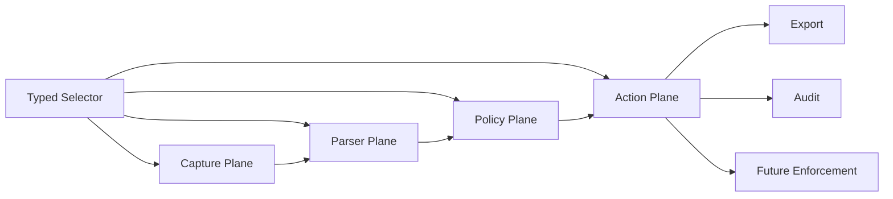
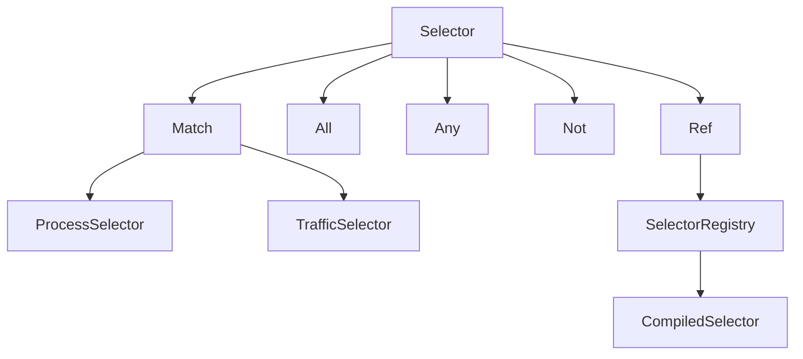
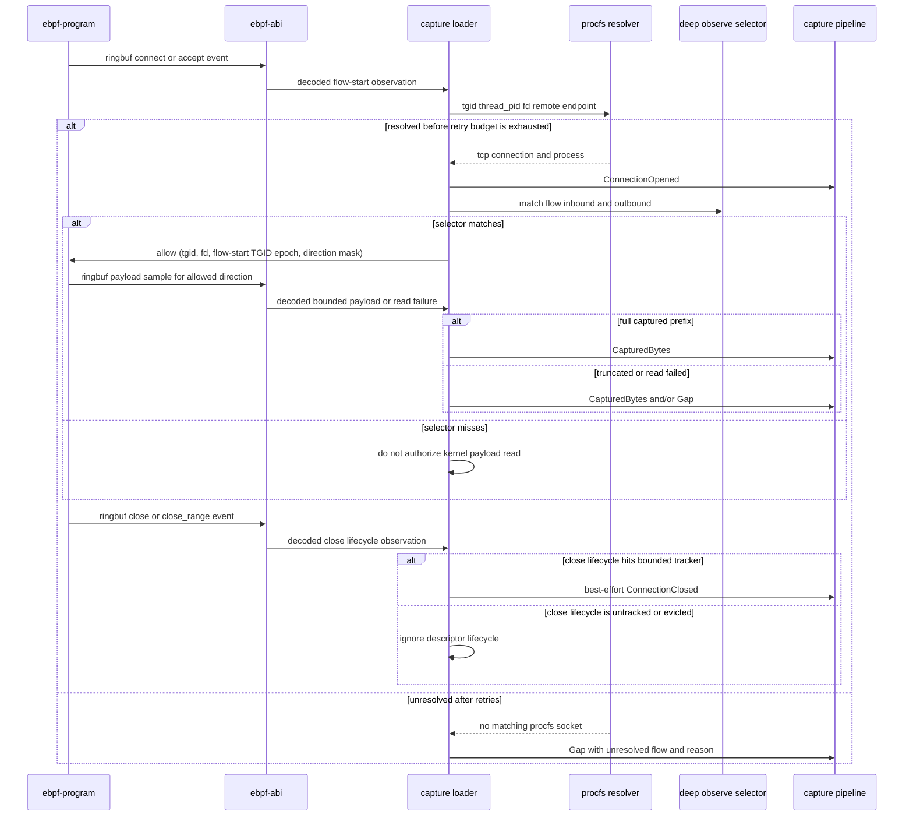
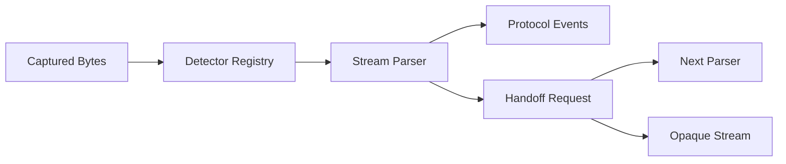
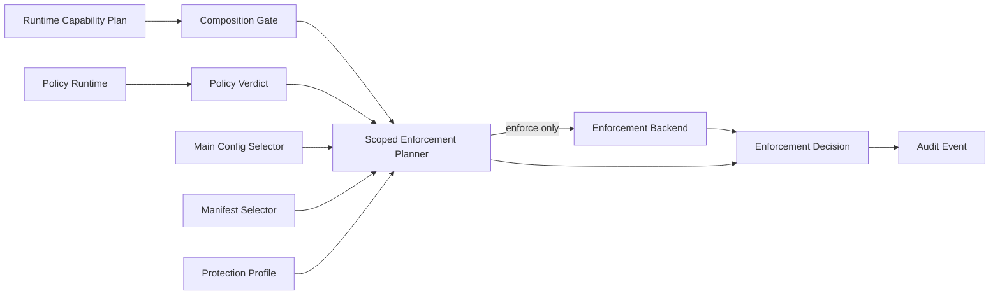
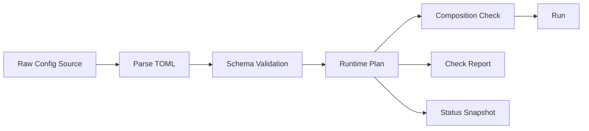
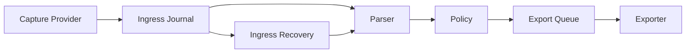

# sssa-probe 进程级流量探针设计文档

## 1. 背景与目标

`sssa-probe` 的目标不是做一个传统抓包工具，而是做一个面向 Linux 主机的进程级流量探针。它需要在支持 eBPF 的机器上优先使用 eBPF 获取强进程归因和高性能采集能力；在 eBPF 不可用或能力不足时，自动降级到 libpcap/procfs 等 fallback 路径，并明确标注能力降级。

本系统的长期方向包括四类能力：

- 进程级流量观测：识别进程、服务、容器、连接和协议语义。
- 加密流量 best effort 明文探测：优先通过非 MITM 路线获取 TLS 明文或会话材料。
- 可扩展协议解析：首要支持 HTTP/1.x 和 SSE，后续自然扩展 WebSocket、HTTP/2、HTTP/3 等协议。
- 策略驱动的检测与防护：首个可用闭环先支持观测、告警和 dry-run verdict，后续接入真实拦截执行。

本文档是架构事实源，同时记录当前实现状态。当前稳定方向是：capture/provider、parser、policy、export/enforcement 分层；所有 provider 必须通过 typed capability 和 degraded/gap 语义如实表达边界；TLS plaintext 属于 best-effort sidecar，不得伪装成强解密或强归因能力。

当前已形成早期闭环：replay/libpcap/external plaintext feed 可进入统一 pipeline，HTTP/1.x、SSE 和 WebSocket frame metadata 可被解析，Lua policy 可产生 alert/verdict，Fjall ingress/export lanes 与 webhook/file exporter 可持续运行，status/admin/metrics 可观察运行状态。eBPF process observation 已覆盖 connect、accept/accept4、close 与 plain `flags == 0` close_range lifecycle，以及由 `capture.deep_observe_selector` 按方向授权的 outbound single-buffer/bounded first-non-empty-iovec syscall argument sample（`write(2)` / `sendto(2)` / `writev(2)` / `sendmsg(2)`）和 inbound single-buffer/bounded first-non-empty-iovec syscall result sample（`read(2)` / `recvfrom(2)` / `readv(2)` / `recvmsg(2)`）；内核只在 userspace allow map 的 fd-table epoch 与 read/write direction mask 同时匹配时读取 payload，vector syscall 会在固定 scan limit 内跳过前导 zero-length iovec，并只采样第一个 non-empty iovec 的 bounded prefix，输出 bytes 始终标记 degraded，并用 gap 表达后续 iovec、scan limit 之外或 sample buffer 之外的字节。procfs fd lookup 在真实 `/proc`、fd 仍 live 且 `pidfd_getfd`/`SO_COOKIE` 被权限模型允许时，会在 duplicated fd 的 inode 与原 fd symlink inode 一致后，把可选 socket cookie 传播到 `FlowIdentity` 和 `FlowContext`，减少成功归因后的 fd/tuple 复用歧义；它不解决 fd 已关闭后 userspace 才解析的时序竞争。process eBPF object 与 TLS plaintext artifact 都会在 output ringbuf 写失败时累计 per-CPU loss counter，userspace provider 将增量转换为 degraded `capture_loss` export event，避免把采集不完整性吞掉。libssl uprobe plaintext sidecar 已有 provider-level、startup agent 和 dynamic attach/detach privileged loopback E2E，TLS artifact 已有单一 global state epoch fence，用 `SSSA_TLS_STATE_EPOCHS[0]` 防止旧 `SSL*` map state 跨 attach lifecycle 被解释，Linux socket destroy enforcement backend、selector-projected transparent interception rule lifecycle 和 storage retention 已有可验证骨架，但 unbounded scatter/gather continuation、flow-specific lost-event reconstruction、强 socket lifetime、TLS library replacement privileged E2E、keylog/session decrypt provider、代理/MITM 进程生命周期、完整 TCP 栈恢复和强进程归因仍是明确缺口。

## 2. 核心 thesis

这个项目不应该被设计成“抓包工具 + 若干 parser”。更干净的终局模型是四个平面分离：

| 平面 | 负责 | 不负责 |
| --- | --- | --- |
| 采集平面 | 连接、进程、socket、payload chunk、能力来源、gap/degraded 标记。 | 协议语义、业务检测、导出协议、最终阻断策略。 |
| 语义解析平面 | 协议识别、流重组后的解析、协议事件、handoff。 | 采集方式、脚本策略、外发重试、连接阻断。 |
| 策略平面 | selector 命中后的检测、转换、告警、typed verdict。 | 热路径目标选择、系统调用拦截、sink cursor 管理。 |
| 动作平面 | export、dry-run audit、未来 enforce/block/reset/quarantine。 | payload 解析、策略脚本执行、流量归因。 |



这四个平面必须解耦。采集可以默认全机，但深度内容解析、完整 payload、TLS 明文和未来拦截只能对 selector 命中的目标启用。这样可以同时满足：

- 全机可见性。
- 对受管进程/应用的深度观测。
- 对未来“只拦截某些应用”的能力预留。
- 对性能、隐私、资源预算和故障半径的控制。

一个必须避免的坏味道是把“采集过滤”“深度解析目标”“防护目标”做成三套互相漂移的规则语言。它们应该共享一套 typed selector 语义，再由策略或配置声明 observe、detect、enforce 等不同意图。

## 3. 不可妥协原则

- 不静默伪造完整性：任何 payload 缺口、能力缺失、缓冲溢出或 fallback 都必须以 `degraded`、`gap`、`capability` 等字段显式表达。
- 不把 PID 当稳定身份：进程归因必须使用复合身份，避免 PID 复用和长时间运行环境中的误归因。
- 不把证书误称为通用解密能力：现代 TLS 下证书/私钥通常不能解密 ECDHE/TLS 1.3 流量，必须区分 trust material 和 decrypt material。
- 不让策略语言承担热路径预过滤：selector 必须可编译、可索引、可解释；Lua 用于语义检测和 verdict，不用于替代 selector。
- 不为跨平台抽象牺牲 Linux 主线：当前目标只承诺 Linux，充分利用 procfs、cgroup、systemd、eBPF、capabilities。
- 不为了追求“灵活”暴露内部生命周期：Lua 策略可信，但只能访问受控领域 API，不暴露任意 Rust 内部对象、系统动态库或 FFI。
- 不承诺现实中无法同时满足的三元组：有限资源下不能同时保证无限流量不丢、不截断、不影响业务。当前目标采用有界无损与显式降级。

## 4. 当前目标范围

当前硬目标是完成观测闭环：

1. Host Agent 在 Linux 上运行。
2. 通过 selector 命中目标进程或服务。
3. eBPF/socket-first 路径采集连接和明文 HTTP/1.x 字节流。
4. HTTP/1.x parser 输出 request、response、body chunk、SSE 语义事件。
5. Lua 策略消费标准化事件，产生 alert 或 dry-run typed verdict。
6. 事件进入 Fjall-backed durable spool。
7. HTTP(S) webhook batch exporter 将事件发送到测试 receiver。
8. agent 暴露 capability matrix、metrics、health、degraded/gap counters。

额外证明点：

- 单 libssl TLS demo：对一个 OpenSSL/libssl 测试进程，通过 `SSL_set_fd` 建立 `SSL* -> fd` 关联，用 `SSL_clear`/`SSL_free` 维护状态生命周期，并通过 `SSL_read`、`SSL_write`、`SSL_read_ex`、`SSL_write_ex` uprobe 获取明文后接入同一 HTTP parser。
- libpcap fallback demo：eBPF 禁用或不可用时，使用 libpcap 捕获本机明文 HTTP/1.x，procfs best effort 归因，并标记 degraded capability。
- enforcement demo：Lua 策略返回 `deny`、`reset`、`quarantine` 等 typed verdict；默认 `audit_only`/`dry_run` 只记录 requested action、effective action、planner outcome 和 audit event，显式 `enforcement.backend = "linux_socket_destroy"` 可在 root 下对 selector 命中的现有 TCP socket 做 procfs owner 复核后，通过固定系统路径 `ss -K` 执行销毁。

当前明确不做：

- 不默认 MITM。
- 不默认启用真实连接阻断；必须显式选择 enforcement backend。
- 不承诺 Go `crypto/tls`、rustls、Java TLS 的明文覆盖。
- 不聚合完整 WebSocket message，不解压 WebSocket extension payload。
- 不支持 HTTP/2、HTTP/3/QUIC 的完整解析。
- 不实现动态远程控制面、长连接下发或在线替换；远程 enforcement manifest 只作为启动/检查阶段的一次性配置 source。
- 不长期保存全量原始流量。

当前实现状态：

- 已实现 replay CLI，用单向输入文件驱动 capture provider、ingress journal、parser、policy、export queue 和可选 webhook/file exporter。
- 已实现 `probe-core` 的 `TcpEndpoint`/`TcpConnection` 共享模型，供 capture provider、procfs attribution 和后续 eBPF/socket attribution 复用，避免各层用字符串 endpoint 重复建模。
- 已实现 `capture` crate 的核心 provider 模型：
  - `CapturePoll` 是 provider 的唯一轮询契约，区分 `event`、`progress`、`idle` 和 `finished`。`poll_next` 必须短轮询；只有 `CaptureProvider::next` 负责在 `idle` 上等待，避免 live provider 把暂时无事件伪装成 EOF，也避免已消费输入但暂未产出事件时错误 sleep。
  - `CaptureMultiplexer` 支持 required 与 best-effort slot。primary live provider 放在 required slot；TLS plaintext sidecar 放在 best-effort slot。required provider 失败会停止 capture；best-effort provider 运行期失败会进入 disabled 状态，在 capability/runtime status reason 中保留失败原因，立即 drop 对应 provider 以释放 side effect 资源，并继续 primary capture。multiplexer 是 fan-in 调度器，不是事件 origin，也不会出现在 `CaptureProviderKind` 中。
  - 事件级 origin 是必填 provenance：`EventEnvelope.origin` 同时携带 `CaptureSource` 和 `CaptureProviderKind`。`EventEnvelope.subject` 显式区分 `flow` 与 `provider`，所以 `capture_loss` 不再伪装成 unknown/sentinel socket flow；provider 级 loss 导出为 `subject = provider` 的 degraded `EventKind::CaptureLoss`，不进入 parser，也不会被 selector/enforcement 当成 flow trigger。`PlaintextEvent` 可表达已解密明文 bytes/gap/connection lifecycle event，并由 `PlaintextSource` 显式区分 `external_plaintext_feed` 与 `libssl_uprobe` 等来源。agent 的 JSON-lines feed 只是 external plaintext adapter，不再把所有明文来源硬编码成 feed。该路径用于让 libssl uprobe、keylog/session decrypt、SDK feed 或 future MITM 等后续 provider 接入同一 pipeline；它本身不执行 TLS 解密。
  - `LibpcapProvider` 可打开设备、安装 BPF filter、使用 nonblocking pcap poll、解析 Ethernet、Linux cooked v1/v2、`RAW`、direct `IPV4`/`IPV6` 和 `NULL`/`LOOP` loopback 上的 IPv4 TCP 与无扩展头 IPv6 TCP segment，接收可插拔 process resolver，并输出 degraded `CapturedBytes`。stream handling 提供 bounded best-effort 的 per-flow/per-direction 单调 `stream_offset`、有限乱序缓存、重传/overlap 处理、SYN/TCP Fast Open sequence 归一化、read-timeout pending flush、显式 `Gap` 和 connection lifecycle event；pending flush 会在读下一包前检查，避免 busy interface 上乱序缓存一直等不到 quiet period。缓存与 flow 表都有上界，超出能力边界时不会伪装成完整 TCP 重组。事件仍必须标记 degraded：这里不是完整 TCP 栈，不承诺 window/SACK 级恢复、内核 lost-event 反馈、IPv6 extension/fragment 解析、snaplen 截断修复或强归因。
- 已实现 `attribution` crate 的 `ProcfsAttributor` 和 `ProcfsSocketResolver`；前者通过共享 numeric PID scanner 枚举 `/proc` 下的进程目录，并可从 `/proc/<pid>` 读取进程身份、cmdline hash、starttime、uid/gid、cgroup、systemd service 与 container hint，后者可通过 `/proc/net/tcp`、可读取且可解析时的 `/proc/net/tcp6`、socket inode 和 `/proc/<pid>/fd` best-effort 反查 TCP 连接所属进程。`ProcfsSocketResolver` 还提供 TGID+thread PID+fd 到 `TcpConnection` 的反向解析入口：先读取 `/proc/<thread_pid>/fd/<fd>` 的 socket inode，连接线程已经消失时回退到 `/proc/<tgid>/fd/<fd>`；在真实 `/proc` 上，如果目标 socket fd 仍然 live 且 `pidfd_getfd` 和 `SO_COOKIE` 被当前权限模型允许，则解析结果会在 duplicated fd inode 与原 symlink inode 一致后附带可选 socket cookie，并进入后续 `FlowIdentity`/`FlowContext`。当 observed TGID 在当前 procfs 不可见时，才会用 `/proc/<pid>/status` 的 `NStgid` 查找可见 PID alias，并在候选扫描完整、TCP snapshot、expected remote 和候选唯一性都成立后归因。若 eBPF PID 与当前 procfs namespace 不可映射，但 flow-start observation 提供 process hint，则 resolver 只在 observed TGID 不可见、候选扫描完整、同 fd socket、expected remote、process name/uid/gid 和唯一候选同时匹配时做低置信度归因；否则保持未解析，不使用全机 remote endpoint 猜进程。tcp6 中的 IPv4-mapped endpoint 会归一化为 IPv4，以匹配 libpcap 看到的 IPv4 packet 和 eBPF 归一化后的 remote endpoint；tcp6 缺失、不可读或 malformed 不会拖垮 IPv4 socket attribution 基线。agent 注入的 procfs resolver 使用短 TTL socket snapshot，避免同一批新连接重复全量扫描 `/proc/<pid>/fd`；libpcap provider 在 TCP 生命周期信号、idle eviction、capacity eviction 和端口复用关闭旧 flow 后会使 snapshot 失效，降低拿到旧进程身份的风险。resolver 错误会进入 capture degradation reason，不再静默伪装成未匹配；但单个 PID 的 fd race 或权限拒绝属于 best-effort skip，不让整批 socket snapshot 失败；socket cookie 缺失或 inode 一致性校验失败会降级为 inode/tuple 证据，而不是把 flow 伪装成强 socket lifetime。replay flow 默认使用 synthetic replay identity、保留 PID/TGID `0` 和 0 confidence，避免把文件输入误归因到 agent 进程。
- 已实现 `probe-config` crate 的 TOML runtime config schema，覆盖 capture selection、live capture fallback order、provider-specific nested config、storage、export runtime worker、exporter、TLS material registry、TLS plaintext instrumentation 与 decrypt hint 配置、policy、enforcement mode、enforcement policy source 和 admin Unix socket 的第一版结构；配置解析拒绝未知字段，基础字段校验会拒绝 ambiguous external plaintext feed 配置：当前 external plaintext feed 的 source path 归 `capture.plaintext_feed.path` 所有，不能塞进 TLS material 配置。TLS material 路径不能为空；可被 exporter 或 TLS plaintext plan 引用的 material 需要唯一 id，exporter TLS refs 和 `tls.plaintext.decrypt_hints.key_log_refs` / `tls.plaintext.decrypt_hints.session_secret_refs` 必须存在并且类型匹配，client certificate refs 与 private key ref 必须在单个 webhook exporter 上成对配置；当前可配置 exporter transport 包含 `webhook` 与 `file`，并用显式 serde 实现保持 flat TOML 形状、transport-specific 字段和未知字段拒绝语义，不依赖 `serde(flatten)` 的边界行为；未实现的 transport 不暴露为可解析配置项。TLS plaintext 当前通过 `tls.plaintext.instrumentation.enabled` 启用 libssl uprobe instrumentation，不暴露单值 provider 字段。enforcement policy source 支持未配置、文件、目录 manifest 和 remote endpoint。remote endpoint 必须使用 HTTPS，只有 loopback HTTP 可用于本地测试，且 endpoint 中禁止携带 credentials；文件存在性和远程 source 可达性属于 status/check/run 观察面。
- 已实现 `runtime` crate 的 provider descriptor `ProviderRegistry` 与 `RuntimePlan`，由 registry 生成 capability matrix，并基于配置解析 capture backend selection、TLS plaintext plan、export worker effective plan 与 enforcement capability/source plan；`auto` 使用有序 live fallback 列表，显式 backend 表示 required backend，不自动回退；runtime validation 对未实现的安全敏感能力 fail closed；`plaintext_feed` 是独立 plan mode，不伪装成 replay 或 live capture；`libssl_uprobe` TLS plaintext 是 live instrumentation，要求 live capture mode，`Unavailable` fail closed，`Degraded` 允许显式启用并在 status/plan 保留原因；TLS plaintext plan 包含 instrumentation plan 和 decrypt hint plan，分别表达 selector/capability/runtime artifact 与 keylog/session secret material refs 的 typed 解析结果，但 runtime 不打开文件、不 attach uprobe，provider probe/open 留在 `agent` composition root。
- 已实现 crate-local `TlsMaterialFileStore` 边界和 filesystem backend；exporter mTLS material 读取、TLS plaintext material `check` 和 status metadata source check 都通过同一路 path-based file store abstraction，而不是各自直接访问文件系统。当前 backend 只支持有界 regular file。
- 已实现 `check` 的 TLS plaintext material 内容核验：对显式引用的 `key_log_file` 通过 `TlsMaterialFileStore` 读取有界 regular file，并按 NSS/SSLKEYLOGFILE 三字段语法解析 label、context 和 secret hex；解析结果和 check report 只输出 entries 与 label counts，不保留 secret bytes，也不在错误中泄漏 secret 字段值。`session_secret_file` 当前只做同一 bounded source read，并以 byte 摘要出现在 check report 中，等待后续 session secret schema 定义。
- 已实现 `pipeline` crate 的 `CapturePipeline`，负责 capture event -> ingress journal -> per-flow parser -> policy -> enforcement audit -> export queue 的 replay/shared processing；ingress journal 现在写入完整 `CaptureEvent` JSON payload，而不是只写入 bytes payload，因此 bytes、gap、connection opened/closed 都能按 sequence 恢复；`ConnectionClosed` 会先进入 parser 以 flush close-delimited HTTP/1 body，再释放 per-flow parser state；pipeline 支持可选 `max_events` 运行边界，便于对真实 live provider 做有界运行验证；`PipelineRuntimeMetrics` 是 pipeline 运行态计数的 owner，当前覆盖 capture read、ingress journal/recovery/processed、export event writes、policy evaluation/selector miss、persisted policy alert/verdict/error 和 persisted enforcement decision outcome counters。policy runtime error 会作为带 `policy_version` 和 typed `event_type` 的 `policy_runtime_error` audit event 写入 export queue，并且不阻止同一原始事件上的其它 policy 继续运行。pipeline 生成的 export event 带 typed `EventProvenance`：primary parser event 使用 `ingress_sequence + primary index`，policy/enforcement 派生事件使用 trigger primary index、policy index、policy output index 和 `stage`；event id 在存在 provenance 时基于该 provenance 而不是进程本地 monotonic timestamp，因此同一 ingress replay 重放出的同一语义事件具有稳定 id，且后续 primary event 不会因前面 policy 输出数量变化而改变 provenance。`recover_ingress_journal_until_idle` 可从 durable ingress journal 按 sequence 顺序重放 `CaptureEventOriginJson` payload，重新进入 parser/policy/export queue，并且只在所有 per-flow parser state 都处于 checkpoint-safe 状态、且没有 flow-carried observation-only evidence 时推进 durable parser safe-prefix cursor；`agent run` 会在打开 capture provider 之前先执行该恢复，避免 provider 构造失败时 stranded 已落盘输入；配置了 storage retention 时，统一 worker 会在本轮启动恢复完成后再开始清理过期 ingress/export 连续前缀，避免 ingress 恢复输入被抢先删除。恢复按当前配置和当前 policy 重新解释已落盘 ingress event，但 pipeline 写 export queue 时使用稳定 event id 做写入侧去重：同一语义事件已存在时不会增加新的 export record，且恢复仍会继续评估 policy，以便补齐“primary 已写入但 policy-derived event 尚未写入”这类崩溃窗口。恢复不挂载 enforcement planner，避免历史 ingress 触发真实或 dry-run enforcement decision；当前不会把 active parser 内存状态或 flow-carried evidence 单独序列化落盘，因此崩溃后仍可能从 safe-prefix cursor 之后重放 ingress 来重建半包/半消息状态和 enforcement evidence。`agent` binary 负责 CLI wiring、配置读取、provider 探测/构造、spool/policy/parser/enforcement planner/pipeline 组合、storage retention worker、连续 exporter worker、replay exporter 命令和状态/metrics 快照输出。
- `CapturePipeline` 现在通过共享 `PipelinePolicySet` 持有 active `PipelinePolicy` runtime set，而不是借用 agent composition root 里的临时 policy runtime。policy evaluation 会短暂锁定 active set 取得 snapshot，然后按 snapshot 逐个 policy 执行 `evaluate -> append`，避免单个事件跨两个 policy set，也避免后续 policy 在前序 append 失败后继续产生 Lua side effect。在线 admin `reload_policies` 会按当前配置重新加载 enabled policy bundles，全部加载和 hook 校验成功后原子替换 active set；失败时不切换当前 active set。当前仍未实现主配置 reload、文件 watcher、远程控制面下发或后台 reload worker。
- 已实现 HTTP/1 parser 的 message-role 识别：`Direction` 表示相对归因进程的 inbound/outbound，而 request/response 由 header 语法决定。这样本机服务端收到的 inbound request 会产生 `HttpRequestHeaders`，本机服务端发出的 outbound response 会产生 `HttpResponseHeaders`，不会把进程方向误当 HTTP 角色。parser 已识别 WebSocket HTTP Upgrade，输出 `WebSocketHandoff` 后切换到 WebSocket frame parser；后续字节会输出 `WebSocketFrame` metadata，包括方向、HTTP stream sequence、frame sequence、FIN/RSV/opcode/masked/payload length 和 payload fingerprint。frame payload 以增量 BLAKE3 hash 计算 fingerprint，不为了 metadata 缓存完整 payload。当前不聚合完整 WebSocket message，不解压 extension payload。
- 已实现 configured policy loader 的 bundle 入口：`policies[].path` 必须指向目录，policy id 必须唯一，并按 `manifest.toml` + `main.lua` 加载。manifest 目前支持 `id`、`version` 和 typed `hooks`，并要求 manifest id 与配置中的 policy id 一致；多个 enabled bundle 会按配置顺序进入同一 pipeline，各自应用自己的 selector 并产出带 `policy_version` 的 alert/verdict/enforcement audit event；`status` 只做 bundle metadata/manifest 校验，不执行 Lua；`check` 和 `run` 会显式加载并执行初始化。`replay --policy` 仍可直接读取单个 Lua 文件作为本地调试入口，但它不参与 configured policy source 抽象。
- 已实现 capability matrix，当前状态按下表维护；具体实现细节和验证路径分散在后续对应章节，避免一条段落同时承担所有能力声明。

| Capability | Runtime status | 当前已实现 | 仍缺失 / 降级理由 |
| --- | --- | --- | --- |
| `replay_capture` | Available | replay CLI 和 `ReplayProvider` 可驱动 parser、policy、ingress journal、export queue 和可选 webhook drain。 | 不代表 live capture 能力。 |
| `libpcap` | Probed available/unavailable | agent composition root 按当前 libpcap 配置实际打开设备并安装 filter 后才注入 available descriptor；capture crate 已有 bounded best-effort TCP stream assembler，支持单调 offset、SYN payload sequence 归一化、重传去重、overlap trimming、有限乱序缓存、read-timeout flush、方向关闭边界裁剪、显式 gap 和全局乱序预算约束。 | 仍是 degraded：没有完整 TCP window/SACK 恢复、IPv6 extension/fragment 解析、内核 lost-event 反馈或强归因。 |
| `external_plaintext_feed` | Available | agent JSON-lines feed adapter 可消费外部已解密明文 bytes/gap/connection lifecycle event，转换为 `PlaintextEvent(source = external_plaintext_feed)` 后进入统一 pipeline。 | 它本身不执行 TLS 解密。 |
| `ebpf` | Degraded when explicit and procfs socket attribution is usable / unavailable on failed host, object, contract, or procfs preflight | host probe、`aya-obj` object preflight、strict process artifact contract、shared ABI、kernel connect、accept/accept4、close/plain close_range 和 payload tracepoint observation、userspace `aya` loader、ringbuf decoder、TGID+thread PID+fd lookup 到 `ConnectionOpened` bridge、`capture.deep_observe_selector` 命中 flow 后由 userspace 将 `(tgid, fd, flow-start fd-table epoch, read/write direction mask)` 写入 allow map 的 bounded outbound `write(2)` / `sendto(2)` / `writev(2)` / `sendmsg(2)` argument sample 与 inbound `read(2)` / `recvfrom(2)` / `readv(2)` / `recvmsg(2)` result sample 到 always-degraded `CapturedBytes`/`Gap` bridge、best-effort descriptor close/plain close_range 到 `ConnectionClosed` lifecycle event、unresolved connect/accept 到 degraded `Gap` 的 provider wiring，以及 output ringbuf write failure counter 到 degraded `capture_loss` event 的转换已存在；成功的 procfs fd lookup 可在 live fd + 权限允许时把 `SO_COOKIE` 传播到 flow identity；outbound sample 只有 write direction 被授权时才在 syscall enter 通过 allow gate 后捕获 bounded prefix，syscall exit 只根据实际返回长度裁剪或降级，避免 exit 后重读可变用户 buffer；inbound sample 只有 read direction 被授权时才在 syscall enter 通过 allow+epoch gate 后固定 single-buffer 或 first-non-empty iovec segment，syscall exit 仅在成功返回后读取这个 enter-time segment 的用户 buffer bounded prefix，避免重新信任可变 iovec descriptor；vector syscall 会在固定 scan limit 内跳过前导 zero-length iovec，只读取第一个 non-empty iovec 的 bounded prefix，并把返回长度超过已捕获 prefix、后续 iovec、scan limit 或 sample buffer 的部分表达为 gap；connect/accept fd 归因 retry 已拆成跨 poll 的状态机，避免 provider 在 serial multiplexer 中长时间 sleep。 | 仍是 degraded：当前只覆盖已解析且 selector 授权 flow 上的 outbound single-buffer/bounded first-non-empty-iovec syscall argument snapshot 和 inbound single-buffer/bounded first-non-empty-iovec syscall result buffer snapshot；outbound sample 不是内核已发送字节的强证明，inbound sample 也只是 syscall 返回后的用户 buffer 观察，不等于完整 socket 流。`SO_COOKIE` 只增强成功 fd lookup 后的身份，不解决 fd 关闭后才解析、dup/fork/fd passing 或 lost event。output ringbuf failure 只能报告 provider 级 loss count，不知道丢失事件属于哪个 flow，也不能重建 parser state。unbounded scatter/gather continuation、flow-specific lost-event reconstruction、partial-write retry 语义和完整 kernel/socket-path traffic capture program 尚未完成；descriptor close/plain close_range + fd-table epoch 是保守生命周期边界，不是强 socket lifetime，dup/fork/fd passing、process exit 或 lost event 仍可能导致生命周期降级；`auto` 会跳过 degraded eBPF observation provider，显式 `capture.selection = "ebpf"` 可用于 process observation 验证。 |
| `procfs_attribution` | Probed degraded/unavailable | 可枚举 `/proc` 下 numeric PID 目录，并从 `/proc/<pid>` 读取进程身份、cmdline hash、starttime、uid/gid、cgroup、systemd service 与 container hint。 | hidepid、权限、PID race、namespace 边界会导致 best-effort 降级。 |
| `procfs_socket_attribution` | Probed degraded/unavailable | 可通过 `/proc/net/tcp`、best-effort `/proc/net/tcp6`、socket inode、`/proc/<pid>/fd` 和 TGID+thread PID+fd lookup 做 TCP 连接归因；fd lookup 支持 thread pid、TGID fallback、`NStgid` PID namespace alias，以及 hidden TGID 场景下的 unique fd/process-hint candidate；在真实 `/proc` 上可对 live socket fd 使用 `pidfd_getfd` + `SO_COOKIE` 获取可选 socket cookie，并要求 duplicated fd inode 与原 fd symlink inode 一致；tcp6 IPv4-mapped endpoint 会归一化。 | snapshot 与 fd symlink 读取不是同一内核时间点，权限/race/namespace 仍会导致漏归因；socket cookie 只是成功 fd lookup 的增强身份，不代表强 socket lifetime；alias/hint fallback 只在候选扫描完整、expected remote、name、uid/gid 和唯一候选同时匹配时使用，fd 证据拿不到时不会用全机 remote endpoint 猜进程，错误进入 degradation reason，不静默伪装成匹配。 |
| `libssl_uprobe` | Probed degraded/unavailable; degraded is explicitly usable for best-effort TLS plaintext | 已实现 process-scoped discovery/planning、strict TLS artifact preflight、libssl plaintext eBPF producer、userspace Aya loader/provider、ringbuf sample decoder、procfs fd-to-flow resolver、BPF PID 与当前 procfs PID 不一致时的 attach-plan 唯一 fd fallback、startup attach planning、periodic reconcile sidecar、dynamic process attach/detach E2E、single global state-epoch fence、online `last_reconcile` status、provider output selector fail-closed gate 和 primary+TLS multiplexer wiring；attach safety 使用 target-scoped session commit 和 unsafe partial side effect fail-closed。详情见 TLS plaintext 小节。 | 仍是 degraded；`FD_VALID` 只表示可尝试 fd-based 归因，不等于强 socket ownership。未解析 flow 只能在 selector 不依赖未知 process/traffic 维度时放行；未知 exe/cmdline/systemd/container 这类 process metadata 以及远端端口/地址、本地端口等 traffic 维度都会 fail closed，`not` 不会把 unknown 反向放行。剩余缺口见 [Remaining TLS lifecycle gaps](#remaining-tls-lifecycle-gaps)。 |
| keylog/session decrypt hints | Planned config with explicit check validation | TLS plaintext plan 已拆成 instrumentation 与 decrypt hints：instrumentation 表达 selector、capability requirement、`libssl_uprobe_object_path` 和 reconcile runtime；decrypt hints 表达 keylog/session secret material refs。`check` 可输出 libssl uprobe artifact path metadata，并可对显式 `key_log_file` refs 做 SSLKEYLOGFILE 语法核验和 secret-free 摘要，`session_secret_file` 暂作 bounded byte summary。 | 尚未实现 keylog/session 解密 backend；check validation 不等同于解密能力；证书/私钥不会被误称为通用解密材料。 |
| `http1` / `sse` / `websocket_handoff` / `websocket_frame` | Available | HTTP/1 parser 已处理 request/response role、body、SSE 和 WebSocket Upgrade handoff；handoff 后切换到 WebSocket frame parser，输出 frame metadata 与 payload fingerprint。 | 不聚合完整 WebSocket message，不解压 extension payload；不支持 HTTP/2、HTTP/3/QUIC。 |
| `lua_jit` | Degraded | LuaJIT policy runtime 已接入 replay/live pipeline，支持多个 active bundle 按配置顺序执行，并支持 typed alert/verdict/runtime error audit；在线 admin `reload_policies` 可手动 validate-then-swap 当前配置引用的 policy bundles。 | 文件 watcher、主配置 reload、远程控制面下发和 policy state migration 未实现。 |
| `durable_spool` / `ingress_journal` | Degraded | Fjall ingress journal/export queue 可持久化并恢复 bytes、gap、connection opened/closed capture events；pipeline export event 带 ingress provenance，使同一 ingress replay 的 event id 稳定；ingress cursor owner 是 storage 层 typed owner，parser recovery owner 由 pipeline 定义；parser 在所有 flow 都 checkpoint-safe 且没有 flow-carried observation-only evidence 时推进 durable safe-prefix cursor；可按 `[storage.retention.ingress]` 的 max-age 或 max-records 策略清理 ingress 连续前缀，并在同一 storage batch 中退休 parser recovery cursor。 | 恢复会按当前 config/policy 重新解释已落盘 ingress；active parser state 和 flow-carried evidence 不序列化落盘，崩溃后需要从 safe-prefix cursor 之后重放；retention 是显式生命周期丢弃，不是 parser state snapshot。 |
| `export_queue` | Available | export lane、pipeline-generated stable event id 写入侧去重、per-sink cursor、schema-aware payload、protobuf batch envelope、record-level `stored_at_unix_ns`，以及按 planned sinks cursor 下界执行的 acked-prefix cleanup、按 retention deadline 退休过期连续前缀、按 `max_records` 保留最新后缀的容量 retention 已存在。 | `append_export` 手工写入不走 dedup；外发仍是 per-sink at-least-once delivery；sink 或后续 consumer 仍需要按 event id / batch range 处理投递重试幂等。 |
| `webhook_exporter` | Available | `run` 可连续 drain planned sinks，支持固定间隔、全局/每 sink batch 预算、single sink timeout、per-sink exponential backoff、cursor-safe acked-prefix export queue cleanup、trust anchors、client identity refs、在线 admin status 中的 per-sink backoff runtime snapshot，以及 metrics 中的 backing-off sink aggregate count；runtime plan 内部使用 typed `ExportSinkPlan` dispatch，status 中 transport-specific 字段放在 `exporters[].target`；`xtask e2e-webhook-exporter` 覆盖 configured webhook sink 的 bounded-run tail drain、非默认 gzip codec、`POST /batches`、`application/x-protobuf` protobuf batch body、batch id range、连续无重复 export sequence、JSON payload schema、完整预期 export event set、JSON structured ack、custom headers、collector sink cursor 前进和该 sink 无 pending records；lifecycle retention 属于 storage retention worker。 | 当前 E2E 不证明 periodic worker loop、rejection/retry/partial ACK 或 lane record prune；这些分别由 agent export/storage 单元与集成测试覆盖。gRPC/Kafka/OTLP 应作为后续新的 typed export target 变体接入，而不是在当前配置中保留空枚举。 |
| `file_exporter` | Available | `file` transport 可作为 planned sink 从同一 export queue drain protobuf batch envelope，按 exporter codec 压缩后写入 JSON Lines record；record 使用 typed codec 字段，每行包含 batch id、agent id、codec、first/last sequence、event count 和 base64 payload。写入路径使用 parent directory fd + `openat` + `O_NOFOLLOW` append，新建文件固定 `0600`，已有文件必须是 non-symlink regular file、owner uid 等于 agent effective uid、group/other permission bits 为空且可写；missing target 的 parent 必须是 non-symlink directory 且对 effective uid writable/searchable。blocking file I/O 放入 blocking task，成功 `write_all`、`flush`、`sync_data`，新建文件额外 sync 创建时持有的 parent directory fd 后才推进该 sink cursor。agent status 通过 exporter 的 read-only preflight 报告 file target 是否 available。config/runtime/agent drain/status/exporter 测试覆盖 file transport 解析、plan、drain、cursor advance、JSON Lines record decode、private mode、owner mismatch 拒绝、insecure existing file 拒绝、symlink 拒绝、unwritable parent status 和 status target。 | 当前没有独立 xtask file exporter E2E；regular file append 适合本地交接和端到端调试，不等同于远端 durable delivery，也不创建父目录、不替代外部 log rotation 或独立 at-rest encryption。preflight 只做无副作用元数据检查，不能证明未来写入一定不会遇到磁盘满、权限变化、ACL/immutable flag 或运行期 I/O 错误。sink timeout 已避免 blocking file I/O 占住 async worker，但 protobuf encode、compression 和 JSON serialization 仍在进入 blocking file write 前执行，不是硬实时可抢占预算。 |
| `dry_run_enforcement` | Available | dry-run enforcement 会记录策略保护意图、requested/effective action 和 audit event。 | 不执行真实连接阻断。 |
| `connection_enforcement` | Available only when explicitly configured and probed | `EnforcementBackend` trait、planner delegation boundary、`RuntimePlan.enforcement.connection.capability`、显式 `enforcement.backend = "linux_socket_destroy"`、固定系统路径 `ss -K` TCP socket destroy backend、执行前 procfs socket owner 复核和 status/backend reporting 已存在。 | 默认 `backend = "none"` 不要求 connection capability；Linux socket destroy probe 只确认 Linux、受信系统路径中的 `ss -K` 入口、root 执行上下文和 procfs socket attribution 入口，实际每条 flow 仍可能因事件不是 live host observation、触发事件携带 observation-only enforcement evidence（当前来源是 eBPF syscall payload snapshot 或 eBPF gap）、当前 socket owner 无法复核或已不匹配、内核/namespace/匹配窗口返回 `unsupported`，后端执行错误会记录为 `failed`；它只支持销毁已存在的 TCP IPv4/IPv6 socket，不提供 pre-connect deny、payload 级阻断、非 TCP 阻断或强规则生命周期。 |
| `transparent_interception` | Available only for explicitly configured and probed inbound TPROXY | `enforcement.interception.strategy` 已提供 `none`、`inbound_tproxy`、`outbound_mitm` 三种 typed 配置，支持独立 selector 和显式 proxy listen port；nftables table、TPROXY mark 和 policy route table 是内部保留 host resources，不暴露为用户配置。`RuntimePlan.enforcement.execution_surfaces`、`RuntimePlan.enforcement.interception`、capability matrix、`check` 和 enforcement status 都会报告 strategy、proxy、resolved nftables resources、selector 与 capability requirement。agent composition root 已接入 Linux inbound TPROXY lifecycle probe/runtime：固定可信路径查找 `nft` 和 `ip`，要求 Linux/root；`run` 在加载外部 manifest 并得到最终 effective setup selector 后，对最终 nft 脚本执行 `nft --check`，再获取单一 `inbound_tproxy` host owner lock，启动前清理当前保留 table/mark/route table 的所有 IPv4/IPv6 policy routing 遗留，按 nft rule family 安装必要的 policy routing，退出时删除 owned table 并清理本次 route/rule。`xtask e2e-transparent-tproxy-loopback` 已在隔离 network namespace 中建立 pid-backed client netns/veth，启动 agent 安装 TPROXY，并用带 `IP_TRANSPARENT` 的测试代理验证入站连接被截获和 cleanup。 | 当前 capability 表示入站 TPROXY 规则/策略路由 lifecycle 入口可执行，不表示 agent 已启动代理进程、完成 MITM，或提前校验了带外部 manifest selector 的最终脚本；显式配置的本地 proxy listen port 是外部前置条件。当前 rule planner 只下推无进程条件的显式本地 selector：`match` 或 `all(match, ...)` 交集，并且必须至少包含端口或 remote IP 约束；进程名/exe/cmdline/systemd/container、`any`、`not` 和 named ref 会 fail closed，避免误变成全机拦截。nft table、mark 和 route table 固定为当前保留默认值（`sssa_probe`、`0x53534101`、`53534`），避免误删常见 nft table 或改写外部 policy routing；当前单一 host owner lock 也避免同一 host namespace 内两个 agent 互相清理。`outbound_mitm` 是保留的 typed strategy，但在 proxy self-bypass、证书/MITM lifecycle、proxy health 和 proxy-side L7 分类明确前不可执行，不会安装 output redirect 规则。 |

- 已实现 selector AST 的基础形态：`match`、`all`、`any`、`not`、`ref`，命名 selector 通过 registry 编译解析；`CompiledSelector::may_match_process` 提供 process-scope 保守投影，`CompiledSelector::matches_unattributed_flow` 用 unknown-aware 三值语义评估未归因明文事件，未知 process 或 traffic 维度会在 `all`/`any`/`not` 中保持 unknown，并在最终决策 fail closed；`enforcement::TargetScope` 只持有编译后的 selector，用于 flow verdict 判定和未来 process-scoped interception setup 的 false-only 安全剪枝；protection profile 保留在 `ScopedEnforcementPlanner`，避免把“作用范围”和“允许动作”混成同一个概念。
- 当前 `FjallSpool` 存储的是带 record envelope 的 `SpoolPayload`；record envelope 包含 `stored_at_unix_ns`、typed schema 和 payload bytes，spool marker 显式写 `sssa-probe-spool`，marker 不匹配会 fail fast。代码内使用 `SpoolPayloadSchema` enum，落盘和 protobuf `payload_schema` 字段写 schema name；当前 export event schema 是 `sssa.probe.event_envelope.subject_origin.json`，明确表示事件 envelope 使用 `subject` + `origin` 模型，不使用版本后缀表达兼容承诺。`CaptureEvent` 和 `EventEnvelope.kind` 都是 serde tagged payload enum；`EventEnvelope` 的构造和 JSON 反序列化都会校验 subject/kind 边界并拒绝未知旧字段：`capture_loss` 只能是 provider subject，HTTP/WebSocket/policy/enforcement 等 flow 事件只能是 flow subject。`EventType` enum 显式镜像事件 discriminant，用于 event id、`EventKind::name()` 和 policy hook 映射，并用测试锁住它与 serde `type` tag 的一致性。`EventEnvelope.provenance` 是 pipeline processing provenance：pipeline 写 export queue 时填充 ingress sequence 和 typed emission，非 pipeline 手工构造事件可以为空。`EventEnvelope.enforcement_evidence` 是 destructive enforcement 的事件证据契约，默认允许真实 backend，observation-only 事件必须携带原因并由 planner 在调用 backend 前拒绝。ingress lane 当前写入 `sssa.probe.capture_event.origin.json` JSON framed `CaptureEvent`，export lane 当前写入 `sssa.probe.event_envelope.subject_origin.json` JSON framed `EventEnvelope`；pipeline 写 export lane 时通过 `append_export_once` 把 `EventEnvelope.id` 作为 storage dedup key，已存在 key 会返回原 sequence 而不新增 record，retention/prune 删除 export record 时同步删除对应 dedup index。手工 `append_export` 保留为无幂等的低层队列写入。reader 只返回已越过 lane durable high-water sequence 的条目，避免并发 exporter 读到已 commit 但尚未 `SyncAll` 持久化完成的事件；`status` 使用同一 durable high-water 生成 spool/export lag 快照。protobuf batch envelope 通过显式 payload schema 标记该格式，不把当前 JSON framed payload 伪装成 protobuf event schema。当前 replay 不把文件输入归因到 agent 自身，而使用 synthetic replay identity、保留 PID/TGID `0` 和 0 confidence。

## 5. 部署与平台

部署模型为 Linux Host Agent。agent 默认面向真实主机运行，而不是应用内嵌 SDK，也不是第一阶段的 Kubernetes DaemonSet 专用实现。

平台范围：

- 当前目标只承诺 Linux。
- 主支持面为 RHEL8+/Ubuntu20+ 级别环境。
- RHEL7/CentOS7 这类旧环境允许自动降级到 libpcap/procfs，不把 eBPF 主路径作为硬承诺。
- CPU 架构支持 `x86_64` 和 `aarch64`。

权限模型：

- 现实部署通常会以 root 运行。
- 设计上仍要做 capability discovery，并把长期目标设为最小 capabilities。
- 可能涉及的能力包括 `CAP_BPF`、`CAP_PERFMON`、`CAP_NET_ADMIN`、`CAP_NET_RAW` 等，具体按 runtime capability matrix 判定。
- 不应因为 root 运行就让内部代码随意访问系统能力；高风险能力必须集中在少数边界模块。

## 6. 能力矩阵与降级

启动时 agent 必须生成 capability matrix。它应覆盖：

- 采集能力：eBPF syscall/tracepoint、libpcap fallback、procfs attribution。
- TLS 明文能力：libssl uprobe、keylog/session secret、future MITM provider。
- 协议能力：HTTP/1.x、SSE、WebSocket upgrade detection、WebSocket frame metadata、opaque stream。
- 策略能力：LuaJIT、JIT 状态、policy state API、manual online policy bundle reload，以及后续 file watcher/control-plane reload。
- 动作能力：dry-run verdict、connection-level enforcement capability boundary、未来 eBPF backend。
- 外发能力：spool-backed exporter、best-effort sink、codec 支持、mTLS。

配置和策略可以声明：

- `required_capabilities`：缺失时策略不启用，或 agent 按配置 fail fast。
- `preferred_capabilities`：缺失时策略降级运行，并产生 degraded 状态。

不允许静默降级。任何能力缺失必须出现在 capability matrix、metrics、admin API 和相关事件 envelope 中；active health 只聚合当前 capture/spool/exporter/policy 执行面的健康度，避免把路线图缺口伪装成运行故障。

## 7. Selector 模型

采集默认全机，但深度观测、完整 payload、TLS 明文 provider 和未来拦截只对 selector 命中的目标启用。

selector 使用 typed DSL，不使用 Lua 直接判断热路径目标。原因：

- selector 需要可索引、可预编译，避免每个事件都进入脚本运行时。
- selector 是能力启用边界，不只是业务策略判断。
- selector 需要可审计、可解释、可在配置检查阶段验证。

selector 应支持的维度：

| 维度 | 示例 | 作用 |
| --- | --- | --- |
| 进程身份 | PID/TGID、进程名、可执行路径 glob、cmdline regex/hash。 | 绑定受管进程和短生命周期任务。 |
| 服务身份 | systemd service、cgroup、container id、namespace。 | 把应用/服务作为稳定防护边界。 |
| 流量身份 | 监听端口、本地端口、远端地址、方向、协议族。 | 限定需要深度解析或防护的连接范围。 |
| 复用与组合 | 命名 selector、`any`、`all`、`not`、`ref`。 | 避免配置复制，允许全局边界和下发边界合成。 |

当前实现采用 AST 形态，而不是把 public model 固化成扁平 AND：

- `match`：叶子 selector，包含 process selector 和 traffic selector。
- `all`：所有子 selector 命中。
- `any`：任一子 selector 命中。
- `not`：对子 selector 取反。
- `ref`：引用 registry 中的命名 selector，编译阶段检测未知引用和循环引用。



当前实现还提供 process-scope projection：`CompiledSelector::may_match_process(process)` 只保证 `false` 表示该进程可在 flow attribution 前安全排除，`true` 只是保留候选而不是证明未来一定存在匹配 flow。它会用 process selector 做可验证剪枝，但不会因为 attach 前未知的 traffic 维度误杀候选进程；traffic-only selector 保持候选，`not` 也按保守语义处理。对于 partial process context，空/`unknown` 进程名、空 exe path、空 cmdline hash、缺失 systemd service 或缺失 container id 都按未知处理，只能保留候选，不能排除候选。最终是否命中仍由完整 flow + direction selector 决定。`TargetScope` 是 enforcement 层的一等目标边界：它只提供 `may_include_process` 供 future process-scoped interception setup 预筛，并提供 `matches_trigger` 供 per-flow verdict 决策；`ProtectiveActionProfile` 由 `ScopedEnforcementPlanner` 单独持有和校验。现有 libssl uprobe 动态 attach 和深度 payload 开关复用同一 `CompiledSelector` process projection 语义，但还没有通过 `TargetScope` 统一生命周期 owner。

selector reload 目标语义：

- 新连接按新 selector。
- 已有 flow 在下一个事件阶段重新评估 capability。
- 不回溯补采历史 payload。
- 事件必须携带 `config_version`。

## 8. 进程、连接与时间身份

### ProcessIdentity

进程身份使用复合模型，不以 PID 单独作为稳定主键。

建议字段：

- `pid`、`tgid`。
- `start_time`。
- `boot_id`。
- `exe_path`。
- `cmdline_hash`。
- `uid`、`gid`。
- `cgroup`。
- `systemd_service`。
- `container_id`、`runtime_hint`、`namespace`。

这样可以避免 PID 复用、短生命周期进程和服务级归因混乱。

### FlowIdentity

flow id 也不能只用五元组。

建议使用 composite stable id：

- `boot_id`。
- `process_identity` 摘要。
- socket cookie 或 socket inode。
- 5-tuple。
- start monotonic timestamp。
- agent 内 monotonic sequence。

eBPF 下优先使用 socket cookie；fallback 拿不到时降级为可用字段组合，并标注 confidence。

### 时间模型

事件使用 dual timestamp：

- `monotonic_ns`：用于内部排序、时延、流内顺序。
- `wall_time`：用于外部查询、日志关联、审计展示。

batch/envelope 还应携带 agent `boot_id` 和 clock source 信息。

## 9. eBPF 采集路径

eBPF 技术栈选择 Aya。理由：

- Rust 项目内 eBPF 程序、用户态 agent、共享事件类型可以放在同一个 workspace。
- 更容易保持 Rust 侧类型和构建体验一致。
- 避免当前目标同时维护 C eBPF、clang/bpftool、Rust FFI 的双语言复杂度。
- 内部类型不使用版本后缀这类兼容命名；当前 `EBPF_ABI_REVISION` 只用于 kernel object 与 userspace reader 的 fail-fast 同构校验，不代表已经承诺长期兼容。

主采集策略为 socket/syscall-first，而不是 packet-first 或 proxy-first。

原因：

- 目标是进程级探针，进程、FD、socket、flow 关系必须是一等信息。
- packet-first 更容易拿到网络包，但进程归因和 TLS 明文都更弱。
- proxy-first 可以强化 L7 和拦截，但侵入性高，并且与非 MITM 默认路线冲突。

首批 eBPF attach 点：

- connect/accept/close/close_range。
- send/recv/read/write 相关 syscall 或 tracepoint。
- FD、socket、process、flow 关联。
- 暂不把 TC/XDP 作为当前数据面主线。

BTF 或 eBPF 主程序不可用时：

- capability matrix 标记 eBPF unavailable。
- 自动进入 libpcap/procfs fallback。
- required/preferred capability 规则决定策略启用或降级。

当前实现状态按责任边界维护：

| 边界 | 当前已实现 | 仍缺失 |
| --- | --- | --- |
| host probe | agent 检查 Linux、`/sys/kernel/btf/vmlinux`、`/sys/fs/bpf` bpffs、`/proc/sys/kernel/unprivileged_bpf_disabled`。 | 更细的 kernel feature probing、capability 最小化运行策略。 |
| object preflight | `ebpf-object` 使用 `aya-obj` 解析 object，校验 process artifact 的 `SSSA_EVENTS` ringbuf map、`SSSA_ALLOWED_SOCKET_FDS` LRU allow map、`SSSA_FD_TABLE_EPOCHS` hash epoch map、`SSSA_PENDING_ACCEPTS` hash map、`SSSA_PENDING_WRITES` hash map、`SSSA_PENDING_WRITE_SCRATCH` per-CPU pending scratch map、`SSSA_PENDING_READS` hash map、`SSSA_PROCESS_EVENT_SCRATCH` per-CPU write output scratch map、`SSSA_PROCESS_READ_EVENT_SCRATCH` per-CPU read output scratch map、`SSSA_PROCESS_OUTPUT_LOSSES` per-CPU output loss counter map，以及 connect enter、accept/accept4 enter/exit、close enter、dup/dup2/dup3/fcntl/close_range/process_exit/process_exec lifecycle、write/writev/sendto/sendmsg enter/exit、read/readv/recvfrom/recvmsg enter/exit 共 29 个 tracepoint programs。TLS plaintext artifact 校验 uprobe/uretprobe programs、TLS state/output-loss maps、section、map shape、pinning 和同一次 hardened read bytes；process map spec 和 tracepoint spec 都由 `ebpf-abi` 的 canonical table 派生。通用 contract 默认允许额外 map/program，process observation runtime、TLS plaintext loader、agent provider descriptor、agent `libssl_uprobe` capability probe 和 `xtask check-ebpf` 对具体 artifact 使用 strict inventory policy，防止 process artifact 夹带 TLS maps/programs。 | TLS library replacement lifecycle e2e；process 侧仍缺 flow-specific lost-event reconstruction 和完整 kernel/socket-path traffic capture 验收。 |
| shared ABI | `ebpf-abi` 定义 ringbuf event envelope、公共 event header decoder、ABI revision、connect/accept/close/close_range/payload observation decoder、按 kind 区分长度的 process wire record、bounded socket write/read sample record、bounded libssl plaintext sample record，以及 TLS BPF state/output-loss map contract layout；single-buffer、bounded first-non-empty-iovec outbound/inbound 和 TLS payload record 都带 original length、fixed-size payload 和 truncated/read-failed flags。超出样本上限、bounded iovec scan limit 或未捕获后续 iovec 的字节必须由 userspace bridge 表达为 gap；read-failed record 不能携带 payload bytes；payload sample 若 `captured_len < original_len` 但没有 truncated/read-failed flag，decoder fail closed，避免伪造连续 payload。 | kernel-side socket cookie/fd-table identity、flow-specific lost-event 等更多 socket event record 或 unbounded scatter/gather payload collector。 |
| kernel object | `ebpf-program` 使用 `aya-ebpf` 生成独立 process observation artifact 和 TLS plaintext artifact：process artifact 包含 connect、accept/accept4、close/close_range tracepoint observation，并用 sys_enter/sys_exit `write(2)` / `sendto(2)` / `writev(2)` / `sendmsg(2)` 做 bounded outbound syscall argument sample，用 sys_enter/sys_exit `read(2)` / `recvfrom(2)` / `readv(2)` / `recvmsg(2)` 做 bounded inbound syscall result sample。connect/accept record 携带当时的 TGID-scoped fd-table epoch；payload 采样前会先在内核侧确认 `(tgid, fd)` 存在于 userspace allow map，且 allow epoch 非 0、等于当前 TGID epoch，并且 allow direction mask 覆盖当前 read/write 方向；未授权 fd、缺失 epoch 或方向未授权都不会执行 `bpf_probe_read_user_buf`。通过 gate 后，outbound enter tracepoint 用 pending scratch 读取 single-buffer 或 bounded first-non-empty-iovec prefix，并把专用 pending sample 放入 `SSSA_PENDING_WRITES`；outbound exit tracepoint 只根据 syscall 返回值原子更新 pending sample，再用 output scratch 组装最终 wire record，不再 post-write 重读用户 buffer；如果 partial write/send 返回长度短于已捕获长度，则把 captured prefix clamp 到实际返回长度，避免固定 record 泄漏未实际写入的尾部 bytes。inbound enter tracepoint 在 allow gate 后保存 fd、enter-time user buffer、readable segment length 和 logical length flags 到 `SSSA_PENDING_READS`；vector read enter 会扫描最多固定数量的 iovec，跳过前导 zero-length iovec，只固定第一个 non-empty iovec segment，scan limit 内没有可采样 segment 时保存 empty attempt 以便成功返回后输出 gap。inbound exit tracepoint 只在 syscall 成功返回后读取 enter 阶段已固定的 single-buffer 或 bounded first-non-empty-iovec segment，并组装 inbound sample；不会在 exit 重新读取可被其它线程修改的 iovec descriptor。后续 iovec、scan limit 外或样本上限外的字节通过 truncated/gap 表达。所有 process record 输出统一走 `submit_process_event`，当 `SSSA_EVENTS` ringbuf 拒绝写入时递增 `SSSA_PROCESS_OUTPUT_LOSSES` per-CPU counter，让 userspace 能看见 provider 级采集丢失。outbound 样本不能证明这些 bytes 就是 socket 实际发送内容，因为用户态 buffer 可能在 enter tracepoint 与内核 copy 之间被修改；inbound 样本也只是 syscall 返回后的用户 buffer 观察，不覆盖 unbounded scatter/gather reassembly 或完整 TCP 流。强内容源应来自 TLS uprobe、未来 socket 内核路径、libpcap 重组或透明代理/MITM。provider 只在 connect/accept 解析成 TCP flow 且 `capture.deep_observe_selector` 命中 inbound 或 outbound 时写入 flow-start epoch 和精确方向 mask；`close(fd)` 只删除当前 TGID 下该 fd 的 allow，不再提升全 TGID epoch，避免同进程其它 fd close 误杀活跃 flow；`close_range` 会提升 TGID epoch，并在 `flags == 0` 且 range 合法时输出 typed close_range observation，userspace provider 将其展开为当前 TGID 下 range 内已跟踪 fd 的 best-effort close；UNSHARE/CLOEXEC/future flags 只保守提升 epoch，不输出 `ConnectionClosed`。dup/dup2/dup3、`fcntl` fd-dup commands、TGID leader 的 process exit 以及 process exec 也会提升 TGID epoch，使 delayed allow、旧 allow 或 exec 后被 close-on-exec 清理但无 close tracepoint 的 fd fail closed。process artifact 用 pending scratch 承载 enter-time bounded sample，用 output scratch 组装 outbound/inbound payload sample 这种大 record；connect/accept/close/close_range 使用具体小 record 输出，避免所有事件都背最大 payload。TLS artifact 包含 libssl plaintext uprobe producer，维护 pending call、`SSL* -> fd`、stream offset 和 output loss counter；TLS plaintext event 写入同一 `SSSA_EVENTS` ringbuf 失败时递增 `SSSA_TLS_OUTPUT_LOSSES`。 | kernel-side socket cookie、payload chunk continuation、unbounded scatter/gather continuation、强 fd lifecycle、fd-table identity、kernel-side traffic capture 和 flow-specific lost-event reconstruction。 |
| userspace loader/provider | `capture::EbpfProcessObservationProbe` 可从 preflighted bytes load、attach process tracepoint specs、打开 ringbuf、allow map 和 output loss counter map、解码 typed process observation，并在 provider 授权时把 flow-start observation 的 TGID、fd、fd-table epoch 和 read/write direction mask 写入 `SSSA_ALLOWED_SOCKET_FDS`。`EbpfProcessObservationProvider` 可轮询 ringbuf，把 connect/accept observation 经 TGID+thread PID+fd resolver 转成 `ConnectionOpened`，重试耗尽仍无法解析时输出 degraded `Gap`；provider 会用 bounded `(tgid, fd)` 表跟踪 payload attribution 和已授权 direction mask，仅在 selector 命中具体 inbound/outbound 方向且 epoch 有效后授权内核读取对应方向的后续 payload sample，并在 outbound sample 到达且 write direction 已授权时输出 outbound always-degraded `CapturedBytes`/`Gap`，在 inbound sample 到达且 read direction 已授权时输出 inbound always-degraded `CapturedBytes`/`Gap`；outbound/inbound stream offset 分开维护。同 TGID+fd descriptor close 命中时输出 best-effort `ConnectionClosed`；close_range observation 会按 fd range 移除当前 TGID 下已跟踪 flow，并为每个命中的 flow 输出同一时间戳的 best-effort `ConnectionClosed`。allow 写入失败时不留下本地 tracked flow，避免半应用状态。provider 还会读取 process output loss per-CPU counter 的累计值，按 poll 间增量输出带 `subject = provider`、`origin.provider = ebpf`、`ObservationOnlyReason::ProviderCaptureLoss` evidence 和 degraded `EventKind::CaptureLoss` 的 `capture_loss` event；该 event 不进入 parser，也不开放 Lua policy hook，因为它只说明采集不完整，不携带可解析 payload 或方向。`capture::LibsslUprobePlaintextProvider` 可从 strict TLS artifact preflight、typed attach plan 和 flow resolver 打开，loader 按 attach request 只加载每个 uprobe program 一次，并可对多个 PID/library attach；ringbuf record 先解码为 TLS plaintext sample，再经 flow resolver 转成 `PlaintextEvent` bytes/gap；flow 未解析时会保留 degraded plaintext bytes/gap，但 provider output selector 会按已知 process/direction 做最终 gate：若 selector 依赖未知的 local/remote port 或 remote address，则 fail closed，不把明文字节塞进无法证明命中的 traffic scope。TLS plaintext provider 同样读取 output loss per-CPU counter，并按 delta 输出带 provider subject 和 `ObservationOnlyReason::ProviderCaptureLoss` 的 `capture_loss` event。 | flow-specific lost-event reconstruction、强 socket lifetime close、完整 eBPF traffic capture 生命周期、provider metrics；TLS 侧剩余 lifecycle 缺口见 [Remaining TLS lifecycle gaps](#remaining-tls-lifecycle-gaps)。 |
| attribution bridge | `capture` 提供 connect/accept observation + TGID+thread PID+fd lookup 到单个 `ConnectionOpened` `CaptureEvent` 的纯转换；agent 侧 procfs resolver 已支持读取 `/proc/<thread_pid>/fd/<fd>`，线程 fd 消失时回退到 `/proc/<tgid>/fd/<fd>`，并在真实 `/proc` 上对 live socket fd 通过 `pidfd_getfd` + `SO_COOKIE` 读取可选 socket cookie，成功时传播到 `FlowIdentity` 和公开 `FlowContext.socket_cookie`；observed TGID 不在当前 procfs 可见时通过 `NStgid` alias 找回可见进程，并在 WSL2/容器类 PID 映射不完整时使用 eBPF process hint 做唯一 fd/remote/name/uid/gid 候选解析；alias/hint 候选扫描遇到不可读 PID/status/fd 时 fail closed。仍无法获得唯一证据时输出 degraded `Gap`，不使用全机 remote 唯一性猜进程。payload sample 只会在内核 allow 后产生，并且只合并到 provider 已跟踪的 `(tgid, fd)` flow；未跟踪 sample 不会产生未知归因 payload；close/close_range observation 不做 post-close procfs fd lookup，只关闭 provider 已跟踪的同 TGID `(tgid, fd)` 或 range 内 flow；TGID epoch 是保守 fd-table 结构失效机制，不是强 fd-table/socket identity。后续仍需要 kernel-side socket cookie/fd-table identity/refcount、exit/error 信号和 flow-specific lost-event reconstruction。 | kernel-side socket-cookie/fd-table identity/exit/error/flow-specific lost-event reconstruction，以及跨 fd dup/fork/fd passing 的强生命周期归因。 |
| build gate | `xtask check-ebpf` 执行 eBPF fmt、BPF target clippy、locked release build 和 object contract preflight；`xtask ebpf-build` 执行 locked build 与 preflight，并在成功后写入 eBPF build stamp；`xtask e2e-ebpf-process-loopback` 会先复核 process artifact strict contract，并确认 stamp 新于 eBPF program/ABI source、manifest 和 eBPF program lockfile，再在 root/bpffs 环境下验证 process artifact attach、ringbuf、procfs attribution、client-side connect flow、server-side accept/accept4 flow、selector-authorized outbound single-buffer/bounded first-non-empty-iovec sample、selector-authorized inbound single-buffer/bounded first-non-empty-iovec sample、双方向 HTTP/1 request/response parser、policy alert 和 durable spool readback；该入口分别运行 fixture 的 `read-write`、`send-recv`、`readv-writev` 与 `sendmsg-recvmsg` 模式，覆盖 Linux `write(2)`/`read(2)`、Linux x86_64 上 `send()`/`recv()` 落到的 `sendto(2)`/`recvfrom(2)` tracepoint path，以及 bounded first-non-empty-iovec `writev(2)`/`readv(2)`/`sendmsg(2)`/`recvmsg(2)` path。TLS plaintext E2E 会复用同一 TLS artifact freshness gate，并覆盖 provider-only、startup agent 和 dynamic attach/detach 三条 root/bpffs 路径。 | CI 环境矩阵、TLS library replacement lifecycle e2e、真实 ringbuf saturation/flow-specific lost-event reconstruction 和更完整 payload/内核 socket-path e2e。 |



bounded outbound single-buffer/bounded first-non-empty-iovec syscall argument sample 和 inbound single-buffer/bounded first-non-empty-iovec syscall result sample 已经能在 selector-authorized flow 上进入 `CapturedBytes`/`Gap`，但这些 bytes 永远标记为 degraded。安全边界在 eBPF 程序内：只有 userspace provider 在解析 connect 或 accept/accept4 产生的 TCP flow，且 `capture.deep_observe_selector` 命中具体 inbound/outbound 方向后，把 flow-start 携带的 `(tgid, fd, TGID epoch, direction mask)` 写入 allow map，才会进入对应方向的 pending payload map 并读取用户态 buffer；provider 对未跟踪 sample 的丢弃只是归因防线，不作为 payload 读取边界。TGID epoch 用于在 dup/dup2/dup3、`fcntl` fd-dup commands、close_range、TGID leader process exit 和 process exec 等 fd-table 语义可能变化时 fail closed，让 delayed allow 或旧 allow 失效；普通 `close(fd)` 只删除当前 TGID 下该 fd 的 allow，不再提升全 TGID epoch，避免同进程其它 fd close 误杀活跃 flow；process exec 会提升 epoch，覆盖 `FD_CLOEXEC` 这类没有逐 fd close tracepoint 的关闭路径。epoch map 不做 LRU 淘汰，容量耗尽、缺失 epoch 或 direction mask 不含当前方向时不授权深度采样，选择漏采而不是让旧 allow 复活或越过 selector。它仍不是强 socket identity、fd-table identity 或 kernel-copied payload proof；当前只有成功 procfs fd lookup 后可选的 userspace `SO_COOKIE`，还没有 kernel-side socket cookie/fd-table identity，因此 `(tgid, fd)` 仍只是接受主流 Linux process fd-table 共享模型，不能证明所有边界场景。outbound enter tracepoint（当前 `write(2)` / `sendto(2)` / `writev(2)` / `sendmsg(2)`）在 allow gate 之后立即持久化 single-buffer 或 bounded first-non-empty-iovec prefix，outbound exit tracepoint 只读取 syscall 返回值并校准最终长度；当 partial write/send 返回长度短于已捕获长度时，当前实现把 captured prefix clamp 到实际返回长度，而不是把未实际写入的尾部 bytes 带出内核。inbound enter tracepoint（当前 `read(2)` / `recvfrom(2)` / `readv(2)` / `recvmsg(2)`）在 allow gate 后固定 single-buffer 或 first-non-empty iovec segment 的用户 buffer 和 readable segment length，inbound exit tracepoint 仅在成功返回后从这个 enter-time segment 读取 bounded prefix，因此它能证明“syscall 返回后该已授权 buffer 可观察到这些 bytes”，但不证明完整 socket 流、unbounded scatter/gather reassembly 或应用最终消费语义。vector syscall 的设计仍是故意保守的：扫描最多固定数量的 iovec，跳过前导 zero-length iovec，只输出第一个 non-empty iovec 的 bounded prefix；实际返回长度超过该 prefix、后续 iovec、scan limit 或 sample buffer 时由 userspace bridge 输出 gap，而不是伪装成完整 scatter/gather 流。outbound enter-time snapshot 可能在内核真正 copy 前被同进程其它线程修改，所以它只能作为 best-effort argument evidence，不能作为强阻断或审计的唯一字节事实源。更强路径应来自 TLS uprobe、未来 socket 内核路径、libpcap 重组或透明代理/MITM。output ringbuf write failure 已能转换为 provider 级 degraded `capture_loss` event，但它不知道具体丢失 flow，也不能重建 parser state；flow-specific lost-event reconstruction、partial-write retry 语义和完整 kernel-side traffic capture program 还没有完成，因此 `ebpf` provider descriptor 在 host、object、contract 和 procfs socket attribution preflight 都通过后仍是 degraded 而不是 available；descriptor 显式声明 `allow_explicit_degraded` selection policy，所以 `auto` 不会选择 degraded eBPF observation provider，只有显式 `capture.selection = "ebpf"` 会选择该 provider，用于验证真实 process observation 链路。host probe、object 解析、contract preflight 或 procfs socket attribution 不可用时仍 fail closed。agent composition root 只探测一次 procfs socket attribution，并把同一份 `CapabilityState` 同时用于 eBPF descriptor 和 capability matrix，避免二者分叉。

其中 `close_range` 的生命周期处理是“双层保守”：kernel 侧总是提升 TGID epoch 让旧 payload allow fail closed；只有合法 range 且 `flags == 0` 时才输出 typed close_range observation。userspace provider 不重新查已关闭 fd，只关闭同 TGID 下 range 内已经由 connect/accept 建立过的 tracked flow。`CLOSE_RANGE_CLOEXEC` 只是设置 close-on-exec，不代表当前 fd 已关闭；`CLOSE_RANGE_UNSHARE` 会改变调用线程的 fd-table identity，在当前没有 fd-table identity 的模型里也不能安全映射到 TGID 级关闭。因此二者都不会生成 `ConnectionClosed`，只通过 epoch 让后续深度采样保守降级。

## 10. libpcap fallback

fallback 使用 Rust `pcap` crate + 系统 libpcap。

理由：

- 企业 Linux 环境容易理解和排查。
- 不需要在当前目标中自研 AF_PACKET/TPACKET 捕获栈。
- 不引入 vendored libpcap 的构建、授权和 CVE 更新成本。

fallback 能力边界：

- 支持明文 HTTP/1.x 捕获和解析。
- 进程归因通过 procfs/netlink 快照 best effort。
- TLS 明文不承诺 uprobe 等同能力；只依赖可用的 keylog/session material 或其它 PlaintextProvider。
- 所有事件必须标记 degraded/capability source。

当前实现状态：

- `capture::LibpcapProvider` 使用 `pcap` crate 2.4 和系统 libpcap。
- 支持配置 interface、BPF filter、snaplen、promisc、immediate mode、read timeout 和 buffer size。
- 已支持 Ethernet、Linux cooked v1/v2、`RAW`、direct `IPV4`/`IPV6` 和 `NULL`/`LOOP` loopback 上的基础 IPv4/TCP 与无扩展头 IPv6/TCP segment 解析；IPv4 分片、IPv6 extension header/fragment 和 snaplen 截断包会被跳过，避免把不完整字节伪装成正常 HTTP payload。
- libpcap stream handling 按 flow/direction 维护单调 `stream_offset`，处理 SYN/TCP Fast Open payload sequence 归一化、in-order payload、重传去重、overlap trimming 和有限乱序缓存；当乱序缓存超出有界预算、pcap read timeout 到期、连接生命周期表明后续 payload 不应再等待，或必须跳到后续 sequence 才能继续前进时，会先输出 `Gap` 再输出后续 bytes。事件仍必须标记 degraded：这里不是完整 TCP 栈，不处理 window/SACK 级恢复、内核 lost-event 反馈、IPv6 extension/fragment 或 snaplen 截断修复。libpcap flow table 只承担方向/归因/生命周期缓存，不把 fallback 捕获伪装成强可靠 stream；端口复用、RST、双向 FIN、idle timeout 或容量淘汰会释放 flow cache，并通过 connection lifecycle event 让 pipeline 释放 parser state。
- `agent` composition root 只在 libpcap provider 能按当前配置打开并安装 filter 时注入 available `Libpcap` descriptor；否则注入 unavailable descriptor 并输出原因，`runtime` 只消费 descriptor 做 plan。live `LibpcapProvider` 由 `agent` 注入 procfs TCP process resolver；resolver 通过共享 `TcpConnection`、`/proc/net/tcp`、可读取且可解析时的 `/proc/net/tcp6` 和 fd socket inode best-effort 归因，短 TTL 复用 socket snapshot，成功时提高 attribution confidence，失败时回退到 synthetic unknown identity。同一个 procfs resolver 也实现 eBPF socket flow bridge 所需的 TGID+thread PID+fd 反向解析：先从 `/proc/<thread_pid>/fd/<fd>` 读取 socket inode，线程 fd 消失时回退到 TGID fd；live fd 在真实 `/proc` 上可通过 `pidfd_getfd` + `SO_COOKIE` 增强成功归因后的 flow identity；observed TGID 不可见时才尝试 `NStgid` alias，若 alias 不足但 eBPF process hint 存在，则只接受扫描完整且唯一的 fd/remote/name/uid/gid 候选；仍不满足时不根据 remote endpoint 猜测进程。eBPF provider 会把已解析 connect/accept flow 按 bounded `(tgid, fd)` 表跟踪 payload attribution，并在后续同 TGID+fd descriptor close 或同 TGID close_range 命中 tracked fd 时输出 best-effort `ConnectionClosed`；容量淘汰的 tracked flow 后续 close lifecycle 会被忽略，不会伪造 lifecycle。它不会读取已关闭 fd，也不等同于强 socket lifetime，dup/fork/fd passing、process exit、unshare fd-table 和 lost-event 语义仍需要后续 kernel-side socket cookie/fd-table identity/refcount、FIN/RST 或进程生命周期信号补强。`procfs_socket_attribution` 仍是 degraded capability：hidepid、权限、PID/fd race 和 net namespace 边界会导致 lookup 失败；lookup 错误进入 capture degradation reason，eBPF flow-start observation 重试耗尽仍未匹配时输出 degraded `Gap`，flow attribution confidence 为 `0`，reason 携带 TGID、thread PID 和 fd。

## 11. TLS 与明文来源

### PlaintextProvider

TLS/应用层明文来源抽象为 `PlaintextProvider`，而不是 `TLSDecryptor`。

原因：

- 目标不是只做 TLS 解密，而是获取 parser 可以消费的 bidirectional byte chunks。
- 来源可能是 uprobe、keylog/session decrypt、future MITM proxy、SDK feed。
- provider 应输出带 `source`、`confidence`、`capability` 的有序字节 chunk。

当前实现状态：

- 已实现通用 `PlaintextEvent`：`bytes`、`gap`、`connection_opened`、`connection_closed`。事件带 `PlaintextSource`，当前代码路径支持 `external_plaintext_feed` 和 `libssl_uprobe` provenance；转换为 `CaptureEvent` 时保留对应 `source`，`provider = plaintext`。
- 已实现内存型 `PlaintextEventProvider`，用于把同一来源的一组 typed plaintext event 接入 `CaptureProvider` trait；provider 会验证事件来源与实例声明的单一 source 一致，并拒绝混源输入，避免一个 provider 同时报多个 capability/source。
- 已实现 agent 文件型 `JsonLinesPlaintextFeedProvider`，它是 external plaintext feed 的 adapter，会把 JSON-lines record 转为 `PlaintextEvent(source = external_plaintext_feed)`，随后进入 ingress journal、HTTP parser、policy/enforcement 和 export queue。
- `agent run` 当前只支持文件型 JSON-lines external feed。文件 provider 是 streaming reader：在 `CaptureProvider::next()` 中逐行解析，`--max-events` 可以限制读取事件数，单行有固定大小上限，未知 JSON 字段 fail closed。合法配置必须显式选择：

```toml
[capture]
selection = "plaintext_feed"

[capture.plaintext_feed]
path = "/var/lib/sssa-probe/plaintext-feed.jsonl"
```

- 这是非特权、可回放的明文入口边界，用来先验证 TLS 明文字节进入解析/策略/外发闭环；它不代表已经实现 libssl uprobe 或 keylog/session 解密。
- 文件型 JSON feed 使用 agent 层 DTO，不直接暴露内部 `FlowContext`。外部 record 提供 `connection_id`、endpoints、protocol、process hint、confidence、direction、timestamp 和 bytes；agent adapter 在边界上 hydrate 成内部 `FlowContext`。缺失 process hint 时 agent 使用 synthetic unknown process，并强制 attribution confidence 为 `0`；非零 confidence 需要完整 process hint，且 `attribution_confidence > 100` 会被拒绝。`timestamp.wall_time_unix_ns` 在 JSON 中按 signed 64-bit integer 读取，进入内部 `Timestamp` 后再扩为 `i128`，避免把 `serde_json` 对 `i128` 的限制泄漏给 core 事件模型。
- 已实现 pipeline 前的 `CaptureMultiplexer`，用于把 primary live provider 和 runtime sidecar provider fan-in 到同一 `CapturePipeline`。`plaintext_feed` 仍是显式 required capture backend，不能和 `auto` live fallback 自动同时运行；未来若要把外部 SDK feed 与 live metadata 做 flow-level merge，应通过同一个 multiplexer 边界接入，而不是让某个 provider 内部偷偷调用另一个 provider。

### TLS 覆盖

当前优先支持 libssl/OpenSSL/BoringSSL/LibreSSL 风格路径：

| Symbol | Probe plan | 语义 |
| --- | --- | --- |
| `SSL_set_fd` | entry + return | 成功 return 后建立 best-effort `SSL* -> fd` 关联并重置该 `SSL*` 的双向 stream offset；失败 return 不修改已有状态。 |
| `SSL_clear` | entry + return | 成功 return 后重置该 `SSL*` 的双向 stream offset，避免会话复用时把旧偏移带入新 plaintext stream。 |
| `SSL_free` | entry | 清理该 `SSL*` 的 fd 关联和双向 stream offset，降低 `SSL*` 地址复用导致错归因的风险。 |
| `SSL_read` | entry + return | inbound plaintext，return value 给出实际字节数。 |
| `SSL_write` | entry + return | outbound plaintext，return value 给出实际字节数。 |
| `SSL_read_ex` | entry + return | inbound plaintext，success return 后读取 `readbytes` 指针获得实际字节数。 |
| `SSL_write_ex` | entry + return | outbound plaintext，success return 后读取 `writtenbytes` 指针获得实际字节数。 |

目标挂载方式是 process-scoped dynamic attach：

- 根据 selector 的 process-scope 保守投影筛选候选进程，再读取 `/proc/<pid>/maps`。
- 发现 libssl/boringssl 路径和符号。
- 对命中进程动态挂载/卸载 uprobe，并在进程退出、library replacement 或 selector 变化后及时 reconcile/detach。
- 降低全机无关开销。

当前 `agent run` 已进入运行中 best-effort dynamic reconcile。运行态契约只记录已经落地的事实；尚未完成的系统性缺口统一收敛到 [Remaining TLS lifecycle gaps](#remaining-tls-lifecycle-gaps)，避免在多个章节重复维护同一组判断。

| 维度 | 当前行为 | 边界 |
| --- | --- | --- |
| Startup planning | 启动时执行一次 procfs scan，产出可用 attach plan 或 blocked reason；空且无 error 的 plan 表示等待后续目标。 | 有 planning/discovery error 且无 attachable probe 时，runtime 记录 disabled reason。 |
| Periodic reconcile | concrete sidecar 持有 provider、planner 和 fixed interval schedule；到期后重新 scan、重建 plan，并调用 `reconcile_libssl_uprobes(next_plan)`。 | session 是已提交 link 的唯一事实源；stale/new target 只通过 session 边界 detach/attach。 |
| Attach state truth | 下一轮 attach state 只从 retained target + 实际 committed target 生成。 | clean-skipped target 不会被误标成已生效。 |
| Runtime status fact | capture reconcile outcome 会直接产出 `total_count + bounded target snapshots` buckets；成功 reconcile 后 TLS runtime `last_reconcile` 只保留并展示这些事实：`sequence`、`observed_unix_ns`、精确的 `target_counts { attached, detached, active }`，以及 capped `targets` buckets。每个 bucket 包含最多一批 target snapshots 和 `omitted` 数量；每个 target snapshot 记录 PID、process starttime、mapped/read path、device/inode identity 和 deleted 状态。 | 如果后续 sidecar disabled，该字段保留最后一次成功结果用于排障；它只能说明最近一次 reconcile 的 target 集合，不能被解释为当前 per-target provider health。 |
| Failure behavior | reconcile side effect 失败会 poison probe，并由 best-effort mux 将 TLS runtime state 标记为 disabled。 | required primary capture 不停止；剩余缺口见 [Remaining TLS lifecycle gaps](#remaining-tls-lifecycle-gaps)。 |

Go `crypto/tls`、rustls、Java TLS 不进入当前正式覆盖，只作为后续 provider。

当前实现状态按边界拆分：

- Discovery：`probe-core` 提供 canonical Linux `/proc/<pid>/stat` parser 和 `ProcessGeneration { pid, start_time_ticks }`；`capture::LibsslUprobeTargetDiscovery` 按 PID 读取 stat 与 maps，在 maps 读取前后校验 process starttime，跳过非 executable 和非文件映射，识别 libssl/boringssl shared object，保留 process generation、mapped path、`/proc/<pid>/root` read path、typed mapped file identity（device major/minor + inode）和 deleted 状态。library 读取前通过单次打开的 fd 复核当前 read path 仍匹配 maps 中的 mapped file identity，再用 `object` crate 解析 ELF symbol table，确认当前支持的 `SSL_set_fd`、`SSL_clear`、`SSL_free` 和 `SSL_read/write` family 已定义 text symbol 集合。discovery 只有在至少存在一个 plaintext symbol 时才产出 attach target；只发现 lifecycle symbols 会进入 unsupported-symbol degraded reason，因为它们不能单独提供明文字节。
- Planning：capture 层 attach planning 接收已归因进程和可选 `CompiledSelector`，先用 process-scope projection 做 false-only 预筛，再拒绝未知/synthetic PID 或缺失 generation 的进程，按 PID discovery，并校验 discovery process generation 与 selector snapshot 的 process generation 一致性。selector miss、重复 process generation、unattachable process、PID reuse/generation mismatch 和 per-PID discovery error 都进入 typed planning report，不会中断其它候选进程。
- Attach plan / loader：`capture::LibsslUprobeAttachPlan` 是 process-scoped 结构：process generation + 内部 procfs verifier source -> library targets -> recipes。recipe 只保存 symbol，角色和 attach point list 都由 `ebpf-abi` 中的 `EBPF_TLS_LIBSSL_UPROBE_SPECS` 派生，避免 `symbol`、角色、program name 和 probe kind 漂移出无效状态。每个 `LibsslUprobeAttachPoint` 都包含 library symbol、BPF program name、entry/return kind、symbol role 和 offset；`SSL_set_fd`、`SSL_clear` 和 `SSL_read/write` family 都规划 entry + return attach point；`SSL_free` 只有 entry attach point。attach offset 当前保持 `0` 并使用 Aya 的 symbol resolution。loader 会先 strict preflight TLS artifact，再把 attach plan 展开为 program/library symbol/process generation/target library request；attach execution 已从 ringbuf/sample probe 路径拆到独立 plaintext attach module，并通过 `LibsslUprobeAttachSession` 持有 loaded BPF program set 和按 process/library target 分组的 attached links；每次 attach 调用返回 committed-target attach summary。probe drop 会通过该 session 对剩余 target links 做 draining best-effort detach；concrete provider reconcile 方法复用同一个 session 边界，避免重复 load 已加载 program 或重新拼接 link 归属，并支持 stale target 的 target-scoped detach。每次 Aya attach 前都会重新读取 `/proc/<pid>/stat` 复核 process starttime，并用 `O_NOFOLLOW` 打开当前 `/proc/<pid>/root/...` read path 复核 device/inode identity，避免 selector、discovery 与 attach 之间的 PID reuse 或 stale/replaced library 被静默信任。
- Runtime wiring：agent 侧已实现 libssl plaintext runtime builder 和 concrete periodic sidecar。它读取 `RuntimePlan`，要求 live capture mode，重新编译 TLS selector，先用 `ProcfsAttributor::probe` 确认全局 procfs dependency，再枚举并识别当前进程，调用 capture 层 attach planning 生成 startup result，最后用 `LibsslUprobePlaintextProvider` + procfs TGID/thread PID/fd flow resolver 构造 TLS plaintext sidecar。sidecar 自身持有 provider、planner 和 interval schedule；attach state 与 diff 提交仍由 provider/probe 内部拥有，agent 不暴露或提交 reconcile report。live capture factory 在 primary provider 外层包一层 `CaptureMultiplexer`，把 primary packet/process event 和 libssl plaintext event 送入同一个 pipeline；primary provider 是 required slot，TLS plaintext sidecar 是 best-effort slot，reconcile 错误会禁用并 drop sidecar。
- Runtime failure policy：配置错误、缺 TLS object path、unavailable `libssl_uprobe` capability、非 live capture mode 和未实现 provider 组合仍 fail-closed。per-PID startup identity 读取中的消失进程、权限拒绝、malformed/racy proc metadata 会被视作 best-effort skip；全局 boot id、procfs 根路径等 dependency 错误不会被误当成单个 PID race。startup scan 没有目标且没有 planning/degradation reason 时不禁用 sidecar，而是保持空 attach live provider，等待周期性 reconcile 发现后续目标；如果候选进程产生 planning error 或 discovery degradation 且没有任何 attachable probe，runtime 会把 TLS sidecar 标记为 disabled 并保留原因。target attach race、runtime object load/map/ringbuf 失败，或没有同一 process/library target 上完整的 fd association + plaintext recipe set 时，不会停止 primary capture，而是通过 best-effort sidecar disabled/degraded reason 暴露。若 attach/reconcile 过程中已经可能执行过会写 TLS state map 的 uprobe，再遇到 target stale、无 plaintext 可提交、rollback 失败或 fatal program/object 形状错误，则不能安全继续运行该 sidecar，必须 detach 已提交 links、poison provider，并通过 best-effort mux 将 TLS plaintext runtime state 标记为 disabled；mux 同时 drop provider 以释放剩余 side effect 资源。
- Attach atomicity：单个 libssl recipe 是 uprobe point 的局部 rollback 单元；best-effort 的 session link 提交单元是同一 process/library target。loader 先按 target 分组，缺少 fd association 或 plaintext recipe 的 target 不执行 attach；可运行 target 按 fd association -> lifecycle -> plaintext 顺序 attach，避免先挂 plaintext 再发现 fd 归因不可用。每个 recipe attach 前都会复核 process generation 和 mapped library identity，recipe 内后续 attach 失败会反向 rollback 本 recipe 已成功 link；rollback 失败属于 live side effect 泄漏风险，必须 fail-closed。TLS BPF state map 已带 single global state-epoch fence：link rollback 仍不等于逐项 map state rollback，但 eBPF 只有在 `SSSA_TLS_STATE_EPOCHS[0]` 存在且非零时才记录 TLS call；fd/offset state key 也携带 `state_epoch`。userspace 在初始 attach、有 stale target 的 reconcile 后继续保留 target，或空 sidecar 首次发现 new target 时写入新的非零 epoch；retained-only reconcile 不刷新 epoch。dynamic reconcile 发现 stale target 时先把 epoch 写为 `0` 关闭 TLS state gate，再 detach stale links，若仍有 retained 或 new target 才写入新的非零 epoch。return probe 在读取 `SSL_read_ex`/`SSL_write_ex` length pointer 或 plaintext payload 前做 best-effort epoch check，并在提交 event / 解释 fd/offset 前再次复核；这能阻止 stale call 复活旧 `SSL* -> fd` / offset state，但不是“disable 后绝不再读取 payload”的并发硬屏障。这个 fence 是 sidecar/artifact 级，不是 per-library 强隔离；任一 stale TLS target lifecycle 变化都会让当前 TLS state fail-closed 一次。best-effort 下，target 在任何 stateful link 成功前失效可以 skip；一旦某个 recipe 已经成功 attach，或某个多点 recipe 在失败前已有 attach point 成功，loader 会把该 target 标记为可能产生 map side effect。此后如果 target 无法达到至少一个 fd association 与至少一个 plaintext recipe 成功的 ready 状态，或任何失败 recipe 自身已经有 partial attach side effect，就必须 rollback 当前 target links、detach 已提交 links 并 fail-closed，而不是依赖 ringbuf drain、其它 plaintext recipe 成功或继续启用其它 target。单个 plaintext attach 在没有 partial side effect 时失败，会记录 degraded reason 并继续尝试同 target 的其它 plaintext recipe；只有 target 最终 ready 且没有失败 recipe side effect 风险时才把该 target 的 links 提交到 `LibsslUprobeAttachSession`。没有 ready target 且没有 unsafe side effect 风险时返回 disabled。ringbuf 打开失败会关闭 state epoch 并 detach 已提交 links 再返回错误。strict loader 不做 partial-enable：任何 recipe 失败都会 detach 已 attach links 并返回错误。

#### Remaining TLS lifecycle gaps

| Gap | 影响 |
| --- | --- |
| per-target provider health | `last_reconcile` 只能说明最近一次成功 reconcile，不能证明当前每个 target 仍健康。 |
| async fan-in/backpressure | TLS sidecar 仍挂在 serial poll/mux 模型上，后续高吞吐需要独立 fan-in 与背压边界。 |
| TLS ringbuf saturation E2E | TLS plaintext output ringbuf 写失败已反馈为 provider-level `capture_loss`，但还缺人为制造真实 ringbuf saturation 的 privileged E2E。 |
| strong fd ownership | `FD_VALID` 只表示可尝试 fd-based resolution，不证明 fd 生命周期强绑定到当前 socket。 |
| library replacement lifecycle e2e | TLS state map 已带 single global state-epoch fence，但仍缺真实特权环境下目标进程替换或重新映射 libssl 后的 stale+new target 验收。 |

`ebpf-abi` 已定义 `LibsslPlaintextSampled` event kind、固定尺寸 `EbpfTlsPlaintextEvent`、公共 event header decoder、TLS map spec 表、TLS state layout、libssl uprobe spec 表和对应 encode/decode tests。TLS plaintext record 包含 process header、command、`ssl_pointer`、可选 fd、direction、stream offset、original length、bounded payload，以及 fd-valid、truncated、read-failed flags。fd-valid 是显式可信度边界；当前 eBPF producer 可以 best-effort 维护 `SSL* -> fd`，但 fd 与进程生命周期仍不是强 ownership。样本上限是 ABI 约束：超出 payload 的部分不能伪装成已捕获字节，capture plaintext adapter 必须输出 `Gap`；read-failed record 不允许携带 plaintext bytes。

`ebpf-program` 当前包含真实 libssl uprobe producer，但它构建为独立 `ebpf-tls-plaintext` artifact，避免 process eBPF loader 为 unavailable TLS 能力加载额外 maps。process artifact 维护 `SSSA_ALLOWED_SOCKET_FDS` userspace allow map、`SSSA_FD_TABLE_EPOCHS` TGID epoch hash map、`SSSA_PENDING_ACCEPTS` 保存 accept/accept4 enter-time sockaddr 指针、`SSSA_PENDING_WRITES` 保存已通过内核侧 allow+epoch+write-direction gate 的 enter-time pending outbound single-buffer/bounded first-non-empty-iovec sample，`SSSA_PENDING_READS` 保存已通过 allow+epoch+read-direction gate 的 inbound single-buffer/bounded first-non-empty-iovec attempt，使用 `SSSA_PENDING_WRITE_SCRATCH` per-CPU map 承载 enter-time bounded outbound snapshot，使用 `SSSA_PROCESS_EVENT_SCRATCH` 与 `SSSA_PROCESS_READ_EVENT_SCRATCH` per-CPU map 分别组装最终 outbound 和 inbound payload sample record，使用 `SSSA_PROCESS_OUTPUT_LOSSES` per-CPU map 累计 process output ringbuf write failure，避免 BPF stack 撑爆；connect/accept record 携带 flow-start epoch，allow map key 是 `(tgid, fd)`，value 是 fd-table epoch 加 read/write direction mask，符合主流 Linux 进程 fd-table 共享模型，同时避免 outbound-only selector 触发 inbound buffer read；close 只删除 `(tgid, fd)` allow，close_range 会提升 epoch 且只在合法 `flags == 0` range 上输出 typed observation，dup/`fcntl` fd-dup commands/TGID leader process exit/process exec 会提升 epoch 让 delayed/stale allow fail closed；connect/accept/close/close_range 使用具体小 record 输出，不再让所有 process event 都占用最大 payload。TLS artifact 维护 7 个 BPF map：`SSSA_EVENTS` ringbuf、按 `pid_tgid` 保存 pending TLS call 的 map、保存单一 global state epoch 的 `SSSA_TLS_STATE_EPOCHS[0]`、按 `(tgid, state_epoch, SSL*)` 保存 best-effort `fd` 的 map、按 `(tgid, state_epoch, SSL*, direction)` 保存 stream offset 的 map、用于组装 `EbpfTlsPlaintextEvent` 的 per-CPU scratch map，以及 `SSSA_TLS_OUTPUT_LOSSES` per-CPU output loss counter map。用户态 loader 在初始 attach、有 stale target 的 reconcile 后继续保留 target，或空 sidecar 首次发现 new target 时写入新的非零 epoch；dynamic reconcile 发现 stale target 时先把 epoch 写为 `0`，再 detach stale target，若 retained 或 new target 仍存在再写入新的非零 epoch，最后 attach new target；kernel-side enter probe 把当前非零 epoch 记录到 pending call，return probe 在读取 length pointer/payload 前做 best-effort epoch check，并在 event submit / fd/offset 解释前再次复核 epoch，因此旧 `SSL*` map state 不需要依赖逐项清理成功才能失效。`SSL_set_fd` 只有在 return success 后才写入 fd 关联并重置当前 epoch offsets；`SSL_clear` 成功后重置当前 epoch offsets；`SSL_free` 清理当前 epoch fd 和 offsets，降低同进程内 `SSL*` 地址复用带来的错归因。plaintext return probe 最终写入 artifact 内的 `SSSA_EVENTS` ringbuf；ringbuf reserve 失败时递增 `SSSA_TLS_OUTPUT_LOSSES`，让 userspace 能看见 provider 级 TLS plaintext 丢失。`xtask check-ebpf` 会分别 strict 验证 process artifact 和 TLS plaintext artifact，要求 process artifact 包含 10 个 process map 和 29 个 tracepoint program，且不夹带 TLS maps/programs；TLS artifact 包含 `SSSA_EVENTS`、TLS call/fd/offset/state-epoch/scratch/output-loss maps 以及 13 个 uprobe/uretprobe program 且形状正确。

同一 process artifact 中，`close_range` 不再只是 epoch invalidation：合法且 `flags == 0` 的 range 会输出 typed observation，provider 将其展开为 tracked flow close；UNSHARE、CLOEXEC 或 future flags 仍只触发 epoch fail-closed，不伪造 lifecycle close。

`capture` 将 wire event 先归一成内部 TLS plaintext sample，再由 `LibsslUprobePlaintextProvider` 消费 sample source，并通过 flow resolver 查找真实连接。bridge 统一构造 `FlowContext`，并使用 resolver 返回的连接 start monotonic time 生成稳定 `FlowIdentity`，不能用每个 sample 的 timestamp 当作 flow start。TLS producer 在 `SSL_set_fd` 关联表命中时设置 `FD_VALID`；agent 的 procfs libssl flow resolver 只在该标志存在时通过 `ProcfsSocketResolver::resolve_tcp_fd` 把 TGID+thread PID+fd 解析为 `TcpConnection`、`ProcessContext` 和可选 `SO_COOKIE`，再用 bounded `(pid, process starttime, SSL*, TCP connection)` 表生成 best-effort stable flow start，并 pin 住该 flow 首次解析时的 cookie 状态，避免同一连接的多段 TLS plaintext 因 sample timestamp 或后续可选 cookie 获取抖动而分裂。当 BPF helper 返回的 TGID 在当前 procfs namespace 不可直接解析时，agent resolver 会用当前 attach plan / successful reconcile 的 active process set 作为候选，只在同 fd、进程 starttime 匹配且唯一时归因；active target snapshot 被截断时清空该 fallback。`FD_VALID` 表示可以尝试 fd-based resolution，不是强 socket ownership 证明；`SO_COOKIE` 只在 fd 仍 live 且权限允许时增强解析成功的 flow identity。因此即使已有 state-epoch map fence，解析成功的 `PlaintextEvent(source = libssl_uprobe)` bytes 仍带 degraded reason，直到 fd lifecycle/ownership 也具备强证明后才可以考虑提升。截断且实际缺字节时输出 degraded bytes + gap，truncated flag-only 只降级 chunk，buffer read failure 只输出 gap；flow 未解析时可以输出带 unknown endpoint、0 confidence 和 degraded reason 的 plaintext bytes/gap，但 provider output selector 会对 unknown traffic 维度 fail closed，防止 remote port/address 等 scope 被绕过。attach 复核通过后才把 path 交给 Aya 做 symbol resolution 和 attach，并打开同一 artifact 内的 `SSSA_EVENTS` ringbuf 与 `SSSA_TLS_OUTPUT_LOSSES` per-CPU counter map；provider 会按 delta 输出 `subject = provider`、`ObservationOnlyReason::ProviderCaptureLoss` evidence 的 degraded `capture_loss` event。live provider 遇到空 ringbuf 时按 idle 处理并继续等待，只有测试/有限 sample source 才把 idle 当成 EOF。deleted mapping、不可读 library、超过当前大小上限的 library 和非 ELF library 进入 typed discovery degraded reasons；process generation mismatch 进入 typed planning error 或 load-time fail-before-Aya error；mapped file identity mismatch 进入 typed discovery degradation 或 load-time fail-before-Aya error，而不是把它们伪装成可 attach target。

TLS plaintext config/runtime/status/check plan 的边界如下：

| 边界 | 当前语义 |
| --- | --- |
| Plan surface | 已拆成 instrumentation plan 与 decrypt hint plan；前者表达 selector、capability requirement、`libssl_uprobe_object_path`、`reconcile_interval_ms`，后者表达 keylog/session secret refs。 |
| Capability check | agent registry 对 TLS object 做 strict artifact preflight，并把 host/object/contract/procfs socket attribution 失败写入 `libssl_uprobe` capability reason。前置条件满足时仍报告 degraded；剩余原因见 [Remaining TLS lifecycle gaps](#remaining-tls-lifecycle-gaps)。 |
| Enablement | `tls.plaintext.instrumentation.enabled = true` 要求 live capture mode，拒绝 unavailable `libssl_uprobe` capability，但允许 degraded best-effort capability 显式启用。 |
| Runtime status | best-effort attach disabled reason 保留首个 attach/validation 失败；online admin status 暴露 sidecar pending/enabled/disabled、disabled reason、最后一次成功 reconcile 的 sequence、`observed_unix_ns`、精确 target counts 和来自 capture outcome 的 bounded target snapshots。 |
| Status overlay | sidecar disabled 时，status capability matrix 中的 `libssl_uprobe` overlay 为 unavailable；primary live capture 不因此失败。 |
| External feed | `external_plaintext_feed` available 只表示 agent 已能消费外部已解密明文 feed。 |

### TLS material

TLS 材料分为两类，不能混用：

| Material class | 示例 | 合法消费者 | 非目标 |
| --- | --- | --- | --- |
| identity/trust materials | CA、client cert、private key。 | exporter mTLS、控制面连接、TLS 元数据验证。 | 不代表可以解密现代 TLS 流量。 |
| decrypt hint materials | `SSLKEYLOGFILE`、session secrets、有限私钥场景。 | `status` metadata check、显式 `check` 内容校验、future keylog/session plaintext backend。 | 不影响 exporter TLS trust，不自动启用 uprobe，也不代表当前已有 keylog 解密 backend。 |

当前实现中，`tls.materials` 是 material registry，不是全局 exporter TLS 开关，也不是“导入后自动解密”的开关。planned webhook exporter 通过 `exporters[].tls.trust_anchor_refs`、`exporters[].tls.client_certificate_refs` 和 `exporters[].tls.client_private_key_ref` 显式引用 material id；runtime plan 会把这些 refs 解析成带 `id`、`kind` 和 `path` 的 exporter TLS material plan，而不是只保留裸路径。被引用的 `trust_anchor` 会作为额外 root certificates merge 进该 exporter 的 reqwest/rustls client，`client_certificate` 与 `client_private_key` 会在同一个 exporter 上组合成 client identity，用于 exporter mTLS。未被 exporter 引用的 trust/identity material 不会影响该 exporter。

`key_log_file` 和 `session_secret_file` 是 plaintext decrypt hint material，只能由 TLS plaintext plan 显式引用。`tls.plaintext.decrypt_hints.key_log_refs` 必须指向 `key_log_file` material，`tls.plaintext.decrypt_hints.session_secret_refs` 必须指向 `session_secret_file` material；引用不存在、空字符串或类型错配都会在基础配置校验阶段失败。runtime plan 会把这些 refs 解析成 typed material plan，status 会对 configured plaintext refs 做 metadata-only source check。`check` 会进一步读取显式引用的 plaintext material：`key_log_file` 按 SSLKEYLOGFILE/NSS key log 语法核验三字段、label、context hex 和 secret hex，只输出 entries 与 label count 摘要；`session_secret_file` 当前没有稳定 schema，只报告 bounded byte 摘要。keylog/session refs 是可导入、可检查的 decrypt hints，不会让 agent 声称已经具备 keylog/session 解密能力，也不会改变 libssl uprobe attach 行为；未来 keylog/session 解密应作为独立 plaintext backend 接入。

`tls.plaintext.instrumentation.selector` 与 enforcement/policy selector 使用同一 AST，用于表达“只对某些应用做 TLS plaintext instrumentation”的 attach 范围。当前 runtime 会编译校验 selector，并在 startup scan/planning/reconcile 阶段用 process-scope projection 做候选进程剪枝；运行中的动态发现和 attach/detach reconcile loop 已接入 best-effort sidecar，并通过 runtime status 暴露最近一次成功 reconcile 的 sequence、`observed_unix_ns`、精确 target counts 和 capture 层已裁剪的 target snapshots。剩余 TLS lifecycle 缺口见 [Remaining TLS lifecycle gaps](#remaining-tls-lifecycle-gaps)。

必须明确：导入证书不等于能解密现代 TLS。TLS 1.2 ECDHE 和 TLS 1.3 具备前向保密时，单纯导入服务端证书或私钥通常无法解密流量。

未来 MITM 应作为新的 plaintext 或 enforcement backend 接入，不能污染证书材料概念。入站场景预留 nftables/TPROXY 这类透明转发到本地受控代理的 backend；出站场景预留透明代理/MITM backend。两者都必须 capability-gated、selector-scoped，并与 libssl uprobe instrumentation、keylog/session decrypt hints 和 exporter trust material 保持独立。

## 12. 协议解析抽象

协议 parser 使用双向流状态机模型。

| 边界 | 输入 | 输出 | 不承担 |
| --- | --- | --- | --- |
| detector registry | 端口、ALPN、SNI、首包 magic、selector hint、policy hint。 | parser 选择或 opaque stream。 | 进程归因、payload 捕获、Lua verdict。 |
| stream parser | 有序 byte chunk、direction、timestamp、flow context、process context、capability/source/confidence、sequence/gap 信息。 | 标准化 protocol event、parser state transition、protocol error/degraded marker、optional handoff request。 | packet 重组策略、TLS plaintext 获取、外发 ack。 |
| handoff | HTTP Upgrade、CONNECT 或其它协议切换事件。 | 下一个 parser 的接管请求或 opaque stream。 | 猜测未知协议、伪造完整 frame/message。 |

不采用包级 parser，因为 packet/frame 会把重组、方向和 TLS 明文差异泄漏给每个协议实现。

协议识别使用 Detector + Handoff：

- detector registry 管理多个 detector。
- 输入包括端口、ALPN、SNI、首包 magic、selector hint、policy hint。
- parser 可在 HTTP Upgrade、CONNECT 等场景 handoff 给下一个 parser。



未知协议行为：

- 输出 opaque stream metadata。
- 可以保留 limited first-bytes fingerprint。
- 不强行猜测 HTTP。
- payload 是否保留由 selector/配置决定。

## 13. HTTP/1.x、SSE 与 WebSocket

当前以 HTTP/1.x 为主。

实现路线：

- 使用 `httparse` 解析 request/response line 和 headers。
- 自有状态机处理 content-length、chunked transfer、body chunks、SSE、handoff。
- 使用 `http` crate 承载标准 HTTP 类型。
- 不复用 hyper parser 作为被动探针核心，因为 hyper 面向 endpoint，不自然适配半包、双向被动流和外部 flow context。

HTTP body 事件粒度：

- headers/metadata 单独成事件。
- body 以有序 chunk 事件进入 spool/export/policy。
- 不等待完整 request/response 聚合后再处理。

SSE 是当前一等语义：

- parser 识别 `text/event-stream`。
- 保留原始 body chunks。
- 额外输出 `sse_event` 或 `sse_chunk` 语义事件。
- 这是为了覆盖 LLM streaming response 等长响应场景。

WebSocket 范围：

- 当前识别 HTTP Upgrade。
- 记录协议切换，输出 `websocket_handoff` 事件，包含方向、HTTP stream sequence、请求 target、协商 subprotocol 和 extension。
- handoff 后后续字节交给 WebSocket frame parser，输出 `websocket_frame` 事件。
- frame 事件记录方向、HTTP stream sequence、frame sequence、FIN/RSV/opcode/masked/payload length 和解 mask 后 payload fingerprint；fingerprint 增量计算，不为了 frame metadata 缓存完整 payload。
- 当前不聚合完整 message，不解压 WebSocket extension payload；如果连接关闭时还有半个 frame，会输出 `protocol_error`。

HTTP/2 和 HTTP/3：

- 当前只做检测和元数据预留。
- 不实现完整 frame/multiplexed stream/QUIC 解密。

## 14. Payload、完整性与过载语义

默认完整 payload 只适用于 selector 命中的目标，不适用于全机所有流量。

理由：

- 全机默认完整 payload 会放大隐私、数据量、故障半径和外发成本。
- selector 命中范围才是用户明确声明的深度观测对象。
- 这也为未来只对部分应用拦截提供一致边界。

payload 使用 header + chunk 流模型：

- headers event。
- body chunk event。
- SSE event。
- WebSocket frame event。
- gap marker。

完整性模型：

- 每个 flow direction 独立 sequence。
- chunk 带 offset、len、hash。
- 缺口输出 gap marker。
- flow/event 可以标记 degraded。

过载语义：

- 在配置的内存/磁盘预算内追求无损。
- 当 eBPF ring/perf buffer、用户态队列、spool 或 exporter 长期跟不上时，不静默丢弃。
- 对受影响 flow 输出 `capture_gap` 或 `degraded`。
- 可以停止该 flow 的深度 payload 捕获或降为元数据。
- 默认不阻塞业务进程。

内存模型：

- 用户态 pipeline 使用 `bytes::Bytes`、`BytesMut` 或 Arc-backed slice 传递 chunk。
- 避免每阶段重复复制大 payload。
- chunk size 可配置，并通过 benchmark 调优。
- 当前不自研 arena/ring，除非 benchmark 证明必要。

## 15. 策略运行时

策略语言选择 Lua，通过 `mlua` 嵌入 LuaJIT。

选择 LuaJIT 的理由：

- 策略是可信的，灵活度比纯声明式策略更重要。
- Lua 生态和表达能力适合复杂检测逻辑快速迭代。
- 相比 OPA/Rego，Lua 更适合嵌入 agent 热路径中的自定义逻辑。
- 相比 WASM，Lua 在当前目标的 ABI、构建链、调试和策略发布成本更低。
- 相比 Rhai，Lua 生态和表达力更适合复杂策略。

LuaJIT 运行策略：

- 默认使用 LuaJIT。
- 启动时检测 JIT 状态。
- JIT 不可用时允许解释模式降级，并在 capability matrix、policy runtime status 和 metrics 中标记；只有当前启用策略运行面因此实际降级时才进入 active health。
- 需要额外验证 aarch64 和企业发行版环境，因为 JIT 可能受可执行内存策略、seccomp、SELinux、老 glibc 或容器限制影响。

LuaJIT FFI：

- 默认禁用。
- 策略只能通过受控领域 API 调用 agent 能力。
- 不允许默认访问系统动态库或任意 native 函数。

当前实现状态：

- 使用 `mlua` + LuaJIT。
- 只加载受限标准库：table、string、math、bit。
- 显式移除 `ffi`、`io`、`os`、`package`、`debug`、`jit`、`dofile`、`loadfile`、`load`、`collectgarbage`。
- `require` 被替换为固定错误函数，不允许访问系统 Lua 路径。
- runtime 同时设置 instruction budget 和 memory limit；instruction budget 防死循环，memory limit 防少量指令的大分配 OOM。
- configured policy loader 只接受 bundle directory；单个 Lua 文件只作为 `replay --policy` 的本地调试入口，不进入 `policies[].path`。

## 16. Policy Bundle

策略以 policy bundle 分发，而不是裸 Lua 文件。

bundle 形态：

- `manifest.toml`。
- `main.lua`。
- `lib/` 目录，允许 bundle-local modules。
- 可选 checksum/signature 字段。

manifest 应声明：

- policy id。
- version。
- hooks。
- selector。
- required/preferred capabilities。
- state budget。
- resource limits。
- delivery or alert metadata。

加载流程：

1. 读取 bundle。
2. 校验 manifest。
3. 校验 checksum/signature，如果配置启用。
4. 在独立 Lua VM 中 dry-run。
5. 通过后原子切换。
6. 失败时不切换当前 active policy set。

不允许从系统 Lua 路径 require 模块。这样可以保证策略可复现、可审计、可回滚。

当前实现状态：

- `agent` 已支持 `policies[].path` 指向 bundle directory。目录必须包含 `manifest.toml` 和 `main.lua`。
- 当前 `manifest.toml` 只接受 `id`、`version`、`hooks` 三个字段；未知字段会失败，避免把尚未实现的 capabilities、selector、resource limits 或签名字段静默忽略。
- `hooks` 使用 typed policy hook enum，TOML/JSON 边界仍表现为 Lua callback name，例如 `on_http_request_headers`、`on_websocket_handoff`、`on_websocket_frame`。
- manifest `id` 必须与 runtime config 中的 `policies[].id` 一致，避免配置层和 bundle 层出现两个 policy 身份。
- `check`/`run` 加载 bundle 后会校验 manifest 声明的每个 hook 都在 Lua VM 中定义为函数；缺失或拼错 hook 会 fail closed，不能报告为 loaded 后静默 no-op。
- bundle source entry 会拒绝 symlink，并通过 no-follow open、handle metadata 和 capped read 读取 `manifest.toml`/`main.lua`，避免把 bundle 目录外文件静默纳入策略源。
- `main.lua` 复用现有 sandbox、instruction budget 和 memory limit；bundle-local `lib/`、checksum/signature、bundle 内 selector、capability requirement、state budget 和后台 policy bundle file watcher 尚未实现。
- 运行中的 pipeline 已经拥有共享 active policy runtime set；在线 admin `reload_policies` 会重新读取当前配置引用的 enabled bundles，在独立 Lua VM 中加载并校验所有 manifest hooks，通过后原子替换 active set，失败时保留旧 active set。
- `policies[].path` 只接受 policy bundle directory。`replay --policy` 可直接读取单个 Lua 文件用于本地调试，但该入口不生成 configured policy source metadata，也不参与 `status`/`check` 的 bundle source contract。

## 17. Lua API 与状态

Lua 策略不直接消费 ringbuf 原始事件，也不直接消费 Rust 内部 `EventEnvelope` JSON；policy runtime 会构造受控的 policy event view。该 view 暴露稳定的顶层 `flow`、`source`、`provider`、`origin`、`event_type`、`direction`、`kind`、`degraded` 和 `enforcement_evidence` 字段，隐藏 `subject`、`provenance` 等 pipeline 内部处理状态。provider-scoped `capture_loss` 不开放 Lua hook。

当前开放给 Lua hook 的 primary flow 事件类型包括：

- `connection_opened`。
- `connection_closed`。
- `http_request_headers`。
- `http_response_headers`。
- `http_body_chunk`。
- `sse_event`。
- `websocket_handoff`。
- `websocket_frame`。
- `opaque_stream`。
- `gap`。
- `protocol_error`。

规划事件类型包括 TLS metadata、分协议 body chunk 细分、WebSocket message、HTTP/2 stream event 等；这些不能冒充当前 policy bundle 可用事件。

Lua API 采用受控领域 API：

- `probe.emit_alert`。
- `probe.tag`。
- `probe.verdict`。
- `probe.metric`。
- state API。

不暴露任意文件、网络、系统调用或 Rust 内部对象。

策略执行采用分阶段 Hook，而不是每个底层事件都无差别同步调用 Lua。

执行流程：

1. Rust selector 先做热路径预过滤，决定该 flow 是否进入深度观测、策略或未来 enforcement。
2. agent 将采集和 parser 输出转换为稳定领域事件。
3. Lua policy bundle 根据 manifest 注册 hook，例如 `on_connection_opened`、`on_connection_closed`、`on_http_request_headers`、`on_http_response_headers`、`on_http_body_chunk`、`on_sse_event`、`on_websocket_handoff`、`on_websocket_frame`、`on_opaque_stream`、`on_gap`、`on_protocol_error`。
4. 只有声明支持同步动作的阶段才等待 typed verdict。
5. 观测、告警、tag、metric 等非阻断结果可以异步进入后续 pipeline。
6. 保护型 verdict 进入 enforcement planner，记录 requested action、effective action、selector match、outcome 和 reason。

这样可以同时保留未来拦截能力，又避免把所有观测事件都压进同步阻塞路径。

并发模型：

- 每个 policy worker 持有独立 Lua VM。
- 事件按 `flow_id` 分片，保证同一 flow 有序。
- 跨 worker 共享状态只能通过有界 state API。

Manual online policy bundle reload 模型：

- 在线 admin `reload_policies` 当前支持手动触发 policy bundle reload，不支持后台文件 watcher 或主配置 reload。
- 新 policy bundle 在独立 Lua VM 中加载和校验。
- 所有 enabled bundles 校验通过后原子切换 active policy set。
- 显式 state store 以 policy id 作为作用域；跨版本 state 复制必须由后续 state API 显式声明。
- Lua 全局变量、闭包和 VM 内隐式状态不跨切换保留。
- 新 policy bundle 加载失败时保持当前 active policy set，并输出 policy load error。

状态模型：

- 支持 per-policy KV。
- 支持 counters。
- 支持 TTL。
- 支持 sliding windows。
- 支持 key scope。
- 必须声明内存预算。

跨 worker state 使用 eventually consistent counters/windows。

优点：

- 热路径不会被全局锁或同步 IO 卡住。
- 适合高吞吐检测。
- 足够表达窗口内异常请求量、错误率、敏感路径访问等策略。

缺点：

- 不适合金融账本式强一致判断。
- 短时间窗口内可能有轻微延迟和分片误差。
- 如果未来某类阻断策略需要强一致，应作为单独 enforcement/control-plane 状态，而不是污染通用 policy hot path。

## 18. Verdict 与防护抽象

默认先观测告警，不真实阻断；显式 backend 才能进入执行路径。高位目标不是“policy 直接阻断连接”，而是三层分离：

- `PolicyRuntime` 只产生 typed verdict。
- `TargetScope` 持有编译后的 selector，`ScopedEnforcementPlanner` 单独持有 protection profile，并根据 enforcement mode、target scope 与 profile 把 verdict 解析为执行/不执行决策；`enforce` 模式只委托 `EnforcementBackend`。
- `RuntimePlan.enforcement` 是能力事实源：`mode_capability` 只表达 mode 自身的能力需求，当前只有 `dry_run` 需要 `dry_run_enforcement`；`execution_surfaces` 显式列出 `enforce` 使用的执行面；`connection.capability` 只由显式 connection backend 产生；`interception.capability` 只由透明拦截 strategy 产生。`enforce` 表示允许真实执行，但必须配置且只能配置一个执行面，不再隐式等同于 connection enforcement。
- live processing path 把原始 `PolicyVerdict` 与 `EnforcementDecision` 都写入 export queue，形成可审计链路；ingress recovery 只重新产出 policy/export 事件，不执行 enforcement planner。



当前已实现 dry-run/audit enforcement、backend delegation boundary 和第一版显式 Linux socket destroy backend：`deny`、`reset`、`quarantine` 会生成 `EnforcementDecision` audit event；在 `audit_only`/`dry_run` 下 effective action 仍为 `observe`。`observe`、`alert` 不进入 enforcement planner，继续作为普通策略事件处理。`enforcement.selector` 复用 core typed selector，支持只对某些进程、服务、端口或方向启用防护范围。

无 backend 的 planner 构造器不会接受 `enforce`，只有显式注入 `EnforcementBackend` 的构造路径才能进入真实 enforce planner；`enforcement.mode = "enforce"` 会要求至少配置一个执行面，当前可选执行面是显式 connection backend 或 transparent interception strategy。`enforce` 还要求 resolved capture plan 为 live host capture；`replay` 和 `plaintext_feed` 即使能产生策略 verdict，也不能和真实 enforcement 组合成可运行计划。配置 `enforcement.backend = "linux_socket_destroy"` 后，agent composition root 会一次性 resolve 出 connection enforcement runtime，registry 使用同一份 capability，`run`/`check` 使用同一份 backend factory，避免 plan validation 和 executable backend construction 分叉。

该 probe 会检查 Linux、固定系统路径中的 `ss` 命令、`-K/--kill` 支持、root 执行上下文以及 procfs socket attribution 入口；全部满足时才把 `connection_enforcement` 标为 available。该 capability 表示 socket destroy 入口条件满足，不表示无副作用证明了当前内核会销毁任意目标 socket；该 backend 只接受 live host observation source（当前为 eBPF syscall、libpcap、libssl uprobe），拒绝 replay/mock/external plaintext feed 事件以避免恢复或离线输入误杀当前 socket。

`CapturedBytes`、`CapturedGap` 和 `EventEnvelope` 都携带显式 `EnforcementEvidence`。默认 evidence 允许进入 destructive enforcement；如果采集源只能提供 observation-only 证据，必须写入稳定的 `ObservationOnlyReason`，可选 detail 只用于审计和排障，不参与 event id 的 stable identity，也不会被复制进 planner 生成的 `EnforcementDecision.reason`。当前 eBPF single-buffer/bounded first-non-empty-iovec syscall bytes/gaps 使用 `ebpf_syscall_payload_snapshot`：outbound sample 来自 syscall argument snapshot，不是内核已 copy bytes 的证明；inbound sample 来自 syscall 返回后的用户 buffer snapshot，也不是完整 socket 流或应用消费语义的证明。无法解析为强 flow 的 eBPF connect/accept gap 使用 `ebpf_unresolved_flow`，它只保护当前 gap event。`CapturedBytes` 和 `CapturedGap` 还携带 `EnforcementEvidencePropagation`：`event` 表示 evidence 只作用于当前 parser output；`flow` 表示该 observation-only evidence 会由 pipeline 的 `FlowEvidenceTracker` 继承到同一 flow 后续 parser events，包括 connection close flush 出来的 body/protocol error，直到 flow close/remove。该 flow-carried evidence 是从 ingress event 重放得到的 live 派生状态，不单独落盘；因此只要还有 flow-carried observation-only evidence 未随 flow close/remove 释放，parser safe-prefix cursor 就不能推进，crash 后必须从较早 ingress 重新推导 evidence。unresolved flow-start 这类 synthetic/event-local gap 不会留下 flow blocker，避免没有 close 的弱 flow 永久阻塞 cursor。这类事件仍可进入 parser、policy、dry-run 和 audit，但 `ScopedEnforcementPlanner` 在真实 `enforce` 模式下会在调用 destructive per-flow backend 前返回 `unsupported`。pipeline 会先写入原始策略 verdict audit，再调用 enforcement backend；backend 在调用 `ss -K` 前会重新读取 procfs socket owner，要求当前 flow 的 socket owner 与触发事件中的进程身份仍匹配；无法解析 flow 地址、找不到当前 owner、owner 与触发进程不一致或 procfs 读取失败时返回 `unsupported`，不会执行 destructive action。owner 复核通过后才按 flow 的 local/remote address/port 调用 `ss -K`，单次调用有固定 timeout；命令成功但没有报告真实 socket 行时返回 `unsupported`，不会伪装成 `applied`；后端调用错误会作为 `failed` enforcement decision 进入事件流。

当前也已实现外部 enforcement policy manifest 的第一版装配边界。`enforcement.policy.source` 可以指向单个 TOML manifest 文件、包含 `manifest.toml` 的目录，或一个 remote endpoint；`RuntimePlan.enforcement.policy_source` 会把目录 source 解析为实际 `manifest.toml` 路径并保留 remote endpoint，后续 `check`、`run` 和 offline `status` 都消费 plan，而不是重新解释 raw config。remote source 是启动/检查阶段的一次性 GET source，当前不代表动态控制面、长连接下发或在线替换。manifest 当前字段为：

| 字段 | 语义 | 当前限制 |
| --- | --- | --- |
| `id` | 外部 protection profile 身份。 | 必须是 manifest 内的稳定字符串。 |
| `version` | 外部 profile 版本。 | 当前只用于审计和 status。 |
| `selector` | 可选 core typed selector。 | 与主配置 `enforcement.selector` 使用 AND 语义合成。 |
| `protective_actions` | 允许进入 planner 的保护动作集合。 | 当前由 core `ProtectiveActionProfile` 统一校验、去重和序列化，只允许 `deny`、`reset`、`quarantine`。 |

主配置中的 `enforcement.selector` 与 manifest 内的 `selector` 使用 AND 语义合成；因此可以把全局 agent 防护边界和外部下发的应用/服务边界分开管理。manifest 不执行代码，只是声明保护 profile 和作用域；Lua policy 仍负责产生 typed verdict。`check` 和 `run` 会显式读取并校验 manifest，本地 source 从文件读取，remote source 通过异步 HTTP GET 拉取 TOML 并禁止重定向；`run` 先完成完整 runtime plan validation，再构造 configured enforcement，因此 unsupported capability 不会提前读取本地 manifest，也不会访问 remote endpoint，且缺少 executable backend factory 时不会继续加载 Lua policy。启动恢复 ingress journal 时不挂载 enforcement planner：恢复可以按当前 policy 重新产出 verdict/export 事件，但不会对历史 ingress 执行真实阻断或 dry-run enforcement decision，避免旧 four-tuple 在启动时误杀当前 socket。offline `status` 只做 metadata-only 检查并把健康状态标为 degraded，remote source 在 offline status 中不发网络请求、不声称 manifest 已加载，避免把 offline status 变成隐式执行或启用防护的入口；在线 admin status 使用 `run` 启动时已加载的 manifest snapshot，报告 `loaded` 并携带 local path 或 remote endpoint source origin，不会重新读取磁盘上可能已变化的 source，也不会重新访问 remote endpoint。

真实防护后端必须实现当前 `EnforcementBackend` 契约，并通过 runtime capability 声明可执行范围。`EnforcementBackendDecision` 只允许 backend 表达 `applied` 或 `unsupported`；backend 调用返回错误时由 `ScopedEnforcementPlanner` 统一转换成 `failed` decision。effective action 固定为已通过 profile 校验的 requested action，backend 当前不能自行替换为另一种保护动作。`disabled`、`dry_run`、`selector_miss`、`failed` 这类 planner outcome 也不能由 backend 自行伪造。

透明拦截是独立于现有 socket destroy backend 的 strategy plan，而不是 `linux_socket_destroy` 的分支补丁。`enforcement.interception.strategy = "none"` 是默认值；`"inbound_tproxy"` 由 nftables/TPROXY 将 selector 投影后命中的入站 TCP 流量转发到显式配置的本地代理端口；`"outbound_mitm"` 是保留的 typed strategy，但当前不可执行，因为出站透明代理必须先有 proxy self-bypass，避免代理自身连接被 output redirect 回代理端口。`enforcement.interception.selector` 是这一 strategy 自己的作用域；它不替代主配置 selector 和外部 manifest selector。当前 agent composition root 已接入 Linux inbound TPROXY lifecycle：probe 检查 Linux、root、可信系统路径中的 `nft` 和 `ip`；nft table、mark 和 policy route table 不接受用户配置，执行层固定使用当前保留资源（`sssa_probe`、`0x53534101`、`53534`），并在 RuntimePlan、check 和 status 中作为 resolved fields 报告；`run` 在通过完整 RuntimePlan validation、加载外部 manifest 并得到最终 effective selector 后，对最终 nft 脚本执行 `nft --check`，然后获取 `/run/sssa-probe/transparent-interception/inbound_tproxy.lock` 这个单一 host owner lock，清理当前保留 host resources 的所有 IPv4/IPv6 policy routing 遗留，再安装 owned `inet` table 和 `fwmark -> route table` policy routing。policy routing 只按实际 nft rule family 安装：IPv4-only selector 不触碰 IPv6 rule/route，IPv6-only selector 不触碰 IPv4，未限定 remote address 时同时安装两族。退出时删除 owned nftables table 并清理本次安装的 route/rule。setup 失败会 best-effort rollback；不会使用 `flush ruleset` 这类全局破坏性命令。当前新增的 `xtask e2e-transparent-tproxy-loopback` 会在独立 network namespace 内创建 pid-backed client netns/veth，让流量真实经过 PREROUTING，并由带 `IP_TRANSPARENT` 的测试代理证明没有 server 监听原端口时连接仍被 TPROXY 截获。

当前 `transparent_interception` capability 的含义是“入站 TPROXY 规则/策略路由生命周期可执行”，不是“代理或 MITM 进程已由 agent 管理”。显式配置的 proxy listen port 是外部前置条件：agent 目前不启动代理、不做 proxy health check、不加载 MITM CA、不注入证书、不把 MITM 作为默认 TLS plaintext 路线。当前 rule planner 只接受无进程条件的显式本地 selector，并把主 `enforcement.selector`、外部 manifest selector 和 `enforcement.interception.selector` 的交集作为 setup-time rule scope；可投影形态是 `match` 或 `all(match, ...)`，并且必须至少包含 local port、remote port 或 remote IP 约束。进程名、exe glob、cmdline regex、systemd service、container id、`any`、`not` 和 named ref 都会 fail closed，避免把“按应用拦截”的配置静默扩大成全机拦截。远程 manifest 可以进一步收窄本地 scope，但不能成为安装 host rules 的唯一 scope。后续要实现真正 process-scoped transparent interception，应引入 cgroup/owner mark 或 proxy-side classification，而不是把 unsupported process selector 丢掉；后续要实现出站 MITM，应把 proxy self-bypass、证书材料、MITM CA 注入、proxy health 和 L7 分类作为同一个 executable backend 的门控条件。

当前 `RuntimePlan` 只接受一个 execution surface；若同时配置 connection backend 和 transparent strategy，会在 plan validation 阶段 fail closed。真实 composite enforcement backend 必须在定义清楚规则 lifecycle、connection destroy、proxy/MITM lifecycle、selector scope 合成和 audit 语义后再接入。

| 契约 | 字段 / 能力 | 用途 |
| --- | --- | --- |
| backend stage | connection、http headers、http body chunk、response、websocket frame。 | 声明该 backend 能在哪个阶段执行动作。 |
| provider action | allow、observe、alert、deny、reset、quarantine、tag。 | 声明该 provider 能实际执行的动作集合。 |
| Lua typed verdict | action、reason、confidence、ttl、scope、metadata。 | 表达策略意图，不直接等同于执行结果。 |

当前执行语义：

| 条件 | 当前 effective action | outcome / 语义 |
| --- | --- | --- |
| verdict 为 `observe` 或 `alert` | 实际执行。 | 作为普通策略事件处理。 |
| verdict 为 `deny`、`reset`、`quarantine` 且处于 `audit_only`/`dry_run` | `observe`。 | 记录 requested action、effective action、planner outcome 和 audit event。 |
| selector 未命中 | `observe`。 | 输出 `selector_miss`，说明 verdict 不在当前防护范围内。 |
| verdict action 不在 protection profile 中 | `observe`。 | 输出 `unsupported`，不能静默当作已防护。 |
| `enforce` 且 capture plan 不是 live host capture | 无运行态。 | `RuntimePlan` 构建阶段 fail closed；replay/plaintext feed 可以产出 verdict，但不能伪装成可执行 connection enforcement。 |
| `enforce` 且触发事件携带 observation-only enforcement evidence | `observe`。 | pipeline 保留策略 verdict audit；`ScopedEnforcementPlanner` 在调用真实 per-flow backend 前返回 `unsupported`。当前 eBPF syscall payload snapshot 和无法形成强 flow 的 eBPF gap 会设置该 evidence，避免 TOCTOU 的 syscall argument bytes 或弱 flow 信号默认触发 destructive action。 |
| `enforce` 且没有配置任何执行面 | 无运行态。 | `RuntimePlan` 构建阶段 fail closed；`enforce` 不隐式等同于 connection backend。 |
| 显式 connection backend 的 `connection_enforcement` capability 不可用 | 无运行态。 | `RuntimePlan` 构建阶段 fail closed，不输出伪可用 snapshot。 |
| connection surface capability 可用但 composition root 没有 executable backend factory | 无运行态。 | `check`/`run` 在 `build_configured_enforcement` 阶段 fail closed。transparent-only surface 不需要 per-flow connection backend；当前 pipeline 中保护型 verdict 会记录为 `unsupported`，真实截流由 setup-time rule/proxy lifecycle 负责。 |
| 多个 execution surface 同时配置 | 无运行态。 | 在 composite execution backend 实现前，`RuntimePlan` validation fail closed，不能让 status/check/run 对组合语义各自解释。 |
| 透明拦截 strategy 启用但不是 `enforce` 或不是 live host capture | 无运行态。 | `RuntimePlan` validation fail closed；透明拦截不能在 audit/dry-run/replay/plaintext feed 中伪装成可执行拦截。 |
| 透明拦截 strategy 启用但 `transparent_interception` capability 不可用 | 无运行态。 | `RuntimePlan` validation fail closed；典型原因是缺少 root、可信 `nft`/`ip`，或本地 selector 不能安全投影到当前 rule planner。最终 effective selector 生成的 nft 脚本会在 activation 前执行 `nft --check`，失败时不会安装规则。 |
| `enforce` 且 backend 返回 `unsupported` | `observe`。 | pipeline 记录 `unsupported` decision；这表示真实 backend 拒绝或无法执行该已请求动作，不存在默认 observe-only 的假 enforce backend。 |
| `enforce` 且 backend 调用失败 | `observe`。 | pipeline 先保留策略 verdict audit，再记录 `failed` decision；后端错误不能伪装成 unsupported，也不能让 destructive action 早于审计事件发生。 |
| `enforce` 且 backend 成功执行 | requested action。 | 输出 `applied` decision；当前不支持 backend action substitution。 |

live processing path 中每个保护型 verdict 都必须输出 `EnforcementDecision` audit event；ingress recovery 除外，因为恢复历史 ingress 时不能触发真实或 dry-run enforcement。

后续更强 enforcement backend 优先做 socket/连接级 eBPF：

- 对 selector 命中的进程。
- 在 connect/accept/send 等阶段做 allow/deny/reset。
- 不把透明代理/MITM 作为默认核心拦截路径；当前只实现显式启用的 Linux nftables/TPROXY 规则生命周期，不管理代理/MITM 进程。后续 proxy/MITM backend 必须显式启用、能力门控、按进程/应用 selector 生效，并独立管理代理进程、证书材料、proxy health 和 L7 分类，不能复用 TLS material 或 libssl uprobe instrumentation 的概念。

当前 `linux_socket_destroy` backend 是已接入但能力边界很窄的连接级 backend：它不维护持久规则、不做 pre-connect deny、不处理 UDP，也不保证已经被其它进程 dup/fork/fd passing 的 socket 语义；它只在策略 verdict 命中 selector、事件来自 live host observation、触发事件没有携带 observation-only enforcement evidence、当前 flow 仍能通过 procfs 复核为同一进程身份、随后仍能被 `ss -K` 匹配且内核实际执行 socket destroy 时销毁现有 TCP socket。WSL2 或受限内核可能满足命令和权限探测但对具体 socket 静默跳过，此时必须记录为 `unsupported`。

## 19. 配置系统

配置形态：

- 主配置使用 TOML。
- 当前实现从单个 TOML 文件读取主配置，并通过 `policies[].path` 指向 policy bundle directory。
- 目录化拆分（例如 `policies.d`、`exporters.d`、`selectors.d`）是目标形态，尚未实现。
- 文件变更触发 validate-then-swap 是后续 config file watcher reload 目标；当前没有后台 config watcher，也不会动态切换 active config。
- 目标形态中，新配置验证失败时不切换当前 active config，并输出错误。

配置源抽象：

- 当前实现 filesystem config source。
- 预留 `RemoteConfigSource` trait。
- 后续控制面下发进入同一 validation/swap pipeline。



当前 capture 配置语义：

- `capture.selection = "auto"` 是默认生产入口，按 `capture.fallback_backends` 的顺序选择第一个可用 live provider；默认顺序为 `ebpf` 后 `libpcap`。
- `capture.selection = "ebpf"`、`"libpcap"`、`"plaintext_feed"` 或 `"replay"` 表示 required backend；显式 backend 不自动使用 `fallback_backends`。这是为了让 operator 能表达“缺少该能力就 fail fast”，避免把强能力需求静默降级。provider descriptor 默认只有 available 才可被显式选择；当前 eBPF observation provider 通过 typed selection policy 声明允许 explicit degraded selection，因为它对应有意暴露的 process observation 验证入口。
- `capture.fallback_backends` 只允许 live backend，不包含 replay。replay 是可重复验证入口，不是 live agent 的自动 fallback。
- eBPF object 路径放在 `[capture.ebpf] object_path` 下。这个字段作为 `aya-obj` object preflight 输入；process observation runtime 使用 strict process artifact contract，校验 ringbuf、allow map、fd-table epoch map、pending accept、pending write/read、pending write scratch、process write/read event scratch 和 process output loss counter map shape，校验 connect、accept/accept4、close、fd lifecycle、single-buffer/bounded first-non-empty-iovec payload tracepoint sections，并拒绝夹带 TLS maps/programs 的混装 object。高层用户态 `aya` process observation loader、connect/accept observation 到单个 `ConnectionOpened` `CaptureEvent` 的纯转换 bridge、`capture.deep_observe_selector` 按方向授权的 outbound single-buffer/bounded first-non-empty-iovec syscall argument sample 和 inbound single-buffer/bounded first-non-empty-iovec syscall result sample 到 always-degraded `CapturedBytes`/`Gap` 的 payload bridge、best-effort descriptor close/close_range 到 `ConnectionClosed` lifecycle event、unresolved connect/accept 到 degraded `Gap` 的 provider path，以及 output ringbuf failure counter 到 degraded `capture_loss` event 的转换已存在。超出 bounded iovec scan/sample buffer 的 continuation、flow-specific lost-event reconstruction 和完整 kernel-side capture program 完成前，host/object/contract/procfs socket attribution preflight 成功仍然是 degraded capability；`auto` 不会选择 degraded eBPF provider，显式 `capture.selection = "ebpf"` 可以运行 process observation path。

TLS plaintext uprobe 配置与运行语义：

| 配置 / 场景 | 语义 |
| --- | --- |
| `[tls.plaintext.instrumentation] libssl_uprobe_object_path` | TLS plaintext uprobe object 路径放在这里，而不是复用 `[capture.ebpf] object_path`。前者必须满足 strict TLS plaintext artifact contract，后者必须满足 strict process observation artifact contract；两个 artifact 不能混装。 |
| `[tls.plaintext.instrumentation] reconcile_interval_ms` | 控制 libssl sidecar 在 provider poll 路径上的周期性 process scan/reconcile，默认 `1000`，必须在 `1..=3600000` 毫秒范围内。 |
| Capability probe | agent registry 会用 TLS object 路径探测 `libssl_uprobe` capability：缺路径、host prerequisites、object read/parse、TLS contract 或 procfs socket attribution 失败都会进入 unavailable reason。TLS artifact 和 procfs attribution 都通过时仍报告 degraded；剩余原因见 [Remaining TLS lifecycle gaps](#remaining-tls-lifecycle-gaps)。 |
| Runtime enablement | `tls.plaintext.instrumentation.enabled = true` 要求 live capture mode 和非 unavailable `libssl_uprobe` capability。startup scan 没有 attachable target 且没有 planning error/discovery degradation 时，agent 会保持空 attach live sidecar 并等待后续 reconcile。 |
| Runtime degradation | target attach race 导致无可用 probe，或没有同一 process/library target 上完整的 fd association + plaintext recipe set，不会停止 primary capture，但会通过 TLS plaintext runtime state 暴露 disabled/degraded reason，以及最近一次成功 reconcile 的 sequence、`observed_unix_ns`、精确 target counts 和 capture 层 bounded target snapshots。 |

- libpcap 运行参数放在 `[capture.libpcap]` 下，包括 `interface`、`bpf_filter`、`snaplen`、`promisc`、`immediate_mode`、`read_timeout_ms` 和 `buffer_size`；这些属于 provider 配置，不进入 parser 或 policy 层。
- `RuntimePlan` 是配置解析后的事实源，必须输出候选 provider、选中的 provider、export worker effective plan、enforcement capability/source plan、capability matrix 和不可用原因；`run` 使用 plan 启动，`check` 输出 plan 并执行显式 composition check，供部署前审计。

当前 export runtime 配置语义：

- `[export.worker] enabled = true` 是默认行为；只有 RuntimePlan 中存在 planned exporter sinks 时，`run` 才会启动后台 exporter worker。
- `[export.worker.schedule] mode = "fixed_interval_bounded"` 是当前唯一实现的 worker schedule。
- `[export.worker.schedule] interval_ms` 控制 worker 两轮有界 drain 之间的固定间隔；worker 开启时该值必须大于 0，默认 `1000`。
- `[export.worker.schedule] batches_per_sink_per_tick` 控制后台 worker 每轮对每个 sink 最多发送多少个 batch；worker 开启时该值必须大于 0，默认 `1`。单个 exporter 可用 `[exporters.worker] batches_per_tick` 覆盖本 sink 的每轮 batch quota；未配置时继承全局值。
- `[export.worker.schedule] sink_timeout_ms` 控制后台 worker 对单个 sink 的 drain timeout；worker 开启时该值必须大于 0，默认 `10000`。
- `[export.worker.schedule.failure_backoff]` 控制后台 worker 对单个 sink 失败后的内存态退避策略：`initial_ms` 默认 `30000`，`max_ms` 默认 `300000`，`multiplier` 默认 `2`；worker 开启时三个值必须大于 0，且 `max_ms >= initial_ms`。`multiplier = 1` 自然退化为固定退避，不需要保留第二套 fixed-only 配置字段。
- 这些 schedule 字段共同定义当前 fixed bounded worker mode：worker 以固定 tick 执行有界 drain，但失败 sink 采用 per-sink exponential backoff，避免把 live worker 变成无界 tail flush 或被单个挂起/失败 sink 永久卡住。
- `[storage.retention.ingress]` 定义 ingress journal 的本地生命周期策略，而不是 parser checkpoint 语义。`max_age_ms` 未配置时不做超时丢弃；配置后必须大于 0，表示超过该年龄的 ingress 连续前缀可以被丢弃。`max_records` 未配置时不做容量丢弃；配置后必须大于 0，表示容量清理不会主动删除最新 N 条 durable ingress records，只删除其前面的旧连续前缀。两者同时配置时，worker 先执行 max-age 清理，再用本轮剩余 `prune_batch_limit` 执行 max-records 清理；因此 `max_records` 不是年龄清理的全局保底。`run` 会先完成启动恢复，再启动统一 storage retention worker，避免 worker 抢先清掉本轮 recovery 要读取的输入。retention 删除会在同一个 storage batch 中将 parser recovery cursor 退休到删除前缀末端；这是明确的本地保留窗口策略，不是成功处理 ack 或 exactly-once 保证。
- `[storage.retention.export]` 定义 export queue 的本地生命周期策略，而不是 exporter retry 行为。`max_age_ms` 未配置时不做超时丢弃；配置后必须大于 0，表示超过该年龄的 export queue 连续前缀可以被丢弃。`max_records` 未配置时不做容量丢弃；配置后必须大于 0，表示容量清理不会主动删除最新 N 条 durable export records，并把被删除前缀上的 planned sink cursor 退休到前缀末端。两者同时配置时，worker 先执行 max-age 清理，再用本轮剩余 `prune_batch_limit` 执行 max-records 清理；因此 `max_records` 不是年龄清理的全局保底。`sweep_interval_ms` 默认 `1000`，必须大于 0，用于统一 storage retention worker 中对应 lane 的周期维护；`prune_batch_limit` 默认 `1024`，必须大于 0，用于限制单轮 retention 删除事务总大小。`[storage.retention.ingress]` 使用同一组字段和默认值。
- `RuntimePlan.storage.retention` 是 storage lifecycle 的唯一事实源，分别保留 resolved `ingress` 和 `export` retention policy；`RuntimePlan.export.worker` 是单个 typed worker plan：`disabled` 携带原因，`fixed_interval_bounded` 携带 interval、全局 batch budget、timeout 和 typed failure backoff。`RuntimePlan.export.sinks[]` 是 typed `ExportSinkPlan`，当前实现 `Webhook` 和 `File` 两个 transport 变体；每个 sink 仍保留 per-sink batch quota override 和 resolved effective quota。`run` 的后台 exporter worker、storage retention worker、`check` 的 plan 输出、`status`/admin 的 aggregate export status、spool status 和 per-sink exporter snapshot 都从该 plan 构造，而不是重新解释 raw exporter config。status 的公共 exporter 字段描述 id、worker、sink worker、runtime、cursor/export high-water、lag 和 mode/reason 等生命周期与队列状态；webhook 的 codec/TLS source 状态和 file 的 codec/path 状态都位于 `exporters[].target`，避免把某个 transport 的字段伪装成所有 exporter 的共同契约。没有 planned exporter sink 或显式禁用 worker 时，`check` 会显示 worker disabled 的原因。
- `RuntimePlan.enforcement` 保留 `mode`、`execution_surfaces`、`mode_capability`、`connection` plan、transparent interception plan、主配置 selector 是否配置，以及 `policy_source` 的 typed plan；目录 source 会在 plan 中解析为 `manifest.toml` 路径，remote source 保留 endpoint。`enforcement.backend = "none"` 是默认值，表示不会注册 connection backend；`"linux_socket_destroy"` 会让 agent composition root resolve 一份 connection enforcement runtime，registry 和 backend factory 共用同一份 probe result。该 probe 检查固定系统路径中的 `ss -K`、root 执行上下文、Linux 支持和 procfs socket attribution 入口，并在满足入口条件时提供 `connection_enforcement` capability，但每条 flow 的实际销毁结果仍由 backend decision 报告为 `applied`、`unsupported` 或 `failed`。`enforcement.interception.strategy = "none"` 默认不要求额外能力；`"inbound_tproxy"` 要求本地显式 selector、`enforcement.interception.proxy.listen_port`、`transparent_interception` capability、`enforcement.mode = "enforce"`、live host capture，并且不能与 connection backend 同时启用，直到真实 composite execution backend 存在；`"outbound_mitm"` 当前会解析成 `transparent_interception` unavailable，因为它还缺少 proxy self-bypass 和 MITM lifecycle。transparent interception plan 会保留 proxy listen port、resolved nft table、mark、route table、selector 是否配置和 capability；`check`/`status` 直接报告这些 resolved 字段。nft table、mark 和 route table 是执行层固定保留的 host resources，不是用户配置面。backend 执行前会先经过 planner 的 destructive evidence guard；observation-only evidence 只能记录为 `unsupported`，不会调用真实 per-flow backend。随后 backend 会重新解析当前 socket owner，并要求 owner 与触发事件中的进程身份匹配；这个 per-flow guard 属于 destructive action 边界，不属于 runtime plan 的静态能力声明。runtime plan 阶段只做配置形状、capability validation 和 enforce/capture constraint validation：`enforce` 必须配置唯一执行面，并且必须搭配 live host capture，不能搭配 `replay` 或 `plaintext_feed`。plan 阶段不打开 manifest 文件、不发网络请求；`run` 先完成 `RuntimePlan` validation，再构造 configured enforcement，之后才加载 Lua policy runtime，避免 unsupported capability、无 executable backend factory 或多个 configured surface 时先执行 Lua top-level、读取本地 manifest 或触发 remote enforcement fetch。transparent interception activation 更晚：在 ingress recovery 之后、打开 live capture provider 之前用最终 effective selector 生成 nft 脚本并执行 `nft --check`，通过后才获取单一 host owner lock，清理当前保留 host resources 的所有 policy routing 遗留并安装规则；provider 构造或 pipeline 失败后仍会执行 cleanup，guard 也有 best-effort Drop fallback；Ctrl-C/SIGTERM 会先设置 pipeline shutdown flag，让主 run 路径停止轮询并进入 cleanup。`check` 也先执行 enforcement composition check，再加载 policy bundle，避免无可执行 backend 时输出误导性的 policy-loaded check。remote source 通过一次 GET 拉取 TOML manifest 并复用同一套校验；offline `status` 只做 metadata-only source inspection，online admin status 报告运行中已加载的 manifest。
- `run` 结束时仍会尽力执行一次尾部 drain，使 `--max-events`、plaintext feed 和其它有限运行场景能够把最后一批事件同步推出；即使 pipeline 已返回错误，也会先停止 worker 并尝试 tail drain，再按错误优先级返回。

配置/策略签名：

- 当前预留 verifier trait。
- manifest 支持 optional checksum/signature。
- filesystem source 可先校验 checksum。
- 不强制签名，避免初期运维复杂度过高。

## 20. Secret 与 TLS materials 管理

当前使用 filesystem backend + path-based file store abstraction。

目标默认行为：

- root-owned 文件。
- `0600` 权限。
- 路径白名单。
- 热加载校验。

当前实现定义了 crate-local `TlsMaterialFileStore` trait，并提供 `FilesystemTlsMaterialStore` 作为默认 backend。`status` 的 metadata-only source check、`check` 的 plaintext material 内容核验、planned webhook exporter 的 trust/client identity material 读取都通过这个 path-based file store 边界。这样路径白名单、权限强校验和文件 backend 的 hardening 不需要让 exporter/check/status 分别实现一套。

当前实现只完成第一版 filesystem material backend：配置校验保证 material id 唯一、exporter refs 存在且 kind 匹配、client cert/private key 在 exporter 上成对出现，并要求引用 TLS material 的 exporter 使用 HTTPS webhook endpoint。runtime plan 为每个 exporter 保留 resolved material 的 `id`、`kind` 和 `path`，供 status、exporter drain 和 file store 共享同一语义。filesystem store 拒绝缺失、symlink、目录、非 regular file 和超过当前大小上限的 material；活跃 webhook exporter 引用的 TLS material source 不可用时，会把对应 exporter 和 health 标为 unavailable，并在原因中带上 material id/kind/path。planned webhook exporter 在实际 drain 时先确认该 sink 有待发送 batch，再按 per-sink refs 通过同一 file store 边界读取 trust anchor/client identity PEM 并构造 reqwest/rustls client；读取或 PEM 解析失败会让对应 drain 失败，空队列不会读取 secret bytes。尚未实现权限强校验、路径白名单、热加载和非 filesystem secret backend；接入 Vault/KMS/TPM 前，应先把 config/runtime material source 从单一 `path` 提升为 typed source enum，再引入高一层的 secret material store 负责分发不同 source backend。不能把非文件 backend 直接套在当前 `Path` contract 上。

敏感材料包括：

- exporter mTLS CA。
- client cert。
- private key。
- TLS decrypt materials。
- policy bundle signature keys。
- at-rest encryption keys。

不把敏感路径字符串散落到各模块。

## 21. Spool 与本地持久化

可靠性模型采用双层 spool：

| Lane | 持久化内容 | 主要消费者 | 当前语义 |
| --- | --- | --- | --- |
| ingress journal | 捕获/解析所需的标准化输入，目前是 `sssa.probe.capture_event.origin.json` JSON framed `CaptureEvent`。 | recovery、parser/policy replay。 | best-effort at-least-once recovery。 |
| export queue | policy/parser 后的外发事件，目前是 JSON framed `EventEnvelope`。 | reliable exporter sinks。 | per-sink at-least-once delivery。 |



选择双层 spool 的理由：

- 目标态下，agent 在解析或策略前崩溃时可以恢复。
- 支持短期 replay/debug。
- 支持策略变更后的离线验证。
- 支持脱敏前后数据的明确边界。

默认 embedded storage backend 选择 Fjall。

理由：

- log-structured pure Rust KV，贴近高写入 agent 场景。
- 避免 RocksDB 的 C++、bindgen、native dependency 运维面。
- 相比 redb，更适合 append/ack/scan 型高吞吐队列。
- SlateDB 更偏 object-storage native，适合未来远端/云端 durable queue，不作为当前本机热路径默认。

storage 设计仍要通过 trait 隔离具体 backend，避免 Fjall API 泄漏到核心契约。

当前实现状态：

- 已实现 `DurableSpool` trait，agent 的写入、读取和 ack 边界依赖 trait。
- 已实现 Fjall adapter 作为默认 backend。
- 已实现 ingress journal 和 export queue 两条 lane，并为两者维护独立 sequence 与 cursor。
- 当前 replay/live pipeline 先将完整 `CaptureEvent` 写入 ingress journal，再解析成 `EventEnvelope` 写入 export queue；`recover_ingress_journal_until_idle` 可以从 durable ingress journal 按 sequence 顺序重放 `CaptureEventOriginJson` payload，重放 parser/policy/export 阶段，但不执行 enforcement planner；`agent run` 会先执行该恢复，再打开 capture provider。
- 当前恢复语义是 best-effort replay，不是 exactly-once；parser cursor 只在所有 flow 都 checkpoint-safe、且没有 flow-carried observation-only evidence 时推进，通常意味着连接 close 后该 flow parser 与 flow evidence 都已释放，且其它 flow 没有跨 chunk HTTP state、message ordinal、pending response context、body/SSE state、WebSocket handoff state 或 flow-carried observation-only evidence。这样可以避免把内存 parser state 或 flow-carried evidence 的前缀错误地当成已持久化状态，但代价是 crash 后可能从上一个 safe-prefix cursor 重复扫描 `CaptureEvent` 并重新产生事件。pipeline 生成的 export event 会带 typed `EventProvenance`：primary parser event 使用 `ingress_sequence + primary index`，policy/enforcement 派生事件使用 trigger primary index、policy index、policy output index 和 `stage`；event id 在存在 provenance 时基于该 provenance、flow、source、config、policy version、event payload 和 stable enforcement evidence reason，而不是基于本进程新生成的 monotonic timestamp，也不是基于 observation detail 文案，因此同一 ingress replay 重放出的同一事件 id 稳定。pipeline 写 export queue 时以该 stable event id 作为 storage dedup key；重复恢复同一 pipeline-generated 语义事件会复用既有 sequence，不新增 export record，但恢复仍会继续评估 policy，以便补齐崩溃窗口中缺失的 policy-derived event。恢复按当前配置和当前 policy 重新解释已落盘 ingress event，只重放 parser/policy/export 阶段，不挂载也不执行 enforcement planner；当前不序列化 active parser state 或 flow-carried evidence，因此 `ingress_journal` 和 `durable_spool` capability 仍保持 degraded。
- 当前落盘 payload 是带 record envelope 的 `SpoolPayload`。record envelope 持久化 `stored_at_unix_ns`、schema 和 payload bytes；schema 在代码内由封闭的 `SpoolPayloadSchema` enum 表达，写入端不接受裸字符串，读取端遇到未知 schema 会 fail fast，避免在 pipeline/export/storage 边界散落字符串。事件 payload 由 `CaptureEvent` 和 `EventKind` serde tagged enum 负责；`EventEnvelope` 读取 JSON 时会 fail closed 校验 subject/kind 组合并拒绝未知字段，避免落盘或导出边界重新引入 provider event 冒充 flow event 的隐形状态。`EventType` 显式镜像事件 discriminant，供 event id、内部名称和 policy hook 映射复用。`EventEnvelope.provenance` 是 pipeline processing provenance：pipeline 写 export queue 时填充 ingress sequence 和 typed emission，非 pipeline 手工构造事件可以为空。wire 上保存 snake_case schema name，供 JSON/protobuf/Lua policy 边界使用。当前内容包括 `sssa.probe.capture_event.origin.json` JSON framed `CaptureEvent` 和 `sssa.probe.event_envelope.subject_origin.json` JSON framed `EventEnvelope`，用于 replay/debug/export 闭环。该格式必须通过 `payload_schema` 明示，不能伪装成 protobuf event schema。
- planned export worker drain 和 tail drain 会在每轮 sink 尝试后，按当前 cursor-owning planned sinks 的 cursor 最小值有界清理 export queue 中已被全部 planned sinks 确认的前缀；失败或未推进的 sink 会把 acked cleanup 下界保持在自己的 cursor 上，因此不会破坏 at-least-once 投递，也不会把单次 cleanup 变成无界删除事务。若配置了 `storage.retention.export.max_age_ms` 或 `max_records`，统一 storage retention worker 会按 export lane 的 `sweep_interval_ms` 周期维护 export queue；exporter worker 和 tail drain 不执行 retention，只负责投递与 acked-prefix cleanup。max-age retention 会按 record 的 `stored_at_unix_ns` 删除超过 deadline 的 export queue 连续前缀；max-records retention 由 Fjall lane live-record metadata 计算 overflow，并只删除最多 `prune_batch_limit` 条最老前缀。两者同时配置时，max-age 在本轮先运行，max-records 只消费剩余删除预算；max-records 的最新后缀保护不阻止年龄策略删除已过期前缀。两者都会在同一个 Fjall batch 中将 planned sinks 的读 cursor 退休到被删前缀末端；这不是成功投递 ack，而是配置显式允许的数据生命周期丢弃。max-age 删除遇到第一个未过期 record 就停止，避免系统时间回拨时跳过中间未过期事件；max-records 删除不按 sequence gap 猜测记录数，而是按实际 live record count 计数。没有 planned sinks 时，storage retention worker 仍会删除可退休前缀，只是不需要推进 cursor owner。未来如果引入 fire-and-forget exporter，应先在 export plan 中分出不参与 retention 下界的 sink 类型，而不是复用该 cursor 集合。
- ingress retention 使用同一条连续前缀语义：配置了 `storage.retention.ingress.max_age_ms` 或 `max_records` 后，agent 在启动恢复完成后启动统一 storage retention worker，按 ingress lane 的 `sweep_interval_ms` 周期删除超出本地生命周期窗口的 ingress 前缀，并把 pipeline 定义的 typed parser recovery cursor owner 退休到该前缀末端。这样可以给长期运行 agent 一个有界本地保留窗口，但它会牺牲被删除输入的 crash recovery 能力；这也是 `ingress_journal` 继续标记 degraded 的原因之一。

redb 是可接受的备选，但不是当前默认。它的事务语义清晰、依赖轻，适合可靠本地状态；但当前 spool 更偏 append、ack、scan 和高写入事件队列，LSM/log-structured 模型更自然。

storage retention：

- ingress journal 默认不做超时删除，保留 crash recovery 和短期 debug 窗口。
- 当前可通过 `[storage.retention.ingress]` 配置全局 `max_age_ms` 和 `max_records` retention；selector/policy 维度保留尚未实现。
- export queue 当前按 per-sink cursor 清理已全部确认的前缀，并可按 `[storage.retention.export]` 的 `max_age_ms`、`max_records`、`sweep_interval_ms` 和 `prune_batch_limit` 周期清理可退休连续前缀。

落盘加密：

- 预留 at-rest encryption 接口。
- 当前可选本地 key 文件加密。
- 默认先依赖文件权限，避免 key management 抢占主线。

## 22. Exporter 与外发协议

外发 transport 必须可扩展，后续支持常见方式，例如 HTTP、gRPC、Kafka、OTLP 等。当前配置面只暴露已实现的 `webhook` 与 `file`；runtime plan、drain worker 和 exporter status 已使用 typed transport dispatch，未来 transport 应作为新的 typed export target 增加 variant-specific 配置与状态，而不是提前把空枚举暴露给用户。

当前已实现 transport：

| Transport | 配置字段 | 投递语义 | 状态字段 |
| --- | --- | --- | --- |
| `webhook` | `endpoint`、`headers`、`tls`、`codec`。 | `POST` protobuf batch envelope，要求 JSON structured ack 推进 cursor。 | `target.transport = "webhook"`，包含 codec 与 TLS material source 状态。 |
| `file` | `path`、`codec`。 | append-only JSON Lines，每行保存一个 compressed protobuf batch payload；写入、flush 和 `sync_data` 成功后推进 cursor。 | `target.transport = "file"`，包含 codec 与 path。 |

当前正式可靠路径：

| 步骤 | 语义 | 失败处理 |
| --- | --- | --- |
| pull batch | exporter 从 export queue 读取超过 durable high-water 的 batch。 | 空队列不读取 sink TLS secret bytes。 |
| send | 当前通过 webhook sink 发送 protobuf batch envelope，或通过 file sink 写入 JSON Lines batch record。 | 按 sink 隔离错误，不阻塞其它 sink。 |
| ack | 成功响应推进该 sink cursor。 | 只能推进连续确认前缀，不能跳过未确认事件。 |
| cleanup / retire | 所有 cursor-owning planned sinks ack 后，export drain 按 planned sinks cursor 下界有界清理 export queue 前缀；配置 retention deadline 或 max-records 后，storage retention worker 可退休并删除超出生命周期窗口的连续前缀。 | acked cleanup 不越过慢 sink；retention retire 只处理连续前缀，并在同一个 storage batch 中推进 planned sinks 的读 cursor，明确表示这些事件因生命周期策略被丢弃。 |

混合 exporter 模型：

- 可靠 exporter：spool-backed，at-least-once。
- realtime push sink：best-effort，只用于低延迟本地消费、debug 或非关键告警。

不允许 best-effort sink 伪装成可靠投递。

多 exporter：

- 每个可靠 sink 维护独立 cursor/ack。
- 当前已实现 per-sink cursor、per-sink batch quota、export drain 的 acked-prefix cleanup、storage retention worker 的 max-age/max-records lifecycle retention 和内存态 exponential backoff，避免某个慢或失败 sink 阻塞其它 sink；在线 admin status 会从 exporter worker 的共享 runtime state 读取每个 sink 的 `idle`/`backing_off`、连续失败次数、backoff delay、剩余 backoff 和 typed failure reason。failure reason 不暴露 raw exporter error、URL 或 TLS material path；offline CLI status 不能观测 worker 内存态，因此不伪装 backoff 状态。
- 不让单个坏 sink 拖垮采集和其它 exporter。

投递语义：

| 范围 | 保证 | 不保证 |
| --- | --- | --- |
| export queue 内已写入事件 | at-least-once 投递；event 有稳定 semantic `event_id`；每次投递 batch 的 `batch_id` 稳定绑定 `agent:sink:first-last` delivery range；batch record 有唯一 sequence/cursor position；接收端可按 semantic id 做幂等处理。 | exactly-once；`event_id` 不是可靠投递 ACK 的唯一 delivery key；partial ACK 后的 retry batch 会使用新的 delivery range 和新的 `batch_id`。 |
| ingress recovery 重新生成的语义事件 | best-effort 重放旧 `CaptureEvent` 并重新进入 parser/policy/export queue；pipeline-generated event 在 provenance、config、policy 和 payload 一致时复用同一个 semantic `event_id`；当对应 export record 仍在本地 queue 中时，storage 写入侧会按该 id 去重并返回既有 sequence。 | exactly-once；已被 acked cleanup 或 retention 删除的本地 record 不保留永久 tombstone；policy/config 变化后的新语义输出仍可能产生新的 event id；可靠投递 ACK 仍不能把 event id 当作 batch delivery key。 |

## 23. HTTP webhook batch

当前 HTTP(S) exporter 是 webhook 风格，但必须定义协议语义。

请求：

- URL 可配置。
- method 使用 POST。
- body 为 protobuf batch envelope。
- 支持 mTLS、自定义 CA、headers。
- 支持 codec。
- 支持 idempotency key。
- 支持 retry/backoff。

响应：

- 使用 JSON structured ack。
- 2xx 不自动代表整批成功；仍必须提供 structured ack。
- ack body 包含 accepted `batch_id`。
- ack body 必须用 contiguous cursor 表达可提交的连续前缀。
- retryable failures 通过拒绝本 batch 表达：full-batch retry 使用 `accepted = false` 或非 2xx；partial success 只能推进到已提交的连续 cursor，剩余 suffix 在下一次投递中使用新的 `agent:sink:first-last` batch id。
- 非 2xx 按状态码语义决定重试、降级或失败。

当前实现要求：

- ack `batch_id` 必须与请求 batch 一致。
- accepted ack 必须包含 `acked_cursor`，并且必须落在当前 batch 的 sequence 范围内；未知 ack 字段 fail closed。
- agent 只根据 `acked_cursor` 推进 sink cursor；`event_id` 是语义事件 id，不能作为可靠投递的唯一 delivery position。
- `run` 使用 `config.exporters` 中的 exporter `id` 作为独立 sink cursor；exporter `id` 必须唯一，且不能使用保留的 `replay-webhook`。
- `run` 默认在后台启动 planned exporter worker，按 `[export.worker.schedule].interval_ms` 周期对每个 planned sink 执行有界 drain；每轮默认最多发送 `[export.worker.schedule].batches_per_sink_per_tick` 个 batch，单个 exporter 可用 `[exporters.worker].batches_per_tick` 覆盖本 sink 的 quota，并对单个 sink 使用 `[export.worker.schedule].sink_timeout_ms` timeout。某个 sink 失败后，后台 worker 会按 `[export.worker.schedule.failure_backoff]` 对该 sink 做内存态 exponential backoff，期间不影响其它 sink；没有 planned exporter sink 或 `[export.worker].enabled = false` 时不启动 worker。
- `run` 在当前 pipeline run 结束后仍对每个 planned sink 尽力执行一次尾部 drain，直到该 sink 队列为空或 ack 无法推进 cursor；pipeline 错误不会跳过这次 tail drain。
- 一次 drain 会尝试所有 planned sinks；某个 sink 失败不会阻止后续 sink，但本次命令最终会返回聚合失败，避免静默丢掉外发错误。
- planned webhook exporter 只读取该 sink 通过 `exporters[].tls.*_refs` 引用的 TLS material，并且只在该 sink 有待发送 batch 时读取：`trust_anchor` PEM bundle 会 merge 到 reqwest/rustls roots；存在成对的 `client_certificate`/`client_private_key` refs 时会组合为 client identity。证书/key material source 检查、读取或 PEM 解析失败会让对应 exporter drain 失败，而不是降级为无 mTLS 静默发送；未被该 exporter 引用的 material 不会被读取，也不会影响该 sink。
- `replay` CLI 保留独立的 `replay-webhook` sink，便于本地调试不污染配置 sink cursor。
- webhook 自定义 headers 可配置，但 `content-type`、`x-sssa-codec` 和 `idempotency-key` 属于协议头，配置中禁止覆盖。
- 当前 exporter worker 采用配置化固定间隔、全局/每 sink 每轮 batch budget、配置化 sink timeout 和内存态 per-sink exponential failure backoff 的 best-effort drain，并在每轮 drain 后按 planned sinks cursor 下界有界清理已全部确认的 export queue 前缀。若配置了 `storage.retention.export.max_age_ms` 或 `max_records`，统一 storage retention worker 会按 `sweep_interval_ms` 维护 export queue 生命周期；exporter worker 和 tail drain 不执行 lifecycle retention，避免 exporter drain 层重新 owning storage lifecycle policy。tail drain 仍会尽力尝试所有 sink，不使用后台 worker 的 failure backoff。

状态码建议：

- 2xx：请求被理解，按 ack body 判定已确认范围。
- 400：不可重试的请求格式或 schema 错误。
- 401/403：认证授权失败，sink 进入 failed/degraded。
- 404：endpoint 配置错误，sink 进入 failed/degraded。
- 409：幂等冲突或 cursor 冲突，需要按响应体处理。
- 413：batch 过大，exporter 降低 batch size 后重试。
- 429：限流，按 backoff 重试。
- 5xx：接收端临时失败，按 backoff 重试。

## 24. 编码与压缩

事件主编码使用 protobuf envelope。

理由：

- 适合跨语言接收端。
- schema 演进清晰。
- 二进制 batch 对大 payload 更友好。
- spool 和 exporter 可以复用同一 envelope 契约。

当前实现状态：

- 已实现 protobuf `BatchEnvelope`。
- `EventRecord` 包含 `payload_format` 和 `payload_schema`；`payload_schema` 的代码内来源是 `SpoolPayloadSchema`，wire 上写 schema name。
- 当前 payload schema 为 JSON serialized `EventEnvelope`，用于 replay/export 闭环；protobuf event payload 是后续目标。

压缩采用 pluggable codec：

| Codec | 当前状态 | 用途 | 备注 |
| --- | --- | --- | --- |
| `none` | 可选 | 调试、小 payload、接收端不支持压缩。 | wire envelope 仍显式声明 codec。 |
| `zstd` | 默认 | 常规 batch 压缩。 | 使用 zstd 方向实现，不使用 `zlib-rs`。 |
| `gzip` | 可选 | 兼容常见 HTTP 接收端。 | 可考虑用 `zlib-rs` 作为底层候选。 |
| `deflate` | 可选 | zlib/deflate 生态兼容。 | 可考虑用 `zlib-rs` 作为底层候选。 |

endpoint 配置或能力不匹配时 fail fast。当前 webhook transport 使用 `CompressionCodec` enum 对 protobuf batch envelope 进行压缩；后续 transport 如果复用同一 envelope 可以复用这条 codec 边界，但不应把 webhook 的 codec/TLS 状态提升为所有 exporter transport 的公共字段。

file transport 复用同一 `CompressionCodec` enum，并把压缩后的 protobuf batch payload 作为 base64 写入 JSON Lines record；record 的 `codec` 字段记录实际 codec，接收方必须按该字段解码，而不是从文件扩展名推断。

关于 `zlib-rs`：

- `zlib-rs` 是 zlib/deflate 方向，不是 zstd 实现。
- 如果支持 gzip/deflate，可考虑 `zlib-rs` 作为底层候选。
- zstd 方向使用当前稳定 `zstd` crate 或等价 zstd 实现。

## 25. 脱敏与数据转换

即使命中 selector 的目标默认导出完整 payload，也需要策略层转换能力。

脱敏模型：

- Lua policy 可以对 headers/body chunks 产出 redacted view。
- policy 可以添加 tags、alerts、metadata。
- exporter 默认发送 policy 后事件。
- 原始载荷是否保留由 selector/配置显式决定。

不把脱敏放到 exporter 私有逻辑中。

原因：

- 不同 exporter 自行脱敏会导致同一事件到不同目标语义漂移。
- 策略层更了解业务语义。
- 转换必须可审计、可测试、可 replay。

## 26. 管理 API 与自观测

本地管理接口使用 owner-constrained private Unix socket。

当前实现状态：

- 已实现 CLI `status --config <path>`，输出可复用的 JSON snapshot：health、capture status、policy status、enforcement status、TLS plaintext/material status、capability matrix、offline spool high-water、planned exporter sink cursor/lag 和 metrics counters。每个 exporter snapshot 的公共层包含 id、worker、sink worker、runtime、cursor/export high-water、lag 和 mode/reason 等生命周期与队列状态，transport-specific 状态位于 `exporters[].target`，当前 webhook target 报告 codec 与 TLS material source 状态，file target 报告 codec 与 path。在线 admin status 复用同一 snapshot builder，并额外注入运行中 exporter worker 的 per-sink backoff runtime snapshot 和 pipeline runtime metrics snapshot；offline CLI status 不声称知道 worker/pipeline 内存态，因此 `metrics.pipeline = null`，不会把 unknown 伪装成 0。`health` 表示当前 active capture/spool/exporter 状态，并纳入 policy/enforcement policy 的已知阻断、source unavailable 或 metadata-only 未验证状态；无效 enforcement 配置在 snapshot 前由 `RuntimePlan` fail closed。capability matrix 和 capability metrics 保持独立，避免把路线图缺口伪装成当前运行故障。
- `status` 对配置/runtime plan 错误 fail fast；对 spool 缺失、尚未初始化或读取失败不伪装成功，也不会为 status 查询创建 spool，而是在 snapshot 中标记 `spool.mode = unavailable`，并把相关 exporter 标记 unavailable。当前 CLI status 是 offline probe：如果 spool 已由正在运行的 agent 持有，会显式标记 `spool.mode = degraded` 和 busy reason，而不是伪装成坏 spool 或在线 admin snapshot。
- policy status 当前只做 metadata-only source check：报告 configured/enabled count、active policies 的 id/path/selector 是否配置、metadata-derived `policy_version`、policy bundle directory 是否具备可加载 metadata；会解析各 bundle 的 `manifest.toml` 并检查 `main.lua` metadata，但不会加载或执行 Lua source。启用 policy 且 source metadata 可见时，offline status 标记 `policy.mode = metadata_only` 并让 health degraded，而不是宣称 policy runtime 已可用。原因是 `PolicyRuntime` 加载阶段会执行 Lua chunk，offline status 不能变成隐式执行外部策略的入口。显式 `check` 会加载并编译所有 enabled policy，失败则 fail closed。
- enforcement status 使用 typed enum 报告 configured mode、effective status、主配置 selector、manifest selector、effective selector、external policy source metadata、`mode_capability`、`connection` capability 和 `interception` capability；`check` snapshot 也报告 connection 与 interception 两个执行面，避免诊断面和 status 面分叉。`disabled`/`audit_only` 的 `mode_capability` 为 `not_required`；`dry_run` 标记需要 `dry_run_enforcement` capability；connection backend 与 transparent strategy 分别报告自己的 capability requirement。外部 enforcement local manifest source 可用时 offline status 解析 TOML manifest metadata，报告 id/version、manifest selector 是否配置和 protective actions，但不执行动作；remote source 在 offline status 中只报告 endpoint metadata，不发网络请求、不声称已加载 manifest。source 缺失或 manifest 非法时 health 为 unavailable，source 可用但只是 metadata-only 时 health degraded。在线 admin status 报告启动时已加载的 manifest 为 `loaded`，并在 loaded snapshot 中保留 local path 或 remote endpoint source origin，不因磁盘 source 后续变化或远程 endpoint 当前状态而误报当前运行保护范围。缺少 required enforcement capability 的配置在 `RuntimePlan` 构建阶段 fail closed，因此 CLI status 对这类配置直接返回 validation error，而不是输出一个伪可用 snapshot。
- TLS status 报告 plaintext instrumentation 是否启用、selector 是否配置、capability requirement，以及 configured plaintext decrypt hints 引用的 keylog/session secret material source 状态；同时对配置的 TLS material registry 做 metadata-only source check：判断路径是否存在、不是 symlink、是 regular file 且不超过当前大小上限，并把 material 标为 `trust_or_identity` 或 `decrypt_hint`。offline status 不读取、不解析、不验证证书/私钥/keylog 内容，也不把证书/私钥误称为通用 TLS 解密能力。显式 `check` 才读取 plaintext material 内容：key log 做 SSLKEYLOGFILE 语法核验并输出 secret-free 摘要，session secret 暂做 bounded byte summary。registry 中未被 active surface 引用的 material 缺失只体现在 `tls.materials[].source.mode`，不直接拉低 health；被 planned webhook exporter 引用的 trust/client identity material 会同时进入 `exporters[].target.tls`，source 不可用时对应 exporter 和 health 为 unavailable。configured plaintext refs 的 source 状态只说明配置引用的文件元数据是否可见，不说明 TLS plaintext instrumentation 或后续 decrypt backend 已经工作。
- `run` 可按 `[admin] enabled = true` 启动 owner-constrained private Unix socket server，socket 文件权限设置为 `0600`，当前 JSON-lines 协议支持 `{"command":"status"}`、`{"command":"metrics"}`、`{"command":"prometheus_metrics"}` 和 `{"command":"reload_policies"}`。admin socket parent directory 必须由部署层预创建，且不能是 symlink、不能允许 group/other 访问，owner 必须是 root 或当前 euid；socket 路径已有活跃 listener 时 fail fast，拒绝覆盖非 socket 文件，只清理 connection-refused 的 stale socket。在线 status 直接读取运行中 spool handle，避免把自身 Fjall lock 误报成 offline busy；admin server 持有 exporter worker runtime state、pipeline runtime metrics state 和 active policy set handle 的 clone，每次请求现场生成 snapshot；Prometheus adapter 复用同一在线 snapshot，返回 text exposition content type 和 metrics text，不引入第二份 metrics 事实源，也不把 endpoint、路径或 failure reason 放进 label；`reload_policies` 只重载当前配置中的 enabled policy bundles，不重读主 TOML、不拉取远程控制面、不替换 enforcement manifest；admin server 在 exporter worker 启动前完成 bind，避免控制面失败后后台 exporter 已产生 side effect。
- 尚未实现主配置 reload 和 debug dump；这些后续应复用同一 status snapshot 构建器，并承担运行中 agent 的在线状态查询。可选 localhost Prometheus listener 尚未实现，当前 Prometheus 导出面是 admin socket adapter。

能力：

- health。
- capabilities。
- metrics snapshot。
- policy status。
- spool status。
- policy bundle reload。
- future config reload。
- future debug dump。
- exporter status。

默认不监听 TCP，降低攻击面。Prometheus metrics 当前通过 admin socket adapter 导出；可选 localhost listener 后续只应作为同一 text renderer 的监听器外壳。

日志与追踪：

- 使用 `tracing`。
- 结构化 span 覆盖 pipeline、policy、exporter、eBPF lifecycle。
- 普通事件流不打日志。

metrics 必须覆盖：

- capture events。
- parser events。
- policy execution count/error/latency；当前已覆盖 evaluation、selector miss，以及新持久化的 alert、verdict 和 runtime error audit counters。
- enforcement decision count 与 outcome counters；当前已覆盖新持久化的 disabled、audit_only、dry_run、selector_miss、unsupported、failed 和 applied decision audit counters。
- spool write/read/ack。
- exporter retry/ack/failure。
- degraded/gap count。
- per capability status。
- per sink cursor lag。
- LuaJIT JIT status。

## 27. Workspace 与工程结构

仓库采用 Rust edition 2024 和当前稳定工具链。

后续 workspace 使用短名 crate，建议边界：

| Crate | 负责 | 不负责 |
| --- | --- | --- |
| `agent` | 主二进制、生命周期、配置加载、CLI/admin API wiring、provider probe/open 与 runtime composition root。 | 核心领域模型、parser 实现、storage backend 细节。 |
| `attribution` | procfs process attribution、future netlink/socket attribution adapter。 | packet capture、policy verdict、exporter。 |
| `capture` | capture provider trait、replay provider、external plaintext feed provider、libpcap provider、eBPF host preflight、用户态 `aya` process observation loader、degraded eBPF process observation provider、connect/accept observation 到 `ConnectionOpened` 的纯转换 bridge、selector-authorized outbound single-buffer/bounded first-non-empty-iovec syscall argument sample 与 inbound single-buffer/bounded first-non-empty-iovec syscall result sample 到 always-degraded `CapturedBytes`/`Gap` 的 payload bridge、best-effort descriptor close/close_range 到 `ConnectionClosed` lifecycle event、unresolved connect/accept 到 degraded `Gap` 的 provider path、process/TLS output ringbuf failure delta 到 provider-scoped degraded `CapturedLoss`/`EventKind::CaptureLoss` 的 bridge、libssl uprobe discovery/attach plan 和 libssl plaintext sample-source provider adapter。 | parser/policy/export 语义；超出 bounded scan/sample 的 payload continuation、flow-specific lost-event reconstruction/强 socket-lifetime close 完成前不把 eBPF observation provider 伪装成完整 traffic provider；keylog/session decrypt provider 尚未实现。 |
| `config` | TOML runtime config schema、validation、future config source abstraction。 | provider IO、policy 执行。 |
| `core` | 领域类型、selector、flow/process identity、pipeline traits。 | 具体 crate 的 IO adapter。 |
| `ebpf-abi` | userspace/kernel-space 共享 C ABI event envelope、公共 header decoder、process observation record、libssl plaintext sample record、program/map contract 常量。 | host runtime、object parsing。 |
| `ebpf-object` | dependency-light `aya-obj` parser preflight、typed map/program inventory 和 artifact contract 校验。 | attach/load lifecycle。 |
| `ebpf-program` | Aya eBPF 内核程序 crate，排除在默认 host workspace 外。 | host workspace 默认检查和用户态业务逻辑。 |
| `e2e-fixture` | 可手动/脚本化运行的 deterministic loopback traffic target；当前提供 HTTP/1 client/server 同进程场景，用于 eBPF/libpcap/provider 端到端验收。 | capture/provider 实现、断言 harness、生产运行逻辑。 |
| `proto` | protobuf schema、generated types、wire envelope。 | Rust 内部事件生命周期。 |
| `parsers` | 协议 detector、HTTP/1.x、SSE、handoff。 | capture attribution、export retry。 |
| `pipeline` | capture event 到 ingress journal、parser、policy、export queue 的 shared processing stages。 | provider 探测、具体 exporter transport。 |
| `policy` | mlua/LuaJIT runtime、policy bundle、state API、verdict。 | enforcement backend 执行。 |
| `runtime` | provider descriptor registry、capability matrix、config validation orchestration、runtime plan。 | 直接执行 provider IO。 |
| `storage` | Fjall-backed spool、storage traits、retention。 | parser/policy 语义。 |
| `exporter` | HTTP webhook exporter、file exporter、codec、sink traits。 | 脱敏、policy transform。 |
| `xtask` | eBPF 构建、代码生成、CI 辅助任务、端到端断言 harness。 | 运行时业务逻辑。 |

trait async/sync 边界：

- 热路径同步：parser、selector、policy hot hooks。
- IO 异步：exporter、config source、admin API。
- storage 使用专用 writer handle 或批量同步写入，不让 arbitrary async 污染热路径。

运行时模型采用 Tokio + 专用热路径线程：

- Tokio 负责控制面、admin API、HTTP exporter、文件监听、定时任务等 IO 型工作。
- 采集、流重组、parser、policy hot hooks、spool writer 使用专用 worker 或线程池。
- 热路径通过有界队列和明确 backpressure/degraded 语义连接。
- 不把高吞吐字节流解析全部放进 Tokio task/channel，避免调度和尾延迟污染核心路径。

eBPF 构建：

- 使用 `xtask` 统一构建 eBPF target、校验 artifacts、再构建用户态；`xtask check` 与 `xtask check-host` 跑稳定 host workspace 质量门，`xtask check-ebpf` 跑 nightly/rust-src/`bpf-linker` 前提下的 eBPF fmt、BPF target clippy、locked build 与 preflight contract 校验，`xtask check-all` 组合两者作为完整提交前质量门，避免 kernel/userspace contract 漂移。`xtask e2e-plaintext-feed` 是第一条 agent 侧端到端断言 harness：它生成临时 JSON-lines plaintext feed、policy bundle 和 agent TOML，运行真实 `agent run`，再打开 Fjall spool 断言 ingress journal、HTTP parser output、configured policy output 和 connection lifecycle export event。`xtask e2e-libpcap-loopback` 复用同一 fixture 形态，在 root/CAP_NET_RAW 环境下启动真实 libpcap agent、生成 loopback HTTP/1 traffic，再断言 libpcap degraded ingress bytes、HTTP request parser output 和 configured policy alert。`xtask e2e-ebpf-process-loopback` 在 root/bpffs 环境下先拒绝 stale process artifact，再用 fixture 的 `read-write`、`send-recv`、`readv-writev` 与 `sendmsg-recvmsg` 四种模式覆盖 client-side connect flow、server-side accept/accept4 flow、selector-authorized outbound single-buffer/bounded first-non-empty-iovec syscall argument sample、selector-authorized inbound single-buffer/bounded first-non-empty-iovec syscall result sample、双方向 HTTP/1 request/response parser、policy alert 和 durable spool readback；其中 `send-recv` 模式验证 `sendto(2)` / `recvfrom(2)` tracepoint path，vector 模式验证带 zero-length leading iovec 和 split payload 的 bounded first-non-empty-iovec `writev(2)` / `readv(2)` / `sendmsg(2)` / `recvmsg(2)` tracepoint path。output loss conversion 由 provider/pipeline 单元测试和 object contract 覆盖；真实 ringbuf saturation、flow-specific reconstruction、超出 bounded scan/sample 的 payload continuation 和 TLS lifecycle 仍需要真正的 privileged/e2e 验收，不保留弱信号的单独入口。
- 不把复杂构建逻辑藏进 `build.rs`。

依赖策略：

- 引入 crates 时使用 crates.io 当前稳定版本。
- 不限制 0.x crate。
- 但不稳定生态依赖必须包在项目 trait/adapter 后面，不能泄漏到 protobuf wire contract 或核心公共契约。
- 许可无硬约束，但应记录 license/NOTICE，避免分发阶段补债。

## 28. 错误处理

错误必须隔离，不应让单个 flow 或 policy 错误拖垮 agent。

parser 错误：

- 当前 flow 标记 `protocol_error` 或 `degraded`。
- 停止该 flow 的深度解析。
- 保留必要 metadata 和 gap/error event。

policy 错误：

- 限定到该 policy 或该事件处理。
- agent 继续运行。
- 输出 policy error metric 和 audit event。
- 当前已实现单事件隔离、`policy_runtime_error` audit event 和 runtime error counter；按错误阈值自动禁用 policy 仍未实现。

exporter 错误：

- 按 sink 隔离。
- 重试、backoff；max-age/max-records lifecycle retention 由 storage retention worker 承担。
- 超过预算后该 sink degraded/failed。
- 不影响其它 sink 和采集主线。

## 29. 性能策略

性能目标不先拍固定数字，而是建立 benchmark harness。

benchmark 参数：

- 连接数。
- RPS。
- payload size。
- SSE chunk rate。
- exporter 延迟。
- spool latency。
- policy complexity。
- TLS provider on/off。
- eBPF vs libpcap。

观测指标：

- CPU 使用率。
- memory footprint。
- p50/p95/p99 pipeline latency。
- spool write latency。
- exporter lag。
- degraded rate。
- gap rate。
- policy latency。

默认 profile 为 Safe Production：

- 全机连接元数据。
- selector 命中目标完整 HTTP payload。
- 启用 durable spool。
- 启用 metrics/health/capability matrix。
- 资源预算保守但可调。

## 30. CLI

当前 CLI 至少提供：

- `run`：启动 agent；默认持续运行，`--max-events` 用于对 live provider 做有界采集。`--max-events` 是硬 capture event 数上限，不保证读到 flow close 边界，也不替代完整 close/flush 行为验收。
- `check`：校验配置、resolved runtime plan、TLS plaintext material 内容、enforcement composition 和启用的 policy bundle，输出 JSON check report；缺少可执行 enforcement backend、TLS plaintext material 格式非法或 policy 加载/编译失败时 fail closed。`check` 与 `run` 共用中性的 configured policy/enforcement composition helper，避免诊断入口和生产路径各自解释配置。policy snapshot 中的 `registered_hooks` 表示 runtime 注册的支持 hook，不表示 Lua source 中实际定义的函数集合。
- `status`：输出 runtime/admin/metrics snapshot。
- `replay`：用 pcap/spool 样本跑 parser/policy/exporter。
- `capabilities`：输出 capability matrix；可选 `--config` 时按配置中的 provider-specific 输入做能力探测，否则使用默认配置。

`replay` 是关键能力，因为 parser、Lua 策略和 exporter schema 都需要可重复验证。

当前 `run` 支持两类 provider 组合方式：

- 默认/显式 live capture：
  - Selection：按 `auto`、`ebpf`、`libpcap` 解析 plan；`auto` 当前会选择 available live provider，例如 libpcap，并跳过 degraded eBPF observation provider。显式 `capture.selection = "ebpf"` 可运行 eBPF process observation provider。
  - eBPF observation：已有 `aya-obj` strict process artifact preflight、shared ABI、最小内核 object scaffold、高层用户态 `aya` loader、ringbuf decoder、procfs socket attribution 依赖检查、connect/accept observation 到 `ConnectionOpened` 的 bridge、selector-authorized outbound single-buffer/bounded first-non-empty-iovec syscall argument sample 与 inbound single-buffer/bounded first-non-empty-iovec syscall result sample 到 always-degraded `CapturedBytes`/`Gap` 的 payload bridge、best-effort descriptor close/close_range 到 `ConnectionClosed` lifecycle event、unresolved connect/accept 到 degraded `Gap` 的 provider path，以及 output ringbuf failure delta 到 degraded `capture_loss` export event 的 provider/pipeline path。fd resolution retry 不在 provider poll path 内 sleep，而是保留 pending resolution 并在后续 poll 中继续尝试。
  - TLS plaintext sidecar：libssl plaintext sample ABI、capture bridge、userspace uprobe loader/provider、agent startup attach planning、agent concrete sidecar owner、按 `tls.plaintext.instrumentation.reconcile_interval_ms` 执行的周期性 process scan/reconcile、attach target reconcile diff model、concrete provider reconcile 方法、procfs fd-to-flow resolver、attach-plan 唯一 fd fallback、provider output selector fail-closed gate 和带状态生命周期清理的 eBPF uprobe producer 已存在；sidecar 作为 best-effort provider 接入 multiplexer，运行期失败会被禁用并更新 online runtime status/capability reason，mux 会 drop sidecar provider 触发 cleanup，但不会停止 required primary capture。`e2e-tls-plaintext-dynamic-loopback` 覆盖 agent 先启动、目标进程后出现、按 executable glob attach、进程退出后 active target 清除/detach 的真实特权闭环。
  - Missing：TLS lifecycle 缺口见 [Remaining TLS lifecycle gaps](#remaining-tls-lifecycle-gaps)；超出 bounded scan/sample 的 payload continuation、flow-specific lost-event reconstruction 和完整 kernel-side capture program 仍未完成。
- 显式 `plaintext_feed`：从 `capture.plaintext_feed.path` 指向的 JSON-lines 文件流式读取外部明文 record，用于验证已解密明文路径。该模式不是 live capture fallback，也不自动和 libpcap/eBPF 合并。

## 31. 测试与验收

测试分三层：

- 纯 Rust 单元/属性测试：selector、parser state machine、policy state、spool cursor、codec。
- pcap/replay 集成测试：HTTP/1.x、SSE、unknown protocol、gap marker、policy verdict、export ack。
- 特权 eBPF/e2e：Linux 环境下验证 syscall/tracepoint、libssl uprobe、pcap fallback。

当前端到端目标程序：

- `cargo run -p e2e-fixture --locked -- http1-loopback --requests 1 --request-body-bytes 64 --response-body-bytes 32 --write-chunks 2` 会在同一进程内启动 loopback TCP server/client，发送 deterministic HTTP/1 POST request 和 response，并输出 key=value 报告。默认 `--io-mode read-write` 让 client/server 写路径通过 `rustix::io::write` 强制执行 Linux `write(2)`，client/server 读路径通过 `rustix::io::read` 强制执行 Linux `read(2)`；`--io-mode send-recv` 使用 `rustix::net::send` / `rustix::net::recv`，在 Linux x86_64 上验证 `sendto(2)` / `recvfrom(2)` tracepoint path；`--io-mode readv-writev` 使用 zero-length leading `IoSlice`/`IoSliceMut` 加 split payload 验证 bounded first-non-empty-iovec `writev(2)` / `readv(2)` path；`--io-mode sendmsg-recvmsg` 使用同样的 split iovec 形态验证 `sendmsg(2)` / `recvmsg(2)` path。partial chunk write/send 会失败，便于验证 syscall argument/result sample 边界，不再依赖 `TcpStream::{read,write}` 在标准库内部选择具体 syscall。`--connect-write-delay-ms` 可在 `connect(2)` 成功后、首次写入前插入显式延迟，给 eBPF userspace provider 留出 connect 归因与 allow-map 授权窗口；默认值为 `0`。`--listen-port` 可指定监听端口；`--ready-file`/`--start-file` 必须成对出现并启用两阶段 E2E：fixture 先持有 listener，原子发布真实 `listen_addr` 和一次性 `start_nonce`，xtask 启动 agent 并确认 provider ready 后把同一 nonce 写回 start file，再触发 client 发流量；同路径或预置 stale start file 都会 fail-fast。默认请求/响应总字节小于当前 eBPF payload sample 上限；真实 eBPF 验收还必须配置 `capture.deep_observe_selector` 命中该 fixture flow，才能验证 selector-authorized outbound/inbound single-buffer/bounded first-non-empty-iovec syscall sample 的授权、裁剪、degraded 标记和 gap 语义。调大 request/response body 可制造截断路径。该 fixture 只生成流量和报告，不替代 agent 侧断言 harness。
- `cargo run -p xtask --locked -- e2e-plaintext-feed` 会创建临时 feed/policy/config，执行真实 `agent run --config ... --max-events 3`，并从 Fjall spool 读回断言 3 条 ingress record、`source = external_plaintext_feed` 的 `/e2e` HTTP request headers、`e2e-policy@e2e` policy alert 以及 connection opened/closed export event。该入口不需要特权，作为 libpcap/eBPF/TLS/MITM harness 的共同验收形态：外部世界只负责产生输入，断言必须回到 agent durable output。
- `e2e-libpcap-loopback` 可先用普通用户运行 `cargo build -p agent -p e2e-fixture -p xtask --locked`，再以 root/CAP_NET_RAW 运行 `sudo target/debug/xtask e2e-libpcap-loopback`；入口自身也会显式 preflight 这些 package，sudo root 场景中通过可信系统路径的 `setpriv --reuid --regid --clear-groups` 降到原 sudo 用户后再执行用户 toolchain 的 Cargo，避免以 root 或保留 root supplementary groups 运行 build script。该入口创建临时 policy/config/admin socket、让 fixture 先绑定 loopback listener 并报告真实端口与 `start_nonce`、选择 `capture.selection = "libpcap"`、使用 Linux `any` 伪设备与该端口 BPF filter、启动已构建且不旧于 Cargo dep-info 所列输入和相关 crate manifest 的 agent 二进制，并通过 xtask 私有 Unix readiness socket 等待 provider open 后的 `ready` 信号，随后以 temp+rename 原子写回 `start_nonce` 触发 fixture 产生本机 HTTP/1 traffic；fixture 完成后，xtask 通过 agent admin metrics 等待 policy alert 计数达到预期下界并短暂稳定，这只是停机前的运行中进度门，最终语义仍由 graceful stop 后的 Fjall spool 断言负责：必须存在 `source = libpcap` 的 degraded ingress bytes、fixture request targets、`libpcap-e2e-policy@e2e` policy alerts，并且没有 policy runtime error。supervised fixture/agent 子进程都在独立 process group 中运行，正常 cleanup 可以回收并必要时 kill 自己拥有的 group，signal cleanup 只向这些 group 发送 SIGTERM，不做 PID-only 延迟 SIGKILL；该入口不进入默认 `check-host`，它证明 libpcap fallback 真实流量可进入统一 pipeline，但不声称具备完整 TCP 栈恢复或强进程归因。
- `e2e-ebpf-process-loopback` 必须先运行 `cargo run -p xtask --locked -- ebpf-build` 和 `cargo build -p agent -p e2e-fixture -p xtask --locked`，并在 root 且 `/sys/fs/bpf` 已挂载 bpffs 的 Linux 环境下运行 `sudo target/debug/xtask e2e-ebpf-process-loopback`。该入口显式选择 `capture.selection = "ebpf"`，配置 process artifact path 和 traffic-only `capture.deep_observe_selector`，用 `any(remote_port = listener, local_port = listener)` 同时命中 client-side connect flow 与 server-side accept flow 的 outbound/inbound 方向，分别用 fixture `--io-mode read-write`、`--io-mode send-recv`、`--io-mode readv-writev` 和 `--io-mode sendmsg-recvmsg` 跑完整 agent loopback；fixture 使用 `--connect-write-delay-ms 2000` 给 client-side connect flow 完成 procfs 归因与 allow-map 授权窗口，并使用 plain HTTP-only 的 `--accept-read-delay-ms 2000` 给 server-side accept flow 完成归因与 inbound read 授权窗口，同时验证 `write(2)` / `read(2)`、`sendto(2)` / `recvfrom(2)`、带 zero-length leading iovec 和 split payload 的 bounded first-non-empty-iovec `writev(2)` / `readv(2)` 和 `sendmsg(2)` / `recvmsg(2)` payload tracepoint。最终从 Fjall spool 断言 `source = ebpf_syscall`、`provider = ebpf` 的 client/server connection opened/closed、selector-authorized degraded outbound single-buffer/bounded first-non-empty-iovec sample、selector-authorized degraded inbound single-buffer/bounded first-non-empty-iovec sample、observation-only enforcement evidence、fixture 进程归因、双方向 HTTP request headers、双方向 HTTP response headers、`ebpf-e2e-policy@e2e` policy alert，以及无 policy runtime error。该入口证明 process artifact load/attach/ringbuf/read、procfs attribution、allow map、HTTP parser、policy 和 durable output 的真实特权闭环；它不把 syscall argument/result snapshot 提升为强 payload proof，也不覆盖真实 ringbuf saturation、flow-specific lost-event reconstruction 或 TLS library replacement lifecycle。
- `e2e-tls-plaintext-provider-loopback` 必须先运行 `cargo run -p xtask --locked -- ebpf-build` 和 `cargo build -p xtask -p e2e-fixture --locked`，并在 root/bpffs 环境下运行 `sudo target/debug/xtask e2e-tls-plaintext-provider-loopback`。该入口启动同进程 OpenSSL/libssl TLS HTTP/1 loopback fixture，fixture 显式调用 `SSL_set_fd` 让 eBPF TLS artifact 维护 `SSL* -> fd`，并在交换后短暂保持连接以提供 procfs 可见窗口；xtask 直接打开 `LibsslUprobePlaintextProvider`，断言 provider 能从真实 uprobe/ringbuf 读到 outbound HTTP request plaintext，并且 sample 带可用 fd。该入口不经过 agent、policy 或 spool，只证明 provider/artifact/fixture 的最小特权链路。
- `e2e-tls-plaintext-loopback` 必须先运行 `cargo run -p xtask --locked -- ebpf-build` 和 `cargo build -p agent -p e2e-fixture -p xtask --locked`，并在 root/bpffs 环境下运行 `sudo target/debug/xtask e2e-tls-plaintext-loopback`。该入口选择 libpcap primary provider 加 libssl uprobe plaintext sidecar，TLS instrumentation selector 精确约束 fixture process、listener remote port 和 outbound 方向；xtask 先等 admin status 看到 active libssl target，再触发 TLS fixture。最终从 Fjall spool 断言存在 `source = libssl_uprobe`、`provider = plaintext`、fixture 进程归因、remote port 命中、positive attribution confidence 的 HTTP request plaintext，HTTP parser 产出 request headers，configured policy 写出 alert，且没有 policy runtime error。该入口证明 startup attach、TLS ringbuf、fd-to-flow 归因、PID namespace 下的 attach-plan fallback、output selector fail-closed、HTTP parser、policy 和 durable output 的真实 agent 闭环；它仍不证明 keylog/session decrypt、TLS library replacement lifecycle 或强 socket ownership。
- `e2e-tls-plaintext-dynamic-loopback` 必须先运行 `cargo run -p xtask --locked -- ebpf-build` 和 `cargo build -p agent -p e2e-fixture -p xtask --locked`，并在 root/bpffs 环境下运行 `sudo target/debug/xtask e2e-tls-plaintext-dynamic-loopback`。该入口先启动 agent 和空目标的 libssl uprobe sidecar，再启动使用预选空闲 listener port 的 TLS fixture；TLS instrumentation selector 用 fixture executable glob 加 remote port/outbound 约束，验证周期性 reconcile 能在进程后出现时 attach target，随后触发 TLS HTTP/1 exchange，并在 fixture 退出后等待 admin status 中该 PID 不再属于 active target 或出现在 detached bucket。最终仍通过 Fjall ingress/export 断言 TLS plaintext HTTP request、policy alert 和无 policy runtime error。该入口证明动态 process scan/reconcile、后出现进程 attach、进程退出 detach/active 清除与 agent durable output 的组合边界；它不证明 library replacement、provider disabled 健康面或强 socket ownership。

当前已验证的 non-privileged plaintext feed 路径：`PlaintextEvent` 单元测试覆盖 event kind、source provenance、confidence/degraded metadata 保真，并证明 `libssl_uprobe` provenance 可转换为对应 `CaptureSource`；`PlaintextEventProvider` 单元测试覆盖单一 source 对 event/capability 的保真和 mismatched source fail-fast；agent JSON-lines provider 测试覆盖硬编码外部 feed schema、streaming provider、unknown field fail-closed、超长行 fail-closed、缺失 process 强制 0 confidence，以及 confidence 超过 100 的拒绝；pipeline 测试覆盖 external plaintext feed chunk 写入 ingress journal，并由 HTTP/1 parser 产出 `HttpRequestHeaders` export event，`source = external_plaintext_feed`；`xtask e2e-plaintext-feed` 通过真实 agent config、configured policy bundle、agent run 和 Fjall spool readback 覆盖非特权端到端闭环。这只验证“已解密明文进入统一 pipeline”，不等同于 TLS uprobe 或 keylog 解密已完成。

当前 libpcap fallback 验证边界：`xtask e2e-libpcap-loopback` 已成为 agent 侧特权验收入口，覆盖真实 libpcap provider、nonce 两阶段 loopback HTTP/1 fixture、agent provider readiness socket、Fjall ingress/export readback、degraded bytes 语义、HTTP request parser output 和 configured policy alert。`agent run` 的同步 capture provider/pipeline 主循环运行在 dedicated blocking task 中，admin server、signal task、export worker 等 async 任务不会因为 provider poll 阻塞而被饿死。普通用户下 libpcap 可能因缺少 raw socket 权限失败，这是 host capability 事实，不应被隐藏；root/CAP_NET_RAW 环境下该入口才是 fallback demo 的通过标准。它仍不证明完整 TCP window/SACK 恢复、内核 lost-event 反馈、IPv6 extension/fragment 解析或强进程归因。

当前 eBPF process observation 验证边界：`xtask e2e-ebpf-process-loopback` 已成为 agent 侧 root/bpffs 特权验收入口，先拒绝 contract 或 source freshness 不满足的 stale process artifact，再用 `read-write`、`send-recv`、`readv-writev` 与 `sendmsg-recvmsg` 四种 fixture 模式覆盖真实 Aya load/attach、process tracepoint ringbuf、procfs fd attribution、connect flow、accept/accept4 flow、deep observe selector、allow-map 授权、bounded outbound single-buffer/bounded first-non-empty-iovec syscall argument sample、bounded inbound single-buffer/bounded first-non-empty-iovec syscall result sample、degraded enforcement evidence、connection lifecycle、双方向 HTTP/1 request/response parser、Lua policy alert 和 Fjall ingress/export readback；其中 `read-write` 覆盖 `write(2)` / `read(2)` path，`send-recv` 覆盖 Linux x86_64 上的 `sendto(2)` / `recvfrom(2)` path，vector 模式覆盖带 zero-length leading iovec 和 split payload 的 bounded first-non-empty-iovec `writev(2)` / `readv(2)` / `sendmsg(2)` / `recvmsg(2)` path。在 WSL2/容器类 PID namespace 场景中，eBPF helper 返回的 PID 可能不是当前 procfs 目录可见 PID；当前 process observation resolver 先尝试 `NStgid` alias，只在 observed TGID 不可见、候选扫描完整、同 fd socket、expected remote、process hint name/uid/gid 和唯一候选同时匹配时做低置信度 fallback，仍不满足时保持未解析，不根据 remote endpoint 猜测进程；TLS plaintext agent resolver 另有 attach-plan 唯一 fd fallback，并由 `e2e-tls-plaintext-loopback` 覆盖。process/TLS output ringbuf failure conversion 由 eBPF object contract、provider delta 单元测试和 pipeline export 单元测试覆盖，pipeline 测试要求导出的 `capture_loss` 使用 provider subject 并保留 `origin.provider`；当前没有用 privileged E2E 人为制造真实 ringbuf saturation。该验收仍保持 eBPF provider 为 degraded：它证明“可观测并可解析”，不证明内核最终发送/接收完整字节、完整 socket lifetime、flow-specific lost-event reconstruction 或 TLS library replacement lifecycle。

当前已验证的 libssl plaintext ABI/adapter/loader/runtime 路径按层拆分：

- ABI、object contract 与 privileged 验收边界：`ebpf-abi` 单元测试覆盖 process event 与 TLS plaintext event 的 wire kind、header layout、record layout、field offset、encode/decode、invalid direction reject、read-failed payload reject、incomplete write/read sample without gap flag reject、process map spec 表、pending accept/read/write layout、process tracepoint spec 表、TLS map spec 表、TLS state layout，以及公共 event header decoder 能在只读 header prefix 时识别 TLS plaintext record；process observation decoder 遇到 TLS plaintext record 会明确拒绝为非 process event。`ebpf-object` 单元测试用从 ABI spec 派生的 process/TLS ELF fixture 验证 process 的 10 个 map + 29 个 tracepoint program，以及 TLS plaintext 的 7 个 map + 13 个 uprobe/uretprobe program 可被 `aya-obj` inventory 解析并满足 contract；`xtask check-ebpf` 已验证真实 `ebpf-program` process artifact 与 `ebpf-tls-plaintext` TLS artifact 分别满足 strict contract；`xtask e2e-ebpf-process-loopback` 已验证真实特权环境下的 process artifact load/attach/ringbuf/read、connect/accept lifecycle、selector-authorized outbound/inbound single-buffer/bounded first-non-empty-iovec payload sample degraded semantics、双方向 HTTP request/response parser、policy/spool 闭环；provider/pipeline 单元测试覆盖 process/TLS output loss delta 到 provider-scoped degraded `capture_loss` export event，且 Lua policy 不对 `capture_loss` 开放 hook；`xtask e2e-tls-plaintext-provider-loopback`、`xtask e2e-tls-plaintext-loopback` 和 `xtask e2e-tls-plaintext-dynamic-loopback` 已验证真实 libssl uprobe provider、startup agent 闭环和动态进程生命周期。真实 ringbuf saturation、flow-specific lost-event reconstruction 和 TLS library replacement lifecycle 仍需 privileged/e2e 覆盖。
- Selector 与 discovery：`core` selector 单元测试覆盖完整 flow match、directionless match、process-scope projection 的保守候选语义，以及 canonical Linux proc stat parser 对 comm 中括号的处理。discovery/attach planning helper 单元测试覆盖 process generation 读取与主 discovery 路径复核、selector process prefilter、缺失 generation 拒绝、重复 generation 去重、PID reuse/generation mismatch 拒绝、per-PID discovery error 不阻断其它候选进程、discovery process PID 一致性校验，以及多个 discovery report 的 process groups/degraded reasons 合并。
- Capture adapter：`capture` 单元测试覆盖 wire event 到内部 TLS plaintext sample 的归一化、provider 可从 sample source 读取样本，只有 `FD_VALID` 置位时才保留可选 fd，并保留 process、SSL pointer、direction、stream offset 和 captured bytes。flow resolver 命中时由 bridge 统一构造 flow 并输出 `source = libssl_uprobe` 的 degraded plaintext bytes，同一 TCP connection 的多个 sample 即使 timestamp 不同也保持同一 `FlowIdentity`；resolver 返回的可选 procfs `SO_COOKIE` 会传播到公开 `FlowContext.socket_cookie`，agent libssl flow resolver 会 pin 首次解析到的 cookie 状态，未解析 flow 仍为 `None`，raw `SSL*` 只作为内部 flow identity salt，不伪装成公开 socket cookie；实际截断 sample 会输出 degraded chunk 和 gap；truncated flag-only 不产生零宽 gap；read-failed sample 只输出 gap；flow 未解析时使用 unknown endpoint 和 0 confidence 输出 degraded plaintext bytes/gap；provider output selector 会让依赖未知 traffic 维度的 unresolved flow fail closed，只允许 process/direction-only scope 通过；live provider 遇到 idle sample source 时会继续等待而不是向 pipeline 报告 EOF。
- Poll、mux 与 reconcile：`CapturePoll` 单元测试覆盖 finite provider 的 finished、live provider idle、已消费输入但未产出事件的 progress 语义，eBPF flow-start fd resolution retry 跨 poll 继续且不在 poll path 内 sleep；`CaptureMultiplexer` 单元测试覆盖某个 source finished 后继续轮询其它 active source、active source idle 后继续产出事件、progress 不触发 idle/finished、best-effort source 错误不会停止 required source、disabled best-effort capability 会保留失败原因、错误后 drop best-effort provider，并且可通知 runtime state owner 更新 online status；capture 内部 `LibsslUprobeAttachState` 单元测试覆盖从空状态 attach、新 target attach plan filtering、retained target 不重复 attach、stale target reporting、library identity 变化按 stale+new 处理。`xtask e2e-tls-plaintext-dynamic-loopback` 已覆盖 agent runtime 周期调度在特权环境下发现新进程后的 attach、进程退出后的 active 清除/detach 和后续 durable output；真实 Aya attach/detach side effect 的 library replacement 路径仍需 privileged/e2e 覆盖。
- Attach loader：loader 单元测试覆盖 process-scoped attach plan 到 process generation/path/symbol/program/kind/recipe request 的展开、空计划 fail-fast、best-effort empty attach work、超出 `pid_t` 范围或 PID 0 的 fail-before-Aya、strict attach target identity stale 时 fail-before-Aya、Aya uprobe/uretprobe kind 与 attach kind 的匹配、best-effort attach 必须具备同一 process/library target 上完整的 fd association recipe 与 plaintext recipe、target-aware best-effort plan 过滤掉未 ready target 并把 plaintext attach 放在 fd/lifecycle 之后、session committed target summary、disabled reason 保留首个 attach failure，以及 missing object 在 object preflight 阶段失败；provider 测试覆盖 best-effort runtime load failure 转为 disabled sidecar 而不是 provider open error。attach request 展开和 pid 校验测试跟随 `attach/recipe.rs`，best-effort target planning 与 target transaction 测试跟随 `attach/session/target.rs`，Aya attach kind 匹配测试跟随 `attach/session/uprobe.rs`，best-effort summary 测试跟随 `attach/summary.rs`；ringbuf decode、state epoch fence 与 object preflight 测试留在 probe module。运行时 attach 使用 recipe 级 atomicity 和 target 级 best-effort session commit：半个 recipe 失败会 rollback 已 attach link，target 未达到 fd association + plaintext readiness 时不会提交到 session；一旦未提交 target 可能已经产生 TLS map side effect，loader 会 fail-closed，避免把不可按 target rollback 的 BPF state 留给其它 target。attach session 会持久记录 loaded program set 和已提交 target links，best-effort load 不再依赖事后 prune 或 ringbuf backlog drain 来清理 unready target；concrete provider reconcile 方法会从 session 当前 owned target 派生 attach state，对 stale target 先关闭 global state epoch，再做 target-scoped detach，若 retained 或 new target 仍存在则打开新 epoch，再对 new target attach 后只保留实际 committed targets，任何 side effect 失败都会 poison probe、关闭 epoch 并 best-effort 清理剩余 links。probe drop 会先 best-effort 关闭 epoch，再通过 session 显式 best-effort detach 剩余 links。真实 Aya attach/rollback/detach side effect 的普通动态进程路径已有 E2E 覆盖；library replacement 路径仍待 privileged E2E 补齐。

Runtime/config/status 验证覆盖：

| 子域 | 已覆盖 |
| --- | --- |
| Config / plan | config/runtime/status/check 测试覆盖 `tls.plaintext.instrumentation.libssl_uprobe_object_path` 与 `tls.plaintext.instrumentation.reconcile_interval_ms` 的解析、无效路径/未知 provider 字段 fail-closed、RuntimePlan 透传、status/check metadata 输出；runtime 测试覆盖 libssl TLS plaintext 要求 live capture mode、unavailable fail closed、degraded best-effort capability 可显式启用。 |
| Capability registry | agent registry 测试覆盖缺 TLS object path、无效 TLS object、TLS object preflight 成功但仍保持 degraded，以及缺 procfs socket attribution 时 unavailable。 |
| Planning / sidecar runtime | agent TLS plaintext planning/runtime 单元测试覆盖 startup process scan 跳过消失进程与 racy/invalid process metadata，同时不把全局 procfs dependency error 误当成 per-PID race；empty/error-free planning result 保持可用空 plan，empty planning report 带 error 时进入 blocked；sidecar 到期后先 reconcile 再 poll provider，blocked planning 不继续 poll；attach-process registry 会从 startup plan 和 successful reconcile active targets 更新，并在 active target snapshot 被截断时清空 fallback 候选，避免半截 target 集合参与归因。 |
| Runtime status fact | 成功 reconcile 会写入 runtime `last_reconcile` sequence、`observed_unix_ns`、精确 target counts 和 capture outcome 中已 bounded 的 attached/detached/active target snapshots；disabled 后保留最后一次成功 fact；disabled TLS plaintext build 会记录 unavailable reason。 |
| Flow identity | bounded `(pid, process starttime, SSL*, TCP connection)` flow-start tracking 对同一 SSL connection 保持稳定，并对 PID generation/connection 变化产生新 identity。 |
| Runtime wiring | startup runtime builder 生成初始 attach result；capture concrete provider 已有动态 reconcile 方法，agent runtime 用 concrete sidecar 按 fixed interval 调度该入口；`e2e-tls-plaintext-dynamic-loopback` 验证 agent 已 ready 后目标进程再出现时能 attach，并在进程退出后从 active target 集合移除；同一 selector 分别用于 attach process prefilter 和 provider output gate，未解析 TLS flow 在 selector 依赖本地/远端端口或远端地址等未知 traffic 维度时 fail closed。 |
| Admin observable status | online admin status 会报告 TLS plaintext runtime sidecar 的 pending/enabled/disabled 状态、`reconcile_interval_ms`，以及最近一次成功 reconcile 的 sequence、`observed_unix_ns`、精确 target counts 和 capture 层 bounded target snapshots。 |
| Failure overlay | sidecar disabled 时，status capability matrix 和 `tls.plaintext.instrumentation.capability` 都会把 `libssl_uprobe` overlay 为 unavailable 并保留原因，整体 health 降级但 primary capture 不被误判为失败。 |

该验证仍不等同于 [Remaining TLS lifecycle gaps](#remaining-tls-lifecycle-gaps) 全部完成；dynamic process attach/detach 已有 E2E，library replacement、per-target health、TLS ringbuf saturation E2E 和 strong ownership 仍是后续边界。

当前已验证的 TLS plaintext material check 路径：capture 单元测试覆盖 SSLKEYLOGFILE/NSS key log parser 的 comment/blank line 跳过、已知 label、future uppercase label、三字段约束、context 长度、secret hex 校验和错误不泄漏 secret 值；agent check 测试覆盖显式 key log refs 解析为 secret-free summary、`session_secret_file` byte summary，以及非法 key log material 让 `check` fail closed。

当前已验证的 exporter worker 和 storage retention 路径：agent export 测试覆盖 planned exporter sinks 使用独立 sink cursor、某个 sink 失败不阻止其它 sink 尝试、失败 sink 未确认时 acked-prefix cleanup 不会清理其待投递事件、webhook protocol headers 不被配置覆盖、后台 worker 能按配置化 fixed bounded worker mode 从 Fjall export queue drain 到 webhook receiver、在启动后继续处理新追加事件并推进对应 sink cursor、per-sink batch quota 会覆盖全局每轮预算，以及失败 sink backoff 不阻塞健康 sink 继续推进。file transport 已覆盖 config flat TOML 解析和空 path 校验、runtime `ExportSinkPlan::File` 解析、agent planned file drain 从 Fjall export queue 写入 JSON Lines record 并推进该 sink cursor、typed codec record decode、exporter 单元测试中的 codec roundtrip、empty batch fail closed、`0600` private create、existing file owner mismatch fail closed、insecure existing file fail closed、symlink target fail closed、non-directory/unwritable parent path preflight，以及 status target 中的 codec/path 序列化和不可用 file target 降级。`xtask e2e-webhook-exporter` 通过共享 plaintext feed scenario 产生 HTTP request 与 Lua policy alert，启动带 configured webhook exporter 的真实 agent 和本地 receiver，在 bounded run 结束后的 planned sink tail drain 中校验 `POST /batches`、`content-type = application/x-protobuf`、`x-sssa-codec = gzip`、protobuf batch body、batch id range 与实际 sequence 对齐、全局 export sequence 连续无重复、JSON payload schema、完整预期 export event set、每个 batch 的 custom header、按 batch sequence 返回的 JSON ack、collector sink cursor 前进，以及该 sink 没有 pending records；该 E2E 验证 webhook transport、非默认 compression selection、protobuf envelope 和 successful structured ACK cursor advance 的真实闭环，不证明 periodic worker loop、rejection/retry/partial ACK、lane record prune 或 file transport 的独立 xtask E2E。agent storage retention 测试覆盖统一 retention config 同时生成 ingress/export lane policy、无 retention limit 时不启动 worker、ingress 过期前缀与容量前缀退休 pipeline parser cursor、export 过期前缀与容量前缀退休 planned sink cursor。pipeline 集成测试覆盖 export event 携带 ingress provenance、同一 ingress 内 primary index 递增且不被 policy 输出数量扰动、policy verdict 与 enforcement decision 使用不同 provenance stage，recovery 重放同一 ingress 时 primary 和 policy-derived event 都产出稳定 event id，重复恢复不会新增已存在的 export record，primary 已存在时仍能补齐缺失的 policy-derived event，未 checkpoint-safe 的 parser state、active WebSocket handoff state 和 flow-carried observation-only evidence 不推进 cursor，event-local unresolved flow gap 不会在没有 close 的 synthetic flow 上阻塞 cursor，以及 live/recovery 在 flow checkpoint-safe 且 evidence 已释放后推进 durable safe-prefix cursor；core 单元测试覆盖 stable evidence reason 会改变 event id、detail 文案不会改变 event id；exporter 单元测试覆盖 event-id based ACK 字段 fail closed、accepted ACK 缺 cursor fail closed、rejected ACK 不会提交 cursor。backoff 单元测试覆盖 runtime plan 到 worker config wiring 后的 failure completion 计时、指数增长、max clamp 和 success reset；storage 单元测试覆盖 export queue/ingress journal 前缀 prune 不改变 durable high-water 或 ack 上限、stable event id 写入侧去重、dedup index reopen 后保留、prune export record 时同步删除 dedup index、stored record timestamp reopen 后保留、retention prune 有界且只删除连续前缀、max-records 保留最新真实 record 后缀、retired cursor 不会被低位 ack 回退；config/runtime 测试覆盖 `[storage.retention.ingress]` / `[storage.retention.export]` 的 `max_age_ms`、`max_records` 解析、校验和 plan；agent status 测试覆盖 spool/export status 暴露 retention plan。该验证覆盖连续有界 drain、per-sink batch quota、失败 sink 隔离、acked-prefix cleanup、retention deadline、max-records retention、ingress provenance、parser safe-prefix cursor、export write dedup 与指数失败 backoff 的最小闭环；不代表 active parser state snapshot、flow-carried evidence snapshot、file exporter 独立 E2E 或远端 webhook 之外的网络 transport 已完成。

当前已验证的 pipeline runtime metrics 路径：pipeline 集成测试覆盖 capture read、ingress journal/process、export writes 与 summary 对齐；policy selector miss 和 evaluation 表示实际执行，policy alert/verdict/runtime error 与 enforcement decision outcome 表示对应 audit/export event 新写入，重复 recovery dedup 不会重复增加这些 persisted output counters。configured policy 测试覆盖加载后的 bundle runtime/selector 以 owned policy set 进入 pipeline 后仍保持命中、未命中和多 bundle 顺序语义；admin 测试覆盖 `reload_policies` 成功后后续 pipeline event 使用新 active policy set，以及新 bundle 无效时保留旧 active set。status 测试覆盖 runtime snapshot 注入到 `metrics.pipeline` JSON，以及 offline/unknown 时保持 `null`；admin 测试通过真实 pipeline 产生非零计数后，覆盖 metrics envelope 和 Prometheus text exposition 都从共享 runtime state 读取在线 pipeline metrics。当前 metrics 是进程内计数，不是 durable counter；崩溃恢复会重新开始计数，但 ingress/export spool 仍是事实源。

当前端到端验收：

1. 运行 `cargo run -p xtask --locked -- e2e-plaintext-feed`，验证非特权 plaintext feed 到 agent durable output 的闭环。
2. 可先用普通用户运行 `cargo build -p agent -p e2e-fixture -p xtask --locked` 预构建，也可让 E2E entry 做降权 preflight；随后以 root/CAP_NET_RAW 运行 `sudo target/debug/xtask e2e-libpcap-loopback`，验证真实 libpcap fallback 捕获 loopback HTTP/1 traffic 后进入 agent durable output。
3. 先运行 `cargo run -p xtask --locked -- ebpf-build` 生成 eBPF artifact，用户态 package 可手动预构建或由 E2E entry 做降权 preflight；再以 root/bpffs 环境运行 `sudo target/debug/xtask e2e-ebpf-process-loopback`，验证真实 eBPF process observation 捕获 loopback HTTP/1 traffic 后进入 agent durable output。
4. 运行 `cargo run -p xtask --locked -- e2e-webhook-exporter`，验证 plaintext feed 产生的 HTTP/policy export events 通过 configured webhook exporter 在 bounded run tail drain 中以 gzip-compressed protobuf batch 发送到本地 receiver，receiver 返回 JSON structured ack 后 collector sink cursor 前进且该 sink 没有 pending records。
5. 后续 SSE/overload E2E 覆盖 streaming response、metrics 中无静默 gap；如人为制造过载，则出现明确 degraded/gap。

当前 TLS 已验证边界：

1. 显式配置 `key_log_file` material 与 `tls.plaintext.decrypt_hints.key_log_refs` 时，`check` 会读取有界文件、核验 SSLKEYLOGFILE 语法，并输出不含 secret 的摘要。
2. `xtask check-ebpf` strict 验证真实 TLS plaintext artifact 的 maps/programs/contract。
3. startup libssl sidecar builder 可基于 selector 和 procfs scan 生成 attach plan，provider/probe 负责把 plan 执行为实际 committed attach state。
4. attach reconcile model 可区分 new、retained 和 stale targets；probe 内部只从 retained target 与实际 committed target 生成下一轮 attach state，避免 retained target 在后续动态阶段被重复 attach，或把 planned state 当作 applied state。
5. best-effort attach readiness 要求同一 process/library target 上 fd association recipe 与 plaintext recipe 都完整。
6. flow 未解析时输出 degraded unknown-flow bytes/gap 仍必须经过 output selector gate；解析成功的 libssl bytes 仍标记 degraded。
7. online admin status 能显示 TLS sidecar runtime pending/enabled/disabled，并在 disabled 时暴露原因。
8. ABI/object/loader 层已验证 TLS artifact 通过 `SSSA_TLS_STATE_EPOCHS[0]` 和 state-epoch-bound fd/offset keys 表达 sidecar 级 TLS state lifecycle；initial attach、空 sidecar 首次 attach 和 stale-detach 后继续保留 target 的路径会写入新的非零 epoch，stale detach 前会先写 `0` 关闭 gate，return probe 会用 best-effort epoch gate 防止旧 `SSL*` map state 跨普通 attach lifecycle 被继续解释。目标进程运行中替换或重新映射 libssl 的 stale+new 路径仍需要单独 privileged E2E。

后续 privileged TLS 验收：

1. 覆盖目标进程运行中替换或重新映射 libssl 后的 stale+new target 生命周期。
2. 覆盖 provider disabled 健康面与 last successful reconcile fact 的组合语义。
3. 覆盖强 fd ownership 边界，避免把 `FD_VALID` 误升级为强 socket 生命周期证明。

fallback 验收：

1. 禁用 eBPF 或在不支持环境启动。
2. capability matrix 显示 eBPF unavailable。
3. libpcap 捕获明文 HTTP/1.x。
4. procfs best effort 归因。
5. 事件标注 degraded capability。

enforcement 抽象验收：

1. Lua 策略返回 `deny` 或 `reset` typed verdict。
2. pipeline 输出原始 `PolicyVerdict`。
3. `check`/`run` 显式加载 external enforcement manifest，本地 source 从文件读取，remote source 通过一次 GET 拉取 TOML，随后合成主配置 selector 与 manifest selector。
4. `TargetScope` 统一 effective selector 的目标匹配语义，`ScopedEnforcementPlanner` 单独持有 protection profile，并按 `enforcement.mode`、target scope 和 profile 评估 verdict；`enforce` 模式委托 `EnforcementBackend`。
5. 默认 agent 不真实阻断，`audit_only`/`dry_run` 的 `effective_action` 仍为 `observe`；显式 `enforcement.backend = "linux_socket_destroy"` 且 capability 可用时，`enforce` 委托 backend 对命中的现有 TCP socket 做 procfs owner 复核并销毁，否则 fail closed。
6. live processing path 输出 `EnforcementDecision` audit event，记录 requested action、outcome、selector match 和 reason；ingress recovery 不执行 enforcement planner。
7. 在线 admin metrics 输出 enforcement decision outcome counters，让“命中策略但 selector 未命中”“dry-run 未执行”“backend unsupported”“backend failed”和“backend applied”能被外部控制面区分。
8. `enforcement.interception.strategy` 可表达 `inbound_tproxy` 与 `outbound_mitm`，并在 runtime plan/status 中报告独立 selector 和 `transparent_interception` capability；当前仅 `inbound_tproxy` 有 executable Linux lifecycle，`outbound_mitm` 会 fail closed，不安装 output redirect 规则。

## 32. 被拒绝或推迟的方案

| 方案 | 结论 | 理由 |
| --- | --- | --- |
| 默认透明 MITM | 推迟 | 侵入性、安全边界、证书注入和兼容性复杂；与非 MITM 默认路线冲突。 |
| 显式透明代理/MITM backend | 入站 TPROXY lifecycle 已接入，出站 MITM 执行 backend 推迟 | 入站用 nftables/TPROXY 透明转发到受控本地代理是当前可执行边界；出站透明代理/MITM 需要 proxy self-bypass、证书注入、proxy health 和 L7 分类一起建模后再安装 output redirect 规则，不能成为默认 capture 路线。 |
| 全机默认完整 payload | 拒绝 | 数据量、隐私、资源和故障半径过大；完整 payload 只对 selector 命中目标启用。 |
| 纯声明式策略或 CEL | 拒绝 | 灵活度不足，复杂检测会演变成难维护的伪语言。 |
| OPA/Rego 作为当前默认策略 | 推迟 | 能力强但嵌入、性能、数据输入边界和运维复杂度更高。 |
| WASM 策略作为当前默认 | 推迟 | 沙箱强但 ABI、构建链、调试和版本兼容成本高。 |
| selector 用 Lua 实现 | 拒绝 | 热路径预过滤必须可编译、可索引、可审计。 |
| 自研 segment log | 拒绝 | 当前目标会被拖进存储系统细节；Fjall 更务实。 |
| RocksDB 默认 spool | 拒绝 | 成熟但 C++/bindgen/native dependency 运维面大。 |
| SlateDB 默认本机 spool | 推迟 | 更适合 object-storage native 场景，不是本机 agent 热路径默认。 |
| packet-first 采集 | 拒绝 | 进程归因和 TLS 明文弱，不适合进程级探针主线。 |
| proxy-first 采集 | 拒绝 | 侵入性高，过早引入 MITM/透明代理复杂度。 |
| 全 Tokio 热路径 | 拒绝 | 高吞吐字节流和 parser/policy 热路径不应被 async 调度污染。 |
| 默认启用真实连接级阻断 | 推迟 | 默认 destructive 行为风险过高；当前只允许显式 `linux_socket_destroy` backend 在 procfs owner 复核后销毁已存在 TCP socket，更强内核级 pre-connect/payload 阻断继续后置。 |
| exactly-once export | 拒绝 | 跨本地 spool、HTTP 和接收端存储需要复杂分布式事务，不符合实际收益。 |
| 任意 2xx 视为 webhook 全成功 | 拒绝 | 无法表达部分失败、幂等状态和 cursor。 |
| zlib-rs 作为 zstd 实现 | 拒绝 | `zlib-rs` 是 zlib/deflate，不是 zstd。 |

## 33. 后续阶段建议

| Phase | 目标 | 主要交付 | 验收信号 |
| --- | --- | --- | --- |
| Phase 1：文档与骨架 | 建立事实源和工程入口。 | 本文档 review、workspace、核心 traits、protobuf envelope、`xtask`。 | `check`/`xtask` 能作为提交前质量门。 |
| Phase 2：观测闭环 | 让明文 HTTP/SSE 从 capture 进入 parser、policy、spool、export。 | selector、process/flow identity、eBPF syscall/tracepoint 主路径、HTTP/1.x + SSE parser、Lua policy runtime、Fjall spool、HTTP webhook exporter。 | 本机 HTTP/SSE E2E 事件可被可靠外发。 |
| Phase 3：证明性能力 | 证明真实主机场景和安全边界。 | libssl uprobe plaintext provider、libpcap fallback、dry-run enforcement verdict、replay CLI、本机 E2E demo。 | eBPF 不可用可降级；OpenSSL demo 明文进入同一 parser；保护 verdict 有审计链。 |
| Phase 4：扩展 | 扩展协议、TLS provider、真实防护与控制面。 | WebSocket message parser、HTTP/2 parser、Go/rustls/Java plaintext providers、connection-level eBPF enforcement、remote config source、stronger at-rest encryption、gRPC/Kafka/OTLP exporter。 | 新 provider/parser/exporter 通过现有 trait 接入，不破坏四平面边界。 |

## 34. 当前明确假设

- 当前仓库从零开始，没有需要兼容的公开 API。
- 当前已进入实现阶段，workspace 和核心 crate 已建立；文档必须同时记录目标设计和当前实现状态。
- 策略是可信的，但仍需要资源限制、错误隔离和受控 API。
- 完整 payload 默认只针对 selector 命中目标。
- 可靠外发必须通过 spool-backed exporter。
- realtime sink 是 best-effort。
- Linux 是当前唯一平台。
- root 运行是现实默认，但不是内部滥用权限的理由。
- 任何降级、gap、能力缺失都必须可观测。

## 35. 本轮决策覆盖清单

| 决策主题 | 已采纳结论 | 文档位置 |
| --- | --- | --- |
| 总体模型 | 采集、解析、策略、动作四个平面分离 | 第 2 节 |
| 当前目标 | 先完成观测闭环，不直接实现真实阻断 | 第 4 节 |
| 部署模型 | Linux Host Agent | 第 5 节 |
| 采集范围 | 全机采集 + selector 深度过滤 | 第 7 节 |
| selector 维度 | PID、进程名、路径、service、端口、地址、容器基础元数据 | 第 7 节 |
| 进程身份 | PID 不能单独作为稳定身份，使用复合身份 | 第 8 节 |
| flow identity | 使用 composite stable id | 第 8 节 |
| eBPF 技术栈 | Aya | 第 9 节 |
| 采集主路径 | socket/syscall-first | 第 9 节 |
| 企业旧内核 | RHEL8+/Ubuntu20+ 主支持，RHEL7/CentOS7 fallback | 第 5、9、10 节 |
| fallback | libpcap + procfs best effort，并标记 degraded | 第 10 节 |
| TLS 路线 | 非 MITM 优先，当前先完成 explicit key log material check 与 libssl uprobe demo；check 能验证 SSLKEYLOGFILE 语法，但不声称已具备 keylog 解密 provider | 第 11、31 节 |
| external plaintext feed | 先实现非特权、可回放的 agent JSON-lines feed adapter 和显式 `plaintext_feed` capture backend，用 typed `PlaintextEvent(source = external_plaintext_feed)` 验证已解密明文进入统一 pipeline；不声称已经实现 TLS 解密 | 第 11、30、31 节 |
| 证书语义 | 区分 identity/trust materials 与 decrypt materials | 第 11、20 节 |
| MITM/透明代理预留 | 透明拦截 strategy 已作为 enforcement typed plan 建模；入站已有 Linux nftables/TPROXY + policy routing lifecycle，出站 MITM 先保留配置与 plan/status 表达但不安装 output redirect，直到 proxy self-bypass、证书注入和 proxy health 一起落地 | 第 11、18、32 节 |
| HTTP 范围 | 当前 HTTP/1.x 优先 | 第 13 节 |
| SSE | 当前一等识别 | 第 13、31 节 |
| WebSocket | 当前识别 Upgrade、定义 handoff，并解析 frame metadata/fingerprint；不聚合完整 message | 第 13 节 |
| payload 默认 | selector 命中目标默认完整 payload，不是全机完整 payload | 第 14 节 |
| 过载语义 | 有界无损 + 显式 degraded/gap | 第 14 节 |
| 策略语言 | mlua + LuaJIT | 第 15 节 |
| LuaJIT 降级 | JIT 不可用时解释模式降级并标记 capability matrix、policy runtime status 和 metrics；仅当前策略运行面实际降级时进入 active health | 第 15 节 |
| LuaJIT FFI | 默认禁用 | 第 15 节 |
| Policy Bundle | manifest + main.lua + bundle-local modules | 第 16 节 |
| 策略 Hook | 分阶段 Hook，selector 先预过滤 | 第 17 节 |
| policy state | 有界状态 API，跨 worker eventually consistent | 第 17 节 |
| policy bundle reload | 在线 admin `reload_policies` 手动触发当前配置 enabled bundles 的新 VM 校验后原子切换；Lua 隐式状态不跨切换保留 | 第 17、28 节 |
| 拦截抽象 | PolicyRuntime + external enforcement manifest + TargetScope + ScopedEnforcementPlanner + EnforcementBackend boundary + 显式 linux socket destroy backend + connection_enforcement capability + selector-projected transparent_interception rule lifecycle | 第 18 节 |
| 当前拦截验收 | dry-run typed verdict、external manifest protection profile、selector 合成、显式 backend 下的 owner-verified TCP socket destroy audit decision，以及透明拦截 nftables/TPROXY plan/probe/lifecycle 和隔离 netns 入站截获 E2E | 第 18、31 节 |
| 配置 | 当前为单 TOML 主配置 + policy bundle directory；目录化拆分、目录热加载和 RemoteConfigSource 仍是目标态 | 第 19 节 |
| runtime plan | provider descriptor `ProviderRegistry` 生成 capability matrix，`RuntimePlan` 解析 capture backend selection、export worker effective plan、enforcement capability/source plan；`auto` 使用有序 live fallback，显式 backend 是 required backend；默认 auto 在无 live provider 时显式 unavailable，`run` fail closed | 第 19、27 节 |
| TLS material file store | 已有 crate-local `TlsMaterialFileStore` + filesystem backend；路径白名单和权限强校验可以在该 file store 内演进；Vault/KMS/TPM 需要先引入 typed material source enum | 第 20 节 |
| durable spool 目标 | ingress journal + export queue 双层 spool | 第 21 节 |
| durable spool 当前实现 | Fjall ingress journal + export queue + `DurableSpool` trait + schema-aware `SpoolPayload`；两条 lane 独立 sequence/cursor；parser recovery 可在打开 provider 前按 sequence 重放 `CaptureEvent`，覆盖 bytes、gap 和 connection lifecycle event，且只在所有 flow 都 checkpoint-safe 且没有 flow-carried observation-only evidence 时推进 typed parser safe-prefix cursor owner；pipeline export event 带 ingress provenance，同一 ingress replay 的 event id 稳定且 pipeline 写入侧按 stable event id 去重；ingress/export retention 都按 max-age 或 max-records 连续前缀清理并退休对应 cursor owner；active parser state 和 flow-carried evidence 不序列化落盘，因此 `ingress_journal` 和 `durable_spool` capability 都是 degraded | 第 21 节 |
| storage backend | Fjall 默认，redb/RocksDB/SlateDB 非默认 | 第 21、32 节 |
| exporter | 可靠路径 pull from spool，realtime sink best-effort；`run` 默认启动配置化 fixed bounded 后台 worker，退出前仍做尾部 drain | 第 22、23 节 |
| 多 exporter | per-sink cursor 和 retention | 第 22 节 |
| webhook | 可配置 URL，但有状态码和 JSON structured ack 契约 | 第 23 节 |
| file exporter | 私有 JSON Lines record 写入 compressed protobuf batch payload，按 sink cursor 推进，并对 symlink/insecure file fail closed | 第 22、24 节 |
| 编码目标 | protobuf envelope | 第 24 节 |
| 编码当前实现 | protobuf batch envelope + JSON `EventEnvelope` payload schema | 第 24 节 |
| 压缩 | pluggable codec，默认 zstd，可选 gzip/deflate | 第 24 节 |
| zlib-rs | 用于 deflate/gzip 方向候选，不是 zstd 实现 | 第 24、32 节 |
| 脱敏 | policy transform，不放到 exporter 私有逻辑 | 第 25 节 |
| admin API | owner-constrained private Unix socket | 第 26 节 |
| 自观测 | metrics、health、tracing、capability/degraded/gap counters | 第 26 节 |
| workspace | 短名 crate，使用 xtask 管 eBPF 构建 | 第 27 节 |
| runtime | 热路径同步，IO 异步，Tokio + 专用热路径线程 | 第 27 节 |
| 依赖 | 使用当前稳定 crate，不限制 0.x，但通过 trait/adapter 隔离 | 第 27 节 |
| CLI | run/check/status/replay/capabilities；`check` 输出显式 JSON composition report，offline `status` 输出 metadata-only snapshot，online admin status 输出运行中 snapshot，`run --max-events` 支持有界 live run | 第 30 节 |
| 验收 | HTTP/SSE demo、webhook exporter E2E、libssl TLS demo、pcap fallback、dry-run enforcement | 第 31 节 |
