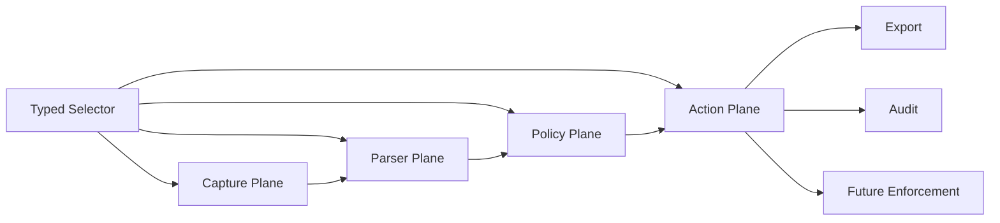
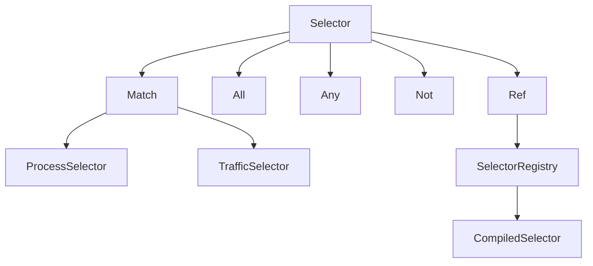
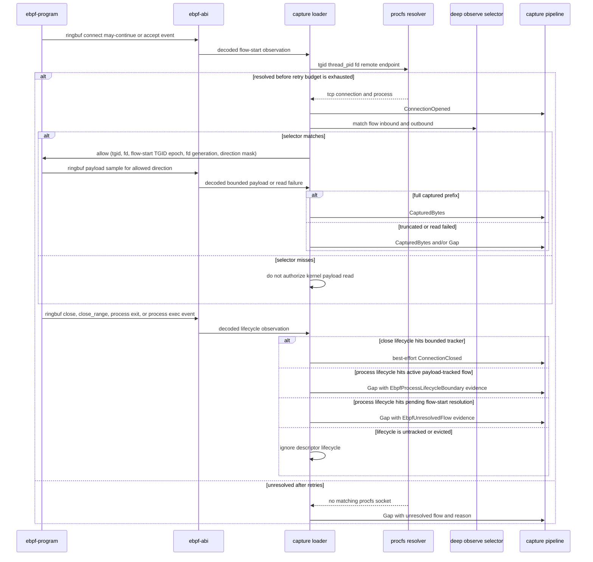
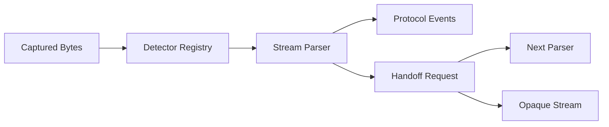
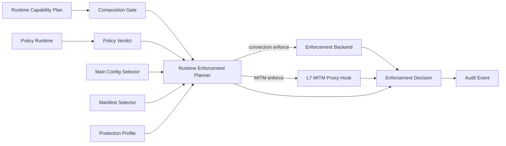
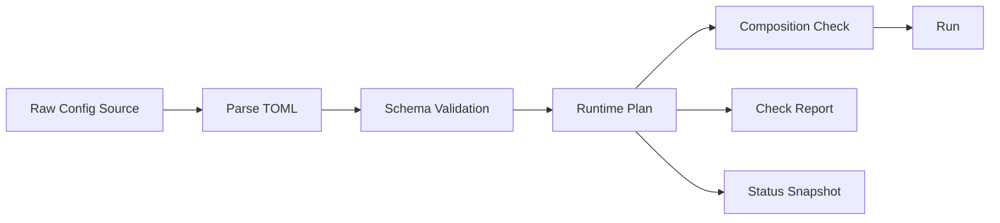
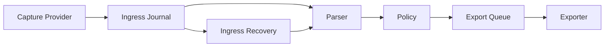

# traffic-probe 进程级流量探针设计文档

## 阅读地图

本文档既是设计说明，也是当前实现状态的事实源。建议按问题进入，而不是从头顺读：

- 先看方向：第 1-4 节说明目标、核心 thesis、不可妥协原则和当前范围。
- 看运行能力：第 5-6 节说明平台约束、capability matrix 和降级语义。
- 看采集路径：第 7-11 节说明 selector、身份模型、eBPF、libpcap 和 TLS plaintext。
- 看语义处理：第 12-17 节说明 parser、HTTP/SSE/WebSocket、payload 完整性、policy bundle 和 Lua API。
- 看防护与外发：第 18-26 节说明 enforcement、配置、secret/material、spool、exporter、压缩、脱敏和 status。
- 看工程与验收：第 27-35 节说明 workspace、错误处理、性能、CLI、E2E、推迟方案、阶段建议和决策清单。

结构约定：

- 摘要只回答“该看哪里”和“当前判断是什么”。
- 第 6 节维护 capability 事实目录，负责状态、边界和降级理由。
- 各领域章节维护实现细节、运行契约和验证路径。
- 第 35 节只是决策索引，不重复承载详细事实。

## 1. 背景与目标

`traffic-probe` 的目标不是做一个传统抓包工具，而是做一个面向 Linux 主机的进程级流量探针。它需要在支持 eBPF 的机器上优先使用 eBPF 获取强进程归因和高性能采集能力；在 eBPF 不可用或能力不足时，自动降级到
libpcap/procfs 等 fallback 路径，并明确标注能力降级。

本系统的长期方向包括四类能力：

- 进程级流量观测：识别进程、服务、容器、连接和协议语义。
- 加密流量 best effort 明文探测：默认优先通过非 MITM 路线获取 TLS 明文或会话材料；同时必须提供显式启用、按 selector 生效的
  MITM 路径，覆盖需要代理解密和主动防护的场景。
- 可扩展协议解析：首要支持 HTTP/1.x 和 SSE，后续自然扩展 WebSocket、HTTP/2、HTTP/3 等协议。
- 策略驱动的检测与防护：观测、告警、dry-run verdict、显式连接级执行、透明拦截和 MITM policy hook
  共享同一 selector 与审计边界。

本文档是架构事实源，同时记录当前实现状态。当前稳定方向是：

- capture/provider、parser、policy、export/enforcement 分层。
- 所有 provider 必须通过 typed capability、degraded 和 gap 语义如实表达边界。
- TLS plaintext 属于 best-effort sidecar，不得伪装成强解密或强归因能力。

### 当前实现快照

已形成的闭环：

- replay、libpcap 和 external plaintext feed 都可进入统一 pipeline。
- HTTP/1.x、SSE、WebSocket frame metadata 和 16 MiB 有界 text/binary message payload 已可解析。
- Lua policy 可产生 alert/verdict。
- Fjall ingress/export lanes、webhook/file exporter、status/admin/metrics 已可持续运行和观测。
- Storage retention 由统一 worker 维护 ingress/export lifecycle，并保留 per-sink cursor 与可退休前缀边界。
- 在线 capture input activity 与 pipeline metrics 可观测 input poll 活性、capture read、ingress/export 进展、
  policy/enforcement 输出和 provider-level capture loss。

eBPF / procfs 现状：

- eBPF process observation 已覆盖 connect、accept/accept4、close、plain `flags == 0` close_range，以及
  TGID-level process exit/exec lifecycle。
- `capture.deep_observe_selector` 可按方向授权 outbound `write(2)` / `sendto(2)` / `writev(2)` / `sendmsg(2)` 的
  single-buffer 或 bounded first-readable-iovec syscall argument sample。
- 同一 selector 授权且内核暴露 tracepoint member 的 outbound `sendfile(2)`/`sendfile64(2)` 会输出
  kernel-transfer byte-count `Gap`；
  该路径不产生 payload bytes。
- 同一 selector 授权 inbound `read(2)` / `recvfrom(2)` / `readv(2)` / `recvmsg(2)` 的 single-buffer 或
  bounded first-readable-iovec syscall result sample。
- 内核只在 userspace allow map 的 fd-table epoch、active fd generation 与 read/write direction mask 同时匹配时读取 payload。
- vector syscall 在固定 scan limit 内跳过 zero-length iovec，并读取第一个可读 iovec segment 的 bounded prefix。
- 输出 bytes 始终标记 degraded；scan limit 之外或 sample buffer 之外的字节用 gap 表达。
- procfs fd lookup 在真实 `/proc`、fd 仍 live、且 `pidfd_getfd`/`SO_COOKIE` 被权限模型允许时，可把 socket cookie 传播到
  `FlowIdentity` 和 `FlowContext`。
- procfs 路径不能解决 fd 已关闭后 userspace 才解析的时序竞争。
- process eBPF object 和 TLS plaintext artifact 都会把 output ringbuf 写失败转换为 degraded `capture_loss` export event。
- process eBPF provider 会把 output loss delta 保守投影到 active tracked payload flows；
  TLS plaintext provider 会把 output loss delta 保守投影到 previous output-loss checkpoint 之后观察到的 plaintext flows。
  二者都表达为 `next_offset = None` 的 flow-level `Gap`。
- 在线 pipeline metrics 出现 capture loss 时，agent health 会降级并报告 loss event 数与 lost event 数；
  这避免 provider poll loop 仍活跃时把 kernel/output loss 误读成完整采集。

TLS plaintext / session secret 现状：

- libssl uprobe plaintext sidecar 已有 provider-level、startup agent、dynamic process attach/detach、同 PID dynamic libssl load、
  同 PID replacement-style 第二 libssl mapped path，以及可卸载 libssl-like 旧映射消失后的 stale target 清理 privileged loopback E2E。
- TLS artifact 使用单一 global state epoch fence：`TRAFFIC_PROBE_TLS_STATE_EPOCHS[0]` 防止旧 `SSL*` map state 跨 attach lifecycle 被解释。
- session secret material 已能驱动 TLS 1.3 application-data protected record authenticated decrypt core。
- 解密后的 application data 可进入 `PlaintextEvent(source = tls_session_secret)` bridge。
- capture 层已有 stream adapter、binding planner、flow decryptor、decrypting provider adapter 和 auto-binding provider。
- `session_secret_file` 与 `key_log_file` 都可按 client random 查找 TLS 1.3 application traffic secret records。
- material 可先缺少 cipher suite，再由同一 flow 的 ServerHello selected cipher suite 形成 resolved binding。
- ClientHello 先于 material 到达时，auto-binding provider 会保留 pending candidate，并在后续 refresh 得到可用 secret 后激活。
- 已透传 record 不回溯重写；material 后到且当前 chunk 不在 TLS record 边界时仍保持 best-effort raw 透传。
- 绑定 stream 的 ciphertext suppression 独立于 decryptor active stream 状态，terminal decrypt gap 后仍继续抑制该方向后续密文。

已接入并由 capability gate 约束的防护能力：

- Linux socket destroy enforcement backend 已接入显式 capability gate、procfs owner 复核、active self-test 和 audit output；
  真实 destructive path 只有在 active self-test 证明当前 namespace/kernel 支持 socket destroy 时才可执行。
- selector-projected transparent interception 已覆盖入站 TPROXY、出站透明代理、process-scoped setup proof、
  owner-scoped outbound path 和 managed/external proxy lifecycle。
- Product MITM proxy 已覆盖显式 TLS material、operator-managed trust contract/material refs、upstream route/DNS discovery、
  HTTP policy hook、入站/出站透明 HTTPS 和 WebSocket tunnel path；它不自动修改客户端 trust store。

当前明确缺口：

- unbounded scatter/gather continuation。
- precise flow-specific lost-event reconstruction。
- 强 socket lifetime。
- 自动修改客户端 trust store、HTTP/2+ ALPN dispatch/routing 和完整 L7/TLS proxy 分类。
- 完整 TCP 栈恢复。
- 强进程归因。

## 2. 核心 thesis

这个项目不应该被设计成“抓包工具 + 若干 parser”。更干净的终局模型是四个平面分离：

| 平面 | 负责 | 不负责 |
| --- | --- | --- |
| 采集平面 | 连接、进程、socket、payload chunk、能力来源、gap/degraded 标记。 | 协议语义、业务检测、导出协议、最终阻断策略。 |
| 语义解析平面 | 协议识别、流重组后的解析、协议事件、handoff。 | 采集方式、脚本策略、外发重试、连接阻断。 |
| 策略平面 | selector 命中后的检测、转换、告警、typed verdict。 | 热路径目标选择、系统调用拦截、sink cursor 管理。 |
| 动作平面 | export、dry-run audit、未来 enforce/block/reset/quarantine。 | payload 解析、策略脚本执行、流量归因。 |



这四个平面必须解耦。采集可以默认全机，但深度内容解析、完整 payload、TLS 明文和未来拦截只能对 selector 命中的目标启用。这样可以同时满足：

- 全机可见性。
- 对受管进程/应用的深度观测。
- 对未来“只拦截某些应用”的能力预留。
- 对性能、隐私、资源预算和故障半径的控制。

一个必须避免的坏味道是把“采集过滤”“深度解析目标”“防护目标”做成三套互相漂移的规则语言。它们应该共享一套 typed selector 语义，再由策略或配置声明 observe、detect、enforce 等不同意图。

## 3. 不可妥协原则

- 不静默伪造完整性：任何 payload 缺口、能力缺失、缓冲溢出或 fallback 都必须以 `degraded`、`gap`、`capability` 等字段显式表达。
- 不把 PID 当稳定身份：进程归因必须使用复合身份，避免 PID 复用和长时间运行环境中的误归因。
- 不把证书误称为通用解密能力：现代 TLS 下证书/私钥通常不能解密 ECDHE/TLS 1.3 流量，必须区分 trust material 和 decrypt material。
- 不让策略语言承担热路径预过滤：selector 必须可编译、可索引、可解释；Lua 用于语义检测和 verdict，不用于替代 selector。
- 不为跨平台抽象牺牲 Linux 主线：当前目标只承诺 Linux，充分利用 procfs、cgroup、systemd、eBPF、capabilities。
- 不为了追求“灵活”暴露内部生命周期：Lua 策略可信，但只能访问受控领域 API，不暴露任意 Rust 内部对象、系统动态库或 FFI。
- 不承诺现实中无法同时满足的三元组：有限资源下不能同时保证无限流量不丢、不截断、不影响业务。当前目标采用有界无损与显式降级。

## 4. 当前目标范围

当前目标范围以 Linux host 观测闭环为基础，并覆盖显式防护、外发和管理面验证：

1. Host Agent 在 Linux 上运行。
2. 通过 selector 命中目标进程或服务。
3. eBPF/socket-first 路径采集连接和明文 HTTP/1.x 字节流。
4. HTTP/1.x parser 输出 request、response、body chunk、SSE 语义事件。
5. Lua 策略消费标准化事件，产生 alert 或 typed verdict。
6. 事件进入 Fjall-backed durable spool。
7. HTTP(S) webhook batch exporter 将事件发送到测试 receiver。
8. agent 暴露 capability matrix、metrics、health、degraded/gap counters 和 admin reload surface。

额外证明点：

- 单 libssl TLS demo：对一个 OpenSSL/libssl 测试进程，通过 `SSL_set_fd` 建立 `SSL* -> fd` 关联，用 `SSL_clear`/`SSL_free` 维护状态生命周期，并通过
  `SSL_read`、`SSL_write`、`SSL_read_ex`、`SSL_write_ex` uprobe 获取明文后接入同一 HTTP parser。
- libpcap fallback demo：eBPF 禁用、preflight unavailable 或 auto 运行期 open 失败时，使用 libpcap 捕获本机明文 HTTP/1.x，procfs best effort
  归因；libpcap provider 可报告 available capability，但 capture evidence/events/health 会表达 best-effort 降级。
- enforcement demo：Lua 策略返回 `deny`、`reset`、`quarantine` 等 typed verdict；默认 `audit_only`/`dry_run` 只记录 requested action、
  effective action、planner outcome 和 audit event，显式 `enforcement.backend = "linux_socket_destroy"` 可在 root 下对 selector
  命中的现有 TCP socket 做 procfs owner 复核，并且只在 active self-test 证明当前环境支持时通过
  `NETLINK_SOCK_DIAG`/`SOCK_DESTROY` 执行销毁。
- transparent/MITM demo：显式 selector、nftables/TPROXY 或 OUTPUT redirect、managed/external proxy、product MITM proxy、
  operator-managed trust contract/material refs、policy hook 和 durable audit 组合成可验证的入站/出站防护路径；
  客户端 trust store 仍由 operator 管理。

当前明确不做：

- 不做无 selector、无能力门控、无审计边界的默认全机 MITM；显式 MITM 是目标能力。
- 不默认启用真实连接阻断；必须显式选择 enforcement backend。
- 不承诺 Go `crypto/tls`、rustls、Java TLS 的明文覆盖。
- WebSocket `websocket_message` payload 上限为 16 MiB；超限 message 保留 frame metadata
  并省略 message event；不解压 WebSocket extension payload。
- 不支持 HTTP/2、HTTP/3/QUIC 的完整解析。
- 不实现动态远程控制面、长连接下发或运行中主配置热替换；admin config reload planning
  只校验和规划候选主配置，不替换运行中的 capture/export/TLS/admin owner。policy bundle 和 enforcement manifest
  只支持当前配置引用 source 的手动 reload 或显式本地 watcher。
- 不长期保存全量原始流量。

当前实现状态不在本节展开；第 6 节维护 capability 事实目录，各领域章节维护实现细节与验证路径。


## 5. 部署与平台

部署模型为 Linux Host Agent。agent 默认面向真实主机运行，而不是应用内嵌 SDK，也不是第一阶段的 Kubernetes DaemonSet 专用实现。

平台范围：

- 当前目标只承诺 Linux。
- 主支持面为 RHEL8+/Ubuntu20+ 级别环境。
- RHEL7/CentOS7 这类旧环境允许自动降级到 libpcap/procfs，不把 eBPF 主路径作为硬承诺。
- CPU 架构支持 `x86_64` 和 `aarch64`。

权限模型：

- 现实部署通常会以 root 运行。
- 设计上仍要做 capability discovery，并把长期目标设为最小 capabilities。
- 可能涉及的能力包括 `CAP_BPF`、`CAP_PERFMON`、`CAP_NET_ADMIN`、`CAP_NET_RAW` 等，具体按 runtime capability matrix 判定。
- 不应因为 root 运行就让内部代码随意访问系统能力；高风险能力必须集中在少数边界模块。

## 6. 能力矩阵与降级

启动时 agent 必须生成 capability matrix。它应覆盖：

- 采集能力：eBPF syscall/tracepoint、libpcap fallback、procfs attribution。
- TLS 明文能力：libssl uprobe、keylog/session secret、显式 MITM provider。
- 协议能力：HTTP/1.x、SSE、WebSocket upgrade detection、WebSocket frame metadata、opaque stream。
- 策略能力：policy runtime、Lua sandbox/budget、policy state API、manual online policy bundle reload、本地 policy bundle watcher、
  remote policy bundle polling。
- 动作能力：dry-run verdict、external enforcement manifest reload、本地 enforcement manifest watcher、connection-level enforcement
  capability boundary、未来 eBPF backend。
- 外发能力：spool-backed exporter、best-effort sink、codec 支持、mTLS。

配置和策略可以声明：

- `required_capabilities`：缺失时策略不启用，或 agent 按配置 fail fast。
- `preferred_capabilities`：缺失时策略降级运行，并产生 degraded 状态。

不允许静默降级。任何能力缺失必须出现在 capability matrix、metrics、admin API 和相关事件 envelope 中；active health 只聚合运行时选中的
capture/spool/exporter/policy 执行面的健康度，避免把路线图缺口伪装成运行故障。

### Capability matrix

- 已实现 capability matrix。
- 第 6 节分为两层。
- 第一层是人类可扫读的能力索引。
- 第二层是 capability fact catalog。
- 后续章节继续承载实现细节和验证路径。

### 能力分组索引

| 分组 | 当前能力 | 主要边界 | 详见 |
| --- | --- | --- | --- |
| Capture | `replay_capture`、`libpcap`、`ebpf`、`external_plaintext_feed` | eBPF/libpcap 都必须显式表达 degraded/gap；完整 TCP 栈和强 socket lifetime 仍缺失。 | 第 9-11 节 |
| Attribution | `procfs_attribution`、`procfs_socket_attribution` | procfs attribution 是 best-effort，权限、race、namespace 会导致漏归因。 | 第 8-10 节 |
| TLS plaintext | `libssl_uprobe`、keylog/session secret hints | 非 MITM 优先；TLS 1.3 auto-binding 已有，TLS 1.2 和强 fd ownership 仍缺失。 | 第 11、31 节 |
| L7 MITM | `l7_mitm` | 显式 MITM、backend lifecycle、product proxy TLS/bridge/hook 能力；详细事实见下方。 | 第 11、18、32 节 |
| Protocol | `http1`、`sse`、`websocket_handoff`、`websocket_frame`、`websocket_message` | HTTP/1.x、SSE、WebSocket frame metadata 和有界 message payload；详细 WebSocket 边界见下方。 | 第 12-14 节 |
| Policy | `policy_runtime` | 已支持 replay/live pipeline、多个 active bundle、manual reload、本地 bundle watcher 和 remote bundle polling；候选主配置 planning 可用，自动 owner swap 和 policy state migration 仍缺失。 | 第 15-17、28 节 |
| Storage / export | durable spool、ingress/export queue、webhook/file exporter | spool 负责恢复与投递；active parser state 不落盘；export 是 per-sink at-least-once。 | 第 21-24 节 |
| Enforcement | `dry_run_enforcement`、`connection_enforcement` | dry-run、external manifest、admin reload 和本地 manifest watcher 可用；真实 socket destroy 只在显式配置、root/procfs 能力满足、active loopback self-test 通过且 owner 复核通过时执行。 | 第 18 节 |
| Transparent interception | `transparent_interception`、classifier capability | 入站 TPROXY、出站透明代理和 managed L7 MITM lifecycle 已接入；高级 classifier 投影仍缺失。 | 第 18、31 节 |

L7 MITM 能力事实：

- 显式 MITM strategy 要求 backend contract、`client_trust.mode = "operator_managed"`、
  typed material refs、TCP readiness probe、durable lifecycle audit、loopback HTTP JSON policy hook
  和明确的 `l7_mitm_plaintext` data-plane provenance。
- `product_proxy` backend 从 typed bridge、policy hook、target recovery、CA 或 leaf TLS material、
  upstream trust material、非空 application protocol policy、显式 upstream route table 和 upstream discovery policy
  生成 first-party proxy CLI。
  缺省 protocol policy 是 HTTP/1.1；显式空列表视为配置错误。
- 内置 `traffic-probe-mitm-proxy` 覆盖 HTTP plaintext data-plane、显式下游 TLS termination、
  CA-backed dynamic SNI certificate generation、upstream TLS relay、downstream SNI-derived upstream TLS
  server name、由 application protocol policy 派生的 HTTP/1.1 ALPN advertise/gate、
  显式 exact / suffix-wildcard host-to-upstream route、显式 opt-in DNS upstream discovery、
  dynamic flow feed、
  HTTP/1.1 101 Upgrade 后 raw byte tunnel、Upgrade request/response 预读 tunnel bytes 的保留与转发、
  proxy-side hook deny 执行、透明入站/出站 HTTPS routed 与 DNS-discovered allow/deny 规则路径、
  透明入站/出站 HTTPS WebSocket Upgrade + frame tunnel，以及 durable delegated decision。
- product proxy 在 Upgrade 后只负责 byte relay 与 `l7_mitm_plaintext` feed；WebSocket handoff、frame 和
  message payload 仍由统一 pipeline parser 负责。
- 强原始归因、HTTP/2+ ALPN dispatch/routing、自动 client trust store 安装，以及除 WebSocket
  101 tunnel 以外的非 HTTP transparent allow-path matrix 仍缺失。
- DNS-discovered upstream selection 是 product proxy 的显式 opt-in 能力：固定 upstream 不能与 route table
  或 DNS discovery 混用，避免配置字段静默失效；route table 可以把 DNS discovery 作为显式 fallback。
  route table 优先于 DNS；DNS 使用 reconciled SNI/Host 和配置的 default port 或 recovered target port
  生成候选地址。
  解析结果默认拒绝 IANA special-purpose/special-use IPv4/IPv6 address ranges；operator
  必须显式允许这些地址。候选地址会去重、限量，并共享同一个 upstream connect deadline。
  privileged DNS discovery E2E 使用 `localhost` fixture 和显式 special-use allowance；
  默认拒绝 special-use address 的安全边界由 crate-level tests 覆盖。
  DNS 查询本身使用系统 resolver，因此解析阶段超时由宿主 resolver 配置决定；若需要产品级 DNS
  deadline，应引入独立 resolver。

Protocol 能力事实：

- WebSocket 输出 handoff、frame metadata 和 16 MiB 有界 text/binary message payload。
- 超限 message 保留 frame metadata 并省略 message event。
- 当前不解压 WebSocket extension payload。

L7 MITM backend 可由外部进程提供，也可由 agent 以 `managed_process` 方式启动。
可选 capture-event plaintext bridge 把 backend/feed 提供的 typed capture events 接入同一 pipeline；
这些明文数据面事件必须使用 `CaptureSource::L7MitmPlaintext` 与 `provider = interception`，
不得伪装成 generic external plaintext feed。
external backend 的 feed openability 在 setup preflight 阶段 fail closed，
managed backend 的 feed openability 在 backend readiness 后、透明规则安装前 fail closed。

### 能力事实目录

采集能力：

- `replay_capture`
  - Runtime status：Available。
  - 已实现：replay CLI 和 `ReplayProvider` 可驱动 parser、policy、ingress journal、export queue 和可选 webhook drain。
  - 边界：不代表 live capture 能力。

- `libpcap`
  - Runtime status：probed available/unavailable。
  - 已实现：agent composition root 按当前 libpcap 配置实际打开设备并安装 filter 后才注入 available descriptor。
  - 已实现：capture crate 已有 bounded best-effort TCP stream assembler，支持单调 offset、SYN payload sequence 归一化、
    重传去重、overlap trimming、有限乱序缓存、read-timeout flush、方向关闭边界裁剪、显式 gap 和全局乱序预算约束。
  - 边界：runtime 可报告 available，但证据质量仍是 best-effort。
  - 缺口：没有完整 TCP window/SACK 恢复、IPv6 extension/fragment 解析、内核 lost-event 反馈或强归因。

- `external_plaintext_feed`
  - Runtime status：Available。
  - 已实现：agent JSON-lines feed adapter 可消费外部已解密明文 bytes/gap/connection lifecycle event。
  - 已实现：adapter 转换为 `PlaintextEvent(source = external_plaintext_feed)` 后进入统一 pipeline。
  - 边界：它本身不执行 TLS 解密。

- `ebpf`
  - Runtime status：host/object/contract/procfs preflight 可用时为 degraded；host、object、contract 或 procfs preflight 失败时为 unavailable。
  - 已实现：host probe、`aya-obj` object preflight、strict process artifact contract、shared ABI。
  - 已实现：kernel connect enter/exit、accept/accept4、close/plain close_range、process exit/exec 和 payload tracepoint observation。
  - 已实现：userspace `aya` loader、ringbuf decoder、TGID+thread PID+fd lookup 到 `ConnectionOpened` bridge。
  - 已实现：`capture.deep_observe_selector` 命中 flow 后，userspace 将 descriptor lease
    `(tgid, fd, flow-start fd-table epoch, per-fd generation, read/write direction mask)` 写入 allow map。
  - 已实现：kernel object 在 connect/accept 时为 `(tgid, fd)` 分配 per-fd generation；payload allow gate 同时校验
    fd-table epoch 和 fd generation，避免旧授权在 fd 复用后继续采样。
  - 已实现：bounded outbound `write(2)` / `sendto(2)` / `writev(2)` / `sendmsg(2)` argument sample 到 always-degraded
    `CapturedBytes`/`Gap` bridge。
  - 已实现：当前内核暴露的 outbound `sendfile(2)`/`sendfile64(2)` tracepoint variant 的 kernel-transfer
    byte-count gap 到 always-degraded `Gap` bridge。
  - 已实现：bounded inbound `read(2)` / `recvfrom(2)` / `readv(2)` / `recvmsg(2)` result sample 到 always-degraded
    `CapturedBytes`/`Gap` bridge。
  - 已实现：payload bridge 和 close bridge 按 descriptor generation 匹配 tracked flow，避免同一 TGID+fd 复用时把
    payload 或 close lifecycle 归到旧连接或新连接。
  - 已实现：best-effort descriptor close/plain close_range 到 `ConnectionClosed` lifecycle event。
    close 携带 descriptor generation；close_range 按同 TGID fd range 终止已跟踪 flow。
  - 已实现：process exit/exec 输出 lifecycle boundary `Gap`，用于让 active payload-tracked flow 显式暴露 fd-table
    epoch continuity break。
  - 已实现：unresolved connect/accept 到 degraded `Gap` 的 provider wiring。
  - 已实现：output ringbuf write failure counter 到 degraded `capture_loss` event 的转换。
  - 已实现：process output loss delta 会对 active tracked payload flows 发出 conservative unknown-offset `Gap` fan-out，
    用于让 parser/policy/export 看到这些 flow 可能受到 provider loss 影响。
  - 已实现：成功 procfs fd lookup 在 live fd 且权限允许时，可把 `SO_COOKIE` 传播到 flow identity。
  - 已实现：outbound sample 只有 write direction 被授权时，才在 syscall enter 通过 allow gate 后捕获 bounded prefix。
  - 已实现：outbound syscall exit 只根据实际返回长度裁剪或降级，避免 exit 后重读可变用户 buffer。
  - 已实现：inbound sample 只有 read direction 被授权时，才在 syscall enter 通过 allow+lease gate 后固定 single-buffer
    或 iovec descriptor。
  - 已实现：inbound syscall exit 仅在成功返回后读取 enter-time target 的 bounded prefix，避免重新信任新的用户态指针。
  - 已实现：vector syscall 在固定 scan limit 内跳过 zero-length iovec，并读取第一个可读 iovec segment 的 bounded prefix。
  - 已实现：返回长度超过已捕获 prefix、scan limit 或 sample buffer 的部分表达为 gap。
  - 已实现：connect/accept fd 归因首轮会立即尝试；未解析 flow-start 会进入有界 pending queue，
    在 ringbuf drain 空闲时轮转 retry，避免单个 fd 解析失败阻塞后续 live observation。
  - 已实现：eBPF process observation provider 成功打开后，online capture status 的 `capture.provider` 报告
    `ebpf_process_observation` provider details；其中 `link_ownership` 按 program、tracepoint category/name 和 link count
    报告 userspace loader 已提交并持有的 tracepoint links。
  - 已实现：Prometheus 暴露同一 link ownership fact，包括 metrics availability、ownership mode、总 owned link count
    和 per-program owned link count；这些指标只表达 userspace-held committed link handles，不表达 per-link kernel firing
    liveness。
  - 已实现：pipeline runtime metrics 记录 capture loss event 与 lost event 总数；若在线 status 输入包含非零
    capture loss，agent health 降级并在 reason 中报告对应计数。
  - 边界：capability 和 evidence mode 仍是 degraded/best-effort。
  - 边界：outbound sample 不是内核已发送字节的强证明，inbound sample 也只是 syscall 返回后的用户 buffer 观察，不等于完整 socket 流。
  - 边界：descriptor lease 是进程 fd 级错配防护，不等同于 kernel socket object identity。
  - 边界：process exit/exec lifecycle 不生成 `ConnectionClosed`。它只为 userspace 已跟踪且已授权 payload 的同 TGID flow
    输出 unknown-offset `Gap`，并取消同 TGID 尚未完成 procfs resolution 的 pending connect/accept flow-start。pending
    cancellation 使用 `EbpfUnresolvedFlow` evidence；tracked flow boundary 使用 `EbpfProcessLifecycleBoundary` evidence。
    这些信号不补全未跟踪、已淘汰或丢失事件的 socket lifecycle。
  - 边界：process eBPF `link_ownership` 只证明 loader 成功提交并仍持有 tracepoint link handles；
    它不是动态 per-link firing/liveness probe，也不证明任意 socket-object lifetime。
  - 边界：`SO_COOKIE` 只增强成功 fd lookup 后的身份，不解决 fd 关闭后才解析、dup/fork/fd passing 或 lost event。
  - 边界：output ringbuf failure 的 flow fan-out 是保守影响信号，不知道具体丢失事件、字节范围或 next offset，也不能重建 parser state。
  - 缺口：unbounded scatter/gather continuation、precise flow-specific lost-event reconstruction、partial-write retry 语义和完整
    kernel/socket-path traffic capture program 尚未完成。
  - 缺口：仍缺 kernel-side socket cookie，以及 fork/dup/fd passing/unshare/lost-event 场景的完整 socket-object lifetime。
  - fallback 语义：`auto` 会优先规划可构建的 degraded eBPF provider，并在 evidence fields/health 保留降级原因。
  - fallback 语义：plan-time eBPF unavailable 会进入后续 libpcap fallback；run-time open/attach 失败会继续尝试后续 live provider，
    并在 status `capture.open_failures` 保留失败 backend 与原因。

归因能力：

- `procfs_attribution`
  - Runtime status：probed degraded/unavailable。
  - 已实现：枚举 `/proc` 下 numeric PID 目录，并从 `/proc/<pid>` 读取进程身份、cmdline hash、starttime、uid/gid、
    cgroup、systemd service 与 container hint。
  - 边界：hidepid、权限、PID race、namespace 边界会导致 best-effort 降级。

- `procfs_socket_attribution`
  - Runtime status：probed degraded/unavailable。
  - 已实现：通过 `/proc/net/tcp`、best-effort `/proc/net/tcp6`、socket inode、`/proc/<pid>/fd` 和 TGID+thread PID+fd
    lookup 做 TCP 连接归因。
  - 已实现：fd lookup 支持 thread pid、TGID fallback、`NStgid` PID namespace alias，以及 hidden TGID 场景下的 unique
    fd/process-hint candidate。
  - 已实现：真实 `/proc` 上可对 live socket fd 使用 `pidfd_getfd` + `SO_COOKIE` 获取可选 socket cookie，并要求 duplicated
    fd inode 与原 fd symlink inode 一致。
  - 已实现：tcp6 IPv4-mapped endpoint 会归一化。
  - 边界：snapshot 与 fd symlink 读取不是同一内核时间点，权限/race/namespace 仍会导致漏归因。
  - 边界：socket cookie 只是成功 fd lookup 的增强身份，不代表强 socket lifetime。
  - 边界：alias/hint fallback 只在候选扫描完整、expected remote、name、uid/gid 和唯一候选同时匹配时使用。
  - 边界：fd 证据拿不到时不会用全机 remote endpoint 猜进程；错误进入 degradation reason，不静默伪装成匹配。

TLS 明文与协议能力：

- `libssl_uprobe`
  - Runtime status：probed degraded/unavailable；degraded 可显式用于 best-effort TLS plaintext。
  - 已实现：process-scoped discovery/planning、strict TLS artifact preflight、libssl plaintext eBPF producer、userspace Aya loader/provider。
  - 已实现：ringbuf sample decoder、procfs fd-to-flow resolver、BPF PID 与当前 procfs PID 不一致时的 attach-plan 唯一 fd fallback。
  - 已实现：startup attach planning、periodic reconcile sidecar、dynamic process attach/detach E2E、同 PID dynamic libssl load E2E、
    同 PID replacement-style 第二 libssl mapped path E2E、可卸载 libssl-like 旧映射消失 E2E。
  - 已实现：single global state-epoch fence、online `last_reconcile` status、provider output selector fail-closed gate、
    primary+TLS multiplexer wiring。
  - 已实现：online `last_reconcile` target snapshots 带 per-target `reconcile_state`，
    区分 latest reconcile 中 newly attached、active 和 detached target 的状态。
  - 已实现：online `last_reconcile` target snapshots 带 per-target `link_ownership`，
    报告 userspace attach session 是否仍持有该 target 的 committed libssl uprobe links，并按 BPF program 汇总 link 数量。
  - 已实现：online TLS plaintext runtime 暴露 `reconcile_health`，记录 reconcile loop 最近一次尝试的 outcome、
    observed timestamp、失败原因和连续失败次数；可恢复 planning failure 会降级整体 health 但继续 poll 现有 provider，
    fatal planner/provider reconcile error 会记录失败 attempt 并禁用 TLS sidecar。
  - 已实现：online TLS plaintext runtime 暴露 `provider_activity`，记录 provider progress、非 loss capture event、
    output loss event、累计 lost events 和最后一次 provider signal，用于区分 attach/reconcile 成功与 provider 真实 firing/loss 事实。
  - 已实现：attach safety 使用 target-scoped session commit 和 unsafe partial side effect fail-closed。
  - 已实现：TLS output loss delta 会对 previous output-loss checkpoint 之后观察到的 plaintext flows 发出 conservative
    unknown-offset `Gap` fan-out，
    用于让 parser/policy/export 看到这些 flow 可能受到 provider loss 影响。
  - 边界：仍是 degraded；`FD_VALID` 只表示可尝试 fd-based 归因，不等于强 socket ownership。
  - 边界：TLS output loss 的 flow fan-out 是保守影响信号，不知道具体丢失事件、TLS record、字节范围或 next offset，
    也不能重建 parser state。
  - 边界：未解析 flow 只能在 selector 不依赖未知 process/traffic 维度时放行。
  - 边界：未知 exe/cmdline/systemd/container 以及远端端口/地址、本地端口等 traffic 维度都会 fail closed；
    `not` 不会把 unknown 反向放行。
  - 缺口：见 [Remaining TLS lifecycle gaps](#remaining-tls-lifecycle-gaps)。

- keylog/session decrypt hints
  - Runtime status：live host capture 且显式配置 `key_log_refs` 或 `session_secret_refs` 时，可做 TLS 1.3 live auto-binding。
  - 已实现：TLS plaintext plan 已拆成 instrumentation 与 decrypt hints。
  - 已实现：`check` 可对 `key_log_file` 做 SSLKEYLOGFILE 语法核验和 secret-free 摘要。
  - 已实现：`check` 可对 `session_secret_file` 做 JSON Lines session secret schema 校验和 secret-free 摘要。
  - 已实现：capture 层已有 TLS 1.3 application traffic secret decrypt core、handshake observer、binding planner、
    ciphertext stream adapter、flow decryptor、显式绑定 provider 和 auto-binding provider。
  - 已实现：binding planner 支持 material 自带 `cipher_suite`，也支持由同一 flow 的 ServerHello observed cipher suite 补齐缺失字段。
  - 已实现：material suite 与 observed suite 冲突时 fail closed。
  - 已实现：agent live composition root 在 live host capture 下会通过单一 typed auto-binding material collection 读取有界 regular file material。
  - 已实现：`session_secret_file` 与 `key_log_file` 会归一成 lookup-unique TLS 1.3 application secret store，并用同一个 refresh runtime
    包装 primary provider。
  - 已实现：两类 record 都可先只带 client random + traffic secret，后续由 ServerHello selected cipher suite 写入 candidate intent
    并激活 candidate。
  - 已实现：auto-binding 只在 authenticated application record 成功后绑定并冻结 material record + resolved cipher suite。
  - 已实现：支持 bounded sequence candidate window、非零 sequence plaintext gap、pre-bind buffering、held raw release、
    ciphertext suppression、terminal decrypt gap 后继续 suppression，以及上游 enforcement evidence 传播。
  - 边界：仍是 degraded/best-effort，需要明文 TLS 1.3 ClientHello/ServerHello 和后续 protected application record。
  - 边界：已透传密文不会回溯；material 后到且当前 chunk 不在 TLS record 边界时仍可能 raw 透传。
  - 缺口：unbounded/general sequence resync、TLS 1.2 key block decrypt 和强 socket ownership；L7 MITM lifecycle 由 `l7_mitm` fact 单独跟踪。
  - 边界：证书/私钥不会被误称为通用解密材料。
  - 验收：privileged E2E 覆盖 `session_secret_file` 与 `key_log_file` 的预置和 ClientHello/ServerHello handshake 后 refresh 路径。
  - 验收：keylog refresh case 覆盖 partial line 后补齐的 live tail 语义。

- `l7_mitm`
  - Runtime status：默认 unavailable；显式配置 L7 MITM backend contract、material contract 完整且
    readiness 约束可满足时可为 available。
    external backend 在 composition 阶段要求 TCP readiness probe 可达。
    `managed_process` backend 在 composition 阶段要求 `program` 是可访问的 executable regular file，
    并在 run 阶段由 agent 启动独立进程组；透明规则安装前必须通过同一 readiness probe。
    在线 runtime 会继续按 backend readiness probe 的 `interval_ms` 周期检查同一 TCP endpoint；
    `managed_process` 的 health check 还会确认直接子进程未提前退出。
    连续失败达到 `failure_threshold` 后，agent health 会降为 degraded。
  - `inbound_tproxy_mitm` 与 `outbound_transparent_mitm` 是显式 strategy，由 config、RuntimePlan、check report 和 validation 共同表达。
  - backend contract 由第 18 节定义，包含 backend kind、typed material refs、本机 listener readiness/health gate，
    以及 `managed_process` backend 的 `program` / `args` / `working_dir` process contract。
    配置 plaintext bridge 时，external backend 的 feed openability 属于 setup preflight gate；
    managed backend 会先通过 readiness，再打开 bridge feed。
  - 可选 policy hook 使用本机 HTTP JSON endpoint，把每流量保护动作委托给 MITM proxy。
    配置 policy hook 的 MITM strategy 在 RuntimePlan 中使用 `l7_mitm_proxy_hook` planner surface；
    透明接管 lifecycle 仍由 transparent interception plan 管理。
    root/net-admin E2E 会验证 Lua protective verdict 经 HTTP JSON hook 到达本机 proxy endpoint，
    proxy 返回带 `executed_action` 的 `delegated` 后写入带 typed execution evidence 的 durable `EnforcementDecision`。
    managed-process MITM fixture 还会把 HTTP data-plane listener 和 policy hook endpoint 放在同一个 backend 进程内；
    只有该 backend 已接收对应 HTTP request bytes 并生成 plaintext bridge flow 时，
    fixture 才会写入 action report、返回 delegated deny，并向下游连接返回代理侧 deny response。
  - 可选 `plaintext_bridge.mode = "capture_event_feed"` 使用 JSON-lines `CaptureEvent` feed 作为 MITM plaintext bridge；
    bridge 作为 live capture sidecar 进入同一 parser/policy/spool/export pipeline，不替代主 live capture provider。
    bridge 写入的 flow 事件使用 `source = l7_mitm_plaintext` 与 `provider = interception`，
    因此可与 generic external plaintext feed 在 provenance、policy view 和审计中区分。
    runtime bridge mode 依次表达 `configured`、`ready`、`active` 和 `disabled_after_error`：
    `ready` 表示 feed 已打开，`active` 表示 provider 已挂入 live capture mux。
    bridge 运行中读取失败会按 best-effort sidecar 语义禁用，并写入 L7 MITM runtime status 和 health reason；
    metrics 暴露 plaintext bridge mode，避免把错误字符串变成高基数标签。
    这避免主 live capture 被拖垮，也避免显式 MITM bridge 失败被静默隐藏。
  - MITM material refs 必须指向 `tls.materials` 中匹配 kind 的 material；重复 refs、缺半边 pair 或在非 MITM strategy 下配置 MITM material 都会 fail closed。
  - MITM strategy 必须显式配置 `client_trust.mode = "operator_managed"`。
    该 contract 表示客户端信任安装由 operator 或外部部署流程负责；
    agent 验证 MITM material refs，报告 client trust mode 和 material shape，但不修改客户端 trust store。
  - agent 能把 selector 命中的连接重定向到 configured proxy listener，并在 capability matrix/status/check 中表达该 contract。
  - `external` backend 不由 agent 管理进程；`managed_process` backend 由 agent 启动直接子进程，
    显式 stop 和 panic/unwind drop 都会 best-effort 清理其进程组。
    两种 backend 都不证明 proxy 已完成 TLS interception；没有配置 plaintext bridge 时，listener readiness 不能等同于明文 parser 数据面。
  - backend lifecycle 与 health monitor 会输出 provider-level `l7_mitm_audit` event 到 durable export queue。
    event 是 backend-specific typed contract：`external` backend 可记录 `backend_starting`、
    `backend_health_probe_started`、`backend_unhealthy`、`backend_recovered`、`backend_stopping`、
    `backend_stopped` 和 `backend_stop_failed`；`managed_process` backend 可记录 `backend_starting`、
    `backend_ready`、`backend_unhealthy`、`backend_recovered`、`backend_start_failed`、`backend_stopping`、
    `backend_stopped` 和 `backend_stop_failed`。
    audit payload 携带 readiness probe；managed backend 额外携带 program、args_count、working_dir 和可选 process_group；
    unhealthy/start/stop failure phase 携带失败原因。`backend_unhealthy` 与 `backend_recovered`
    只记录健康状态边界转移，不把每次 TCP probe 写成控制面日志。该事件不触发 flow-level Lua policy hook。
  - MITM strategy 拒绝 `managed_tcp_relay`，避免把 plain TCP relay 伪装成 L7 backend。
  - 目标：作为独立 plaintext/enforcement backend 接入，而不是证书导入的隐式副作用。
  - 目标：只允许显式启用、selector-scoped、capability-gated，并输出独立 readiness/status/audit。
  - 边界：默认全机透明 MITM 被拒绝；proxy-first 也不是默认主采集路径。
  - 边界：readiness/health probe 只证明配置的本机 TCP endpoint 可达；它不是外部进程 supervisor，
    不证明 IPv4/IPv6 全族 transparent listener 都可用，也不单独证明透明规则路径下的 TLS handshake
    或 plaintext extraction 成功。
    内置 `traffic-probe-mitm-proxy` 的 TLS listener 单独证明下游 TLS server-side termination
    和 CA-backed dynamic SNI certificate generation 可生成明文 HTTP feed；
    crate-level upstream TLS relay 测试证明 downstream SNI-derived server name、HTTP Host fallback、导入 trust anchor
    和明确 HTTP response framing 可用于上游 TLS relay，但不证明 native root store 在宿主机上的证书覆盖，
    也不证明透明规则路径中的 deny/audit 行为。
  - 边界：capture-event plaintext bridge 只接收 MITM backend/feed 提供的统一 capture events；policy hook transport 只证明 agent 能把
    protective verdict 委托给本机 MITM proxy，并记录 proxy 声明执行同一动作后的 typed durable decision。
    managed backend-owned fixture 证明 HTTP data-plane、plaintext bridge feed 和 action execution contract 可由同一个 backend 进程持有；
    内置 `traffic-probe-mitm-proxy` 进一步证明 `product_proxy` 模式可生成 dynamic `l7_mitm_plaintext`
    flow、写入 request plaintext feed、上游转发 response plaintext feed 和 proxy-generated deny/gateway
    response plaintext feed、接收 proxy-side hook，并在 deny verdict 下向 downstream 返回本地 403。
    同一产品 proxy 支持显式配置证书链和私钥来终止下游 TLS；CA-backed dynamic certificate mode
    要求下游 TLS client 发送 DNS SNI。启用 upstream TLS 时，该 SNI 优先作为 upstream TLS server name；
    没有下游 TLS SNI 时，可使用单一有效 HTTP Host 作为 fallback。若 SNI 与 Host 同时存在但不一致，
    proxy 会 fail closed；配置的 `upstream_server_name` 是对观测到的 SNI/Host 的 pin。
    upstream TLS root store 由 native roots 和导入 upstream trust anchors 组成；crate-level tests 覆盖导入 trust anchor 路径。
    显式 upstream route table 使用同一 SNI/Host reconciler，把规范化 DNS host 映射到 IP socket
    upstream target；route 支持 exact host 和 `*.suffix` wildcard suffix pattern；exact host 优先于 wildcard，
    多个 wildcard 命中时最长 suffix 优先。固定 upstream 不能与 route table 或 DNS discovery 混用；
    route 未命中时，显式启用的 DNS upstream discovery 会把 reconciled SNI/Host 解析成候选 socket
    addresses；discovery 未启用或无法形成 authority 时，回退 recovered original destination。
    DNS discovery 默认过滤 IANA special-purpose/special-use address ranges，只有显式配置例外时才允许。
    privileged DNS-discovered transparent E2E 使用 `localhost` upstream fixture 和显式 special-use allowance；
    默认拒绝 special-use address 的安全边界由 crate-level tests 覆盖。
    透明 HTTPS E2E 覆盖 product proxy 的入站和出站 routed / DNS-discovered allow/deny path。入站路径中，
    fresh network namespace client 经 veth/TPROXY 进入 product proxy；出站路径中，本机 client 经
    OUTPUT redirect 进入同一个 product proxy，proxy 自身 upstream socket 使用保留 mark 绕过再次捕获。
    两个方向都使用 operator-managed CA trust 完成下游 TLS handshake；allow path 根据 Host route
    或 opt-in DNS discovery 转发到 upstream TLS server 并写入 request/response plaintext feed；deny path 触发 HTTP JSON hook
    的 deny verdict，返回代理侧 403，并写入 `l7_mitm_plaintext` feed 与 durable delegated decision。
    无法连接 upstream 或无法生成有效 route/authority 时，proxy-generated gateway response 同样写入
    `l7_mitm_plaintext` feed，避免 downstream 可见响应从 pipeline 中消失。
    同一透明规则路径也覆盖 WebSocket Upgrade + text frame tunnel：proxy 负责 byte relay 与 plaintext feed，
    parser/pipeline 负责 WebSocket handoff、frame、message 和 policy alert。
    TLS ALPN 列表由非空 application protocol policy 派生；当前缺省且唯一支持 HTTP/1.1，
    因此只 advertise `http/1.1` ALPN。
    无 ALPN 的 legacy client 仍按 HTTP/1.x 处理，明确协商非 HTTP/1.1 ALPN 的下游连接会 fail closed，
    上游 TLS client 同样只 advertise `http/1.1`。
    强原始 socket/process attribution、HTTP/2+ ALPN dispatch/routing、自动 client trust store 安装，
    以及除 WebSocket 101 tunnel 以外的非 HTTP transparent allow-path matrix 仍缺失。
    DNS-discovered upstream selection 已有 product proxy 配置、plan、CLI、crate-level data-plane
    和 privileged inbound/outbound transparent E2E 覆盖。
  - 验收：fresh network namespace E2E 覆盖入站/出站 MITM strategy 的 external backend：
    `xtask e2e-mitm-plaintext-bridge-live-sidecar` 和
    `xtask e2e-outbound-mitm-plaintext-bridge-live-sidecar` 证明 libpcap live primary 与运行期追加的
    external MITM capture-event plaintext bridge sidecar 同时进入 parser/policy/spool/export pipeline，
    并验证对应 strategy status；出站 case 还会连接无人监听的 selector remote port，证明命中 socket
    经 OUTPUT redirect 到 MITM backend。
  - 验收：`xtask e2e-mitm-policy-hook-plaintext-bridge-live-sidecar` 使用同一 fresh network namespace
    入站 MITM bridge harness，验证 external enforcement manifest 的 protective action profile、Lua `deny`
    verdict、本机 HTTP JSON policy hook request、proxy `delegated`/`executed_action` response、agent enforcement metrics 以及
    durable `PolicyVerdict` / `EnforcementDecision` readback。
  - 验收：managed-process MITM policy hook E2E 覆盖 backend-owned HTTP data-plane canary、hook endpoint、
    同 backend 生成的 plaintext bridge flow、proxy-side deny response、action report 和 typed
    `EnforcementDecision.execution` readback。
  - 验收：`xtask e2e-product-mitm-proxy-transparent-https-policy-hook` 和
    `xtask e2e-product-outbound-mitm-proxy-transparent-https-policy-hook`
    覆盖正式 `traffic-probe-mitm-proxy` 作为 first-party `product_proxy` backend 被启动、创建
    capture-event feed、生成 dynamic L7 MITM plaintext flow、分别在入站 TPROXY 和出站 OUTPUT redirect
    规则路径下完成下游 TLS handshake、通过本机 HTTP JSON hook 接收 deny action、返回带 policy reason
    的 403，并写入 durable delegated `EnforcementDecision`。出站 case 把 upstream route 目标设为同一个
    selector 命中的 socket address；product proxy upstream socket 必须使用保留 mark 才能绕过自身透明捕获。
  - 验收：fresh network namespace E2E 覆盖入站/出站 MITM strategy 的 agent-managed backend：
    `xtask e2e-managed-mitm-plaintext-bridge-live-sidecar` 和
    `xtask e2e-managed-outbound-mitm-plaintext-bridge-live-sidecar` 证明 agent-managed backend 启动、
    managed backend HTTP data-plane canary 驱动 backend-owned bridge feed 追加 typed events、admin status 中 `managed_process`
    backend 与 `healthy`/`active` runtime、graceful shutdown 后 backend 进程清理，以及同一
    parser/policy/spool/export pipeline 闭环；出站 case 同时使用 selector remote port canary
    证明命中 socket 经 OUTPUT redirect 到 managed MITM backend。
  - 验收：配置解析、material ref 校验、readiness fail-closed、managed process spawn/stop、relay 伪装拒绝、
    双 capability plan、status/check report 和 runtime validation 均有覆盖。

- `http1` / `sse` / `websocket_handoff` / `websocket_frame` / `websocket_message`
  - Runtime status：HTTP/1、SSE、WebSocket handoff/frame 为 Available；`websocket_message` 为 Degraded，因为只提供
    16 MiB 有界 non-extension text/binary payload，不解压 extension payload。
  - 已实现：HTTP/1 parser 已处理 request/response role、body、SSE 和 WebSocket Upgrade handoff。
  - 已实现：handoff 后切换到 WebSocket frame parser，输出 frame metadata 与 payload fingerprint。
  - 已实现：对无 extension RSV 的 text/binary payload 输出 16 MiB 有界完整 message payload，包括 message sequence、
    首尾 frame sequence、payload length、base64 JSON payload bytes 和 payload fingerprint。
  - 已实现：message 超过 16 MiB 时继续输出 frame metadata，省略对应 `websocket_message`，并在 message 边界恢复
    checkpoint-safe 状态。
  - 验收：`xtask e2e-sse-plaintext-feed` 覆盖 external plaintext feed 的 HTTP streaming response、body chunk、SSE semantic event、
    Lua `on_sse_event` hook、close-flushed end-of-stream、connection lifecycle 顺序、无 protocol error 和 durable spool 输出。
  - 验收：`xtask e2e-websocket-plaintext-feed` 覆盖 HTTP Upgrade、101 response、WebSocket text frame、message payload、
    handoff/frame/message export、Lua hook、connection lifecycle 顺序、无 protocol error 和 durable spool 输出。
  - 边界：超限 WebSocket message 不输出 `websocket_message`，不解压 extension payload；不支持 HTTP/2、HTTP/3/QUIC。

策略、存储与外发能力：

- `policy_runtime`
  - Runtime status：Degraded。
  - 已实现：Lua policy runtime 已接入 replay/live pipeline，支持多个 active bundle 按配置顺序执行。
  - 已实现：支持 typed alert/verdict/runtime error audit。
  - 已实现：在线 admin `reload_policies` 可手动 validate-then-swap 当前配置引用的 policy bundles，并已有真实 agent E2E 覆盖 reload。
  - 已实现：`[policy_reload] watch_local_bundles = true` 会监听 enabled 本地 policy bundle directory，文件变更经 debounce 后复用同一
    validate-then-swap reload primitive；失败时保留旧 active set。
  - 已实现：`[policy_reload] poll_remote_bundles = true` 会按固定间隔拉取 enabled remote bundle，并复用同一
    validate-then-swap reload primitive；失败时保留旧 active set。
  - 已实现：policy reload 会比较 loaded policy content；内容未变化时完成校验但不替换 active Lua VM。
  - 缺口：候选主配置可规划但不会替换 active config；push/streaming 控制面下发和 policy state migration 未实现。

- `durable_spool` / `ingress_journal`
  - Runtime status：Degraded。
  - 已实现：Fjall ingress journal/export queue 可持久化并恢复 bytes、gap、connection opened/closed capture events。
  - 已实现：pipeline export event 带 ingress provenance，使同一 ingress replay 的 event id 稳定。
  - 已实现：ingress cursor owner 是 storage 层 typed owner，parser recovery owner 由 pipeline 定义。
  - 已实现：parser 在所有 flow 都 checkpoint-safe 且没有 flow-carried observation-only evidence 时推进 durable safe-prefix cursor。
  - 已实现：可按 `[storage.retention.ingress]` 的 max-age 或 max-records 策略清理 ingress 连续前缀，并在同一 storage batch
    中退休 parser recovery cursor。
  - 边界：恢复会按当前 config/policy 重新解释已落盘 ingress。
  - 边界：active parser state 和 flow-carried evidence 不序列化落盘，崩溃后需要从 safe-prefix cursor 之后重放。
  - 边界：retention 是显式生命周期丢弃，不是 parser state snapshot。

- `export_queue`
  - Runtime status：Available。
  - 已实现：export lane、pipeline-generated stable event id 写入侧去重、per-sink cursor、schema-aware payload、
    protobuf batch envelope、record-level `stored_at_unix_ns`。
  - 已实现：export drain 同时受 record count 与 payload bytes soft limit 约束；超过 bytes limit 时发送连续前缀，
    单个超限 event 仍单独发送以保证 cursor 可推进。
  - 已实现：按 planned sinks cursor 下界执行 acked-prefix cleanup。
  - 已实现：按 retention deadline 退休过期连续前缀，按 `max_records` 保留最新后缀的容量 retention。
  - 边界：`append_export` 手工写入不走 dedup。
  - 边界：外发仍是 per-sink at-least-once delivery；sink 或后续 consumer 仍需要按 event id / batch range 处理投递重试幂等。

- `webhook_exporter`
  - Runtime status：Available。
  - 已实现：`run` 可连续 drain planned sinks。
  - 已实现：支持固定间隔、全局/每 sink batch 预算、single sink timeout、per-sink exponential backoff。
  - 已实现：支持 cursor-safe acked-prefix export queue cleanup、trust anchors、client identity refs。
  - 已实现：在线 admin status 可暴露 per-sink backoff runtime snapshot，metrics 可暴露 backing-off sink aggregate count。
  - 已实现：runtime plan 内部使用 typed `ExportSinkPlan` dispatch，status 中 transport-specific 字段放在 `exporters[].target`。
  - 验收：`xtask e2e-webhook-exporter` 覆盖 configured webhook sink 的 bounded-run tail drain、非默认 gzip codec、
    `POST /batches`、`application/x-protobuf` protobuf batch body、batch id range、连续无重复 export sequence、JSON payload schema、
    完整预期 export event set、JSON structured ack、custom headers、collector sink cursor 前进和无 pending records。
  - 边界：当前 E2E 不证明 periodic worker loop、rejection/retry/partial ACK 或 lane record prune；这些由 agent export/storage
    单元与集成测试覆盖。
  - 边界：gRPC/Kafka/OTLP 应作为后续新的 typed export target 变体接入，而不是在当前配置中保留空枚举。

- `file_exporter`
  - Runtime status：Available。
  - 已实现：`file` transport 可作为 planned sink 从同一 export queue drain protobuf batch envelope。
  - 已实现：按 exporter codec 压缩后写入 JSON Lines record；record 使用 typed codec 字段，每行包含 batch id、agent id、codec、
    first/last sequence、event count 和 base64 payload。
  - 已实现：写入路径使用 parent directory fd + `openat` + `O_NOFOLLOW` append。
  - 已实现：新建文件固定 `0600`；已有文件必须是 non-symlink regular file，owner uid 等于 agent effective uid，owner read/write
    bits 存在，group/other permission bits 为空，可写，且当前内容为空或以 JSON Lines newline 边界结束。
  - 已实现：existing/missing target 的 parent 必须是 non-symlink directory、owner uid 等于 agent effective uid、
    不能允许 group/other 写入；打开 parent fd 后会再次按 fd metadata 验证同一 trust boundary。
  - 已实现：missing target 的 parent 还必须对 effective uid writable/searchable。
  - 已实现：blocking file I/O 放入 blocking task，成功 `write_all`、`flush`、`sync_data`，新建文件额外 sync 创建时持有的
    parent directory fd 后才推进该 sink cursor。
  - 已实现：agent status 通过 exporter 的 non-mutating preflight 报告 file target 是否 available；该 preflight 可打开 parent/target
    并读取 existing target 最后一个字节，但不会写入目标。
  - 验收：config/runtime/agent drain/status/exporter 测试覆盖 file transport 解析、plan、drain、cursor advance、JSON Lines
    record decode、private mode、root-gated owner mismatch 拒绝、insecure existing file 拒绝、unframed existing tail 拒绝、
    framed existing file append、symlink 拒绝、untrusted/unwritable parent status 和 status target。
  - 验收：`xtask e2e-file-exporter` 覆盖真实 agent bounded run tail drain，以 zstd-compressed protobuf batch 写入 JSON Lines
    file record，随后解码 record、验证 batch range/id/schema/event set、sink cursor 前进且无 pending records。
  - 边界：regular file append 适合本地交接和端到端调试，不等同于远端 durable delivery。
  - 边界：不创建父目录，不替代外部 log rotation 或独立 at-rest encryption。
  - 边界：preflight 不能证明未来写入一定不会遇到磁盘满、权限变化、ACL/immutable flag 或运行期 I/O 错误。
  - 边界：sink timeout 已避免 blocking file I/O 占住 async worker，但 protobuf encode、compression 和 JSON serialization
    仍在进入 blocking file write 前执行，不是硬实时可抢占预算。

防护与透明拦截能力：

- `dry_run_enforcement`
  - Runtime status：Available。
  - 已实现：dry-run enforcement 会记录策略保护意图、requested/effective action 和 audit event。
  - 已实现：external enforcement manifest 的 selector/profile 会进入 active planner。
  - 已实现：在线 admin `reload_enforcement_policy` 可 validate-then-swap 当前 source 解析出的 active selector/profile；
    坏 manifest 不污染运行态。
  - 已实现：`[enforcement.policy.reload] watch_local_manifest = true` 会监听本地 `file` source 或 `directory/manifest.toml`，
    文件变更经 debounce 后复用同一 validate-then-swap reload primitive；坏 manifest 不污染运行态。
  - 已实现：`[enforcement.policy.reload] poll_remote_manifest = true` 会按固定间隔拉取 remote manifest，并复用同一
    validate-then-swap reload primitive；坏 manifest 不污染运行态。
  - 边界：不执行真实连接阻断；在线 reload 不等同于主配置热替换、push/streaming 控制面下发或 setup-time
    host rule 动态更新。

- `connection_enforcement`
  - Runtime status：只有显式配置 `enforcement.backend = "linux_socket_destroy"` 并通过 probe 时 available。
  - Planner contract：`EnforcementBackend` trait、planner delegation boundary 和
    `RuntimePlan.enforcement.connection.capability` 共同表达 connection-level enforcement
    是否可执行。默认 `backend = "none"` 不要求 connection capability。
  - Capability model：required capability 携带 `capability`、`mode` 和可选 `reason`，
    并与 runtime validation 使用同一原因来源。缺少 Linux/root、procfs socket attribution、
    `NETLINK_SOCK_DIAG` 入口或 active self-test 失败时，公共 run/check/status 在
    RuntimePlan validation 阶段 fail closed；诊断原因通过 validation error 和 capability
    matrix 暴露，不会被成功态 status 伪装成可执行能力。
  - Backend contract：`linux_socket_destroy` 使用 Linux sock_diag netlink 执行 TCP socket
    destroy。传输层由 `netlink-sys` 封装；项目内维护最小 `inet_diag_req_v2`、
    `inet_diag_msg`、`NLMSG_ERROR/ACK`、`SOCK_DIAG_BY_FAMILY` 和 `SOCK_DESTROY`
    wire codec，避免依赖过时的一等 sock_diag packet crate。
  - Probe contract：probe 确认 Linux、root 执行上下文、procfs socket attribution 入口、
    `NETLINK_SOCK_DIAG` socket 创建能力，以及当前 namespace/kernel 对本机 loopback TCP
    socket destroy 的可观察执行语义。active self-test 同时要求 sock_diag destroy 报告至少一个
    matching socket，且真实 loopback probe connection 被中断。
  - Per-flow boundary：每条 flow 仍可能因不是 live host observation、携带 observation-only
    evidence、当前 socket owner 无法复核或已不匹配、目标 socket 已关闭或匹配窗口消失而返回
    `unsupported`。
  - Audit contract：成功销毁会写入 typed `connection_backend` execution evidence，包含
    nested `evidence.surface = "linux_socket_destroy"`、`destroyed_socket_count`、
    `socket_inode` 和 owner verification confidence；顶层 `effective_action` 表达 planner
    认可的保护动作，`reason` 只作为人读摘要。
  - Failure boundary：后端执行错误会记录为 `failed`。
  - 缺口：只支持销毁已存在的 TCP IPv4/IPv6 socket，不提供 pre-connect deny、payload 级阻断、非 TCP 阻断或强规则生命周期。

`transparent_interception`：

- Runtime status：所选 executable Linux/root/nft/RTNETLINK transparent interception lifecycle 可用时 available。

`transparent_interception` 已实现：

- typed strategy/proxy plan。
- 按方向投影的 `local_setup_projection` reporting。
- inbound TPROXY nftables/policy-route lifecycle。
- inbound TPROXY chain 会先跳过带 agent 保留 proxy bypass mark 的包，避免 managed relay upstream 回连被宽入站规则再次捕获。
- host owner lock。
- managed plain TCP relay。
- proxy runtime status/metrics。
- active proxy health probe。
- outbound transparent proxy host-rule lifecycle 进入 RuntimePlan/check/status 和 agent runtime。
- `outbound_transparent_proxy` 支持 `managed_tcp_relay` 和 `external` 两种代理生命周期。
- `managed_tcp_relay` 由 agent 启动 marked plain TCP relay。
- `external` 必须显式声明 `proxy.self_bypass = "uses_reserved_mark"`。
- external self-bypass 表示外部代理/MITM 会在自己的 upstream/control-plane socket 上设置 agent 保留的 outbound proxy bypass mark。
- agent 以 `transparent-linux` artifact spec 与最终 outbound host-rule set 生成 OUTPUT/dstnat setup。
- setup 执行 `nft --check`。
- setup 获取 table-scoped `traffic_probe` owner lock。
- setup best-effort 清理旧 owned table 和保留 policy routing 遗留。
- setup 最后安装 nft 规则。
- managed relay 模式会在安装前启动 agent-managed relay。
- external 模式不启动代理进程。
- RuntimePlan 显式拆分 inbound TPROXY route mark、outbound proxy bypass mark 和 inbound TPROXY route table。
- 该拆分避免把本地路由和代理自身出站绕过混成一个 host resource。
- proxy relay 把 target recovery 建模为显式策略。
- 入站 TPROXY 使用 accepted socket `local_addr()`。
- 出站透明代理使用 Linux `SO_ORIGINAL_DST` / `IP6T_SO_ORIGINAL_DST` resolver。
- 入站和出站 managed relay 都在 upstream connect 前设置保留 proxy bypass `SO_MARK`。
  入站路径用 nft prerouting mark-return 避免 process-derived 或其它宽 source scope 下的 relay 自捕获；
  出站路径用同一 mark 绕过自身 OUTPUT redirect。
- process-derived host rules 保留 listener 可覆盖的 rule family。
  IPv4 listener 只生成 IPv4 nft rule；IPv6 wildcard listener 因 procfs 不能证明 `IPV6_V6ONLY`，按 dual-family 处理。
- agent-owned webhook、remote policy bundle 和 remote enforcement manifest HTTP connector 复用同一个 typed TCP socket mark 边界。
- 这避免 export、policy 和 enforcement control-plane 出站连接被本机 OUTPUT redirect 自捕获。
- relay 会用本机地址 inventory 拒绝 original destination 指向本地 proxy listener 的自循环。

`transparent_interception` 验收：

- `xtask e2e-transparent-tproxy-loopback` 覆盖隔离 network namespace 中的真实 PREROUTING + managed relay 路径。
- `xtask e2e-transparent-tproxy-process-loopback` 覆盖 process-scoped setup-time listener proof。
- `xtask e2e-transparent-tproxy-process-derived-loopback` 覆盖无 host boundary 的 process-only selector，经 procfs listener owner scan
  派生 local port host rules，并验证入站 relay reserved-mark bypass 不会被自身 TPROXY 规则捕获。
- `xtask e2e-transparent-outbound-proxy-loopback` 覆盖 OUTPUT redirect、managed relay、original destination recovery、proxy bypass mark、
  upstream connect success、webhook exporter control-plane bypass 和 cleanup。
- `xtask e2e-transparent-outbound-external-proxy-loopback` 覆盖 external 模式不启动 agent relay。
- `xtask e2e-transparent-outbound-external-proxy-loopback` 覆盖外部 proxy 使用保留 `SO_MARK` upstream socket 穿过 OUTPUT redirect。
- `xtask e2e-transparent-outbound-external-proxy-loopback` 覆盖 webhook control-plane bypass 和 cleanup。
- `xtask e2e-transparent-outbound-owner-proxy-loopback` 覆盖 UID/GID-only selector 生成 `meta skuid`/`meta skgid` socket-owner rule。
- `xtask e2e-transparent-outbound-owner-proxy-loopback` 覆盖匹配 owner 的 client 被 redirect。
- `xtask e2e-transparent-outbound-owner-proxy-loopback` 覆盖非匹配 owner client 直连且不增加 relay 计数。
- `xtask e2e-transparent-outbound-remote-policy-bundle-loopback` 覆盖 active OUTPUT redirect 下的 remote policy bundle reload
  control-plane bypass；若 remote GET 被 proxy 自捕获，relay metrics 会出现额外 relay。
- `xtask e2e-transparent-linux-outbound-redirect-artifact-netns` 覆盖 explicit artifact spec 与 outbound host-rule set 生成 OUTPUT/dstnat artifact。
- `xtask e2e-transparent-linux-outbound-redirect-artifact-netns` 覆盖真实 `nft --check`、安装、规则列出断言和清理。
- agent 单元测试覆盖 outbound nft check failure 不会安装规则或启动 proxy。
- agent 单元测试覆盖 external outbound proxy 不会启动 managed listener。
- agent 单元测试覆盖 outbound activation 会在安装前清理同 owner 下的保留 policy routing。

`transparent_interception` 边界：

- capability 表示当前策略所需 executable Linux transparent interception backend 可用。
- capability 不表示 selector 一定可投影。
- capability 不表示 process/flow classifier 已实现。
- capability 不表示 L7 MITM 数据面已实现；external/managed/product proxy MITM listener、material contract、product proxy downstream/upstream TLS relay
  和可选 plaintext bridge 由 `l7_mitm` capability 与 MITM backend contract 单独表达。
- capability 不表示外部 manifest 的最终 selector 已提前校验。
- external outbound proxy self-bypass 是显式运行契约。
- agent 会报告保留 mark 并安装绕过规则。
- agent 不管理外部代理进程。
- agent 不持续验证任意外部代理是否真的设置该 mark。
- webhook exporters 与出站透明代理组合已通过 agent-owned outbound control-plane socket bypass 进入可执行路径。
- UID/GID-only outbound process selector 已可投影为 nft OUTPUT socket-owner host rules。
- UID/GID-only outbound process selector 已由 owner-scoped outbound E2E 覆盖。
- 非 UID/GID-only outbound process selector 和 flow-aware outbound setup 仍 fail closed。
- outbound transparent proxy 可承载显式 MITM。
- managed relay 只是 plain TCP transparent relay。
- L7 MITM backend contract 可声明 CA/leaf/upstream trust material refs，要求显式 operator-managed client trust contract，
  并要求本机 listener readiness/health gate 可达。
- L7 MITM lifecycle audit 由 durable export 表达；proxy-side hook contract、`delegated` outcome、typed execution evidence、
  RuntimePlan/agent wiring、本机 HTTP JSON hook transport、managed backend HTTP data-plane canary、
  backend-owned action report、正式 HTTP plaintext proxy deny 执行、product proxy 下游/上游 TLS relay、
  exact / suffix-wildcard host-to-upstream route selection、透明入站/出站 HTTPS product proxy routed / DNS-discovered allow/deny path
  和透明 HTTPS WebSocket tunnel path 由对应测试覆盖。
- 自动 client trust store 安装、HTTP/2+ ALPN dispatch/routing、强原始归因，以及除 WebSocket
  101 tunnel 以外的非 HTTP transparent allow-path matrix 仍缺失。
- DNS upstream discovery 已是 product proxy 的 opt-in data-plane 能力，并已进入入站/出站 privileged
  transparent E2E matrix。

- `transparent_process_classifier`
  - Runtime status：完整 procfs TCP listener owner attribution 可用时 degraded，否则 unavailable。
  - 已实现：RuntimePlan/check/status 显式报告 process classifier capability。
  - 已实现：agent 已接入 setup-time procfs TCP listener classifier。
  - 已实现：对于显式 local port 的 process-scoped inbound TPROXY setup，只有当前所有目标 TCP listener inode 的所有可见 holder
    进程都可归因且明确命中 process selector 时，才会把 typed `requires_process_classifier` 降解为可执行 host rules。
  - 已实现：对于无 host boundary 的 process-only inbound TPROXY setup，classifier 会枚举当前可见 TCP listener，
    只把“存在匹配 holder 且不存在非匹配 holder”的 attributed listener local port 派生为 host rules。
    任何未归因 listener、同端口混合 holder 或没有匹配 listener 都 fail closed。
    派生规则按 listener 可覆盖的 rule family 分组；IPv4-only listener 不会被扩宽为 IPv6 rule，
    IPv6 wildcard listener 按 dual-family 处理以避免隐藏漏拦截。
  - 验收：`e2e-transparent-tproxy-process-loopback` 用真实 netns/veth/nft/policy-routing/managed relay 路径验证 mismatch selector
    fail closed 和 matching selector setup-time proof。
  - 验收：`e2e-transparent-tproxy-process-derived-loopback` 验证 process-only selector 的派生 host rules、managed relay 转发、
    mismatch selector fail closed 和 inbound proxy bypass。
  - 验收：agent 单元测试覆盖 IPv4-only listener 不生成 IPv6 rule，IPv6 wildcard listener 派生 dual-family host rules。
  - 边界：这不是动态 cgroup/owner mark classifier；不会跟踪规则安装后的 listener 变化。
  - 缺口：wildcard local port、tcp6 listener 表不可读或不可解析、fd owner scan 不完整、未归因 listener、
    任一共享 listener holder 不匹配、规则安装后的 listener 变化和 flow-aware selector 仍 fail closed。

- `transparent_flow_classifier`
  - Runtime status：unavailable，直到 classifier backend 接入。
  - 已实现：RuntimePlan/check/status 已显式报告 flow classifier capability。
  - 已实现：主配置和外部 enforcement manifest 的 named ref 会先按来源 registry 展开；展开后可投影的 selector
    会继续生成 host rules，不再因为 `ref` 形态本身落到 flow classifier。
  - 已实现：执行入口消费 `ResolvedSelector`。直接绕过 validation/setup composition 传入低层 projection 的 raw `ref`
    不会生成 host rules。
  - 已实现：`not` 以及包含 classifier-only 或 unconstrained 分支的 `any` setup requirement 会落到该 capability。
  - 边界：还没有 flow-aware classifier。缺失或循环 ref 会在配置/manifest validation 阶段 fail closed；
    绕过 registry 直接传入 setup projection 的 raw ref 不会安装规则。
  - 边界：`any` 在所有分支都不依赖 process/flow classifier、每个分支都有可投影 host scope 时，会投影为有限 host-rule set。
  - 边界：必要时生成多个 disjoint nft rules，而不是因为多维分歧降级到 flow classifier。
  - 缺口：其它 flow-aware transparent interception 仍 fail closed。

Selector AST 与 scope 边界：

- 已实现 selector AST 的基础形态：`match`、`all`、`any`、`not`、`ref`。
- 命名 selector 按来源 registry 解析：主配置 ref 只看主配置 registry，外部 enforcement manifest ref
  只看 manifest registry。
- selector ref 解析会生成 `ResolvedSelector`。执行入口、transparent setup composition 和 enforcement planner
  消费 resolved selector，而不是直接消费可含 `ref` 的配置 AST。
- ref 展开有固定预算：最多 4096 个展开节点，最多 64 层 ref/composite 深度。未知 ref、循环 ref、空 composite、
  无效 glob/regex/address 或超过预算都会 fail closed。
- `CompiledSelector::may_match_process` 提供 process-scope 保守投影。
- `CompiledSelector::matches_unattributed_flow` 用 unknown-aware 三值语义评估未归因明文事件。
- 未知 process 或 traffic 维度会在 `all`/`any`/`not` 中保持 unknown。
- 最终决策对 unknown fail closed。
- `enforcement::TargetScope` 只持有编译后的 selector。
- `TargetScope` 用于 flow verdict 判定。
- `TargetScope` 也用于未来 process-scoped interception setup 的 false-only 安全剪枝。
- protection profile 保留在 `ScopedEnforcementPlanner`。
- 这样避免把作用范围和允许动作混成同一个概念。

Spool payload 与 event envelope：

- `FjallSpool` 存储带 record envelope 的 `SpoolPayload`。
- record envelope 包含 `stored_at_unix_ns`。
- record envelope 包含 typed schema。
- record envelope 包含 payload bytes。
- spool marker 显式写 `traffic-probe-spool`。
- marker 不匹配会 fail fast。
- 代码内使用 `SpoolPayloadSchema` enum。
- 落盘 schema 字段写 schema name。
- protobuf `payload_schema` 字段写 schema name。
- export event schema 是 `traffic.probe.event_envelope.subject_origin.json`。
- 该 schema 表示 event envelope 使用 `subject` + `origin` 模型。
- 该 schema 不使用版本后缀表达兼容承诺。

Typed event boundary：

- `CaptureEvent` 是 serde tagged payload enum。
- `EventEnvelope.kind` 是 serde tagged payload enum。
- `EventEnvelope` 构造会校验 subject/kind 边界。
- `EventEnvelope` JSON 反序列化会校验 subject/kind 边界。
- 反序列化会拒绝未知旧字段。
- `capture_loss` 只能是 provider subject。
- HTTP/WebSocket/policy/enforcement 等 flow 事件只能是 flow subject。
- `EventType` enum 显式镜像事件 discriminant。
- `EventType` 用于 event id。
- `EventType` 用于 `EventKind::name()`。
- `EventType` 用于 policy hook 映射。
- 测试锁住 `EventType` 与 serde `type` tag 的一致性。

Event provenance 与 evidence：

- `EventEnvelope.provenance` 是 pipeline processing provenance。
- pipeline 写 export queue 时填充 ingress sequence 和 typed emission。
- 非 pipeline 手工构造事件可以为空 provenance。
- `EventEnvelope.enforcement_evidence` 是 destructive enforcement 的事件证据契约。
- 默认 evidence 允许真实 backend。
- observation-only 事件必须携带原因。
- planner 在调用 backend 前拒绝 observation-only 事件。

Spool lanes：

- ingress lane 当前写入 `traffic.probe.capture_event.origin.json` JSON framed `CaptureEvent`。
- export lane 当前写入 `traffic.probe.event_envelope.subject_origin.json` JSON framed `EventEnvelope`。
- pipeline 写 export lane 时通过 `append_export_once` 把 `EventEnvelope.id` 作为 storage dedup key。
- 已存在 key 会返回原 sequence，不新增 record。
- retention/prune 删除 export record 时同步删除对应 dedup index。
- 手工 `append_export` 保留为无幂等的低层队列写入。
- reader 只返回已越过 lane durable high-water sequence 的条目。
- 这避免并发 exporter 读到已 commit 但尚未 `SyncAll` 持久化完成的事件。
- `status` 使用同一 durable high-water 生成 spool/export lag 快照。
- protobuf batch envelope 通过显式 payload schema 标记该格式。
- protobuf batch envelope 不把当前 JSON framed payload 伪装成 protobuf event schema。
- 当前 replay 不把文件输入归因到 agent 自身。
- replay 使用 synthetic replay identity。
- replay 保留 PID/TGID `0` 和 0 confidence。


### 领域实现状态索引

本索引只归档当前已落地能力的事实摘要；具体契约、边界和验证仍以对应领域章节为准。

#### Pipeline entry

- 已实现 replay CLI。
- replay CLI 用单向输入文件驱动 capture provider、ingress journal、parser、policy、export queue 和可选 webhook/file exporter。
- 已实现 `probe-core` 的 `TcpEndpoint`/`TcpConnection` 共享模型。
- 该模型供 capture provider、procfs attribution 和后续 eBPF/socket attribution 复用。
- 这样避免各层用字符串 endpoint 重复建模。

#### Capture provider model

- 已实现 `capture` crate 的核心 provider 模型。
- `CapturePoll` 是 provider 的唯一轮询契约。
- `CapturePoll` 区分 `event`、`progress`、`idle` 和 `finished`。
- `poll_next` 必须短轮询。
- 只有 `CaptureProvider::next` 负责在 `idle` 上等待。
- 这避免 live provider 把暂时无事件伪装成 EOF。
- 这也避免已消费输入但暂未产出事件时错误 sleep。

#### Capture multiplexer

- `CaptureMultiplexer` 支持 required 与 best-effort slot。
- primary live provider 放在 required slot。
- TLS plaintext sidecar 放在 best-effort slot。
- required provider 失败会停止 capture。
- best-effort provider 运行期失败会进入 disabled 状态。
- disabled 状态会在 capability/runtime status reason 中保留失败原因。
- best-effort provider 失败后会立即 drop 对应 provider，以释放 side effect 资源。
- best-effort provider 失败后继续 primary capture。
- multiplexer 是 fan-in 调度器，不是事件 origin。
- multiplexer 不会出现在 `CaptureProviderKind` 中。

#### Capture provenance

- 事件级 origin 是必填 provenance。
- `EventEnvelope.origin` 同时携带 `CaptureSource` 和 `CaptureProviderKind`。
- `EventEnvelope.subject` 显式区分 `flow` 与 `provider`。
- 因此 `capture_loss` 不再伪装成 unknown/sentinel socket flow。
- provider 级 loss 导出为 `subject = provider` 的 degraded `EventKind::CaptureLoss`。
- provider 级 loss 不进入 parser。
- provider 级 loss 不会被 selector/enforcement 当成 flow trigger。
- `PlaintextEvent` 可表达已解密明文 bytes/gap/connection lifecycle event。
- `PlaintextSource` 显式区分 `external_plaintext_feed`、`libssl_uprobe`、`tls_session_secret` 与
  `l7_mitm_plaintext` 等来源。
- agent plaintext JSON-lines feed 只是 external plaintext adapter。
- plaintext feed 不再把所有明文来源硬编码成 feed。
- agent capture-event JSON-lines feed 承载完整 typed `CaptureEvent`。
- capture-event feed 可用于 deterministic harness、SDK/MITM bridge 或外部采集器把统一 capture event 直接接入 pipeline。
- plaintext feed 不表达 provider loss。
- capture-event feed 不伪造 TLS 解密能力。

#### Libpcap provider

- `LibpcapProvider` 可打开设备。
- `LibpcapProvider` 可安装 BPF filter。
- `LibpcapProvider` 使用 nonblocking pcap poll。
- 已解析 Ethernet、Linux cooked v1/v2、`RAW`、direct `IPV4`/`IPV6` 和 `NULL`/`LOOP` loopback。
- 已支持上述链路类型上的 IPv4 TCP 与无扩展头 IPv6 TCP segment。
- provider 接收可插拔 process resolver。
- provider 输出 degraded `CapturedBytes`。

#### Libpcap stream handling

- 提供 bounded best-effort 的 per-flow/per-direction 单调 `stream_offset`。
- 提供有限乱序缓存。
- 提供重传/overlap 处理。
- 提供 SYN/TCP Fast Open sequence 归一化。
- 提供 read-timeout pending flush。
- 提供显式 `Gap`。
- 提供 connection lifecycle event。
- pending flush 会在读下一包前检查，避免 busy interface 上乱序缓存一直等不到 quiet period。
- 缓存与 flow 表都有上界。
- 超出能力边界时不会伪装成完整 TCP 重组。
- 事件仍必须标记 degraded。
- 这里不是完整 TCP 栈。
- 不承诺 window/SACK 级恢复。
- 不承诺内核 lost-event 反馈。
- 不承诺 IPv6 extension/fragment 解析。
- 不承诺 snaplen 截断修复。
- 不承诺强归因。

#### Procfs attribution

- 已实现 `attribution` crate 的 `ProcfsAttributor`。
- 已实现 `ProcfsSocketResolver`。
- `ProcfsAttributor` 通过共享 numeric PID scanner 枚举 `/proc` 下的进程目录。
- `ProcfsAttributor` 可从 `/proc/<pid>` 读取进程身份、cmdline hash、starttime、uid/gid、cgroup、systemd service 与 container hint。
- `ProcfsSocketResolver` 可通过 `/proc/net/tcp` 反查 TCP 连接所属进程。
- `ProcfsSocketResolver` 在 `/proc/net/tcp6` 可读取且可解析时也使用 tcp6。
- resolver 使用 socket inode 和 `/proc/<pid>/fd` 做 best-effort 反查。

#### TGID/thread fd resolver

- `ProcfsSocketResolver` 提供 TGID+thread PID+fd 到 `TcpConnection` 的反向解析入口。
- 它先读取 `/proc/<thread_pid>/fd/<fd>` 的 socket inode。
- 连接线程已经消失时，回退到 `/proc/<tgid>/fd/<fd>`。
- 在真实 `/proc` 上，如果目标 socket fd 仍然 live 且 `pidfd_getfd` 和 `SO_COOKIE` 被当前权限模型允许，解析结果会附带可选 socket cookie。
- 附带 socket cookie 前，会校验 duplicated fd inode 与原 symlink inode 一致。
- 解析结果进入后续 `FlowIdentity`/`FlowContext`。

#### PID namespace 与低置信度归因

- 只有 observed TGID 在当前 procfs 不可见时，才会用 `/proc/<pid>/status` 的 `NStgid` 查找可见 PID alias。
- PID alias 归因要求候选扫描完整、TCP snapshot、expected remote 和候选唯一性都成立。
- 若 eBPF PID 与当前 procfs namespace 不可映射，但 flow-start observation 提供 process hint，resolver 只在严格条件下做低置信度归因。
- 低置信度归因要求 observed TGID 不可见。
- 低置信度归因要求候选扫描完整。
- 低置信度归因要求同 fd socket。
- 低置信度归因要求 expected remote。
- 低置信度归因要求 process name/uid/gid。
- 低置信度归因要求唯一候选。
- 其它情况保持未解析，不使用全机 remote endpoint 猜进程。

#### Procfs attribution 降级边界

- tcp6 中的 IPv4-mapped endpoint 会归一化为 IPv4。
- 这用于匹配 libpcap 看到的 IPv4 packet 和 eBPF 归一化后的 remote endpoint。
- tcp6 缺失、不可读或 malformed 不会拖垮 IPv4 socket attribution 基线。
- agent 注入的 procfs resolver 使用短 TTL socket snapshot。
- 短 TTL 避免同一批新连接重复全量扫描 `/proc/<pid>/fd`。
- libpcap provider 在 TCP 生命周期信号、idle eviction、capacity eviction 和端口复用关闭旧 flow 后会使 snapshot 失效。
- snapshot 失效会降低拿到旧进程身份的风险。
- resolver 错误会进入 capture degradation reason，不再静默伪装成未匹配。
- 单个 PID 的 fd race 或权限拒绝属于 best-effort skip。
- 单个 PID skip 不让整批 socket snapshot 失败。
- socket cookie 缺失或 inode 一致性校验失败会降级为 inode/tuple 证据。
- 这些情况不会把 flow 伪装成强 socket lifetime。
- replay flow 默认使用 synthetic replay identity。
- replay flow 保留 PID/TGID `0` 和 0 confidence，避免把文件输入误归因到 agent 进程。

#### Transparent setup-time attribution

- 透明拦截的 setup-time listener proof 是更严格的调用方。
- 它要求 tcp/tcp6 listener 表可用。
- 它要求 fd owner scan 完整。
- 它检查同一 listener inode 的所有可见 holder 进程。

#### Runtime config schema

- 已实现 `probe-config` crate 的 TOML runtime config schema。
- schema 覆盖 capture selection。
- schema 覆盖 live capture fallback order。
- schema 覆盖 provider-specific nested config。
- schema 覆盖 storage。
- schema 覆盖 export runtime worker。
- schema 覆盖 exporter。
- schema 覆盖 TLS material registry。
- schema 覆盖 TLS plaintext instrumentation 与 decrypt hint 配置。
- schema 覆盖 policy。
- schema 覆盖 enforcement mode。
- schema 覆盖 enforcement policy source。
- schema 覆盖 admin Unix socket。
- 配置解析拒绝未知字段。

#### Feed config validation

- 基础字段校验会拒绝 ambiguous feed 配置。
- external plaintext feed 的 source path 归 `capture.plaintext_feed.path` 所有。
- typed capture event feed 的 source path 和 follow mode 归 `capture.capture_event_feed` 所有。
- 二者都不能塞进 TLS material 配置。
- 二者不能在未选择对应 backend 时悄悄生效。

#### TLS/export config validation

- TLS material 路径不能为空。
- 可被 exporter 或 TLS plaintext plan 引用的 material 需要唯一 id。
- exporter TLS refs 必须存在且类型匹配。
- `tls.plaintext.decrypt_hints.key_log_refs` 必须存在且类型匹配。
- `tls.plaintext.decrypt_hints.session_secret_refs` 必须存在且类型匹配。
- 同一 refs 列表内不允许重复。
- client certificate refs 与 private key ref 必须在单个 webhook exporter 上成对配置。
- 当前可配置 exporter transport 包含 `webhook` 与 `file`。
- exporter transport 使用显式 serde 实现保持 flat TOML 形状、transport-specific 字段和未知字段拒绝语义。
- exporter transport 不依赖 `serde(flatten)` 的边界行为。
- 未实现的 transport 不暴露为可解析配置项。

#### TLS/enforcement config validation

- TLS plaintext 当前通过 `tls.plaintext.instrumentation.enabled` 启用 libssl uprobe instrumentation。
- TLS plaintext 不暴露单值 provider 字段。
- enforcement policy source 支持未配置、文件、目录 manifest 和 remote endpoint。
- configured policy source 支持本地 bundle directory 和 remote bundle endpoint。
- remote endpoint 必须使用 HTTPS。
- 只有 loopback HTTP 可用于本地测试。
- endpoint 中禁止携带 credentials。
- remote body budget 是 source-local contract。
- enforcement remote manifest 的 `max_body_bytes` 保护远程 TOML manifest response body。
- configured policy remote bundle 的 `max_body_bytes` 保护远程 policy bundle TOML document response body。
- 文件存在性和远程 source 可达性属于 status/check/run 观察面。

#### Runtime plan

- 已实现 `runtime` crate 的 provider descriptor `ProviderRegistry` 与 `RuntimePlan`。
- registry 生成 capability matrix。
- RuntimePlan 基于配置解析 capture backend selection。
- RuntimePlan 基于配置解析 TLS plaintext plan。
- RuntimePlan 基于配置解析 export worker effective plan。
- RuntimePlan 基于配置解析 enforcement capability/source plan。
- `auto` 使用有序 live fallback 列表。
- 显式 backend 表示 required backend，不自动回退。
- capture plan/status 已把 provider runtime mode 与 capture evidence mode 分开。
- `reason` 表达 unavailable/open 这类运行问题。
- `evidence_reason` 表达 best-effort 证据质量。
- runtime validation 对未实现的安全敏感能力 fail closed。
- `plaintext_feed` 和 `capture_event_feed` 都是独立 plan mode。
- `plaintext_feed` 和 `capture_event_feed` 不伪装成 replay 或 live capture。
- `plaintext_feed` 和 `capture_event_feed` 都不会启用 TLS decrypt hint auto-binding。
- `libssl_uprobe` TLS plaintext 是 live instrumentation。
- `libssl_uprobe` TLS plaintext 要求 live capture mode。
- `Unavailable` fail closed。
- `Degraded` 允许显式启用并在 status/plan 保留原因。
- TLS plaintext plan 包含 instrumentation plan 和 decrypt hint plan。
- instrumentation plan 表达 selector/capability/runtime artifact。
- decrypt hint plan 表达 keylog/session secret material refs 的 typed 解析结果。
- runtime 不打开文件。
- runtime 不 attach uprobe。
- provider probe/open 留在 `agent` composition root。

#### TLS material file store

- 已实现 crate-local `TlsMaterialFileStore` 边界和 filesystem backend。
- exporter mTLS material 读取通过同一路 path-based file store abstraction。
- TLS plaintext material `check` 通过同一路 path-based file store abstraction。
- status metadata source check 通过同一路 path-based file store abstraction。
- 各路径不再各自直接访问文件系统。
- 当前 backend 只支持有界 regular file。

#### TLS material check

- `check` 对显式引用的 `key_log_file` 通过 `TlsMaterialFileStore` 读取有界 regular file。
- key log 按 NSS/SSLKEYLOGFILE 三字段语法解析 label、context 和 secret hex。
- 解析阶段会构造 secret-bearing typed material store。
- check report 只输出 entries 与 label counts。
- check report 不输出 secret bytes。
- check error 不泄漏 secret 字段值。
- `session_secret_file` 使用 JSON Lines 导入契约。
- 字段级 schema 集中在 TLS 材料小节说明。
- `check` 校验 protocol/secret kind 组合。
- `check` 只输出 entries、protocol/kind counts 和 secret byte min/max 摘要。
- JSON parse 错误只暴露类别和位置，不回显输入片段。
- key log 和 session secret lookup 在不能唯一选择 material 时会显式返回 ambiguous。
- lookup 不按文件顺序隐式选择第一条。

#### TLS 1.3 session-secret decrypt path

- session secret record decrypt core 支持 TLS 1.3 application traffic secret + cipher suite metadata。
- 支持 protected record authenticated decrypt。
- `Tls13SessionSecretPlaintextAdapter` 输出统一 plaintext event。
- `Tls13SessionSecretHandshakeObserver` 可从明文 TLS 1.3 ClientHello/ServerHello capture bytes 提取 client random。
- observer 可提取 server random。
- observer 可提取 selected cipher suite。
- observer 可提取 handshake message offset。
- observer 可提取完成该 message 的 TLS record 边界。
- `Tls13SessionSecretStreamAdapter` 消费有序 ciphertext chunk/gap。
- stream adapter 维护 TLS record stream、sequence 和 plaintext offset。
- `Tls13SessionSecretFlowBindingPlanner` 将已知 client random、typed application traffic secret kind、typed lookup time、可选 observed cipher suite 与
  flow cursor 显式解析成 resolved application traffic secret binding。
- material record 自带 cipher suite 时，observed ServerHello suite 必须一致，否则 fail closed。
- material record 缺 cipher suite 时，只能由 observed ServerHello suite 补齐。
- observed suite 补齐不会回写原始 material record。

#### TLS 1.3 decrypt provider

- `Tls13SessionSecretFlowDecryptor` 在 typed binding 后消费统一 `CaptureEvent` 输出 plaintext events。
- `Tls13SessionSecretDecryptingProvider` 可包装任意 capture provider。
- 对已显式绑定 stream 输出 `tls_session_secret` plaintext `CaptureEvent`。
- 对已显式绑定 stream 抑制对应密文。
- 未绑定流保留原样。
- terminal decrypt gap 后继续抑制该 stream 后续密文。
- 上游 enforcement evidence/propagation 会传播到生成的 plaintext bytes/gap。

#### TLS 1.3 auto-binding

- `Tls13SessionSecretAutoBindingProvider` 可在观察到 ClientHello 后创建 TLS 1.3 application traffic secret candidate。
- 它在观察到同一 flow 的 ServerHello 时，把 selected cipher suite 写入 active candidate intent。
- 这让 `key_log_file` 派生的无 cipher suite record 也能在后续 authenticated application record probe 中绑定。
- 首个候选 TLS record 跨 `CapturedBytes` 时会先做 bounded pre-bind buffering。
- 若后到 unrelated/pass-through event 会越过 held raw，则先释放 held raw 以保护 provider 输出顺序。
- agent composition root 在 live primary provider 外层按 `key_log_refs` 与 `session_secret_refs` 构建单一 typed auto-binding material collection。
- composition root 加载有界 regular file material。
- composition root 把 `session_secret_file` 和 `key_log_file` 归一成 lookup-unique TLS 1.3 application secret store。
- composition root 调度同一个 decrypt-hint runtime refresh。
- composition root 接入 `Tls13SessionSecretAutoBindingProvider`。
- missing/empty 初始 material 会以 pending state 启动。
- 运行期 pending 或失败 refresh 保留当前 store 并继续 primary capture。
- 该路径覆盖 session-secret 与 keylog-derived TLS 1.3 live auto-binding。
- keylog record 仍依赖同一 flow 的明文 ServerHello 提供 selected cipher suite。
- 该路径不等同于 unbounded/general sequence resync。
- 该路径不等同于 TLS 1.2 解密。

#### TLS decrypt hint refresh

- store replacement 是 all-or-nothing 不变量。
- refresh attempt 只有在可用 records 能构成新的 lookup-unique store 时才替换 active store。
- `session_secret_file` 是强 material。
- `session_secret_file` 缺失、为空或尚未 ready 会让 refresh 保持 pending。
- 这避免用局部 material 静默替换完整 store。
- `key_log_file` 是 tail 型 material。
- `key_log_file` 缺失、为空或尚无 TLS 1.3 application traffic secret record 时只是不贡献 records。
- 若其它 material 已 ready，`key_log_file` 不阻塞替换。
- 若全体 material 都不贡献 records，refresh 仍是 pending。
- parse failure 会让 refresh failed。
- ambiguous/conflicting lookup 会让 refresh failed。
- 某个非空 `session_secret_file` 没有贡献任何可用于 live auto-binding 的 TLS 1.3 application traffic secret record 时，refresh failed。
- failed refresh 同样不替换当前 store。
- 这样避免用错误 material 改写已受管流的后续解密/防护上下文。

#### TLS auto-binding candidate lifecycle

- pre-auth candidate 保存 `client_random`。
- pre-auth candidate 保存 traffic secret kind。
- pre-auth candidate 保存 lookup time。
- pre-auth candidate 保存可选 observed cipher suite。
- pre-auth candidate 保存 flow/direction。
- pre-auth candidate 保存 stream cursor。
- ServerHello 到达后，通过 flow handshake facts owner 把 selected cipher suite 写入已存在的同 flow candidate intent。
- ServerHello 会激活因此变得可用的 waiting candidate。
- 只有 ServerHello 早于 candidate 时，provider 才短暂按 flow 保留 selected cipher suite，供后续 candidate 创建时吸收。
- active candidate 持有自己的 observed cipher suite snapshot。
- active candidate 不依赖可被独立淘汰的 side table。
- 后续 application record probe 时，才把当前 store 和 candidate intent 组合成 binding 计划。
- 只有 authenticated decrypt 成功后才创建 resolved application traffic secret binding。
- probe 会在固定 sequence candidate window 内认证试探。
- 若以非零 TLS application sequence 绑定，绑定流会先输出 `tls_session_secret` plaintext gap。
- 该 gap 表达更早的 application plaintext 已不可用。
- 已绑定 stream 会继续使用认证成功时冻结的 material record + resolved cipher suite。
- 已绑定 stream 不会被后续 decrypt hint refresh 悄悄改写。
- 未认证 candidate 和 waiting-for-material candidate 可以从后续 refresh 得到的当前 store 中受益。
- provider store replacement 只替换 material store。
- replacement 在同一个 keyed candidate set 内把可用的 `WaitingForMaterial` entry 激活为 `Probing`。
- 候选容量、FIFO、gap/close 清理和 buffered raw release 都只有一个 owner。
- 这避免 refresh 半应用或 pending/probing 两套规则分叉。

#### TLS auto-binding budget

- candidate/resync/sequence budgets 只影响自动识别覆盖。
- budgets 不允许吞掉原始数据。
- head-of-line held raw ciphertext 会在后到 unrelated/pass-through event 输出前先释放。
- 容量压力会通过统一出口释放 held raw ciphertext。
- 候选 terminal fallback 会通过统一出口释放 held raw ciphertext。
- gap/close 会通过统一出口释放 held raw ciphertext。
- observation finish 会通过统一出口释放 held raw ciphertext。
- 释放顺序按 buffered segment arrival order。
- 非 application_data record 也计入 bounded resync budget。
- 这避免握手期或异常 record 无限占用 pre-bind buffer。
- sequence candidate window 只用于 authenticated decrypt 选择正确 TLS record sequence。
- sequence candidate window 不代表已透传 ciphertext 可回溯。
- 候选仍只有在 authenticated application record 成功后才绑定并抑制后续 ciphertext。

TLS decrypt hint auto-binding runtime refresh 不变量：

- `not_configured`：没有配置 `key_log_refs` 或 `session_secret_refs`，因此无 store。
- `disabled`：配置了 refs，但当前 capture mode 不是 live host capture；auto-binding 不执行，因此无 store。
- `initial pending`：
  configured refs 还不足以构成 lookup-unique store。
  `session_secret_file` 缺失、为空或尚未 ready 会阻塞。
  `key_log_file` 缺失、为空、只有 partial tail 或尚无 TLS 1.3 application traffic secret 时只是不贡献 records。
  只有没有任何其它 ready material 贡献 usable record 时，refresh 才保持 pending。
  active store 不生成，candidate 只保留 lookup intent。
- `active`：
  所有 blocking `session_secret_file` refs ready，并贡献 usable TLS 1.3 application traffic secret。
  全部 configured material 合并后，至少有一个 usable record 构成 lookup-unique store。
  `key_log_file` refs 可以贡献 records，也可以因 empty/tail/idle 而不贡献 records。
  缺失 `cipher_suite` 的 record 由后续 ServerHello 事实补齐；自带 `cipher_suite` 的 record 必须与
  ServerHello selected suite 一致。该状态生成新 active store，并激活 matching waiting candidate。
- `later pending`：
  新一轮 refresh 未达到 active 条件，例如 blocking `session_secret_file` 缺失/为空/尚未 ready，
  或所有 material 都没有贡献 usable record。active store 保留旧值。
- `failed`：
  parse failure、ambiguous lookup，或非空 `session_secret_file` 没有 live auto-binding record。
  active store 保留旧值，并更新 `last_failure`。
- `authenticated bind`：
  candidate 用当前 store 认证解密 application record 成功。
  flow binding 冻结认证成功时的 material record + resolved cipher suite；后续 refresh 不改写该 binding。
#### Pipeline

- 已实现 `pipeline` crate 的 `CapturePipeline`。
- `CapturePipeline` 负责 capture event -> ingress journal -> per-flow parser -> policy -> enforcement audit -> export queue 的 replay/shared
  processing。
- ingress journal 写入完整 `CaptureEvent` JSON payload，而不是只写入 bytes payload。
- bytes、gap、connection opened/closed 都能按 sequence 恢复。
- `ConnectionClosed` 会先进入 parser，以 flush close-delimited HTTP/1 body。
- flush 后释放 per-flow parser state。
- pipeline 支持可选 `max_events` 运行边界。
- `max_events` 便于对真实 live provider 做有界运行验证。

#### Pipeline metrics

- `capture.input_activity` 是 pipeline input provider 的在线 activity snapshot。该 input provider 是 live primary backend
  加上 TLS decrypt-hint wrapper、TLS plaintext sidecar feed 和 MITM plaintext bridge feed 后，pipeline 实际消费的 capture source。
- `metrics.capture_input` 是同一 runtime fact 的 metrics 投影，只保留 poll outcome、非 loss capture event、output loss event、
  provider-reported lost event 和 last signal kind/sequence/observed timestamp。
- `traffic_probe_capture_input_polls_total{outcome="event|progress|idle|finished"}` 暴露 capture input poll activity。
- `traffic_probe_capture_input_events_total{class="capture|output_loss"}` 区分非 loss capture event 与 input-level loss event。
- `traffic_probe_capture_input_lost_events_total` 暴露 input provider 报告的 lost event 总数。
- `traffic_probe_capture_input_last_signal{kind="event|output_loss|progress|idle|finished"}` 以 one-hot gauge 表达最近一次 input
  signal。
- `traffic_probe_capture_input_last_signal_sequence{kind="..."}` 暴露最近一次 input signal sequence。
- `traffic_probe_capture_input_last_signal_unix_time_ns{kind="..."}` 暴露 agent 观察到最近一次 input signal 的 Unix ns 时间。
- capture input activity 不证明 eBPF per-link kernel liveness，也不证明强 socket-object lifetime。
- offline/unknown 时 `capture.input_activity` 和 `metrics.capture_input` 保持 `null`。

- `PipelineRuntimeMetrics` 是 pipeline 运行态计数的 owner。
- pipeline metrics 覆盖 provider poll outcome、capture read、ingress journal/recovery/processed、export event writes、已持久化
  event envelope 分类、policy evaluation/selector miss、persisted policy alert/verdict/error、policy disabled skip 和 persisted
  enforcement decision outcome counters。
- `metrics.pipeline.capture_polls.total` 是 `events + progress + idle + finished` 的饱和求和。
- `metrics.pipeline.capture_polls.events` 统计 `CapturePoll::Event`。
- `metrics.pipeline.capture_polls.progress` 统计 provider 主动报告进展但尚未产出 capture event 的 poll。
- `metrics.pipeline.capture_polls.idle` 统计 provider 仍在线但暂时无可读输出的 poll。
- `metrics.pipeline.capture_polls.finished` 统计 finite provider/replay source 的 EOF。
- `metrics.pipeline.capture_events_read` 只统计进入 pipeline 处理的 capture event，不把 progress/idle/finished 算作 payload 输入。
- `metrics.pipeline.events.total` 与 `export_events_written` 使用同一写入成功事实源。
- `metrics.pipeline.events.degraded` 只统计已写入 export queue 且 `EventEnvelope::degraded() == true` 的 envelope。
- `metrics.pipeline.events.gaps` 只统计已写入 export queue 且 `EventKind::Gap` 的 envelope。
- Prometheus 使用 `traffic_probe_pipeline_capture_polls_total{outcome="event|progress|idle|finished"}` 暴露 provider poll
  活性。
- Prometheus 使用 `traffic_probe_pipeline_event_envelopes_total{class="all|degraded|gap"}` 暴露同一事实。
- policy runtime error 会作为 `policy_runtime_error` audit event 写入 export queue。
- policy runtime error 带 `policy_version` 和 typed `event_type`。
- policy runtime error 不阻止同一原始事件上的其它 policy 继续运行。
- 单个 policy 的 Lua runtime error audit event 成功写入 export queue 后，会推进该 policy 的连续错误计数。
- 单个 policy 连续错误计数达到 `runtime_error_disable_threshold` 后会被该 `PipelinePolicy` 禁用；禁用只影响该 policy，
  不影响其它 active policy。成功执行会清空该 policy 的连续错误计数；selector miss 不改变计数。
- 触发禁用的 `policy_runtime_error` reason 会包含阈值信息；后续命中该 policy 的事件不会执行 Lua，并通过
  `metrics.pipeline.policy.disabled` 与 Prometheus `traffic_probe_pipeline_policy_events_total{kind="disabled"}` 计数。
- 在线 admin status 会在对应 active policy 的 runtime 状态中报告 policy version、阈值、连续错误计数和 disabled reason。

#### Process eBPF Link Ownership Metrics

- `traffic_probe_ebpf_process_observation_link_ownership_metrics_available` 表示当前 status snapshot
  是否包含 process eBPF provider 的 link ownership 数值投影。
- `traffic_probe_ebpf_process_observation_link_ownership_mode{mode="available|degraded|unavailable"}`
  是 `capture.provider.link_ownership.mode` 的 one-hot gauge。
- `traffic_probe_ebpf_process_observation_owned_links` 表示当前 userspace attach session 持有的 committed
  tracepoint link handle 总数。
- `traffic_probe_ebpf_process_observation_program_owned_links{program_name,category,tracepoint}` 按当前已 attach 的
  process eBPF program 暴露每个 program 持有的 committed tracepoint link handle 数。
- 当 selected provider 不是 process eBPF，或 runtime status 没有 provider details 时，只暴露
  `traffic_probe_ebpf_process_observation_link_ownership_metrics_available 0`，不伪造 link count。
- 当 provider details 存在但 link ownership 未上报时，metrics availability 为 `1`，
  mode 为 `unavailable`，owned link count 为 `0`。
- 这些指标只表达 userspace-held committed link handles，不表达 per-link kernel firing liveness，
  也不证明强 socket-object lifetime。

#### Event provenance

- pipeline 生成的 export event 带 typed `EventProvenance`。
- primary parser event 使用 `ingress_sequence + primary index`。
- policy/enforcement 派生事件使用 trigger primary index、policy index、policy output index 和 `stage`。
- event id 在存在 provenance 时基于该 provenance。
- event id 不基于进程本地 monotonic timestamp。
- 同一 ingress replay 重放出的同一语义事件具有稳定 id。
- 后续 primary event 不会因前面 policy 输出数量变化而改变 provenance。

#### Pipeline ingress recovery

- `recover_ingress_journal_until_idle` 可从 durable ingress journal 按 sequence 顺序重放 `CaptureEventOriginJson` payload。
- recovery 会重新进入 parser/policy/export queue。
- 只有所有 per-flow parser state 都处于 checkpoint-safe 状态时，才推进 durable parser safe-prefix cursor。
- 只有没有 flow-carried observation-only evidence 时，才推进 durable parser safe-prefix cursor。
- `agent run` 会在打开 capture provider 之前先执行 recovery。
- 这样避免 provider 构造失败时 stranded 已落盘输入。
- 配置了 storage retention 时，统一 worker 会在启动恢复完成后再开始清理过期 ingress/export 连续前缀。
- 这避免 ingress 恢复输入被抢先删除。
- recovery 按当前配置和当前 policy 重新解释已落盘 ingress event。
- pipeline 写 export queue 时使用稳定 event id 做写入侧去重。
- 同一语义事件已存在时不会增加新的 export record。
- recovery 仍会继续评估 policy，以便补齐 primary 已写入但 policy-derived event 尚未写入的崩溃窗口。
- recovery 不挂载 enforcement planner。
- 这避免历史 ingress 触发真实或 dry-run enforcement decision。
- 当前不会把 active parser 内存状态单独序列化落盘。
- 当前不会把 flow-carried evidence 单独序列化落盘。
- 因此崩溃后仍可能从 safe-prefix cursor 之后重放 ingress，重建半包/半消息状态和 enforcement evidence。

#### Agent composition root

- `agent` binary 负责 CLI wiring。
- `agent` binary 负责配置读取。
- `agent` binary 负责 provider 探测/构造。
- `agent` binary 负责 spool/policy/parser/enforcement planner/pipeline 组合。
- `agent` binary 负责 storage retention worker。
- `agent` binary 负责连续 exporter worker。
- `agent` binary 负责 replay exporter 命令。
- `agent` binary 负责状态/metrics 快照输出。

#### Capture loss metrics

- `PipelineRuntimeMetrics.capture_loss` 是 live provider-level loss 自观测的 owner。
- 只有经 `run_provider` / `handle_capture_event` 进入 live provider path 的 provider-scoped `CaptureEvent::Loss` 会被统计。
- 只有成功写入 degraded `capture_loss` export event 后，才会累计 `events` 和 provider-reported `lost_events`。
- 这些 counters 通过 status/admin JSON 暴露。
- 这些 counters 通过 Prometheus `traffic_probe_pipeline_capture_loss_events_total` 暴露。
- 这些 counters 通过 Prometheus `traffic_probe_pipeline_capture_lost_events_total` 暴露。
- recovery replay 只负责按稳定 event id 重建或去重 durable export。
- recovery replay 不累计这些在线 runtime counters。
- capture loss metrics 不尝试把 loss 归因到具体 flow。
- capture loss metrics 不替代 durable export event。

#### Active policy set

- `CapturePipeline` 通过共享 `PipelinePolicySet` 持有 active `PipelinePolicy` runtime set。
- pipeline 不再借用 agent composition root 里的临时 policy runtime。
- policy evaluation 会短暂锁定 active set 取得 snapshot。
- evaluation 随后按 snapshot 逐个 policy 执行 `evaluate -> append`。
- 这避免单个事件跨两个 policy set。
- 这也避免后续 policy 在前序 append 失败后继续产生 Lua side effect。

#### Policy reload

- 在线 admin `reload_policies` 会按当前配置重新加载 enabled policy bundles。
- 全部加载和 hook 校验成功后，原子替换 active set。
- 失败时不切换当前 active set。
- enforcement manifest reload 走独立的 agent runtime owner。
- enforcement reload 只替换 active enforcement policy。
- active enforcement policy 包含 loaded manifest snapshot、effective selector metadata 和已编译 planner policy。
- enforcement reload 不影响 active policy set。
- `xtask e2e-admin-policy-reload` 用真实 `agent run`、libpcap loopback capture、admin Unix socket、两批 HTTP fixture 和 Fjall export readback 验证 reload。
- 该 E2E 验证 reload 前旧 bundle 生效。
- 该 E2E 验证 reload 后新 bundle 生效。
- 该 E2E 验证旧 bundle 不再命中后续请求。
- 本地 policy bundle watcher 复用同一 reload primitive。
- 本地 enforcement manifest watcher 复用独立的 enforcement reload primitive。
- remote policy bundle poller 和 remote enforcement manifest poller 复用各自的 reload primitive。
- 候选主配置 planning 由 admin `plan_config_reload` 提供；该命令不替换 active config。
- push/streaming 控制面下发和通用配置后台 reload worker 未实现。

#### HTTP/1 and WebSocket parser

- 已实现 HTTP/1 parser 的 message-role 识别。
- `Direction` 表示相对归因进程的 inbound/outbound。
- request/response 由 header 语法决定。
- 本机服务端收到的 inbound request 会产生 `HttpRequestHeaders`。
- 本机服务端发出的 outbound response 会产生 `HttpResponseHeaders`。
- parser 不会把进程方向误当 HTTP 角色。
- parser 已识别 WebSocket HTTP Upgrade。
- WebSocket HTTP Upgrade 输出 `WebSocketHandoff` 后切换到 WebSocket frame parser。
- 后续字节会输出 `WebSocketFrame` metadata。
- frame metadata 包括方向、HTTP stream sequence、frame sequence、FIN/RSV/opcode/masked/payload length 和 payload fingerprint。
- frame payload 以增量 BLAKE3 hash 计算 fingerprint。
- parser 不为了 frame metadata 缓存完整 payload。
- 对无 extension RSV 的 text/binary frame 和 continuation frame，parser 会输出 `WebSocketMessage`。
- message 事件包括方向、HTTP stream sequence、message sequence、首尾 frame sequence、opcode、payload length、payload bytes 和 payload fingerprint。
- message payload 上限为 16 MiB；超限 message 会保留每个 `WebSocketFrame` metadata，并省略对应
  `WebSocketMessage` event。
- 当前不解压 extension payload。

#### Configured policy loader

- configured policy 使用 `policies[].source` 作为显式 source contract。
- enabled policy id 必须唯一。
- manifest 支持 `id`、`version` 和 typed `hooks`。
- manifest id 必须与配置中的 policy id 一致。
- 多个 enabled bundle 会按配置顺序进入同一 pipeline。
- 每个 bundle 应用自己的 selector。
- 每个 bundle 有独立的 `runtime_error_disable_threshold`；默认 `3`，`0` 表示只审计 runtime error 而不自动禁用。
- 每个 bundle 产出带 `policy_version` 的 alert/verdict/enforcement audit event。
- `check` 和 `run` 会显式加载 source、校验 manifest、编译 Lua 并验证声明 hook。
- offline `status` 只做 source metadata/manifest 可见性检查，不执行 Lua，并报告配置的 runtime error disable threshold。
- online admin status 会叠加运行中 policy runtime state，报告连续 runtime error 计数和 disabled reason。
- remote policy bundle source 在 offline `status` 中不发网络请求，只报告 endpoint 和 body budget metadata。
- `replay --policy` 仍可直接读取单个 Lua 文件作为本地调试入口。
- `replay --policy` 不参与 configured policy source 抽象。

| Source kind | 配置形态 | 加载语义 |
| --- | --- | --- |
| `local_directory` | `path` 指向 policy bundle directory。 | 读取 `manifest.toml` 和 `main.lua`；拒绝 symlink entry；`main.lua` capped read 为 1 MiB。 |
| `remote_bundle` | `endpoint` 加可选 `max_body_bytes`。 | 对 endpoint 做一次 bounded GET；response body 是单个 TOML document。 |

remote bundle 不是 tar/zip/package archive；agent 不解包远程目录，也不从 response 中解释路径。
这个约束避免 path traversal、归档格式差异和 bundle-local module 语义提前泄漏。
`max_body_bytes` 约束 response body；document 包含 `source` 字符串和 `[manifest]`。
解析出的 `source` capped read 语义等同 1 MiB `main.lua`。

#### External enforcement manifest

- 已实现 external enforcement manifest 的 agent 运行时加载路径。
- 本地 file/directory manifest 会在 `check`/`run` 显式解析。
- remote endpoint 会在 `check`/`run` 显式解析。
- remote enforcement manifest source 的 `max_body_bytes` 是 HTTP response body 预算：
  校验后进入 resolved runtime plan。
- 该预算只保护 remote enforcement manifest 拉取；configured policy remote bundle 使用独立的 `policies[].source.max_body_bytes`。
- manifest selector 会与主配置 selector 合成 effective selector。
- manifest protective action profile 会进入 `ActiveEnforcementPolicy`。
- manifest 在加载阶段编译成 `PlannerPolicy`。
- `run` 会把 planner 包装成 agent 内部 `RuntimeEnforcementPlanner`。
- pipeline 热路径和 admin runtime 共享同一个 `EnforcementRuntimeState` 控制面。
- pipeline 只在每次 evaluate 前短暂刷新已编译 planner policy generation。
- 真实 backend 执行不持有全局 reload 锁。

#### Enforcement reload

- 在线 admin `reload_enforcement_policy` 只重读当前 `RuntimePlan` 指向的 enforcement policy source。
- 完整加载、校验、合成 selector/profile 并编译 planner policy 成功后，才替换 active enforcement policy。
- 失败时保留旧 planner 与旧 loaded manifest snapshot。
- 该 reload 只覆盖 per-flow enforcement planner。
- 该 reload 不重读主 TOML。
- 该 reload 不切换 planner execution surface。
- 该 reload 不承担远程控制面语义。
- 如果当前 plan 存在透明接管 setup-time host rule lifecycle，会 fail closed。
  该判定基于 `interception.execution`，不依赖 planner execution surface 名称；MITM policy hook 仍然可能持有透明接管 setup rules。
- host rule 动态生命周期需要独立设计和验证后才能支持该 reload。

#### Enforcement E2E

- `xtask e2e-remote-enforcement-policy` 用 loopback remote manifest、真实 `agent run`、configured Lua verdict 和 Fjall spool readback 验证 remote manifest。
- 该 E2E 验证 remote manifest 被请求一次。
- 该 E2E 用四条 flow 覆盖 `config selector ∧ manifest selector` 控制矩阵。
- 两者都命中且 action 在 profile 内时输出 `dry_run`。
- 只命中主配置 selector 或只命中 manifest selector 时输出 `selector_miss`。
- 两者都命中但 action 不在 manifest profile 内时输出 `unsupported`。
- 所有 decision 都保持 `effective_action = observe`。
- `xtask e2e-admin-enforcement-reload` 用真实 `agent run`、libpcap loopback capture、admin Unix socket、两批 HTTP fixture 和 Fjall spool readback 验证 reload。
- 该 E2E 验证 reload 前旧 manifest 只允许 first flow 的 `deny` dry-run decision。
- 该 E2E 验证 reload 后新 manifest 只允许 second flow 的 `reset` dry-run decision。
- admin response 返回新 loaded manifest snapshot。
- durable output 中没有 policy runtime error。

## 7. Selector 模型

采集默认全机，但深度观测、完整 payload、TLS 明文 provider 和未来拦截只对 selector 命中的目标启用。

selector 使用 typed DSL，不使用 Lua 直接判断热路径目标。原因：

- selector 需要可索引、可预编译，避免每个事件都进入脚本运行时。
- selector 是能力启用边界，不只是业务策略判断。
- selector 需要可审计、可解释、可在配置检查阶段验证。

selector 应支持的维度：

| 维度 | 示例 | 作用 |
| --- | --- | --- |
| 进程身份 | PID/TGID、进程名、可执行路径 glob、cmdline regex/hash。 | 绑定受管进程和短生命周期任务。 |
| 服务身份 | systemd service、cgroup、container id、namespace。 | 把应用/服务作为稳定防护边界。 |
| 流量身份 | 监听端口、本地端口、远端地址、方向、协议族。 | 限定需要深度解析或防护的连接范围。 |
| 复用与组合 | 命名 selector、`any`、`all`、`not`、`ref`。 | 避免配置复制，允许全局边界和下发边界合成。 |

当前实现采用 AST 形态，而不是把 public model 固化成扁平 AND：

- `match`：叶子 selector，包含 process selector 和 traffic selector。
- `all`：所有子 selector 命中。
- `any`：任一子 selector 命中。
- `not`：对子 selector 取反。
- `ref`：引用 registry 中的命名 selector，编译阶段检测未知引用和循环引用。

主配置使用 `AgentConfig.selectors` 作为本地 registry。`capture.deep_observe_selector`、TLS plaintext
instrumentation selector、普通 policy selector、`enforcement.selector` 和
`enforcement.interception.selector` 都按该 registry 编译。外部 enforcement manifest
使用自己的 `EnforcementPolicyManifest.selectors` registry；manifest selector 先在 manifest
命名空间解析，再与主配置 selector 合成 effective selector。这样本地配置和外部下发策略可以复用命名 selector，
但不会因为同名定义产生隐式覆盖。



当前实现还提供 process-scope projection：`CompiledSelector::may_match_process(process)` 只保证 `false` 表示该进程可在 flow attribution
前安全排除，`true` 只是保留候选而不是证明未来一定存在匹配 flow。它会用 process selector 做可验证剪枝，但不会因为 attach 前未知的 traffic 维度误杀候选进程；traffic-only
selector 保持候选，`not` 也按保守语义处理。对于 partial process context，空/`unknown` 进程名、空 exe path、空 cmdline hash、缺失 systemd service
或缺失 container id 都按未知处理，只能保留候选，不能排除候选。最终是否命中仍由完整 flow + direction selector 决定。`TargetScope` 是 enforcement 层的一等目标边界：
它只提供 `may_include_process` 供 future process-scoped interception setup 预筛，并提供 `matches_trigger` 供 per-flow verdict 决策；
`ProtectiveActionProfile` 由 `ScopedEnforcementPlanner` 单独持有和校验。现有 libssl uprobe 动态 attach 和深度 payload 开关复用同一
`CompiledSelector` process projection 语义，但还没有通过 `TargetScope` 统一生命周期 owner。

selector reload 目标语义：

- 新连接按新 selector。
- 已有 flow 在下一个事件阶段重新评估 capability。
- 不回溯补采历史 payload。
- 事件必须携带 `config_version`。

## 8. 进程、连接与时间身份

### ProcessIdentity

进程身份使用复合模型，不以 PID 单独作为稳定主键。

建议字段：

- `pid`、`tgid`。
- `start_time`。
- `boot_id`。
- `exe_path`。
- `cmdline_hash`。
- `uid`、`gid`。
- `cgroup`。
- `systemd_service`。
- `container_id`、`runtime_hint`、`namespace`。

这样可以避免 PID 复用、短生命周期进程和服务级归因混乱。

### FlowIdentity

flow id 也不能只用五元组。

建议使用 composite stable id：

- `boot_id`。
- `process_identity` 摘要。
- socket cookie 或 socket inode。
- 5-tuple。
- start monotonic timestamp。
- agent 内 monotonic sequence。

eBPF 下优先使用 socket cookie；fallback 拿不到时降级为可用字段组合，并标注 confidence。

### 时间模型

事件使用 dual timestamp：

- `monotonic_ns`：用于内部排序、时延、流内顺序。
- `wall_time`：用于外部查询、日志关联、审计展示。

batch/envelope 还应携带 agent `boot_id` 和 clock source 信息。

## 9. eBPF 采集路径

eBPF 技术栈选择 Aya。理由：

- Rust 项目内 eBPF 程序、用户态 agent、共享事件类型可以放在同一个 workspace。
- 更容易保持 Rust 侧类型和构建体验一致。
- 避免当前目标同时维护 C eBPF、clang/bpftool、Rust FFI 的双语言复杂度。
- 内部类型不使用版本后缀这类兼容命名；当前 `EBPF_ABI_REVISION` 只用于 kernel object 与 userspace reader 的 fail-fast 同构校验，不代表已经承诺长期兼容。

主采集策略为 socket/syscall-first，而不是 packet-first 或 proxy-first。

原因：

- 目标是进程级探针，进程、FD、socket、flow 关系必须是一等信息。
- packet-first 更容易拿到网络包，但进程归因和 TLS 明文都更弱。
- proxy-first 可以强化 L7 和拦截，但作为唯一主采集路径侵入性过高；显式 MITM 应作为 selector-scoped backend 接入，而不是替代默认采集主线。

首批 eBPF attach 点：

- connect/accept/close/close_range。
- sched process exit/exec。
- send/recv/read/write 相关 syscall 或 tracepoint。
- FD、socket、process、flow 关联。
- 暂不把 TC/XDP 作为当前数据面主线。

BTF 或 eBPF 主程序不可用时：

- capability matrix 标记 eBPF unavailable。
- 自动进入 libpcap/procfs fallback。
- required/preferred capability 规则决定策略启用或降级。

当前实现状态按责任边界维护。这里保留责任索引；具体 contract、map/program inventory 和 provider 行为在后续段落展开。

- Host probe
  - agent 检查 Linux、BTF、bpffs 和 unprivileged BPF 开关。
  - 仍缺更细 kernel feature probing 与最小 capability 运行策略。
- Object preflight
  - `ebpf-object` 使用 `aya-obj` 解析 object，并按 process/TLS artifact 类型执行 strict contract 校验。
  - process artifact 和 TLS plaintext artifact 分开校验，避免 process loader 夹带 TLS maps/programs。
  - 仍缺 precise flow-specific lost-event reconstruction 和完整 kernel/socket-path capture 验收。
- Shared ABI
  - `ebpf-abi` 定义 ringbuf envelope、公共 header decoder、ABI revision、process observation records 和 TLS plaintext sample records。
- bounded sample record 必须表达 original length、captured length、truncated/read-failed flags 和 gap 语义。
- outbound kernel-transfer records 必须表达 byte-count gap，不把无 userspace buffer 的路径伪装成 payload sample。
  - process records 携带 fd-table epoch 和 descriptor generation；payload allowance 同时校验两者。
  - process lifecycle records 只携带公共 process metadata 和 command，具体语义由 typed event kind 表达。
  - 仍缺 kernel-side socket cookie、precise flow-specific lost-event record 和 unbounded scatter/gather collector。
- Kernel object
  - `ebpf-program` 生成独立 process observation artifact 和 TLS plaintext artifact。
  - process artifact 已覆盖 connect enter/exit、accept/close/close_range、process exit/exec、fd-table epoch、per-fd
    descriptor generation、bounded outbound/inbound syscall samples、available sendfile family kernel-transfer gap 和 process output loss counter。
  - TLS artifact 已覆盖 libssl plaintext uprobe producer、TLS state maps、stream offset 和 TLS output loss counter。
  - 仍缺 kernel socket-object lifetime、payload continuation、完整 kernel traffic capture 和 precise flow-specific lost-event reconstruction。
- Userspace loader/provider
  - `capture::EbpfProcessObservationProbe` load/attach process tracepoints、打开 ringbuf/allow map/loss counter，并解码 typed observation。
  - provider 把 connect/accept observation 经 procfs resolver 转成 `ConnectionOpened`，按 selector 写入 allow map，并输出
    degraded bytes/gap、best-effort descriptor close lifecycle、lifecycle-boundary gap 和 loss events。
  - TLS plaintext provider 从 strict artifact preflight、typed attach plan 和 flow resolver 打开，并把 TLS samples bridge 到 `PlaintextEvent`。
- Attribution bridge
  - connect/accept observation + TGID/thread PID/fd lookup 转成单个 `ConnectionOpened`。
  - agent procfs resolver 支持 thread fd、TGID fallback、`NStgid` alias、process hint 和可选 `SO_COOKIE`。
  - descriptor lease 防止同 TGID+fd 复用造成 payload/close 错配；process exit/exec 只按 TGID 标记 payload continuity boundary；
    `SO_COOKIE` 只在成功 live fd lookup 后增强 flow identity。
  - 仍缺 kernel-side socket-cookie 和 precise flow-specific lost-event reconstruction。
- Build gate
  - `xtask check-ebpf` 执行 eBPF fmt、BPF target clippy、locked release build 和 object contract preflight。
  - `xtask e2e-ebpf-process-loopback` 在 root/bpffs 下覆盖 process artifact attach、ringbuf、procfs attribution、HTTP parser、policy 和 durable spool readback。



eBPF deep observe 当前能输出 bounded syscall sample，但它的语义必须按边界阅读。

采样能力：

- outbound 支持 single-buffer 与 bounded first-readable-iovec syscall argument sample。
- outbound `sendfile(2)`/`sendfile64(2)` 支持当前内核暴露 tracepoint member 的 byte-count gap；payload bytes 不可用。
- sendfile family tracepoint member 必须按 enter/exit pair 成对 attach；pair 完整缺失时跳过该 variant，pair 不完整时 fail fast。
- inbound 支持 single-buffer 与 bounded first-readable-iovec syscall result sample。
- selector-authorized flow 上的样本会进入 `CapturedBytes`/`Gap`。
- 这些 bytes 永远标记为 degraded。

payload 读取授权边界在 eBPF 程序内：

- userspace provider 必须先解析 connect 或 accept/accept4 产生的 TCP flow。
- `capture.deep_observe_selector` 必须命中具体 inbound/outbound 方向。
- flow-start 携带的 `(tgid, fd, TGID epoch, fd generation, direction mask)` 必须写入 allow map。
- 只有 allow map 命中后，程序才会进入对应方向的 pending payload map 并读取用户态 buffer。
- provider 对未跟踪 sample 的丢弃只是归因防线，不作为 payload 读取边界。

TGID epoch 用来在 fd-table 语义可能变化时 fail closed：

- dup/dup2/dup3 会提升 epoch。
- `fcntl` fd-dup commands 会提升 epoch。
- close_range 会提升 epoch。
- TGID leader process exit 会提升 epoch。
- process exec 会提升 epoch，并覆盖 `FD_CLOEXEC` 这类没有逐 fd close tracepoint 的关闭路径。
- process exit/exec 同时输出 typed lifecycle observation，让 userspace 为同 TGID 下仍被 active payload-tracked 的 flow
  输出 lifecycle boundary gap。
- 普通 `close(fd)` 写入该 fd 的 inactive generation marker，并删除当前 TGID 下该 fd 的 allow。
- 普通 `close(fd)` 不再提升全 TGID epoch，避免同进程其它 fd close 误杀活跃 flow。
- epoch map 和 fd generation map 不做 LRU 淘汰。
- 容量耗尽、缺失 epoch 或缺失 generation 时不建立 tracked flow，并输出 degraded gap。
- direction mask 不含当前方向时不授权深度采样。
- 这里选择漏采和明确降级，而不是让旧 allow 复活、越过 selector，或产生无法安全关闭的半活 flow。

fd 与 socket identity 边界：

- 当前模型不是强 socket identity proof。
- 当前模型具备 eBPF descriptor lease proof：flow-start、payload sample 和 close 通过 fd-table epoch 与 per-fd generation 防止
  旧 allow 或旧 tracked flow 在 fd 复用后继续命中。
- 当前模型不是 kernel-copied payload proof。
- 当前只有成功 procfs fd lookup 后可选的 userspace `SO_COOKIE`。
- 当前没有 kernel-side socket cookie 或 socket refcount identity。
- 因此 descriptor lease 只证明进程 fd 代际，不证明所有 socket object 边界场景。

outbound syscall 采样语义：

- 当前覆盖 `write(2)`、`sendto(2)`、`writev(2)` 和 `sendmsg(2)`。
- `sendfile(2)`/`sendfile64(2)` 没有 userspace payload buffer；provider 对已 attach 的 family member 只输出
  byte-count kernel-transfer `Gap`，并通过 `expected_offset` 和 `next_offset` 表达不可见的字节范围。
- enter tracepoint 在 allow gate 后立即持久化 single-buffer 或 bounded first-readable-iovec snapshot。
- exit tracepoint 只读取 syscall 返回值并校准最终长度。
- partial write/send 返回长度短于已捕获长度时，captured prefix 会 clamp 到实际返回长度。
- 未实际写入的尾部 bytes 不会被带出内核。
- enter-time snapshot 可能在内核真正 copy 前被同进程其它线程修改。
- 因此 outbound snapshot 或 kernel-transfer byte-count gap 只能作为 best-effort evidence，
  不能作为强阻断或审计的唯一字节事实源。

inbound syscall 采样语义：

- 当前覆盖 `read(2)`、`recvfrom(2)`、`readv(2)` 和 `recvmsg(2)`。
- enter tracepoint 在 allow gate 后固定 single-buffer pointer 或 iovec descriptor pointer。
- exit tracepoint 仅在成功返回后，从 enter-time target 读取 bounded prefix。
- 这能证明 syscall 返回后该已授权 buffer 可观察到这些 bytes。
- 这不证明完整 socket 流、unbounded scatter/gather reassembly 或应用最终消费语义。

vector syscall 设计刻意保守：

- 最多扫描固定数量的 iovec。
- 跳过 zero-length iovec。
- 读取 scan window 内第一个可读 iovec segment 的 bounded prefix。
- 当前不拼接多个 iovec segment；如果应用把 HTTP start-line/header 拆到后续 segment，parser 会看到 gap 而不是重组后的 header。
- 实际返回长度超过该 prefix、scan limit 或 sample buffer 时，由 userspace bridge 输出 gap。
- 不伪装成完整 scatter/gather 流。

更强字节事实源应来自：

- TLS uprobe。
- 未来 socket 内核路径。
- libpcap 重组。
- 透明代理/MITM。

loss 与 fallback 边界：

- output ringbuf write failure 已能转换为 provider 级 degraded `capture_loss` event。
- process output loss delta 会对 active tracked payload flows 额外发出 `next_offset = None` 的 conservative `Gap` fan-out。
- TLS plaintext output loss delta 会对 previous output-loss checkpoint 之后观察到的 plaintext flows 额外发出
  `next_offset = None` 的 conservative `Gap` fan-out。
- `capture_loss` 仍不知道具体丢失 flow；flow fan-out 也不知道具体丢失字节范围，不能重建 parser state。
- precise flow-specific lost-event reconstruction 还没有完成。
- partial-write retry 语义还没有完成。
- descriptor lease 已防止 fd 复用造成 payload/close 错配，但不证明 kernel socket object lifetime。
- 完整 kernel-side traffic capture program 还没有完成。
- 因此 `ebpf` provider descriptor 在 host、object、contract 和 procfs socket attribution preflight 都通过后，仍是 degraded capability /
  best-effort evidence。
- provider runtime mode 可以是 available。
- `auto` 会按 `capture.fallback_backends` 顺序优先规划可构建的 degraded eBPF observation provider。
- `evidence_mode`、`evidence_reason` 和 health 会保留证据降级原因。
- host probe、object 解析、contract preflight 或 procfs socket attribution 不可用时，plan-time 才进入后续 live fallback。
- 运行期 Aya load/attach/open 失败时，`auto` 继续尝试后续 live backend。
- runtime open failure 会记录到 status `capture.open_failures`。
- process eBPF open 成功时，online status `capture.provider.kind = "ebpf_process_observation"`，
  `capture.provider.link_ownership` 报告 loader 已提交并持有的 tracepoint links。
- process eBPF `link_ownership` 不是动态 per-link kernel liveness，也不证明强 socket-object lifetime。
- agent composition root 只探测一次 procfs socket attribution，并把同一份 `CapabilityState` 同时用于 eBPF descriptor 和 capability matrix，避免二者分叉。

其中 `close_range` 的生命周期处理是“双层保守”：kernel 侧总是提升 TGID epoch 让旧 payload allow fail closed；
只有合法 range 且 `flags == 0` 时才输出 typed close_range observation。userspace provider 不重新查已关闭 fd，
只关闭同 TGID 下 range 内已经由 connect/accept 建立过的 tracked flow。

payload sample 和 plain close 必须匹配同一 descriptor generation。`CLOSE_RANGE_CLOEXEC` 只是设置 close-on-exec，
不代表当前 fd 已关闭；`CLOSE_RANGE_UNSHARE` 会改变调用线程的 fd-table identity，不能安全映射到 TGID 级关闭。
因此二者都不会生成 `ConnectionClosed`，只通过 epoch 让后续深度采样保守降级。

process exit/exec lifecycle 是 TGID-level fd-table continuity signal。kernel 在 TGID leader exit 或 process exec
时输出 typed lifecycle observation 并提升 fd-table epoch。userspace provider 不把该信号伪造成 `ConnectionClosed`；
它只对同 TGID 下仍在 bounded tracker 且具有 payload direction authorization 的 flow 输出 unknown-offset `Gap`。
同 TGID 下尚未完成 procfs resolution 的 pending connect/accept flow-start 会被取消，并输出 unresolved-flow `Gap`，
避免 lifecycle boundary 之后再解析出 stale `ConnectionOpened`。
未解析、未跟踪、已被容量淘汰或 lifecycle event 自身丢失的 socket lifetime 不会被伪造。

## 10. libpcap fallback

fallback 使用 Rust `pcap` crate + 系统 libpcap。

理由：

- 企业 Linux 环境容易理解和排查。
- 不需要在当前目标中自研 AF_PACKET/TPACKET 捕获栈。
- 不引入 vendored libpcap 的构建、授权和 CVE 更新成本。

fallback 能力边界：

- 支持明文 HTTP/1.x 捕获和解析。
- 进程归因通过 procfs/netlink 快照 best effort。
- TLS 明文不承诺 uprobe 等同能力；只依赖可用的 keylog/session material 或其它 PlaintextProvider。
- 所有事件必须标记 degraded/capability source。

当前实现状态：

- `capture::LibpcapProvider` 使用 `pcap` crate 2.4 和系统 libpcap。
- 支持配置 interface、BPF filter、snaplen、promisc、immediate mode、read timeout 和 buffer size。
- 已支持 Ethernet、Linux cooked v1/v2、`RAW`、direct `IPV4`/`IPV6` 和 `NULL`/`LOOP` loopback 上的基础 IPv4/TCP 与无扩展头 IPv6/TCP
  segment 解析；IPv4 分片、IPv6 extension header/fragment 和 snaplen 截断包会被跳过，避免把不完整字节伪装成正常 HTTP payload。
- libpcap stream handling 按 flow/direction 维护单调 `stream_offset`，处理 SYN/TCP Fast Open payload sequence 归一化、in-order
  payload、重传去重、overlap trimming 和有限乱序缓存；当乱序缓存超出有界预算、pcap read timeout 到期、连接生命周期表明后续 payload 不应再等待，或必须跳到后续 sequence
  才能继续前进时，会先输出 `Gap` 再输出后续 bytes。事件仍必须标记 degraded：这里不是完整 TCP 栈，不处理 window/SACK 级恢复、内核 lost-event 反馈、IPv6
  extension/fragment 或 snaplen 截断修复。libpcap flow table 只承担方向/归因/生命周期缓存，不把 fallback 捕获伪装成强可靠 stream；端口复用、RST、双向 FIN、idle
  timeout 或容量淘汰会释放 flow cache，并通过 connection lifecycle event 让 pipeline 释放 parser state。
- `agent` composition root 只在 libpcap provider 能按当前配置打开并安装 filter 时注入 available `Libpcap` descriptor；
  否则注入 unavailable descriptor 并输出原因，`runtime` 只消费 descriptor 做 plan。
- live `LibpcapProvider` 由 `agent` 注入 procfs TCP process resolver。resolver 通过共享 `TcpConnection`、`/proc/net/tcp`、
  可读取且可解析时的 `/proc/net/tcp6` 和 fd socket inode best-effort 归因；短 TTL socket snapshot 成功时提高
  attribution confidence，失败时回退到 synthetic unknown identity。
- 同一个 procfs resolver 也实现 eBPF socket flow bridge 所需的 TGID+thread PID+fd 反向解析：
  先从 `/proc/<thread_pid>/fd/<fd>` 读取 socket inode，线程 fd 消失时回退到 TGID fd。
- live fd 在真实 `/proc` 上可通过 `pidfd_getfd` + `SO_COOKIE` 增强成功归因后的 flow identity。
  observed TGID 不可见时才尝试 `NStgid` alias；若 alias 不足但 eBPF process hint 存在，则只接受扫描完整且唯一的
  fd/remote/name/uid/gid 候选；仍不满足时不根据 remote endpoint 猜测进程。
- eBPF provider 会把已解析 connect/accept flow 按 bounded descriptor lease `(tgid, fd, fd_generation)` 跟踪 payload
  attribution。payload sample 和 close 只命中同 generation 的 tracked flow；close_range 按同 TGID fd range 终止已跟踪
  flow；process exit/exec 按同 TGID 为 active payload-tracked flow 输出 lifecycle boundary gap。
- 容量淘汰的 tracked flow 后续 lifecycle 会被忽略，不会伪造 lifecycle。provider 不读取已关闭 fd，也不等同于
  kernel socket-object lifetime；dup/fork/fd passing、connect exit/error、unshare fd-table 和 lost-event 语义仍需要后续
  kernel-side socket cookie/refcount 或 FIN/RST 补强。
- `procfs_socket_attribution` 仍是 degraded capability：hidepid、权限、PID/fd race 和 net namespace 边界会导致 lookup 失败。
  lookup 错误进入 capture degradation reason；eBPF flow-start observation 重试耗尽仍未匹配时输出 degraded `Gap`，
  flow attribution confidence 为 `0`，reason 携带 TGID、thread PID 和 fd。

## 11. TLS 与明文来源

### PlaintextProvider

TLS/应用层明文来源抽象为 `PlaintextProvider`，而不是 `TLSDecryptor`。

原因：

- 目标不是只做 TLS 解密，而是获取 parser 可以消费的 bidirectional byte chunks。
- 来源可能是 uprobe、keylog/session decrypt、显式 MITM proxy、SDK feed。
- provider 应输出带 `source`、`confidence`、`capability` 的有序字节 chunk。

当前实现状态：

- 已实现通用 `PlaintextEvent`：`bytes`、`gap`、`connection_opened`、`connection_closed`。事件带 `PlaintextSource`，当前代码路径支持
  `external_plaintext_feed`、`libssl_uprobe`、`tls_session_secret` 和 `l7_mitm_plaintext` provenance。
  转换为 `CaptureEvent` 时保留对应 `source`；非 MITM 明文来源使用 `provider = plaintext`，显式 MITM plaintext data-plane
  来源使用 `provider = interception`。`tls_session_secret` 默认不算 live host observation，不能直接作为 destructive
  enforcement 的强证据。
- 已实现内存型 `PlaintextEventProvider`，用于把同一来源的一组 typed plaintext event 接入 `CaptureProvider` trait；provider 会验证事件来源与实例声明的单一
  source 一致，并拒绝混源输入，避免一个 provider 同时报多个 capability/source。
- 已实现 agent 文件型 `JsonLinesPlaintextFeedProvider`，它是 external plaintext feed 的 adapter，会把 JSON-lines record 转为
  `PlaintextEvent(source = external_plaintext_feed)`，随后进入 ingress journal、HTTP parser、policy/enforcement 和 export queue。
- `agent run` 当前只支持文件型 JSON-lines external feed。文件 provider 是 streaming reader：在 `CaptureProvider::next()` 中逐行解析，
  `--max-events` 可以限制读取事件数，单行有固定大小上限，未知 JSON 字段 fail closed。合法配置必须显式选择：

```toml
[capture]
selection = "plaintext_feed"

[capture.plaintext_feed]
path = "/var/lib/traffic-probe/plaintext-feed.jsonl"
```

- 这是非特权、可回放的明文入口边界，用来先验证 TLS 明文字节进入解析/策略/外发闭环；它不代表已经实现 libssl uprobe 或 keylog/session 解密。
- 文件型 JSON feed 使用 agent 层 DTO，不直接暴露内部 `FlowContext`。外部 record 提供 `connection_id`、endpoints、protocol、process hint、
  confidence、direction、timestamp 和 bytes；agent adapter 在边界上 hydrate 成内部 `FlowContext`。缺失 process hint 时 agent 使用
  synthetic unknown process，并强制 attribution confidence 为 `0`；非零 confidence 需要完整 process hint，且 `attribution_confidence >
  100` 会被拒绝。`timestamp.wall_time_unix_ns` 在 JSON 中按 signed 64-bit integer 读取，进入内部 `Timestamp` 后再扩为 `i128`，避免把
  `serde_json` 对 `i128` 的限制泄漏给 core 事件模型。
- 已实现 pipeline 前的 `CaptureMultiplexer`，用于把 primary live provider 和 runtime sidecar provider fan-in 到同一 `CapturePipeline`。
  `plaintext_feed` 仍是显式 required capture backend，不能和 `auto` live fallback 自动同时运行；未来若要把外部 SDK feed 与 live metadata 做
  flow-level merge，应通过同一个 multiplexer 边界接入，而不是让某个 provider 内部偷偷调用另一个 provider。

### TLS 覆盖

当前优先支持 libssl/OpenSSL/BoringSSL/LibreSSL 风格路径：

| Symbol | Probe plan | 语义 |
| --- | --- | --- |
| `SSL_set_fd` | entry + return | 成功 return 后建立 best-effort `SSL* -> fd` 关联并重置该 `SSL*` 的双向 stream offset；失败 return 不修改已有状态。 |
| `SSL_clear` | entry + return | 成功 return 后重置该 `SSL*` 的双向 stream offset，避免会话复用时把旧偏移带入新 plaintext stream。 |
| `SSL_free` | entry | 清理该 `SSL*` 的 fd 关联和双向 stream offset，降低 `SSL*` 地址复用导致错归因的风险。 |
| `SSL_read` | entry + return | inbound plaintext，return value 给出实际字节数。 |
| `SSL_write` | entry + return | outbound plaintext，return value 给出实际字节数。 |
| `SSL_read_ex` | entry + return | inbound plaintext，success return 后读取 `readbytes` 指针获得实际字节数。 |
| `SSL_write_ex` | entry + return | outbound plaintext，success return 后读取 `writtenbytes` 指针获得实际字节数。 |

目标挂载方式是 process-scoped dynamic attach：

- 根据 selector 的 process-scope 保守投影筛选候选进程，再读取 `/proc/<pid>/maps`。
- 发现 libssl/boringssl 路径和符号。
- 对命中进程动态挂载/卸载 uprobe，并在进程退出、libssl 映射新增/消失或 selector 变化后及时 reconcile/detach。
- 降低全机无关开销。

当前 `agent run` 已进入运行中 best-effort dynamic reconcile。运行态契约只记录已经落地的事实；尚未完成的系统性缺口统一收敛到 [Remaining TLS lifecycle
gaps](#remaining-tls-lifecycle-gaps)，避免在多个章节重复维护同一组判断。

运行态事实按生命周期拆分：

- Startup planning：
  启动时执行一次 procfs scan，产出可用 attach plan 或 blocked reason。
  空且无 error 的 plan 表示等待后续目标；有 planning/discovery error 且无 attachable probe 时，
  runtime 记录 disabled reason。
- Periodic reconcile：
  concrete sidecar 持有 provider、planner 和 fixed interval schedule。
  到期后重新 scan、重建 plan，并调用 `reconcile_libssl_uprobes(next_plan)`。
  session 是已提交 link 的唯一事实源；stale/new target 只通过 session 边界 detach/attach。
- Attach state truth：
  下一轮 attach state 只从 retained target + 实际 committed target 生成。
  clean-skipped target 不会被误标成已生效。
- Runtime status fact：
  capture reconcile outcome 直接产出 `total_count + bounded target snapshots` buckets。
  成功 reconcile 后，TLS runtime `last_reconcile` 只展示 `sequence`、`observed_unix_ns`、
  精确 `target_counts { attached, detached, active }`，以及 capped `targets` buckets。
  每个 bucket 包含一批 target snapshots 和 `omitted` 数量；每个 snapshot 记录 PID、
  process starttime、mapped/read path、device/inode identity、deleted 状态，以及 latest reconcile 中的 per-target
  `reconcile_state { mode, state, reason }` 和
  `link_ownership { mode, owned_link_count, programs, reason }`。
  `reconcile_state.state = attached` 表示 target 在 latest reconcile 中达到 committed libssl uprobe links；
  `active` 表示 latest reconcile 后仍持有 committed links；
  `detached` 表示 target 因不在最新 attach plan 中被 detach。
  `link_ownership.mode = available` 表示 userspace attach session 仍持有该 target 的 committed uprobe link ids；
  `programs[]` 按 BPF program name 汇总 owned link count。
  如果后续 sidecar disabled，该字段保留最后一次成功结果用于排障。
  它只能说明最近一次 reconcile 的 target 集合、当次 target provider state 和 userspace link ownership，
  不能解释为持续探活后的当前健康或强 socket lifetime。
- Provider activity truth：
  TLS runtime `provider_activity` 记录 sidecar poll 路径上的 provider-level signals。
  `progress_signals` 表示 provider 消费到 libssl plaintext sample 但没有产出可导出的 capture event，例如被 output selector fail-closed 过滤。
  `capture_events` 表示 provider 产出 libssl plaintext bytes/gap/connection lifecycle event。
  `output_loss_events` 和 `lost_events` 表示 TLS output ringbuf loss counter delta 被 provider 转换成 loss 事实。
  `last_signal` 记录最近一次 signal 的 sequence、observed timestamp 和 signal kind。
  event-derived signals 额外携带 capture timestamp；progress signal 只携带 observed timestamp。
  这些字段可以证明 provider 侧曾经 firing 或报告 loss，但不证明每一个 committed uprobe link 仍持续触发，
  也不证明任意 flow 的 socket lifetime 强绑定到 attach target。
- Failure behavior：
  reconcile side effect 失败会 poison probe，并由 best-effort mux 将 TLS runtime state 标记为 disabled。
  required primary capture 不停止；剩余缺口见
  [Remaining TLS lifecycle gaps](#remaining-tls-lifecycle-gaps)。

Go `crypto/tls`、rustls、Java TLS 不进入当前正式覆盖，只作为后续 provider。

当前实现状态按边界拆分：

- Discovery：`probe-core` 提供 canonical Linux `/proc/<pid>/stat` parser 和 `ProcessGeneration { pid, start_time_ticks }`；
  `capture::LibsslUprobeTargetDiscovery` 按 PID 读取 stat 与 maps，在 maps 读取前后校验 process starttime，跳过非 executable 和非文件映射，识别
  libssl/boringssl shared object，保留 process generation、mapped path、`/proc/<pid>/root` read path、typed mapped file
  identity（device major/minor + inode）和 deleted 状态。library 读取前通过单次打开的 fd 复核当前 read path 仍匹配 maps 中的 mapped file identity，
  再用 `object` crate 解析 ELF symbol table，确认当前支持的 `SSL_set_fd`、`SSL_clear`、`SSL_free` 和 `SSL_read/write` family 已定义 text
  symbol 集合。discovery 只有在至少存在一个 plaintext symbol 时才产出 attach target；只发现 lifecycle symbols 会进入 unsupported-symbol
  degraded reason，因为它们不能单独提供明文字节。

- Planning：capture 层 attach planning 接收已归因进程和可选 `CompiledSelector`，先用 process-scope projection 做 false-only 预筛，
  再拒绝未知/synthetic PID 或缺失 generation 的进程，按 PID discovery，并校验 discovery process generation 与 selector snapshot 的 process
  generation 一致性。selector miss、重复 process generation、unattachable process、PID reuse/generation mismatch 和 per-PID
  discovery error 都进入 typed planning report，不会中断其它候选进程。

- Attach plan / loader：`capture::LibsslUprobeAttachPlan` 是 process-scoped 结构：process generation + 内部 procfs verifier
  source -> library targets -> recipes。recipe 只保存 symbol，角色和 attach point list 都由 `ebpf-abi` 中的
  `EBPF_TLS_LIBSSL_UPROBE_SPECS` 派生，避免 `symbol`、角色、program name 和 probe kind 漂移出无效状态。每个 `LibsslUprobeAttachPoint` 都包含
  library symbol、BPF program name、entry/return kind、symbol role 和 offset；`SSL_set_fd`、`SSL_clear` 和 `SSL_read/write`
  family 都规划 entry + return attach point；`SSL_free` 只有 entry attach point。attach offset 当前保持 `0` 并使用 Aya 的 symbol
  resolution。loader 会先 strict preflight TLS artifact，再把 attach plan 展开为 program/library symbol/process generation/target
  library request；attach execution 已从 ringbuf/sample probe 路径拆到独立 plaintext attach module，并通过
  `LibsslUprobeAttachSession` 持有 loaded BPF program set 和按 process/library target 分组的 attached links；每次 attach 调用返回
  committed-target attach summary。probe drop 会通过该 session 对剩余 target links 做 draining best-effort detach；concrete
  provider reconcile 方法复用同一个 session 边界，避免重复 load 已加载 program 或重新拼接 link 归属，并支持 stale target 的 target-scoped detach。每次
  Aya attach 前都会重新读取 `/proc/<pid>/stat` 复核 process starttime，并用 `O_NOFOLLOW` 打开当前 `/proc/<pid>/root/...` read path 复核
  device/inode identity，避免 selector、discovery 与 attach 之间的 PID reuse 或 stale/replaced library 被静默信任。

- Runtime wiring：agent 侧已实现 libssl plaintext runtime builder 和 concrete periodic sidecar。它读取 `RuntimePlan`，要求 live
  capture mode，重新编译 TLS selector，先用 `ProcfsAttributor::probe` 确认全局 procfs dependency，再枚举并识别当前进程，调用 capture 层 attach
  planning 生成 startup result，最后用 `LibsslUprobePlaintextProvider` + procfs TGID/thread PID/fd flow resolver 构造 TLS
  plaintext sidecar。sidecar 自身持有 provider、planner 和 interval schedule；attach state 与 diff 提交仍由 provider/probe 内部拥有，agent
  不暴露或提交 reconcile report。live capture factory 在 primary provider 外层包一层 `CaptureMultiplexer`，把 primary packet/process
  event 和 libssl plaintext event 送入同一个 pipeline；primary provider 是 required slot，TLS plaintext sidecar 是 best-effort
  slot，reconcile 错误会禁用并 drop sidecar。

- Runtime failure policy：配置错误、缺 TLS object path、unavailable `libssl_uprobe` capability、非 live capture mode 和未实现 provider
  组合仍 fail-closed。per-PID startup identity 读取中的消失进程、权限拒绝、malformed/racy proc metadata 会被视作 best-effort skip；全局 boot id、
  procfs 根路径等 dependency 错误不会被误当成单个 PID race。startup scan 没有目标且没有 planning/degradation reason 时不禁用 sidecar，而是保持空 attach
  live provider，等待周期性 reconcile 发现后续目标；如果候选进程产生 planning error 或 discovery degradation 且没有任何 attachable probe，runtime 会把
  TLS sidecar 标记为 disabled 并保留原因。target attach race、runtime object load/map/ringbuf 失败，或没有同一 process/library target 上完整的
  fd association + plaintext recipe set 时，不会停止 primary capture，而是通过 best-effort sidecar disabled/degraded reason 暴露。若
  attach/reconcile 过程中已经可能执行过会写 TLS state map 的 uprobe，再遇到 target stale、无 plaintext 可提交、rollback 失败或 fatal
  program/object 形状错误，则不能安全继续运行该 sidecar，必须 detach 已提交 links、poison provider，并通过 best-effort mux 将 TLS plaintext runtime
  state 标记为 disabled；mux 同时 drop provider 以释放剩余 side effect 资源。

- Attach atomicity：单个 libssl recipe 是 uprobe point 的局部 rollback 单元；best-effort 的 session link 提交单元是同一 process/library
  target。loader 先按 target 分组，缺少 fd association 或 plaintext recipe 的 target 不执行 attach；可运行 target 按 fd association ->
  lifecycle -> plaintext 顺序 attach，避免先挂 plaintext 再发现 fd 归因不可用。每个 recipe attach 前都会复核 process generation 和 mapped
  library identity，recipe 内后续 attach 失败会反向 rollback 本 recipe 已成功 link；rollback 失败属于 live side effect 泄漏风险，必须 fail-closed。
  TLS BPF state map 已带 single global state-epoch fence：link rollback 仍不等于逐项 map state rollback，但 eBPF 只有在
  `TRAFFIC_PROBE_TLS_STATE_EPOCHS[0]` 存在且非零时才记录 TLS call；fd/offset state key 也携带 `state_epoch`。userspace 在初始 attach、有 stale
  target 的 reconcile 后继续保留 target，或空 sidecar 首次发现 new target 时写入新的非零 epoch；retained-only reconcile 不刷新 epoch。dynamic
  reconcile 发现 stale target 时先把 epoch 写为 `0` 关闭 TLS state gate，再 detach stale links，若仍有 retained 或 new target 才写入新的非零
  epoch。return probe 在读取 `SSL_read_ex`/`SSL_write_ex` length pointer 或 plaintext payload 前做 best-effort epoch check，并在提交
  event / 解释 fd/offset 前再次复核；这能阻止 stale call 复活旧 `SSL* -> fd` / offset state，但不是“disable 后绝不再读取 payload”的并发硬屏障。这个 fence
  是 sidecar/artifact 级，不是 per-library 强隔离；任一 stale TLS target lifecycle 变化都会让当前 TLS state fail-closed 一次。best-effort 下，
  target 在任何 stateful link 成功前失效可以 skip；一旦某个 recipe 已经成功 attach，或某个多点 recipe 在失败前已有 attach point 成功，loader 会把该 target
  标记为可能产生 map side effect。此后如果 target 无法达到至少一个 fd association 与至少一个 plaintext recipe 成功的 ready 状态，或任何失败 recipe 自身已经有
  partial attach side effect，就必须 rollback 当前 target links、detach 已提交 links 并 fail-closed，而不是依赖 ringbuf drain、其它
  plaintext recipe 成功或继续启用其它 target。单个 plaintext attach 在没有 partial side effect 时失败，会记录 degraded reason 并继续尝试同 target
  的其它 plaintext recipe；只有 target 最终 ready 且没有失败 recipe side effect 风险时才把该 target 的 links 提交到 `LibsslUprobeAttachSession`。
  没有 ready target 且没有 unsafe side effect 风险时返回 disabled。ringbuf 打开失败会关闭 state epoch 并 detach 已提交 links 再返回错误。strict
  loader 不做 partial-enable：任何 recipe 失败都会 detach 已 attach links 并返回错误。

#### TLS dynamic library lifecycle evidence

- `e2e-tls-plaintext-dynamic-library-loopback` 覆盖系统 libssl copy 的同进程动态加载与 replacement-style 第二
  mapped path。系统 OpenSSL 可能通过 `NODELETE` 保留第一份 mapping；这种 retained+new target lifecycle 是有效行为，admin
  status 必须同时报告仍可见的第一份 path 与新 path。若第一份 mapping 在主机上消失，旧 path 不得继续留在 active target 集合中。
- `e2e-tls-plaintext-dynamic-library-unload-loopback` 覆盖可卸载 libssl-like shim。第一份 shim 在替换后必须从
  `/proc/<pid>/maps` 消失，admin status 必须移除旧 path，并且该 PID 的 active target path 集合必须只包含第二份 shim path；
  durable ingress/export 仍要包含同一 PID 的 TLS plaintext HTTP request、parser output 和 policy alert。
- unload shim 的真实 TLS 调用转发到临时复制的 OpenSSL engine 文件。该文件名不包含 `libssl`，因此 discovery 不会把转发目标作为第三个
  libssl target；数据面证明必须来自 shim path。
- 系统 OpenSSL 本体从进程映射中消失不是通用契约；可卸载 shim case 负责验证旧映射消失分支，系统 libssl copy
  case 负责验证 `NODELETE` retained+new 分支。

#### TLS output saturation evidence

- `xtask e2e-tls-plaintext-output-loss` 在 root/bpffs 环境中打开真实 libssl uprobe plaintext provider。
- 该 E2E 先让 provider 观察到一条 TLS plaintext flow，再暂停 provider drain。
- loopback fixture 通过单条大 TLS HTTP exchange 和分块 `SSL_write` 填满 TLS plaintext output ringbuf。
- 验收同时要求 provider-scoped `capture_loss` 和同一条 tracked plaintext flow 的 conservative unknown-offset `Gap` fan-out。
- 该证据证明 TLS plaintext provider 对真实 output ringbuf saturation 的 loss/gap 语义，
  不证明 durable ingress/export、admin metrics 或 Prometheus 全链路。

#### Remaining TLS lifecycle gaps

- per-link kernel liveness beyond provider activity：
  `last_reconcile.targets.*.reconcile_state` 说明最近一次成功 reconcile 的 target 状态，
  `last_reconcile.targets.*.link_ownership` 说明 userspace attach session 是否仍持有该 target 的 committed uprobe links，
  `reconcile_health` 说明 reconcile loop 最近一次尝试是否失败，`provider_activity.last_signal` 说明 provider 层最近一次 progress、event 或
  output loss 事实。
  这些状态字段仍不证明每个 committed link 都在持续触发，也不证明任意 flow 的 socket lifetime 强绑定到 attach target。
- async fan-in/backpressure：
  TLS sidecar 仍挂在 serial poll/mux 模型上，后续高吞吐需要独立 fan-in 与背压边界。
- TLS fd-to-flow ownership：
  `FD_VALID` 只表示可尝试 fd-based resolution，不证明 fd 生命周期强绑定到当前 socket。

### TLS plaintext artifact facts

`ebpf-abi` 已定义 `LibsslPlaintextSampled` event kind、固定尺寸 `EbpfTlsPlaintextEvent`、公共 event header decoder、TLS map spec 表、
TLS state layout、libssl uprobe spec 表和对应 encode/decode tests。TLS plaintext record 包含 process header、command、
`ssl_pointer`、可选 fd、direction、stream offset、original length、bounded payload，以及 fd-valid、truncated、read-failed flags。
fd-valid 是显式可信度边界；当前 eBPF producer 可以 best-effort 维护 `SSL* -> fd`，但 fd 与进程生命周期仍不是强 ownership。样本上限是 ABI 约束：超出 payload
的部分不能伪装成已捕获字节，capture plaintext adapter 必须输出 `Gap`；read-failed record 不允许携带 plaintext bytes。

`ebpf-program` 当前包含真实 libssl uprobe producer，但 TLS plaintext producer 构建为独立 `ebpf-tls-plaintext` artifact。

拆分 artifact 的理由：

- process eBPF loader 不需要为 unavailable TLS 能力加载额外 maps。
- process artifact 和 TLS plaintext artifact 可以分别做 strict contract verification。
- TLS sidecar 生命周期可以独立 reconcile，不污染 process observation maps。

process artifact 维护的 maps：

- `TRAFFIC_PROBE_ALLOWED_SOCKET_FDS`：
  userspace allow map。
- `TRAFFIC_PROBE_FD_TABLE_EPOCHS`：
  TGID epoch hash map。
- `TRAFFIC_PROBE_SOCKET_FD_GENERATIONS`：
  `(tgid, fd)` descriptor generation hash map。
- `TRAFFIC_PROBE_PENDING_CONNECTS`：
  保存 connect enter-time flow-start candidate，只有 connect exit 表示成功或异步连接继续时才输出 flow-start。
- `TRAFFIC_PROBE_PENDING_ACCEPTS`：
  保存 accept/accept4 enter-time sockaddr 指针。
- `TRAFFIC_PROBE_PENDING_WRITES`：
  保存已通过内核侧 allow+epoch+write-direction gate 的 enter-time pending outbound single-buffer/bounded first-readable-iovec sample。
- `TRAFFIC_PROBE_PENDING_READS`：
  保存已通过 allow+epoch+read-direction gate 的 inbound single-buffer/bounded first-readable-iovec attempt。
- `TRAFFIC_PROBE_PENDING_WRITE_SCRATCH`：
  per-CPU map，承载 enter-time bounded outbound snapshot。
- `TRAFFIC_PROBE_PROCESS_EVENT_SCRATCH` 与 `TRAFFIC_PROBE_PROCESS_READ_EVENT_SCRATCH`：
  per-CPU map，分别组装最终 outbound 和 inbound payload sample record。
- `TRAFFIC_PROBE_PROCESS_OUTPUT_LOSSES`：
  per-CPU map，累计 process output ringbuf write failure。
- 这些 scratch/loss maps 避免 BPF stack 撑爆。

process artifact 的 fd/epoch 语义：

- connect/accept record 携带 flow-start epoch 和 descriptor generation。
- connect enter 只记录 pending attempt；connect exit 只有在 `connect(2)` 返回成功、`EINPROGRESS` 或 `EINTR` 这类连接可继续状态时才输出 flow-start。
- allow map key 是 `(tgid, fd)`。
- allow map value 是 fd-table epoch、fd generation 加 read/write direction mask。
- fd generation map 使用 active/inactive 代际：新 connect/accept 写入 active generation；plain close 输出 active generation 后写入 inactive marker，
  从而让 delayed allow 和 fd 复用 fail closed。
- 该模型符合主流 Linux 进程 fd-table 共享模型。
- outbound-only selector 不会触发 inbound buffer read。
- `close` 输出 active fd generation 后写入 inactive generation marker，并删除 `(tgid, fd)` allow。
- close_range 会提升 epoch，且只在合法 `flags == 0` range 上输出 typed observation。
- dup、`fcntl` fd-dup commands、TGID leader process exit 和 process exec 会提升 epoch，让 delayed/stale allow fail closed。
- TGID leader process exit 和 process exec 会输出 typed lifecycle observation。
- userspace 会取消同 TGID 尚未完成 procfs resolution 的 pending connect/accept flow-start，并输出 unresolved-flow
  gap。
- userspace 会为同 TGID 的 active payload-tracked flow 输出 lifecycle boundary gap。
- process observation records use per-kind record sizes; lifecycle records contain only header and command metadata.

TLS artifact 维护 7 个 BPF maps：

- `TRAFFIC_PROBE_EVENTS` ringbuf。
- 按 `pid_tgid` 保存 pending TLS call 的 map。
- 保存单一 global state epoch 的 `TRAFFIC_PROBE_TLS_STATE_EPOCHS[0]`。
- 按 `(tgid, state_epoch, SSL*)` 保存 best-effort `fd` 的 map。
- 按 `(tgid, state_epoch, SSL*, direction)` 保存 stream offset 的 map。
- 用于组装 `EbpfTlsPlaintextEvent` 的 per-CPU scratch map。
- `TRAFFIC_PROBE_TLS_OUTPUT_LOSSES` per-CPU output loss counter map。

TLS loader epoch lifecycle：

- 初始 attach 时写入新的非零 epoch。
- 有 stale target 的 reconcile 后，如果继续保留 target，则写入新的非零 epoch。
- 空 sidecar 首次发现 new target 时写入新的非零 epoch。
- dynamic reconcile 发现 stale target 时，先把 epoch 写为 `0`。
- stale target detach 后，如果 retained 或 new target 仍存在，再写入新的非零 epoch。
- 新 epoch 写入后再 attach new target。

TLS kernel-side epoch fence：

- enter probe 把当前非零 epoch 记录到 pending call。
- return probe 在读取 length pointer/payload 前做 best-effort epoch check。
- return probe 在 event submit / fd/offset 解释前再次复核 epoch。
- 旧 `SSL*` map state 不需要依赖逐项清理成功才能失效。

TLS fd 与 offset state：

- `SSL_set_fd` 只有在 return success 后才写入 fd 关联，并重置当前 epoch offsets。
- `SSL_clear` 成功后重置当前 epoch offsets。
- `SSL_free` 清理当前 epoch fd 和 offsets。
- 这些动作降低同进程内 `SSL*` 地址复用带来的错归因。

TLS output loss：

- plaintext return probe 最终写入 artifact 内的 `TRAFFIC_PROBE_EVENTS` ringbuf。
- ringbuf reserve 失败时递增 `TRAFFIC_PROBE_TLS_OUTPUT_LOSSES`。
- userspace 因而能看见 provider 级 TLS plaintext 丢失，并能把 loss delta 保守投影到 previous output-loss checkpoint
  之后观察到的 plaintext flows。

`xtask check-ebpf` 的 strict artifact 验证：

- process artifact 必须包含 12 个 process map。
- process artifact 必须包含 34 个 tracepoint program。
- process artifact 不得夹带 TLS maps/programs。
- TLS artifact 必须包含 `TRAFFIC_PROBE_EVENTS`、TLS call/fd/offset/state-epoch/scratch/output-loss maps。
- TLS artifact 必须包含 13 个 uprobe/uretprobe program。
- 两个 artifact 的形状都必须正确。

同一 process artifact 中，`close_range` 不再只是 epoch invalidation：合法且 `flags == 0` 的 range 会输出 typed observation，provider
将其展开为 tracked flow close；UNSHARE、CLOEXEC 或 future flags 仍只触发 epoch fail-closed，不伪造 lifecycle close。

`capture` 将 wire event 先归一成内部 TLS plaintext sample，再由 `LibsslUprobePlaintextProvider` 消费 sample source，并通过 flow
resolver 查找真实连接。bridge 统一构造 `FlowContext`，并使用 resolver 返回的连接 start monotonic time 生成稳定 `FlowIdentity`，不能用每个 sample 的
timestamp 当作 flow start。TLS producer 在 `SSL_set_fd` 关联表命中时设置 `FD_VALID`；agent 的 procfs libssl flow resolver 只在该标志存在时通过
`ProcfsSocketResolver::resolve_tcp_fd` 把 TGID+thread PID+fd 解析为 `TcpConnection`、`ProcessContext` 和可选 `SO_COOKIE`，再用
bounded `(pid, process starttime, SSL*, TCP connection)` 表生成 best-effort stable flow start，并 pin 住该 flow 首次解析时的 cookie
状态，避免同一连接的多段 TLS plaintext 因 sample timestamp 或后续可选 cookie 获取抖动而分裂。当 BPF helper 返回的 TGID 在当前 procfs namespace 不可直接解析时，
agent resolver 会用当前 attach plan / successful reconcile 的 active process set 作为候选，只在同 fd、进程 starttime 匹配且唯一时归因；active
target snapshot 被截断时清空该 fallback。`FD_VALID` 表示可以尝试 fd-based resolution，不是强 socket ownership 证明；`SO_COOKIE` 只在 fd 仍
live 且权限允许时增强解析成功的 flow identity。因此即使已有 state-epoch map fence，解析成功的 `PlaintextEvent(source = libssl_uprobe)` bytes 仍带
degraded reason，直到 fd lifecycle/ownership 也具备强证明后才可以考虑提升。截断且实际缺字节时输出 degraded bytes + gap，truncated flag-only 只降级
chunk，buffer read failure 只输出 gap；flow 未解析时可以输出带 unknown endpoint、0 confidence 和 degraded reason 的 plaintext bytes/gap，
但 provider output selector 会对 unknown traffic 维度 fail closed，防止 remote port/address 等 scope 被绕过。attach 复核通过后才把 path 交给
Aya 做 symbol resolution 和 attach，并打开同一 artifact 内的 `TRAFFIC_PROBE_EVENTS` ringbuf 与 `TRAFFIC_PROBE_TLS_OUTPUT_LOSSES` per-CPU counter
map；provider 会按 delta 输出 `subject = provider`、`ObservationOnlyReason::ProviderCaptureLoss` evidence 的 degraded
`capture_loss` event。live provider 遇到空 ringbuf 时按 idle 处理并继续等待，只有测试/有限 sample source 才把 idle 当成 EOF。deleted mapping、
不可读 library、超过当前大小上限的 library 和非 ELF library 进入 typed discovery degraded reasons；process generation mismatch 进入 typed
planning error 或 load-time fail-before-Aya error；mapped file identity mismatch 进入 typed discovery degradation 或
load-time fail-before-Aya error，而不是把它们伪装成可 attach target。

TLS plaintext config/runtime/status/check plan 的边界如下：

- Plan surface：
  已拆成 instrumentation plan 与 decrypt hint plan。
  前者表达 selector、capability requirement、`libssl_uprobe_object_path`、`reconcile_interval_ms`；
  后者表达 keylog/session secret refs。
- Capability check：
  agent registry 对 TLS object 做 strict artifact preflight。
  host/object/contract/procfs socket attribution 失败会写入 `libssl_uprobe` capability reason。
  前置条件满足时仍报告 degraded；剩余原因见
  [Remaining TLS lifecycle gaps](#remaining-tls-lifecycle-gaps)。
- Enablement：
  `tls.plaintext.instrumentation.enabled = true` 要求 live capture mode。
  unavailable `libssl_uprobe` capability 会被拒绝，但 degraded best-effort capability 可显式启用。
- Runtime status：
  best-effort attach disabled reason 保留首个 attach/validation 失败。
  online admin status 暴露 sidecar pending/enabled/disabled、disabled reason、最后一次成功 reconcile 的
  sequence、`observed_unix_ns`、精确 target counts、来自 capture outcome 的 bounded target snapshots，以及 provider activity counters /
  last signal。
- Status overlay：
  sidecar disabled 时，status capability matrix 中的 `libssl_uprobe` overlay 为 unavailable。
  primary live capture 不因此失败。
- External feed：
  `external_plaintext_feed` available 只表示 agent 已能消费外部已解密明文 feed。

### TLS material

TLS 材料分为两类，不能混用：

- identity/trust materials：
  CA、client cert、private key。
  合法消费者是 exporter mTLS、控制面连接和 TLS 元数据验证。
  它们不代表可以解密现代 TLS 流量。
- decrypt hint materials：
  `SSLKEYLOGFILE`、session secrets 和有限私钥场景。
  合法消费者是 `status` metadata check、显式 `check` 内容校验，以及 TLS 1.3 keylog/session-secret live auto-binding。
  它们不影响 exporter TLS trust，不自动启用 uprobe，也不代表可以解密缺少 ServerHello/record sequence 的 TLS 流量。

当前实现中，`tls.materials` 是 material registry，不是全局 exporter TLS 开关，也不是“导入后自动解密”的开关。planned webhook exporter 通过
`exporters[].tls.trust_anchor_refs`、`exporters[].tls.client_certificate_refs` 和
`exporters[].tls.client_private_key_ref` 显式引用 material id；runtime plan 会把这些 refs 解析成带 `id`、`kind` 和 `path` 的 exporter
TLS material plan，而不是只保留裸路径。被引用的 `trust_anchor` 会作为额外 root certificates merge 进该 exporter 的 hyper-rustls client，
`client_certificate` 与 `client_private_key` 会在同一个 exporter 上组合成 client identity，用于 exporter mTLS。未被 exporter 引用的
trust/identity material 不会影响该 exporter。

`key_log_file` 和 `session_secret_file` 是 plaintext decrypt hint material，只能由 TLS plaintext plan 显式引用。它们不改变 libssl
uprobe attach 行为，也不会绕过 ClientHello、ServerHello 和 TLS record sequence 对 best-effort 解密的要求。

| 子域 | 当前语义 |
| --- | --- |
| refs 校验 | `key_log_refs` 必须指向 `key_log_file`，`session_secret_refs` 必须指向 `session_secret_file`；引用不存在、空字符串、类型错配或同一 refs 列表内重复都会 fail closed。 |
| runtime plan | refs 被解析成 typed material plan，agent live composition root 再收敛为单一 typed auto-binding material collection；status 只做 metadata source check。 |
| `key_log_file` check | 按 SSLKEYLOGFILE/NSS 三字段语法校验，只输出 entries 与 label count；未以 `\n` 提交的尾行和单独尾随 `\r` 都按 partial line 忽略。 |
| `session_secret_file` check | JSON Lines 记录要求 protocol、secret kind、32-byte client random 和 hex secret；可带 server random、cipher suite 与有效期；report 只输出 secret-free summary。 |
| live store | agent 只把 TLS 1.3 application traffic records 放进当前 auto-binding provider store；TLS 1.2 master、TLS 1.3 handshake/exporter 等 records 只进入 check summary。 |
| ServerHello suite | material record 可先缺少 `cipher_suite`；同一 flow 的明文 ServerHello selected suite 可补齐 binding。 |
| refresh | missing/empty 初始 material 以 pending store 启动；运行期 pending 或失败 refresh 保留当前 store。只有读到 lookup-unique usable store 才替换 provider store。 |
| merge/conflict | exact duplicate live records 去重；互补 metadata 可合并；secret、cipher suite、server random 或时间窗口冲突会 fail closed。 |

当前 privileged/live TLS material E2E 覆盖：

`session_secret_file` 与 `key_log_file` record 都支持 ServerHello suite 补齐。
补齐不回写原始 material；自带 suite 与 observed suite 冲突时 fail closed。

- `e2e-tls-session-secret-auto-binding-loopback`
  - Material：`session_secret_file`。
  - 初始状态：完整 JSONL record 预置。
  - Refresh 边界：无 runtime refresh。
  - 证明：真实 agent + live libpcap 下的 session-secret auto-binding、ciphertext suppression、
    HTTP parser、policy 和 spool readback。
- `e2e-tls-session-secret-material-refresh-auto-binding-loopback`
  - Material：`session_secret_file`。
  - 初始状态：空文件。
  - Refresh 边界：fixture 已完成 ClientHello/ServerHello 交换且尚未发送 application record。
    admin pipeline metrics 显示 handshake-only 阶段已有 capture 进展后，才原子替换写入 record。
  - 证明：最终 spool readback 证明同一 flow 的 live libpcap ClientHello/ServerHello 进入 durable ingress。
    refresh 激活 pending candidate，后续 application record 被认证解密。
- `e2e-tls-keylog-auto-binding-loopback`
  - Material：`key_log_file`。
  - 初始状态：完整 SSLKEYLOGFILE traffic secret line 预置。
  - Refresh 边界：无 runtime refresh。
  - 证明：keylog-derived record 缺 `cipher_suite`，由同一 flow 的 ServerHello selected suite 补齐后绑定。
- `e2e-tls-keylog-material-refresh-auto-binding-loopback`
  - Material：`key_log_file`。
  - 初始状态：只有未以 `\n` 提交的 partial line。
  - Refresh 边界：fixture 已完成 ClientHello/ServerHello 交换且尚未发送 application record。
    admin pipeline metrics 显示 handshake-only 阶段已有 capture 进展后，才补齐完整 line。
  - 证明：最终 spool readback 证明同一 flow 的 live libpcap ClientHello/ServerHello 进入 durable ingress。
    live snapshot tail 语义不会消费 partial line，补齐后 refresh 激活 pending candidate。

这些 E2E 仍不证明已透传密文可回溯解密，也不证明 unbounded/general sequence resync、TLS 1.2 key block decrypt 或 MITM/proxy lifecycle。

当前 `key_log_refs` / `session_secret_refs` 是 live auto-binding 的配置面，不是“仅导入 material”。当 runtime plan 选中 live host
capture backend（eBPF 或 libpcap）时，当前 auto-binding view 只消费 TLS 1.3 client/server application traffic secret material：
effective binding 必须有 `cipher_suite`，suite 在当前支持范围 `0x1301 | 0x1302 | 0x1303` 内，且 traffic secret 长度匹配对应 HKDF hash。
`session_secret_file` 和 `key_log_file` 都可以先导入缺 `cipher_suite` 的 application traffic secret，但只有同一 flow 的 ServerHello
selected cipher suite 被观察到后才能驱动 live auto-binding。observed cipher suite 是约束而不是单纯 fallback：material 自带 suite 时必须与
ServerHello selected suite 一致，缺失时才由 ServerHello suite 补齐。TLS 1.2 `master_secret`、TLS 1.3 handshake/exporter secret 或没有
observed cipher suite 的 application traffic secret 可以作为 schema 边界被解析，但不能单独驱动当前 live auto-binding。`check` 与 `run` 在
live auto-binding material 上使用同一 pending 语义：missing/empty material 不硬失败，非空但非法或非空但不可用于 live auto-binding 的
session-secret refs fail closed，并且 runtime refresh 可在稍后接收 usable record。plaintext feed/replay/no-live mode 下 `check`
只做 material parse 与 secret-free summary，不因当前 live provider 不消费这些 records 而失败。

`tls.plaintext.instrumentation.selector` 与 enforcement/policy selector 使用同一 AST，用于表达“只对某些应用做 TLS plaintext
instrumentation”的 attach 范围。当前 runtime 会编译校验 selector，并在 startup scan/planning/reconcile 阶段用 process-scope projection
做候选进程剪枝；运行中的动态发现和 attach/detach reconcile loop 已接入 best-effort sidecar，并通过 runtime status 暴露最近一次成功 reconcile 的
sequence、`observed_unix_ns`、精确 target counts 和 capture 层已裁剪的 target snapshots。剩余 TLS lifecycle 缺口见 [Remaining TLS
lifecycle gaps](#remaining-tls-lifecycle-gaps)。

必须明确：导入证书不等于能解密现代 TLS。TLS 1.2 ECDHE 和 TLS 1.3 具备前向保密时，单纯导入服务端证书或私钥通常无法解密流量。

MITM 不是证书导入的隐式副作用，也不是默认全机采集路径。MITM 以独立 plaintext/enforcement backend 接入：

- 入站场景通过 nftables/TPROXY 将 selector 命中的连接导向受控本地代理。
- 出站场景通过透明代理/MITM backend 接管 selector 命中的连接。
- 显式 MITM contract 使用独立的 `[enforcement.interception.mitm]` 配置块。
- MITM contract 引用 `mitm_ca_certificate` / `mitm_ca_private_key`、`mitm_leaf_certificate` / `mitm_leaf_private_key`
  和 `mitm_upstream_trust_anchor` material kind。
- MITM contract 使用第 18 节定义的 backend readiness probe 表达本机 TCP readiness target。
- MITM contract 必须使用 `[enforcement.interception.mitm.client_trust] mode = "operator_managed"` 明确信任安装责任。
  Agent 验证和报告 MITM material refs，不生成 CA/leaf，也不修改客户端 trust store。
- `external` backend 由外部进程提供；`managed_process` backend 由 agent 启动直接子进程。
  显式 stop 和 panic/unwind drop 都会 best-effort 清理其进程组。
- MITM backend 必须独立管理 upstream TLS、self-bypass、TLS/L7 protocol state 和 policy hook，并配合 operator-managed client trust 部署；
  backend lifecycle audit 由 agent 输出，proxy/data-plane audit 跟随 backend 的 L7 decision point 落地。
- MITM backend 必须 capability-gated、selector-scoped，并与 libssl uprobe instrumentation、keylog/session decrypt hints 和 exporter
  trust material 保持独立。
- Agent 可验证 MITM contract、material refs 和 TCP listener readiness，并把 selector 命中流量导向 configured listener。
  `managed_process` 只覆盖通用进程生命周期；`product_proxy` 额外从 typed readiness target、plaintext bridge、
  policy hook 以及 CA 或 leaf TLS material 生成 first-party proxy CLI。backend 的明文输出必须通过
  plaintext bridge 或内置 product proxy 数据面进入 pipeline。
- 配置 capture-event plaintext bridge 时，MITM backend/feed 提供的 typed capture events 可进入 parser/policy pipeline。

## 12. 协议解析抽象

协议 parser 使用双向流状态机模型。

- detector registry：
  输入端口、ALPN、SNI、首包 magic、selector hint 和 policy hint。
  输出 parser 选择或 opaque stream。
  不承担进程归因、payload 捕获和 Lua verdict。
- stream parser：
  输入有序 byte chunk、direction、timestamp、flow context、process context、capability/source/confidence、sequence/gap 信息。
  输出标准化 protocol event、parser state transition、protocol error/degraded marker 和 optional handoff request。
  不承担 packet 重组策略、TLS plaintext 获取和外发 ack。
- handoff：
  输入 HTTP Upgrade、CONNECT 或其它协议切换事件。
  输出下一个 parser 的接管请求或 opaque stream。
  不承担猜测未知协议或伪造完整 frame/message。

不采用包级 parser，因为 packet/frame 会把重组、方向和 TLS 明文差异泄漏给每个协议实现。

协议识别使用 Detector + Handoff：

- detector registry 管理多个 detector。
- 输入包括端口、ALPN、SNI、首包 magic、selector hint、policy hint。
- parser 可在 HTTP Upgrade、CONNECT 等场景 handoff 给下一个 parser。



未知协议行为：

- 输出 opaque stream metadata。
- 可以保留 limited first-bytes fingerprint。
- 不强行猜测 HTTP。
- payload 是否保留由 selector/配置决定。

## 13. HTTP/1.x、SSE 与 WebSocket

当前以 HTTP/1.x 为主。

实现路线：

- 使用 `httparse` 解析 request/response line 和 headers。
- 自有状态机处理 content-length、chunked transfer、body chunks、SSE、handoff。
- 使用 `http` crate 承载标准 HTTP 类型。
- 不复用 hyper parser 作为被动探针核心，因为 hyper 面向 endpoint，不自然适配半包、双向被动流和外部 flow context。

HTTP body 事件粒度：

- headers/metadata 单独成事件。
- body 以有序 chunk 事件进入 spool/export/policy。
- 不等待完整 request/response 聚合后再处理。

SSE 是当前一等语义：

- parser 识别 `text/event-stream`。
- 保留原始 body chunks。
- 额外输出 `sse_event` 或 `sse_chunk` 语义事件。
- 这是为了覆盖 LLM streaming response 等长响应场景。

WebSocket 范围：

- 当前识别 HTTP Upgrade。
- 记录协议切换，输出 `websocket_handoff` 事件，包含方向、HTTP stream sequence、请求 target、协商 subprotocol 和 extension。
- handoff 后后续字节交给 WebSocket parser，输出 `websocket_frame` 和 `websocket_message` 事件。
- frame 事件记录方向、HTTP stream sequence、frame sequence、FIN/RSV/opcode/masked/payload length 和解 mask 后 payload fingerprint；
  fingerprint 增量计算，不为了 frame metadata 缓存完整 payload。
- message 事件记录方向、HTTP stream sequence、message sequence、首尾 frame sequence、opcode、payload length、
  解 mask 后 payload bytes 和 payload fingerprint。
- JSON event/export payload 对 `websocket_message.payload` 使用 base64 字符串，避免把 payload bytes 展开成 JSON number array。
- Lua policy view 对 64 KiB 以内的完整 text message 暴露 `payload_text`；更大的 text message 和 binary message 使用 length/fingerprint 做策略判断，
  不把 payload bytes 展开成 Lua 数字表。
- message payload 上限为 16 MiB；超限 message 会保留 frame metadata，并省略对应 `websocket_message`。
- 当前不解压 WebSocket extension payload；如果连接关闭时还有半个 frame 或半个 message，会输出 `protocol_error`。

HTTP/2 和 HTTP/3：

- 当前只做检测和元数据预留。
- 不实现完整 frame/multiplexed stream/QUIC 解密。

## 14. Payload、完整性与过载语义

默认完整 payload 只适用于 selector 命中的目标，不适用于全机所有流量。

理由：

- 全机默认完整 payload 会放大隐私、数据量、故障半径和外发成本。
- selector 命中范围才是用户明确声明的深度观测对象。
- 这也为未来只对部分应用拦截提供一致边界。

payload 使用 header + chunk 流模型：

- headers event。
- body chunk event。
- SSE event。
- WebSocket frame event。
- gap marker。

完整性模型：

- 每个 flow direction 独立 sequence。
- chunk 带 offset、len、hash。
- 缺口输出 gap marker。
- flow/event 可以标记 degraded。

过载语义：

- 在配置的内存/磁盘预算内追求无损。
- 当 eBPF ring/perf buffer、用户态队列、spool 或 exporter 长期跟不上时，不静默丢弃。
- 对受影响 flow 输出 `capture_gap` 或 `degraded`。
- 可以停止该 flow 的深度 payload 捕获或降为元数据。
- 默认不阻塞业务进程。

内存模型：

- 用户态 pipeline 使用 `bytes::Bytes`、`BytesMut` 或 Arc-backed slice 传递 chunk。
- 避免每阶段重复复制大 payload。
- chunk size 可配置，并通过 benchmark 调优。
- 当前不自研 arena/ring，除非 benchmark 证明必要。

## 15. 策略运行时

策略语言选择 Lua，通过 `mlua` 嵌入 LuaJIT。

选择 LuaJIT 的理由：

- 策略是可信的，灵活度比纯声明式策略更重要。
- Lua 生态和表达能力适合复杂检测逻辑快速迭代。
- 相比 OPA/Rego，Lua 更适合嵌入 agent 热路径中的自定义逻辑。
- 相比 WASM，Lua 在当前目标的 ABI、构建链、调试和策略发布成本更低。
- 相比 Rhai，Lua 生态和表达力更适合复杂策略。

Lua execution engine：

- 当前实现通过 `mlua` vendored LuaJIT 创建 Lua VM。
- policy sandbox 显式移除 `jit` global，策略不能读取或控制 JIT 状态。
- 当前不暴露独立 JIT availability probe、status 或 metric；`policy_runtime` 的 degraded status 描述策略运行面缺口，而不是
  JIT 状态。
- 如果后续把 JIT availability 作为运行时契约，必须先实现 host probe，并接入 capability matrix、policy runtime status 和
  metrics。
- 需要额外验证 aarch64 和企业发行版环境，因为 JIT 可能受可执行内存策略、seccomp、SELinux、老 glibc 或容器限制影响。

LuaJIT FFI：

- 默认禁用。
- 策略只能通过受控领域 API 调用 agent 能力。
- 不允许默认访问系统动态库或任意 native 函数。

当前实现状态：

- 使用 `mlua` + LuaJIT。
- 只加载受限标准库：table、string、math、bit。
- 显式移除 `ffi`、`io`、`os`、`package`、`debug`、`jit`、`dofile`、`loadfile`、`load`、`collectgarbage`。
- `require` 被替换为固定错误函数，不允许访问系统 Lua 路径。
- runtime 同时设置 instruction budget 和 memory limit；instruction budget 防死循环，memory limit 防少量指令的大分配 OOM。
- configured policy loader 接受 typed `policies[].source`；单个 Lua 文件只作为 `replay --policy` 的本地调试入口，不进入配置化 policy source。

## 16. Policy Bundle

策略以 policy bundle 分发，而不是把裸 Lua 文件作为配置化 source。`replay --policy` 可以读取单个 Lua 文件用于本地调试，
但该入口不生成 configured policy source metadata，也不参与 `status`/`check` 的 bundle source contract。

Source contract：

| Source kind | Source 形态 | Source 边界 |
| --- | --- | --- |
| `local_directory` | 目录内包含 `manifest.toml` 和 `main.lua`。 | 拒绝 symlink entry；`main.lua` 受 executable source size limit 约束。 |
| `remote_bundle` | HTTP response body 是单个 TOML document。 | 执行一次 bounded GET；不解包 archive，不解释远程路径，不支持 bundle-local module。 |

remote bundle document 形态：

`local_directory` 通过 no-follow open、handle metadata 和 capped read 读取 source entry，
避免把目录外文件纳入策略源。
`remote_bundle` response body 受 `max_body_bytes` 约束；解析出的 `source`
继续受 executable source size limit 约束。

```toml
source = '''
function on_http_request_headers(event)
  return probe.emit_alert("observed " .. event.kind.target)
end
'''

[manifest]
id = "guard"
version = "2026.06"
hooks = ["on_http_request_headers"]
```

Manifest contract：

| 字段 | 语义 | 约束 |
| --- | --- | --- |
| `id` | policy 身份。 | 必须与 runtime config 中的 `policies[].id` 一致。 |
| `version` | policy 版本。 | 进入 `policy_version`，用于 alert/verdict/enforcement audit event。 |
| `hooks` | Lua callback 列表。 | 使用 typed policy hook enum；callback name 见下方。 |

Manifest hook names：

- `on_http_request_headers`
- `on_websocket_handoff`
- `on_websocket_frame`
- `on_websocket_message`

未知 manifest 字段会 fail closed。selector、required/preferred capabilities、state budget、resource limits、delivery metadata、
checksum/signature 和 bundle-local `lib/` 都是目标能力，未实现前不能被 manifest 静默接受。

加载流程：

1. 读取 source。
2. 校验 manifest。
3. 在独立 Lua VM 中编译 Lua source。
4. 校验 manifest 声明的每个 hook 都在 Lua VM 中定义为函数。
5. 通过后原子切换 active policy set。
6. 失败时不切换当前 active policy set。

不允许从系统 Lua 路径 require 模块。这样可以保证策略可复现、可审计、可回滚。
`main.lua` 和 remote `source` 复用同一 executable source size limit、sandbox、instruction budget 和 memory limit。
在线 admin `reload_policies` 会重新读取当前配置引用的 enabled sources，在独立 Lua VM 中加载并校验所有 manifest hooks，
通过后原子替换 active set，失败时保留旧 active set。本地 policy bundle watcher 使用同一 validate-then-swap contract；
watcher 由本地 bundle 文件事件触发，但执行的是全量 enabled policy source reload；任意 enabled remote source 拉取失败都会阻止本次 swap。
动态控制面下发不属于该 contract。
当 RuntimePlan 包含 outbound transparent proxy execution 时，runtime policy load、在线 admin `reload_policies`、remote enforcement
manifest load 和 `check` 的远程 source GET 会在连接 socket 上设置 outbound redirect artifact 的 proxy bypass mark。offline `status`
不抓取 remote source。

## 17. Lua API 与状态

Lua 策略不直接消费 ringbuf 原始事件，也不直接消费 Rust 内部 `EventEnvelope` JSON；policy runtime 会构造受控的 policy event view。该 view 暴露稳定的顶层
`flow`、`source`、`provider`、`origin`、`event_type`、`direction`、`kind`、`degraded` 和 `enforcement_evidence` 字段，隐藏
`subject`、`provenance` 等 pipeline 内部处理状态。provider-scoped `capture_loss` 不开放 Lua hook。

当前开放给 Lua hook 的 primary flow 事件类型包括：

- `connection_opened`。
- `connection_closed`。
- `http_request_headers`。
- `http_response_headers`。
- `http_body_chunk`。
- `sse_event`。
- `websocket_handoff`。
- `websocket_frame`。
- `websocket_message`。
- `opaque_stream`。
- `gap`。
- `protocol_error`。

规划事件类型包括 TLS metadata、分协议 body chunk 细分、WebSocket extension-decompressed message、HTTP/2 stream event 等；
这些不能冒充当前 policy bundle 可用事件。

Lua API 采用受控领域 API：

- `probe.emit_alert`。
- `probe.tag`。
- `probe.verdict`。
- `probe.metric`。
- state API。

不暴露任意文件、网络、系统调用或 Rust 内部对象。

Lua policy 收到的是受控的 `PolicyEventView`，不是底层 storage/export JSON 的直接投影。`origin`、`kind`、`flow.process`、
`flow.local_endpoint`、`flow.remote_endpoint` 和 `enforcement_evidence` 都由 policy crate 的 Lua-facing view 显式建模，避免把
`probe_core` 的 Rust serde 形状误当成长期脚本契约。capture source/provider 只通过 `event.origin.source` 和 `event.origin.provider` 暴露，
不提供顶层 `event.source`/`event.provider` 别名。flow 端点在脚本中使用 `event.flow.local_endpoint` 和 `event.flow.remote_endpoint`，不暴露
`local`/`remote` 字段；原因是 `local` 是 Lua 保留字，脚本 API 不能要求用户使用 `event.flow["local"]` 这种绕行写法。当前 contract test 会递归拒绝 Lua
保留字字段泄漏，并对每个 primary policy hook event 读取代表性 payload 字段。durable `EventEnvelope`/`FlowContext` JSON 仍保持事实模型中的
`local`/`remote` 字段。

策略执行采用分阶段 Hook，而不是每个底层事件都无差别同步调用 Lua。

执行流程：

1. Rust selector 先做热路径预过滤，决定该 flow 是否进入深度观测、策略或未来 enforcement。
2. agent 将采集和 parser 输出转换为稳定领域事件。
3. Lua policy bundle 根据 manifest 注册 hook，例如 `on_connection_opened`、`on_connection_closed`、`on_http_request_headers`、
   `on_http_response_headers`、`on_http_body_chunk`、`on_sse_event`、`on_websocket_handoff`、`on_websocket_frame`、
   `on_websocket_message`、`on_opaque_stream`、`on_gap`、`on_protocol_error`。
4. 只有声明支持同步动作的阶段才等待 typed verdict。
5. 观测、告警、tag、metric 等非阻断结果可以异步进入后续 pipeline。
6. 保护型 verdict 进入 enforcement planner，记录 requested action、effective action、selector match、outcome 和 reason。

这样可以同时保留未来拦截能力，又避免把所有观测事件都压进同步阻塞路径。

并发模型：

- 每个 policy worker 持有独立 Lua VM。
- 事件按 `flow_id` 分片，保证同一 flow 有序。
- 跨 worker 共享状态只能通过有界 state API。

Online policy bundle reload 模型：

- 在线 admin `reload_policies` 支持手动触发 policy bundle reload。
- `[policy_reload] watch_local_bundles = true` 支持对 enabled 本地 bundle directory 的后台 watcher reload。
- `[policy_reload] poll_remote_bundles = true` 支持对 enabled `remote_bundle` source 的后台固定间隔 polling。
- 配置校验拒绝 `poll_remote_bundles = true` 但没有 enabled remote bundle 的配置。
- watcher 只监控本地 `policies[].source.kind = "local_directory"`。
- watcher 触发后会重载全部 enabled policy sources，包含当前配置引用的 remote bundle。
- remote poller 触发后复用同一 reload primitive，因此本地 enabled source 也会被重新校验；任意 source 失败都会保留旧 active policy set。
- loaded policy content 与当前 active content 相同时，reload 不替换 active Lua VM。
- watcher 使用 `policy_reload.debounce_ms` 合并短时间文件事件，随后复用 admin reload primitive。
- remote poller 使用 `policy_reload.remote_poll_interval_ms`；默认 60s，配置校验范围是 50ms 到 1h。
- watcher reload 失败时保持当前 active policy set，并输出 policy load error。
- policy bundle reload 不支持 active config 切换、目录化配置热加载或 push/streaming 控制面下发。
- 新 policy bundle 在独立 Lua VM 中加载和校验。
- 所有 enabled bundles 校验通过后原子切换 active policy set。
- 显式 state store 以 policy id 作为作用域；policy bundle 切换时的 state 迁移必须由后续 state API 显式声明。
- Lua 全局变量、闭包和 VM 内隐式状态不跨切换保留。
- 新 policy bundle 加载失败时保持当前 active policy set，并输出 policy load error。

Online enforcement policy reload 模型：

- 在线 admin `reload_enforcement_policy` 支持手动触发当前 enforcement policy source reload。
- `[enforcement.policy.reload] watch_local_manifest = true` 支持对本地 `file` source 或 `directory/manifest.toml` 的后台
  watcher reload。
- `[enforcement.policy.reload] poll_remote_manifest = true` 支持对 `remote` source 的后台固定间隔 polling。
- 配置校验拒绝 `watch_local_manifest = true` 搭配 `none` 或 `remote` source，也拒绝 `poll_remote_manifest = true`
  搭配非 `remote` source。
- watcher 只监听当前 plan 解析出的本地 manifest 路径和父目录。
- watcher 使用 `enforcement.policy.reload.debounce_ms` 合并短时间文件事件，随后复用 enforcement reload primitive。
- remote poller 使用 `enforcement.policy.reload.remote_poll_interval_ms`；默认 60s，配置校验范围是 50ms 到 1h。
- watcher reload 失败时保持当前 active enforcement policy，并输出 enforcement policy load error。
- 新 manifest 会先完整加载、校验 selector/profile，与主配置 selector 合成 effective selector，并编译成 `PlannerPolicy`。
- 合成和编译成功后才替换 active `ActiveEnforcementPolicy`；admin status 从该运行态 snapshot 读取 loaded manifest，planner 在下一次 evaluate
  前刷新到已编译 policy。失败时保持旧 policy 与旧 planner。
- reload 不改变 enforcement mode、planner execution surface 或 backend。透明接管 setup-time host rule lifecycle 需要单独的 host mutation
  owner；在它存在时 planner-only reload 会 fail closed。
- enforcement policy reload 不支持 active config 切换、目录化配置热加载或 push/streaming 控制面下发。

状态模型：

- 支持 per-policy KV。
- 支持 counters。
- 支持 TTL。
- 支持 sliding windows。
- 支持 key scope。
- 必须声明内存预算。

跨 worker state 使用 eventually consistent counters/windows。

优点：

- 热路径不会被全局锁或同步 IO 卡住。
- 适合高吞吐检测。
- 足够表达窗口内异常请求量、错误率、敏感路径访问等策略。

缺点：

- 不适合金融账本式强一致判断。
- 短时间窗口内可能有轻微延迟和分片误差。
- 如果未来某类阻断策略需要强一致，应作为单独 enforcement/control-plane 状态，而不是污染通用 policy hot path。

## 18. Verdict 与防护抽象

默认先观测告警，不真实阻断；显式 backend 才能进入执行路径。高位目标不是“policy 直接阻断连接”，而是三层分离：

- `PolicyRuntime` 只产生 typed verdict。
- `TargetScope` 持有编译后的 selector，`ScopedEnforcementPlanner` 单独持有 protection profile，并根据 enforcement mode、target scope 与
  profile 把 verdict 解析为执行/不执行决策；`run` path 用 agent 内部 `RuntimeEnforcementPlanner` 作为 active planner owner，让 pipeline 和
  admin reload 共享同一个运行态；`enforce` 模式只委托 `EnforcementBackend`。
- `RuntimePlan.enforcement` 是能力事实源：`mode_capability` 只表达 mode 自身的能力需求，当前只有 `dry_run` 需要 `dry_run_enforcement`；
  `execution_surface` 是单数 planner enforcement surface，不表达透明接管 lifecycle ownership。显式 connection backend 产生
  `connection`；普通透明接管 strategy 产生 `transparent_interception_setup`；配置 MITM policy hook 的 MITM strategy 产生
  `l7_mitm_proxy_hook`。`interception.execution` 是透明接管 setup/proxy lifecycle 的事实源。
  `interception.capabilities` 列出所选 transparent strategy 的所有硬门槛。普通入站 TPROXY 和出站透明代理要求
  `transparent_interception`；显式 MITM strategy 同时要求 `transparent_interception` 与 `l7_mitm`。proxy 进程生命周期由 `proxy.mode`
  和 `proxy.self_bypass` 契约决定；MITM backend、policy hook 和证书材料由 `interception.mitm` 决定。Linux artifact planning
  属于 `transparent-linux` artifact owner，agent runtime 可以消费该 artifact，但 artifact acceptance 本身不伪装成产品 E2E。
  `enforce` 表示允许真实执行，但必须配置且只能配置一个 planner enforcement surface，不再隐式等同于 connection enforcement。
- live processing path 把原始 `PolicyVerdict` 与 `EnforcementDecision` 都写入 export queue，形成可审计链路；ingress recovery 只重新产出
  policy/export 事件，不执行 enforcement planner。



当前已实现 dry-run/audit enforcement、backend delegation boundary 和第一版显式 Linux socket destroy backend：`deny`、`reset`、
`quarantine` 会生成 `EnforcementDecision` audit event；在 `audit_only`/`dry_run` 下 effective action 仍为 `observe`。`observe`、
`alert` 不进入 enforcement planner，继续作为普通策略事件处理。`enforcement.selector` 复用 core typed selector，支持只对某些进程、服务、端口或方向启用防护范围。
proxy-side enforcement 使用同一 `PlannerPolicy` 和 `EnforcementDecision` 契约。enforcement crate 的通用 hook contract
表达 proxy-side surface 返回 `delegated` 或 `unsupported`：
`delegated` 的 `effective_action` 是策略请求的保护动作，且 `execution` 会记录 typed proxy-side evidence：
`kind = "proxy_side_hook"`、`surface`、`executed_action` 和代理返回的 `reason`。
`unsupported` 的 `effective_action` 是 `observe`，不生成 execution evidence。
observation-only evidence 仍会在 hook 调用前被拒绝，避免不完整观测驱动破坏性动作。
connection backend 成功执行时同样记录 typed execution evidence；`linux_socket_destroy` 使用
`kind = "connection_backend"`、nested `evidence.surface = "linux_socket_destroy"`、
`destroyed_socket_count`、`socket_inode` 和 owner verification confidence 表达实际 backend 机制证据；顶层
`effective_action` 表达 planner 接受的策略保护动作。
MITM proxy-side hook 通过本机 HTTP JSON control endpoint 把 planner decision 委托给 L7 MITM proxy。
hook request 携带 `requested_action`、完整 verdict 和触发 verdict 的 `EventEnvelope`。
MITM/proxy 边界只接收保护动作；`observe`/`allow`/`alert` 不进入 enforcement planner。
L7 MITM HTTP JSON adapter 要求代理返回 `delegated` 时携带与 `requested_action` 相同的 `executed_action`；
通用 enforcement hook 层也会再次验证代理侧执行动作与请求动作一致。
不匹配、缺失字段或 control transport 失败都会生成 failed enforcement decision，不能被静默等同为允许转发。
该入口不引入新的策略语言。

无 backend 的 planner 构造器不会接受 `enforce`，只有显式注入 `EnforcementBackend` 的构造路径才能进入真实 enforce planner；`enforcement.mode =
"enforce"` 会要求至少配置一个执行面，可选执行面是显式 connection backend、transparent interception setup-time surface 或
L7 MITM proxy hook。`enforce` 还要求 resolved capture plan 为 live host capture；`replay` 和 `plaintext_feed`
即使能产生策略 verdict，也不能和真实 enforcement 组合成可运行计划。配置
`enforcement.backend = "linux_socket_destroy"` 后，agent composition root 会一次性 resolve 出 connection enforcement runtime，
registry 使用同一份 capability，`run`/`check` 使用同一份 backend factory，避免 plan validation 和 executable backend construction 分叉。

该 probe 会检查 Linux、root 执行上下文、procfs socket attribution 入口、`NETLINK_SOCK_DIAG`
socket 创建能力，以及当前 namespace/kernel 是否会报告销毁了本机 loopback TCP socket，并真实中断 probe connection；
全部满足时才把 `connection_enforcement` 标为 available。
该 capability 表示 socket destroy 入口和当前运行环境的最小执行语义成立，不表示任意目标 socket 都必然能被销毁。
该 backend 只接受 live host observation source（当前为 eBPF syscall、libpcap、libssl uprobe），拒绝 replay/mock/external plaintext
feed 事件以避免恢复或离线输入误杀当前 socket。

`linux_socket_destroy` backend 使用 Linux sock_diag netlink data plane。传输层由 `netlink-sys`
封装；项目内维护最小 `inet_diag_req_v2`、`inet_diag_msg`、`NLMSG_ERROR/ACK`、
`SOCK_DIAG_BY_FAMILY` 和 `SOCK_DESTROY` wire codec。执行时先按 flow local/remote
address/port 查询 matching TCP socket，获取内核返回的 precise socket id/cookie，再对该 socket
id 发送 `SOCK_DESTROY`。该两阶段模型避免只凭四元组直接销毁导致的 socket reuse 误判，也避免依赖发行版是否预装
外部 socket destroy 命令。

`CapturedBytes`、`CapturedGap` 和 `EventEnvelope` 都携带显式 `EnforcementEvidence`。默认 evidence 允许进入 destructive enforcement；
如果采集源只能提供 observation-only 证据，必须写入稳定的 `ObservationOnlyReason`，可选 detail 只用于审计和排障，不参与 event id 的 stable identity，
也不会被复制进 planner 生成的 `EnforcementDecision.reason`。当前 eBPF single-buffer/bounded first-readable-iovec syscall
bytes/gaps 使用 `ebpf_syscall_payload_snapshot`：outbound sample 来自 syscall argument snapshot，不是内核已 copy bytes 的证明；
inbound sample 来自 syscall 返回后的用户 buffer snapshot，也不是完整 socket 流或应用消费语义的证明。无法解析为强 flow 的 eBPF connect/accept gap 使用
`ebpf_unresolved_flow`，它只保护当前 gap event。`CapturedBytes` 和 `CapturedGap` 还携带 `EnforcementEvidencePropagation`：`event`
表示 evidence 只作用于当前 parser output；`flow` 表示该 observation-only evidence 会由 pipeline 的 `FlowEvidenceTracker` 继承到同一 flow
后续 parser events，包括 connection close flush 出来的 body/protocol error，直到 flow close/remove。该 flow-carried evidence 是从
ingress event 重放得到的 live 派生状态，不单独落盘；因此只要还有 flow-carried observation-only evidence 未随 flow close/remove 释放，parser
safe-prefix cursor 就不能推进，crash 后必须从较早 ingress 重新推导 evidence。unresolved flow-start 这类 synthetic/event-local gap 不会留下
flow blocker，避免没有 close 的弱 flow 永久阻塞 cursor。这类事件仍可进入 parser、policy、dry-run 和 audit，但 `ScopedEnforcementPlanner` 在真实
`enforce` 模式下会在调用 destructive per-flow backend 前返回 `unsupported`。pipeline 会先写入原始策略 verdict audit，再调用 enforcement
backend；backend 在发送 `SOCK_DESTROY` 前会重新读取 procfs socket owner，要求当前 flow 的 socket owner
与触发事件中的进程身份仍匹配；无法解析 flow 地址、找不到当前 owner、owner 与触发进程不一致或 procfs 读取失败时返回
`unsupported`，不会执行 destructive action。owner 复核通过后才按 flow 的 local/remote address/port
查询 sock_diag 并销毁 precise socket id，单次查询/销毁有固定 timeout；没有 matching socket 或 destroy count 为零时返回
`unsupported`，不会伪装成 `applied`；后端调用错误会作为 `failed` enforcement decision 进入事件流。

外部 enforcement policy manifest 的 source 是显式配置边界。`RuntimePlan.enforcement.policy_source` 会把 raw config 解析成稳定计划；
后续 `check`、`run`、offline `status` 和在线 admin reload 都消费 plan，而不是重新解释 raw config。

| Source | Plan 语义 | 加载语义 |
| --- | --- | --- |
| `file` | 保留单个 TOML manifest 文件路径。 | `check`、`run` 和手动 `reload_enforcement_policy` 显式读取并校验。 |
| `directory` | 解析为目录下的 `manifest.toml`。 | 与 `file` 使用同一 manifest loader。 |
| `remote` | 保留 endpoint 与已解析的 `max_body_bytes`。 | `check`、`run`、手动 `reload_enforcement_policy` 和显式 remote polling 按需执行有界 HTTP GET。 |

remote enforcement manifest source 不代表长连接下发、主配置热替换或目录化配置热加载。
显式本地 watcher 只适用于 `file` source 或 `directory/manifest.toml`。
`watch_local_manifest = true` 搭配 `none` 或 `remote` source 会被配置校验拒绝。
`poll_remote_manifest = true` 只适用于 `remote` source。
`max_body_bytes` 是远程 TOML manifest 的 HTTP response body 预算：默认 16 MiB，
配置校验拒绝 0 和超过 512 MiB 的值。该预算用于容纳较大的 remote manifest 并防止无界内存读取；
configured policy remote bundle 使用独立的 source contract 和 body budget。

manifest 当前字段为：

| 字段 | 语义 | 当前限制 |
| --- | --- | --- |
| `id` | 外部 protection profile 身份。 | 必须是 manifest 内的稳定字符串。 |
| `version` | 外部 profile 版本。 | 当前只用于审计和 status。 |
| `selector` | 可选 core typed selector。 | 与主配置 `enforcement.selector` 使用 AND 语义合成。 |
| `protective_actions` | 允许进入 planner 的保护动作集合。 | 当前由 core `ProtectiveActionProfile` 统一校验、去重和序列化，只允许 `deny`、`reset`、`quarantine`。 |

主配置中的 `enforcement.selector` 与 manifest 内的 `selector` 使用 AND 语义合成；因此可以把全局 agent 防护边界和外部下发的应用/服务边界分开管理。
manifest 不执行代码，只声明 protection profile 和作用域；Lua policy 仍负责产生 typed verdict。

加载和状态语义：

- `run` 先完成完整 runtime plan validation，再构造 configured enforcement。因此 unsupported capability 不会提前读取本地 manifest，
  也不会访问 remote endpoint；缺少 executable backend factory 时不会继续加载 Lua policy。
- 启动恢复 ingress journal 时不挂载 enforcement planner。恢复可以按当前 policy 重新产出 verdict/export 事件，但不会对历史 ingress
  执行真实阻断或 dry-run enforcement decision，避免旧 four-tuple 在启动时误杀当前 socket。
- offline `status` 只做 metadata-only 检查并把健康状态标为 degraded。remote enforcement manifest source 在 offline status 中不发网络请求、不声称 manifest
  已加载；状态会报告 remote endpoint 和 `max_body_bytes`，用于确认配置契约。
- 在线 admin status 使用当前 loaded manifest snapshot，报告 `loaded` 并携带 local path 或 remote endpoint source origin。remote origin
  同样携带 `max_body_bytes`。该 snapshot 只在 `run` 启动加载或 `reload_enforcement_policy` 成功后更新；普通 status 请求不会重新读取磁盘上可能已变化的
  source，也不会重新访问 remote endpoint。

真实防护后端必须实现当前 `EnforcementBackend` 契约，并通过 runtime capability 声明可执行范围。`EnforcementBackendDecision` 只允许 backend 表达
`applied` 或 `unsupported`；backend 调用返回错误时由 `ScopedEnforcementPlanner` 统一转换成 `failed` decision。effective action 固定为已通过
profile 校验的 requested action，backend 当前不能自行替换为另一种保护动作。`disabled`、`dry_run`、`selector_miss`、`failed` 这类 planner outcome
也不能由 backend 自行伪造。

透明拦截是独立于现有 socket destroy backend 的 strategy plan，而不是 `linux_socket_destroy` 的分支补丁。`enforcement.interception.strategy
= "none"` 是默认值；`"inbound_tproxy"` 由 nftables/TPROXY 将 selector 投影后命中的入站 TCP 流量转发到显式配置的本地代理端口；
`"outbound_transparent_proxy"` 由 nftables OUTPUT/dstnat 将 host-rule outbound TCP 流量 redirect 到显式代理端口；
`"inbound_tproxy_mitm"` 和 `"outbound_transparent_mitm"` 是显式 MITM strategy，分别复用同方向透明接管机制，但额外要求 `l7_mitm`
backend capability。`managed_tcp_relay` 不能用于 MITM strategy。
`enforcement.interception.proxy.mode` 明确区分代理生命周期：`external` 表示本地代理由外部进程提供，`managed_tcp_relay` 表示 agent 启动 plain TCP
relay。`enforcement.interception.selector` 是这一 strategy 自己的作用域；它不替代主配置 selector 和外部 manifest selector。

出站透明代理的 proxy lifecycle contract 是唯一事实源：

- `managed_tcp_relay` + `none`
  - Agent 负责：启动 agent-owned marked plain TCP relay，使用 original-destination resolver 恢复目标，
    在 upstream connect 前设置保留 `SO_MARK`，并安装/清理 OUTPUT redirect。
  - 边界：不做 MITM，不加载证书，不代表 L7 policy point。
- `external` + `uses_reserved_mark`
  - Agent 负责：安装/清理 OUTPUT redirect，并在 RuntimePlan/check/status 暴露 resolved outbound proxy bypass mark。
    Agent 不启动外部代理进程。
  - 外部前置条件：外部代理/MITM 必须对自己的 upstream/control-plane socket 设置同一保留 `SO_MARK`，避免自捕获。
  - 边界：普通 external transparent proxy 只表达 redirect 和 self-bypass contract；L7 MITM external backend 的额外 readiness
    约束由 MITM backend contract 定义。agent 仍不验证外部进程的 socket mark 使用。

L7 MITM 是独立目标 backend，不能伪装成 managed TCP relay。目标契约：

- 运行面：显式启用的 MITM backend contract，而不是 `managed_tcp_relay` 的布尔开关。
- 配置面：`inbound_tproxy_mitm` / `outbound_transparent_mitm` 是 config 和 RuntimePlan 的一等 strategy 名称。
- 能力面：MITM strategy 同时要求 `transparent_interception` 与 `l7_mitm`；缺少 backend contract、readiness target、
  listener readiness 或 material pair 时 fail closed；配置 plaintext bridge 时，external backend 在 setup preflight 阶段证明 feed openability，
  managed backend 在 readiness 后、透明规则安装前证明 feed openability。
- 生命周期面：`external` backend contract 只接受外部 L7 backend 监听端口；`managed_process` backend contract
  由 agent 启动直接子进程。显式 stop 和 panic/unwind drop 都会 best-effort 清理其进程组。
  两者都使用同一 TCP endpoint readiness/health gate。
- 证书与信任面：独立引用 MITM CA pair、leaf certificate pair 和 upstream TLS trust material；
  `client_trust.mode = "operator_managed"` 让客户端信任安装责任显式化。
  自动生成 CA/leaf 和自动修改客户端 trust store 不属于当前 backend lifecycle contract。
- 选择面：必须同时接受主 `enforcement.selector`、外部 manifest selector 和 `enforcement.interception.selector` 的有效交集。
- 自绕过：必须使用独立 self-bypass contract，避免代理 upstream/control-plane socket 被再次捕获。
  内置 product proxy 在 outbound transparent MITM 下使用 agent 保留的 outbound proxy bypass mark 连接上游；
  inbound TPROXY product proxy 使用 accepted-socket local address 作为目标恢复策略。
- L7 数据面：必须拥有 HTTP/TLS protocol state、ALPN/SNI/CONNECT 处理、upstream TLS relay 和保护动作执行点；
  product proxy 的 HTTP plaintext deny 执行、下游 TLS termination、upstream TLS relay 和透明入站/出站 HTTPS
  routed allow/deny path 已可验证。透明 HTTPS E2E 同时覆盖 inbound TPROXY rule path、outbound OUTPUT redirect
  rule path、会再次命中 selector 的 outbound upstream socket mark bypass、TLS termination、无 ALPN legacy client、
  显式 exact host-to-upstream route、policy hook 和 durable decision readback；
  product proxy crate-level TLS behavior tests 覆盖 application protocol policy 派生的 HTTP/1.1 ALPN、
  下游 `http/1.1` negotiation、h2-only fail closed 和上游 `http/1.1` ALPN negotiation；
  product proxy route tests 覆盖 suffix-wildcard route selection 的 exact 优先和 longest-suffix 优先语义；
  DNS upstream discovery tests 覆盖显式 opt-in、route 优先、IANA special-purpose/special-use address 默认拒绝、
  候选地址失败后继续连接和 config/plan/CLI 参数合成；privileged netns E2E 覆盖入站/出站
  transparent HTTPS DNS discovery allow/deny path。
  HTTP/2+ ALPN dispatch/routing 和非 HTTP transparent allow-path matrix 仍是独立缺口。
- 验证面：入站和出站 MITM strategy 的 external/managed-process backend 均有真实 agent E2E，
  证明 strategy plan/status、出站 selector 命中 socket 的 OUTPUT redirect canary、backend lifecycle、
  managed fixture readiness、bridge feed fan-in、policy decision、managed process cleanup 和 runtime status；
  provider-level lifecycle audit 与 health-transition audit 由 core/agent 单元测试覆盖；
  external backend health-transition audit 由真实 agent/netns/spool E2E 覆盖。
  proxy-side hook transport、`delegated` planner outcome、typed execution evidence readback、managed backend HTTP data-plane
  canary、backend-owned action report，以及正式 HTTP plaintext proxy deny 执行已由真实 agent/netns/spool E2E 覆盖。
  `product_proxy` 参数合成由 RuntimePlan 测试覆盖，包含 inbound `accepted-local` target recovery、
  outbound `linux-original-destination` target recovery、outbound upstream socket mark 和 typed
  非空 application protocol policy；
  product proxy 下游 TLS termination、HTTP/1.1 ALPN gate 与 upstream TLS relay
  由 crate-level TLS client/server/feed 测试覆盖。
  product proxy 透明入站/出站 HTTPS routed 与 DNS-discovered allow/deny data-plane verdict/audit、
  WebSocket tunnel path 由 privileged netns E2E 覆盖；WebSocket inbound case 覆盖 `*.suffix`
  route pattern 进入真实 transparent path；强原始归因、managed-process health-transition audit、
  HTTP/2+ ALPN dispatch/routing，以及除 WebSocket 101 tunnel 以外的非 HTTP transparent
  allow-path matrix 的 E2E 覆盖仍是缺口。

透明转发、plain TCP relay、external proxy reserved-mark contract、出站 host-rule lifecycle、显式 MITM strategy、
MITM material contract、backend readiness/health、plaintext bridge、managed process lifecycle、plan/status/check、
fail-closed 边界构成当前生产控制面。proxy-side hook contract 是 enforcement crate 的 library-level contract。
RuntimePlan/agent proxy hook wiring、本机 HTTP JSON hook transport、typed delegated decision readback、
managed backend HTTP data-plane canary、backend-owned action report、正式 HTTP plaintext proxy deny 执行、
下游/上游 TLS relay、HTTP/1.1 ALPN gate、exact / suffix-wildcard host-to-upstream route selection、
product proxy 透明入站/出站 HTTPS routed allow/deny path、
product proxy 透明 HTTPS WebSocket tunnel path
以及 opt-in DNS upstream discovery 的配置/plan/CLI/data-plane route miss、special-purpose address
过滤行为和入站/出站 transparent HTTPS allow/deny path
构成可验证控制面能力；强原始归因、HTTP/2+ ALPN dispatch/routing、自动 client trust store 安装，
以及除 WebSocket 101 tunnel 以外的非 HTTP transparent allow-path matrix 不属于当前控制面能力。

当前 agent composition root 已接入 Linux inbound TPROXY lifecycle。

运行时外部依赖边界：

| Surface | Runtime dependency | Rationale | Replacement boundary |
| --- | --- | --- | --- |
| Linux socket destroy | 无外部命令 | 直接使用 `NETLINK_SOCK_DIAG`/`SOCK_DESTROY` socket destroy UAPI。 | 传输层为 `netlink-sys`，wire codec 由项目内维护。 |
| Transparent nftables rules | 可信系统路径中的 `nft` CLI | `nft` 是常见发行版的标准 nftables 管理入口，规则语言覆盖 TPROXY、redirect、mark、socket-owner 与 `nft --check` 预检。 | 可替换为 typed nf_tables backend；替换前必须证明 TPROXY/redirect/socket-owner/mark 表达、原子批处理、错误语义和 E2E 行为。 |
| Transparent policy routing | 无外部命令 | activation 需要安装 `fwmark -> table` rule、local route，并读取本机地址 inventory。 | `transparent-linux` 暴露 typed `PolicyRouteOperation`；agent 通过 `rtnetlink` worker 执行 RTNETLINK host routing 操作。 |
| Managed MITM backend process | 用户显式配置的 `program` | 这是 operator-owned child process，不是发行版默认命令依赖。 | backend lifecycle trait 保持进程管理边界，可接入 first-party 或外部 proxy。 |
| E2E/build tooling | `cargo`、`openssl`、`cc`、`ldconfig`、`unshare`、`nsenter`、`nc` 等 | 只属于测试、fixture 或构建路径。 | 不进入 agent runtime capability。 |

`nftnl` 与 `rustables` 都是可行的 nf_tables backend 候选，但不是无条件优于 `nft`
CLI 的默认选择。`nftnl` 依赖系统 `libnftnl`/`libmnl`，默认通过 `pkg-config`
链接；它减少 CLI 依赖，但把部署约束转为 C library/version 约束。`rustables`
直接生成 nf_tables netlink message，允许 GPL-only 依赖后许可证不再是阻断点；
采用它之前仍需要补齐或验证 TPROXY/redirect 相关表达、错误模型和真实内核行为。

- probe 检查 Linux、root 和可信系统路径中的 `nft`。`nft` 缺失时根据 `/etc/os-release`
  或常见 package manager 探测结果提示安装发行版 `nftables` package。
- 执行层用 `nft` CLI 校验和安装 nftables 状态，用 typed policy-route operation
  通过 RTNETLINK 安装和清理 host routing 状态。
- nft table、inbound TPROXY route mark、proxy bypass mark 和 inbound TPROXY route table 不接受用户配置。
  执行层固定使用当前保留资源（`traffic_probe`、`0x54500101`、`0x54500102`、`45100`），并在
  RuntimePlan、check 和 status 中作为 resolved fields 报告。
- `run` 在通过完整 RuntimePlan validation、加载外部 manifest 并得到最终 effective selector 后，
  对最终 inbound nft 脚本执行 `nft --check`，再获取
  `/run/traffic-probe/transparent-interception/traffic_probe.lock` 这个 table-scoped host owner lock。
- activation 会清理当前保留 host resources 的所有 IPv4/IPv6 policy routing 遗留。
- 若配置 `managed_tcp_relay`，会在 lock 持有期间按同一 inbound TPROXY plan 的 rule family
  启动透明 IPv4/IPv6 listener，然后安装 owned `inet` table 和 `fwmark -> route table` policy routing。
- inbound nft chain 先对保留 proxy bypass mark 执行 `return`，再执行 TPROXY rule。
  这让 managed relay upstream 回连在 process-derived 或其它宽 source scope 下不会被自身 PREROUTING 规则再次捕获。
- policy routing 只按实际 nft rule family 安装：
  IPv4-only selector 不触碰 IPv6 rule/route，IPv6-only selector 不触碰 IPv4，未限定 remote address 时同时安装两族。
- 退出时删除 owned nftables table 并清理本次安装的 route/rule，再停止 managed relay 并释放 owner lock。
- setup 失败会 best-effort rollback；不会使用 `flush ruleset` 这类全局破坏性命令。

当前 agent composition root 也已接入 host-rule outbound transparent proxy lifecycle。

RuntimePlan/check/status 表达：

- OUTPUT/dstnat artifact。
- proxy mode。
- proxy self-bypass。
- proxy port。
- proxy bypass mark。
- successful plan 中 required capability 的 `capability`、`mode` 和可选 `reason`。

activation 前的 plan 约束：

- `run` 用最终 effective selector 投影出的 outbound host-rule set 构造 `transparent-linux` artifact。
- 任一 scope 缺少 explicit remote port 时拒绝。
- 非 UID/GID-only 的 process-scoped outbound setup 拒绝。
- flow-aware outbound setup 拒绝。
- UID/GID-only outbound process selector 会下推为 nft socket-owner host rules。

activation 生命周期：

- 执行 `nft --check`。
- 获取同一个 `/run/traffic-probe/transparent-interception/traffic_probe.lock` table-scoped owner lock。
- best-effort 删除旧 owned table。
- best-effort 删除同 owner 下保留的 policy routing 遗留。
- 安装 OUTPUT/dstnat table。
- setup 或 nft install 失败时，best-effort cleanup 并停止本次启动的 proxy。

`managed_tcp_relay` mode：

- 安装规则前准备并启动 marked managed relay。
- 读取本机地址 inventory，用于配置自循环保护。
- 出站 relay 用 Linux original-destination resolver 恢复原始目标。
- upstream connect 前设置 proxy bypass `SO_MARK`。
- original destination 指向本地 proxy listener 时，依赖本机地址 inventory 拒绝自循环。

`external` mode：

- 要求配置 `uses_reserved_mark` self-bypass contract。
- 不启动 managed listener。
- 外部 proxy 负责对 upstream socket 设置保留 `SO_MARK`，以绕过 agent-owned OUTPUT redirect。

agent-owned control-plane bypass：

- agent-owned webhook、remote policy bundle 和 remote enforcement manifest HTTP connector 会把 outbound proxy bypass mark 设置到连接 socket 上。
- 因此 planned webhook exporter、remote policy bundle runtime load/reload 和 remote enforcement manifest load 可与 outbound transparent proxy 共存。

当前入站透明代理 E2E：

- `xtask e2e-transparent-tproxy-loopback` 在独立 network namespace 内创建 pid-backed client netns/veth。
- 该测试让流量真实经过 PREROUTING。
- 该测试证明 agent-managed relay 能把命中两个原始服务端口的入站连接分别转发到对应 upstream。
- `xtask e2e-transparent-tproxy-process-loopback` 复用同一真实路径。
- 该测试在 selector 中加入监听进程名约束。
- 该测试验证 setup-time procfs listener proof 能在所有目标 listener holder 都匹配时安装 host rules 并完成转发。
- `xtask e2e-transparent-tproxy-process-derived-loopback` 使用无 local port / remote address host boundary 的 process-only selector。
- 该测试验证 setup-time procfs listener scan 能派生当前匹配进程持有的 listener local ports。
- 该测试还验证 inbound relay upstream socket 使用保留 proxy bypass mark，避免宽入站 TPROXY 规则造成自捕获循环。

当前出站透明代理 E2E：

- `xtask e2e-transparent-outbound-proxy-loopback` 在独立 network namespace 内启动真实 agent。
- 该测试用 loopback outbound client 触发 OUTPUT redirect。
- 该测试在规则仍生效时让 webhook exporter 发送 batch。
- 该测试通过 upstream 响应、receiver batch 和 admin transparent proxy metrics 证明业务连接走 managed relay。
- 该测试证明 webhook control-plane socket 没有增加 relay 计数。
- 该测试证明 original destination upstream connect success、proxy bypass mark 未自捕获以及 shutdown cleanup。
- `xtask e2e-transparent-outbound-external-proxy-loopback` 在隔离 network namespace 内启动真实 agent 和测试外部 proxy。
- 该测试验证 external 模式不启动 agent-managed relay。
- 该测试验证外部 proxy 对 upstream socket 设置保留 `SO_MARK` 后能绕过 agent-owned OUTPUT redirect。
- 该测试验证 webhook control-plane socket 同样 bypass。
- 该测试验证最终 batch、upstream 响应、agent relay metrics 为零和 cleanup 都成立。
- `xtask e2e-transparent-outbound-owner-proxy-loopback` 在同类隔离 netns 中，以 UID/GID-only selector 生成 `meta skuid`/`meta skgid`
  socket-owner rule。
- 该测试验证匹配 owner 的 client 流量被 redirect。
- 该测试验证同一 upstream 地址/端口上的非匹配 owner client 直连且不增加 relay 计数。
- `xtask e2e-transparent-outbound-remote-policy-bundle-loopback` 在 active OUTPUT redirect 下触发 admin `reload_policies`。
- 该测试验证 remote policy bundle GET 使用 agent-owned proxy bypass mark。
- 该测试同时断言 remote source request count 和 relay metrics，避免 unmarked GET 经 managed relay 转发时伪装成成功 reload。

当前 artifact E2E：

- `xtask e2e-transparent-linux-outbound-redirect-artifact-netns` 属于 `linux-artifacts` profile。
- 该测试在隔离 network namespace 中从 explicit artifact spec 与 outbound host-rule set 生成 OUTPUT/dstnat artifact。
- 该测试执行真实 `nft --check`、安装、规则列表断言和清理。

当前 `transparent_interception` capability 的含义是“所选透明拦截 strategy 的 Linux/root/nft/RTNETLINK lifecycle 可用”。`nft` 对应发行版
`nftables` package，host routing 通过 RTNETLINK 执行。它只由平台 probe
和 agent composition root 的 backend wiring 决定，不把 selector projectability 编码为 capability，也不表示已具备 L7 MITM proxy/data-plane、
flow-aware classifier、普通 external proxy runtime health proof 或非 UID/GID-only 的 process-scoped outbound setup。出站透明代理要求该 capability
available，并且只在最终 selector 可投影为 host-rule outbound rule set 时进入 activation；process/flow classifier readiness 由独立的
`transparent_process_classifier` 和 `transparent_flow_classifier` capability 表达。process classifier 由 agent 的 procfs TCP
listener owner proof probe 注入，在 TCP/tcp6 listener 表和 fd owner scan 都完整可用时以 degraded 方式提供 setup-time listener
classification，flow classifier 当前默认 unavailable。

`external` proxy mode 下显式配置的 proxy listen port 仍是外部前置条件；`managed_tcp_relay` mode 下 agent 会启动有界 plain TCP relay。在线
admin status 暴露 mode、listener family、配置化 active proxy health probe 状态、upstream connect counters 和最近一次失败原因，admin
metrics 和 Prometheus 暴露 active probe mode/check counters、active relay、accepted/rejected relay、relay failure、listener
failure 以及 upstream connect success/failure counters。这些 upstream connect counters 只来自真实 relay connect 尝试，是每条流连接原始目标的
telemetry，不是代理全局健康信号；connect failure 不会增加 relay failure counter，也不会改变 agent health。

配置化 active proxy health probe 当前只属于可执行的 inbound TPROXY proxy lifecycle，只连接用户显式声明的 TCP endpoint。`interval_ms`、
`timeout_ms` 和阈值都有受控范围，`timeout_ms` 不能超过 `interval_ms`。managed relay 模式会先在配置/typed plan 层拒绝 loopback/unspecified 同端口
target，再通过 RTNETLINK host address inventory 在 activation 和每次 same-port active probe 前读取本机接口地址，只在目标地址族会命中实际 managed listener
时拒绝把本机非 loopback 地址作为自身 listen port 的 probe target，达到连续失败阈值后才把 agent health 降为 degraded；它不从 per-flow relay connect
结果推断健康。

managed relay 不加载 MITM CA、不注入证书、不把 MITM 作为默认 TLS plaintext 路线。它解析上游目标时通过显式 target recovery strategy 完成：

- 入站 TPROXY managed relay 使用 accepted socket 的 `local_addr()`。
  它拒绝转发到自身 listen port，避免 direct proxy connect 或错误规则造成自连递归。
- 出站 transparent proxy managed relay 使用 Linux `SO_ORIGINAL_DST` / `IP6T_SO_ORIGINAL_DST`
  恢复被 OUTPUT redirect 前的原始目标，并用本机地址 inventory 拒绝 original destination 指向本地 proxy listener 的自循环。
- TCP connect path 已抽到 `probe-io` 的 typed socket factory，可在 `connect(2)` 前设置 `SO_MARK`。
  入站和出站 managed relay 都用 proxy bypass mark 构造 marked upstream connect plan。
- agent-owned webhook、remote policy bundle 和 remote enforcement manifest HTTP connector 也复用同一 mark，
  且不能复用 inbound TPROXY route mark。
`SO_ORIGINAL_DST` 不能作为入站 TPROXY 的必需信号，因为 TPROXY 路径不一定设置 NAT original destination。relay stop 会主动 shutdown 已登记的
downstream/upstream streams，避免长连接把 agent cleanup 生命周期无限拖住；relay 会在 downstream write half-close 后向 upstream 传播 write
half-close，避免 EOF-delimited TCP 协议卡住。当前 active relay 数量固定有界，后续若要承载高并发代理面，应替换为 async/bounded worker 模型和可观测 backpressure，
而不是继续扩大 thread-per-connection 模式。

RuntimePlan 的 `local_setup_projection` 只根据本地配置可见的主 `enforcement.selector` 与 `enforcement.interception.selector` 做预分类；
它不加载本地/远程 manifest，也不等于最终 executable scope。该字段是 typed setup plan，而不是字符串原因集合：

- `host_rules`
  - Payload：projected host rule `scopes[]`。
  - 执行语义：可按当前 strategy/direction 进入 executable host-rule lifecycle。
  - 约束：inbound TPROXY 要求每个最终 effective scope 具备显式 local port 集合；
    outbound transparent proxy 要求每个最终 effective scope 具备显式 remote port 集合。
- `requires_process_classifier`
  - Payload：process expression 和 `host_rule_boundary`。
  - 边界：`host_rule_boundary` 明确区分 `no_host_rule_boundary` 与 `host_rules { scopes[] }`，
    不使用 nullable host scope。
  - 当前语义：本地 projection 只做静态 typed 预分类；执行层只对最终 effective setup rules 运行
    setup-time process classifier。
  - 可执行条件：入站 TPROXY 可以证明显式 local port host boundary，也可以从 process-only selector
    当前匹配的 TCP listener 派生显式 local ports。
    其它 classifier requirement 仍 fail closed。
  - 后续方向：cgroup/owner mark 或 proxy-side dynamic classification 仍应复用这个输入，不能丢弃 process selector。
- `requires_flow_classifier`
  - Payload：transparent-interception-owned classifier selector view 和 `host_rule_boundary`。
  - 当前语义：fail closed。
  - 需要 classifier 的情况：`not`、named ref，以及包含 classifier-only 或 unconstrained 分支的 `any`。
    这类输入需要 flow-aware classifier 或 registry-backed resolution。
  - 例外：纯 host-rule `any` 会保留为有限 `scopes[]`，必要时生成多个 disjoint nft rules。
- `unsupported`
  - Payload：无法作为 setup plan 的原因。
  - 当前语义：fail closed。

无进程条件的 `match` 或 `all(match, ...)` 交集在至少包含 local port、remote port 或 remote IP literal 约束时可投影为 `host_rules`。Outbound
UID/GID owner 维度会作为 socket-owner scope 保留在 host-rule boundary 中；当 selector 只有 UID/GID 时可直接成为 `host_rules`，
与其它进程条件混合时仍会显式报告 `requires_process_classifier`。process-only selector 不再被误报成 unsupported；`all()` 下的 process
glob/regex/systemd/container 约束不会被压平成字符串交集，也不会用空 traffic selector 伪装 process-only scope，而是保留为专门的 process expression。
`remote_addresses` 使用 IP 地址值匹配和规范化，不表达 hostname 或 CIDR；非法 remote address 是 setup input error，不会被伪装成 flow classifier
能力缺口。

Host-rule set 是 canonical boundary，而不是调用层随意拼接的规则列表。投影层会去除重复 scope、删除已被更宽 scope 覆盖的 scope，并在不会扩大匹配语义时把多个 scope 合并成一个
scope；无法安全合并的 disjoint scope 会保留为多条 nft rule。为避免 selector 或 manifest 组合造成规则爆炸，canonical host-rule set 当前上限为 256 个
scope，超过时 fail closed 并报告 setup projection error。

执行层在加载外部 manifest 后，会先按来源 registry 展开主 `enforcement.selector`、manifest selector 和
`enforcement.interception.selector`，再把三者的交集作为最终 effective setup selector 重新投影。

- Outbound UID/GID-only process-scoped setup 不走 classifier，而是作为 nft socket-owner host rule 安装。
- 显式 host boundary 的 inbound process-scoped setup 会要求 local ports 显式，并证明每个目标 TCP listener inode 的所有 holder
  都可经完整 procfs owner scan 归因且明确命中 process selector。
- 无 host boundary 的 inbound process-only setup 会枚举当前 TCP listeners，派生“存在匹配 holder 且不存在非匹配 holder”的 local ports。
- process-only 派生规则保留 listener 可覆盖的 rule family：IPv4 listener 只生成 IPv4 rule；
  IPv6 wildcard listener 按 dual-family 生成 rule，因为 procfs TCP listener snapshot 不证明该 socket 是否设置 `IPV6_V6ONLY`。
- 未归因 listener、同端口混合 holder、没有匹配 listener、fd owner scan 不完整或 tcp6 表不可用都会 fail closed。
- 其它 process-scoped outbound setup 和所有 flow-aware setup plan 都以 setup error fail closed，
  避免把“按应用拦截”的配置静默扩大成全机拦截。
- 当前 executable inbound TPROXY 要求最终 rule set 中每个 scope 都具备显式 local port 集合。
  process-only setup 必须先派生出这样的显式 port 集合；wildcard local port scope 会 fail closed，
  因为它会把 proxy listen port 也纳入拦截范围。
- 远程 manifest 可以进一步收窄本地 scope，但不能成为安装 host rules 的唯一 scope。

`RuntimePlan.enforcement.interception.classification` 暴露 process classifier 与 flow classifier 的完整 capability
state（kind/mode/reason）；`check` 和 status 也输出同一结构。当前 process classifier 在完整 procfs TCP listener owner attribution probe
成功时为 degraded，表示只支持 setup-time listener proof；flow classifier 默认 unavailable。需要 classifier 但超出当前能力边界的 setup
composition 会在执行前以 setup error fail closed，并把对应 `transparent_process_classifier` 或 `transparent_flow_classifier` 及原因写进
block reason。

后续要实现 UID/GID socket-owner 之外的动态 process-scoped transparent interception，应引入 cgroup/owner mark 或 proxy-side
classification，而不是把 process selector 丢掉；出站透明代理当前覆盖 host-rule setup 与 UID/GID-only socket-owner setup，后续若要支持
PID/name/exe/cmdline/systemd/container 或 flow-aware outbound setup，需要把 classifier、target recovery、self-bypass 和
audit/status contract 作为同一个 executable backend 的门控条件；完善 L7 MITM backend 时，还必须接入自动 client trust store 安装、
完整 TLS proxy-side L7 readiness、plaintext bridge hardening、HTTP/2+ ALPN dispatch/routing、
非 HTTP plaintext deny 的保护动作执行和 L7 分类。

当前 `RuntimePlan` 只接受一个 planner execution surface；若同时配置 connection backend 和 transparent strategy，会在 plan validation 阶段 fail
closed。真实 composite enforcement backend 必须在定义清楚规则 lifecycle、connection destroy、proxy/MITM lifecycle、selector scope 合成和
audit 语义后再接入。

| 契约 | 字段 / 能力 | 用途 |
| --- | --- | --- |
| backend stage | connection、http headers、http body chunk、response、websocket frame。 | 声明该 backend 能在哪个阶段执行动作。 |
| provider action | allow、observe、alert、deny、reset、quarantine、tag。 | 声明该 provider 能实际执行的动作集合。 |
| Lua typed verdict | action、reason、confidence、ttl、scope、metadata。 | 表达策略意图，不直接等同于执行结果。 |

当前执行语义：

- verdict 为 `observe` 或 `alert`：
  实际执行，作为普通策略事件处理。
- verdict 为 `deny`、`reset`、`quarantine` 且处于 `audit_only`/`dry_run`：
  effective action 是 `observe`，并记录 requested action、effective action、planner outcome 和 audit event。
- selector 未命中：
  effective action 是 `observe`，输出 `selector_miss`，说明 verdict 不在当前防护范围内。
- verdict action 不在 protection profile 中：
  effective action 是 `observe`，输出 `unsupported`，不能静默当作已防护。
- `enforce` 且 capture plan 不是 live host capture：
  无运行态，`RuntimePlan` 构建阶段 fail closed。
  replay/plaintext feed 可以产出 verdict，但不能伪装成可执行 connection enforcement。
- `enforce` 且触发事件携带 observation-only enforcement evidence：
  effective action 是 `observe`。
  pipeline 保留策略 verdict audit；`ScopedEnforcementPlanner` 在调用真实 per-flow backend 前返回 `unsupported`。
  当前 eBPF syscall payload snapshot 和无法形成强 flow 的 eBPF gap 会设置该 evidence，
  避免 TOCTOU 的 syscall argument bytes 或弱 flow 信号默认触发 destructive action。
- `enforce` 且没有配置任何执行面：
  无运行态，`RuntimePlan` 构建阶段 fail closed。
  `enforce` 不隐式等同于 connection backend。
- 显式 connection backend 的 `connection_enforcement` capability 不可用：
  无运行态，`RuntimePlan` 构建阶段 fail closed，不输出伪可用 snapshot。
- connection surface capability 可用但 composition root 没有 executable backend factory：
  无运行态，`check`/`run` 在 `build_configured_enforcement` 阶段 fail closed。
  transparent-only surface 不需要 per-flow connection backend。
  当前 pipeline 中保护型 verdict 会记录为 `unsupported`，真实截流由 setup-time rule/proxy lifecycle 负责。
- 多个 planner execution surface 同时配置：
  无运行态。在 composite execution backend 实现前，`RuntimePlan` validation fail closed，
  不能让 status/check/run 对组合语义各自解释。
- 透明拦截 strategy 启用但不是 `enforce` 或不是 live host capture：
  无运行态，`RuntimePlan` validation fail closed。
  透明拦截不能在 audit/dry-run/replay/plaintext feed 中伪装成可执行拦截。
- 透明拦截 strategy 启用但 `transparent_interception` capability 不可用：
  无运行态，`RuntimePlan` validation fail closed。
  典型原因是缺少 root、可信 `nft` 或 RTNETLINK host routing 能力。
  selector projectability 由 `local_setup_projection` 和 configured enforcement 的最终 setup scope 校验表达。
  最终 effective selector 生成的 nft 脚本会在 activation 前执行 `nft --check`，失败时不会安装规则。
- `enforce` 且 backend 返回 `unsupported`：
  effective action 是 `observe`，pipeline 记录 `unsupported` decision。
  这表示真实 backend 拒绝或无法执行该已请求动作，不存在默认 observe-only 的假 enforce backend。
- `enforce` 且 backend 调用失败：
  effective action 是 `observe`。
  pipeline 先保留策略 verdict audit，再记录 `failed` decision。
  后端错误不能伪装成 unsupported，也不能让 destructive action 早于审计事件发生。
- `enforce` 且 backend 成功执行：
  effective action 是 requested action，输出 `applied` decision。
  当前不支持 backend action substitution。

live processing path 中每个保护型 verdict 都必须输出 `EnforcementDecision` audit event；ingress recovery 除外，因为恢复历史 ingress
时不能触发真实或 dry-run enforcement。

后续更强 enforcement backend 优先做 socket/连接级 eBPF：

- 对 selector 命中的进程。
- 在 connect/accept/send 等阶段做 allow/deny/reset。
- 不把透明代理/MITM 作为默认核心拦截路径；当前显式实现 Linux nftables/TPROXY 入站规则生命周期和 host-rule outbound transparent proxy lifecycle，并可选启动
  agent-managed plain TCP relay。显式 MITM backend 必须能力门控、按进程/应用 selector 生效，并独立管理证书材料、proxy self-bypass lifecycle、
  output redirect activation/install 和 L7 分类，不能复用 TLS material 或 libssl uprobe instrumentation 的概念。

当前 `linux_socket_destroy` backend 是已接入但能力边界很窄的连接级 backend：它不维护持久规则、不做 pre-connect deny、不处理 UDP，也不保证已经被其它进程 dup/fork/fd
passing 的 socket 语义；它只在策略 verdict 命中 selector、事件来自 live host observation、触发事件没有携带 observation-only enforcement
evidence、当前 flow 仍能通过 procfs 复核为同一进程身份、随后仍能被 sock_diag netlink 匹配且内核报告销毁了现有 TCP socket 时输出 `applied`。
WSL2 或受限内核即使支持 sock_diag 查询，也可能无法实际销毁 loopback socket；这种环境应在 capability probe 阶段标记
`connection_enforcement` unavailable。通过 capability gate 后的单条 flow 仍可能因目标 socket 生命周期竞争或匹配窗口消失返回 `unsupported`。

## 19. 配置系统

配置形态：

- 主配置使用 TOML。
- 主配置从单个 TOML 文件读取。
- 配置化 policy 通过 `policies[].source` 指向本地 bundle directory 或 remote bundle document。
- 配置化 enforcement policy 通过 `enforcement.policy.source` 指向本地 manifest、manifest directory 或 remote manifest document。
- 目录化拆分（例如 `policies.d`、`exporters.d`、`selectors.d`）是目标形态，尚未实现。
- 在线 `plan_config_reload` 可读取本地候选 TOML，执行 parse/schema/static runtime validation，并输出
  `no_change`、`restart_required` 或 `invalid_candidate`。
- 候选主配置 planning 不执行 setup-time active probes；需要内核能力、自测或 readiness probe 的资源在重启或后续
  hot reload owner 中证明。
- 本地 policy bundle watcher 触发当前配置引用的全量 enabled policy source reload，不重读主配置。
- 本地 enforcement manifest watcher 触发当前 plan 的 enforcement policy source reload，不重读主配置。
- 文件变更触发主配置 validate-then-swap 是后续 config watcher reload 目标；运行中的 agent 不会动态切换 active config。
- 目标形态中，新配置验证失败时不切换当前 active config，并输出错误。

配置源抽象：

- 当前实现 filesystem config source。
- 预留 `RemoteConfigSource` trait。
- 后续控制面下发进入同一 validation/swap pipeline。
- `RemoteConfigSource` 面向主配置来源，不等同于 remote policy bundle source 或 remote enforcement manifest source。



当前 capture 配置语义：

- `capture.selection = "auto"` 是默认生产入口，按 `capture.fallback_backends` 的顺序选择第一个 runtime-openable live provider；默认顺序为
  `ebpf` 后 `libpcap`。当前 eBPF process observation provider 在 host/object/contract/procfs socket attribution preflight 成功后
  runtime-openable，但 capability 仍是 degraded、evidence 仍是 best-effort，所以支持 eBPF 的机器会优先规划 eBPF 路径，并在 `capability_mode`、
  `evidence_mode`、`evidence_reason` 和 health 保留证据降级原因。plan-time eBPF unavailable 时会进入后续 libpcap fallback；run-time eBPF
  open/attach 失败时，`auto` 也会继续尝试后续 live provider，status `capture.selected_backend` 报告实际运行 provider，
  `capture.open_failures` 保留失败过的 backend 与原因。
- `capture.selection = "ebpf"`、`"libpcap"`、`"plaintext_feed"`、`"capture_event_feed"` 或 `"replay"` 表示 required backend；显式
  backend 不自动使用 `fallback_backends`。这是为了让 operator 能表达“缺少该能力就 fail fast”，避免把强能力需求静默降级。provider 是否可选只看
  runtime/openability；capability state 和 evidence quality 只负责报告面。
- `capture.fallback_backends` 只允许 live backend，不包含 replay。replay 是可重复验证入口，不是 live agent 的自动 fallback。
- eBPF object 路径放在 `[capture.ebpf] object_path` 下。这个字段作为 `aya-obj` object preflight 输入；process observation runtime 使用
  strict process artifact contract，校验 ringbuf、allow map、fd-table epoch map、fd generation map、pending connect、pending accept、
  pending write/read、pending write scratch、process write/read event scratch 和 process output loss counter map shape，校验 connect enter/exit、
  accept/accept4、close、close_range、process exit/exec、descriptor lease lifecycle、single-buffer/bounded first-readable-iovec/available sendfile family
  payload tracepoint sections，并拒绝夹带 TLS maps/programs 的混装
  object。高层用户态 `aya` process observation loader、connect/accept observation 到单个 `ConnectionOpened` `CaptureEvent` 的纯转换
  bridge、`capture.deep_observe_selector` 按方向授权的 outbound single-buffer/bounded first-readable-iovec syscall argument
  sample、outbound available sendfile family kernel-transfer byte-count gap 和 inbound single-buffer/bounded first-readable-iovec syscall result sample 到 always-degraded
  `CapturedBytes`/`Gap` 的 payload bridge、descriptor-generation close/close_range 到 best-effort `ConnectionClosed`
  lifecycle event、TGID-level process exit/exec 到 lifecycle boundary `Gap`、unresolved connect/accept 到 degraded `Gap`
  的 provider path，以及 output ringbuf failure counter 到 degraded `capture_loss`
  event 的转换和 active tracked payload flow 的 conservative unknown-offset `Gap` fan-out 已存在。超出首个可读 iovec segment、bounded scan window 或 sample buffer
  的 continuation、precise flow-specific lost-event reconstruction 和完整
  kernel-side capture program 完成前，host/object/contract/procfs socket attribution preflight 成功仍然是 degraded capability /
  best-effort evidence；`auto` 会优先规划这个 eBPF provider，运行期 open 失败才继续尝试后续 live fallback，并把证据降级原因和 open failure 分别暴露给
  status/health。

TLS plaintext uprobe 配置与运行语义：

- `[tls.plaintext.instrumentation] libssl_uprobe_object_path`
  - TLS plaintext uprobe object 路径放在这里，不复用 `[capture.ebpf] object_path`。
  - TLS artifact 必须满足 strict TLS plaintext artifact contract。
  - process artifact 必须满足 strict process observation artifact contract。
  - 两个 artifact 不能混装。
- `[tls.plaintext.instrumentation] reconcile_interval_ms`
  - 控制 libssl sidecar 在 provider poll 路径上的周期性 process scan/reconcile。
  - 默认 `1000`，必须在 `1..=3600000` 毫秒范围内。
- Capability probe
  - agent registry 使用 TLS object 路径探测 `libssl_uprobe` capability。
  - 缺路径、host prerequisites、object read/parse、TLS contract 或 procfs socket attribution 失败都会进入
    unavailable reason。
  - TLS artifact 和 procfs attribution 都通过时仍报告 degraded；剩余原因见
    [Remaining TLS lifecycle gaps](#remaining-tls-lifecycle-gaps)。
- Runtime enablement
  - `tls.plaintext.instrumentation.enabled = true` 要求 live capture mode 和非 unavailable `libssl_uprobe` capability。
  - startup scan 没有 attachable target 且没有 planning error/discovery degradation 时，
    agent 保持空 attach live sidecar 并等待后续 reconcile。
- Runtime degradation
  - target attach race 导致无可用 probe，或没有同一 process/library target 上完整的 fd association + plaintext recipe set，
    不会停止 primary capture。
  - TLS plaintext runtime state 会暴露 disabled/degraded reason，以及最近一次成功 reconcile 的 sequence、
    `observed_unix_ns`、精确 target counts 和 capture 层 bounded target snapshots。

- libpcap 运行参数放在 `[capture.libpcap]` 下，包括 `interface`、`bpf_filter`、`snaplen`、`promisc`、`immediate_mode`、
  `read_timeout_ms` 和 `buffer_size`；这些属于 provider 配置，不进入 parser 或 policy 层。
- `RuntimePlan` 是配置解析后的事实源，必须输出候选 provider、选中的 provider、export worker effective plan、enforcement capability/source plan、
  capability matrix 和不可用原因；`run` 使用 plan 启动，`check` 输出 plan 并执行显式 composition check，供部署前审计。

当前 export runtime 配置语义：

worker enablement：

- `[export.worker] enabled = true` 是默认行为。
- 只有 RuntimePlan 中存在 planned exporter sinks 时，`run` 才会启动后台 exporter worker。
- `[export.worker.schedule] mode = "fixed_interval_bounded"` 是当前唯一实现的 worker schedule。

worker schedule 字段：

| 字段 | 默认值 | 校验 | 语义 |
| --- | --- | --- | --- |
| `interval_ms` | `1000` | worker 开启时必须大于 0 | 两轮有界 drain 之间的固定间隔 |
| `batches_per_sink_per_tick` | `1` | worker 开启时必须大于 0 | 每轮对每个 sink 最多发送多少个 batch |
| `sink_timeout_ms` | `10000` | worker 开启时必须大于 0 | 单个 sink 的 drain timeout |

batch shape：

- 单个 batch 最多读取 1024 条 export records。
- 单个 batch 还受 16 MiB stored payload bytes soft limit 约束。
- 当下一条 record 会超过 bytes limit 时，本 batch 只发送当前连续前缀。
- 如果第一条 record 本身超过 bytes limit，它仍会作为单 event batch 发送，避免 cursor 被永久卡住。

per-sink batch quota：

- 单个 exporter 可用 `[exporters.worker] batches_per_tick` 覆盖本 sink 的每轮 batch quota。
- 未配置时继承全局 `batches_per_sink_per_tick`。

failure backoff：

| 字段 | 默认值 | 校验 | 语义 |
| --- | --- | --- | --- |
| `initial_ms` | `30000` | worker 开启时必须大于 0 | 单个 sink 首次失败后的退避 |
| `max_ms` | `300000` | worker 开启时必须大于 0，且 `max_ms >= initial_ms` | 单个 sink 失败退避上限 |
| `multiplier` | `2` | worker 开启时必须大于 0 | 退避倍率 |

- `multiplier = 1` 自然退化为固定退避。
- 因此不需要保留第二套 fixed-only 配置字段。
- schedule 字段共同定义 fixed bounded worker mode：
  worker 以固定 tick 执行有界 drain。
- 失败 sink 采用 per-sink exponential backoff。
- 这个模型避免把 live worker 变成无界 tail flush。
- 这个模型也避免单个挂起/失败 sink 永久卡住健康 sink。

ingress retention：

| 字段 | 未配置 | 配置后校验 | 语义 |
| --- | --- | --- | --- |
| `max_age_ms` | 不做超时丢弃 | 必须大于 0 | 超过该年龄的 ingress 连续前缀可以被丢弃 |
| `max_records` | 不做容量丢弃 | 必须大于 0 | 保留最新 N 条 durable ingress records，只删除其前面的旧连续前缀 |
| `sweep_interval_ms` | `1000` | 必须大于 0 | 统一 storage retention worker 中该 lane 的周期维护 |
| `prune_batch_limit` | `1024` | 必须大于 0 | 限制单轮 retention 删除事务总大小 |

- `[storage.retention.ingress]` 定义 ingress journal 的本地生命周期策略。
- 它不是 parser checkpoint 语义。
- `max_age_ms` 与 `max_records` 同时配置时，worker 先执行 max-age 清理。
- worker 随后用本次 sweep 剩余 `prune_batch_limit` 执行 max-records 清理。
- 因此 `max_records` 不是年龄清理的全局保底。
- `run` 会先完成启动恢复，再启动统一 storage retention worker。
- 这个顺序避免 worker 抢先清掉 startup recovery 要读取的输入。
- retention 删除会在同一个 storage batch 中将 parser recovery cursor 退休到删除前缀末端。
- 这是本地保留窗口策略，不是成功处理 ack 或 exactly-once 保证。

export retention：

| 字段 | 未配置 | 配置后校验 | 语义 |
| --- | --- | --- | --- |
| `max_age_ms` | 不做超时丢弃 | 必须大于 0 | 超过该年龄的 export queue 连续前缀可以被丢弃 |
| `max_records` | 不做容量丢弃 | 必须大于 0 | 保留最新 N 条 durable export records |
| `sweep_interval_ms` | `1000` | 必须大于 0 | 统一 storage retention worker 中该 lane 的周期维护 |
| `prune_batch_limit` | `1024` | 必须大于 0 | 限制单轮 retention 删除事务总大小 |

- `[storage.retention.export]` 定义 export queue 的本地生命周期策略。
- 它不是 exporter retry 行为。
- capacity 清理会把被删除前缀上的 planned sink cursor 退休到前缀末端。
- `max_age_ms` 与 `max_records` 同时配置时，worker 先执行 max-age 清理。
- worker 随后用本次 sweep 剩余 `prune_batch_limit` 执行 max-records 清理。
- 因此 `max_records` 不是年龄清理的全局保底。
- `[storage.retention.ingress]` 使用同一组 `sweep_interval_ms` 与 `prune_batch_limit` 字段和默认值。

RuntimePlan ownership：

- `RuntimePlan.storage.retention` 是 storage lifecycle 的唯一事实源。
- 它分别保留 resolved `ingress` 和 `export` retention policy。
- `RuntimePlan.export.worker` 是单个 typed worker plan。
- `disabled` worker plan 携带原因。
- `fixed_interval_bounded` worker plan 携带 interval、全局 batch budget、timeout 和 typed failure backoff。
- `RuntimePlan.export.sinks[]` 是 typed `ExportSinkPlan`。
- 当前实现 `Webhook` 和 `File` 两个 transport 变体。
- 每个 sink 保留 per-sink batch quota override 和 resolved effective quota。
- `run` 的后台 exporter worker 从该 plan 构造。
- storage retention worker 从该 plan 构造。
- `check` 的 plan 输出从该 plan 构造。
- `status`/admin 的 aggregate export status、spool status 和 per-sink exporter snapshot 都从该 plan 构造。
- 这些路径不重新解释 raw exporter config。

status exporter shape：

- 公共 exporter 字段描述 id、worker、sink worker、runtime、cursor/export high-water、lag 和 mode/reason。
- 公共字段只表达生命周期与队列状态。
- webhook 的 codec/TLS source 状态位于 `exporters[].target`。
- file 的 codec/path 状态位于 `exporters[].target`。
- 这样避免把某个 transport 的字段伪装成所有 exporter 的共同契约。
- 没有 planned exporter sink 或显式禁用 worker 时，`check` 会显示 worker disabled 的原因。

enforcement runtime plan：

- `RuntimePlan.enforcement` 保留 `mode`。
- `RuntimePlan.enforcement` 保留单数 `execution_surface`。
- `RuntimePlan.enforcement` 保留 `mode_capability`。
- `RuntimePlan.enforcement` 保留 `connection` plan。
- `RuntimePlan.enforcement` 保留 transparent interception plan。
- `RuntimePlan.enforcement` 保留主配置 selector 是否配置。
- `RuntimePlan.enforcement` 保留 `policy_source` 的 typed plan。
- directory source 会在 plan 中解析为 `manifest.toml` 路径。
- remote enforcement manifest source 保留 endpoint。

connection backend：

- `enforcement.backend = "none"` 是默认值。
- 默认值表示不会注册 connection backend。
- `"linux_socket_destroy"` 会让 agent composition root resolve 一份 connection enforcement runtime。
- registry 和 backend factory 共用同一份 probe result。

transparent interception strategy：

`none`：

- 不要求额外能力。
- 默认值。

`inbound_tproxy`：

- 要求本地显式 selector。
- 要求 proxy listen port。
- 要求 `transparent_interception` capability。
- 要求 `enforcement.mode = "enforce"`。
- 要求 live host capture。
- 不能与 connection backend 同时启用，直到真实 composite execution backend 存在。

`outbound_transparent_proxy`：

- 要求本地显式 selector。
- 要求 proxy listen port。
- 要求 `transparent_interception` capability。
- 要求 `enforcement.mode = "enforce"`。
- 要求 live host capture。
- 不能与 connection backend 同时启用，直到真实 composite execution backend 存在。

`inbound_tproxy_mitm`：

- 要求本地显式 selector。
- 要求 proxy listen port。
- 要求 `transparent_interception` capability。
- 要求 `l7_mitm` capability。
- 要求 `proxy.mode = "external"`；`managed_tcp_relay` 会被配置校验拒绝。
- 要求 MITM backend contract；backend 可以是 `external` 或 `managed_process`。
- 要求 `interception.mitm.backend.readiness_probe.target`。
- 要求 `interception.mitm.client_trust.mode = "operator_managed"`。
- 要求 MITM CA pair 或 leaf certificate pair。
- 要求 `enforcement.mode = "enforce"`。
- 要求 live host capture。
- 不能与 connection backend 同时启用，直到真实 composite execution backend 存在。

`outbound_transparent_mitm`：

- 要求本地显式 selector。
- 要求 proxy listen port。
- 要求 `transparent_interception` capability。
- 要求 `l7_mitm` capability。
- 要求 `proxy.mode = "external"` 与 `proxy.self_bypass = "uses_reserved_mark"`。
- 要求 MITM backend contract；backend 可以是 `external` 或 `managed_process`。
- 要求 `interception.mitm.backend.readiness_probe.target`。
- 要求 `interception.mitm.client_trust.mode = "operator_managed"`。
- 要求 MITM CA pair 或 leaf certificate pair。
- `managed_tcp_relay` 会被配置校验拒绝。
- 要求 `enforcement.mode = "enforce"`。
- 要求 live host capture。
- 不能与 connection backend 同时启用，直到真实 composite execution backend 存在。

outbound proxy mode：

- 出站 `managed_tcp_relay` 由 agent 管理 marked relay。
- 出站 `external` 必须显式配置 `proxy.self_bypass = "uses_reserved_mark"`。
- 缺少 external self-bypass contract 时配置校验 fail closed。
- RuntimePlan/check/status 可以通过真实 composition 路径表达 OUTPUT/dstnat artifact、proxy mode、proxy self-bypass、proxy port 和 proxy bypass mark。
- agent setup rule 校验通过 `transparent-linux` artifact planner 把最终 outbound host-rule set 渲染成 OUTPUT/dstnat nft artifact。
- 任一 scope 缺少 explicit remote port 时拒绝。
- 非 UID/GID-only 的 process-scoped outbound setup 拒绝。
- flow-aware outbound setup 拒绝。
- UID/GID-only outbound selector 会渲染为 socket-owner rule。
- webhook exporter、remote policy bundle runtime load/reload 和 remote enforcement manifest load 与 `outbound_transparent_proxy` 可以共存。
- agent-owned webhook、remote policy bundle 和 remote enforcement manifest socket 会继承同一个 outbound proxy bypass `SO_MARK`，避免被本机
  OUTPUT redirect 自捕获。
- file exporter 仍可作为本地交接路径使用。

MITM backend contract：

- `interception.mitm.backend.mode = "external"` 表示 agent 只负责 selector-scoped host redirect 和能力事实，不负责 L7 proxy
  进程生命周期。
- `interception.mitm.backend.mode = "managed_process"` 表示 agent 用 `interception.mitm.backend.process.program` 和
  `interception.mitm.backend.process.args`
  启动一个独立进程组；显式 stop、启动失败和 panic/unwind drop 都会 best-effort 清理该进程组。
  `interception.mitm.backend.process.working_dir` 可选。
- `interception.mitm.backend.process.program` 必须是非空绝对路径，并在 composition 阶段解析为可访问的 executable
  regular file。
  `interception.mitm.backend.process.working_dir` 如配置则必须是非空绝对路径，并在 composition 阶段解析为可访问目录。
  program 与 working_dir 都不能是 symlink；`args` 是 argv 数组，不通过 shell 字符串解释。
  executable preflight 不是完整 root trust-chain 校验，部署上必须把 program 和工作目录放在可信、受控的系统路径中。
- `interception.mitm.backend.readiness_probe.target` 必须是 loopback IP socket address，且端口必须等于 `proxy.listen_port`。
  external backend 使用 TCP connect 验证 configured listener readiness。
  managed process backend 同时要求 listener socket inode 属于 managed process group；不允许其它本地进程占住 readiness port 后让
  agent 安装透明拦截规则。
- `interception.mitm.backend.readiness_probe.interval_ms`、`timeout_ms` 和 `failure_threshold` 必须落在有界范围内，
  且 `timeout_ms` 不能超过 `interval_ms`。
- external backend 在 composition 阶段执行一次 readiness gate；managed process backend 在 run 阶段先启动进程，
  再执行 readiness gate，成功后才安装透明拦截规则。
- 在线 runtime 会按 `interval_ms` 周期继续检查 TCP endpoint；managed process backend 还会在 health check 前确认 listener 仍属于
  managed process group。
  连续失败达到 `failure_threshold` 后，agent health 降为 degraded。
- backend lifecycle 与 health monitor 输出 provider-level `l7_mitm_audit` event 到 durable export queue：
  `external` backend 的 phase 包含 `backend_starting`、`backend_health_probe_started`、`backend_unhealthy`、
  `backend_recovered`、`backend_stopping`、`backend_stopped` 和 `backend_stop_failed`；
  `managed_process` backend 的 phase 包含 `backend_starting`、`backend_ready`、`backend_unhealthy`、
  `backend_recovered`、`backend_start_failed`、`backend_stopping`、`backend_stopped` 和 `backend_stop_failed`。
  `backend_unhealthy` 只在连续失败跨过 `failure_threshold` 时记录，并携带 `consecutive_failures` 和 reason；
  `backend_recovered` 只在 unhealthy 后恢复到 healthy 时记录。
  audit event 是 provider-level control-plane event，不触发 flow-level Lua policy hook。
- backend readiness/health probe 只证明配置的本机 TCP endpoint 可达；它不证明 IPv4/IPv6 全族监听、TPROXY original-destination
  recovery、TLS handshake、ALPN/SNI routing 或 policy hook。内置 product proxy 的 TLS listener 由独立数据面测试验证，
  不由 readiness probe 推断。
- plaintext bridge openability gate 只证明配置的 feed 可打开；它不证明 MITM backend 会写入事件，
  也不证明 plaintext event 语义正确。
  external backend 的 bridge feed 在 setup preflight 阶段打开并复用。
  managed backend 可以在启动后创建 bridge path；agent 会在 managed backend readiness 成功后、透明规则安装前打开 feed。
- `interception.mitm.plaintext_bridge.mode = "capture_event_feed"` 表示 MITM backend 会把解密后的统一 `CaptureEvent`
  JSON-lines 写入配置的 `path`。
- bridge 写入的 MITM 明文事件使用 `source = l7_mitm_plaintext` 与 `provider = interception`；
  generic `external_plaintext_feed` 只表示独立外部明文 feed，不代表显式 MITM 数据面。
- `interception.mitm.plaintext_bridge.path` 在 capture-event bridge 模式下必填。
- `interception.mitm.plaintext_bridge.follow` 控制 bridge provider 是否在 EOF 后继续等待追加事件；默认 `true`，因为 MITM
  bridge 是 live capture sidecar。显式 `false` 只适合有限 JSONL feed。
- bridge provider 是 live capture sidecar：主 capture backend 仍必须是 eBPF/libpcap live host capture，用于透明拦截和 host observation。
- bridge 文件打开失败 fail closed。
  provider 挂入 live capture mux 后，runtime mode 从 `ready` 变为 `active`。
  运行中读取错误按 best-effort sidecar disable，不拖垮主 live capture。
  运行中 disable reason 进入 L7 MITM runtime status 和 agent health degraded reason；
  metrics 暴露 plaintext bridge mode，避免把错误字符串变成高基数标签。
- `interception.mitm.policy_hook.mode = "http_json"` 表示 agent 通过本机 HTTP JSON endpoint 把每流量保护动作委托给 MITM proxy。
- `interception.mitm.policy_hook.endpoint` 必须是 loopback IP literal、`http` scheme、显式非零端口，并且不能包含 credentials 或 fragment。
  该限制把 hook 定位为本机 control plane，避免在每流量 enforcement 路径中混入 DNS、远程网络可用性和额外 TLS trust 语义。
- `interception.mitm.policy_hook.timeout_ms` 是 hook 调用的端到端 deadline。
  `max_response_bytes` 只限制响应 body；响应 header 有独立固定上限。
  control endpoint 超时、连接失败、非 2xx HTTP status、缺少 response body framing、重复 `Content-Length`、`Content-Length`
  与 `Transfer-Encoding` 混用、非 `chunked` transfer coding、chunked framing 错误、响应体超限或响应 JSON 无法解析都会生成 failed
  enforcement decision，不会被静默降级为允许转发。
  Hook response 支持 `Content-Length` 和未压缩 `Transfer-Encoding: chunked`，便于对接常见本机 HTTP control endpoint。
- hook request JSON 包含 `requested_action`、完整 `verdict` 和触发该 verdict 的 `EventEnvelope`。
  hook response JSON 使用 `outcome` 标签，支持 `delegated` 与 `unsupported`。
  `delegated` 必须包含 `executed_action`，且该值必须等于 request 的 `requested_action`；
  否则 agent 会把 response 视为无效，记录 failed enforcement decision：

  | outcome | required fields | planner outcome | effective action | 语义 |
  | --- | --- | --- | --- | --- |
  | `delegated` | `executed_action` | `delegated` | policy requested action | MITM proxy 声明已执行请求的保护动作 |
  | `unsupported` | none | `unsupported` | `observe` | MITM proxy 明确拒绝或无法执行该保护动作；不记录 execution evidence |

  `delegated` response 会在 `EnforcementDecision.execution` 中记录 `proxy_side_hook`、
  `surface = "l7_mitm"`、`executed_action` 和代理 reason。

- 配置 policy hook 的 MITM strategy 在 RuntimePlan 中使用 `l7_mitm_proxy_hook` 作为 planner enforcement surface。
  透明接管仍由 `interception.execution` 和 `transparent-linux` artifact 负责；hook 只表达 proxy-side enforcement delegation。
- RuntimePlan 把 policy hook endpoint 保存为 typed plan：原始 URL、归一化 loopback socket address、HTTP authority 和 path/query 分开保存。
  agent transport 消费该 typed endpoint，不重新解释配置字符串。
- `interception.mitm.client_trust.mode = "operator_managed"` 是 MITM strategy 的必填 contract。
  `none` 只适用于未启用 MITM 的配置。
  RuntimePlan/status/metrics 会表达 client trust ownership mode 和 CA/leaf material shape。
  该状态不表示 agent 已安装客户端 trust store；它只表示 operator-managed trust 责任已被配置和观测。
- `ca_certificate_ref` 必须引用 `mitm_ca_certificate` material。
- `ca_private_key_ref` 必须引用 `mitm_ca_private_key` material。
- `leaf_certificate_chain_refs[]` 必须引用 `mitm_leaf_certificate` material。
- `leaf_private_key_ref` 必须引用 `mitm_leaf_private_key` material。
- `upstream_trust_anchor_refs[]` 必须引用 `mitm_upstream_trust_anchor` material。
- CA refs 必须成对配置，leaf refs 必须成对配置，且至少存在一组 CA pair 或 leaf pair。
- 上游 trust anchors 是 MITM backend 的独立 upstream TLS trust input，不会影响 exporter mTLS 或 TLS decrypt hint。
  内置 product proxy 使用 native roots 加这些 anchors 构建 upstream TLS root store；crate-level tests 覆盖导入 trust anchor，
  native roots 的真实覆盖范围由宿主机 trust store 决定。

transparent interception plan shape：

- plan execution 使用 `direction` 表达透明接管方向，不把 MITM strategy 拆成第二套 execution variant。
- plan 保留 proxy mode/listen port。
- plan 保留 `l7_mode`，区分 passthrough 与 MITM。
- plan 保留 MITM backend、client trust contract、backend readiness probe、plaintext bridge、policy hook 和 resolved CA/leaf/upstream trust material refs。
- plan 保留 resolved nft table。
- plan 保留 inbound TPROXY route mark。
- plan 保留 outbound proxy bypass mark。
- plan 保留 inbound TPROXY route table。
- plan 保留 selector 是否配置。
- plan 保留 `local_setup_projection`。
- plan 保留 `classification`。
- plan 保留 `capabilities[]`，每项包含 capability kind 与当前 runtime mode。

`local_setup_projection` 是 typed setup plan：

- `host_rules` 携带 projected host rule `scopes[]`。
- `requires_process_classifier` 携带 process expression 与显式 `host_rule_boundary`。
- `requires_flow_classifier` 携带 transparent-interception-owned classifier selector view 与显式 `host_rule_boundary`。

classification：

- `classification` 报告 `transparent_process_classifier` 与 `transparent_flow_classifier` 的完整 capability state。
- capability state 包含 kind、mode 和 reason。
- process requirement 当前只在 setup-time procfs listener proof 成功时可执行。
- flow requirement 仍不是 executable backend。
- 二者都不会把 `transparent_interception` capability 改写成 unavailable。
- 执行层对超出边界的 setup 继续 fail closed。

runtime plan 阶段：

- 只做配置形状 validation。
- 只做 capability validation。
- 只做 enforce/capture constraint validation。
- `enforce` 必须配置唯一执行面。
- `enforce` 必须搭配 live host capture。
- `enforce` 不能搭配 `replay` 或 `plaintext_feed`。
- plan 阶段不打开 manifest 文件。
- plan 阶段不发网络请求。
- `run` 先完成 `RuntimePlan` validation，再构造 configured enforcement。
- `run` 随后才加载 Lua policy runtime。
- 这个顺序避免 unsupported capability、无 executable backend factory 或多个 configured surface 时，先执行 Lua top-level、读取本地 manifest 或触发 remote
  enforcement fetch。

transparent interception activation：

- activation 在 ingress recovery 之后执行。
- activation 在打开 live capture provider 之前执行。
- activation 用最终 effective selector 生成 executable nft 脚本。

executable inbound TPROXY：

- final rule set 的每个 scope 都必须具备显式 local port 集合。
- wildcard local port scope 会 fail closed。
- wildcard local port 会包含 proxy listen port；reserved mark bypass 只保护 relay upstream 回连，不把直接打到 proxy port 的流量自动解释成安全业务流。
- final rule set 校验通过后执行 `nft --check`。
- 随后获取 `traffic_probe` table owner lock。
- 随后清理当前保留 host resources 的所有 policy routing 遗留。
- 若配置 `managed_tcp_relay`，会在 lock 持有期间按同一 inbound TPROXY plan 启动透明 listener。
- listener 启动通过后再安装规则。

executable outbound transparent proxy：

- final rule set 必须是可投影 host-rule outbound set。
- 每个 scope 都必须具备显式 remote port 集合。
- final rule set 校验通过后执行 `nft --check`。
- 随后获取同一个 `traffic_probe` table owner lock。
- 随后清理旧 owned table 和保留 policy routing 遗留。
- 最后安装 OUTPUT/dstnat rules。
- 出站 `managed_tcp_relay` 会在规则安装前准备 marked managed relay plan。
- 出站 `managed_tcp_relay` 会配置本机地址自循环保护。
- 出站 `managed_tcp_relay` 会启动 marked managed relay。
- 出站 `external` 只在 `uses_reserved_mark` self-bypass contract 已声明时进入 activation。
- 出站 `external` 不启动 managed relay。

activation cleanup：

- provider 构造或 pipeline 失败后，先清理 host rules。
- 随后停止本次启动的 managed relay。
- 最后释放 owner lock。
- guard 也有 best-effort Drop fallback。
- Ctrl-C/SIGTERM 会先设置 pipeline shutdown flag。
- 主 run 路径随后停止轮询并进入 cleanup。

check/status/reload source semantics：

- `check` 先执行 enforcement composition check，再加载 policy bundle。
- 这避免无可执行 backend 时输出误导性的 policy-loaded check。
- configured policy `remote_bundle` 在 `check`/`run`/`reload_policies` 和显式 remote polling 中通过有界 GET 拉取 policy bundle TOML document；
  `max_body_bytes` 限制 HTTP response body，解析出的 `source` 继续受 executable source size limit 约束。
- enforcement remote manifest source 在 `check`/`run`/`reload_enforcement_policy` 和显式 remote polling 中通过有界 GET 拉取 TOML manifest，
  按 plan 中的 `max_body_bytes` 限制 response body，并复用同一套 manifest 校验。
- offline `status` 只做 metadata-only source inspection。
- online admin status 报告当前运行中 loaded manifest snapshot。

run side-effect ordering：

- `run` 在构造 configured enforcement 前，先完成 capture provider preflight。
- `run` 在启动 admin/export worker 前，先完成 capture provider preflight。
- `run` 在打开 spool 前，先完成 capture provider preflight。
- `run` 在启用 transparent interception 前，先完成 capture provider preflight。
- capture provider preflight 不修改 host/network/global state；它可以读取 material、构建只读 view，
  以及打开并持有后续 live provider 必须复用的输入资源。
- setup preflight 覆盖 `key_log_refs` / `session_secret_refs` live auto-binding material 读取。
- setup preflight 覆盖 material 解析、auto-binding view 构建、lookup-unique 检测和 live-consumable 校验。
- external MITM plaintext bridge feed 在 setup preflight 阶段打开，并把打开的 bridge provider 交给 build 阶段复用。
- managed MITM plaintext bridge feed 允许由 managed backend 在启动后创建；agent 在 managed backend readiness 成功后、
  transparent interception activation 前打开 feed。
- live provider 构造先于 transparent interception activation；provider 构造失败不会安装 nftables/TPROXY host rules。
- transparent interception activation 成功后再发出 readiness signal 并进入 capture pipeline。
- 这个顺序避免 TLS material、external bridge feed 或 managed bridge feed 错误时仍短暂安装 nftables/TPROXY host rules。

tail drain：

- `run` 结束时仍会尽力执行一次尾部 drain。
- 这让 `--max-events`、plaintext feed 和其它有限运行场景能够把最后一批事件同步推出。
- 即使 pipeline 已返回错误，也会先停止 worker 并尝试 tail drain。
- tail drain 后再按错误优先级返回。

配置/策略签名：

- 当前预留 verifier trait。
- manifest 支持 optional checksum/signature。
- filesystem source 可先校验 checksum。
- 不强制签名，避免初期运维复杂度过高。

## 20. Secret 与 TLS materials 管理

当前使用 filesystem backend + path-based file store abstraction。

目标默认行为：

- root-owned 文件。
- `0600` 权限。
- 路径白名单。
- 热加载校验。

当前实现定义了 crate-local `TlsMaterialFileStore` trait，并提供 `FilesystemTlsMaterialStore` 作为默认 backend。`status` 的
metadata-only source check、`check` 的 plaintext material 内容核验、planned webhook exporter 的 trust/client identity material
读取都通过这个 path-based file store 边界。这样路径白名单、权限强校验和文件 backend 的 hardening 不需要让 exporter/check/status 分别实现一套。

当前实现只完成第一版 filesystem material backend：

- 配置校验保证 material id 唯一。
- exporter refs 必须存在且 kind 匹配。
- exporter client cert/private key 必须在同一个 exporter 上成对出现。
- 引用 TLS material 的 exporter 必须使用 HTTPS webhook endpoint。
- explicit MITM refs 必须存在且 kind 匹配。
- MITM backend readiness probe 必须满足 MITM backend contract。
- MITM CA certificate/private key 必须成对出现。
- MITM leaf certificate/private key 必须成对出现。
- MITM strategy 至少需要 CA pair 或 leaf pair。

runtime plan 为每个 exporter 保留 resolved material 的 `id`、`kind` 和 `path`，供 status、exporter drain 和 file store 共享同一语义。
runtime plan 也会把 `interception.mitm` refs 解析成 typed material plan，并保留 backend readiness probe、plaintext bridge 与 policy hook，
供 status/check/report 表达 MITM backend contract。

filesystem store 拒绝缺失、symlink、目录、非 regular file 和超过当前大小上限的 material。活跃 webhook exporter 引用的 TLS material source
不可用时，会把对应 exporter 和 health 标为 unavailable，并在原因中带上 material id/kind/path。planned webhook exporter 在实际 drain
时先确认该 sink 有待发送 batch，再按 per-sink refs 通过同一 file store 边界读取 trust anchor/client identity PEM 并构造
hyper-rustls transport；读取或 PEM 解析失败会让对应 drain 失败，空队列不会读取 secret bytes。

尚未实现权限强校验、路径白名单、热加载和非 filesystem secret backend；接入 Vault/KMS/TPM 前，应先把 config/runtime material source
从单一 `path` 提升为 typed source enum，再引入高一层的 secret material store 负责分发不同 source backend。不能把非文件 backend
直接套在当前 `Path` contract 上。

敏感材料包括：

- exporter mTLS CA。
- client cert。
- private key。
- TLS decrypt materials。
- MITM CA/leaf/upstream trust materials。
- policy bundle signature keys。
- at-rest encryption keys。

不把敏感路径字符串散落到各模块。

## 21. Spool 与本地持久化

可靠性模型采用双层 spool：

| Lane | 持久化内容 | 主要消费者 | 当前语义 |
| --- | --- | --- | --- |
| ingress journal | 捕获/解析所需的标准化输入，目前是 `traffic.probe.capture_event.origin.json` JSON framed `CaptureEvent`。 | recovery、parser/policy replay。 | best-effort at-least-once recovery。 |
| export queue | policy/parser 后的外发事件，目前是 JSON framed `EventEnvelope`。 | reliable exporter sinks。 | per-sink at-least-once delivery。 |



选择双层 spool 的理由：

- 目标态下，agent 在解析或策略前崩溃时可以恢复。
- 支持短期 replay/debug。
- 支持策略变更后的离线验证。
- 支持脱敏前后数据的明确边界。

默认 embedded storage backend 选择 Fjall。

理由：

- log-structured pure Rust KV，贴近高写入 agent 场景。
- 避免 RocksDB 的 C++、bindgen、native dependency 运维面。
- 相比 redb，更适合 append/ack/scan 型高吞吐队列。
- SlateDB 更偏 object-storage native，适合未来远端/云端 durable queue，不作为当前本机热路径默认。

storage 设计仍要通过 trait 隔离具体 backend，避免 Fjall API 泄漏到核心契约。

当前实现状态：

DurableSpool boundary：

- 已实现 `DurableSpool` trait。
- agent 的写入、读取和 ack 边界依赖该 trait。
- 已实现 Fjall adapter 作为默认 backend。
- 已实现 ingress journal 和 export queue 两条 lane。
- 两条 lane 维护独立 sequence 与 cursor。
- replay/live pipeline 先将完整 `CaptureEvent` 写入 ingress journal。
- pipeline 再解析成 `EventEnvelope` 写入 export queue。

### Durable ingress recovery

- `recover_ingress_journal_until_idle` 可以从 durable ingress journal 按 sequence 顺序重放 `CaptureEventOriginJson` payload。
- recovery 重放 parser/policy/export 阶段。
- recovery 不执行 enforcement planner。
- `agent run` 会先执行 recovery，再打开 capture provider。
- 当前恢复语义是 best-effort replay，不是 exactly-once。
- 恢复按当前配置和当前 policy 重新解释已落盘 ingress event。
- 当前不序列化 active parser state。
- 当前不序列化 flow-carried evidence。
- 因此 `ingress_journal` 和 `durable_spool` capability 仍保持 degraded。

Parser safe-prefix cursor：

- parser cursor 只在所有 flow 都 checkpoint-safe 时推进。
- parser cursor 只在没有 flow-carried observation-only evidence 时推进。
- 通常这意味着连接 close 后该 flow parser 与 flow evidence 都已释放。
- 其它 flow 不能有跨 chunk HTTP state。
- 其它 flow 不能有 message ordinal。
- 其它 flow 不能有 pending response context。
- 其它 flow 不能有 body/SSE state。
- 其它 flow 不能有 WebSocket handoff state。
- 其它 flow 不能有 flow-carried observation-only evidence。
- 这样避免把内存 parser state 或 flow-carried evidence 的前缀错误地当成已持久化状态。
- 代价是 crash 后可能从上一个 safe-prefix cursor 重复扫描 `CaptureEvent` 并重新产生事件。

Export event provenance 与 dedup：

- pipeline 生成的 export event 带 typed `EventProvenance`。
- primary parser event 使用 `ingress_sequence + primary index`。
- policy/enforcement 派生事件使用 trigger primary index、policy index、policy output index 和 `stage`。
- event id 在存在 provenance 时基于 provenance、flow、source、config、policy version、event payload 和 stable enforcement evidence reason。
- event id 不基于本进程新生成的 monotonic timestamp。
- event id 不基于 observation detail 文案。
- 同一 ingress replay 重放出的同一事件 id 稳定。
- pipeline 写 export queue 时以 stable event id 作为 storage dedup key。
- 重复恢复同一 pipeline-generated 语义事件会复用既有 sequence。
- 重复恢复不会新增 export record。
- recovery 仍会继续评估 policy，以便补齐崩溃窗口中缺失的 policy-derived event。

Record envelope 与 schema：

- 落盘 payload 是带 record envelope 的 `SpoolPayload`。
- record envelope 持久化 `stored_at_unix_ns`。
- record envelope 持久化 schema。
- record envelope 持久化 payload bytes。
- schema 在代码内由封闭的 `SpoolPayloadSchema` enum 表达。
- 写入端不接受裸字符串。
- 读取端遇到未知 schema 会 fail fast。
- 这避免在 pipeline/export/storage 边界散落字符串。
- wire 上保存 snake_case schema name，供 JSON/protobuf/Lua policy 边界使用。
- 落盘内容包括 `traffic.probe.capture_event.origin.json` JSON framed `CaptureEvent`。
- 落盘内容包括 `traffic.probe.event_envelope.subject_origin.json` JSON framed `EventEnvelope`。
- 这些内容用于 replay/debug/export 闭环。
- 该格式必须通过 `payload_schema` 明示。
- 该格式不能伪装成 protobuf event schema。

Event payload boundary：

- 事件 payload 由 `CaptureEvent` 和 `EventKind` serde tagged enum 负责。
- `EventEnvelope` 读取 JSON 时会 fail closed 校验 subject/kind 组合。
- `EventEnvelope` 读取 JSON 时会拒绝未知字段。
- 这避免落盘或导出边界重新引入 provider event 冒充 flow event 的隐形状态。
- `EventType` 显式镜像事件 discriminant。
- `EventType` 供 event id 复用。
- `EventType` 供内部名称复用。
- `EventType` 供 policy hook 映射复用。
- `EventEnvelope.provenance` 是 pipeline processing provenance。
- pipeline 写 export queue 时填充 ingress sequence 和 typed emission。
- 非 pipeline 手工构造事件可以为空 provenance。

Acked-prefix cleanup：

- planned export worker drain 和 tail drain 会在每轮 sink 尝试后执行有界 cleanup。
- cleanup 按当前 cursor-owning planned sinks 的 cursor 最小值清理 export queue 前缀。
- 被清理前缀必须已被全部 planned sinks 确认。
- 失败或未推进的 sink 会把 acked cleanup 下界保持在自己的 cursor 上。
- 这不会破坏 at-least-once 投递。
- 这也不会把单次 cleanup 变成无界删除事务。
- exporter worker 和 tail drain 不执行 retention。
- exporter worker 和 tail drain 只负责投递与 acked-prefix cleanup。

Export retention：

- 配置 `storage.retention.export.max_age_ms` 或 `max_records` 后，统一 storage retention worker 会维护 export queue。
- 维护周期使用 export lane 的 `sweep_interval_ms`。
- max-age retention 按 record 的 `stored_at_unix_ns` 删除超过 deadline 的 export queue 连续前缀。
- max-records retention 由 Fjall lane live-record metadata 计算 overflow。
- max-records retention 只删除最多 `prune_batch_limit` 条最老前缀。
- 两者同时配置时，max-age 在每次 sweep 中先运行。
- max-records 只消费剩余删除预算。
- max-records 的最新后缀保护不阻止年龄策略删除已过期前缀。
- 两者都会在同一个 Fjall batch 中将 planned sinks 的读 cursor 退休到被删前缀末端。
- 这不是成功投递 ack，而是配置显式允许的数据生命周期丢弃。
- max-age 删除遇到第一个未过期 record 就停止，避免系统时间回拨时跳过中间未过期事件。
- max-records 删除不按 sequence gap 猜测记录数，而是按实际 live record count 计数。
- 没有 planned sinks 时，storage retention worker 仍会删除可退休前缀，只是不需要推进 cursor owner。
- 未来如果引入 fire-and-forget exporter，应先在 export plan 中分出不参与 retention 下界的 sink 类型。
- 不应复用当前 cursor 集合表达 fire-and-forget。

Ingress retention：

- ingress retention 使用同一条连续前缀语义。
- 配置 `storage.retention.ingress.max_age_ms` 或 `max_records` 后，agent 在启动恢复完成后启动统一 storage retention worker。
- worker 按 ingress lane 的 `sweep_interval_ms` 周期删除超出本地生命周期窗口的 ingress 前缀。
- worker 把 pipeline 定义的 typed parser recovery cursor owner 退休到该前缀末端。
- 这样可以给长期运行 agent 一个有界本地保留窗口。
- 代价是牺牲被删除输入的 crash recovery 能力。
- 这也是 `ingress_journal` 继续标记 degraded 的原因之一。

redb 是可接受的备选，但不是当前默认。它的事务语义清晰、依赖轻，适合可靠本地状态；但当前 spool 更偏 append、ack、scan 和高写入事件队列，LSM/log-structured 模型更自然。

storage retention：

- ingress journal 默认不做超时删除，保留 crash recovery 和短期 debug 窗口。
- 当前可通过 `[storage.retention.ingress]` 配置全局 `max_age_ms` 和 `max_records` retention；selector/policy 维度保留尚未实现。
- export queue 当前按 per-sink cursor 清理已全部确认的前缀，并可按 `[storage.retention.export]` 的 `max_age_ms`、`max_records`、
  `sweep_interval_ms` 和 `prune_batch_limit` 周期清理可退休连续前缀。

落盘加密：

- 预留 at-rest encryption 接口。
- 当前可选本地 key 文件加密。
- 默认先依赖文件权限，避免 key management 抢占主线。

## 22. Exporter 与外发协议

外发 transport 必须可扩展，后续支持常见方式，例如 HTTP、gRPC、Kafka、OTLP 等。当前配置面只暴露已实现的 `webhook` 与 `file`；runtime plan、drain worker 和
exporter status 已使用 typed transport dispatch，未来 transport 应作为新的 typed export target 增加 variant-specific 配置与状态，
而不是提前把空枚举暴露给用户。

当前已实现 transport：

| Transport | 配置字段 | 投递语义 | 状态字段 |
| --- | --- | --- | --- |
| `webhook` | `endpoint`、`headers`、`tls`、`codec`。 | `POST` protobuf batch envelope，要求 JSON structured ack 推进 cursor。 | transport、codec、TLS material source 状态。 |
| `file` | `path`、`codec`。 | append-only JSON Lines，每行保存一个 compressed protobuf batch payload；写入、flush 和 `sync_data` 成功后推进 cursor。 | `target.transport = "file"`，包含 codec 与 path。 |

当前正式可靠路径：

Webhook status 使用 `target.transport = "webhook"`。

- pull batch：
  exporter 从 export queue 读取超过 durable high-water 的 batch。
  空队列不读取 sink TLS secret bytes。
- send：
  当前通过 webhook sink 发送 protobuf batch envelope，或通过 file sink 写入 JSON Lines batch record。
  错误按 sink 隔离，不阻塞其它 sink。
- ack：
  成功响应推进该 sink cursor。
  cursor 只能推进连续确认前缀，不能跳过未确认事件。
- cleanup / retire：
  所有 cursor-owning planned sinks ack 后，export drain 按 planned sinks cursor 下界有界清理 export queue 前缀。
  配置 retention deadline 或 max-records 后，storage retention worker 可退休并删除超出生命周期窗口的连续前缀。
  acked cleanup 不越过慢 sink；retention retire 只处理连续前缀，并在同一个 storage batch 中推进 planned sinks 的读
  cursor，明确表示这些事件因生命周期策略被丢弃。

混合 exporter 模型：

- 可靠 exporter：spool-backed，at-least-once。
- realtime push sink：best-effort，只用于低延迟本地消费、debug 或非关键告警。

不允许 best-effort sink 伪装成可靠投递。

多 exporter：

- 每个可靠 sink 维护独立 cursor/ack。
- 当前已实现 per-sink cursor、per-sink batch quota、export drain 的 acked-prefix cleanup、storage retention worker 的
  max-age/max-records lifecycle retention 和内存态 exponential backoff，避免某个慢或失败 sink 阻塞其它 sink；在线 admin status 会从 exporter
  worker 的共享 runtime state 读取每个 sink 的 `idle`/`backing_off`、连续失败次数、backoff delay、剩余 backoff 和 typed failure reason。
  failure reason 不暴露 raw exporter error、URL 或 TLS material path；offline CLI status 不能观测 worker 内存态，因此不伪装 backoff 状态。
- 不让单个坏 sink 拖垮采集和其它 exporter。

投递语义：

- export queue 内已写入事件
  - 保证：at-least-once 投递。
  - 保证：event 有稳定 semantic `event_id`。
  - 保证：每次投递 batch 的 `batch_id` 稳定绑定 `agent:sink:first-last` delivery range。
  - 保证：batch record 有唯一 sequence/cursor position，接收端可按 semantic id 做幂等处理。
  - 不保证：exactly-once。
  - 不保证：`event_id` 不是可靠投递 ACK 的唯一 delivery key。
  - 不保证：partial ACK 后的 retry batch 会使用新的 delivery range 和新的 `batch_id`。
- ingress recovery 重新生成的语义事件
  - 保证：best-effort 重放旧 `CaptureEvent` 并重新进入 parser/policy/export queue。
  - 保证：pipeline-generated event 在 provenance、config、policy 和 payload 一致时复用同一个 semantic `event_id`。
  - 保证：对应 export record 仍在本地 queue 中时，storage 写入侧会按该 id 去重并返回既有 sequence。
  - 不保证：exactly-once。
  - 不保证：已被 acked cleanup 或 retention 删除的本地 record 不保留永久 tombstone。
  - 不保证：policy/config 变化后的新语义输出仍可能产生新的 event id。
  - 不保证：可靠投递 ACK 仍不能把 event id 当作 batch delivery key。

## 23. HTTP webhook batch

当前 HTTP(S) exporter 是 webhook 风格，但必须定义协议语义。

请求：

- URL 可配置。
- method 使用 POST。
- body 为 protobuf batch envelope。
- 支持 mTLS、自定义 CA、headers。
- 支持 codec。
- 支持 idempotency key。
- 支持 retry/backoff。

响应：

- 使用 JSON structured ack。
- 2xx 不自动代表整批成功；仍必须提供 structured ack。
- ack body 包含 accepted `batch_id`。
- ack body 必须用 contiguous cursor 表达可提交的连续前缀。
- retryable failures 通过拒绝本 batch 表达：full-batch retry 使用 `accepted = false` 或非 2xx；partial success 只能推进到已提交的连续 cursor，剩余
  suffix 在下一次投递中使用新的 `agent:sink:first-last` batch id。
- 非 2xx 按状态码语义决定重试、降级或失败。

当前实现要求：

- ack `batch_id` 必须与请求 batch 一致。
- accepted ack 必须包含 `acked_cursor`，并且必须落在当前 batch 的 sequence 范围内；未知 ack 字段 fail closed。
- agent 只根据 `acked_cursor` 推进 sink cursor；`event_id` 是语义事件 id，不能作为可靠投递的唯一 delivery position。
- `run` 使用 `config.exporters` 中的 exporter `id` 作为独立 sink cursor；exporter `id` 必须唯一，且不能使用保留的 `replay-webhook`。
- `run` 默认在后台启动 planned exporter worker，按 `[export.worker.schedule].interval_ms` 周期对每个 planned sink 执行有界 drain；每轮默认最多发送
  `[export.worker.schedule].batches_per_sink_per_tick` 个 batch，单个 exporter 可用 `[exporters.worker].batches_per_tick` 覆盖本
  sink 的 quota，并对单个 sink 使用 `[export.worker.schedule].sink_timeout_ms` timeout。某个 sink 失败后，后台 worker 会按
  `[export.worker.schedule.failure_backoff]` 对该 sink 做内存态 exponential backoff，期间不影响其它 sink；没有 planned exporter sink 或
  `[export.worker].enabled = false` 时不启动 worker。
- `run` 在当前 pipeline run 结束后仍对每个 planned sink 尽力执行一次尾部 drain，直到该 sink 队列为空或 ack 无法推进 cursor；pipeline 错误不会跳过这次 tail drain。

- 一次 drain 会尝试所有 planned sinks；某个 sink 失败不会阻止后续 sink，但本次命令最终会返回聚合失败，避免静默丢掉外发错误。
- planned webhook exporter 只读取该 sink 通过 `exporters[].tls.*_refs` 引用的 TLS material，并且只在该 sink 有待发送 batch 时读取：
  `trust_anchor` PEM bundle 会 merge 到 hyper-rustls roots；存在成对的 `client_certificate`/`client_private_key` refs 时会组合为
  client identity。证书/key material source 检查、读取或 PEM 解析失败会让对应 exporter drain 失败，而不是降级为无 mTLS 静默发送；未被该 exporter 引用的
  material 不会被读取，也不会影响该 sink。
- `replay` CLI 保留独立的 `replay-webhook` sink，便于本地调试不污染配置 sink cursor。
- webhook 自定义 headers 可配置，但 `content-type`、`x-traffic-probe-codec` 和 `idempotency-key` 属于协议头，配置中禁止覆盖。
- 当前 exporter worker 采用配置化固定间隔、全局/每 sink 每轮 batch budget、配置化 sink timeout 和内存态 per-sink exponential failure backoff 的
  best-effort drain；每个 batch 受 1024 records 和 16 MiB stored payload bytes soft limit 约束，并在每轮 drain 后按 planned sinks
  cursor 下界有界清理已全部确认的 export queue 前缀。若配置了
  `storage.retention.export.max_age_ms` 或 `max_records`，统一 storage retention worker 会按 `sweep_interval_ms` 维护 export
  queue 生命周期；exporter worker 和 tail drain 不执行 lifecycle retention，避免 exporter drain 层重新 owning storage lifecycle policy。
  tail drain 仍会尽力尝试所有 sink，不使用后台 worker 的 failure backoff。

状态码建议：

- 2xx：请求被理解，按 ack body 判定已确认范围。
- 400：不可重试的请求格式或 schema 错误。
- 401/403：认证授权失败，sink 进入 failed/degraded。
- 404：endpoint 配置错误，sink 进入 failed/degraded。
- 409：幂等冲突或 cursor 冲突，需要按响应体处理。
- 413：batch 过大，exporter 降低 batch size 后重试。
- 429：限流，按 backoff 重试。
- 5xx：接收端临时失败，按 backoff 重试。

## 24. 编码与压缩

事件主编码使用 protobuf envelope。

理由：

- 适合跨语言接收端。
- schema 演进清晰。
- 二进制 batch 对大 payload 更友好。
- spool 和 exporter 可以复用同一 envelope 契约。

当前实现状态：

- 已实现 protobuf `BatchEnvelope`。
- `EventRecord` 包含 `payload_format` 和 `payload_schema`；`payload_schema` 的代码内来源是 `SpoolPayloadSchema`，wire 上写 schema name。

- 当前 payload schema 为 JSON serialized `EventEnvelope`，用于 replay/export 闭环；protobuf event payload 是后续目标。

压缩采用 pluggable codec：

| Codec | 当前状态 | 用途 | 备注 |
| --- | --- | --- | --- |
| `none` | 可选 | 调试、小 payload、接收端不支持压缩。 | wire envelope 仍显式声明 codec。 |
| `zstd` | 默认 | 常规 batch 压缩。 | 使用 zstd 方向实现，不使用 `zlib-rs`。 |
| `gzip` | 可选 | 兼容常见 HTTP 接收端。 | 可考虑用 `zlib-rs` 作为底层候选。 |
| `deflate` | 可选 | zlib/deflate 生态兼容。 | 可考虑用 `zlib-rs` 作为底层候选。 |

endpoint 配置或能力不匹配时 fail fast。当前 webhook transport 使用 `CompressionCodec` enum 对 protobuf batch envelope 进行压缩；后续
transport 如果复用同一 envelope 可以复用这条 codec 边界，但不应把 webhook 的 codec/TLS 状态提升为所有 exporter transport 的公共字段。

file transport 复用同一 `CompressionCodec` enum，并把压缩后的 protobuf batch payload 作为 base64 写入 JSON Lines record；record 的
`codec` 字段记录实际 codec，接收方必须按该字段解码，而不是从文件扩展名推断。

关于 `zlib-rs`：

- `zlib-rs` 是 zlib/deflate 方向，不是 zstd 实现。
- 如果支持 gzip/deflate，可考虑 `zlib-rs` 作为底层候选。
- zstd 方向使用当前稳定 `zstd` crate 或等价 zstd 实现。

## 25. 脱敏与数据转换

即使命中 selector 的目标默认导出完整 payload，也需要策略层转换能力。

脱敏模型：

- Lua policy 可以对 headers/body chunks 产出 redacted view。
- policy 可以添加 tags、alerts、metadata。
- exporter 默认发送 policy 后事件。
- 原始载荷是否保留由 selector/配置显式决定。

不把脱敏放到 exporter 私有逻辑中。

原因：

- 不同 exporter 自行脱敏会导致同一事件到不同目标语义漂移。
- 策略层更了解业务语义。
- 转换必须可审计、可测试、可 replay。

## 26. 管理 API 与自观测

本地管理接口使用 owner-constrained private Unix socket。

当前实现状态：

Status snapshot：

- 已实现 CLI `status --config <path>`。
- 输出可复用的 JSON snapshot。
- snapshot 包含 health。
- snapshot 包含 capture status。
- 在线 capture status 对 backend-specific runtime facts 使用 `capture.provider`；process eBPF provider 通过该字段暴露
  tracepoint link ownership。
- Prometheus 对 process eBPF provider 暴露同一 tracepoint link ownership 数值投影，但不把该投影视为 kernel liveness。
- snapshot 包含 policy status。
- snapshot 包含 enforcement status。
- snapshot 包含 TLS plaintext/material status。
- snapshot 包含 capability matrix。
- snapshot 包含 offline spool high-water。
- snapshot 包含 planned exporter sink cursor/lag。
- snapshot 包含 metrics counters。
- `health` 表示当前 active capture/spool/exporter 状态。
- `health` 纳入 policy/enforcement policy 的已知阻断、source unavailable 或 metadata-only 未验证状态。
- 无效 enforcement 配置在 snapshot 前由 `RuntimePlan` fail closed。
- 这类配置应使用 `check` 获取结构化 `invalid_config` 诊断；`status` 不输出伪可用 snapshot。
- capability matrix 和 capability metrics 保持独立，避免把路线图缺口伪装成当前运行故障。

Exporter status：

- 每个 exporter snapshot 的公共层包含 id、worker、sink worker、runtime、cursor/export high-water、lag 和 mode/reason。
- 公共层只表达生命周期与队列状态。
- transport-specific 状态位于 `exporters[].target`。
- webhook target 报告 codec 与 TLS material source 状态。
- file target 报告 codec 与 path。
- 在线 admin status 复用同一 snapshot builder。
- 在线 admin status 额外注入运行中 exporter worker 的 per-sink backoff runtime snapshot。
- 在线 admin status 额外注入 pipeline runtime metrics snapshot。
- offline CLI status 不声称知道 worker/pipeline 内存态。
- offline CLI status 使用 `metrics.pipeline = null`，不会把 unknown 伪装成 0。

Spool status：

- `status` 对配置/runtime plan 错误 fail fast。
- spool 缺失、尚未初始化或读取失败时不伪装成功。
- status 查询不会创建 spool。
- snapshot 中会标记 `spool.mode = unavailable`。
- 相关 exporter 会被标记 unavailable。
- 当前 CLI status 是 offline probe。
- 如果 spool 已由正在运行的 agent 持有，会显式标记 `spool.mode = degraded` 和 busy reason。
- 这不会伪装成坏 spool 或在线 admin snapshot。

Policy status：

- offline policy status 只做 metadata-only source check。
- 报告 configured/enabled count。
- 报告 active policies 的 id/source/selector 是否配置。
- 报告 metadata-derived `policy_version`。
- local directory source 会解析 `manifest.toml` 并检查 `main.lua` metadata。
- remote bundle source 不执行 HTTP GET，只报告 endpoint 和 `max_body_bytes` metadata。
- 不会加载或执行 Lua source。
- 启用 policy 且 source metadata 可见时，offline status 标记 `policy.mode = metadata_only`。
- metadata-only policy 会让 health degraded。
- offline status 不宣称 policy runtime 已可用。
- 在线 admin status 会合并运行中 policy set 的 runtime 状态，并在所有 enabled policy 都有 runtime snapshot 时标记
  `policy.mode = available`。
- 在线 policy runtime 可用但 source metadata/reload surface 不可用时，`policy.mode = degraded`；这不否认当前已加载
  policy 正在运行。
- 在线 policy runtime 已因连续 runtime error 阈值禁用任一 configured policy 时，`policy.mode = degraded`，health reason
  包含被禁用的 policy 和 disabled reason。
- 在线 admin status 的 runtime 状态用于定位被 runtime error 阈值禁用的具体 policy。
- 原因是 `PolicyRuntime` 加载阶段会执行 Lua chunk。
- offline status 不能变成隐式执行外部策略的入口。
- 显式 `check` 会加载并编译所有 enabled policy。
- `check` 中 policy 加载失败则 fail closed。

Enforcement status：

- enforcement status 使用 typed enum。
- 报告 configured mode。
- 报告 effective status。
- 报告主配置 selector。
- 报告 manifest selector。
- 报告 effective selector。
- 报告 external policy source metadata。
- 报告 `mode_capability`。
- 报告 `connection` capability。
- 报告 `interception` capability requirements。
- `check` snapshot 也报告 connection 与 interception 两个执行面。
- 这避免诊断面和 status 面分叉。
- `disabled`/`audit_only` 的 `mode_capability` 为 `not_required`。
- `dry_run` 标记需要 `dry_run_enforcement` capability。
- connection backend 与 transparent strategy 分别报告自己的 capability requirement。

Enforcement source status：

- 外部 enforcement local manifest source 可用时，offline status 解析 TOML manifest metadata。
- offline status 报告 id/version。
- offline status 报告 manifest selector 是否配置。
- offline status 报告 protective actions。
- offline status 不执行动作。
- enforcement remote manifest source 在 offline status 中只报告 endpoint 和 `max_body_bytes` metadata。
- offline status 不发网络请求。
- offline status 不声称已加载 remote manifest。
- source 缺失或 manifest 非法时 health 为 unavailable。
- source 可用但只是 metadata-only 时 health degraded。
- 在线 admin status 报告当前运行中 loaded manifest snapshot。
- loaded manifest snapshot 保留 local path 或 remote endpoint source origin；remote origin 携带 `max_body_bytes`。
- snapshot 在启动加载或 `reload_enforcement_policy` 成功后更新。
- snapshot 不因磁盘 source 后续变化或远程 endpoint 当前状态而误报当前运行保护范围。
- 缺少 required enforcement capability 的配置在 `RuntimePlan` 构建阶段 fail closed。
- CLI status 对这类配置直接返回 validation error，而不是输出伪可用 snapshot。

TLS status：

- TLS status 报告 plaintext instrumentation 是否启用。
- TLS status 报告 selector 是否配置。
- TLS status 报告 capability requirement。
- TLS status 报告 configured plaintext decrypt hints 引用的 keylog/session secret material source 状态。
- 在线 admin status 在 `tls.plaintext.decrypt_hints.runtime.session_secret_refresh` 下报告 auto-binding decrypt hint refresh。
- refresh status 包含 configured/enabled ref count。
- refresh status 包含 attempts。
- refresh status 包含 pending/failure counters。
- refresh status 包含 active generation。
- refresh status 包含 mode。
- refresh status 包含 last failure。
- `configured_ref_count` 是 `key_log_refs` 与 `session_secret_refs` 的配置引用总数。
- `enabled_ref_count` 是当前 capture mode 下 auto-binding 实际消费的数量。
- 配置存在但当前模式不可执行时 mode 为 `disabled`。
- active generation 表示已有可用 auto-binding store。
- 后续 pending/failed refresh 不会把 mode 从 `active` 降回 `pending`/`failed`。
- 后续 pending/failed refresh 只更新 counters/last failure。
- 这避免把旧 material 仍在生效误报成不可用。

TLS material status：

- status 对配置的 TLS material registry 做 metadata-only source check。
- metadata-only check 判断路径是否存在。
- metadata-only check 判断路径不是 symlink。
- metadata-only check 判断路径是 regular file。
- metadata-only check 判断文件不超过当前大小上限。
- material 标记为 `trust_or_identity` 或 `decrypt_hint`。
- offline status 不读取、不解析、不验证证书/私钥/keylog/session secret 内容。
- offline status 不把证书/私钥误称为通用 TLS 解密能力。
- 显式 `check` 才读取 plaintext material 内容。
- key log 在 `check` 中做 SSLKEYLOGFILE 语法核验并输出 secret-free 摘要。
- session secret 在 `check` 中做 JSON Lines schema 校验并输出 secret-free 摘要。
- registry 中未被 active surface 引用的 material 缺失只体现在 `tls.materials[].source.mode`。
- 未被 active surface 引用的 material 缺失不直接拉低 health。
- 被 planned webhook exporter 引用的 trust/client identity material 会同时进入 `exporters[].target.tls`。
- source 不可用时，对应 exporter 和 health 为 unavailable。
- configured plaintext refs 的 source 状态只说明配置引用的文件元数据是否可见。
- 该状态不说明 TLS plaintext instrumentation 或后续 decrypt backend 已经工作。

Admin socket：

- `run` 可按 `[admin] enabled = true` 启动 owner-constrained private Unix socket server。
- socket 文件权限设置为 `0600`。
- JSON-lines 协议支持 `{"command":"status"}`。
- JSON-lines 协议支持 `{"command":"metrics"}`。
- JSON-lines 协议支持 `{"command":"prometheus_metrics"}`。
- JSON-lines 协议支持 `{"command":"debug_dump"}`。
- JSON-lines 协议支持 `{"command":"plan_config_reload","path":"/etc/probe/agent.toml"}`。
- JSON-lines 协议支持 `{"command":"reload_runtime_actions"}`。
- JSON-lines 协议支持 `{"command":"reload_policies"}`。
- JSON-lines 协议支持 `{"command":"reload_enforcement_policy"}`。
- `debug_dump` 复用在线 status snapshot builder，并附带 admin protocol inventory 和 privacy declaration；它包含 runtime
  plan/status 字段和本地路径，但不包含 raw config 文本或 secret material 字节。
- `agent admin --socket <path> <command>` 是该 JSON-lines 协议的一等 CLI client；`status`、`metrics`、`debug-dump`、
  `plan-config-reload --config <path>`、`reload-runtime-actions`、`reload-policies` 和
  `reload-enforcement-policy` 输出 JSON，`prometheus-metrics` 输出 text exposition。
- admin socket parent directory 必须由部署层预创建。
- parent directory 不能是 symlink。
- parent directory 不能允许 group/other 访问。
- parent owner 必须是 root 或当前 euid。
- socket 路径已有活跃 listener 时 fail fast。
- 拒绝覆盖非 socket 文件。
- 只清理 connection-refused 的 stale socket。
- admin server 在 exporter worker 启动前完成 bind。
- 这避免控制面失败后后台 exporter 已产生 side effect。

Online admin snapshot：

- online status 直接读取运行中 spool handle。
- 这避免把自身 Fjall lock 误报成 offline busy。
- admin server 持有 exporter worker runtime state 的 clone。
- admin server 持有 pipeline runtime metrics state 的 clone。
- admin server 持有 active policy set handle 的 clone。
- admin server 持有 active enforcement runtime state 的 clone。
- 每次请求现场生成 snapshot。
- Prometheus adapter 复用同一在线 snapshot。
- Prometheus adapter 返回 text exposition content type 和 metrics text。
- Prometheus adapter 不引入第二份 metrics 事实源。
- Prometheus labels 不包含 endpoint、路径或 failure reason。

Prometheus listener：

- `[admin.prometheus] enabled = true` 会启动只读 loopback HTTP listener。
- listener 只接受 `GET /metrics`。
- 其它 path 返回 `404`，非 `GET` 方法返回 `405`。
- listener 复用同一在线 snapshot 和 text renderer。
- TCP listener 不暴露 status、reload 或其它控制命令。
- 配置校验要求 `admin.enabled = true`。
- 配置校验要求 `listen_addr` 是 loopback address。
- 配置校验要求 `listen_addr` 使用非零 port。

Config reload planning：

- `plan_config_reload` 读取 agent 所在主机上的本地候选 TOML 路径。
- 候选 TOML 必须是 regular file，读取使用 no-follow bounded file primitive，大小上限为 1 MiB。
- 该命令执行配置 parse/schema validation 和 static runtime validation。
- 该命令不执行 setup-time active probes，例如 socket destroy 自测、MITM TCP readiness probe 或 host rule mutation。
- parse error 只返回 parser message 和 byte span，不回显 raw config line。
- 返回 `config_reload_plan`，其中 decision 为 `no_change`、`restart_required` 或 `invalid_candidate`。
- `invalid_candidate` 区分 `read`、`parse` 和 `validate` 阶段。
- `restart_required` 按 agent identity、capture、storage、export、policy reload、policies、selectors、TLS、enforcement
  和 admin 拆分 changed sections。
- 每个 changed section 携带 restart reason，说明该 top-level 配置域绑定的运行时 owner。
- 响应同时列出无需主配置热替换即可使用的 runtime actions：`reload_policies` 和 `reload_enforcement_policy`。
- `reload_runtime_actions` 可执行 active `RuntimePlan` 下可安全在线切换的 runtime actions。
- 该命令不替换 active config。
- 该命令不启动、停止或重建 capture/export/TLS/admin/interception owner。

Admin reload：

- reload commands 只作用于 active `RuntimePlan` 已经拥有可交换 runtime owner 的资源。
- reload commands 不重读主 TOML，不替换 active config，也不改变 capture/export/TLS/admin/interception 配置。
- `reload_runtime_actions` 执行当前可在线切换的 runtime actions，并按 action 独立返回 `succeeded` 或 `failed` outcome。
- 单个 action 失败不会吞掉其它 action 的成功结果。
- CLI client 会打印完整 `runtime_actions_reload` JSON；任一 action outcome 为 `failed` 时，命令以非零状态退出。

| Command | Runtime owner | Success response | Failure behavior |
| --- | --- | --- | --- |
| `reload_runtime_actions` | 当前可在线切换的 runtime owner 集合 | 每个 action 的独立 outcome | 返回 `runtime_actions_reload`，失败 action 进入 `failed` outcome |
| `reload_policies` | active pipeline policy set | `loaded_count`、policy sources、`active_set_updated` | 返回 error，保留旧 active policy set |
| `reload_enforcement_policy` | active enforcement planner/policy state | source、selector 状态、protective action profile | 返回 error，保留旧 active enforcement policy |

- `reload_policies` 只重载当前配置中的 enabled policy bundles。
- `reload_enforcement_policy` 只重载当前 `RuntimePlan` 中的 enforcement policy source。
- 透明接管 setup-time host rules 尚无在线 mutation owner 时，enforcement policy reload 会 fail closed。

Policy reload watcher：

- `[policy_reload] watch_local_bundles = true` 会为 enabled 本地 policy bundle directory 建立后台 watcher。
- watcher 触发后复用 `reload_policies` 的 validate-then-swap 语义。
- watcher reload 覆盖全部 enabled policy sources；remote source 加载失败会阻止该次 swap。
- watcher 不监听 remote bundle、enforcement manifest 或主配置 TOML。
- watcher 启动失败会让显式启用该能力的 `run` fail fast。

Enforcement reload watcher：

- `[enforcement.policy.reload] watch_local_manifest = true` 会为本地 enforcement manifest 路径和父目录建立后台 watcher。
- `file` source 直接监听该 TOML manifest；`directory` source 监听解析后的 `manifest.toml`。
- 配置校验拒绝 `watch_local_manifest = true` 搭配 `none` 或 `remote` source。
- watcher 触发后复用 `reload_enforcement_policy` 的 validate-then-swap 语义。
- watcher 不监听 remote enforcement source 或主配置 TOML。
- watcher reload 失败时保持当前 active enforcement policy。
- watcher 启动失败会让显式启用该能力的 `run` fail fast。
- 透明接管 setup-time host rules 存在时，该 watcher 不启动；host rule 动态 mutation 需要独立 owner。

Full config hot reload：

- 自动切换 active config 尚未实现。
- 运行中 owner swap 尚未实现。
- 主配置 watcher 尚未实现。
- 后续主配置热替换应复用同一 status snapshot 构建器。
- 后续主配置热替换必须承担运行中 agent 的在线状态查询语义。

能力：

- health。
- capabilities。
- metrics snapshot。
- policy status。
- spool status。
- policy bundle reload。
- config reload planning。
- full config hot reload gap。
- debug dump。
- exporter status。

默认不监听 TCP，降低攻击面。Prometheus metrics 可通过 admin socket adapter 获取，也可通过显式启用的 loopback-only HTTP listener 被
scrape；两者共享同一 text renderer。

日志与追踪：

- 使用 `tracing`。
- 结构化 span 覆盖 pipeline、policy、exporter、eBPF lifecycle。
- 普通事件流不打日志。

metrics 必须覆盖：

- capture events。
- parser events。
- policy execution count/error/latency；metrics 区分 evaluation、selector miss、disabled skip、persisted alert、persisted verdict 和
  persisted runtime error audit counters。
- enforcement decision count 与 outcome counters；metrics 区分 persisted disabled、audit_only、dry_run、selector_miss、unsupported、failed
  和 applied decision audit counters。
- spool write/read/ack。
- exporter retry/ack/failure。
- degraded/gap count。
- per capability status。
- per sink cursor lag。
- execution-engine/JIT availability 只有在实现 runtime probe 后才进入 metrics。

## 27. Workspace 与工程结构

仓库采用 Rust edition 2024 和当前稳定工具链。

后续 workspace 使用短名 crate。边界用责任列表维护，避免把复杂 crate 压成一条超宽表格行：

- `agent`
  - 负责：主二进制、生命周期、配置加载、CLI/admin API wiring、provider probe/open 与 runtime composition root。
  - 不负责：核心领域模型、parser 实现、storage backend 细节。

- `attribution`
  - 负责：procfs process attribution、future netlink/socket attribution adapter。
  - 不负责：packet capture、policy verdict、exporter。

- `capture`
  - 负责基础 provider：capture provider trait、replay provider、external plaintext feed provider、libpcap provider。
  - 负责 eBPF 观测：host preflight、用户态 `aya` process observation loader、degraded process observation provider。
  - 负责事件桥接：connect/accept 到 `ConnectionOpened` 的纯转换，descriptor-generation close/close_range 到
    best-effort `ConnectionClosed` lifecycle event，TGID-level process exit/exec 到 lifecycle boundary `Gap`，
    unresolved connect/accept 到 degraded `Gap` 的 provider path。
  - 负责 bounded sample：selector-authorized outbound/inbound single-buffer 或 bounded first-readable-iovec sample 到
    always-degraded `CapturedBytes`/`Gap` 的 payload bridge。
  - 负责 loss bridge：process/TLS output ringbuf failure delta 到 provider-scoped degraded
    `CapturedLoss`/`EventKind::CaptureLoss`；process provider 还会对 active tracked payload flows 发出 conservative
    unknown-offset `Gap` fan-out。
  - 负责 TLS plaintext：libssl uprobe discovery/attach plan、libssl plaintext sample-source provider adapter。
  - 负责 TLS material/decrypt core：TLS 1.3 session-secret protected-record decrypt core、keylog record 归一化、
    ServerHello observed cipher suite 补齐、plaintext event bridge、binding planner、ciphertext stream adapter、
    显式 flow-binding decrypt core、显式绑定 decrypting provider adapter 和自动绑定 provider adapter。
  - 不负责：parser/policy/export 语义、agent composition root 策略和 material IO。
  - 不声明：超出 bounded scan/sample 的 payload continuation、precise flow-specific lost-event reconstruction、kernel
    socket-object lifetime、unbounded/general record sequence resync 和 TLS 1.2 key block decrypt。

- `config`
  - 负责：TOML runtime config schema、validation、future config source abstraction。
  - 不负责：provider IO、policy 执行。

- `core`
  - 负责：领域类型、selector、flow/process identity、pipeline traits。
  - 不负责：具体 crate 的 IO adapter。

- `ebpf-abi`
  - 负责：userspace/kernel-space 共享 C ABI event envelope、公共 header decoder、process observation record、
    libssl plaintext sample record、program/map contract 常量。
  - 不负责：host runtime、object parsing。

- `ebpf-object`
  - 负责：dependency-light `aya-obj` parser preflight、typed map/program inventory 和 artifact contract 校验。
  - 不负责：attach/load lifecycle。

- `ebpf-program`
  - 负责：Aya eBPF 内核程序 crate，排除在默认 host workspace 外。
  - 不负责：host workspace 默认检查和用户态业务逻辑。

- `e2e-fixture`
  - 负责：deterministic loopback traffic target；提供 HTTP/1、OpenSSL/libssl TLS HTTP/1、WebSocket
    client/server 同进程场景，以及组合这些流量族的 product loopback driver。
  - 不负责：capture/provider 实现、断言 harness、生产运行逻辑。

- `proto`
  - 负责：protobuf schema、generated types、wire envelope。
  - 不负责：Rust 内部事件生命周期。

- `parsers`
  - 负责：协议 detector、HTTP/1.x、SSE、handoff。
  - 不负责：capture attribution、export retry。

- `pipeline`
  - 负责：capture event 到 ingress journal、parser、policy、export queue 的 shared processing stages。
  - 不负责：provider 探测、具体 exporter transport。

- `policy`
  - 负责：mlua/LuaJIT runtime、policy bundle、state API、verdict。
  - 不负责：enforcement backend 执行。

- `runtime`
  - 负责：provider descriptor registry、capability matrix、config validation orchestration、runtime plan。
  - 不负责：直接执行 provider IO。

- `storage`
  - 负责：Fjall-backed spool、storage traits、retention。
  - 不负责：parser/policy 语义。

- `exporter`
  - 负责：HTTP webhook exporter、file exporter、codec、sink traits。
  - 不负责：脱敏、policy transform。

- `xtask`
  - 负责：eBPF 构建、代码生成、CI 辅助任务、端到端断言 harness。
  - 不负责：运行时业务逻辑。

trait async/sync 边界：

- 热路径同步：parser、selector、policy hot hooks。
- IO 异步：exporter、config source、admin API。
- storage 使用专用 writer handle 或批量同步写入，不让 arbitrary async 污染热路径。

运行时模型采用 Tokio + 专用热路径线程：

- Tokio 负责控制面、admin API、HTTP exporter、文件监听、定时任务等 IO 型工作。
- 采集、流重组、parser、policy hot hooks、spool writer 使用专用 worker 或线程池。
- 热路径通过有界队列和明确 backpressure/degraded 语义连接。
- 不把高吞吐字节流解析全部放进 Tokio task/channel，避免调度和尾延迟污染核心路径。

eBPF 构建：

- 使用 `xtask` 统一构建 eBPF target、校验 artifacts、再构建用户态。
- `xtask check` 与 `xtask check-host` 跑稳定 host workspace 质量门。
- `xtask check-ebpf` 跑 nightly/rust-src/`bpf-linker` 前提下的 eBPF fmt、BPF target clippy、locked build 与 preflight contract 校验。
- `xtask check-all` 组合 host 与 eBPF 检查，作为完整提交前质量门。
- 这些检查避免 kernel/userspace contract 漂移。

xtask agent E2E harness：

- `xtask e2e-plaintext-feed`
  - 生成临时 JSON-lines plaintext feed、policy bundle 和 agent TOML。
  - 运行真实 `agent run`。
  - 打开 Fjall spool 断言 ingress journal、HTTP parser output、configured policy output 和 connection lifecycle export event。
- `xtask e2e-sse-plaintext-feed`
  - 复用同一非特权 agent feed/spool 形态。
  - 输入 `text/event-stream` HTTP streaming response。
  - 断言 body chunk、SSE semantic event、Lua `on_sse_event` hook、connection-close end-of-stream、lifecycle 顺序和无 protocol error。
- `xtask e2e-gap-plaintext-feed`
  - 复用同一形态。
  - 在 HTTP response 有状态解析期间注入 flow-level gap 和 post-gap response bytes。
  - 断言 durable ingress、degraded gap export、post-gap bytes 不被续写成旧 body、lifecycle 顺序和无 protocol error。
- `xtask e2e-capture-loss-event-feed`
  - 使用 typed capture-event JSONL feed 和真实 `agent run`。
  - follow 模式下通过 admin Unix socket 断言 provider-scoped `capture_loss` 同时进入 durable ingress/export、admin JSON metrics 和 Prometheus counters。
- `xtask e2e-websocket-plaintext-feed`
  - 复用同一形态。
  - 输入协议有效的 HTTP Upgrade、101 response 和 WebSocket text frame。
  - 断言 request/response/handoff/frame/message 顺序、frame metadata/fingerprint、message payload、Lua handoff/frame/message hook、
    lifecycle 顺序和无 protocol error。
- `xtask e2e-libpcap-loopback`
  - 复用同一 fixture 形态。
  - root/CAP_NET_RAW 环境下启动真实 libpcap agent。
  - 生成 loopback HTTP/1 traffic。
  - 断言 libpcap degraded ingress bytes、HTTP request parser output 和 configured policy alert。
- `xtask e2e-ebpf-process-loopback`
  - root/bpffs 环境下先拒绝 stale process artifact。
  - 用 fixture 的 `read-write`、`send-recv`、`readv-writev`、`sendmsg-recvmsg` 与 `sendfile` 五种模式覆盖 client-side connect flow。
  - 覆盖 server-side accept/accept4 flow。
  - 覆盖 selector-authorized outbound single-buffer/bounded first-readable-iovec syscall argument sample。
  - 覆盖 selector-authorized outbound available sendfile family kernel-transfer byte-count gap。
  - 覆盖 selector-authorized inbound single-buffer/bounded first-readable-iovec syscall result sample。
  - 覆盖双方向 HTTP/1 request/response parser、policy alert 和 durable spool readback。
  - `send-recv` 模式验证 `sendto(2)` / `recvfrom(2)` tracepoint path。
  - vector 模式验证带 zero-length leading iovec 和 split payload 的 bounded first-readable-iovec `writev(2)` / `readv(2)` /
    `sendmsg(2)` / `recvmsg(2)` tracepoint path。
- `xtask e2e-ebpf-process-output-loss`
  - root/bpffs 环境下打开真实 process eBPF provider 和 procfs resolver。
  - 在至少一个 selector-authorized flow 被跟踪后暂停 provider drain。
  - 用大 body 与多 write syscall 的 loopback fixture 制造 process output ringbuf saturation。
  - 验证 provider-scoped `capture_loss` 和 active tracked flow 的 unknown-offset `Gap` fan-out。
- `xtask e2e-tls-plaintext-output-loss`
  - root/bpffs 环境下打开真实 libssl uprobe plaintext provider。
  - 在至少一个 plaintext flow 被跟踪后暂停 provider drain。
  - 用单条大 TLS HTTP exchange 与分块 `SSL_write` 制造 TLS plaintext output ringbuf saturation。
  - 验证 provider-scoped `capture_loss` 和 tracked plaintext flow 的 unknown-offset `Gap` fan-out。

xtask 验证边界：

- process/TLS output loss conversion 由 provider/pipeline 单元测试、object contract 和 deterministic agent-level capture-loss E2E 覆盖。
- process eBPF 真实 ringbuf saturation 由 `e2e-ebpf-process-output-loss` 覆盖。
- TLS plaintext 真实 ringbuf saturation 由 `e2e-tls-plaintext-output-loss` 覆盖。
- flow-specific reconstruction 仍需要真正的 privileged/e2e 验收。
- 超出 bounded scan/sample 的 payload continuation 仍需要真正的 privileged/e2e 验收。
- 现有 TLS lifecycle E2E 不证明 per-link kernel liveness。
- deterministic feed 验收不能冒充内核 ringbuf 压力证明。
- 不把复杂构建逻辑藏进 `build.rs`。

依赖策略：

- 引入 crates 时使用 crates.io 当前稳定版本。
- 不限制 0.x crate。
- 但不稳定生态依赖必须包在项目 trait/adapter 后面，不能泄漏到 protobuf wire contract 或核心公共契约。
- 许可无硬约束，但应记录 license/NOTICE，避免分发阶段补债。

## 28. 错误处理

错误必须隔离，不应让单个 flow 或 policy 错误拖垮 agent。

parser 错误：

- 当前 flow 标记 `protocol_error` 或 `degraded`。
- 停止该 flow 的深度解析。
- 保留必要 metadata 和 gap/error event。

policy 错误：

- 限定到该 policy 或该事件处理。
- agent 继续运行。
- 成功持久化的 Lua runtime error 输出 `policy_runtime_error` audit event 和 policy error metric。
- 连续 runtime error 计数按单个 policy 隔离，并在对应 audit event 写入 export queue 后推进。
- 达到阈值后只禁用触发阈值的 policy；其它 policy 和采集主线继续运行。

exporter 错误：

- 按 sink 隔离。
- 重试、backoff；max-age/max-records lifecycle retention 由 storage retention worker 承担。
- 超过预算后该 sink degraded/failed。
- 不影响其它 sink 和采集主线。

## 29. 性能策略

性能目标不先拍固定数字，而是建立 benchmark harness。

benchmark 参数：

- 连接数。
- RPS。
- payload size。
- SSE chunk rate。
- exporter 延迟。
- spool latency。
- policy complexity。
- TLS provider on/off。
- eBPF vs libpcap。

观测指标：

- CPU 使用率。
- memory footprint。
- p50/p95/p99 pipeline latency。
- spool write latency。
- exporter lag。
- degraded rate。
- gap rate。
- policy latency。

默认 profile 为 Safe Production：

- 全机连接元数据。
- selector 命中目标完整 HTTP payload。
- 启用 durable spool。
- 启用 metrics/health/capability matrix。
- 资源预算保守但可调。

## 30. CLI

当前 CLI 至少提供：

- `run`：启动 agent；默认持续运行，`--max-events` 用于对 live provider 做有界采集。`--max-events` 是硬 capture event 数上限，不保证读到 flow close 边界，
  也不替代完整 close/flush 行为验收。
- `check`：校验配置、resolved runtime plan、TLS plaintext material 内容、enforcement composition 和启用的 policy bundle，输出 JSON check
  report；RuntimePlan validation 失败时输出 `invalid_config` JSON report，其中包含 validation violations 和同一配置下的 capability
  matrix，然后以非零状态退出。缺少可执行 enforcement backend、TLS plaintext material 格式非法或 policy 加载/编译失败时 fail closed。
  `check` 与 `run` 共用中性的 configured policy/enforcement composition helper，避免诊断入口和生产路径各自解释配置。policy snapshot 中的
  `registered_hooks` 表示 runtime 注册的支持 hook，不表示 Lua source 中实际定义的函数集合。
- `status`：输出 runtime/admin/metrics snapshot。
- `admin`：连接在线 admin Unix socket，执行 `status`、`metrics`、`prometheus-metrics`、`debug-dump`、
  `reload-policies` 或 `reload-enforcement-policy`。
- `replay`：用 pcap/spool 样本跑 parser/policy/exporter。
- `capabilities`：输出 capability matrix；可选 `--config` 时按配置中的 provider-specific 输入做能力探测，否则使用默认配置。

`replay` 是关键能力，因为 parser、Lua 策略和 exporter schema 都需要可重复验证。

当前 `run` 支持两类 provider 组合方式：

- 默认/显式 live capture：
  - Selection：按 `auto`、`ebpf`、`libpcap` 解析 plan；`auto` 按 `capture.fallback_backends` 顺序选择第一个 runtime-openable live
    provider，因此支持 eBPF object/procfs preflight 的机器会优先规划 runtime-openable 但 capability degraded / evidence best-effort 的
    eBPF process observation provider。eBPF preflight unavailable 时 plan-time 进入 libpcap fallback；eBPF 已规划但运行期 open/attach
    失败时，`auto` 继续尝试后续 live provider，status 报告实际运行 backend 并在 `capture.open_failures` 保留失败尝试。显式 `capture.selection =
    "ebpf"` 仍是 required backend，不自动回退。
  - eBPF observation：已有 `aya-obj` strict process artifact preflight、shared ABI、最小内核 object scaffold、高层用户态 `aya` loader、
    ringbuf decoder、procfs socket attribution 依赖检查、result-gated connect/accept observation 到 `ConnectionOpened` 的 bridge、
    selector-authorized outbound single-buffer/bounded first-readable-iovec syscall argument sample 与 inbound
    single-buffer/bounded first-readable-iovec syscall result sample 到 always-degraded `CapturedBytes`/`Gap` 的 payload
    bridge、descriptor-generation close/close_range 到 best-effort `ConnectionClosed` lifecycle event、TGID-level
    process exit/exec 到 lifecycle boundary `Gap`、unresolved connect/accept 到
    degraded `Gap` 的 provider path、output ringbuf failure delta 到 degraded `capture_loss` export event 的
    provider/pipeline path，以及 active tracked payload flow 的 conservative unknown-offset `Gap` fan-out。fd resolution
    首轮同步尝试；未解析项进入有界 pending queue，在 ringbuf drain 空闲时轮转 retry，队列满或 retry exhausted
    时输出 degraded `Gap`。
  - TLS plaintext sidecar：libssl plaintext sample ABI、capture bridge、userspace uprobe loader/provider、agent startup attach
    planning、agent concrete sidecar owner、按 `tls.plaintext.instrumentation.reconcile_interval_ms` 执行的周期性 process
    scan/reconcile、attach target reconcile diff model、concrete provider reconcile 方法、procfs fd-to-flow resolver、
    attach-plan 唯一 fd fallback、provider output selector fail-closed gate 和带状态生命周期清理的 eBPF uprobe producer 已存在；sidecar 作为
    best-effort provider 接入 multiplexer，运行期失败会被禁用并更新 online runtime status/capability reason，mux 会 drop sidecar provider
    触发 cleanup，但不会停止 required primary capture。`e2e-tls-plaintext-dynamic-loopback` 覆盖 agent 先启动、目标进程后出现、按 executable glob
    attach、进程退出后 active target 清除/detach 的真实特权闭环。`e2e-tls-plaintext-dynamic-library-loopback`
    覆盖同 PID 运行中 `dlopen` 第一份 libssl、产生 durable plaintext output、释放第一份 `Library`
    handle、再加载第二份 libssl mapped path、等待第二个 target active，并再次产生 durable plaintext output。
  - Missing：TLS lifecycle 缺口见 [Remaining TLS lifecycle gaps](#remaining-tls-lifecycle-gaps)；超出 bounded scan/sample 的
    payload continuation、precise flow-specific lost-event reconstruction、kernel socket-object lifetime 和完整 kernel-side
    capture program 仍未完成。
- 显式 `plaintext_feed`：从 `capture.plaintext_feed.path` 指向的 JSON-lines 文件流式读取外部明文 record，用于验证已解密明文路径。该模式不是 live capture
  fallback，也不自动和 libpcap/eBPF 合并。

## 31. 测试与验收

### 测试分层

- 纯 Rust 单元/属性测试：selector、parser state machine、policy state、spool cursor、codec。
- pcap/replay 集成测试：HTTP/1.x、SSE、unknown protocol、gap marker、policy verdict、export ack。
- 特权 eBPF/e2e：Linux 环境下验证 syscall/tracepoint、libssl uprobe、pcap fallback。

### 验证矩阵

可执行 case、顺序和 profile 归属以 `xtask e2e-suite --list` 与 `xtask e2e-suite --list-profiles` 为准。本文档只维护稳定的能力覆盖矩阵。
`xtask e2e-suite --inventory-json` 从同一个 suite registry 输出机器可读 inventory。CI、发布检查和文档生成应消费该
JSON，而不是维护第二份 case/profile 清单。

| 验证面 | 代表入口 | 权限 | 证明内容 | 不证明 |
| --- | --- | --- | --- | --- |
| Non-privileged pipeline | plaintext/SSE/WebSocket feed | user | feed 进入 parser/policy/spool/export。 | live capture、TLS、ringbuf loss。 |
| Export | `e2e-webhook-exporter`、`e2e-file-exporter` | user | spool-backed exporter、codec、ACK/cursor 和 sink drain。 | webhook/file 之外的 transport、exactly-once。 |
| Libpcap live capture | `e2e-libpcap-loopback`、`e2e-libpcap-websocket-loopback` | root/CAP_NET_RAW | loopback 明文 HTTP/WebSocket 进入统一 pipeline。 | 完整 TCP 栈恢复、强进程归因。 |
| eBPF process observation | `e2e-ebpf-process-loopback` | root/bpffs | load/attach、procfs、allow map、syscall sample。 | 强 payload、loss reconstruction。 |
| TLS plaintext | TLS plaintext/material cases | root/bpffs 或 CAP_NET_RAW | libssl plaintext、TLS 1.3 auto-binding、durable output。 | TLS 1.2、L7 MITM data-plane。 |
| Enforcement | enforcement、transparent、MITM cases | user/root | 防护、透明拦截、MITM 和 socket destroy 的可执行路径；详细事实见下方。 | 高级 routing、强归因、自动 trust store 和 pre-connect deny。 |

MITM lifecycle coverage 包含入站/出站 strategy plan/status、出站 selector redirect canary、
external backend、managed-process backend、managed backend HTTP data-plane canary、正式 HTTP plaintext/TLS termination proxy、
capture-event plaintext bridge、HTTP JSON policy hook 和 backend-owned action report。

Enforcement 验证事实：

- 已证明 dry-run、manifest reload、transparent lifecycle、MITM lifecycle、operator-managed client trust
  contract、plaintext bridge、proxy-side hook wiring 和 typed execution evidence。
- 已证明 managed backend HTTP data-plane canary、正式 HTTP plaintext proxy deny 执行、正式 proxy
  下游/上游 TLS relay、CA-backed dynamic SNI certificate generation、downstream SNI-derived upstream TLS
  server name、exact / suffix-wildcard host-to-upstream route、product proxy 透明入站/出站 HTTPS routed allow/deny path、
  backend-owned action report，以及 gated Linux socket destroy destructive path。
- 已证明 product proxy 非空 application protocol policy、HTTP/1.1 ALPN advertise 和 gate。
- 已证明 product proxy HTTP/1.1 101 Upgrade 后 server-to-client frame relay、client-to-server
  prefetched frame relay 和 plaintext feed。
- 已证明 product proxy 透明入站/出站 HTTPS WebSocket path：下游 TLS handshake、显式 route、
  上游 TLS relay、HTTP Upgrade、101 response、WebSocket text frame、`l7_mitm_plaintext` feed、
  WebSocket handoff/frame/message parser output、policy alert 和出站原始进程归因属于同一可执行路径。
- 已证明 suffix-wildcard upstream route selection 的 exact 优先、longest-suffix 优先和 inbound transparent
  WebSocket path 覆盖。
- 已证明 product proxy DNS upstream discovery 的显式 opt-in、route 优先级、IANA special-purpose/special-use address 默认拒绝、
  候选地址失败重试、config/plan/CLI 参数合成，以及入站/出站 privileged transparent HTTPS allow/deny path。
- 不证明 HTTP/2+ ALPN dispatch/routing、强原始归因、自动 client trust store 安装、
  除 WebSocket 101 tunnel 以外的非 HTTP transparent allow-path matrix 或 pre-connect deny。

### 端到端 fixture

Enforcement/interception 验证面覆盖 TPROXY/transparent lifecycle、MITM external/managed-process
contract 配置/状态/readiness/health gate、managed backend 进程清理、入站/出站 MITM strategy status、
出站 selector redirect canary、managed backend HTTP data-plane canary、正式 HTTP plaintext proxy deny 执行、
MITM plaintext bridge live fan-in、本机 HTTP JSON policy hook typed delegated decision、managed backend-owned action report，
以及 Linux socket destroy capability gate。支持 active socket destroy 的 Linux 环境会执行真实 destructive path，并同时要求
`applied` decision、typed `connection_backend/linux_socket_destroy` execution evidence 与被保护 fixture 非成功退出；
WSL2/受限内核这类 sock_diag 查询可用但 `SOCK_DESTROY` 不能销毁 loopback socket 的环境必须产生 suite-level
`skipped` outcome，而不是伪装成 passed。非 root 直接执行该 case 是测试环境错误，必须 fail fast。
eBPF process 普通 loopback case 不证明 ringbuf saturation；专用 output-loss case 证明 process output ringbuf saturation 到
provider loss/gap 的路径。TLS plaintext 不证明 unbounded resync。

以下 fixture 和命令是调试入口示例，不是 case registry 的事实源。

#### `http1-loopback` fixture

- 命令：
  `cargo run -p e2e-fixture --locked -- http1-loopback --requests 1 --request-body-bytes 64 --response-body-bytes 32 --write-chunks 2`
- 在同一进程内启动 loopback TCP server/client。
- 发送 deterministic HTTP/1 POST request 和 response。
- 输出 key=value 报告。

#### `http1-loopback` syscall mode

- 默认 `--io-mode read-write`。
- client/server 写路径通过 `rustix::io::write` 强制执行 Linux `write(2)`。
- client/server 读路径通过 `rustix::io::read` 强制执行 Linux `read(2)`。
- `--io-mode send-recv` 使用 `rustix::net::send` / `rustix::net::recv`。
- `send-recv` 在 Linux x86_64 上验证 `sendto(2)` / `recvfrom(2)` tracepoint path。
- `--io-mode readv-writev` 使用 zero-length leading `IoSlice`/`IoSliceMut` 加 split payload；首个非空 segment 保证包含 HTTP headers。
- `readv-writev` 验证 bounded first-readable-iovec `writev(2)` / `readv(2)` path。
- `--io-mode sendmsg-recvmsg` 使用同样的 split iovec 形态。
- `sendmsg-recvmsg` 验证 `sendmsg(2)` / `recvmsg(2)` path。
- partial chunk write/send 会失败，便于验证 syscall argument/result sample 边界。
- 该 fixture 不再依赖 `TcpStream::{read,write}` 在标准库内部选择具体 syscall。

#### `http1-loopback` readiness

- `--connect-write-delay-ms` 可在 `connect(2)` 成功后、首次写入前插入显式延迟。
- 该延迟给 eBPF userspace provider 留出 connect 归因与 allow-map 授权窗口。
- 默认延迟为 `0`。
- `--listen-port` 可指定监听端口。
- `--ready-file`/`--start-file` 必须成对出现。
- 成对文件启用两阶段 E2E。
- fixture 先持有 listener。
- fixture 原子发布真实 `listen_addr` 和一次性 `start_nonce`。
- xtask 启动 agent 并确认 provider ready 后，把同一 nonce 写回 start file。
- nonce 写回后触发 client 发流量。
- ready/start 使用同路径会 fail-fast。
- 预置 stale start file 会 fail-fast。

#### `http1-loopback` 证明范围

- 默认请求/响应总字节小于当前 eBPF payload sample 上限。
- 真实 eBPF 验收还必须配置 `capture.deep_observe_selector` 命中该 fixture flow。
- 命中 selector 后，才能验证 selector-authorized outbound/inbound single-buffer/bounded first-readable-iovec syscall sample。
- 验证内容包括授权、裁剪、degraded 标记和 gap 语义。
- 调大 request/response body 可制造截断路径。
- 该 fixture 只生成流量和报告，不替代 agent 侧断言 harness。

#### `websocket-loopback` fixture

- 命令：
  `cargo run -p e2e-fixture --locked -- websocket-loopback --connections 1 --frame-payload-bytes 2 --write-chunks 2`
- 在同一进程内启动 loopback TCP server/client。
- 发送 deterministic HTTP Upgrade request。
- 发送 101 response。
- 发送 server-to-client WebSocket text frame。
- 输出 key=value 报告。
- `--connections` 控制独立 Upgrade 连接数量。
- `--frame-payload-bytes` 当前限制在 short-frame 范围内。
- short-frame 用于稳定验证 WebSocket frame metadata/fingerprint。
- `--write-chunks` 可拆分 upgrade request 和 text frame 写入。
- 该场景复用 `--listen-port`、`--ready-file`/`--start-file`、`--connect-write-delay-ms` 和 `--post-exchange-delay-ms`。
- 因此 libpcap/eBPF/MITM harness 可用同一两阶段 readiness 语义驱动它。

#### `product-loopback` fixture

- 命令：

  ```bash
  cargo run -p e2e-fixture --locked -- product-loopback \
    --requests 1 \
    --request-body-bytes 64 \
    --response-body-bytes 32 \
    --websocket-connections 1 \
    --frame-payload-bytes 2 \
    --write-chunks 2
  ```

- 在同一进程中顺序运行 HTTP/1、WebSocket 和 OpenSSL/libssl TLS HTTP/1 loopback 流量。
- 输出同一 PID 下三个子场景的 listener、请求/连接数量、write chunk 和字节计数。
- `--requests`、`--request-body-bytes` 和 `--response-body-bytes` 同时作用于 plain HTTP/1 与 TLS HTTP/1。
- `--write-chunks` 同时作用于 plain HTTP/1、WebSocket 和 TLS HTTP/1。
- `--websocket-connections` 和 `--frame-payload-bytes` 控制 WebSocket 子场景。
- `--io-mode` 和 `--accept-read-delay-ms` 只作用于 product driver 中的 plain HTTP/1 子场景。
- `--ready-file`/`--start-file` 在 product 进程级别生效；ready file 暴露 PID、scenario 和 start nonce，让 eBPF/libssl
  attach harness 可先完成进程级准备，再放行全部流量。
- `product-loopback` 不接受 `--listen-port`，因为它会为每个子场景分配独立 loopback listener。
- 该 fixture 是产品级 traffic generator，不替代 `xtask` 对 agent durable output、admin surface 或 policy/export 结果的断言。

### Non-privileged agent E2E

- `cargo run -p xtask --locked -- e2e-plaintext-feed`
  - 创建临时 feed/policy/config。
  - 执行真实 `agent run --config ... --max-events 3`。
  - 从 Fjall spool 读回断言 3 条 ingress record。
  - 断言 `source = external_plaintext_feed` 的 `/e2e` HTTP request headers。
  - 断言 `e2e-policy@e2e` policy alert。
  - 断言 connection opened/closed export event。

- `cargo run -p xtask --locked -- e2e-sse-plaintext-feed`
  - 使用同一非特权 agent JSON-lines feed 形态。
  - 输入 `text/event-stream` response 与 close lifecycle。
  - 断言 durable output 中 request/response/body/SSE/end-stream/lifecycle 顺序。
  - 断言 Lua `on_sse_event` alert。
  - 断言无 protocol error。
  - 断言 ingress/export spool 均可读回。
  - 该入口的 capture read limit 高于 feed 长度，避免尾部重复事件被 `--max-events` 遮蔽。

- `cargo run -p xtask --locked -- e2e-gap-plaintext-feed`
  - 使用同一非特权 feed 形态。
  - 输入 HTTP response body prefix、flow-level gap、post-gap response bytes 和 close lifecycle。
  - 断言 gap 进入 durable ingress。
  - 断言 gap 以 degraded export event 暴露。
  - 断言 post-gap bytes 不被续写成旧 response body。
  - 断言无 protocol error。
  - 断言 ingress/export spool 均可读回。

- `cargo run -p xtask --locked -- e2e-capture-loss-event-feed`
  - 使用 typed capture-event JSONL feed 输入 provider-scoped `CaptureEvent::Loss`。
  - 配置 `capture.capture_event_feed.follow = true` 保持 agent 在线。
  - 经 admin Unix socket 验证 `metrics.pipeline.capture_loss.events/lost_events`。
  - 验证 Prometheus counters。
  - 从 Fjall spool 读回 durable ingress。
  - 从 Fjall spool 读回 provider-subject degraded `capture_loss` export event。

- `cargo run -p xtask --locked -- e2e-websocket-plaintext-feed`
  - 使用同一非特权 feed 形态。
  - 输入 HTTP Upgrade request、101 response、WebSocket text frame 和 close lifecycle。
  - 断言 durable output 中 request/response/handoff/frame/lifecycle 顺序。
  - 断言 WebSocket frame metadata/fingerprint 和 message payload。
  - 断言 handoff/frame/message Lua policy alert。
  - 断言无 protocol error。
  - 断言 ingress/export spool 均可读回。

- `cargo run -p xtask --locked -- e2e-remote-enforcement-policy`
  - 启动 loopback manifest server。
  - 配置 `enforcement.mode = "dry_run"`。
  - 配置主配置 selector 和 remote enforcement policy source。
  - 用 configured Lua policy 返回 request-scope `deny`/`reset` verdict。
  - 断言 manifest endpoint 被 GET 一次。
  - 断言四条 flow 的 `PolicyVerdict` 与 `EnforcementDecision` 都落到各自 flow。
  - 两层 selector 都命中的 `deny` 为 `dry_run/observe/selector_matched=true`。
  - 只命中单侧 selector 的 `deny` 为 `selector_miss/observe/selector_matched=false`。
  - 两层 selector 都命中但 manifest profile 不允许的 `reset` 为 `unsupported/observe/selector_matched=true`。

### Non-privileged E2E 的角色

- 这些入口不需要特权。
- 它们是 libpcap/eBPF/TLS/MITM harness 的共同验收形态。
- 外部世界只负责产生输入或控制面配置。
- 断言必须回到 agent durable output 或在线 admin surface。

### Privileged live-capture E2E

#### `e2e-libpcap-loopback` prerequisites

- 可先用普通用户运行 `cargo build -p agent -p e2e-fixture -p xtask --locked`。
- 再以 root/CAP_NET_RAW 运行 `sudo target/debug/xtask e2e-libpcap-loopback`。
- 入口自身也会显式 preflight 这些 package。
- sudo root 场景中通过可信系统路径的 `setpriv --reuid --regid --clear-groups` 降到原 sudo 用户。
- 降权后再执行用户 toolchain 的 Cargo。
- 这避免以 root 或保留 root supplementary groups 运行 build script。

#### `e2e-libpcap-loopback` flow

- 创建临时 policy/config/admin socket。
- fixture 先绑定 loopback listener 并报告真实端口与 `start_nonce`。
- 配置 `capture.selection = "libpcap"`。
- 使用 Linux `any` 伪设备与该端口 BPF filter。
- 启动已构建且不旧于 Cargo dep-info 所列输入和相关 crate manifest 的 agent 二进制。
- 通过 xtask 私有 Unix readiness socket 等待 provider open 后的 `ready` 信号。
- 随后以 temp+rename 原子写回 `start_nonce`，触发 fixture 产生本机 HTTP/1 traffic。
- fixture 完成后，xtask 通过 agent admin metrics 等待 policy alert 计数达到预期下界并短暂稳定。
- metrics 等待只是停机前的运行中进度门。
- 最终语义仍由 graceful stop 后的 Fjall spool 断言负责。

#### `e2e-libpcap-loopback` assertions

- 必须存在 `source = libpcap` 的 degraded ingress bytes。
- 必须存在 fixture request targets。
- 必须存在 `libpcap-e2e-policy@e2e` policy alerts。
- 不得有 policy runtime error。

#### `e2e-libpcap-websocket-loopback`

- 使用同一真实 agent/libpcap/readiness/spool 形态。
- 驱动 `websocket-loopback` fixture。
- 断言 `source = libpcap` / `provider = libpcap` 的 HTTP Upgrade request。
- 断言 101 response。
- 断言 WebSocket handoff。
- 断言 text frame metadata/fingerprint。
- 断言 Lua handoff/frame alerts。
- 断言无 protocol error。

#### libpcap E2E process cleanup

- supervised fixture/agent 子进程都在独立 process group 中运行。
- 正常 cleanup 可以回收并必要时 kill 自己拥有的 group。
- signal cleanup 只向这些 group 发送 SIGTERM。
- signal cleanup 不做 PID-only 延迟 SIGKILL。
- 这些入口不进入默认 `check-host`。
- 它们证明 libpcap fallback 真实流量可进入统一 pipeline。
- 它们不声称具备完整 TCP 栈恢复或强进程归因。

#### `e2e-admin-enforcement-reload`

- 与 libpcap loopback 验收使用同样的真实 `agent run`。
- 使用 provider readiness socket。
- 使用 admin Unix socket。
- 使用 Fjall spool readback。
- 入口启动两个 HTTP/1 fixture。
- 先用旧 enforcement manifest 只允许 first listener 的 `deny` protective action。
- 等待运行中 enforcement decision 进展后，重写同一 source 为新 manifest。
- 随后通过 admin socket 发送 `reload_enforcement_policy`。
- E2E 断言 admin response 已发布新 manifest snapshot。
- E2E 断言 effective selector 已配置。
- E2E 断言 protective action profile 变为 `reset`。
- 随后触发 second listener。
- graceful stop 后从 durable export queue 精确验证两条 enforcement decision。
- first flow 为 `deny/dry_run/observe/selector_matched=true`。
- second flow 为 `reset/dry_run/observe/selector_matched=true`。
- 不得有 policy runtime error。
- 该入口证明 planner-only enforcement reload 的真实 agent 闭环。
- 它不代表 active config 切换、远程控制面 watch、setup-time transparent interception host rule mutation 或 destructive backend 已完成。

#### `e2e-ebpf-process-loopback` prerequisites

- 必须先运行 `cargo run -p xtask --locked -- ebpf-build`。
- 必须先运行 `cargo build -p agent -p e2e-fixture -p xtask --locked`。
- 必须在 root 环境下运行。
- `/sys/fs/bpf` 必须已挂载 bpffs。
- 执行命令是 `sudo target/debug/xtask e2e-ebpf-process-loopback`。

#### `e2e-ebpf-process-loopback` selection

- 显式选择 `capture.selection = "ebpf"`。
- 配置 process artifact path。
- 配置 traffic-only `capture.deep_observe_selector`。
- selector 使用 `any(remote_port = listener, local_port = listener)`。
- 该 selector 同时命中 client-side connect flow 与 server-side accept flow。
- 该 selector 覆盖 outbound/inbound 方向。

#### `e2e-ebpf-process-loopback` fixture modes

- 使用 `--io-mode read-write` 跑完整 agent loopback。
- 使用 `--io-mode send-recv` 跑完整 agent loopback。
- 使用 `--io-mode readv-writev` 跑完整 agent loopback。
- 使用 `--io-mode sendmsg-recvmsg` 跑完整 agent loopback。
- 使用 `--io-mode sendfile` 跑完整 agent loopback。
- fixture 使用 `--connect-write-delay-ms 2000`。
- 该延迟给 client-side connect flow 完成 procfs 归因与 allow-map 授权窗口。
- fixture 使用 plain HTTP-only 的 `--accept-read-delay-ms 2000`。
- 该延迟给 server-side accept flow 完成归因与 inbound read 授权窗口。

#### `e2e-ebpf-process-loopback` syscall coverage

- 验证 `write(2)` / `read(2)`。
- 验证 `sendto(2)` / `recvfrom(2)`。
- 验证带 zero-length leading iovec 和 split payload 的 bounded first-readable-iovec `writev(2)` / `readv(2)`。
- 验证带 zero-length leading iovec 和 split payload 的 bounded first-readable-iovec `sendmsg(2)` / `recvmsg(2)`。
- 验证当前内核暴露的 `sendfile(2)`/`sendfile64(2)` outbound kernel-transfer byte-count gap 和 inbound HTTP 解析。

#### `e2e-ebpf-process-loopback` assertions

- 从 Fjall spool 断言 `source = ebpf_syscall`。
- 断言 `provider = ebpf`。
- 断言 client/server connection opened/closed。
- 断言 selector-authorized degraded outbound single-buffer/bounded first-readable-iovec sample。
- 断言 selector-authorized outbound available sendfile family kernel-transfer gap。
- 断言 selector-authorized degraded inbound single-buffer/bounded first-readable-iovec sample。
- 断言 observation-only enforcement evidence。
- 断言 fixture 进程归因。
- 断言双方向 HTTP request headers。
- 断言双方向 HTTP response headers。
- 在 sendfile 模式中，outbound payload bytes 不可用，断言 inbound HTTP request/response 语义和 outbound gap。
- 断言 `ebpf-e2e-policy@e2e` policy alert。
- 断言无 policy runtime error。

#### `e2e-ebpf-process-loopback` boundaries

- 证明 process artifact load/attach/ringbuf/read。
- 证明 procfs attribution。
- 证明 allow map。
- 证明 HTTP parser、policy 和 durable output 的真实特权闭环。
- 不把 syscall argument/result snapshot 提升为强 payload proof。
- 不覆盖真实 ringbuf saturation。
- 不覆盖 precise flow-specific lost-event reconstruction。

- `e2e-tls-plaintext-provider-loopback` 必须先运行 `cargo run -p xtask --locked -- ebpf-build` 和 `cargo build -p xtask -p
  e2e-fixture --locked`，并在 root/bpffs 环境下运行 `sudo target/debug/xtask e2e-tls-plaintext-provider-loopback`。该入口启动同进程
  OpenSSL/libssl TLS HTTP/1 loopback fixture，fixture 显式调用 `SSL_set_fd` 让 eBPF TLS artifact 维护 `SSL* -> fd`，
  并在交换后短暂保持连接以提供 procfs 可见窗口；xtask 直接打开 `LibsslUprobePlaintextProvider`，断言 provider 能从真实 uprobe/ringbuf 读到 outbound HTTP
  request plaintext，并且 sample 带可用 fd。该入口不经过 agent、policy 或 spool，只证明 provider/artifact/fixture 的最小特权链路。

- `e2e-tls-plaintext-loopback` 必须先运行 `cargo run -p xtask --locked -- ebpf-build` 和 `cargo build -p agent -p e2e-fixture
  -p xtask --locked`，并在 root/bpffs 环境下运行 `sudo target/debug/xtask e2e-tls-plaintext-loopback`。该入口选择 libpcap primary
  provider 加 libssl uprobe plaintext sidecar，TLS instrumentation selector 精确约束 fixture process、listener remote port 和
  outbound 方向；xtask 先等 admin status 看到 active libssl target，再触发 TLS fixture。最终从 Fjall spool 断言存在 `source =
  libssl_uprobe`、`provider = plaintext`、fixture 进程归因、remote port 命中、positive attribution confidence 的 HTTP request
  plaintext，HTTP parser 产出 request headers，configured policy 写出 alert，且没有 policy runtime error。该入口证明 startup attach、TLS
  ringbuf、fd-to-flow 归因、PID namespace 下的 attach-plan fallback、output selector fail-closed、HTTP parser、policy 和 durable
  output 的真实 agent 闭环；它仍不证明 keylog/session decrypt、同一 PID dynamic library lifecycle 或强 socket ownership。

- `e2e-tls-plaintext-dynamic-loopback` 必须先运行 `cargo run -p xtask --locked -- ebpf-build` 和 `cargo build -p agent -p
  e2e-fixture -p xtask --locked`，并在 root/bpffs 环境下运行 `sudo target/debug/xtask e2e-tls-plaintext-dynamic-loopback`。该入口先启动
  agent 和空目标的 libssl uprobe sidecar，再启动使用预选空闲 listener port 的 TLS fixture；TLS instrumentation selector 用 fixture
  executable glob 加 remote port/outbound 约束，验证周期性 reconcile 能在进程后出现时 attach target，随后触发 TLS HTTP/1 exchange，并在 fixture
  退出后等待 admin status 中该 PID 不再属于 active target 或出现在 detached bucket。最终仍通过 Fjall ingress/export 断言 TLS plaintext HTTP
  request、policy alert 和无 policy runtime error。该入口证明动态 process scan/reconcile、后出现进程 attach、进程退出 detach/active 清除与 agent
  durable output 的组合边界；它不证明同一进程后加载 libssl、provider disabled 健康面或强 socket ownership。

- `e2e-tls-plaintext-dynamic-library-loopback` 必须先运行 `cargo run -p xtask --locked -- ebpf-build` 和 `cargo build -p agent
  -p e2e-dynssl-fixture -p xtask --locked`，并在 root/bpffs 环境下运行 `sudo target/debug/xtask
  e2e-tls-plaintext-dynamic-library-loopback`。该入口使用不链接 libssl/libcrypto 的专用 fixture：fixture 先作为普通进程启动并等待，agent ready
  后先完成一次 reconcile 并确认该 PID 没有 active TLS target。随后 fixture `dlopen` 第一份临时复制的 `libssl.so.3`，admin status
  必须报告同一 PID 的该 `mapped_path` 成为 active target，再触发第一笔 `SSL_set_fd` + `SSL_write_ex` 出站 HTTP request。第一笔
  policy output 到达后，xtask 发出第二阶段 load-start 信号；fixture 收到信号后释放第一份 `Library` handle，再 `dlopen`
  第二份不同路径的 libssl copy。admin status 必须报告同一 PID 的第二个 `mapped_path` active，随后触发第二笔出站 HTTP request。
  最终从 Fjall ingress/export 断言该 PID 的 `source = libssl_uprobe` plaintext HTTP request、HTTP parser output、configured policy
  alert 和无 policy runtime error。该入口证明同一
  PID dynamic libssl load、replacement-style 第二 mapped path、mapped-path scoped attach、selector gate、fd-to-flow 归因和 durable
  parser/policy 链路；当第一份 libssl mapping 仍可见时，它要求 admin status 同时保留第一份 path 并报告第二份 path active，
  因此 OpenSSL `NODELETE` 主机上的 retained+new target 是可观察断言。该入口不要求本机 OpenSSL 3 的旧 mapping 从
  `/proc/<pid>/maps` 消失，也不把 fd-valid 升级为强 socket ownership。

- `e2e-tls-plaintext-dynamic-library-unload-loopback` 与 dynamic-library case 使用相同 fixture，但运行环境还需要 trusted `cc` 或
  `gcc`。xtask 会在临时目录编译两份文件名包含 `libssl` 的可卸载 OpenSSL-like shim，并把真实系统 libssl 复制成文件名不含
  `libssl` 的 TLS engine。shim 导出探针支持的 `SSL_*` / `TLS_client_method` 符号，并通过环境变量指向该 engine。该入口要求第一份
  shim 在替换后从 `/proc/<pid>/maps` 消失，admin status 不再保留旧 path，且同一 PID 的 active target path 集合只包含第二份
  shim path。durable ingress/export 仍必须包含同一 PID 的 plaintext HTTP request、HTTP parser output、configured policy alert
  和无 policy runtime error。该入口证明可卸载 libssl-like target 的 stale active-state cleanup。

### Non-privileged feed 验证

#### Unit

- `PlaintextEvent` 单元测试覆盖 event kind、source provenance、confidence/degraded metadata 保真。
- `PlaintextEvent` 单元测试证明 `libssl_uprobe` provenance 可转换为对应 `CaptureSource`。
- `PlaintextEventProvider` 单元测试覆盖单一 source 对 event/capability 的保真。
- `PlaintextEventProvider` 单元测试覆盖 mismatched source fail-fast。
- agent plaintext JSON-lines provider 测试覆盖硬编码外部 feed schema。
- agent plaintext JSON-lines provider 测试覆盖 streaming provider。
- agent plaintext JSON-lines provider 测试覆盖 gap record dispatch。
- agent plaintext JSON-lines provider 测试覆盖 unknown field fail-closed。
- agent plaintext JSON-lines provider 测试覆盖超长行 fail-closed。
- agent plaintext JSON-lines provider 测试覆盖缺失 process 强制 0 confidence。
- agent plaintext JSON-lines provider 测试覆盖 confidence 超过 100 的拒绝。
- agent capture-event JSON-lines provider 测试覆盖完整 typed `CaptureEvent` 反序列化。
- agent capture-event JSON-lines provider 测试覆盖 EOF follow/finish 行为。
- agent capture-event JSON-lines provider 测试覆盖 unknown field fail-closed 和超长行 fail-closed。

#### Pipeline integration

- pipeline 测试覆盖 external plaintext feed chunk 写入 ingress journal。
- pipeline 测试覆盖 HTTP/1 parser 产出 `HttpRequestHeaders` export event。
- pipeline 测试覆盖 `source = external_plaintext_feed`。
- pipeline WebSocket 集成测试覆盖 Upgrade handoff。
- pipeline WebSocket 集成测试覆盖 frame metadata。
- pipeline WebSocket 集成测试覆盖 policy hook。
- pipeline WebSocket 集成测试覆盖 handoff state 对 recovery cursor 的影响。

#### Agent E2E

- `xtask e2e-plaintext-feed` 通过真实 agent config、configured policy bundle、agent run 和 Fjall spool readback 覆盖非特权 HTTP 端到端闭环。
- `xtask e2e-sse-plaintext-feed` 通过同一真实 agent path 覆盖 HTTP streaming response 到 body chunk、SSE semantic event、SSE policy hook、
  close-flushed end-of-stream、connection lifecycle 顺序、无 protocol error 和 durable output。
- `xtask e2e-gap-plaintext-feed` 通过同一真实 agent path 覆盖 flow-level gap 的 durable ingress、degraded export envelope、post-gap response bytes
  不被续写成旧 body、connection lifecycle 顺序、无 protocol error 和 durable output。
- `xtask e2e-capture-loss-event-feed` 通过真实 agent config、follow-mode capture-event feed、admin Unix socket 和 Fjall spool readback 覆盖
  provider-level `capture_loss` 的 durable ingress/export、admin JSON metrics 与 Prometheus counters。
- `xtask e2e-websocket-plaintext-feed` 通过同一真实 agent path 覆盖 HTTP Upgrade 到 WebSocket frame metadata、message payload、
  handoff/frame/message policy hooks、connection lifecycle 顺序、无 protocol error 和 durable output。
- `xtask e2e-remote-policy-bundle` 通过同一真实 agent path 覆盖 remote policy bundle 一次性拉取、manifest/source 校验、
  Lua hook 执行和 durable output。
- `xtask e2e-remote-enforcement-policy` 通过同一 durable path 覆盖 remote enforcement manifest、process/traffic scoped selector 合成、
  request-scope deny/reset verdict、selector miss 和 manifest profile unsupported audit。

#### 证明范围

- 已解密明文或 typed capture event 能进入统一 pipeline。
- 外部 source 可通过 bounded GET 进入 policy/enforcement 加载路径。
- 外部 enforcement manifest 可约束 dry-run 决策。

#### 不证明

- TLS uprobe。
- keylog 解密。
- live provider ringbuf saturation。
- live provider lost-event reconstruction。
- 真实 destructive enforcement。

### Libpcap fallback 验证边界

- `xtask e2e-libpcap-loopback` 已成为 agent 侧特权验收入口。
- 覆盖真实 libpcap provider。
- 覆盖 nonce 两阶段 loopback HTTP/1 fixture。
- 覆盖 agent provider readiness socket。
- 覆盖 Fjall ingress/export readback。
- 覆盖 degraded bytes 语义。
- 覆盖 HTTP request parser output。
- 覆盖 configured policy alert。
- `agent run` 的同步 capture provider/pipeline 主循环运行在 dedicated blocking task 中。
- admin server、signal task、export worker 等 async 任务不会因为 provider poll 阻塞而被饿死。
- 普通用户下 libpcap 可能因缺少 raw socket 权限失败，这是 host capability 事实，不应被隐藏。
- root/CAP_NET_RAW 环境下该入口才是 fallback demo 的通过标准。
- 它仍不证明完整 TCP window/SACK 恢复。
- 它仍不证明内核 lost-event 反馈。
- 它仍不证明 IPv6 extension/fragment 解析。
- 它仍不证明强进程归因。

### eBPF process observation 验证边界

- `xtask e2e-ebpf-process-loopback` 已成为 agent 侧 root/bpffs 特权验收入口。
- 该入口先拒绝 contract 或 source freshness 不满足的 stale process artifact。
- 该入口使用 `read-write` fixture mode。
- 该入口使用 `send-recv` fixture mode。
- 该入口使用 `readv-writev` fixture mode。
- 该入口使用 `sendmsg-recvmsg` fixture mode。
- 覆盖真实 Aya load/attach。
- 覆盖 process tracepoint ringbuf。
- 覆盖 procfs fd attribution。
- 覆盖 connect flow。
- 覆盖 accept/accept4 flow。
- 覆盖 deep observe selector。
- 覆盖 allow-map 授权。
- 覆盖 bounded outbound single-buffer/bounded first-readable-iovec syscall argument sample。
- 覆盖 bounded inbound single-buffer/bounded first-readable-iovec syscall result sample。
- 覆盖 degraded enforcement evidence。
- 覆盖 connection lifecycle。
- 覆盖双方向 HTTP/1 request/response parser。
- 覆盖 Lua policy alert。
- 覆盖 Fjall ingress/export readback。
- `read-write` 覆盖 `write(2)` / `read(2)` path。
- `send-recv` 覆盖 Linux x86_64 上的 `sendto(2)` / `recvfrom(2)` path。
- vector 模式覆盖带 zero-length leading iovec 和 split payload 的 bounded first-readable-iovec `writev(2)` / `readv(2)` /
  `sendmsg(2)` / `recvmsg(2)` path。

#### PID namespace fallback 边界

- 在 WSL2/容器类 PID namespace 场景中，eBPF helper 返回的 PID 可能不是当前 procfs 目录可见 PID。
- 当前 process observation resolver 先尝试 `NStgid` alias。
- 只有 observed TGID 不可见时，才进入低置信度 fallback。
- fallback 要求候选扫描完整。
- fallback 要求同 fd socket。
- fallback 要求 expected remote。
- fallback 要求 process hint name/uid/gid。
- fallback 要求唯一候选。
- 仍不满足时保持未解析。
- resolver 不根据 remote endpoint 猜测进程。
- TLS plaintext agent resolver 另有 attach-plan 唯一 fd fallback。
- 该 TLS fallback 由 `e2e-tls-plaintext-loopback` 覆盖。

#### Ringbuf loss 边界

- process/TLS output ringbuf failure conversion 由 eBPF object contract 覆盖。
- provider delta 单元测试覆盖该 conversion。
- pipeline export 单元测试覆盖该 conversion。
- pipeline 测试要求导出的 `capture_loss` 使用 provider subject。
- pipeline 测试要求导出的 `capture_loss` 保留 `origin.provider`。
- `xtask e2e-ebpf-process-output-loss` 在 privileged 环境中打开真实 process eBPF provider，
  暂停 drain 后用 selected loopback syscall samples 填满 output ringbuf，并验证 provider-scoped
  `capture_loss` 与 active tracked flow 的 conservative unknown-offset `Gap` fan-out。
- `xtask e2e-tls-plaintext-output-loss` 在 privileged 环境中打开真实 libssl uprobe plaintext provider，
  暂停 drain 后用单条大 TLS HTTP exchange 和分块 `SSL_write` 填满 output ringbuf，并验证 provider-scoped
  `capture_loss` 与 tracked plaintext flow 的 conservative unknown-offset `Gap` fan-out。

#### eBPF process 验收不证明

- 内核最终发送/接收完整字节。
- 完整 socket lifetime。
- precise flow-specific lost-event reconstruction。

该验收仍保持 eBPF provider 为 degraded：它证明“可观测并可解析”，不把这些观察提升为强 payload 或强 lifecycle 证明。

### Libssl plaintext 验证

#### ABI contract

- `ebpf-abi` 单元测试覆盖 process event 与 TLS plaintext event 的 wire kind。
- 覆盖 header layout。
- 覆盖 record layout。
- 覆盖 field offset。
- 覆盖 encode/decode。
- 覆盖 invalid direction reject。
- 覆盖 read-failed payload reject。
- 覆盖 incomplete write/read sample without gap flag reject。
- 覆盖 process map spec 表。
- 覆盖 pending connect/accept/read/write layout。
- 覆盖 process tracepoint spec 表。
- 覆盖 TLS map spec 表。
- 覆盖 TLS state layout。
- 公共 event header decoder 能在只读 header prefix 时识别 TLS plaintext record。
- process observation decoder 遇到 TLS plaintext record 会明确拒绝为非 process event。

#### Object contract

- `ebpf-object` 单元测试使用从 ABI spec 派生的 process/TLS ELF fixture。
- 测试验证 process 的 12 个 map + 34 个 tracepoint program。
- 测试验证 TLS plaintext 的 7 个 map + 13 个 uprobe/uretprobe program。
- 这些 artifact 可被 `aya-obj` inventory 解析并满足 contract。
- `xtask check-ebpf` 已验证真实 `ebpf-program` process artifact 满足 strict contract。
- `xtask check-ebpf` 已验证真实 `ebpf-tls-plaintext` TLS artifact 满足 strict contract。

#### Privileged E2E

- `xtask e2e-ebpf-process-loopback` 已验证真实特权环境下的 process artifact load/attach/ringbuf/read。
- 该 E2E 覆盖 connect/accept lifecycle。
- 该 E2E 覆盖 selector-authorized outbound/inbound single-buffer/bounded first-readable-iovec payload sample degraded semantics。
- 该 E2E 覆盖双方向 HTTP request/response parser。
- 该 E2E 覆盖 policy/spool 闭环。
- `xtask e2e-ebpf-process-output-loss` 已验证真实 process eBPF output ringbuf saturation 会产生
  provider-scoped `capture_loss`，并向 active tracked payload flow fan out unknown-offset `Gap`。
- `xtask e2e-tls-plaintext-provider-loopback` 已验证真实 libssl uprobe provider。
- `xtask e2e-tls-plaintext-loopback` 已验证 startup agent 路径。
- `xtask e2e-tls-plaintext-dynamic-loopback` 已验证动态进程生命周期。
- `xtask e2e-tls-plaintext-dynamic-library-loopback` 已验证同 PID dynamic libssl load 和 replacement-style 第二 mapped path。
- `xtask e2e-tls-plaintext-dynamic-library-unload-loopback` 已验证可卸载 libssl-like 旧映射消失后的 active target 清理。
- `xtask e2e-tls-plaintext-output-loss` 已验证真实 TLS plaintext output ringbuf saturation 会产生
  provider-scoped `capture_loss`，并向 tracked plaintext flow 输出 conservative unknown-offset `Gap` fan-out。

#### Loss conversion

- provider/pipeline 单元测试覆盖 process/TLS output loss delta 到 provider-scoped degraded `capture_loss` export event。
- process provider 单元测试覆盖 output loss 后 active tracked payload flow 的 conservative unknown-offset `Gap` fan-out。
- TLS plaintext provider 单元测试覆盖 output loss 后 previous output-loss checkpoint 之后观察到的 plaintext flow 的
  conservative unknown-offset `Gap` fan-out。
- Lua policy 不对 `capture_loss` 开放 hook。

#### Remaining privileged gaps

- precise flow-specific lost-event reconstruction 仍需 privileged/e2e 覆盖。

#### Selector 与 discovery

- `core` selector 单元测试覆盖完整 flow match、directionless match 和 process-scope projection 的保守候选语义。
- canonical Linux proc stat parser 覆盖 comm 中括号处理。
- discovery/attach planning helper 覆盖 process generation 读取与主 discovery 路径复核。
- discovery/attach planning helper 覆盖 selector process prefilter、缺失 generation 拒绝、重复 generation 去重、
  PID reuse/generation mismatch 拒绝、per-PID discovery error 不阻断其它候选进程、discovery process PID 一致性校验，以及多个
  discovery report 的 process groups/degraded reasons 合并。

#### Capture adapter

- `capture` 单元测试覆盖 wire event 到内部 TLS plaintext sample 的归一化。
- provider 可从 sample source 读取样本；只有 `FD_VALID` 置位时才保留可选 fd。
- sample 保留 process、SSL pointer、direction、stream offset 和 captured bytes。
- flow resolver 命中时，bridge 统一构造 flow 并输出 `source = libssl_uprobe` 的 degraded plaintext bytes。
- 同一 TCP connection 的多个 sample 即使 timestamp 不同，也保持同一 `FlowIdentity`。
- resolver 返回的可选 procfs `SO_COOKIE` 会传播到公开 `FlowContext.socket_cookie`。
- agent libssl flow resolver 会 pin 首次解析到的 cookie 状态。
- 未解析 flow 仍为 `None`，raw `SSL*` 只作为内部 flow identity salt，不伪装成公开 socket cookie。
- 实际截断 sample 会输出 degraded chunk 和 gap；truncated flag-only 不产生零宽 gap。
- read-failed sample 只输出 gap。
- flow 未解析时，使用 unknown endpoint 和 0 confidence 输出 degraded plaintext bytes/gap。
- provider output selector 会让依赖未知 traffic 维度的 unresolved flow fail closed，只允许 process/direction-only scope 通过。
- live provider 遇到 idle sample source 时继续等待，不向 pipeline 报告 EOF。

#### Poll、mux 与 reconcile

- `CapturePoll` 单元测试覆盖 finite provider finished、live provider idle、以及已消费输入但未产出事件的 progress 语义。
- eBPF flow-start fd resolution 首轮同步尝试；未解析项进入有界 pending queue，在 ringbuf drain 空闲时轮转 retry，
  队列满或 retry exhausted 时输出 degraded `Gap`。
- `CaptureMultiplexer` 单元测试覆盖某个 source finished 后继续轮询其它 active source。
- `CaptureMultiplexer` 单元测试覆盖 active source idle 后继续产出事件，以及 progress 不触发 idle/finished。
- `CaptureMultiplexer` 单元测试覆盖 best-effort source 错误不会停止 required source。
- disabled best-effort capability 会保留失败原因，错误后 drop best-effort provider，并可通知 runtime state owner 更新 online status。
- capture 内部 `LibsslUprobeAttachState` 单元测试覆盖从空状态 attach、新 target attach plan filtering、retained target 不重复 attach、
  stale target reporting、library identity 变化按 stale+new 处理。
- `xtask e2e-tls-plaintext-dynamic-loopback` 覆盖 agent runtime 周期调度在特权环境下发现新进程后的 attach、进程退出后的 active
  清除/detach 和后续 durable output。
- `xtask e2e-tls-plaintext-dynamic-library-loopback` 覆盖同一 PID 先无 active TLS target、后动态加载第一份 libssl mapped path、
  产出 durable plaintext output、释放第一份 `Library` handle、加载第二份 libssl mapped path、等待第二个 target active，
  并再次产出 durable plaintext output。
- `xtask e2e-tls-plaintext-dynamic-library-unload-loopback` 覆盖同一 PID 先加载可卸载 libssl-like shim、随后替换为第二份
  shim；第一份 shim 从 `/proc/<pid>/maps` 消失后，admin status 必须只保留仍可见的 active target。

#### Attach loader

- loader 单元测试覆盖 process-scoped attach plan 到 process generation/path/symbol/program/kind/recipe request 的展开。
- loader 单元测试覆盖空计划 fail-fast、best-effort empty attach work、超出 `pid_t` 范围或 PID 0 的 fail-before-Aya。
- loader 单元测试覆盖 strict attach target identity stale 时 fail-before-Aya，以及 Aya uprobe/uretprobe kind 与 attach kind 的匹配。
- best-effort attach 必须具备同一 process/library target 上完整的 fd association recipe 与 plaintext recipe。
- target-aware best-effort plan 会过滤未 ready target，并把 plaintext attach 放在 fd/lifecycle 之后。
- session committed target summary、disabled reason 保留首个 attach failure，missing object 在 object preflight 阶段失败。
- provider 测试覆盖 best-effort runtime load failure 转为 disabled sidecar，而不是 provider open error。
- attach request 展开和 pid 校验测试跟随 `attach/recipe.rs`。
- best-effort target planning 与 target transaction 测试跟随 `attach/session/target.rs`。
- Aya attach kind 匹配测试跟随 `attach/session/uprobe.rs`。
- best-effort summary 测试跟随 `attach/summary.rs`。
- ringbuf decode、state epoch fence 与 object preflight 测试留在 probe module。
- 运行时 attach 使用 recipe 级 atomicity 和 target 级 best-effort session commit。
- 半个 recipe 失败会 rollback 已 attach link。
- target 未达到 fd association + plaintext readiness 时不会提交到 session。
- 一旦未提交 target 可能已经产生 TLS map side effect，loader 会 fail-closed，避免把不可按 target rollback 的 BPF state 留给其它 target。
- attach session 会持久记录 loaded program set 和已提交 target links。
- best-effort load 不再依赖事后 prune 或 ringbuf backlog drain 来清理 unready target。
- concrete provider reconcile 方法会从 session 当前 owned target 派生 attach state。
- 对 stale target，reconcile 先关闭 global state epoch，再做 target-scoped detach。
- 若 retained 或 new target 仍存在，reconcile 会打开新 epoch；new target attach 后只保留实际 committed targets。
- 任何 side effect 失败都会 poison probe、关闭 epoch，并 best-effort 清理剩余 links。
- probe drop 会先 best-effort 关闭 epoch，再通过 session 显式 best-effort detach 剩余 links。
- 真实 Aya attach/rollback/detach side effect 的动态进程路径已有 E2E 覆盖；同 PID dynamic libssl load、同 PID
  replacement-style 第二 mapped path，以及可卸载 libssl-like 旧映射消失路径已有 attach 与 active-state E2E 覆盖。

### Runtime/config/status 验证覆盖

- Config / plan：
  config/runtime/status/check 测试覆盖 `libssl_uprobe_object_path` 与 `reconcile_interval_ms` 的解析、
  无效路径/未知 provider 字段 fail-closed、RuntimePlan 透传、status/check metadata 输出。
  runtime 测试覆盖 libssl TLS plaintext 要求 live capture mode、unavailable fail closed，
  以及 degraded best-effort capability 可显式启用。
- Capability registry：
  agent registry 测试覆盖缺 TLS object path、无效 TLS object、TLS object preflight 成功但仍保持 degraded，
  以及缺 procfs socket attribution 时 unavailable。
- Planning / sidecar runtime：
  agent TLS plaintext planning/runtime 单元测试覆盖 startup process scan 跳过消失进程与 racy/invalid process metadata，
  同时不把全局 procfs dependency error 误当成 per-PID race。
  empty/error-free planning result 保持可用空 plan；empty planning report 带 error 时进入 blocked。
  sidecar 到期后先处理 reconcile，再 poll provider；blocked planning 会记录 `reconcile_health` failure 并继续 poll
  现有 provider，provider reconcile error 仍按 poisoned sidecar 处理。
  attach-process registry 会从 startup plan 和 successful reconcile active targets 更新，并在 active target snapshot 被截断时清空
  fallback 候选，避免半截 target 集合参与归因。
- Runtime status fact：
  成功 reconcile 会写入 runtime `last_reconcile` sequence、`observed_unix_ns`、精确 target counts，
  以及 capture outcome 中已 bounded 的 attached/detached/active target snapshots。
  disabled 后保留最后一次成功 fact；disabled TLS plaintext build 会记录 unavailable reason。
- Flow identity：
  bounded `(pid, process starttime, SSL*, TCP connection)` flow-start tracking 对同一 SSL connection 保持稳定，
  并对 PID generation/connection 变化产生新 identity。
- Runtime wiring：
  startup runtime builder 生成初始 attach result。
  capture concrete provider 已有动态 reconcile 方法，agent runtime 用 concrete sidecar 按 fixed interval 调度该入口。
  `e2e-tls-plaintext-dynamic-loopback` 验证 agent 已 ready 后目标进程再出现时能 attach，
  并在进程退出后从 active target 集合移除。
  同一 selector 分别用于 attach process prefilter 和 provider output gate。
  未解析 TLS flow 在 selector 依赖本地/远端端口或远端地址等未知 traffic 维度时 fail closed。
- Admin observable status：
  online admin status 会报告 TLS plaintext runtime sidecar 的 pending/enabled/disabled 状态、`reconcile_interval_ms`，
  以及最近一次成功 reconcile 的 sequence、`observed_unix_ns`、精确 target counts、capture 层 bounded target snapshots 和
  per-target last-reconcile state 与 userspace uprobe link ownership。
  `reconcile_health` 会报告最近一次 reconcile attempt 的 outcome、`observed_unix_ns`、连续失败次数和失败原因。
  `provider_activity` 会报告 provider progress、capture events、output loss events、lost events 和 last signal；Prometheus 暴露同一组
  provider activity counters 与 last-signal gauge。
- Failure overlay：
  sidecar disabled 时，status capability matrix 和 `tls.plaintext.instrumentation.capability` 都会把 `libssl_uprobe`
  overlay 为 unavailable 并保留原因。
  整体 health 降级但 primary capture 不被误判为失败。

该验证仍不等同于 [Remaining TLS lifecycle gaps](#remaining-tls-lifecycle-gaps) 全部完成；dynamic process attach/detach、同 PID
dynamic libssl load、同 PID replacement-style 第二 mapped path 和可卸载 libssl-like 旧映射消失已有 E2E；reconcile-loop health
已在 status/health 中表达；provider-level firing/loss activity 已在 status/metrics 中表达；真实 TLS plaintext ringbuf
saturation 已有 provider-level E2E；per-link kernel liveness 和 strong ownership 仍是后续边界。

已验证的 TLS plaintext material check 路径：capture 单元测试覆盖 SSLKEYLOGFILE/NSS key log parser 的 comment/blank line 跳过、已知
label、future uppercase label、三字段约束、context 长度、secret hex 校验和错误不泄漏 secret 值；key log material 解析为 secret-bearing
typed `TlsKeyLog`/`TlsKeyLogEntry`，并支持按 label + context 或 label + client random 查找 secret，同时 `TlsSecret` 的 debug
输出只暴露长度。session secret parser 单元测试覆盖 JSON Lines 导入、protocol/kind count、secret byte min/max、空 material 拒绝、client random
长度、protocol/secret kind 非法组合、validity window、JSON data error 净化和错误不泄漏 secret 值；session secret material 解析为 typed
`TlsSessionSecretStore`/`TlsSessionSecretRecord`，支持按 protocol、secret kind、client random 和可选时间点查找有效 secret，保留 server
random、cipher suite 与 validity window。

### TLS 1.3 session-secret decrypt core 验证

#### Decrypt core

- 单元测试使用 OpenSSL 生成的 protected-record 向量。
- 覆盖 `TLS_AES_128_GCM_SHA256`。
- 覆盖 `TLS_AES_256_GCM_SHA384`。
- 覆盖 `TLS_CHACHA20_POLY1305_SHA256`。
- 覆盖 application traffic secret + cipher suite metadata 派生 key/IV。
- 覆盖 authenticated decrypt。
- 覆盖 TLSInnerPlaintext content type/padding 剥离。
- 覆盖认证失败不推进 sequence。
- 覆盖缺 cipher suite、错误 secret kind、错误 secret 长度和 malformed record fail closed。

#### `Tls13SessionSecretPlaintextAdapter`

- 覆盖认证解密后的 application data 转成 `PlaintextEvent(source = tls_session_secret)`。
- 覆盖 capture origin 保真。
- 覆盖 stream offset 推进。
- 覆盖上游降级原因传播。
- 覆盖认证失败不推进 plaintext state。
- 覆盖 plaintext offset 溢出时不发 event、不推进 offset、不推进 TLS sequence。

#### `Tls13SessionSecretHandshakeObserver`

- 覆盖 TLS 1.3 ClientHello client random 提取。
- 覆盖 ServerHello selected cipher suite/server random 提取。
- 覆盖 capture chunk split record buffering。
- 覆盖 handshake message 跨 TLS record 分片重组。
- 覆盖非 TLS 1.3 ClientHello 忽略。
- 覆盖 HelloRetryRequest 忽略。
- 覆盖明显非 TLS record 清理 stream state。
- 覆盖 application data record 结束 observer stream。
- 覆盖 partial prefix budget pressure 下真实 TLS hello 不被静默丢弃。
- 覆盖 oversized hello body 终止并清理 observer state。

#### `Tls13SessionSecretFlowBindingPlanner`

- 覆盖 known client random。
- 覆盖 typed application traffic secret kind。
- 覆盖 typed lookup time。
- 覆盖 cursor 可绑定并驱动 decryptor 输出 plaintext。
- 覆盖 missing material。
- 覆盖 ambiguous material。
- 覆盖 lookup time 选择 disjoint validity window。
- 覆盖负 wall-clock timestamp 不会被静默折叠成缺省 lookup time。
- 覆盖 client/server application traffic secret kind 都能通过 public behavior 工作。

#### `Tls13SessionSecretStreamAdapter`

- 覆盖 split ciphertext record 缓冲。
- 覆盖多条 record 同 chunk 下的 plaintext offset。
- 覆盖上游降级原因传播。
- 覆盖 ciphertext offset mismatch。
- 覆盖上游 ciphertext gap。
- 覆盖 record 过大和认证失败后的 plaintext gap/poison 行为。

#### `Tls13SessionSecretFlowDecryptor`

- 覆盖 typed binding/cursor 显式绑定后通过统一 `CaptureEvent` 入口产出 plaintext event。
- 覆盖非零 ciphertext/plaintext offset 与 sequence cursor。
- 覆盖未绑定流忽略。
- 覆盖上游 capture degradation 传播。
- 覆盖 captured gap 输出 plaintext gap 并清理方向状态。
- 覆盖 connection closed 清理 flow 并输出 plaintext close。
- 覆盖 close 时半条 TLS protected record 不被静默丢弃，而是先输出 plaintext gap。
- 覆盖 observation finish 时半条 TLS protected record 转成 plaintext gap，但不伪造 close。

#### `Tls13SessionSecretDecryptingProvider`

- 覆盖已绑定 stream 的 ciphertext 被抑制并输出 `tls_session_secret` plaintext。
- 覆盖 partial ciphertext record 只返回 progress 而不泄漏 raw bytes。
- 覆盖 inner provider finish 前已吞掉的 partial ciphertext 转成 plaintext gap。
- 覆盖未观测 binding 在 observation finish 后不会残留 decryptor state。
- 覆盖上游 observation-only enforcement evidence/propagation 会传播到 plaintext bytes 与 observation-finish gap。
- 覆盖 terminal upstream gap 后，该 bound stream 的后续 ciphertext 仍被抑制。
- 覆盖 suppressed observation-only ciphertext 在真实 close 前会先输出 carrying gap，再输出 plaintext close。
- 覆盖未绑定流保持原始 capture event。
- 覆盖已绑定 upstream gap 转成 plaintext gap。

#### agent check 覆盖

- RuntimePlan validation failure 输出 `invalid_config` report，保留 validation violations 和 capability matrix，并保持非零退出。
- 显式 key log refs 与 `session_secret_file` refs 通过 typed store 解析为 secret-free summary。
- keylog-only live auto-binding material 被 `check` 接受。
- 缺失 live keylog 以 pending/not_found 进入 report。
- live keylog 未以 `\n` 提交的尾行不破坏 check summary。
- live keylog 尾随 `\r` 半写入不破坏 check summary。
- 合并后重叠的 `session_secret_file` refs 复用 live loader 语义，并让 `check` fail closed。
- 非法 key log/session secret material 让 `check` fail closed。

#### agent TLS decrypt hint loader 覆盖

- 无 decrypt hint refs。
- session-secret/keylog wrapper。
- pending material。
- live keylog partial tail。
- refresh failure 保留当前 store。
- 多 ref all-or-nothing replacement。
- record merge/dedup/conflict。
- secret-free failure reporting。

#### capture TLS material 覆盖

- keylog application traffic entries 归一为 session-secret records。
- 无 application traffic keylog 不生成 live store。
- keylog/session-secret 互补 metadata merge。
- 合并后冲突检查。
- live snapshot 忽略未以 `\n` 提交的尾行。

#### `Tls13SessionSecretFlowBindingPlanner` material suite 覆盖

- material 缺 `cipher_suite` 时由 observed ServerHello suite 补齐。
- material 与 observed ServerHello 都缺 suite 时 fail closed。
- material suite 与 observed suite 冲突时 fail closed。

#### `Tls13SessionSecretAutoBindingProvider` 覆盖

- ClientHello candidate。
- ServerHello suite 写入 candidate intent。
- material 后到激活。
- bounded sequence candidate window。
- 非零 sequence plaintext gap。
- pre-auth candidate 使用当前 store。
- 认证绑定后冻结 material + resolved suite。
- 同一 `CapturedBytes` 中途绑定。
- 跨 chunk pre-bind buffering。


当前仍没有 unbounded/general sequence resynchronization、TLS 1.2 key block decrypt 或
HTTP/2+ ALPN dispatch/routing。四条 privileged/live
TLS material E2E 的 source、初始状态、refresh 边界和证明范围见 TLS material 小节的覆盖矩阵；这些 E2E 都不证明已透传密文可回溯解密。

### Exporter 与 storage 验证

#### Agent export worker 覆盖

- planned exporter sinks 使用独立 sink cursor。
- 某个 sink 失败不阻止其它 sink 尝试。
- 失败 sink 未确认时，acked-prefix cleanup 不会清理它的待投递事件。
- webhook protocol headers 不被配置覆盖。
- 后台 worker 可按配置化 fixed bounded worker mode 从 Fjall export queue drain 到 webhook receiver。
- worker 启动后会继续处理新追加事件，并推进对应 sink cursor。
- per-sink batch quota 会覆盖全局每轮预算。
- 失败 sink backoff 不阻塞健康 sink 继续推进。

#### File transport 覆盖

- config flat TOML 解析和空 path 校验。
- runtime `ExportSinkPlan::File` 解析。
- agent planned file drain 从 Fjall export queue 写入 JSON Lines record，并推进该 sink cursor。
- typed codec record decode。
- exporter 单元测试中的 codec roundtrip。
- empty batch fail closed。
- `0600` private create。
- root-gated existing file/parent owner mismatch fail closed。
- insecure existing file fail closed。
- unframed existing JSON Lines tail fail closed。
- framed existing JSON Lines append。
- symlink target fail closed。
- non-directory、untrusted、unwritable parent path preflight。
- status target 中的 codec/path 序列化和不可用 file target 降级。

#### Webhook E2E 覆盖

- `xtask e2e-webhook-exporter` 通过共享 plaintext feed scenario 产生 HTTP request 与 Lua policy alert。
- 该 case 启动带 configured webhook exporter 的真实 agent 和本地 receiver。
- bounded run 结束后的 planned sink tail drain 会校验 `POST /batches`。
- 校验 `content-type = application/x-protobuf` 和 `x-traffic-probe-codec = gzip`。
- 校验 protobuf batch body、batch id range 与实际 sequence 对齐。
- 校验全局 export sequence 连续无重复。
- 校验 JSON payload schema 和完整预期 export event set。
- 校验每个 batch 的 custom header。
- 校验按 batch sequence 返回的 JSON ack。
- 校验 collector sink cursor 前进，且该 sink 没有 pending records。
- 该 E2E 证明 webhook transport、非默认 compression selection、protobuf envelope 和 structured ACK cursor advance 的真实闭环。

#### File exporter E2E 覆盖

- `xtask e2e-file-exporter` 使用同一 plaintext scenario。
- 该 case 启动 configured file exporter 的真实 agent。
- bounded run tail drain 后读取 JSON Lines file record。
- 校验 file record kind、agent id、codec、range 和 event count。
- 校验 zstd codec decode、protobuf batch body 和 batch id range。
- 校验全局 export sequence 连续无重复。
- 校验 JSON payload schema 和完整预期 export event set。
- 校验 `0600` 文件权限。
- 校验 local-file sink cursor 前进，且该 sink 没有 pending records。

#### Exporter E2E 不证明

- periodic worker loop。
- rejection / retry / partial ACK。
- lane record prune。

这些边界由 agent export/storage 单元与集成测试覆盖。

#### Storage retention 覆盖

- agent storage retention 测试覆盖统一 retention config 同时生成 ingress/export lane policy。
- 无 retention limit 时不启动 worker。
- ingress 过期前缀和容量前缀会退休 pipeline parser cursor。
- export 过期前缀和容量前缀会退休 planned sink cursor。

#### Pipeline recovery 与 dedup 覆盖

- export event 携带 ingress provenance。
- 同一 ingress 内 primary index 递增，且不被 policy 输出数量扰动。
- policy verdict 与 enforcement decision 使用不同 provenance stage。
- recovery 重放同一 ingress 时，primary 和 policy-derived event 都产出稳定 event id。
- 重复恢复不会新增已存在的 export record。
- primary 已存在时，仍能补齐缺失的 policy-derived event。
- 未 checkpoint-safe 的 parser state 不推进 cursor。
- active WebSocket handoff state 不推进 cursor。
- flow-carried observation-only evidence 不推进 cursor。
- event-local unresolved flow gap 不会在没有 close 的 synthetic flow 上阻塞 cursor。
- live/recovery 在 flow checkpoint-safe 且 evidence 已释放后推进 durable safe-prefix cursor。

#### Event id、ACK 和 backoff 覆盖

- core 单元测试覆盖 stable evidence reason 会改变 event id。
- core 单元测试覆盖 detail 文案不会改变 event id。
- exporter 单元测试覆盖 event-id based ACK 字段 fail closed。
- exporter 单元测试覆盖 accepted ACK 缺 cursor fail closed。
- exporter 单元测试覆盖 rejected ACK 不会提交 cursor。
- backoff 单元测试覆盖 runtime plan 到 worker config wiring 后的 failure completion 计时、指数增长、max clamp 和 success reset。

#### Storage 单元测试覆盖

- export queue / ingress journal 前缀 prune 不改变 durable high-water 或 ack 上限。
- stable event id 写入侧去重。
- dedup index reopen 后保留。
- prune export record 时同步删除 dedup index。
- stored record timestamp reopen 后保留。
- retention prune 有界且只删除连续前缀。
- max-records 保留最新真实 record 后缀。
- retired cursor 不会被低位 ack 回退。

#### Config/status 覆盖

- config/runtime 测试覆盖 `[storage.retention.ingress]` 和 `[storage.retention.export]` 的 `max_age_ms`、`max_records`
  解析、校验和 plan。
- agent status 测试覆盖 spool/export status 暴露 retention plan。

#### 这些验证共同覆盖

- 连续有界 drain。
- per-sink batch quota。
- 失败 sink 隔离。
- acked-prefix cleanup。
- retention deadline。
- max-records retention。
- ingress provenance。
- parser safe-prefix cursor。
- export write dedup。
- 指数失败 backoff。

#### 这些验证不代表

- active parser state snapshot 已完成。
- flow-carried evidence snapshot 已完成。
- webhook/file 之外的远端 transport 已完成。

### Pipeline runtime metrics 验证

#### Pipeline counters 覆盖

- pipeline 集成测试覆盖 capture read、ingress journal/process、export writes 与 summary 对齐。
- pipeline 集成测试覆盖 provider poll outcome counters，并区分 event、progress、idle 和 finished。
- policy selector miss、disabled skip 和 evaluation 表示实际执行面尝试。
- policy alert/verdict/runtime error 表示对应 audit/export event 新写入。
- enforcement decision outcome 表示对应 audit/export event 新写入。
- 重复 recovery dedup 不会重复增加 persisted output counters。
- pipeline 集成测试覆盖 degraded HTTP envelope、gap envelope 和 provider-level `capture_loss` envelope 的 runtime event 分类计数。

#### Policy reload metrics 覆盖

- configured policy 测试覆盖加载后的 bundle runtime/selector 以 owned policy set 进入 pipeline。
- 命中、未命中和多 bundle 顺序语义在 reload 后仍保持。
- admin 测试覆盖 `reload_policies` 成功后，后续 pipeline event 使用新 active policy set。
- admin 测试覆盖新 bundle 无效时保留旧 active set。

#### Enforcement reload metrics 覆盖

- admin enforcement reload 测试覆盖 `reload_enforcement_policy` 成功后发布新的 `ActiveEnforcementPolicy`。
- 下一次 enforcement evaluation 会刷新 agent-owned planner 的已编译 `PlannerPolicy`。
- 坏 manifest reload 会保留旧 active policy。
- transparent interception setup-time surface 会拒绝 planner-only reload。
- online status 使用 loaded enforcement snapshot，不重新读取磁盘。
- enforcement reload watcher 测试覆盖本地 manifest 文件变更、manifest 文件替换、manifest directory 替换后继续监听、
  运行期 symlink directory replacement 保留旧 policy、symlink manifest 启动拒绝和 setup-time transparent interception
  plan fail-fast。
- enforcement source loader 测试覆盖 directory source 的 symlink manifest directory 拒绝，admin reload、watcher reload、
  `check` 和 `run` 共享该 source invariant。

#### Admin reload command 覆盖

- admin protocol inventory 测试覆盖 `reload_runtime_actions`、`reload_policies` 和 `reload_enforcement_policy` 的 mutating 标记。
- admin reload runtime actions 测试覆盖 per-action outcome：policy reload 成功和 enforcement runtime state 缺失失败会在同一响应中独立呈现。
- xtask registry 将 `e2e-admin-runtime-actions-reload` 纳入 `live-core` profile。

#### Admin reload E2E 覆盖

- `xtask e2e-admin-policy-reload` 通过 admin Unix socket 触发 reload。
- 该 case 依赖 metrics 等待 policy alert 进展。
- durable export queue 证明旧/新 policy set 在两批 live HTTP 流量之间完成切换。
- `xtask e2e-admin-enforcement-reload` 通过 admin Unix socket 触发 enforcement manifest reload。
- 该 case 依赖 metrics 等待 enforcement decision 进展。
- durable export queue 证明 reload 前后的旧/新 protective action profile 被下一批 live HTTP 流量采用。
- `xtask e2e-admin-runtime-actions-reload` 通过 `reload_runtime_actions` 同时切换 policy bundle 和 enforcement manifest。
- durable export queue 证明组合 reload 后，下一批 live HTTP 流量使用新的 policy version、selector 和 protective action profile。

#### Status 与 Prometheus 覆盖

- status 测试覆盖 runtime snapshot 注入到 `metrics.pipeline` JSON。
- status 测试覆盖 capture input activity 注入到 `capture.input_activity` 与 `metrics.capture_input` JSON。
- status 测试覆盖 `metrics.pipeline.capture_polls.total/idle` JSON 字段。
- status 测试覆盖 `metrics.pipeline.events.total/degraded/gaps` JSON 字段。
- offline/unknown 时 `metrics.pipeline` 保持 `null`。
- transparent proxy state/registry/relay/health-probe/status/Prometheus/admin 测试覆盖 managed relay mode。
- 覆盖 listener family、配置化 active probe 状态、upstream connect counters 和 last failure reason 进入 admin status。
- 覆盖 active probe mode/check counters。
- 覆盖 active relay、accepted/rejected relay、relay failure、listener failure。
- 覆盖 upstream connect success/failure 从 agent-owned runtime state 进入 admin metrics JSON 与 Prometheus exposition。
- listener runtime failure 会把整体 health 降为 degraded/unavailable。
- active probe 连续失败达到阈值会把整体 health 降为 degraded。
- upstream connect failure 只作为 per-flow connect telemetry，不增加 relay failure counter，也不改变整体 health。
- admin 测试通过真实 pipeline 产生非零计数后，覆盖 metrics envelope 和 Prometheus text exposition 都从共享 runtime state 读取在线 metrics。
- Prometheus 测试覆盖 `traffic_probe_pipeline_capture_polls_total{outcome="event|progress|idle|finished"}`。
- Prometheus 测试覆盖 `traffic_probe_capture_input_polls_total{outcome="event|progress|idle|finished"}`、
  `traffic_probe_capture_input_events_total{class="capture|output_loss"}`、
  `traffic_probe_capture_input_lost_events_total`、capture input last-signal one-hot gauge、
  last-signal sequence 和 last-signal observed Unix time。
- Prometheus 测试覆盖 `traffic_probe_ebpf_process_observation_link_ownership_metrics_available`、
  `traffic_probe_ebpf_process_observation_link_ownership_mode`、
  `traffic_probe_ebpf_process_observation_owned_links` 和
  `traffic_probe_ebpf_process_observation_program_owned_links`。
- Prometheus 测试覆盖 `traffic_probe_pipeline_event_envelopes_total{class="all|degraded|gap"}`。

#### Metrics 边界

- 当前 metrics 是进程内计数，不是 durable counter。
- 崩溃恢复会重新开始计数。
- ingress/export spool 仍是事实源。

`capture_loss` runtime metrics 的验证由三类证据组成：

| 层级 | 证据 | 证明范围 | 不证明 |
| --- | --- | --- | --- |
| Provider/pipeline unit/integration | provider、pipeline 和 recovery 测试 | provider loss event 进入 export queue；recovery replay 不污染 live runtime counters。 | 真实 ringbuf saturation。 |
| Agent deterministic E2E | `xtask e2e-capture-loss-event-feed` | typed capture-event feed 下的 provider loss event 进入 durable ingress/export、admin metrics JSON 和 Prometheus counters。 | 内核/eBPF output loss counter。 |
| Process eBPF privileged E2E | `xtask e2e-ebpf-process-output-loss` | 真实 process eBPF output ringbuf saturation 产生 provider-scoped `capture_loss`，并向 active tracked flow 输出 unknown-offset `Gap`。 | durable/admin/prometheus 链；精确丢失字节重建。 |
| TLS plaintext privileged E2E | `xtask e2e-tls-plaintext-output-loss` | 真实 TLS plaintext output ringbuf saturation 产生 provider-scoped `capture_loss`，并向 tracked plaintext flow 输出 unknown-offset `Gap`。 | durable/admin/prometheus 链；精确丢失 TLS record 或 plaintext byte 重建。 |

### 端到端验收

`xtask e2e-suite` 是当前端到端验证的统一入口。

入口语义：

- `cargo run -p xtask --locked -- e2e-suite`
  - 等价于 `--profile baseline`。
  - 覆盖 plaintext feed、typed capture-event feed/provider loss、flow-level gap/degraded 语义、
    SSE streaming response、WebSocket handoff/frame、webhook/file exporter、remote policy bundle
    一次性加载、remote policy bundle polling 和 remote enforcement manifest。
- `cargo run -p xtask --locked -- e2e-suite --list`
  - 列出全部 case 及其 host capability requirement。
- `cargo run -p xtask --locked -- e2e-suite --list-profiles`
  - 列出命名验证 profile、权限需求和展开后的 case 列表。
- `cargo run -p xtask --locked -- e2e-suite --profile <name>`
  - 运行一个命名 profile。
- `cargo run -p xtask --locked -- e2e-suite --case <name>`
  - 定向运行一个或多个 case。
  - case 名称与原 `e2e-*` 命令一致。

profile 不变量：

- `--profile <name>` 不能与 `--case`、`--include-privileged` 或 `--only-privileged` 混用。
- `--case <name>` 不能与 privilege selection flag 混用。
- `--include-privileged` 复用 `product` profile 的全量 case selection。
- `--only-privileged` 只运行特权 case。
- 已有 `e2e-*` 命令只作为定向调试入口。
- case 名称、执行入口、顺序和 privilege gate 只有 suite case registry 一个事实源。

`product` profile 是当前产品能力全链路验收入口。它由 `baseline`、`live-core`、`process-ebpf`、
`tls-plaintext`、`transparent-interception` 和 `linux-artifacts` profile 组合生成，避免产品级验收清单与能力 profile 漂移。

artifact acceptance case 保留自己的边界：它可以属于 `product` 验收，但不声明真实 agent runtime E2E 能力。
新增 case 必须显式进入某个 profile 或引入有理由的例外。

- `e2e-suite`
  - 默认权限：user。
  - 覆盖：非特权 agent durable output、HTTP/SSE/WebSocket parser、flow-level gap/degraded 语义、
    typed provider loss event、policy、remote policy bundle 一次性加载、remote policy bundle polling、
    remote enforcement manifest、webhook/file exporter。
- `e2e-suite --profile product`
  - 默认权限：user、root/CAP_NET_RAW、root/bpffs、root/net-admin。
  - 语义：当前产品能力全链路验证入口，显式运行产品级端到端 case。
  - 覆盖：replay/plaintext、live libpcap HTTP/WebSocket、admin reload、eBPF process observation、
    TLS plaintext/material、transparent interception、product MITM HTTP policy-hook path 和
    product MITM WebSocket tunnel path，以及 transparent Linux artifact acceptance。
- `e2e-suite --include-privileged`
  - 默认权限：取决于 case。
  - 语义：运行 `product` profile，包括 baseline、libpcap HTTP/WebSocket loopback、admin reload live capture、
    eBPF process observation、libssl plaintext、transparent interception 和 transparent Linux artifact acceptance。
- `e2e-suite --only-privileged`
  - 默认权限：root/CAP_NET_RAW、root/bpffs 或 root/net-admin。
  - 语义：只跑需要 host capability 的真实主机场景。
- `e2e-suite --case <name>`
  - 默认权限：取决于 case。
  - 语义：对单个能力闭环做定向验收；case 名称与原 `e2e-*` 命令一致。

### Named profile

`process-ebpf` 和 `tls-plaintext` 依赖 eBPF artifact freshness gate，运行前需要 `cargo run -p xtask --locked -- ebpf-build` 成功，
并在 root 且 `/sys/fs/bpf` 挂载为 bpffs 的 Linux 环境下执行。`tls-plaintext` 中的 dynamic-library-unload case 还需要 trusted
`cc` 或 `gcc` 来编译临时 shim。

- `baseline`
  - 默认权限：user。
  - 覆盖：非特权 replay/feed/export/policy regression。
  - 具体包括：plaintext feed、typed capture-event feed provider loss、SSE、flow-level gap、WebSocket、
    webhook/file exporter、remote policy bundle 一次性加载、remote policy bundle polling、
    remote enforcement manifest。
- `live-core`
  - 默认权限：root/CAP_NET_RAW。
  - 覆盖：真实 libpcap HTTP/WebSocket loopback、admin policy/enforcement reload，以及
    `session_secret_file` / `key_log_file` TLS material auto-binding 的预置与 refresh 路径。
- `process-ebpf`
  - 默认权限：root/bpffs。
  - 覆盖：eBPF process observation loopback 和真实 process output ringbuf saturation，作为进程级 attribution 与
    provider loss path 的主机验收入口。
- `tls-plaintext`
  - 默认权限：root/bpffs。
  - 覆盖：libssl plaintext provider、startup/dynamic attach、target lifecycle、同 PID dynamic libssl load 和 replacement-style
    第二 mapped path、可卸载 libssl-like 旧映射消失后的 active target 清理。
- `transparent-interception`
  - 默认权限：root/net-admin。
  - 覆盖：nftables/TPROXY 入站 host rule、process-scoped setup-time listener proof、
    process-only listener-derived host rules、outbound transparent proxy managed relay data-plane、external proxy reserved-mark self-bypass，
    UID/GID socket-owner-scoped outbound 路径，以及 product MITM 透明 HTTPS HTTP/WebSocket 数据面。
- `linux-artifacts`
  - 默认权限：root/net-admin。
  - 覆盖：透明 Linux artifact 语法、安装和 cleanup 验证。
  - 边界：不声明真实 agent runtime 成功闭环。
- `product`
  - 默认权限：user、root/CAP_NET_RAW、root/bpffs、root/net-admin。
  - 覆盖：由所有命名能力 profile 展开得到的产品级端到端 case。
  - 用途：阶段提交前或发布前的产品级验收入口。

### Suite 代表性 case

这里是人读摘要；可执行 case 列表、顺序和 profile 归属以 `xtask e2e-suite --list` / `--list-profiles`
与 suite registry 为准。

- Plaintext parser
  - `e2e-plaintext-feed`，user：
    非特权 external plaintext feed 到 agent durable output 的 HTTP request、policy alert 和 lifecycle 闭环。
  - `e2e-sse-plaintext-feed`，user：
    HTTP `text/event-stream` streaming response 进入 HTTP body chunk、SSE semantic event、Lua `on_sse_event` hook、
    connection-close end-of-stream、lifecycle 顺序和 durable output。
  - `e2e-gap-plaintext-feed`，user：
    external plaintext feed 在 HTTP response 有状态解析期间注入 flow-level gap。
    验证 ingress journal、parser/export envelope、`degraded = true`、lifecycle 顺序和 gap 后无静默 body 续写。
  - `e2e-websocket-plaintext-feed`，user：
    HTTP Upgrade、101 response 和 WebSocket text frame 进入 handoff/frame parser、Lua handoff/frame hook、
    lifecycle 顺序和 durable output。

- Provider loss
  - `e2e-capture-loss-event-feed`，user：
    typed capture-event feed 输入 provider-scoped `CaptureEvent::Loss`。
    验证 durable ingress/export、admin metrics JSON 和 Prometheus counters。
    不证明真实 live provider ringbuf saturation。
  - `e2e-ebpf-process-output-loss`，root/bpffs：
    真实 process eBPF provider 在 output ringbuf saturation 后产生 provider-scoped `capture_loss`，
    并向 active tracked flow 输出 unknown-offset `Gap`。
    不证明 durable/admin/prometheus 链或精确丢失字节重建。
  - `e2e-tls-plaintext-output-loss`，root/bpffs：
    真实 TLS plaintext provider 在 output ringbuf saturation 后产生 provider-scoped `capture_loss`，
    并向 tracked plaintext flow 输出 unknown-offset `Gap`。
    不证明 durable/admin/prometheus 链或精确丢失 TLS record/byte 重建。

- Export
  - `e2e-webhook-exporter`，user：
    plaintext feed 产生的 HTTP/policy export events 通过 configured webhook exporter，
    以 gzip-compressed protobuf batch 发送到本地 receiver。
    structured ACK 后 collector sink cursor 前进且无 pending records。
  - `e2e-file-exporter`，user：
    plaintext feed 产生的 HTTP/policy export events 通过 configured file exporter，
    以 zstd-compressed protobuf batch 写入 JSON Lines file record。
    解码后 local-file sink cursor 前进且无 pending records。

- Policy control
  - `e2e-remote-policy-bundle`，user：
    remote policy bundle 一次性拉取、manifest/source 校验、Lua hook 执行和 durable output。
  - `e2e-remote-policy-polling`，user：
    真实 `agent run` 从 capture-event feed follow 模式持续接收输入，remote bundle poller 在运行中拉取更新后的
    Lua bundle，后续事件使用新 policy version、Lua VM 和 alert 输出进入 durable spool。

- Enforcement control
  - `e2e-remote-enforcement-policy`，user：
    remote external enforcement manifest 一次性拉取、selector 合成，以及 manifest protective action profile 对
    dry-run decision 的约束。

- Live capture
  - `e2e-libpcap-loopback`，root/CAP_NET_RAW：
    真实 libpcap fallback 捕获 loopback HTTP/1 traffic 后进入 agent durable output。
    不声明完整 TCP 栈恢复或强进程归因。
  - `e2e-libpcap-websocket-loopback`，root/CAP_NET_RAW：
    真实 libpcap fallback 捕获 loopback HTTP Upgrade + WebSocket text frame 后进入 handoff/frame parser、
    Lua hooks 和 durable output。
    不声明完整 TCP 栈恢复或强进程归因。

- Admin reload
  - `e2e-admin-policy-reload` / `e2e-admin-enforcement-reload` / `e2e-admin-runtime-actions-reload`，root/CAP_NET_RAW：
    真实 `agent run` 通过 admin Unix socket 在线切换 active policy/enforcement state；
    组合 reload case 证明同一次 admin runtime action 可同时切换 policy bundle 和 enforcement manifest。

- Process eBPF
  - `e2e-ebpf-process-loopback`，root/bpffs：
    真实 eBPF process observation 捕获 loopback HTTP/1 traffic、procfs attribution、allow map、
    bounded syscall sample、parser、policy 和 durable output。
    不把 syscall argument/result snapshot 提升为强 payload proof。

- TLS plaintext
  - `e2e-tls-plaintext-target-lifecycle-loopback` / `e2e-tls-plaintext-dynamic-library-loopback` /
    `e2e-tls-plaintext-dynamic-library-unload-loopback`，root/bpffs：
    覆盖 libssl plaintext sidecar 的 target lifecycle、同 PID dynamic libssl load、replacement-style 第二 mapped path、
    可卸载 libssl-like 旧映射消失、fd-to-flow 归因和 durable parser/policy 链路。
    不证明强 socket ownership；系统 OpenSSL `NODELETE` 主机上旧 libssl copy retained+new 是可接受且被单独断言的行为。

- TLS material
  - `e2e-tls-session-secret-auto-binding-loopback`
  - `e2e-tls-session-secret-material-refresh-auto-binding-loopback`
  - `e2e-tls-keylog-auto-binding-loopback`
  - `e2e-tls-keylog-material-refresh-auto-binding-loopback`
  - 权限：root/CAP_NET_RAW。
  - 覆盖：`session_secret_file` / `key_log_file` material 的预置和 refresh、TLS 1.3 ClientHello/ServerHello
    observation、authenticated auto-binding、ciphertext suppression、HTTP parser、Lua policy 和 Fjall durable output。
  - 边界：不证明已经透传出去的密文可回溯解密。

- Transparent inbound
  - `e2e-transparent-tproxy-loopback`
  - `e2e-transparent-tproxy-process-loopback`
  - `e2e-transparent-tproxy-process-derived-loopback`
  - 权限：root/net-admin。
  - 覆盖：隔离 network namespace 中的 nftables/TPROXY host rule lifecycle、managed relay 入站转发，
    process-scoped setup-time listener proof、process-only listener-derived host rules 和 inbound relay self-bypass。
  - 边界：不证明规则安装后的 listener 动态追踪或 cgroup/owner mark classifier。

- Transparent outbound
  - `e2e-transparent-outbound-proxy-loopback`
  - `e2e-transparent-outbound-external-proxy-loopback`
  - `e2e-transparent-outbound-owner-proxy-loopback`
  - `e2e-transparent-outbound-remote-policy-bundle-loopback`
  - 权限：root/net-admin。
  - 覆盖：OUTPUT redirect、managed/external proxy self-bypass、webhook control-plane bypass、
    remote policy bundle reload control-plane bypass、UID/GID socket-owner-scoped outbound selector 和 cleanup。
  - 边界：不证明非 UID/GID-only process selector、flow-aware outbound setup 或完整 L7 MITM lifecycle。

- Product MITM
  - `e2e-product-mitm-proxy-transparent-https-policy-hook`
  - `e2e-product-outbound-mitm-proxy-transparent-https-policy-hook`
  - `e2e-product-mitm-proxy-transparent-https-dns-discovery`
  - `e2e-product-outbound-mitm-proxy-transparent-https-dns-discovery`
  - `e2e-product-mitm-proxy-transparent-https-websocket`
  - `e2e-product-outbound-mitm-proxy-transparent-https-websocket`
  - 权限：root/net-admin。
  - 覆盖矩阵：

    | Case | Direction | Data path | Policy / enforcement evidence | Attribution evidence |
    | --- | --- | --- | --- | --- |
    | `e2e-product-mitm-proxy-transparent-https-policy-hook` | Inbound TPROXY | Downstream TLS termination、显式 exact upstream route、上游 TLS relay、HTTP routed allow/deny、`l7_mitm_plaintext` feed、parser/policy/spool output。 | Proxy-side HTTP JSON policy hook 产生 delegated deny decision。 | 不覆盖 outbound original process attribution。 |
    | `e2e-product-outbound-mitm-proxy-transparent-https-policy-hook` | Outbound OUTPUT | Downstream TLS termination、显式 exact upstream route、上游 TLS relay、HTTP routed allow/deny、`l7_mitm_plaintext` feed、parser/policy/spool output。 | Proxy-side HTTP JSON policy hook 产生 delegated deny decision。 | 断言 original process attribution 指向 transparent TLS client process。 |
    | `e2e-product-mitm-proxy-transparent-https-dns-discovery` | Inbound TPROXY | Downstream TLS termination、opt-in DNS upstream discovery、上游 TLS relay、HTTP allow/deny、`l7_mitm_plaintext` feed、parser/policy/spool output。 | Proxy-side HTTP JSON policy hook 产生 delegated deny decision。 | 不覆盖 outbound original process attribution。 |
    | `e2e-product-outbound-mitm-proxy-transparent-https-dns-discovery` | Outbound OUTPUT | Downstream TLS termination、opt-in DNS upstream discovery、上游 TLS relay、HTTP allow/deny、`l7_mitm_plaintext` feed、parser/policy/spool output。 | Proxy-side HTTP JSON policy hook 产生 delegated deny decision。 | 断言 original process attribution 指向 transparent TLS client process。 |
    | `e2e-product-mitm-proxy-transparent-https-websocket` | Inbound TPROXY | Downstream TLS termination、`*.suffix` upstream route、上游 TLS relay、HTTP Upgrade、101 response、WebSocket text frame tunnel、`l7_mitm_plaintext` feed、WebSocket handoff/frame/message output。 | Endpoint-only policy hook 配置不会产生 delegated decision；policy alert 仍进入 durable output。 | 不覆盖 outbound original process attribution。 |
    | `e2e-product-outbound-mitm-proxy-transparent-https-websocket` | Outbound OUTPUT | Downstream TLS termination、显式 upstream route、上游 TLS relay、HTTP Upgrade、101 response、WebSocket text frame tunnel、`l7_mitm_plaintext` feed、WebSocket handoff/frame/message output。 | Endpoint-only policy hook 配置不会产生 delegated decision；policy alert 仍进入 durable output。 | 断言 original process attribution 指向 transparent TLS client process。 |

  - 边界：不证明自动 client trust store 安装、HTTP/2+ ALPN dispatch/routing 或
    除 WebSocket 101 tunnel 以外的非 HTTP transparent allow-path matrix。

- Linux artifacts
  - `e2e-transparent-linux-outbound-redirect-artifact-netns`，root/net-admin：
    explicit `transparent-linux` artifact spec 与 outbound host-rule set 生成 OUTPUT/dstnat artifact 后执行真实
    `nft --check`、安装、规则列表断言和 cleanup。
    属于 `linux-artifacts` profile，不启动 agent。

`e2e-gap-plaintext-feed` 已覆盖非特权 flow-level gap 不被静默吞掉：gap 既进入 durable ingress，又以 degraded export envelope 暴露给后续
consumer，并且 parser 不会在 gap 后继续把缺失响应体伪装成完整 body。provider loss 由两类 E2E 分别证明：

| E2E | 证明范围 |
| --- | --- |
| `e2e-capture-loss-event-feed` | deterministic provider-scoped `capture_loss` 同时进入 durable export、admin metrics JSON 与 Prometheus counters。 |
| `e2e-ebpf-process-output-loss` | 真实 process eBPF ringbuf/provider loss 产生 provider-scoped `capture_loss`；存在 eligible flow target 时产生 conservative unknown-offset `Gap` fan-out。 |
| `e2e-tls-plaintext-output-loss` | 真实 TLS plaintext ringbuf/provider loss 产生 provider-scoped `capture_loss`；存在 tracked plaintext flow 时产生 conservative unknown-offset `Gap` fan-out。 |

### TLS 已验证边界

#### 检查面

- 显式配置 `key_log_file` material 与 `tls.plaintext.decrypt_hints.key_log_refs` 时，`check` 会读取有界文件。
- `check` 会核验 SSLKEYLOGFILE 语法，并输出不含 secret 的摘要。
- `xtask check-ebpf` strict 验证真实 TLS plaintext artifact 的 maps/programs/contract。

#### 计划与 attach 面

- startup libssl sidecar builder 可基于 selector 和 procfs scan 生成 attach plan。
- provider/probe 负责把 attach plan 执行为实际 committed attach state。
- attach reconcile model 可区分 new、retained 和 stale targets。
- probe 内部只从 retained target 与实际 committed target 生成下一轮 attach state。
- 该模型避免 retained target 在后续动态阶段被重复 attach。
- 该模型避免把 planned state 当作 applied state。
- best-effort attach readiness 要求同一 process/library target 上 fd association recipe 与 plaintext recipe 都完整。

#### 运行输出面

- flow 未解析时输出 degraded unknown-flow bytes/gap，仍必须经过 output selector gate。
- 解析成功的 libssl bytes 仍标记 degraded。
- online admin status 能显示 TLS sidecar runtime pending/enabled/disabled。
- online admin status 会在 disabled 时暴露原因。

#### TLS state lifecycle 面

- ABI/object/loader 层已验证 TLS artifact 通过 `TRAFFIC_PROBE_TLS_STATE_EPOCHS[0]` 表达 sidecar 级 TLS state lifecycle。
- fd/offset keys 也绑定 state epoch。
- initial attach、空 sidecar 首次 attach 和 stale-detach 后继续保留 target 的路径会写入新的非零 epoch。
- stale detach 前会先写 `0` 关闭 gate。
- return probe 会用 best-effort epoch gate 防止旧 `SSL*` map state 跨普通 attach lifecycle 被继续解释。

#### TLS plaintext target lifecycle E2E

- `xtask e2e-tls-plaintext-target-lifecycle-loopback` 使用真实 agent + libpcap primary + libssl plaintext sidecar。
- 覆盖同一 agent 生命周期内旧 fixture target 退出。
- 覆盖 admin status 后续报告旧 PID detached 或 active 清除。
- 覆盖新 fixture target 使用同一端口启动。
- 覆盖后续 reconcile 报告新 PID active。
- 随后触发新流量，并从 durable ingress/export 读回两批 PID 的 libssl plaintext HTTP request 和各自 policy alert。
- 该入口证明真实 sidecar runtime 的两阶段 stale process cleanup、new process attach、selector gate 与 durable parser/policy 链路能跨旧/新进程 target 工作。
- 该入口不直接观察 `TRAFFIC_PROBE_TLS_STATE_EPOCHS` 写 `0` 或新 epoch。
- 该入口不等同于同一目标进程内替换或重新映射 libssl。

#### TLS plaintext dynamic library E2E

- `xtask e2e-tls-plaintext-dynamic-library-loopback` 使用不链接 libssl/libcrypto 的专用 fixture。
- 覆盖同一 PID 在 agent ready 后仍无 active TLS target。
- 覆盖随后 `dlopen` 第一份临时复制的 libssl mapped path。
- 覆盖周期 reconcile attach 第一份 path。
- 覆盖通过 `SSL_set_fd` + `SSL_write_ex` 产出第一笔 durable plaintext HTTP request 和 policy alert。
- 覆盖释放第一份 `Library` handle 后，继续在同一 PID 中 `dlopen` 第二份不同路径的 libssl copy。
- 覆盖周期 reconcile 报告第二份 mapped path active。
- 覆盖第二份 libssl copy 产出第二笔 durable plaintext HTTP request 和 policy alert。
- 第一份 libssl mapping 仍可见时，该入口要求 admin status 同时保留第一份 path 并报告第二份 path active；
  OpenSSL `NODELETE` 主机上的 retained+new target 是可观察断言。
- 第一份 mapping 已消失时，该入口要求旧 path 不再留在 active target 集合中；但该入口不要求系统 OpenSSL copy 在所有主机上都可卸载。
- 该入口证明同 PID dynamic library load、replacement-style 第二 mapped path、真实系统 libssl copy retained+new lifecycle 和
  durable parser/policy 链路。
- 该入口不把系统 OpenSSL `NODELETE` 行为视为失败，也不直接观察 `TRAFFIC_PROBE_TLS_STATE_EPOCHS` 写 `0` 或新 epoch。

- `xtask e2e-tls-plaintext-dynamic-library-unload-loopback` 复用同一个不链接 libssl/libcrypto 的专用 fixture。
- 运行环境需要 trusted `cc` 或 `gcc`。
- xtask 在临时目录内编译两份文件名包含 `libssl` 的可卸载 shim。
- xtask 同时把真实系统 libssl 复制成文件名不含 `libssl` 的 TLS engine，并通过 `TRAFFIC_PROBE_E2E_REAL_TLS_ENGINE_PATH` 传给 fixture。
- shim 导出探针支持的 OpenSSL-like `SSL_*` / `TLS_client_method` 符号，并在调用时通过 `dlopen` + `dlsym` 转发到该 TLS
  engine。
- discovery 会把 shim 的 mapped path 和导出符号识别为 OpenSSL-like target，因此真实 Aya uprobe attach 到 shim 的导出符号。
- discovery 不会把 TLS engine 识别为 libssl target，因为它的 mapped file name 不包含 `libssl`。
- fixture 先 `dlopen` 第一份 shim 并完成第一笔 `SSL_set_fd` + `SSL_write_ex` 请求。
- 第二阶段开始前 fixture 释放第一份 `Library` handle；随后 `dlopen` 第二份 shim。
- xtask 要求第一份 shim 的 mapped path 从 `/proc/<pid>/maps` 消失。
- admin status 必须报告第二份 shim path active，且同一 PID 的 active target path 集合必须只包含第二份 shim path。
- durable ingress/export 仍要证明同一 PID 的 plaintext HTTP request、parser output、policy alert 和无 policy runtime error。
- 该入口证明可卸载 libssl-like target 的 old mapping disappearance、stale active-target cleanup、replacement attach 和
  durable parser/policy 链路。
- 该入口不要求系统 OpenSSL 本体从进程映射中消失；系统 OpenSSL `NODELETE` retained+new 行为由
  `e2e-tls-plaintext-dynamic-library-loopback` 覆盖。

#### TLS material E2E

- `xtask e2e-tls-session-secret-auto-binding-loopback`
  - 使用预置 `session_secret_file` 和 synthetic TLS-over-TCP fixture。
  - 在真实 agent + live libpcap primary 下覆盖 TLS 1.3 ClientHello/ServerHello observation。
  - 覆盖 application record authenticated auto-binding。
  - 覆盖 ciphertext suppression。
  - 覆盖 decrypted `tls_session_secret` plaintext HTTP request、policy alert 和 durable spool readback。
  - 证明 preloaded session-secret live path。
- `xtask e2e-tls-session-secret-material-refresh-auto-binding-loopback`
  - 使用初始为空的 `session_secret_file` 和 synthetic TLS-over-TCP fixture。
  - 覆盖 ClientHello/ServerHello 交换后、application record 发送前的 material refresh。
  - admin pipeline metrics 会显示 handshake-only 阶段已有 capture 进展。
  - material 随后才原子替换写入。
  - admin status 中 `session_secret_refresh.generation` 进入 active。
  - durable spool readback 证明同一 flow 的 live libpcap ClientHello/ServerHello 已进入 ingress。
  - runtime refresh 激活 pending candidate。
  - 后续 application record 完成 authenticated auto-binding、ciphertext suppression、decrypted plaintext、policy alert 和 spool readback。
  - 证明同次握手后续 record 的 live `session_secret_file` refresh path。
  - 不证明已透传密文可回溯。
- `xtask e2e-tls-keylog-auto-binding-loopback`
  - 使用预置 `key_log_file` 和 synthetic TLS-over-TCP fixture。
  - 在真实 agent + live libpcap primary 下覆盖 ServerHello selected cipher suite 补齐 keylog-derived record。
  - 覆盖 application record authenticated auto-binding、ciphertext suppression、decrypted HTTP request、policy alert 和 durable spool readback。
- `xtask e2e-tls-keylog-material-refresh-auto-binding-loopback`
  - 使用初始 partial line 的 `key_log_file`。
  - 在 ClientHello/ServerHello 交换后、application record 发送前，admin pipeline metrics 显示 handshake-only 阶段已有 capture 进展。
  - 随后补齐完整 SSLKEYLOGFILE traffic secret line。
  - 等待 runtime refresh active。
  - 通过 durable spool readback 证明同一 flow 的 live libpcap ClientHello/ServerHello 已进入 ingress。
  - 验证后续 application record authenticated auto-binding 和 durable plaintext pipeline。

### 后续 privileged TLS 验收

1. 覆盖 provider disabled 健康面与 last successful reconcile fact 的组合语义。
2. 覆盖强 fd ownership 边界，避免把 `FD_VALID` 误升级为强 socket 生命周期证明。

### Fallback 验收

1. 禁用 eBPF 或在不支持环境启动。
2. capability matrix 显示 eBPF unavailable。
3. libpcap 捕获明文 HTTP/1.x。
4. procfs best effort 归因。
5. libpcap capability 在 probe/open 成功时可用；事件、evidence mode 和 health 标注 best-effort 降级。

### Enforcement 抽象验收

#### 策略输出

- Lua 策略返回 `deny` 或 `reset` typed verdict。
- pipeline 输出原始 `PolicyVerdict`。

#### External manifest 与 reload

- `check`/`run` 显式加载 external enforcement manifest。
- 本地 enforcement manifest source 从文件读取；remote enforcement manifest source 通过一次 GET 拉取 TOML。
- 主配置 selector 与 manifest selector 合成，并编译成 active planner policy。
- 在线 admin `reload_enforcement_policy` 对当前 source 复用同一加载、合成与编译语义。
- reload 采用 validate-then-swap active policy。
- `xtask e2e-remote-enforcement-policy` 已用真实 agent path 验证 remote enforcement manifest source 拉取、selector 合成，以及 manifest protection profile 对 dry-run
  decision 的约束。
- `xtask e2e-admin-enforcement-reload` 已用真实 agent path 验证本地 manifest source reload 后，后续 live flow 使用新的 compiled planner policy、
  loaded manifest snapshot 和 protective action profile。

#### Scope 与 planner

- `TargetScope` 统一 effective selector 的目标匹配语义。
- `ScopedEnforcementPlanner` 单独持有 protection profile。
- planner 按 `enforcement.mode`、target scope 和 profile 评估 verdict。
- `enforce` 模式委托 `EnforcementBackend`。

#### 当前执行语义

- 默认 agent 不真实阻断。
- `audit_only`/`dry_run` 的 `effective_action` 仍为 `observe`。
- 显式 `enforcement.backend = "linux_socket_destroy"` 且 capability 可用时，`enforce` 委托 backend 对命中的现有 TCP socket 做 procfs owner 复核并销毁。
- backend 不满足执行条件时 fail closed。

#### Audit 与 recovery

- live processing path 输出 `EnforcementDecision` audit event。
- audit event 记录 requested action、outcome、selector match 和 reason。
- ingress recovery 不执行 enforcement planner。

#### Metrics

- 在线 admin metrics 输出 enforcement decision outcome counters。
- counters 区分 selector miss、dry-run 未执行、backend unsupported、backend failed 和 backend applied。
- managed transparent proxy runtime metrics 输出 relay 生命周期计数。
- managed transparent proxy runtime metrics 输出配置化 active health probe mode/check counters。
- managed transparent proxy runtime metrics 输出真实 upstream connect success/failure telemetry。
- L7 MITM runtime metrics 输出 backend health mode/check counters、client trust mode/material shape 和 plaintext bridge mode。

#### Transparent interception

- `enforcement.interception.strategy` 可表达 `inbound_tproxy`、`outbound_transparent_proxy`、`inbound_tproxy_mitm` 与
  `outbound_transparent_mitm`。
- runtime plan/status/check 报告 proxy mode/self-bypass/listen port、独立 selector、`local_setup_projection`、interception capability requirements、
  successful plan 中的 required capability reason、process/flow classifier capability 和 agent-owned proxy runtime snapshot。
- `inbound_tproxy` 有 executable Linux lifecycle。
- 可选 `managed_tcp_relay` 由 agent 管理 plain TCP relay。
- 入站 process-only selector 可在 setup-time 从当前匹配 listener 派生 host rules；未归因、混合 holder 或 listener 变化仍按边界处理。
- 入站 managed relay upstream connect 使用同一个 proxy bypass mark，配合 nft prerouting mark-return 避免自捕获。
- 配置化 active health probe 会主动检查显式 TCP endpoint，并在连续失败达到阈值后降级 health。
- `outbound_transparent_proxy` 按第 18 节 proxy lifecycle contract 支持 host-rule OUTPUT/dstnat redirect、managed relay 或 external reserved-mark
  self-bypass。
- agent-owned webhook、remote policy bundle 和 remote enforcement manifest HTTP connector 也会使用 outbound proxy bypass mark，使 planned webhook
  exporter、remote policy bundle runtime load/reload 和 remote enforcement manifest load 可与 outbound transparent proxy 共存。
- RuntimePlan/check/status 会表达 OUTPUT/dstnat artifact、proxy port 和 proxy bypass mark。
- RuntimePlan/check/status 会表达 MITM backend contract、operator-managed client trust contract、managed process plan、backend health、
  capture-event plaintext bridge 和 resolved MITM material refs。
- 缺少显式 remote port 的 outbound host rules fail closed。
- 非 UID/GID-only 的 process-scoped outbound setup fail closed。
- flow-aware outbound setup fail closed。
- UID/GID-only outbound process selector 会下推为 nft socket-owner host rule。

## 32. 被拒绝或推迟的方案

显式 MITM backend 必须按 selector 生效、受 capability gate 约束，并与 eBPF、libpcap、plaintext provider 主线并行。
MITM backend contract 覆盖配置、规划、能力报告、readiness gate、backend health、agent-owned managed process
lifecycle、provider-level lifecycle audit、operator-managed client trust status，以及 capture-event plaintext bridge live provider fan-in。
enforcement crate 定义 proxy-side hook contract 和 `delegated` outcome；RuntimePlan/agent proxy hook wiring
和本机 HTTP JSON hook transport 已由 root/net-admin E2E 验证到 durable delegated decision。
该 decision 会记录 typed proxy-side execution evidence，表达本机 MITM proxy 对指定保护动作的执行声明；
managed backend fixture 还验证 HTTP data-plane request bytes 会产生 `l7_mitm_plaintext` bridge event，
并且 backend-owned deny 会向下游连接返回代理侧 deny response。
正式 `traffic-probe-mitm-proxy` 还验证 dynamic flow id、request plaintext feed、
proxy-generated deny response plaintext feed、proxy-generated gateway response plaintext feed、
backend-owned hook、downstream deny response，以及显式 TLS certificate/private-key 或 CA-backed dynamic SNI
配置下的 downstream TLS termination 可由产品二进制持有；同一数据面验证 downstream SNI-derived upstream TLS
server name、HTTP Host fallback、导入 trust anchor、HTTP response framing 和 upstream TLS relay。native root store 覆盖范围取决于宿主机
trust store，不作为 crate-level 数据面证据。
HTTP/1.1 Upgrade path 由 product proxy crate-level tests 覆盖：101 response 后的 server-to-client bytes 会继续
relay 并写入 plaintext feed；Upgrade request header 后同一 read 中到达的 client-to-server bytes 会先作为
prefetched tunnel bytes 保留，只有上游返回有效 101 后才转发并写入 feed。该路径保持 byte-level tunnel 语义，
不在 proxy 内解析 WebSocket frame；WebSocket 语义事件仍由 parser/pipeline 生成。
透明入站/出站 HTTPS product proxy E2E 覆盖两条数据面：

- HTTP policy-hook path：证明 TPROXY/OUTPUT 规则路径、下游 TLS handshake、显式 exact host-to-upstream route、
  upstream TLS relay、HTTP JSON hook deny、代理侧 403、plaintext bridge、response plaintext bridge 和
  durable delegated decision 属于同一可执行路径。
- WebSocket tunnel path：证明 TPROXY/OUTPUT 规则路径、下游 TLS handshake、显式 host-to-upstream route
  和 inbound `*.suffix` wildcard route selection、
  upstream TLS relay、HTTP Upgrade、101 response、WebSocket text frame、plaintext bridge、
  WebSocket parser output、policy alert 和出站原始进程归因属于同一可执行路径。

出站 case 证明 product proxy upstream route 目标也命中同一 selector，upstream socket 必须使用保留 mark
才能绕过自身透明捕获。privileged E2E 使用无 ALPN legacy client，证明透明规则路径不要求客户端发送 ALPN。
product proxy crate-level TLS behavior tests 证明 application protocol policy 派生的下游
`http/1.1` ALPN negotiation、h2-only fail closed 和上游 `http/1.1` ALPN negotiation。
product proxy crate-level DNS discovery tests 证明显式 opt-in DNS upstream discovery、route 优先级、
IANA special-purpose/special-use address 默认拒绝和候选地址失败后的顺序重试；RuntimePlan/config tests
证明该策略会进入生成的 proxy CLI；privileged netns E2E 使用 `localhost` upstream fixture 和显式
special-use allowance，证明 DNS discovery 进入入站/出站透明 HTTPS allow/deny path。
自动 client trust store 安装、HTTP/2+ ALPN dispatch/routing、强原始归因，以及除 WebSocket 101 tunnel
以外的非 HTTP transparent allow-path matrix 不属于当前能力边界。
默认全机 MITM 和 proxy-first 主采集路径不进入目标设计。

- 默认全机透明 MITM：拒绝。
  侵入性、安全边界、证书注入和故障半径过大。
  MITM 必须显式启用、selector-scoped、capability-gated，并输出独立 health/status/audit。
- 全机默认完整 payload：拒绝。
  数据量、隐私、资源和故障半径过大；完整 payload 只对 selector 命中目标启用。
- 纯声明式策略或 CEL：拒绝。
  灵活度不足，复杂检测会演变成难维护的伪语言。
- OPA/Rego 作为当前默认策略：推迟。
  能力强但嵌入、性能、数据输入边界和运维复杂度更高。
- WASM 策略作为当前默认：推迟。
  沙箱强但 ABI、构建链、调试和版本兼容成本高。
- selector 用 Lua 实现：拒绝。
  热路径预过滤必须可编译、可索引、可审计。
- 自研 segment log：拒绝。
  当前目标会被拖进存储系统细节；Fjall 更务实。
- RocksDB 默认 spool：拒绝。
  成熟但 C++/bindgen/native dependency 运维面大。
- SlateDB 默认本机 spool：推迟。
  更适合 object-storage native 场景，不是本机 agent 热路径默认。
- packet-first 采集：拒绝。
  进程归因和 TLS 明文弱，不适合进程级探针主线。
- proxy-first 作为唯一主采集路径：拒绝。
  侵入性高，会让采集主线被代理生命周期和证书分发牵引。
  显式 MITM backend 仍是目标能力，但不替代 eBPF/libpcap/ plaintext provider 主线。
- 全 Tokio 热路径：拒绝。
  高吞吐字节流和 parser/policy 热路径不应被 async 调度污染。
- 默认启用真实连接级阻断：推迟。
  默认 destructive 行为风险过高。
  当前只允许显式 `linux_socket_destroy` backend 在 procfs owner 复核后销毁已存在 TCP socket；
  更强内核级 pre-connect/payload 阻断继续后置。
- exactly-once export：拒绝。
  跨本地 spool、HTTP 和接收端存储需要复杂分布式事务，不符合实际收益。
- 任意 2xx 视为 webhook 全成功：拒绝。
  无法表达部分失败、幂等状态和 cursor。
- zlib-rs 作为 zstd 实现：拒绝。
  `zlib-rs` 是 zlib/deflate，不是 zstd。

## 33. 后续阶段建议

本节描述下一阶段优先级，不记录历史 phase。已经落地的能力以第 6 节 capability facts 和第 31 节验证矩阵为准。

| 优先级 | 状态 | 目标 | 主要交付 | 验收信号 |
| --- | --- | --- | --- | --- |
| P0 | Active | 收敛主要缺口，避免 best-effort 被误读成强保证。 | kernel lifetime、loss reconstruction 和 kernel link liveness。 | capability、metrics、export 和 E2E 状态一致。 |
| P1 | Active | 完成真实防护路径的能力边界。 | connection eBPF enforcement、transparent lifecycle、destructive recovery semantics。 | 显式 backend、selector gate、capability gate 和审计链可验证。 |
| P2 | Active | 完成显式 L7 MITM backend 数据面。 | trust store、HTTP/2+ ALPN dispatch/routing、非 HTTP transparent allow path、proxy action 和 data-plane audit。 | 显式 MITM 有独立 health/status/audit/E2E。 |
| P3 | Next | 扩展协议与外发面。 | HTTP/2 parser、WebSocket extension-aware message handling、gRPC/Kafka/OTLP exporter、远程配置源。 | 新 provider/parser/exporter 通过现有 trait 接入，不破坏四平面边界。 |

Roadmap 交付事实：

- P0 聚焦 kernel socket-object lifetime、precise flow-specific lost-event reconstruction，
  以及超出 provider poll activity 的 kernel link liveness。
  `metrics.pipeline.capture_polls` 只能证明 provider poll loop activity，
  不证明单个 eBPF link、socket-object 或 kernel-side observer 存活。
- P2 聚焦自动 client trust store 安装、HTTP/2+ ALPN dispatch/routing、
  除 WebSocket 101 tunnel 以外的非 HTTP transparent allow-path matrix、完整 proxy-side 动作执行和 data-plane audit。

## 34. 当前明确假设

- 当前仓库从零开始，没有需要兼容的公开 API。
- 仓库处于实现阶段，workspace 和核心 crate 已建立；文档必须同时记录目标设计和当前实现状态。
- 策略是可信的，但仍需要资源限制、错误隔离和受控 API。
- 完整 payload 默认只针对 selector 命中目标。
- 可靠外发必须通过 spool-backed exporter。
- realtime sink 是 best-effort。
- Linux 是当前唯一平台。
- root 运行是现实默认，但不是内部滥用权限的理由。
- 任何降级、gap、能力缺失都必须可观测。

P2 不允许默认全机 MITM；plaintext bridge hardening 属于显式 MITM backend 数据面的一部分。

## 35. 决策覆盖清单

本节是决策索引，不承担详细事实源职责。每个长决策的完整状态、边界和验证路径必须留在对应章节：

- capability 事实归第 6 节。
- TLS 与 MITM 语义归第 11、18、31、32 节。
- spool/export 语义归第 21-24 节。
- CLI、E2E 与运行验收归第 30-31 节。

| 决策主题 | 已采纳结论 | 文档位置 |
| --- | --- | --- |
| 总体模型 | 采集、解析、策略、动作四个平面分离 | 第 2 节 |
| 当前目标 | 先完成观测闭环；真实阻断不默认启用，只能通过显式 backend 和能力门控进入执行路径 | 第 4、18 节 |
| 部署模型 | Linux Host Agent | 第 5 节 |
| 采集范围 | 全机采集 + selector 深度过滤 | 第 7 节 |
| selector 维度 | PID、进程名、路径、service、端口、地址、容器基础元数据 | 第 7 节 |
| 进程身份 | PID 不能单独作为稳定身份，使用复合身份 | 第 8 节 |
| flow identity | 使用 composite stable id | 第 8 节 |
| eBPF 技术栈 | Aya | 第 9 节 |
| 采集主路径 | socket/syscall-first | 第 9 节 |
| 企业旧内核 | RHEL8+/Ubuntu20+ 主支持，RHEL7/CentOS7 fallback | 第 5、9、10 节 |
| fallback | libpcap + procfs best effort；capability 可 available，evidence/events/health 标记 best-effort 降级 | 第 10 节 |
| TLS 路线 | 非 MITM 优先；TLS 1.3 keylog/session-secret material、handshake observation、auto-binding、runtime refresh 和 live E2E 已接入；TLS 1.2、unbounded resync、已透传密文回溯解密未声明 | 第 11、31 节 |
| external plaintext feed | 非特权 JSON-lines feed + 显式 `plaintext_feed` backend；验证外部已解密明文进入统一 pipeline，不声称 TLS 解密 | 第 11、30、31 节 |
| 证书语义 | 区分 identity/trust materials 与 decrypt materials | 第 11、20 节 |
| MITM/透明代理目标 | 透明拦截使用 typed plan；MITM lifecycle、trust、bridge、product proxy TLS 和透明入站/出站 HTTPS routed allow/deny path 的事实源见对应章节。 | 第 11、18、32 节 |
| HTTP 范围 | 当前 HTTP/1.x 优先 | 第 13 节 |
| SSE | 当前一等识别 | 第 13、31 节 |
| WebSocket | 识别 Upgrade、定义 handoff，解析 frame metadata/fingerprint，并输出有界 message payload；完整边界见对应章节。 | 第 13、31 节 |
| payload 默认 | selector 命中目标默认完整 payload，不是全机完整 payload | 第 14 节 |
| 过载语义 | 有界无损 + 显式 degraded/gap | 第 14 节 |
| 策略语言 | mlua + LuaJIT | 第 15 节 |
| policy runtime execution engine | 当前执行引擎使用 `mlua` + LuaJIT；不暴露独立 JIT availability probe/status/metric | 第 15 节 |
| policy runtime FFI boundary | 当前执行引擎的 FFI 默认禁用 | 第 15 节 |
| Policy Bundle | `local_directory` 使用 `manifest.toml + main.lua`；`remote_bundle` 使用单 TOML document；bundle-local modules 是目标能力 | 第 16 节 |
| 策略 Hook | 分阶段 Hook，selector 先预过滤 | 第 17 节 |
| policy state | 有界状态 API，跨 worker eventually consistent | 第 17 节 |
| policy bundle reload | 在线 admin 手动 reload、本地 bundle watcher 或 remote bundle poller 触发 enabled sources 的新 VM 校验后原子切换 | 第 17、28 节 |
| enforcement policy reload | 在线 admin 手动触发、本地 manifest watcher 或 remote manifest poller 触发 enforcement policy source 的 validate-then-swap | 第 17、18、28 节 |
| 拦截抽象 | PolicyRuntime、external manifest、TargetScope、planner/backend boundary、connection backend 与 transparent interception lifecycle 均 capability-gated | 第 18 节 |
| 拦截验收 | dry-run verdict、remote manifest、socket destroy audit、transparent lifecycle、MITM lifecycle 与 plaintext bridge 已覆盖 | 第 18、31 节 |
| 配置 | 单 TOML 主配置 + typed policy source；admin 可规划候选主配置并报告 restart boundary；目录化拆分、目录热加载和 RemoteConfigSource 仍是目标态 | 第 19、28 节 |
| runtime plan | `ProviderRegistry` 生成 capability matrix；`RuntimePlan` 统一 capture/export/enforcement plan；`auto` 使用有序 live fallback，显式 backend 是 required | 第 19、27 节 |
| TLS material file store | crate-local `TlsMaterialFileStore` + filesystem backend；Vault/KMS/TPM 需要 typed material source enum | 第 20 节 |
| durable spool 目标 | ingress journal + export queue 双层 spool | 第 21 节 |
| durable spool 当前实现 | Fjall ingress journal + export queue + `DurableSpool` trait；parser recovery、stable event id 去重和连续前缀 retention 已接入；active parser state/evidence 不落盘 | 第 21 节 |
| storage backend | Fjall 默认，redb/RocksDB/SlateDB 非默认 | 第 21、32 节 |
| exporter | 可靠路径 pull from spool，realtime sink best-effort；`run` 默认启动配置化 fixed bounded 后台 worker，退出前仍做尾部 drain | 第 22、23 节 |
| 多 exporter | per-sink cursor 和 retention | 第 22 节 |
| webhook | 可配置 URL，但有状态码和 JSON structured ack 契约 | 第 23 节 |
| file exporter | 私有 JSON Lines record 写入 compressed protobuf batch payload，按 sink cursor 推进，并对 symlink/insecure file fail closed | 第 22、24 节 |
| 编码目标 | protobuf envelope | 第 24 节 |
| 编码当前实现 | protobuf batch envelope + JSON `EventEnvelope` payload schema | 第 24 节 |
| 压缩 | pluggable codec，默认 zstd，可选 gzip/deflate | 第 24 节 |
| zlib-rs | 用于 deflate/gzip 方向候选，不是 zstd 实现 | 第 24、32 节 |
| 脱敏 | policy transform，不放到 exporter 私有逻辑 | 第 25 节 |
| admin API | owner-constrained private Unix socket | 第 26 节 |
| 自观测 | metrics、health、tracing、capability/degraded/gap counters | 第 26 节 |
| workspace | 短名 crate，使用 xtask 管 eBPF 构建 | 第 27 节 |
| runtime | 热路径同步，IO 异步，Tokio + 专用热路径线程 | 第 27 节 |
| 依赖 | 使用当前稳定 crate，不限制 0.x；运行时命令依赖限于透明拦截面的 `nft` CLI，socket destroy 不依赖 `ss`，host routing 不依赖 `ip` | 第 27 节 |
| CLI | run/check/status/replay/capabilities；`check` 输出 composition report；offline/online status 分层；`run --max-events` 支持有界 live run | 第 30 节 |
| 验收 | HTTP/SSE/WebSocket demo、webhook/file exporter E2E、libssl TLS demo、pcap fallback、dry-run enforcement | 第 31 节 |
